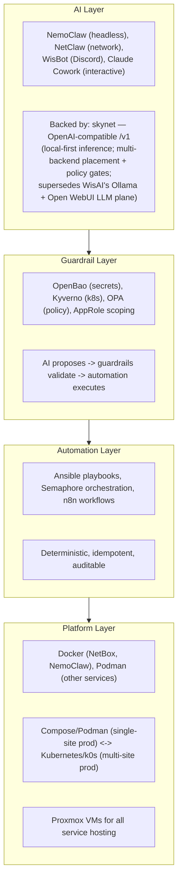
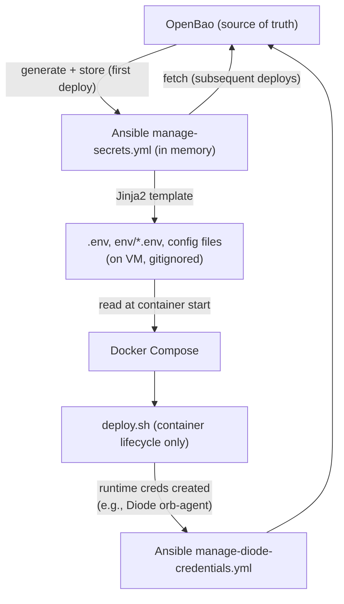

# AGENTS.md — agent-cloud engineering standards (authoritative)

This is the **canonical, authoritative source** for how the agent-cloud platform is
built and operated. Every AI coding agent (Claude Code, Codex, Cursor, …) and every
human contributor MUST conform to the standards below. **`CLAUDE.md` is a symlink to
this file** — there is exactly one source of truth (per the "one codebase, no forks"
principle); edit this file, never fork it.

## Instruction files and architecture references

Before editing a directory, read its applicable `AGENTS.md` files, including nested
ones when working from the repo root. Agent/service directories with existing
`CLAUDE.md` guidance expose it through a relative `AGENTS.md` symlink; edit the
existing source, not a second copy. `agents/websmith/context/AGENTS.md` remains
WebSmith's separate operating manual.

Read [`PRINCIPLES.md`](PRINCIPLES.md), then [`ARCHITECTURE.md`](ARCHITECTURE.md)
and the relevant numbered docs under [`plan/architecture/`](plan/architecture/).
`PRINCIPLES.md` is the architectural tiebreaker; where it is silent, defer to
`plan/architecture/`. Service notes supplement these platform rules: legacy
standalone commands do not authorize bypassing Semaphore or making local secret
files authoritative instead of OpenBao. Keep environment configuration and private
values in `site-config`, as required below.

## Conform to the platform — do not work around it

agent-cloud is **Semaphore-orchestrated, OpenBao-sourced, composable, and
config-as-code**. Do the work *through* those mechanisms — not around them:

- **Deploys/tasks run via Semaphore playbooks** — not manual SSH, not a laptop-run
  container, not one-off commands on a VM.
- **Secrets come from OpenBao** — never hardcoded, never a placeholder left in place,
  never a token passed on a command line or stored outside OpenBao.
- **Config is code** — playbooks, tasks, templates, inventory, blueprints, `.tf`.
  Never ad-hoc API pokes or console clicks for anything reproducible.
- **Changes land through the branch workflow** (`feature → dev → main`, tested on `dev`).

If a mechanism to do something the right way is missing or broken, **build/fix it
properly** (a playbook, task, template, config change) — do not route around it. A
result obtained outside these mechanisms is a **defect even if it "works,"** because
the next person can't reproduce it and it silently drifts from the platform. The one
allowed exception is a clearly-labelled, scoped stopgap under time pressure that
*records its foundational follow-up* (see "Engineering Principles" below); a stopgap
must never masquerade as the real fix.

## Repository Overview

**agent-cloud** is the unified platform monorepo for the uhstray-io privacy-focused AI platform. It consolidates service deployments, AI agent configurations, Ansible playbooks, Kubernetes manifests, and shared libraries into a single public repository.

Private configuration (real IPs, credentials, production inventory) lives in the separate **site-config** repository. This repo contains only templates, placeholders, and code.

## Architecture

### Four-Layer Guardrails Model



### Repository Structure

```text
platform/
  services/<name>/
    deployment/              How to run it (compose, deploy.sh, templates/*.j2)
    context/                 How AI agents interact with it (skills, use-cases, prompts)
  playbooks/                 Ansible orchestration (see playbooks/README.md)
    tasks/                   Composable task library (manage-secrets, deploy-orb-agent, etc.)
  lib/                       Shared bash libraries (common.sh, bao-client.sh)
  inventory/                 Inventory templates (placeholders, no real IPs)
  semaphore/                 Semaphore template definitions + setup playbook
  hypervisor/proxmox/        VM provisioning and cloud-init
  k8s/                       Kubernetes manifests (Kustomize overlays)

agents/<name>/
  deployment/                Agent-specific deploy
  context/                   Agent skills, MCP server configs, architecture docs

plan/                        Architecture, implementation, and composability plans
```

### Sub-directory Documentation

- `platform/services/netbox/deployment/CLAUDE.md` — NetBox + Diode discovery pipeline
- `agents/nemoclaw/deployment/CLAUDE.md` — NemoClaw agent deployment
- `agents/wisbot/deployment/CLAUDE.md` — WisBot Discord agent deployment (pulls prebuilt GHCR image)
- `agents/websmith/CLAUDE.md` — WebSmith website-building agent (prompt-only; produces signed SPEC.md per site)
- `platform/services/uhhcraft/CLAUDE.md` — UhhCraft storefront (first WebSmith-built site)
- `platform/services/tududi/deployment/CLAUDE.md` — tududi to-do app (rootless podman, SQLite, native Authentik OIDC; weft's NocoDB-migration sink)
- `platform/services/honcho/deployment/CLAUDE.md` — honcho memory API (api+deriver+pgvector+redis; JWT `/v3`, Authentik-gated `/docs`; evolve's team-memory backend)
- `platform/services/postiz/deployment/CLAUDE.md` — postiz social publishing (5 containers: app + its Postgres/Redis + Temporal workflow engine + that engine's Postgres; native Authentik OIDC, API-key automation endpoint ungated at the edge for n8n; upstream "Option B" config mount)
- `platform/services/github-runner/CLAUDE.md` — self-hosted GitHub Actions runners (two hosts, one pool; org-scoped `uhstray-selfhosted` group restricted to the five PRIVATE repos — `agent-cloud` deliberately excluded as public; App-signed credential chain minted on the controller because the hosts are firewalled away from OpenBao; per-job containerisation is explicitly NOT an enforced control — read the isolation table before placing anything on a runner host)
- `platform/services/inference-comfyui/CLAUDE.md` — Image-generation sidecar (Flux.1)
- `platform/services/inference-hunyuan3d/CLAUDE.md` — 3D-mesh sidecar (Hunyuan3D)
- `platform/services/dns/context/architecture.md` — hickory-dns internal DNS (zones-as-code; local-dev live, prod planned)
- `platform/services/step-ca/context/architecture.md` — step-ca internal CA (stable root; issues the `*.agent-cloud.test` wildcard Caddy serves; local-dev live)
- `platform/services/authentik/deployment/context/architecture.md` — Authentik central IdP/SSO (server+worker+Postgres+Redis; blueprints config-as-code; local-dev live)
- `platform/services/opa/deployment/context/architecture.md` — OPA policy engine (Guardrail-layer agent-action authorization; Rego policy-as-code under `policies/`; local-dev live, Phase 1 unauthenticated)
- `platform/services/erpnext/deployment/context/architecture.md` — ERPNext ERP (composable slim local tier: db+redis+backend+frontend+worker+scheduler+websocket; MinIO/backup prod-only; local-dev code-complete, deploy pending image pull)
- `platform/services/n8n/deployment/` — n8n workflow automation (composable; stateful `N8N_ENCRYPTION_KEY`; prod migration HELD — see `plan/development/09-service-migrations-tooling.md` + `seed-n8n-secrets.yml`)
- `platform/playbooks/README.md` — Playbook conventions and reference
- `docs/MISTAKES.md` — Recorded mistakes and the rules they earned; each entry names where it is enforced (test, hook, CI, OPA). Read §3 before acting on live state and §1 before calling something verified
- `plan/architecture/01-automation-model.md` — Composable deployment architecture
- `plan/architecture/01-automation-model.md` — Where to use declarative vs imperative automation (two-axis taxonomy, surface classification, FORCED-vs-DEBT, action backlog, AI-loop invariant)
- `plan/archive/development/IMPLEMENTATION_PLAN.md` — Full implementation plan (phases, architecture, decisions)
- `plan/development/06-inference-skynet.md` — Doc reframe: skynet supersedes WisAI's LLM plane + the NemoClaw/OpenClaw framework; preserve OPA + non-LLM sidecars; harvest use-cases into skynet's catalog
- `plan/development/06-inference-skynet.md` — Operational WisAI→skynet inference cutover: feature-parity matrix, phased migration via the OpenBao `secret/services/inference/endpoint` lever, dependency gates (N3/X2/LADDER), rollback, X2 telemetry gap
- `plan/development/03-guardrails-governance.md` — Source-of-truth ADR + development plan: exactly one authority per concern (NetBox=network/IPAM, Git+ArgoCD=desired workload state, k8s API=live, Harbor=images, o11y=telemetry, OpenBao=secrets, OPA/Kyverno=policy); CI-enforceable invariants (reflections read-only, never invert authority, ephemeral state never pollutes IPAM); phased Compose→k8s plan
- `plan/architecture/00-foundation-standards.md` — Master architecture document index and standards
- `plan/architecture/04-credentials-access.md` — Semaphore vs SSH access rules
- `plan/architecture/05-platform-infra.md` — Caddy reverse proxy architecture, TLS/DNS-01 integration, routing patterns, automation gaps
- `plan/architecture/05-platform-infra.md` — Container runtime considerations
- `plan/architecture/03-testing-ci-quality.md` — Security testing requirements
- `plan/architecture/03-testing-ci-quality.md` — Testing standards for new services
- `plan/architecture/skills-recommendation.md` — Claude Code skills for development workflows
- `plan/development/07-websmith-uhhcraft.md` — Multi-phase integration of WebSmith + UhhCraft into agent-cloud
- `plan/development/07-websmith-uhhcraft.md` — Proxmox PCIe passthrough procedure for the two inference VMs
- `LOCAL-DEV-README.md` — Local-dev front door: architecture, quickstart, DNS+TLS access, promotion (user-facing). Operate/triage in `docs/LOCAL-DEV.md`; full design in the plan below
- `plan/development/00-foundation-local-dev.md` — Local dev instance (podman; make bootstraps, local Semaphore operates) + promotion pipeline; **genesis (`make local-bootstrap`) brings up the secure foundation (OpenBao→dns→step-ca→caddy→authentik) directly, then Semaphore LAST already OIDC-secured — §12A**; see also `docs/LOCAL-DEV.md` and `plan/development/00-foundation-local-dev.md`
- `plan/development/00-foundation-local-dev.md` — hickory-dns internal DNS platform service (zones-as-code; decision-gated internal ACME)

The private **site-config** repository has its own `plan/ARCHITECTURE-REFERENCE.md` covering the public/private repo boundary, credential backup policy, and inventory structure.

Defer to those files when working within those directories.

When developing new changes, consult `plan/architecture/00-foundation-standards.md` for document standards and `plan/architecture/02-service-onboarding.md` for the service onboarding checklist. All implementation work should have an implementation plan in `plan/development/` before coding begins.

## Engineering Principles — Foundational Over One-Shot

**Build foundational, repeatable, reusable changes — never monkey patches or one-shot fixes.** This is the platform's core engineering value; the Critical Deployment Rules, the composable task library, and the credential flow below are all instances of it. When you fix or build something, fix it at the level where it generalizes:

1. **Fix the mechanism, not the symptom.** When a problem shows up in one place, find the general cause and fix it where every caller benefits — never special-case the one site. Examples in this repo: the same-path shared deploy dir (`/var/lib/agent-cloud-deploy`) fixed container bind-mounts for *all* local services, not just DNS; the `detect_runtime` `COMPOSE_CMD` fix corrected a latent bug for every service, not just the one that surfaced it.
2. **Everything idempotent and re-runnable.** Bootstrap, deploys, resolver wiring, secret management — re-running must converge, not duplicate or error. If a change isn't safe to run twice, it isn't done.
3. **No manual one-off steps — encode them.** If something had to be done by hand to make it work, it must become a playbook task, a `make` target, a template, or a documented idempotent command before the work is complete. A fix that lives only in your shell history is a defect. (The `/etc/resolver` wiring became `make local-dns-resolver`; ad-hoc API calls are forbidden — config flows through code.)
4. **One codebase, no forks.** Environment differences (local vs prod) are expressed through inventory vars, compose overlays (`compose.local.yml`), and env-parameterized values — never forked files. Forks drift; parameters don't. Prefer extending a shared template/task over copying it.
5. **Reusable building blocks over bespoke glue.** Reach for the composable task library and shared libs (`platform/lib/`) first; if a need recurs, promote it to a reusable task/helper rather than re-implementing per service.
6. **Leave it repeatable for the next person.** Every non-obvious fix carries its *why* (comment or doc) and, where it guards behavior, a test. A workaround that others can't reproduce or understand is tech debt even if it works today.

If a quick patch is genuinely the only option under time pressure, say so explicitly, scope it, and record the foundational follow-up — don't let a one-shot masquerade as the real fix.

## Critical Deployment Rules

1. **All deployments go through Semaphore.** Never SSH into a VM and run `deploy.sh` directly. Semaphore injects OpenBao credentials via its environment.
2. **deploy.sh handles containers only.** No secret generation, no OpenBao interaction. Ansible manages the full credential lifecycle.
3. **Each workflow is independent.** Don't embed optional components (orb-agent, pfsense-sync) into service deploys. Create separate playbooks.
4. **No intermediary secret files.** Secrets flow: OpenBao → Ansible memory → Jinja2 templates → `.env` files (compose-readable, gitignored). No `secrets/` directory on VMs.
5. **Verify before hardening.** Never disable an auth method (SSH password, old credentials) without confirming the replacement works first.

## Secrets Management

### OpenBao as Source of Truth

**OpenBao** manages all credentials. Ansible fetches secrets from OpenBao, templates compose-ready `.env` files, and deploy.sh only reads them. Deploy scripts do NOT generate or manage secrets.

### Policy and Configuration Changes — Code Only

**Never modify OpenBao policies, AppRoles, or Semaphore templates via ad-hoc API calls.** All changes must flow through code:

- **OpenBao policies:** Edit `.hcl` files in `platform/services/openbao/deployment/config/policies/`, then run `apply-policy-<component>.yml` (per-component) or `apply-openbao-policies.yml` (all at once)
- **AppRoles:** Use `tasks/manage-approle.yml` which creates both the policy and role
- **Semaphore templates:** Edit `platform/semaphore/templates.yml`, then run `setup-templates.yml`

This ensures all configuration is version-controlled, auditable, and reproducible.

### Credential Flow (Composable Pattern)



Docker Compose requires `.env` files on disk — this is the minimal bridge between OpenBao and containers. These files are gitignored, overwritten on every deploy, and are NOT the source of truth.

### AppRole Management

Services provision their own AppRoles via `tasks/manage-approle.yml` — no need to modify OpenBao's deploy.sh. The task creates the policy, AppRole, and stores credentials in OpenBao. Semaphore's policy includes `sys/policies/acl/*` and `auth/approle/role/*` for this purpose.

### Credential Handling — discrete functions, scoped `no_log`

**Isolate credential handling into discrete functions/tasks, and reserve `no_log: true` for those.** Secret-bearing steps — OpenBao auth, fetch/generate/resolve/store, `_shared_reads`, templating secret env files — belong in their own tasks (or a dedicated credentials function) carrying `no_log: true`; that keeps secrets out of logs **without** blinding the rest of the run.

- **`no_log` is for credential tasks only.** Do **not** put it on deploys, waits, health checks, verification, or debug displays — there it hides failures and makes Semaphore runs undiagnosable (a past `deploy.sh` failure was censored exactly this way). The fix is *scoping* `no_log` to the credential boundary, not banning or blanket-applying it.
- The reusable `tasks/manage-secrets.yml` is the reference: its auth/fetch/resolve/store/shared-read steps are `no_log`'d; `deploy.sh` and verification are not.

### OpenBao Secrets Layout

| Path | Contents |
|------|----------|
| `secret/services/ssh` | Management SSH key pair |
| `secret/services/ssh/<service>` | Per-service SSH key pairs |
| `secret/services/netbox` | All NetBox secrets (DB, Redis, Diode, Hydra, superuser, orb-agent creds with timestamp) |
| `secret/services/approles/<name>` | AppRole credentials for services (role_id + secret_id) |
| `secret/services/proxmox` | Proxmox API token, URL |
| `secret/services/nocodb` | NocoDB API token, URL |
| `secret/services/n8n` | n8n API key, URL |
| `secret/services/semaphore` | Semaphore API token, URL |
| `secret/services/github` | GitHub PAT |
| `secret/services/discord` | Discord bot token |
| `secret/services/authentik` | Authentik IdP (`secret_key`, bootstrap admin password+token, `db_password`; generated once + reused, stable across redeploys) + per-client OIDC secrets it owns (e.g. `grafana_oidc_client_secret`); clients read shared secrets via manage-secrets `_shared_reads` |
| `secret/services/uhhcraft` | UhhCraft secrets (DB, Redis, MinIO, Stripe secret+publishable, session, Resend, Discord orders+ops webhooks, USPS client id/secret, Printify, Hubs) |
| `secret/services/inference-comfyui` | ComfyUI sidecar (own MinIO root creds, COMFYUI_URL) |
| `secret/services/inference-hunyuan3d` | Hunyuan3D sidecar (own MinIO root creds, model path) |
| `secret/services/step-ca` | Internal CA key-decryption password (`init_password`); the root/intermediate keys live encrypted in the `step-ca-data` volume, NOT here |
| `secret/services/tududi` | tududi session secret + break-glass admin password (the OIDC client secret lives under `authentik`; weft's API token is added post-deploy) |
| `secret/services/honcho` | honcho JWT signing secret + its Postgres password (member-scoped API JWTs land under `secret/services/honcho/tokens/<member>` post-deploy) |
| `secret/services/cloudflare` | Cloudflare edge-as-code: scoped API token, `zone_id`, `caddy_origin_ip`, R2 state-backend S3 endpoint + access keys — read by `apply-cloudflare-tofu.yml` (see "Cloudflare edge as code" below) |
| `secret/services/postiz` | postiz signing secret + its Postgres password + the Temporal Postgres password (all generated once and reused — a new signing secret invalidates every session AND every API key), plus the operator's social-platform application credentials seeded by `seed-postiz-secrets.yml`; the OIDC client secret is shared-read from `authentik` |
| `secret/services/github-runner` | GitHub App private key (`app_private_key`) for the org runner-automation App. The App's OAuth client secret is NOT used and is not stored; the client id is the JWT issuer and is not secret. Read only by the orchestrator — a runner host is denied OpenBao by its own firewall declaration and never holds this |
| `secret/services/ssh/uhhcraft` | Per-service SSH keypair for the UhhCraft VM |
| `secret/services/ssh/inference-comfyui` | Per-service SSH keypair for the ComfyUI GPU VM |
| `secret/services/ssh/inference-hunyuan3d` | Per-service SSH keypair for the Hunyuan3D GPU VM |

## Composable Task Library

All deployment automation is built from reusable Ansible tasks. See `plan/architecture/01-automation-model.md` for the full architecture.

| Task | Purpose |
|------|---------|
| `tasks/manage-secrets.yml` | Fetch/generate secrets from OpenBao, template env files |
| `tasks/manage-diode-credentials.yml` | Create fresh Diode orb-agent credentials via NetBox plugin API |
| `tasks/manage-approle.yml` | Provision OpenBao AppRole + policy for a service |
| `tasks/deploy-orb-agent.yml` | Start privileged orb-agent with vault-integrated config |
| `tasks/clean-service.yml` | Destroy containers, volumes, clone for full rebuild |
| `tasks/clone-and-deploy.yml` | Clone monorepo, run deploy.sh, health check (legacy services) |
| `tasks/place-monorepo.yml` | Put the monorepo on the target (clone in prod, copy the working tree in local-dev) — the shared Phase-1 preamble for composable deploys |
| `tasks/enable-linger.yml` | `loginctl enable-linger` so rootless containers survive a reboot; takes an optional `linger_user` for a dedicated service account |
| `tasks/assert-bao-transport.yml` | Refuse to send secret material over public cleartext. Included by every play that reaches OpenBao — and by any other endpoint that receives a token, via `_assert_url_label` |
| `tasks/site-config-clone.yml` / `tasks/site-config-push.yml` | Clone site-config on a fresh branch with the deploy key the caller read from OpenBao (0600 inside the scratch dir, `IdentitiesOnly`, pinned host keys), then stage one path, commit, push and report names only. The shared path both backup playbooks use; the caller wipes the dir in `always:` |
| `tasks/backup-ssh-key-to-site-config.yml` | Write one SSH keypair into the site-config clone (0600/0644), idempotent, refuses to clobber a differing key. The single implementation shared by the generator and the backup playbook |
| `tasks/wait-for-apt.yml` | Wait for cloud-init and the dpkg lock on a freshly provisioned host, so an install issued right after provisioning does not fail on a transient lock |

`platform/playbooks/tasks/` holds 26 tasks in total; the table above is the curated set
most services compose. `platform/playbooks/README.md` is the fuller reference.

## Independent Workflows

Each deployment concern is its own playbook — independently runnable and retryable:

| Workflow | Playbook | Purpose |
|----------|----------|---------|
| Deploy NetBox | `deploy-netbox.yml` | 5-phase: secrets → containers → app config → Diode creds → verify |
| Deploy Authentik | `deploy-authentik.yml` | Central IdP/SSO (podman): secrets → server+worker+pg+redis → blueprints → verify → Caddy fragment (composable). The verify step **reads the live state back** (`verify-users.py.j2`, run inside the server container): every blueprint this deploy placed must have an API record AND be `successful`, every declared account present + active + in a group, every retired account gone — or the deploy fails. Exists because blueprint application is async in the worker: "files landed" proved nothing about accounts |
| Print User Credentials | `print-platform-user-credentials.yml` | **GATED, and it PRINTS a live credential.** Reads named `<user>_password` fields from `secret/services/authentik` and emits them, so an operator can hand someone their first login. Refuses without `-e i_understand_this_prints_secrets=true`; the secret path is fixed, not a parameter. Semaphore stores task output durably — **delete the task as soon as the credential is captured**. Exists because initial passwords are OpenBao-generated and never seen; the real fix is Authentik enrollment links, which need prod SMTP |
| Deploy OpenHands | `deploy-openhands.yml` | Agent Canvas (Docker; host docker.sock): clone → env → container → verify → Caddy fragment (composable) |
| Clean Deploy OpenHands | `clean-deploy-openhands.yml` | Destructive: wipe openhands-state volume + fresh deploy |
| Deploy tududi | `deploy-tududi.yml` | To-do app (rootless podman): secrets (+OIDC shared-read) → deploy.sh → verify; local adds step-ca trust for OIDC |
| Deploy honcho | `deploy-honcho.yml` | Memory API (rootless podman, 4 containers): secrets (+Gemini shared-read) → deploy.sh → verify |
| Mint honcho Team JWT | `mint-honcho-team-jwt.yml` | Mint the team-workspace `/v3` JWT via `generate_jwt.py` in honcho-api, store at `secret/services/honcho/tokens/team`, verify (all `no_log`; token never printed) |
| Apply Cloudflare Tofu | `apply-cloudflare-tofu.yml` | OpenBao-wrapped `tofu plan/apply` for the Cloudflare edge (WAF + DNS as code, R2 state backend) — see "Cloudflare edge as code" below |
| Create NetBox Device | `create-netbox-device.yml` | Build #1 executor: idempotent NetBox device create + verify on behalf of `netclaw`, from a skynet device-proposal (OPA-gated upstream); `-e dry_run=true` to preview |
| Provision NetBox Automation Token | `provision-netbox-automation-token.yml` | One-time: mint a scoped NetBox API token via the Django shell → `secret/services/netbox:automation_api_token` (idempotent) |
| Deploy Postiz | `deploy-postiz.yml` | Social publishing (rootless podman, 5 containers + the inventory-gated search node `compose.search.yml`, required as of v2.23.0 — the backend registers >3 Text search attributes and SQL visibility caps at 3): secrets (+OIDC shared-read) → render BOTH env files → deploy.sh → verify app AND workflow engine |
| Store Postiz API Key | `store-postiz-api-key.yml` | Capture the app-minted `/api/public/v1` key (the DB column IS the bearer value; minted on first sign-in) into `secret/services/postiz:postiz_api_key` — read from the service's own Postgres, never printed, all key-bearing steps `no_log`. n8n shared-reads it when its workflows land |
| Clean Deploy Postiz | `clean-deploy-postiz.yml` | Destructive: wipe containers + all four volumes + fresh deploy (social accounts need re-authorizing by hand afterwards) |
| Seed Postiz Secrets | `seed-postiz-secrets.yml` | Additively place the operator's social-platform credentials at `secret/services/postiz` (KV-v2 merge-patch; no survey vars — Semaphore persists those, so values are launch-time extra vars) |
| Deploy n8n | `deploy-n8n.yml` | Workflow automation (composable, 4 containers): secrets (stateful `encryption_key` fetched, never regenerated) → cutover guard (on a host still carrying a legacy env file — default `config/n8n.env`, standalone layout via `-e live_n8n_env=` — diff the three stateful values against the rendered .env and REFUSE before any restart on mismatch, names only; the encryption key accepts the legacy `ENCRYPTION_KEY` spelling as a live-name alias) → deploy.sh → verify + seed owner. Community nodes are env-managed: `n8n-nodes-postiz` pinned name+version+checksum in `n8n.env.j2`, reconciled at start, UI installs disabled |
| Seed n8n Secrets | `seed-n8n-secrets.yml` | Migration Task 0 for the EXISTING prod n8n: read the live env file (default `config/n8n.env`; the standalone prod layout passes `-e live_n8n_env=`), pre-seed `encryption_key` + both Postgres passwords into `secret/services/n8n` so the first composable deploy FETCHES them — re-keying bricks every stored workflow credential. Accepts the legacy `ENCRYPTION_KEY` spelling; refuses a file carrying both. Non-destructive; skip for greenfield |
| Back Up n8n DB | `backup-n8n-db.yml` | Timestamped `pg_dump` of an n8n Postgres container into an owner-only (0700) dir on the VM — the rollback artifact for n8n's one-way startup migrations. Run before EVERY `n8n_image` bump; the cutover points it at the legacy project via `-e n8n_pg_container=`. Read-only against DB and store; each run writes a NEW file |
| Restore n8n DB | `restore-n8n-db.yml` | DESTRUCTIVE: overwrite the composable stack's n8n database with a named dump (`-e n8n_dump_file=` REQUIRED — never "the latest"). Stops app containers → `--single-transaction` + `ON_ERROR_STOP` restore (failure rolls back) → starts them → waits for `/healthz`; n8n re-runs migrations at boot, so restoring an older dump under a newer image IS the upgrade path |
| Clean Deploy n8n | `clean-deploy-n8n.yml` | Destructive: wipe containers + volumes (workflows, executions, n8n_data) + fresh deploy; stored credentials survive only because the SAME encryption key comes back from OpenBao |
| Store n8n API Key | `store-n8n-api-key.yml` | Mint (owner session, `POST /rest/api-keys` — the public `/api/v1` has no mint route) AND capture n8n's API key into `secret/services/n8n:n8n_api_key`. Works for an MFA-enabled owner: when `secret/services/n8n:owner_totp_secret` exists, `files/totp.py` (RFC 6238, stdlib) computes the `mfaCode` on the runner — seed via stdin, never argv. Owner identity: `n8n_owner_email` + `owner_password` in OpenBao (a migrated instance's owner is a real person, not the greenfield-seeded account). DB-first idempotency: re-runs recapture from `user_api_keys` (stores the raw JWT; verified at n8n@2.25.7) instead of re-minting. Never printed; key-bearing steps `no_log` |
| Store tududi API Token | `store-tududi-api-token.yml` | Mint AND capture tududi's sync API token into `secret/services/tududi:api_token` — for the user named by `tududi_sync_user_email` (inventory), which MUST be the person who owns the mapped projects: tududi scopes every list per user and a task the token creates is invisible to a project owner who is not the token's user, so a service account cannot carry GitHub-origin tasks into anyone's project (contract: `platform/services/tududi/context/github-sync-contract.md`). The deploy is SSO-only by design, so the mint is DB-SIDE: `files/tududi-db-mint.js` runs inside the container through the app's own sequelize models + bcrypt (matching v1.1.1's createApiToken exactly), raw token via stdin, PROVEN by a live Bearer call before capture. Non-destructive: one INSERT + the app's own reversible revoked_at on our-label rows. Token-bearing steps `no_log` |
| Refresh tududi-sync GitHub Token | `refresh-tududi-sync-github-token.yml` | GitHub App installation tokens live ONE HOUR: mint a fresh one on the controller (App key from `secret/services/github` via stdin, `github_app_token.py`), preflight the installation covers EXACTLY the mapped repos (named refusal on drift — caught a real 2-repo over-scope on its first run), PATCH the n8n `github-sync-api` credential in place. Update-only; runs on a 45-minute Semaphore SCHEDULE declared as code (`schedule:` in templates.yml) |
| Provision tududi-github Sync | `provision-tududi-github-sync.yml` | Place the whole tududi↔GitHub sync: live-validate BOTH provider credentials (named refusals before any engine write), upsert the two named n8n credentials (domain-pinned), render the cycle workflow from the committed nine-pair mapping + embedded sync core, upsert/activate by name, prune owned (prefix-scoped) objects the declaration no longer implies — an all-disabled mapping prunes everything owned (the specified rollback). Kill switch `-e sync_enabled=false` deactivates BEFORE any validation. The cycle creates from EITHER origin — a tagged task becomes an issue, a human-filed open issue becomes a tagged task — and an item existing on both sides under one title is ADOPTED into one linked pair, never duplicated; ambiguous, dangling or duplicated linkage is a named recovery error. One level of native HIERARCHY crosses both ways (tududi subtasks ↔ GitHub sub-issues), a subtask INHERITING its parent's sync tag because tududi 1.1.1 offers no way to tag one; PRIORITY syncs against GitHub's native org-level Priority field, with `Urgent` folded onto tududi's `high` at the projection so it can never be demoted; GitHub-origin work lands PLANNED (contract: `platform/services/tududi/context/github-sync-contract.md`). A real pair is enabled only on the instance whose tududi holds its project — a local-dev cycle against a real repo leaves markers prod cannot resolve |
| Verify tududi-github Sync | `verify-tududi-github-sync.yml` | The per-pair PROMOTION GATE (change task 5.1), read-only. For every enabled pair it assembles the same snapshot the cycle reads — tududi tasks flattened with their subtasks, GitHub issues with their id, sub-issue parent and native field values, both from one GraphQL query per repo — and runs the EXACT embedded engine (`lib/verify-pair.js` inside the tududi container). PASS requires the last n8n cycle green, the engine emitting zero ops AND zero recovery errors on a fresh snapshot, and no sync marker on a task in an undeclared project. Its projection must mirror the workflow's or the two render different verdicts from the same engine — a gate blind to subtasks reported three converged pairs as dangling markers |
| Provision n8n Postiz Credential | `provision-n8n-postiz-credential.yml` | Upsert the ONE `postizApi` credential in n8n: authenticate with `n8n_api_key`, shared-read `secret/services/postiz:postiz_api_key` (single custody — never copied), HTTP-Request-node usage pinned to the Postiz host, `is-connected` tested (self-healing PATCH on key rotation; `-e allow_degraded_test=true` when Postiz is known down). Report restates the 90/hour creation ceiling |
| Deploy GitHub Runner | `deploy-github-runner.yml` | Install + register one self-hosted runner: prereqs (incl. `acl`) → unprivileged account asserted sudo-less → pinned artefacts verified against their published digests → registration token minted ON THE CONTROLLER (the host cannot reach OpenBao) → per-job cleanup hook → systemd user service. Idempotent; a re-run leaves an existing registration intact |
| Manage GitHub Runner Group | `manage-github-runner-group.yml` | Converge the org runner group's repository access list as code. REFUSES to run if any declared repo is public. Read-only unless `-e dry_run=false`; convergence REPLACES the list, so a grant made outside the declaration is removed |
| Allocate NetBox IP | `netbox-allocate-ip.yml` | Ask the IPAM authority for free addresses and report the recorded state of named ones. Read-only unless `-e reserve=true`, and reserving takes EXPLICIT addresses — never "the next free one", which two runs a minute apart would resolve differently |
| Resize VM | `resize-vm.yml` | Converge a live VM's cores/memory/disk to the spec declared in `site-config/proxmox/vm-specs.yml` (grow-only disk, opt-in reboot; a run without `allow_reboot` is a safe diff preview) |
| Generate Service SSH Key | `generate-service-ssh-key.yml` | Generate+store a per-service ed25519 key in OpenBao (idempotent; never rotates). Backs the pair up to site-config **in the same run when `site_config_dir` points at a clone** — and says so loudly when it cannot, because a key that exists only in the store leaves nobody able to log in |
| Back Up Credentials to site-config | `backup-credentials-to-site-config.yml` | Copy credentials out of OpenBao into the private repo **on a new branch per backup, without any of them reaching a log**. The runner reads the deploy key from `secret/services/ssh/site-config` with the same AppRole token, clones site-config with it (0600 file inside the scratch dir the play always wipes), writes `secrets/<service>/<field>.txt`, commits and pushes; the task output carries only field NAMES, counts and the branch. The key was seeded into OpenBao ONCE from the operator's copy via `Seed OpenBao Key` with the value as the `BAO_VALUE` environment secret — never a task parameter, which Semaphore persists. Exists because Semaphore v2.17 has no API to clear a task's output while keeping the task — printing would force a choice between a live credential in the orchestrator and destroying the run record. Requires the deploy key's public half registered on the GitHub repo **with write access** |
| Back Up Service SSH Key | `backup-service-ssh-key.yml` | Copy one per-service keypair OUT of OpenBao into site-config (`secrets/ssh/<name>/`) **on a new branch per run**, via the same shared write task the generator uses and the same deploy-key clone/push as the credential backup. Read-only against the store; derives the public half from the private and refuses a mismatched pair; refuses to overwrite a differing file without `-e force_overwrite=true`. Exists because a key that lives only in OpenBao leaves nobody able to log in when the store is unreachable |
| Store SSH Password | `store-ssh-password.yml` | Store the bootstrap login/sudo password in OpenBao (`secret/services/ssh:become_password`) |
| Seed OpenBao Key | `seed-openbao-key.yml` | Idempotently merge ONE key/value into an existing secret path (siblings preserved) — code-managed placement of a shared secret a reader deploy needs (e.g. honcho's `secret/services/nemoclaw:gemini_api_key`) |
| Manage Caddy Sites | `manage-caddy-sites.yml` | **Read** the live Caddyfile (reports every site block, its upstreams, and whether inventory or a hand edit owns it), insert/update the marked block, optionally **retire** hand-maintained blocks (`caddy_retire_sites`) so inventory can adopt that hostname; validate + restart |
| Deploy Orb Agent | `deploy-orb-agent.yml` | Standalone: Diode creds + agent.yaml template + start agent |
| Provision Orb Agent AppRole | `provision-orb-agent-approle.yml` | Code-managed: scoped policy + AppRole from `orb-agent.hcl`, creds → `secret/services/approles/orb-agent` |
| Clean Deploy NetBox | `clean-deploy-netbox.yml` | Destructive: wipe volumes + fresh deploy |
| Distribute SSH Keys | `distribute-ssh-keys.yml` | Deploy keys from OpenBao, verify key auth |
| Harden SSH | `harden-ssh.yml` | NOPASSWD sudo + sshd lockdown (after key verification) |
| Install Docker | `install-docker.yml` | Docker CE from official repo (idempotent) |
| Preflight Target Group | `preflight-target-group.yml` | Assert a target group resolves and its hosts are reachable before a deploy touches them |
| Verify Host Access | `verify-host-access.yml` | Prove KEY-ONLY SSH works before `harden-ssh.yml` withdraws password auth. Refuses to pass on password auth — a false green here is the lockout it exists to prevent |
| Provision VM | `provision-vm.yml` | Clone the template and provision a declared VM. Inventory-first; `-e target_host=` REQUIRED when the group declares more than one host |
| Apply Firewall | `apply-firewall.yml` | Default-deny inbound + optional declarative `firewall_deny_egress` for a semi-trusted host. Anti-lockout: SSH allows precede enable, then a fresh handshake is forced |
| Validate All | `validate-all.yml` | Health check all services |
| Check Secrets | `check-secrets.yml` | Read-only secret inventory from OpenBao |
| Validate Secrets | `validate-secrets.yml` | Test credentials against live services |

Semaphore templates are managed as code in `platform/semaphore/templates.yml`.

### Cloudflare edge as code (OpenTofu)

The Cloudflare zone (WAF rulesets + platform DNS records) is **config-as-code via
OpenTofu**, not dashboard clicks — the standard for all future edge changes. HCL lives in
`platform/infra/cloudflare/` (`versions.tf`, `variables.tf`, `waf.tf`, `dns.tf`,
`imports.tf`); state lives in an **R2 S3-compatible backend** (`uhstray-tfstate` bucket).
`apply-cloudflare-tofu.yml` (Semaphore) reads all config + the scoped API token from
`secret/services/cloudflare`, then runs `tofu plan`/`apply`. Existing objects are **adopted,
not recreated** (import → zero-diff), so the orange-cloud proxy and live rules are never
dropped. The `tofu` binary ships in the Semaphore image.

### Operator-side tools (run from a workstation, NOT a Semaphore job)

A few tools must run outside Semaphore because they act *on* it or need creds Semaphore
shouldn't self-inject. They live in `platform/playbooks/` but take `SEMAPHORE_URL` /
`SEMAPHORE_TOKEN` from the operator's environment:

- `platform/semaphore/bootstrap-semaphore-repositories.yml` — apply `repositories.yml`, which
  declares one Semaphore repository record per branch (`agent-cloud` = `main`, `agent-cloud dev`
  = `dev`). A template then names the record it runs from via `repository:` in `templates.yml`;
  omitting it uses `main`. Idempotent, never deletes, and refuses an SSH clone URL paired with
  no key (which cannot authenticate even to a public repo). Run it BEFORE `setup-templates.yml`
  on a fresh instance.
- `backup-service-ssh-key.yml` is **no longer operator-side** — it is a Semaphore template
  (`Back Up Service SSH Key`) that reads the site-config deploy key from OpenBao, clones the
  private repo with it and pushes a new branch, exactly like the credential backup. It **refuses to overwrite a file
  whose content differs** unless `-e force_overwrite=true` — a private key is not
  regenerable from its public half.
  Why it exists: `generate-service-ssh-key.yml` mints INTO the store and
  `distribute-ssh-keys.yml` authorizes the public halves on the host, so without this
  nothing ever moves a pair outward — and the operator half of the two-path access proof
  that gates `harden-ssh.yml` becomes impossible to perform.
- `set-semaphore-branch.yml` — **deprecated** in favour of the above. It flipped one shared
  record's `git_branch`, which is global mutable state: concurrent testers overwrite each other
  and later runs silently use whatever branch was left set. Kept only as a manual one-record fix.
- Both default to `http://localhost:3000` (an SSH-local tunnel), never the Cloudflare-walled
  public URL. Never have Semaphore restart or reconfigure its own container from a Semaphore
  job (circular) — use the operator-side path.

## Container Runtime

- **Docker**: Required for NetBox (privileged orb-agent, bind-mount secrets, compose health dependencies). NetBox's `lib/common.sh` is hardcoded to Docker.
- **Podman**: All other services (rootless, security-focused)
- Set `container_engine` in the site-config inventory per host

## Deployment Status

### Completed
- **Phase 0-0.5**: Foundation + per-VM deployment
- **Monorepo consolidation** — two repos: agent-cloud (public) + site-config (private)
- **SSH hardening** — per-service ed25519 keys, password disabled, NOPASSWD sudo
- **Semaphore pipeline** — 78 declared task templates (plus generated `(Dev)` variants), SSH key auth
- **NetBox deployed** — full stack with Diode discovery pipeline, orb-agent with OpenBao vault integration, 32 IPs + pfSense device discovered
- **Authentik deployed (prod)** — central IdP/SSO at `auth.uhstray.io` (own VM, podman); akadmin + `stray` + `svc-automation` service account; blueprints (groups, OIDC, forward_auth, SSO bindings) applied
- **OpenHands deployed (prod)** — Agent Canvas at `canvas.uhstray.io` (own VM, Docker, host docker.sock runtime), gated by Authentik forward_auth at the central Caddy
- **Caddy (flat-Caddyfile site)** — `auth`/`canvas` routes managed via `manage-caddy-sites.yml` (tls internal); composable Phase-4 fragment distribution gated behind `caddy_composable`
- **Caddy routes are readable** — `platform/services/caddy/deployment/lib/caddyfile_sites.py` parses the live Caddyfile so routes can be compared against the inventory declaration. Routes that arrived by hand are migrated into `caddy_managed_sites` by listing them in `caddy_retire_sites`; Caddy rejects a hostname defined twice, so the old block must go in the same pass. Six routes (`nocodb`, `n8n`, `pve`, `netbox`, `devlog`, `semaphore`) were hand-maintained when this landed — `devlog` was the first adopted, after it was found pointing at an address declared for a different host
- **Composable automation** — manage-secrets, manage-diode-credentials, manage-approle, deploy-orb-agent all working
- **pfSense sync** — runs as an orb-agent worker on a 15-minute cadence (no separate playbook); `platform/services/netbox/deployment/lib/pfsense-sync.py`
- **tududi + honcho deployed (prod)** — to-do app at `todo.uhstray.io` (native Authentik OIDC) and memory API at `memory.uhstray.io` (JWT `/v3` + Authentik-gated `/docs`), both composable rootless-podman deploys
- **Cloudflare edge as code** — WAF rulesets + platform DNS adopted into OpenTofu (R2 state backend), applied via `apply-cloudflare-tofu.yml`; API-first is now the standard for edge changes
- **Postiz validated (local) — prod rollout PENDING** — social publishing (5 containers: app + its Postgres/Redis + Temporal workflow engine + that engine's Postgres), native Authentik OIDC, API-key automation endpoint for n8n. The full chain is proven on local-dev only; verified 2026-09-02: `secret/services/postiz` is empty on prod OpenBao and postiz.uhstray.io unanswering — the prod deploy, sign-in and key capture are still ahead (they also unblock the n8n→Postiz credential provisioning)
- **Self-hosted GitHub Actions runners (prod)** — `gh-runner-01` + `gh-runner-02`, one interchangeable pool, org-scoped to the FIVE PRIVATE repos via the `uhstray-selfhosted` group; `agent-cloud` deliberately excluded because it is public. Workflows opt in with `runs-on: [self-hosted, linux, x64, uhstray-lan]`. Enforced isolation is workspace destruction between jobs, no host administration from a job, and network-level egress denial — **per-job containerisation and process reaping are NOT enforced**, so nothing may sit on a runner host that all five repos are not entitled to read (see `platform/services/github-runner/CLAUDE.md`)
- **n8n composable cutover (prod, 2026-09-02)** — prod n8n migrated in place from the standalone legacy compose project to the composable stack on the pinned 2.25.7: stateful secrets pre-seeded from the live `.env` (alias-aware — the legacy file spells the key `ENCRYPTION_KEY`), data moved by `backup-n8n-db.yml` → `restore-n8n-db.yml` (staging-database restore; the standing upgrade/rollback tooling), worker readiness-gated behind the app's boot migrations, all 4 workflows + members preserved, API key minted through the owner's TOTP-MFA login and captured to OpenBao. Retirement executed the same day on the operator's call: the legacy project (containers, volumes, directory) and the cutover dump are DELETED — superseded by a fresh composable-stack dump and an 11-field credential backup to site-config (`backup/n8n-20260902T135450Z-eff2ab`). The n8n→Postiz credential provisioning waits on the Postiz prod rollout

### In Progress
- NocoDB decommission — NocoDB is **RETIRED** (replaced by tududi; decision 2026-09-01, recorded on PR #15's close-out and in `plan/development/09-service-migrations-tooling.md`). It still runs via the legacy `deploy.sh` path; taking it down (containers, volumes, route, `generate_nocodb_env()`) is scoped as its own change — do NOT execute the old migration plan against it. (The n8n half of that plan **executed 2026-09-02**: see "Completed" below.)
- Dedicated orb-agent AppRole — provisioning is now code-managed via `provision-orb-agent-approle.yml` (creates the scoped policy + AppRole from `orb-agent.hcl`, stores creds at `secret/services/approles/orb-agent`); pending a run against live OpenBao to replace the manually-created credentials
- **Build #1 (netbox-device-add)** — skynet-requested, OPA-gated NetBox device create landed on `dev` (`create-netbox-device.yml` executor + verify, `provision-netbox-automation-token.yml`, `skynet` OPA catalog entry); deferred fast-follows: `primary_ip` assignment, automation-token view/add least-privilege split

### Planned
- **Phase 1**: NemoClaw task automation
- **Phase 2**: Claude Cowork workflows
- **Phase 3**: Cross-agent coordination
- **Kubernetes**: k0s, Kustomize, ArgoCD, Harbor

## Git Conventions

- **No AI attribution** in commits
- **No credentials, IPs, or usernames** in committed files — use `{{ }}` template variables
- IPs and real credentials belong exclusively in site-config (private)

### Branch Workflow

> **NEVER push, open a pull request, or merge one unless the user explicitly authorizes that
> specific action — every push, every PR, every merge, every time.**
> Agents may create a branch and commit locally, but **push, `gh pr create`, and `gh pr merge`
> are each user-gated actions**: stop and ask ("branch ready — push it? open the PR?"). An
> approval covers exactly the actions it names, on the branch/PR it names — a previously
> approved sibling cycle authorizes nothing (`docs/MISTAKES.md` §5.7). This applies to
> feature→`dev` PRs and `dev`→`main` promotion PRs alike, and to pushing follow-up commits
> to a PR already under review.

**Promotion cycle: `<feature-branch>` → `dev` → `main` (production). All changes go through pull requests — never push directly to `main` or `dev`.**

- `main` is the production branch — Semaphore deploys from it.
- `dev` is the permanent integration branch — feature work merges here first and is validated (locally per `LOCAL-DEV-README.md` / `plan/development/00-foundation-local-dev.md`, and/or via prod branch deploys per `plan/architecture/03-testing-ci-quality.md`) before promotion to `main`.

1. Create a feature branch from `dev`: `git checkout dev && git checkout -b <type>/<description>` (types: `feat`, `fix`, `docs`, `ci`, `refactor`, `chore`, `security`)
2. Commit changes on the feature branch
3. **Before creating a PR**, update documentation:
   - Update the top-level `README.md` if the PR adds features, services, or changes the repo structure
   - Update the most relevant sub-directory `README.md` or `CLAUDE.md` for the area changed
   - Update the root `CLAUDE.md` if the PR adds new conventions, plans, or cross-cutting patterns
4. Run `/simplify` and `/security-review` on the branch changes
5. Push the branch: `git push -u origin <type>/<description>`
6. Create a PR **into `dev`**: `gh pr create --base dev`
7. Wait for **all PR checks** (CodeRabbit, CI, linters) to complete
8. Address all review findings and push fixes
9. Confirm all checks pass after fixes
10. Only then merge the PR into `dev` — use a **merge commit** (`gh pr merge --merge`), NOT squash. Preserving each feature branch's real commits on `dev` keeps `dev`↔`main` ancestry intact. **Squash a feature→`dev` merge only** to collapse a branch whose history accidentally contains something sensitive (secrets/credentials) you don't want preserved.
11. **Promotion to production**: once the `dev` changes are validated, open a `dev` → `main` PR and merge it with a **merge commit** (`gh pr merge --merge`), NOT squash. Sharing `dev`'s real commits on `main` keeps the branches' ancestry intact, so promotions never diverge and you never hand back-merge. **Squash a promotion only** to scrub a branch whose history accidentally contains something sensitive. A GitHub Action (`.github/workflows/sync-main-to-dev.yml`) keeps `dev` current with `main` after every promotion (see "Why the auto-sync" below).

**Never merge a PR before its checks have completed and passed.** This applies to all development — new features, bug fixes, plan updates, documentation changes — and to promotion PRs from `dev` to `main`.

**Why the auto-sync (`main` → `dev`).** Merge-commit promotions keep `dev`↔`main` ancestry intact, so promotions no longer diverge (this is what historically forced a manual back-merge: a *squashed* `dev` → `main` writes dev's content onto `main` as a new commit with no ancestry into `dev`, freezing the merge-base and conflicting the next promotion on files like `templates.yml`). The sync workflow still earns its keep: it carries `main`-only changes — e.g. dependabot bumps that land directly on `main` — back into `dev`, and is the safety net if a promotion ever lands as a squash (the sensitive-content case), which *would* reintroduce the divergence. On every push to `main` it merges `main` into `dev` favoring `dev` (`-X ours`, so dev's content is unchanged; non-conflicting `main`-only changes propagate) and pushes `dev`.

**Enforcement.** On `main` this is no longer convention alone — it is mechanically enforced by the `protect-main` repository ruleset (config-as-code in `.github/rulesets/`): no direct or force pushes, no deletion, PR required, review conversations resolved, and the `Static Analysis` / `Security Scan` / `Unit Tests` checks must pass; merges into `main` allow **merge commits (the default) or squash**, and linear history is NOT required — so `dev` → `main` promotions are merge commits (use squash only to scrub accidental sensitive content). (`dev` itself is not push-protected — the sync workflow pushes to it.) (The ruleset currently runs in `evaluate`/dry-run — it logs would-be violations rather than blocking — and flips to `active` after Insights verification; see `.github/rulesets/README.md`.) The sole bypass actor is the Repository admin role (break-glass) — AI agents (NemoClaw, Claude Code) and automation PATs have no bypass path. See `.github/rulesets/README.md` and `plan/development/03-guardrails-governance.md`.

### Test check on push (`.githooks/pre-push`)

`core.hooksPath=.githooks` also activates a **pre-push** hook that ATTEMPTS the BATS suite
and pytest, with the same test paths, working directory and `PYTHONPATH` as CI. No install
step; live as soon as `make git-setup` has been run.

`bats platform/tests/` is byte-identical to CI's; the pytest run is not — CI pins Python
3.11 and installs the test dependencies, while the hook uses whatever `python3` is on your
`PATH`.

**Two different gates, on two different things.** The hook blocks *your push* when a suite
runs and fails. CI blocks *the merge*. Neither substitutes for the other: a green push
means the suites passed on your machine or were skipped, which is not evidence CI will
pass — and CI never sees a push the hook stopped.

It skips, with a message, when `SKIP_TESTS=1` is set, when `bats` is not installed, when
the Python suite is not collectable because pytest or a test dependency is missing, and on
a branch-deletion push. Failing open like that is deliberate and the opposite of the
pre-commit secret gate, which fails closed: a leaked secret is irreversible, a skipped test
is not. Escape hatch, for a reason you can defend in review: `SKIP_TESTS=1 git push`.

Why push and not commit: the suite is ~40s for 500+ tests, which on every commit is
friction people route around with `--no-verify` — turning a gate into a habit of
bypassing gates. Why it exists at all: `docs/MISTAKES.md` §5.2 records committing with a
failing test, enforced only by convention, and §5.5/§5.6 record it recurring three more
times. The pre-commit gates cover secrets, IPs, credentials, `.env`, whitespace, YAML and
keys — nothing about tests, so there was no gate to pass.

Failing open is the deliberate opposite of the pre-commit secret gate, which fails closed.
A leaked secret is irreversible; a red test is not, and CI blocks the merge either way.
Escape hatch, for a reason you can defend in review: `SKIP_TESTS=1 git push`.

### Mandatory Pre-Push Audit

Run as a **separate step** before every commit. Review the output. Then commit separately.

```bash
# 1. Stage files
git add <files>

# 2. Quick first-pass grep (private IPs across ALL RFC1918 ranges + common secret shapes).
#    Review every hit; the greps below are a fast smoke test, NOT the authoritative gate.
git diff --staged | grep -iE '^\+.*(10\.[0-9]|192\.168\.|172\.(1[6-9]|2[0-9]|3[01])\.)' | grep -viE 'target|host:|subnet|scope|example|placeholder'
git diff --staged | grep -iE '^\+.*(password|secret|token|api[_-]?key|bearer)\s*[:=]\s*\S{8}'
git diff --staged | grep -iE '^\+.*/(Users|home)/[a-z0-9._-]+/'   # machine paths leak usernames

# 3. Run the authoritative scanner (same tool the CI Security Scan uses) — this, not the
#    greps above, is what decides "clean". It catches IP ranges, tokens, JWTs, keys, usernames.
trufflehog git file://. --since-commit HEAD --only-verified --fail

# 4. Only after BOTH are clean: commit and push
```

## Adding a New Service

Follow `plan/architecture/01-automation-model.md`:

1. Create `platform/services/<name>/deployment/deploy.sh` — container operations only
2. Create `platform/services/<name>/deployment/templates/*.j2` — Jinja2 env file templates
3. Add host to site-config inventory with `service_name`, `monorepo_deploy_path`, `service_url`
4. Create `deploy-<name>.yml` using composable tasks: `manage-secrets` → deploy.sh → verify
5. Define `_secret_definitions` and `_env_templates` for the service
6. Create `clean-deploy-<name>.yml` using `tasks/clean-service.yml`
7. Add Semaphore template to `platform/semaphore/templates.yml`, run `setup-templates.yml`
8. Generate SSH key pair, store in OpenBao, run `distribute-ssh-keys.yml` — then confirm the
   pair reached site-config (`generate-service-ssh-key.yml` does it when given
   `site_config_dir`; otherwise run the `Back Up Service SSH Key` template). A key that exists only
   in OpenBao cannot be used from a workstation, which blocks hardening
9. Optionally provision an AppRole via `tasks/manage-approle.yml`

## Operational Access

When a task requires credentials (Semaphore API, NetBox API, OpenBao tokens, etc.), check `site-config/secrets/` first and ask the user if you can use those credentials rather than telling the user to do it manually. Production credentials for all services are backed up in the private **site-config** repository (clone it next to this repo); use its documented `secrets/` paths.

Key paths:
- `site-config/secrets/semaphore/semaphore_api_token.txt` — Semaphore API token
- `site-config/inventory/production.yml` — service URLs, host IPs, inventory vars

## Testing and Linting

Every PR into `dev` or `main` is gated by GitHub Actions CI (`.github/workflows/lint-and-test.yml`):

- **Static Analysis**: ruff (Python), shellcheck (Bash, warning severity), ansible-lint (playbooks), yamllint (YAML), hadolint (Dockerfiles), terraform fmt (HCL policies)
- **Security Scan**: trufflehog (secrets), bandit (Python security), IP/credential grep
- **Unit Tests**: pytest (100 tests, Python 3.11 — collected from `testpaths` in `pyproject.toml`, run from the repo root so adding a suite is one line there), BATS (Bash — `bats -c platform/tests/*.bats` prints the current count; the number is deliberately not written here, because a hardcoded count conflicted on every branch merge)

Config files: `pyproject.toml` (ruff, pytest), `.ansible-lint`, `.yamllint.yml`

Tests: `platform/services/netbox/deployment/tests/` (Python), `platform/tests/` (BATS)

**Writing a BATS test:** see "Writing BATS Tests" in `CONTRIBUTING.md`. In short — assert
absence with `refute_grep` (a `!`-inverted command mid-body cannot fail under `set -e`, and
`grep -v -q` passes when the string IS present), scope each assertion to the task or
function it is about rather than the whole file, never assert a property of a randomly
generated value, and mutate the guarded code once to watch the test go red. Each rule is an
incident in `docs/MISTAKES.md` §2.

See `plan/architecture/03-testing-ci-quality.md` for the full testing strategy, local
setup, and the pre-PR checklist. (This previously pointed at `docs/LINTING-AND-TESTING.md`,
which does not exist — the content lives in the numbered architecture doc.)

### Sub-directory Documentation (additional)

- `plan/architecture/03-testing-ci-quality.md` — Full testing strategy and implementation status
- `plan/architecture/03-testing-ci-quality.md` — Branch deploy and validation workflow
- `plan/development/03-guardrails-governance.md` — Branch protection & rulesets plan (config-as-code `protect-main`; evaluate→active rollout; CI-gated merges)
- `.github/rulesets/README.md` — Branch protection rulesets as config-as-code (`protect-main.json` + idempotent `apply.sh`)
- `plan/architecture/02-service-onboarding.md` — Service onboarding checklist
- `plan/architecture/04-credentials-access.md` — Secret generation, storage, rotation, and retirement
- `plan/architecture/skills-recommendation.md` — Claude Code skills for development workflows

## Dependencies

Ansible collections (auto-installed from `collections/requirements.yml`):
- `community.hashi_vault` — OpenBao/Vault lookups
- `ansible.posix` — `authorized_key` module

Controller Python packages (`platform/requirements-controller.txt`) — used only by
playbooks running on localhost, never installed on a service VM:
- `cryptography` — RS256 signing for the GitHub App credential chain
  (`platform/lib/github_app_token.py`). Declared because it was previously assumed to
  arrive with the collections; an undeclared dependency that vanishes on an image rebuild
  fails inside a `no_log` boundary, where the symptom is an unexplained credential error.

Shared bash libraries:
- `platform/lib/common.sh` — logging, secret helpers, compose wrapper, health checks
- `platform/lib/bao-client.sh` — HTTP-based OpenBao API client (curl + jq)

## Memory & specs — which store owns a fact

This block is self-contained on purpose: it has to work in this repo without
reaching for a file in another one. A user-scope routing policy, where the
operator has one, takes precedence — this is the repo-level default.

| Store | Holds | Never holds |
|-------|-------|-------------|
| **codebase-memory graph** (`.codebase-memory/graph.db.zst`, committed; project `agent-cloud`) | What the code **is** — call graphs, blast radius, where something is defined, routes, dead code | Why anything was done |
| **Hindsight bank** `agent-cloud-750a33b9` | **Why** — decisions, why the rejected alternatives lost, failures with root cause, outcomes | Code structure; credential values |
| **OpenSpec** store `agent-cloud`, rooted at `plan/development` | `specs/` = what the system **should** do · `changes/` = what we are changing now, with its public rationale | Whether a change worked afterwards |
| **`plan/architecture/`** (numbered docs) | Ratified architecture decisions — the repo's own record convention | Deliberation; anything a spec already states |
| ~~`.claude/memory/`~~ | Retired from routing; kept as history | New knowledge — nothing routes here |

**One-time per clone: `make git-setup`.** It sets `merge.ours.driver=true` and
`core.hooksPath=.githooks`. Both are repo-local git config, so neither can be committed.
The first matters because `ours` is **not** a built-in merge driver — the `merge=ours`
attribute on the graph artifact is inert without it, so a concurrent re-index would
produce a binary conflict that looks like the attribute simply failed. The second
activates the capture hooks, the secret-scanning gate, and the pre-push test check.

**Read routing.** Try the graph **first** for anything derivable from source —
it is free, deterministic, and sub-millisecond. Go to the bank for rationale,
preferences, past attempts and outcomes. Grep and file-reading are the last
resort, for verifying something a graph query already pointed at.

**Translate; do not substitute.** The graph names things with identifiers; the
bank names them with domain concepts, because the write rules strip identifiers
out of memories. So the sequence has three steps, not two: query the graph for
the real identifiers → say what that **is**, in domain terms → recall with the
domain terms. Querying the bank with identifiers retrieves almost nothing.
Either order is legal; concepts survive refactors that rename functions, which
is what makes them the better join key.

**Write routing.** A decision reached, a task finished, an approach abandoned →
retain into the bank: the decision and why the rejected options lost, a failure
and its actual root cause, an outcome labelled plainly **worked / dead end /
corrected**, a constraint discovered the hard way. One clean self-contained
paragraph per retain — the bank is in `verbatim` mode, so what you send is what
is stored, and keeping code structure out is the writer's job, not the store's.
Use `sync_retain`; a plain `retain` returns an acceptance receipt, not a
confirmed write. **Always pass an explicit `bank_id`** — omitting it silently
targets a `default` bank that no scoped read ever queries.

**Never retain into the bank:** file paths, function or class names, signatures,
call relationships, dependency lists, or anything else regenerable from source;
whole file contents or long diffs; credential values or real IP addresses (those
belong in OpenBao and in the private site-config repo). Retaining code structure
here is the one failure mode that breaks this architecture — it looks useful,
goes stale on the next commit, and then the two stores disagree with no signal
saying which to trust.

**On archive, retain the outcome.** `openspec archive <change>` records that a
change completed; it does **not** record whether it *worked*, and that gap is
this repo's highest-value memory. When you archive, retain one memory into the
bank: the outcome labelled worked / dead end / corrected, the root cause of
anything that failed, and any constraint discovered along the way.

**Drift check.** `openspec list --specs --store agent-cloud` is intent; the
graph's architecture summary is reality. Compare them deliberately and
periodically. Divergence is **information, not a conflict to reconcile** — it
means the specs or the code moved and nobody wrote it down.

**Do not use the graph tool's own ADR store.** It writes into the disposable
index, never reaches the shareable artifact, and any codebase change hard-deletes
it on the next index. Every `index_repository` response carries an `adr_hint`
recommending it; that is the tool's suggestion, not a reason to follow it.
Ratified decisions go in `plan/architecture/`.
