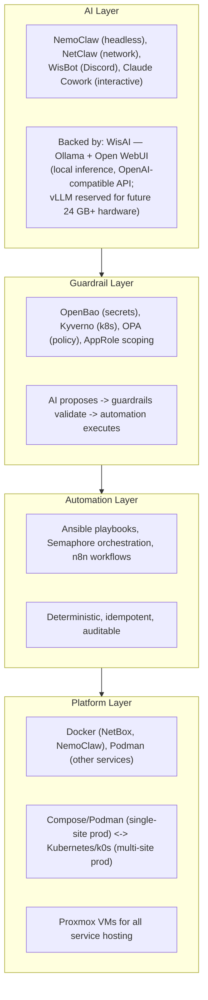
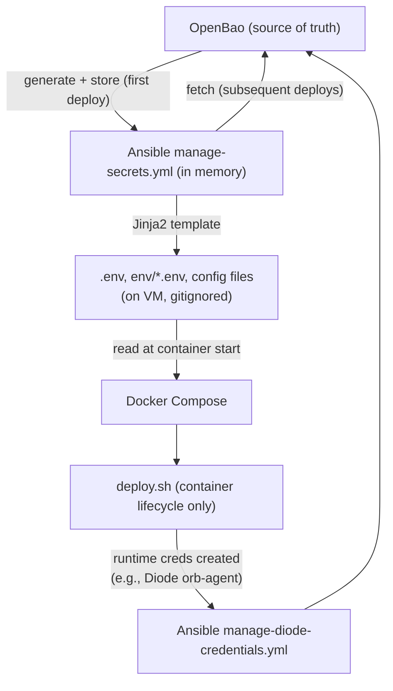

# CLAUDE.md

This file provides guidance to Claude Code (claude.ai/code) when working with code in this repository.

## Repository Overview

**agent-cloud** is the unified platform monorepo for the uhstray-io privacy-focused AI platform. It consolidates service deployments, AI agent configurations, Ansible playbooks, Kubernetes manifests, and shared libraries into a single public repository.

Private configuration (real IPs, credentials, production inventory) lives in the separate **site-config** repository. This repo contains only templates, placeholders, and code.

## Architecture

### Four-Layer Guardrails Model



### Repository Structure

```
platform/
  services/<name>/
    deployment/              How to run it (compose, deploy.sh, templates/*.j2)
    context/                 How AI agents interact with it (skills, use-cases, prompts)
  playbooks/                 Ansible orchestration (see playbooks/README.md)
    tasks/                   Composable task library (manage-secrets, deploy-orb-agent, etc.)
  lib/                       Shared bash libraries (common.sh, bao-client.sh)
  inventory/                 Inventory templates (placeholders, no real IPs)
  semaphore/                 Semaphore template definitions + setup playbook
  hypervisor/proxmox/        VM provisioning and cloud-init
  k8s/                       Kubernetes manifests (Kustomize overlays)

agents/<name>/
  deployment/                Agent-specific deploy
  context/                   Agent skills, MCP server configs, architecture docs

plan/                        Architecture, implementation, and composability plans
```

### Sub-directory Documentation

- `platform/services/netbox/deployment/CLAUDE.md` — NetBox + Diode discovery pipeline
- `agents/nemoclaw/deployment/CLAUDE.md` — NemoClaw agent deployment
- `agents/wisbot/deployment/CLAUDE.md` — WisBot Discord agent deployment (pulls prebuilt GHCR image)
- `agents/websmith/CLAUDE.md` — WebSmith website-building agent (prompt-only; produces signed SPEC.md per site)
- `platform/services/uhhcraft/CLAUDE.md` — UhhCraft storefront (first WebSmith-built site)
- `platform/services/inference-comfyui/CLAUDE.md` — Image-generation sidecar (Flux.1)
- `platform/services/inference-hunyuan3d/CLAUDE.md` — 3D-mesh sidecar (Hunyuan3D)
- `platform/services/dns/context/architecture.md` — hickory-dns internal DNS (zones-as-code; local-dev live, prod planned)
- `platform/services/step-ca/context/architecture.md` — step-ca internal CA (stable root; issues the `*.agent-cloud.test` wildcard Caddy serves; local-dev live)
- `platform/services/authentik/context/architecture.md` — Authentik central IdP/SSO (server+worker+Postgres+Redis; blueprints config-as-code; local-dev live)
- `platform/playbooks/README.md` — Playbook conventions and reference
- `plan/architecture/AUTOMATION-COMPOSABILITY.md` — Composable deployment architecture
- `plan/architecture/AUTOMATION-DECLARATIVE-VS-IMPERATIVE.md` — Where to use declarative vs imperative automation (two-axis taxonomy, surface classification, FORCED-vs-DEBT, action backlog, AI-loop invariant)
- `plan/development/IMPLEMENTATION_PLAN.md` — Full implementation plan (phases, architecture, decisions)
- `plan/architecture/architecture-reference.md` — Master architecture document index and standards
- `plan/architecture/ACCESS-BOUNDARIES.md` — Semaphore vs SSH access rules
- `plan/architecture/CADDY-REVERSE-PROXY.md` — Caddy reverse proxy architecture, TLS/DNS-01 integration, routing patterns, automation gaps
- `plan/architecture/PODMAN-VS-DOCKER-COMPOSE.md` — Container runtime considerations
- `plan/architecture/SECURITY-TESTING-STANDARDS.md` — Security testing requirements
- `plan/architecture/CI-TESTING-SPECIFICATION.md` — Testing standards for new services
- `plan/architecture/skills-recommendation.md` — Claude Code skills for development workflows
- `plan/development/WEBSMITH-INTEGRATION-PLAN.md` — Multi-phase integration of WebSmith + UhhCraft into agent-cloud
- `plan/development/UHHCRAFT-GPU-PASSTHROUGH.md` — Proxmox PCIe passthrough procedure for the two inference VMs
- `LOCAL-DEV-README.md` — Local-dev front door: architecture, quickstart, DNS+TLS access, promotion (user-facing). Operate/triage in `docs/LOCAL-DEV.md`; full design in the plan below
- `plan/development/LOCAL-DEV-DEPLOYMENT.md` — Local dev instance (podman; make bootstraps, local Semaphore operates) + promotion pipeline; see also `docs/LOCAL-DEV.md`
- `plan/development/DNS-SERVER-DEPLOYMENT.md` — hickory-dns internal DNS platform service (zones-as-code; decision-gated internal ACME)

The private **site-config** repository has its own `plan/ARCHITECTURE-REFERENCE.md` covering the public/private repo boundary, credential backup policy, and inventory structure.

Defer to those files when working within those directories.

When developing new changes, consult `plan/architecture/architecture-reference.md` for document standards and `plan/architecture/SERVICE-INTEGRATION-PLAN.md` for the service onboarding checklist. All implementation work should have an implementation plan in `plan/development/` before coding begins.

## Engineering Principles — Foundational Over One-Shot

**Build foundational, repeatable, reusable changes — never monkey patches or one-shot fixes.** This is the platform's core engineering value; the Critical Deployment Rules, the composable task library, and the credential flow below are all instances of it. When you fix or build something, fix it at the level where it generalizes:

1. **Fix the mechanism, not the symptom.** When a problem shows up in one place, find the general cause and fix it where every caller benefits — never special-case the one site. Examples in this repo: the same-path shared deploy dir (`/var/lib/agent-cloud-deploy`) fixed container bind-mounts for *all* local services, not just DNS; the `detect_runtime` `COMPOSE_CMD` fix corrected a latent bug for every service, not just the one that surfaced it.
2. **Everything idempotent and re-runnable.** Bootstrap, deploys, resolver wiring, secret management — re-running must converge, not duplicate or error. If a change isn't safe to run twice, it isn't done.
3. **No manual one-off steps — encode them.** If something had to be done by hand to make it work, it must become a playbook task, a `make` target, a template, or a documented idempotent command before the work is complete. A fix that lives only in your shell history is a defect. (The `/etc/resolver` wiring became `make local-dns-resolver`; ad-hoc API calls are forbidden — config flows through code.)
4. **One codebase, no forks.** Environment differences (local vs prod) are expressed through inventory vars, compose overlays (`compose.local.yml`), and env-parameterized values — never forked files. Forks drift; parameters don't. Prefer extending a shared template/task over copying it.
5. **Reusable building blocks over bespoke glue.** Reach for the composable task library and shared libs (`platform/lib/`) first; if a need recurs, promote it to a reusable task/helper rather than re-implementing per service.
6. **Leave it repeatable for the next person.** Every non-obvious fix carries its *why* (comment or doc) and, where it guards behavior, a test. A workaround that others can't reproduce or understand is tech debt even if it works today.

If a quick patch is genuinely the only option under time pressure, say so explicitly, scope it, and record the foundational follow-up — don't let a one-shot masquerade as the real fix.

## Critical Deployment Rules

1. **All deployments go through Semaphore.** Never SSH into a VM and run `deploy.sh` directly. Semaphore injects OpenBao credentials via its environment.
2. **deploy.sh handles containers only.** No secret generation, no OpenBao interaction. Ansible manages the full credential lifecycle.
3. **Each workflow is independent.** Don't embed optional components (orb-agent, pfsense-sync) into service deploys. Create separate playbooks.
4. **No intermediary secret files.** Secrets flow: OpenBao → Ansible memory → Jinja2 templates → `.env` files (compose-readable, gitignored). No `secrets/` directory on VMs.
5. **Verify before hardening.** Never disable an auth method (SSH password, old credentials) without confirming the replacement works first.

## Secrets Management

### OpenBao as Source of Truth

**OpenBao** manages all credentials. Ansible fetches secrets from OpenBao, templates compose-ready `.env` files, and deploy.sh only reads them. Deploy scripts do NOT generate or manage secrets.

### Policy and Configuration Changes — Code Only

**Never modify OpenBao policies, AppRoles, or Semaphore templates via ad-hoc API calls.** All changes must flow through code:

- **OpenBao policies:** Edit `.hcl` files in `platform/services/openbao/deployment/config/policies/`, then run `apply-policy-<component>.yml` (per-component) or `apply-openbao-policies.yml` (all at once)
- **AppRoles:** Use `tasks/manage-approle.yml` which creates both the policy and role
- **Semaphore templates:** Edit `platform/semaphore/templates.yml`, then run `setup-templates.yml`

This ensures all configuration is version-controlled, auditable, and reproducible.

### Credential Flow (Composable Pattern)



Docker Compose requires `.env` files on disk — this is the minimal bridge between OpenBao and containers. These files are gitignored, overwritten on every deploy, and are NOT the source of truth.

### AppRole Management

Services provision their own AppRoles via `tasks/manage-approle.yml` — no need to modify OpenBao's deploy.sh. The task creates the policy, AppRole, and stores credentials in OpenBao. Semaphore's policy includes `sys/policies/acl/*` and `auth/approle/role/*` for this purpose.

### OpenBao Secrets Layout

| Path | Contents |
|------|----------|
| `secret/services/ssh` | Management SSH key pair |
| `secret/services/ssh/<service>` | Per-service SSH key pairs |
| `secret/services/netbox` | All NetBox secrets (DB, Redis, Diode, Hydra, superuser, orb-agent creds with timestamp) |
| `secret/services/approles/<name>` | AppRole credentials for services (role_id + secret_id) |
| `secret/services/proxmox` | Proxmox API token, URL |
| `secret/services/nocodb` | NocoDB API token, URL |
| `secret/services/n8n` | n8n API key, URL |
| `secret/services/semaphore` | Semaphore API token, URL |
| `secret/services/github` | GitHub PAT |
| `secret/services/discord` | Discord bot token |
| `secret/services/uhhcraft` | UhhCraft secrets (DB, Redis, MinIO, Stripe secret+publishable, session, Resend, Discord orders+ops webhooks, USPS client id/secret, Printify, Hubs) |
| `secret/services/inference-comfyui` | ComfyUI sidecar (own MinIO root creds, COMFYUI_URL) |
| `secret/services/inference-hunyuan3d` | Hunyuan3D sidecar (own MinIO root creds, model path) |
| `secret/services/step-ca` | Internal CA key-decryption password (`init_password`); the root/intermediate keys live encrypted in the `step-ca-data` volume, NOT here |
| `secret/services/authentik` | Authentik IdP secrets (`secret_key`, `bootstrap_password`, `bootstrap_token`, `db_password`); generated once + reused (stable across redeploys) |
| `secret/services/ssh/uhhcraft` | Per-service SSH keypair for the UhhCraft VM |
| `secret/services/ssh/inference-comfyui` | Per-service SSH keypair for the ComfyUI GPU VM |
| `secret/services/ssh/inference-hunyuan3d` | Per-service SSH keypair for the Hunyuan3D GPU VM |

## Composable Task Library

All deployment automation is built from reusable Ansible tasks. See `plan/architecture/AUTOMATION-COMPOSABILITY.md` for the full architecture.

| Task | Purpose |
|------|---------|
| `tasks/manage-secrets.yml` | Fetch/generate secrets from OpenBao, template env files |
| `tasks/manage-diode-credentials.yml` | Create fresh Diode orb-agent credentials via NetBox plugin API |
| `tasks/manage-approle.yml` | Provision OpenBao AppRole + policy for a service |
| `tasks/deploy-orb-agent.yml` | Start privileged orb-agent with vault-integrated config |
| `tasks/clean-service.yml` | Destroy containers, volumes, clone for full rebuild |
| `tasks/clone-and-deploy.yml` | Clone monorepo, run deploy.sh, health check (legacy services) |

## Independent Workflows

Each deployment concern is its own playbook — independently runnable and retryable:

| Workflow | Playbook | Purpose |
|----------|----------|---------|
| Deploy NetBox | `deploy-netbox.yml` | 5-phase: secrets → containers → app config → Diode creds → verify |
| Deploy Orb Agent | `deploy-orb-agent.yml` | Standalone: Diode creds + agent.yaml template + start agent |
| Provision Orb Agent AppRole | `provision-orb-agent-approle.yml` | Code-managed: scoped policy + AppRole from `orb-agent.hcl`, creds → `secret/services/approles/orb-agent` |
| Clean Deploy NetBox | `clean-deploy-netbox.yml` | Destructive: wipe volumes + fresh deploy |
| Distribute SSH Keys | `distribute-ssh-keys.yml` | Deploy keys from OpenBao, verify key auth |
| Harden SSH | `harden-ssh.yml` | NOPASSWD sudo + sshd lockdown (after key verification) |
| Install Docker | `install-docker.yml` | Docker CE from official repo (idempotent) |
| Validate All | `validate-all.yml` | Health check all services |
| Check Secrets | `check-secrets.yml` | Read-only secret inventory from OpenBao |
| Validate Secrets | `validate-secrets.yml` | Test credentials against live services |

Semaphore templates are managed as code in `platform/semaphore/templates.yml`.

## Container Runtime

- **Docker**: Required for NetBox (privileged orb-agent, bind-mount secrets, compose health dependencies). NetBox's `lib/common.sh` is hardcoded to Docker.
- **Podman**: All other services (rootless, security-focused)
- Set `container_engine` in the site-config inventory per host

## Deployment Status

### Completed
- **Phase 0-0.5**: Foundation + per-VM deployment
- **Monorepo consolidation** — two repos: agent-cloud (public) + site-config (private)
- **SSH hardening** — per-service ed25519 keys, password disabled, NOPASSWD sudo
- **Semaphore pipeline** — 25+ task templates, SSH key auth
- **NetBox deployed** — full stack with Diode discovery pipeline, orb-agent with OpenBao vault integration, 32 IPs + pfSense device discovered
- **Composable automation** — manage-secrets, manage-diode-credentials, manage-approle, deploy-orb-agent all working
- **pfSense sync** — runs as an orb-agent worker on a 15-minute cadence (no separate playbook); `platform/services/netbox/deployment/lib/pfsense-sync.py`

### In Progress
- NocoDB and n8n deployment via composable pattern — both are deployed today via the **legacy** `deploy.sh` path (bash-generated secrets in an on-VM `secrets/` dir). Migration to the composable pattern is planned in `plan/development/nocodb-n8n-composable-migration.md` but **execution is HELD**: it's an in-place migration of live services with stateful secrets (n8n `N8N_ENCRYPTION_KEY`, NocoDB JWT, Postgres passwords) that must be pre-seeded into OpenBao before cutover or they'd be regenerated — needs live OpenBao access first (see that plan's "Migration Safety").
- Dedicated orb-agent AppRole — provisioning is now code-managed via `provision-orb-agent-approle.yml` (creates the scoped policy + AppRole from `orb-agent.hcl`, stores creds at `secret/services/approles/orb-agent`); pending a run against live OpenBao to replace the manually-created credentials

### Planned
- **Phase 1**: NemoClaw task automation
- **Phase 2**: Claude Cowork workflows
- **Phase 3**: Cross-agent coordination
- **Kubernetes**: k0s, Kustomize, ArgoCD, Harbor

## Git Conventions

- **No AI attribution** in commits
- **No credentials, IPs, or usernames** in committed files — use `{{ }}` template variables
- IPs and real credentials belong exclusively in site-config (private)

### Branch Workflow

**All code changes go through feature branches and pull requests — never push directly to main.**

1. Create a feature branch from `main`: `git checkout -b <type>/<description>` (types: `feat`, `fix`, `docs`, `ci`, `refactor`, `chore`, `security`)
2. Commit changes on the feature branch
3. **Before creating a PR**, update documentation:
   - Update the top-level `README.md` if the PR adds features, services, or changes the repo structure
   - Update the most relevant sub-directory `README.md` or `CLAUDE.md` for the area changed
   - Update the root `CLAUDE.md` if the PR adds new conventions, plans, or cross-cutting patterns
4. Run `/simplify` and `/security-review` on the branch changes
5. Push the branch: `git push -u origin feat/<description>`
6. Create a PR via `gh pr create`
7. Wait for **all PR checks** (CodeRabbit, CI, linters) to complete
8. Address all review findings and push fixes
9. Confirm all checks pass after fixes
10. Only then merge the PR

**Never merge a PR before its checks have completed and passed.** This applies to all development: new features, bug fixes, plan updates, and documentation changes.

### Mandatory Pre-Push Audit

Run as a **separate step** before every commit. Review the output. Then commit separately.

```bash
# 1. Stage files
git add <files>

# 2. Scan for secrets (run separately, review output)
git diff --staged | grep -iE '^\+.*192\.168\.' | grep -v 'target\|host:\|subnet\|scope\|example'
git diff --staged | grep -iE '^\+.*password\s*[:=]\s*[A-Za-z0-9]{8}|^\+.*secret_id[:=]\s*[a-f0-9-]{30}'

# 3. Only after confirming clean: commit and push
```

## Adding a New Service

Follow `plan/architecture/AUTOMATION-COMPOSABILITY.md`:

1. Create `platform/services/<name>/deployment/deploy.sh` — container operations only
2. Create `platform/services/<name>/deployment/templates/*.j2` — Jinja2 env file templates
3. Add host to site-config inventory with `service_name`, `monorepo_deploy_path`, `service_url`
4. Create `deploy-<name>.yml` using composable tasks: `manage-secrets` → deploy.sh → verify
5. Define `_secret_definitions` and `_env_templates` for the service
6. Create `clean-deploy-<name>.yml` using `tasks/clean-service.yml`
7. Add Semaphore template to `platform/semaphore/templates.yml`, run `setup-templates.yml`
8. Generate SSH key pair, store in OpenBao, run `distribute-ssh-keys.yml`
9. Optionally provision an AppRole via `tasks/manage-approle.yml`

## Operational Access

When a task requires credentials (Semaphore API, NetBox API, OpenBao tokens, etc.), check `site-config/secrets/` first and ask the user if you can use those credentials rather than telling the user to do it manually. Production credentials for all services are backed up in the **site-config** repository at `/Users/stray/Documents/GitHub/site-config/secrets/`.

Key paths:
- `site-config/secrets/semaphore/semaphore_api_token.txt` — Semaphore API token
- `site-config/inventory/production.yml` — service URLs, host IPs, inventory vars

## Testing and Linting

Every PR to main is gated by GitHub Actions CI (`.github/workflows/lint-and-test.yml`):

- **Static Analysis**: ruff (Python), shellcheck (Bash, warning severity), ansible-lint (playbooks), yamllint (YAML), hadolint (Dockerfiles), terraform fmt (HCL policies)
- **Security Scan**: trufflehog (secrets), bandit (Python security), IP/credential grep
- **Unit Tests**: pytest (79 tests, Python 3.11), BATS (36 tests, Bash)

Config files: `pyproject.toml` (ruff, pytest), `.ansible-lint`, `.yamllint.yml`

Tests: `platform/services/netbox/deployment/tests/` (Python), `platform/tests/` (BATS)

See `docs/LINTING-AND-TESTING.md` for local setup and pre-PR checklist.

### Sub-directory Documentation (additional)

- `plan/architecture/TESTING-AND-LINTING-PLAN.md` — Full testing strategy and implementation status
- `plan/architecture/BRANCH-TESTING-WORKFLOW.md` — Branch deploy and validation workflow
- `plan/architecture/SERVICE-INTEGRATION-PLAN.md` — Service onboarding checklist
- `plan/architecture/CREDENTIAL-LIFECYCLE-PLAN.md` — Secret generation, storage, rotation, and retirement
- `plan/architecture/skills-recommendation.md` — Claude Code skills for development workflows

## Dependencies

Ansible collections (auto-installed from `collections/requirements.yml`):
- `community.hashi_vault` — OpenBao/Vault lookups
- `ansible.posix` — `authorized_key` module

Shared bash libraries:
- `platform/lib/common.sh` — logging, secret helpers, compose wrapper, health checks
- `platform/lib/bao-client.sh` — HTTP-based OpenBao API client (curl + jq)
