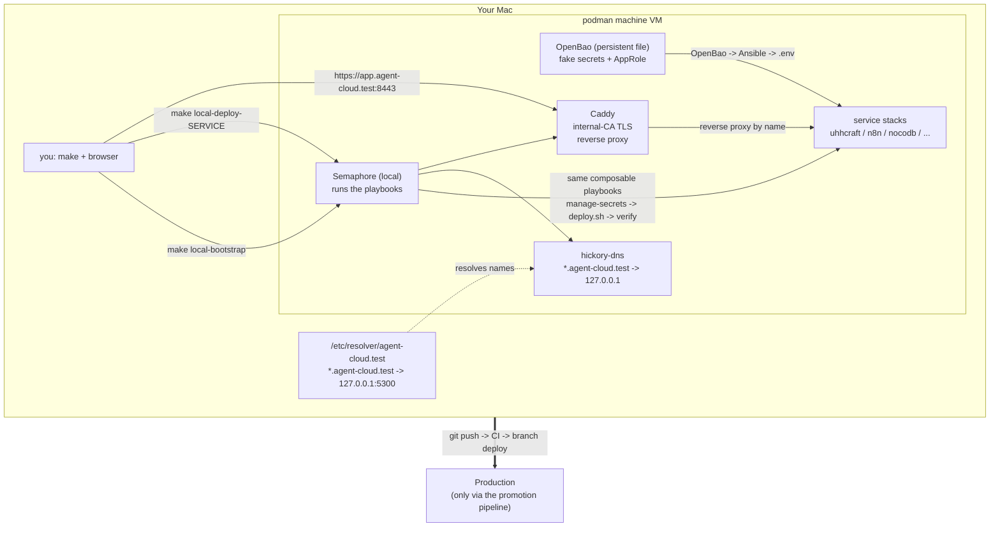
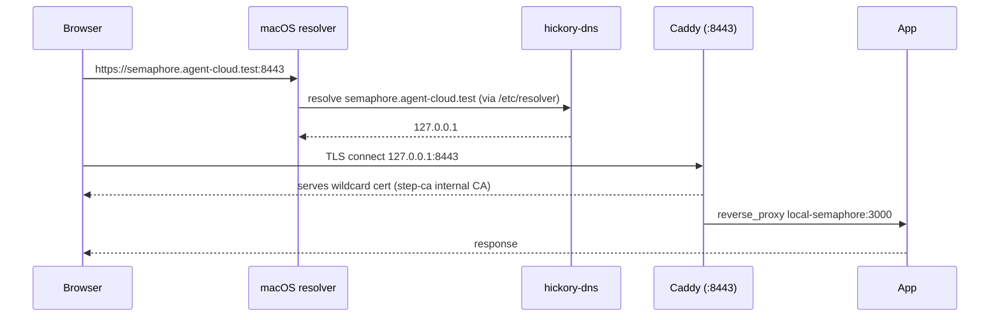
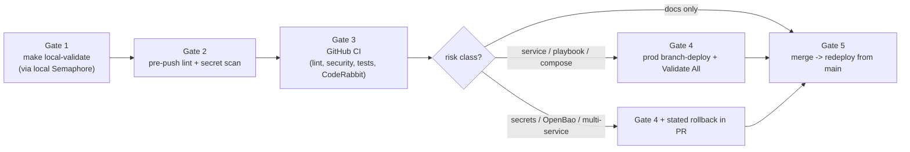

# agent-cloud — Local Dev

Run the whole agent-cloud platform on your laptop the same way production runs:
a local **Semaphore** control plane executes the **same Ansible playbooks** that
deploy prod, with credentials injected the same way. You develop and test
against a real control plane, then promote validated changes upstream.

> **Paradigm: "make bootstraps, Semaphore operates."** The `Makefile` only
> provisions the initial pieces (engine, OpenBao, Semaphore, templates).
> Everything after that — every service deploy — runs *through* local Semaphore,
> exactly like prod. No real credentials ever touch your laptop: every generated
> value carries a `LOCAL_FAKE_` prefix.

- **Operate / triage reference:** [`docs/LOCAL-DEV.md`](docs/LOCAL-DEV.md)
- **Full design + rationale:** [`plan/development/LOCAL-DEV-DEPLOYMENT.md`](plan/development/LOCAL-DEV-DEPLOYMENT.md)

---

## High-level architecture

Everything runs inside one podman-machine VM on your Mac. `make` stands up the
control plane once; from then on you drive local Semaphore, which runs the
composable playbooks against the VM's container engine. DNS + Caddy give every
app a real hostname with TLS.



| Layer | Local | What it mirrors in prod |
|---|---|---|
| Secrets | OpenBao (persistent file backend, `LOCAL_FAKE_` values; survives restart) | OpenBao (real, source of truth) |
| Orchestration | Semaphore (1 container, SQLite) | Semaphore (full) |
| Deploys | the unchanged `deploy-*.yml` playbooks | same playbooks |
| Names + TLS | hickory-dns + Caddy serving a step-ca (internal CA) cert | DNS + Caddy (Let's Encrypt/Cloudflare) |
| Engine | podman (Docker only where root is required) | same split |

---

## Quick start

**Prerequisites** (one time):

```bash
brew bundle                 # toolchain: ansible, podman, podman-compose, jq, gh, ...
podman machine init         # if you don't already have a machine
podman machine start
```

**Stand it up — one command:**

```bash
make local-all              # EVERYTHING in dependency order: full stack +
                            # macOS DNS resolver + internal-CA trust (asks for sudo)
```

`make local-all` runs the whole sequence so `*.agent-cloud.test` works in your
browser: genesis (OpenBao + the secure foundation dns/step-ca/caddy/authentik +
OIDC-secured Semaphore, §12A) → Tier-3 services → the macOS host wiring (DNS
resolver + CA trust). Order matters and it handles it. The host steps ask for
sudo once; everything is idempotent (safe to re-run — and re-running re-trusts
the current CA root after a `local-clean` rebuild minted a new one).

Prefer the steps à la carte? They all still exist:

```bash
make local-bootstrap        # genesis only (foundation + OIDC Semaphore), no sudo
make local-up               # bootstrap + Tier-3 (o11y/opa/erpnext/netbox/n8n), no sudo
make local-dns-resolver     # point macOS at local DNS (sudo)
make local-tls-trust        # trust the internal CA root (sudo)
```

`make help` lists every target. You no longer deploy dns/step-ca/caddy/authentik
separately — genesis owns them.

**Deploy a service** (through local Semaphore, like prod):

```bash
make local-deploy-<name>    # e.g. make local-deploy-uhhcraft
make local-validate         # health-check everything deployed
```

To reset: `make local-clean` then `make local-bootstrap`.

---

## Accessing your apps (local DNS + TLS)

Once `make local-bootstrap` (which deploys dns + caddy) and
`make local-dns-resolver` have run, each app is reachable **by name over HTTPS**:

```text
https://semaphore.agent-cloud.test:8443     -> Semaphore UI
https://openbao.agent-cloud.test:8443       -> OpenBao API
https://<app>.agent-cloud.test:8443         -> any app with a Caddy route
```

How it fits together:



Two things worth knowing up front:

- **Ports: `:8443` by default, or clean `:443` with one opt-in step.** Binding
  privileged ports (<1024) on macOS needs root, and podman-machine's forwarder
  runs as your user — so local Caddy publishes the high ports `8088`/`8443` and
  the default URL is `https://app.agent-cloud.test:8443`. For **clean, port-free**
  `https://app.agent-cloud.test`, run `make local-https` once: it installs a persistent,
  idempotent root LaunchDaemon (`socat`) that forwards `443→8443` and `80→8088`
  and survives reboots (`make local-https-down` removes it). This is the only
  way to get `:443` on macOS without running everything as root, and it's built
  into the tooling rather than a manual hack.
- **Browser TLS warning → one command.** Caddy serves a wildcard cert issued by
  the platform's internal CA, **step-ca** (a stable root that survives
  redeploys). Browsers warn (`NET::ERR_CERT_AUTHORITY_INVALID`) until you trust
  that root: run `make local-tls-trust` once (sudo; idempotent) and the warning
  is gone for all `*.agent-cloud.test` hosts. `make local-tls-untrust` reverses it.
  (Safari/Chrome use the keychain; Firefox has its own store.) See
  [Why some steps ask for `sudo`](#why-some-steps-ask-for-sudo) below.

**Exposing a new app:** add a route to the `caddy_routes` list for `caddy_svc`
in your inventory (host → upstream `container-name:port`) and re-run
`make local-deploy-caddy`. Caddy reverse-proxies the control-plane and service
containers **by their network name** — no IPs, no port juggling.

---

## Why some steps ask for `sudo`

**Deploying a service never needs sudo.** Every service deploy runs through
local Semaphore, and the control plane and all containers run *unprivileged*
inside the podman VM. Sudo is requested only by a few **host-setup** `make`
targets — and only because they change files on **macOS itself** that live
*outside* the podman VM. That's also *why* they can't run through Semaphore
(the control plane can't reach your Mac's system dirs or trust store): they're a
one-time host bootstrap that `make` does for you. Each is **idempotent**
(re-running is a safe no-op) and **reversible**.

| Step | What it changes on your Mac | Why it needs root | Required? |
|---|---|---|---|
| `make local-dns-resolver` (also run by `make local-dns`) | writes `/etc/resolver/<zone>` | `/etc/resolver/` is a protected system directory; only root can add the split-DNS rule that points `*.<zone>` at your local DNS. Without it your Mac can't resolve the app hostnames at all. | **Yes** — names won't resolve otherwise |
| `make local-tls-trust` | adds a CA root to the **System keychain** (`/Library/Keychains/System.keychain`) | Writing the system-wide trust store needs admin rights. This trusts the local **step-ca** root so HTTPS loads without a warning. | **Recommended** — and **mandatory** on a real `.dev` zone (see note) |
| `make local-https` | binds ports `80`/`443` and installs a `/Library/LaunchDaemons/` unit | macOS reserves ports below 1024 for root, and a system LaunchDaemon must be installed as root. Only needed for clean, port-free URLs. | **Optional** — skip it and use `:8443` |

In practice:

- You'll be asked for your password at most **three** times during initial
  setup — once each, then never again (they no-op on re-run).
- **You can see exactly what each will do before granting.** The resolver,
  forwarder, and trust logic live in `scripts/local-dev.sh` and
  `platform/local-dev/`; each prints what it's about to write and asks first
  (pass `--yes` / `ASSUME_YES=1` to skip the prompt in scripts).
- **Undo any of them:** `make local-tls-untrust`, `make local-https-down`, or
  delete `/etc/resolver/<zone>`.
- **Nothing else uses sudo.** If a *deploy* ever prompts for root, that's a bug —
  deploys are unprivileged by design.

> **Zone note:** the local zone is `agent-cloud.test` — under the RFC 6761
> reserved `.test` TLD (never publicly resolvable; no mDNS clash like `.local`;
> no forced-HTTPS like a real `.dev`). Because it's not HSTS-preloaded, an
> untrusted cert still lets you click through — but `make local-tls-trust`
> (trust the step-ca root once) gives a clean padlock and is needed for strict
> OIDC flows. (If you ever switch to a real `.dev` zone, that TLD *is* HSTS-
> preloaded and the trust step becomes mandatory — no click-through.)

---

## What you can run locally today

| Service | Status | Notes |
|---|---|---|
| OpenBao + Semaphore | ✅ working | the control plane (`make local-bootstrap`) |
| hickory-dns | ✅ working | `make local-deploy-dns` (authoritative for `*.agent-cloud.test`) |
| step-ca | ✅ working | `make local-deploy-step-ca` — internal CA; stable root, issues the `*.agent-cloud.test` wildcard Caddy serves. Trust once: `make local-tls-trust` |
| Caddy | ✅ working | `make local-deploy-caddy` — reverse proxy serving the step-ca wildcard cert |
| Authentik | ✅ working | `make local-deploy-authentik` — central IdP/SSO (server+worker+Postgres+Redis); debug API at `127.0.0.1:9300`, reached via Caddy. SSO gating (`forward_auth`) is the next phase |
| UhhCraft | ⛔ blocked | image `ghcr.io/uhstray-io/uhhcraft` is private — needs a `read:packages` PAT or a local build |
| NetBox | ✅ working | app tier **under podman** (no Docker needed — see `plan/development/NETBOX-LOCAL-ENGINE.md`). `make local-netbox` → `make local-netbox-discover` lists the running containers as VMs at `127.0.0.1:8000` |
| n8n / NocoDB | 🚧 in progress | composable local deploy being added |
| o11y | 📋 planned | observability stack not yet defined |

---

## Promotion: local-dev → production

Local-dev is the inner loop; production is reached **only** through the
promotion pipeline. The branch flow is **`<feature>` → `dev` → `main`**, and
`make promote` starts it (fast checks, push, open a PR into `dev`).



What local validation **does** prove: playbook/task logic on the real code path,
the secret flow (OpenBao → AppRole → `.env`), Semaphore template wiring, compose
validity, healthchecks. What it **can't** prove (and the branch-deploy gate
covers): real credential values, multi-VM networking, public TLS/DNS, production
data shapes. Full contract + the risk-class table are in the
[plan](plan/development/LOCAL-DEV-DEPLOYMENT.md) (§7–§8).

---

## Make targets

| Target | Does |
|---|---|
| `make local-preflight` | verify toolchain + podman machine |
| `make local-init` | create the gitignored working inventory (`REFRESH=1` to regenerate) |
| `make local-bootstrap` | Genesis: OpenBao + secure foundation (dns, step-ca, caddy, authentik) + OIDC-secured Semaphore |
| `make local-deploy-<svc>` | deploy a service through local Semaphore |
| `make local-dns` | deploy DNS **and** wire the macOS resolver |
| `make local-dns-resolver` | wire `/etc/resolver/<zone>` (sudo; idempotent) |
| `make local-https` | clean port-free `https://app.agent-cloud.test` via a persistent root forwarder (sudo; idempotent) |
| `make local-https-down` | remove the privileged-port forwarder (sudo) |
| `make local-tls-trust` | trust the local CA root (step-ca) so `*.agent-cloud.test` has no cert warning (sudo; idempotent) |
| `make local-tls-untrust` | remove the trusted local CA root (sudo) |
| `make local-validate` | health-check all deployed services |
| `make local-smoke` | smoke-test the live stack (control plane, DNS, Caddy/TLS, NetBox); `ARGS=--full` adds lint+BATS |
| `make local-netbox` | bring up the NetBox app tier under podman |
| `make local-netbox-discover` | discover the running containers into NetBox as VMs |
| `make local-clean` | tear down the control plane |
| `make promote` | fast checks → push feature branch → PR into `dev` |
