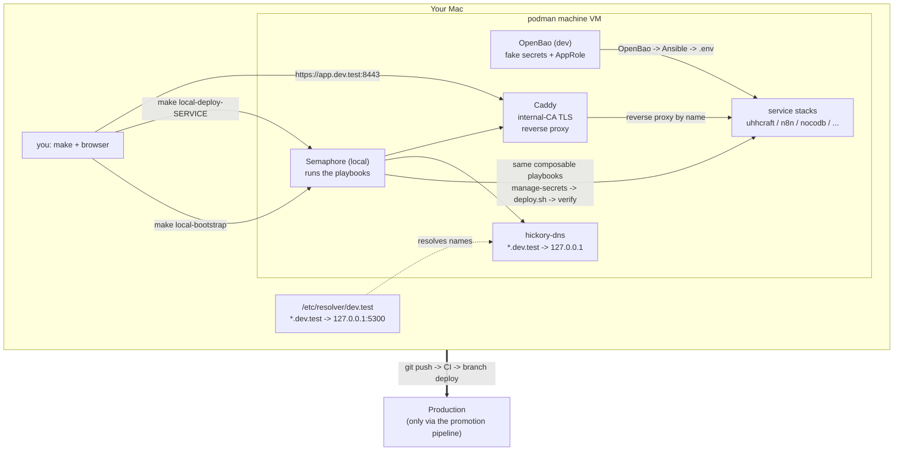
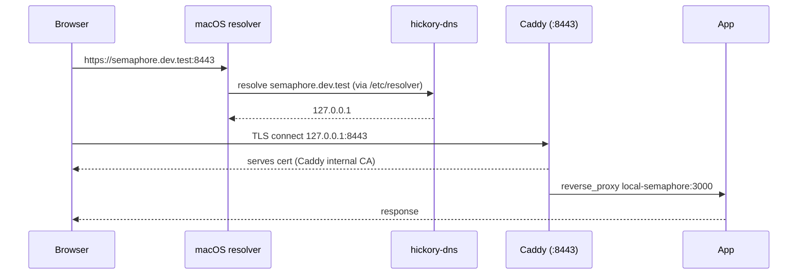
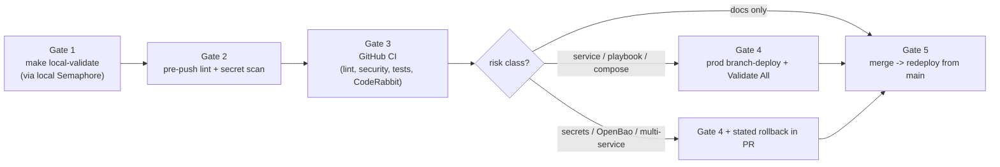

# agent-cloud — Local Dev

Run the whole agent-cloud platform on your laptop the same way production runs:
a local **Semaphore** control plane executes the **same Ansible playbooks** that
deploy prod, with credentials injected the same way. You develop and test
against a real control plane, then promote validated changes upstream.

> **Paradigm: "make bootstraps, Semaphore operates."** The `Makefile` only
> provisions the initial pieces (engine, OpenBao, Semaphore, templates).
> Everything after that — every service deploy — runs *through* local Semaphore,
> exactly like prod. No real credentials ever touch your laptop: every generated
> value carries a `LOCAL_FAKE_` prefix.

- **Operate / triage reference:** [`docs/LOCAL-DEV.md`](docs/LOCAL-DEV.md)
- **Full design + rationale:** [`plan/development/LOCAL-DEV-DEPLOYMENT.md`](plan/development/LOCAL-DEV-DEPLOYMENT.md)

---

## High-level architecture

Everything runs inside one podman-machine VM on your Mac. `make` stands up the
control plane once; from then on you drive local Semaphore, which runs the
composable playbooks against the VM's container engine. DNS + Caddy give every
app a real hostname with TLS.



| Layer | Local | What it mirrors in prod |
|---|---|---|
| Secrets | OpenBao (dev mode, `LOCAL_FAKE_` values) | OpenBao (real, source of truth) |
| Orchestration | Semaphore (1 container, SQLite) | Semaphore (full) |
| Deploys | the unchanged `deploy-*.yml` playbooks | same playbooks |
| Names + TLS | hickory-dns + Caddy (internal CA) | DNS + Caddy (Let's Encrypt/Cloudflare) |
| Engine | podman (Docker only where root is required) | same split |

---

## Quick start

**Prerequisites** (one time):

```bash
brew bundle                 # toolchain: ansible, podman, podman-compose, jq, gh, ...
podman machine init         # if you don't already have a machine
podman machine start
```

**Stand it up:**

```bash
make local-bootstrap        # OpenBao + Semaphore + templates (idempotent)
make local-deploy-dns       # local DNS  (*.dev.test)
make local-deploy-caddy     # reverse proxy with TLS
make local-dns-resolver     # one-time: point macOS at local DNS (asks for sudo)
```

That's it. `make help` lists every target. Re-running anything is safe —
each step is idempotent.

**Deploy a service** (through local Semaphore, like prod):

```bash
make local-deploy-<name>    # e.g. make local-deploy-uhhcraft
make local-validate         # health-check everything deployed
```

To reset: `make local-clean` then `make local-bootstrap`.

---

## Accessing your apps (local DNS + TLS)

Once `make local-deploy-dns`, `make local-deploy-caddy`, and
`make local-dns-resolver` have run, each app is reachable **by name over HTTPS**:

```
https://semaphore.dev.test:8443     -> Semaphore UI
https://openbao.dev.test:8443       -> OpenBao API
https://<app>.dev.test:8443         -> any app with a Caddy route
```

How it fits together:



Two things worth knowing up front:

- **Ports: `:8443` by default, or clean `:443` with one opt-in step.** Binding
  privileged ports (<1024) on macOS needs root, and podman-machine's forwarder
  runs as your user — so local Caddy publishes the high ports `8088`/`8443` and
  the default URL is `https://app.dev.test:8443`. For **clean, port-free**
  `https://app.dev.test`, run `make local-https` once: it installs a persistent,
  idempotent root LaunchDaemon (`socat`) that forwards `443→8443` and `80→8088`
  and survives reboots (`make local-https-down` removes it). This is the only
  way to get `:443` on macOS without running everything as root, and it's built
  into the tooling rather than a manual hack.
- **Browser TLS warning → one command.** Caddy mints certs from its own
  *internal* CA, so browsers warn (`NET::ERR_CERT_AUTHORITY_INVALID`) until you
  trust that CA. Run `make local-tls-trust` once (sudo; idempotent) — it trusts
  Caddy's root in the macOS keychain and the warning is gone for all
  `*.dev.test` hosts. `make local-tls-untrust` reverses it. (Safari/Chrome use
  the keychain; Firefox has its own store.)

**Exposing a new app:** add a route to the `caddy_routes` list for `caddy_svc`
in your inventory (host → upstream `container-name:port`) and re-run
`make local-deploy-caddy`. Caddy reverse-proxies the control-plane and service
containers **by their network name** — no IPs, no port juggling.

---

## What you can run locally today

| Service | Status | Notes |
|---|---|---|
| OpenBao + Semaphore | ✅ working | the control plane (`make local-bootstrap`) |
| hickory-dns | ✅ working | `make local-deploy-dns` |
| Caddy | ✅ working | `make local-deploy-caddy` (internal-CA TLS) |
| UhhCraft | ⛔ blocked | image `ghcr.io/uhstray-io/uhhcraft` is private — needs a `read:packages` PAT or a local build |
| NetBox | ✅ working | app tier **under podman** (no Docker needed — see `plan/development/NETBOX-LOCAL-ENGINE.md`). `make local-netbox` → `make local-netbox-discover` lists the running containers as VMs at `127.0.0.1:8000` |
| n8n / NocoDB | 🚧 in progress | composable local deploy being added |
| o11y | 📋 planned | observability stack not yet defined |

---

## Promotion: local-dev → production

Local-dev is the inner loop; production is reached **only** through the
promotion pipeline. The branch flow is **`<feature>` → `dev` → `main`**, and
`make promote` starts it (fast checks, push, open a PR into `dev`).



What local validation **does** prove: playbook/task logic on the real code path,
the secret flow (OpenBao → AppRole → `.env`), Semaphore template wiring, compose
validity, healthchecks. What it **can't** prove (and the branch-deploy gate
covers): real credential values, multi-VM networking, public TLS/DNS, production
data shapes. Full contract + the risk-class table are in the
[plan](plan/development/LOCAL-DEV-DEPLOYMENT.md) (§7–§8).

---

## Make targets

| Target | Does |
|---|---|
| `make local-preflight` | verify toolchain + podman machine |
| `make local-init` | create the gitignored working inventory (`REFRESH=1` to regenerate) |
| `make local-bootstrap` | OpenBao + Semaphore + templates |
| `make local-deploy-<svc>` | deploy a service through local Semaphore |
| `make local-dns` | deploy DNS **and** wire the macOS resolver |
| `make local-dns-resolver` | wire `/etc/resolver/<zone>` (sudo; idempotent) |
| `make local-https` | clean port-free `https://app.dev.test` via a persistent root forwarder (sudo; idempotent) |
| `make local-https-down` | remove the privileged-port forwarder (sudo) |
| `make local-tls-trust` | trust Caddy's local CA so `*.dev.test` has no cert warning (sudo; idempotent) |
| `make local-tls-untrust` | remove the trusted Caddy root CA (sudo) |
| `make local-validate` | health-check all deployed services |
| `make local-smoke` | smoke-test the live stack (control plane, DNS, Caddy/TLS, NetBox); `ARGS=--full` adds lint+BATS |
| `make local-netbox` | bring up the NetBox app tier under podman |
| `make local-netbox-discover` | discover the running containers into NetBox as VMs |
| `make local-clean` | tear down the control plane |
| `make promote` | fast checks → push feature branch → PR into `dev` |
