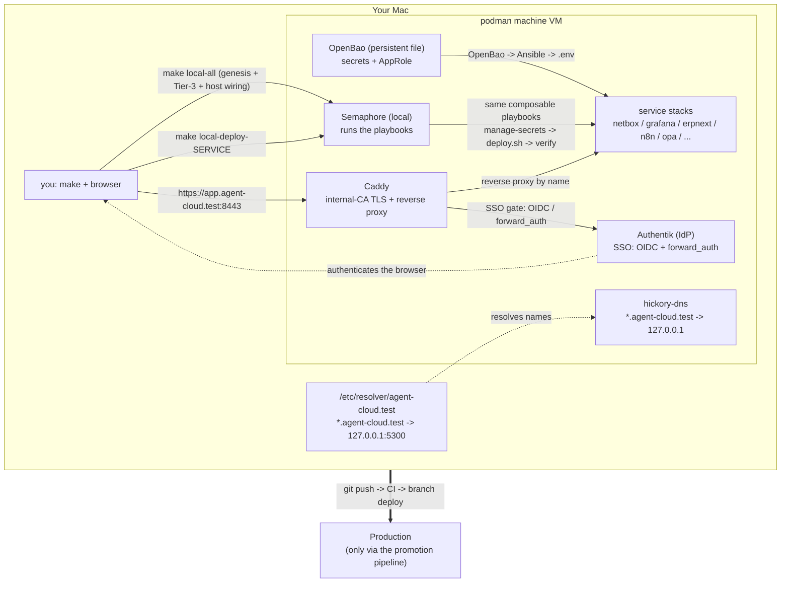
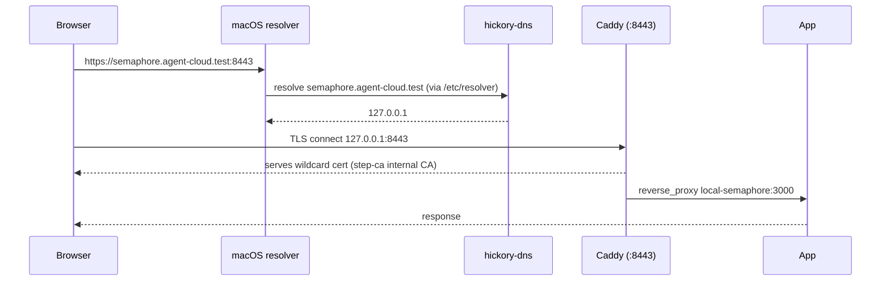
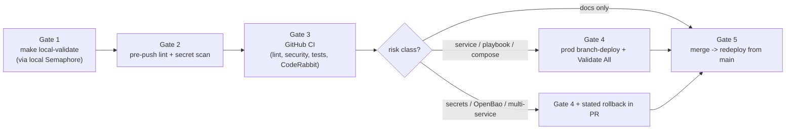

# agent-cloud — Local Dev

Run the supported agent-cloud profiles on your laptop using the production
automation model:
a local **Semaphore** control plane executes the **same Ansible playbooks** that
deploy prod, with credentials injected the same way. You develop and test
against a real control plane, then promote validated changes upstream.

> **Paradigm: "make bootstraps, Semaphore operates."** The `Makefile` only
> provisions the secure foundation (engine, OpenBao, DNS, internal CA, ingress,
> Authentik, and Semaphore). Supported service deploys use local Semaphore.
> The existing `local-netbox` helper is a legacy direct app-tier exception, not
> production discovery validation. Keep production service credentials out of
> local configuration. Fixture seeds use `LOCAL_FAKE_`; generated local login
> credentials are real secrets for the local environment.

- **Operate / triage reference:** [`docs/LOCAL-DEV.md`](docs/LOCAL-DEV.md)
- **Full design + rationale:** [`plan/development/00-foundation-local-dev.md`](plan/development/00-foundation-local-dev.md)

---

## High-level architecture

The default local control plane runs inside one podman-machine VM on your Mac. `make` stands up the
control plane once; from then on you drive local Semaphore, which runs the
composable playbooks against the VM's container engine. DNS + Caddy give every
app a real hostname with TLS.


```mermaid
flowchart TB
  subgraph mac["Your Mac"]
    DEV["you: make + browser"]
    RES["/etc/resolver/agent-cloud.test<br/>*.agent-cloud.test -> 127.0.0.1:5300"]
    subgraph vm["podman machine VM"]
      BAO["OpenBao (persistent file)<br/>secrets + AppRole"]
      SEM["Semaphore (local)<br/>runs the playbooks"]
      DNS["hickory-dns<br/>*.agent-cloud.test -> 127.0.0.1"]
      CAD["Caddy<br/>internal-CA TLS + reverse proxy"]
      AK["Authentik (IdP)<br/>SSO: OIDC + forward_auth"]
      SVC["service stacks<br/>netbox / grafana / erpnext / n8n / opa / ..."]
    end
  end
  PROD["Production<br/>(only via the promotion pipeline)"]

  DEV -->|"make local-all (genesis + Tier-3 + host wiring)"| SEM
  DEV -->|make local-deploy-SERVICE| SEM
  SEM -->|"same composable playbooks<br/>manage-secrets -> deploy.sh -> verify"| SVC
  BAO -->|"OpenBao -> Ansible -> .env"| SVC
  DEV -->|"https://app.agent-cloud.test:8443"| CAD
  RES -.resolves names.-> DNS
  CAD -->|reverse proxy by name| SVC
  CAD -->|"SSO gate: OIDC / forward_auth"| AK
  AK -.authenticates the browser.-> DEV
  mac ==>|git push -> CI -> branch deploy| PROD
```

| Layer | Local | What it mirrors in prod |
|---|---|---|
| Secrets | OpenBao (persistent file backend; generated locally, seed fixtures carry `LOCAL_FAKE_`; survives restart) | OpenBao (real, source of truth) |
| Orchestration | Semaphore (1 container, SQLite) | Semaphore (full) |
| **Identity / SSO** | **Authentik IdP — one login (`agent-cloud-admin`) for every app: OIDC (Semaphore/Grafana/ERPNext) + Caddy `forward_auth` (NetBox/OpenBao/n8n)** | **same Authentik + blueprints; real OIDC clients** |
| Deploys | the unchanged `deploy-*.yml` playbooks | same playbooks |
| Names + TLS | hickory-dns + Caddy serving a step-ca (internal CA) cert | DNS + Caddy (Let's Encrypt/Cloudflare) |
| Engine | local Semaphore controls the VM's rootful Podman socket | rootless Podman default; declared Docker exceptions |

---

## Quick start

**Prerequisites** (one time):

```bash
brew bundle                 # toolchain: ansible, podman, podman-compose, jq, gh, ...
podman machine init         # if you don't already have a machine
podman machine start
```

**Stand it up — one command:**

```bash
make local-bootstrap        # secure foundation + OIDC Semaphore
make local-dns-resolver     # macOS name resolution (sudo)
make local-tls-trust        # trust the local CA (sudo)
```

`make local-all` remains a convenience target for a fixed subset: foundation,
o11y, OPA, ERPNext, the legacy NetBox app-tier helper, and best-effort n8n,
followed by host DNS/TLS wiring. It does not deploy every service in the catalog;
an n8n failure does not fail that target. Validate the required services explicitly.
The NetBox helper is not a Semaphore-driven full-stack deployment and does not
establish production discovery health.

Prefer the steps à la carte? They all still exist:

```bash
make local-bootstrap        # genesis only (foundation + OIDC Semaphore), no sudo
make local-up               # fixed subset above; includes legacy NetBox helper
make local-dns-resolver     # point macOS at local DNS (sudo)
make local-tls-trust        # trust the internal CA root (sudo)
```

`make help` lists every target. You no longer deploy dns/step-ca/caddy/authentik
separately — genesis owns them.

**When it finishes, it prints your login.** `make local-all` ends by showing the
Authentik SSO credentials so you can sign in and test immediately — `agent-cloud-admin`
(full access to every app) and the break-glass `akadmin`. Re-show them any time with
`make local-creds`. See [Logging in (SSO)](#logging-in-sso-via-authentik) below.

**Deploy a service** (through local Semaphore, like prod):

```bash
make local-deploy-<name>    # e.g. make local-deploy-uhhcraft
make local-validate         # health-check everything deployed
```

**Destructive reset:** `make local-clean` deletes the local OpenBao/Semaphore
containers, their data volumes and tool-owned state. It leaves other service
volumes behind; new secrets may then disagree with those volumes. Back up state
and plan the matching service recovery before resetting.

---

## Accessing your apps (local DNS + TLS)

Once `make local-bootstrap` (which deploys dns + caddy) and
`make local-dns-resolver` have run, each app is reachable **by name over HTTPS**:

```text
https://semaphore.agent-cloud.test:8443     -> Semaphore UI
https://openbao.agent-cloud.test:8443       -> OpenBao API
https://<app>.agent-cloud.test:8443         -> any app with a Caddy route
```

How it fits together:


```mermaid
sequenceDiagram
    participant B as Browser
    participant R as macOS resolver
    participant H as hickory-dns
    participant C as Caddy (:8443)
    participant A as App
    B->>R: https://semaphore.agent-cloud.test:8443
    R->>H: resolve semaphore.agent-cloud.test (via /etc/resolver)
    H-->>R: 127.0.0.1
    B->>C: TLS connect 127.0.0.1:8443
    C-->>B: serves wildcard cert (step-ca internal CA)
    C->>A: reverse_proxy local-semaphore:3000
    A-->>B: response
```

Two things worth knowing up front:

- **Ports: `:8443` by default, or clean `:443` with one opt-in step.** Binding
  privileged ports (<1024) on macOS needs root, and podman-machine's forwarder
  runs as your user — so local Caddy publishes the high ports `8088`/`8443` and
  the default URL is `https://app.agent-cloud.test:8443`. For **clean, port-free**
  `https://app.agent-cloud.test`, run `make local-https` once: it installs a persistent,
  idempotent root LaunchDaemon (`socat`) that forwards `443→8443` and `80→8088`
  and survives reboots (`make local-https-down` removes it). This is the supported
  privileged-port path supplied by the local tooling.
- **Browser TLS warning → one command.** Caddy serves a wildcard cert issued by
  the platform's internal CA, **step-ca** (a stable root that survives
  redeploys). Browsers warn (`NET::ERR_CERT_AUTHORITY_INVALID`) until you trust
  that root: run `make local-tls-trust` once (sudo; idempotent) and the warning
  is gone for all `*.agent-cloud.test` hosts. `make local-tls-untrust` reverses it.
  (Safari/Chrome use the keychain; Firefox has its own store.) See
  [Why some steps ask for `sudo`](#why-some-steps-ask-for-sudo) below.

**Exposing a new app:** add a route to the `caddy_routes` list for `caddy_svc`
in your inventory (host → upstream `container-name:port`) and re-run
`make local-deploy-caddy`. Caddy reverse-proxies the control-plane and service
containers **by their network name** — no IPs, no port juggling.

---

## Logging in (SSO via Authentik)

Authentik is the platform's identity provider — **one login reaches every app**.
`make local-all` prints the credentials at the end; `make local-creds` re-shows
them any time (read live from OpenBao). Sign in at the IdP
(`https://auth.agent-cloud.test:8443/`) or just visit any app — you're redirected
to Authentik and back.

**Two accounts** (both passwords from `make local-creds`):

| Account | Use it for | Access |
|---|---|---|
| `agent-cloud-admin` | **day-to-day** — logging into the apps | member of `platform-admins` → top role in every app (NetBox superuser, Grafana Admin, Semaphore all-projects, …) |
| `akadmin` | break-glass — administering **Authentik itself** | Authentik superuser, but **not** in `platform-admins`, so apps that gate on the group claim don't grant it access (intentional) |

**How each app is gated** (config-as-code in Authentik blueprints):

| Integration | Apps | How |
|---|---|---|
| **OIDC** (native SSO) | Semaphore, Grafana, ERPNext | the app redirects to Authentik and gets identity + group claims back |
| **`forward_auth`** (Caddy gate) | NetBox, OpenBao, n8n | Caddy authenticates each request at Authentik's embedded outpost before proxying |

**RBAC tiers** — the Authentik groups every app maps against (the stable contract):

- `platform-admins` → full access (NetBox superuser, Grafana Admin, Semaphore admin, …)
- `platform-developers` → read-only (Viewer / view-only)
- `platform-user` → **denied** (the deny tier — can authenticate but reaches nothing)

**App-specific notes:**

- **NetBox** — `forward_auth` + header `REMOTE_AUTH`: your Authentik groups sync to
  NetBox groups, and `platform-admins` maps to superuser + staff.
- **n8n** — community edition has **no SSO**: `forward_auth` gates *access*, then n8n
  has its **own** owner login, seeded as `agent-cloud-admin@agent-cloud.test` with a
  separate password (`make local-creds` shows it).
- **OpenBao** — `forward_auth` gates the UI; once through, pick the **OIDC** login
  method (`agent-cloud-admin` → the `platform-admin` policy). Token / AppRole still
  works too (the escrowed root token is in `~/.agent-cloud-local/openbao-init.json`).

---

## Why some steps ask for `sudo`

Mac host setup and VM/container privileges are separate. Resolver, trust-store
and privileged-port wiring need Mac administrator access. Local Semaphore uses
the **rootful Podman socket inside the VM**, so “no Mac sudo prompt” does not
mean rootless containers. Service playbooks may also use Ansible `become` for
their declared host setup; inspect the playbook rather than assuming no privilege.

| Step | What it changes on your Mac | Why it needs root | Required? |
|---|---|---|---|
| `make local-dns-resolver` (also run by `make local-dns`) | writes `/etc/resolver/<zone>` | `/etc/resolver/` is a protected system directory; only root can add the split-DNS rule that points `*.<zone>` at your local DNS. Without it your Mac can't resolve the app hostnames at all. | **Yes** — names won't resolve otherwise |
| `make local-tls-trust` | adds a CA root to the **System keychain** (`/Library/Keychains/System.keychain`) | Writing the system-wide trust store needs admin rights. This trusts the local **step-ca** root so HTTPS loads without a warning. | **Recommended** — and **mandatory** on a real `.dev` zone (see note) |
| `make local-https` | binds ports `80`/`443` and installs a `/Library/LaunchDaemons/` unit | macOS reserves ports below 1024 for root, and a system LaunchDaemon must be installed as root. Only needed for clean, port-free URLs. | **Optional** — skip it and use `:8443` |

In practice:

- You'll be asked for your password at most **three** times during initial
  setup — once each, then never again (they no-op on re-run).
- **You can see exactly what each will do before granting.** The resolver,
  forwarder, and trust logic live in `scripts/local-dev.sh` and
  `platform/local-dev/`; each prints what it's about to write and asks first
  (pass `--yes` / `ASSUME_YES=1` to skip the prompt in scripts).
- **Undo any of them:** `make local-tls-untrust`, `make local-https-down`, or
  delete `/etc/resolver/<zone>`.
- **VM privilege is separate.** A service task may require declared `become`;
  keep credentials in the existing OpenBao-backed resolver, not ad-hoc prompts.

> **Zone note:** the local zone is `agent-cloud.test` — under the RFC 6761
> reserved `.test` TLD (never publicly resolvable; no mDNS clash like `.local`;
> no forced-HTTPS like a real `.dev`). Because it's not HSTS-preloaded, an
> untrusted cert still lets you click through — but `make local-tls-trust`
> (trust the step-ca root once) gives a clean padlock and is needed for strict
> OIDC flows. (If you ever switch to a real `.dev` zone, that TLD *is* HSTS-
> preloaded and the trust step becomes mandatory — no click-through.)

---

## Available local profiles

This table describes checked-in profiles and recorded validation, not a live
health snapshot. `make local-all` covers only the fixed subset described above.
Other services need their own declared deployment and validation.

| Service | Tier | Profile | Notes |
|---|---|---|---|
| OpenBao | genesis | implemented | persistent secrets backend + AppRole injection |
| hickory-dns | genesis | implemented | authoritative for `*.agent-cloud.test`, forwards the rest |
| step-ca | genesis | implemented | internal CA; stable root issues the wildcard Caddy serves (`make local-tls-trust` to trust it) |
| Caddy | genesis | implemented | reverse proxy + internal-CA TLS + the SSO gates |
| Authentik | genesis | implemented | central IdP/SSO — OIDC + `forward_auth` live; `agent-cloud-admin` seeded into `platform-admins` |
| Semaphore | genesis | implemented | control plane; boots OIDC-secured; `agent-cloud-admin` is a global admin |
| o11y (Grafana/Prometheus/Loki/Alloy) | Tier-3 | implemented | observability; Grafana login via Authentik OIDC |
| OPA | Tier-3 | implemented | Guardrail-layer agent-action policy engine (`opa test` in the deploy) |
| ERPNext | Tier-3 | implemented | slim local tier; login via Authentik OIDC |
| n8n | Tier-3 | implemented | workflow automation; `forward_auth` + seeded owner account |
| NetBox | Tier-3 | legacy app-only helper | Podman app-tier script exists; local Docker setup is not established. Production is the current discovery-validation target; do not use the direct container-to-IPAM helper as a sanctioned discovery path |
| UhhCraft | Tier-3 | ⛔ blocked | image `ghcr.io/uhstray-io/uhhcraft` is private — needs a `read:packages` PAT or a local build |
| Postiz | Tier-3 | local bring-up recorded | Separate `make local-deploy-postiz`; five-container base plus required search overlay. Sign-in and scheduled-publish verification remain open |
| NocoDB | Tier-3 | retired | Kept for decommissioning; do not start a new migration/deployment from the old plan |

---

## Promotion: local-dev → production

Local-dev is the inner loop; production is reached **only** through the
promotion pipeline. The branch flow is **`<feature>` → `dev` → `main`**, and
`make promote` starts it (fast checks, push, open a PR into `dev`).


```mermaid
flowchart LR
  G1["Gate 1<br/>make local-validate<br/>(via local Semaphore)"] --> G2["Gate 2<br/>pre-push lint + secret scan"]
  G2 --> G3["Gate 3<br/>GitHub CI<br/>(lint, security, tests, CodeRabbit)"]
  G3 --> RC{risk class?}
  RC -->|docs only| M["Gate 5<br/>merge -> redeploy from main"]
  RC -->|"service / playbook / compose"| BD["Gate 4<br/>prod branch-deploy + Validate All"]
  RC -->|"secrets / OpenBao / multi-service"| BDH["Gate 4 + stated rollback in PR"]
  BD --> M
  BDH --> M
```

What local validation **does** prove: playbook/task logic on the real code path,
the secret flow (OpenBao → AppRole → `.env`), Semaphore template wiring, compose
validity, healthchecks. What it **can't** prove (and the branch-deploy gate
covers): real credential values, multi-VM networking, public TLS/DNS, production
data shapes. Full contract + the risk-class table are in the
[plan](plan/development/00-foundation-local-dev.md) (§7–§8).

---

## Make targets

| Target | Does |
|---|---|
| `make local-preflight` | verify toolchain + podman machine |
| `make local-init` | create the gitignored working inventory (`REFRESH=1` to regenerate) |
| `make local-all` | Fixed subset described above, then Mac DNS/TLS wiring and local credentials; n8n is best-effort |
| `make local-bootstrap` | Genesis: OpenBao + secure foundation (dns, step-ca, caddy, authentik) + OIDC-secured Semaphore (no sudo) |
| `make local-up` | Foundation plus o11y/OPA/ERPNext, legacy NetBox helper and best-effort n8n |
| `make local-creds` | show the Authentik SSO logins (`agent-cloud-admin` + `akadmin`) for browser testing |
| `make local-deploy-<svc>` | deploy a single service through local Semaphore |
| `make local-dns` | deploy DNS **and** wire the macOS resolver |
| `make local-dns-resolver` | wire `/etc/resolver/<zone>` (sudo; idempotent) |
| `make local-https` | clean port-free `https://app.agent-cloud.test` via a persistent root forwarder (sudo; idempotent) |
| `make local-https-down` | remove the privileged-port forwarder (sudo) |
| `make local-tls-trust` | trust the local CA root (step-ca) so `*.agent-cloud.test` has no cert warning (sudo; idempotent) |
| `make local-tls-untrust` | remove the trusted local CA root (sudo) |
| `make local-validate` | health-check all deployed services |
| `make local-smoke` | smoke-test the live stack (control plane, DNS, Caddy/TLS, NetBox); `ARGS=--full` adds lint+BATS |
| `make local-netbox` | bring up the NetBox app tier under podman |
| `make local-netbox-discover` | Legacy direct ORM writer: records running containers as VMs. Conflicts with the IPAM authority model; not the supported discovery path |
| `make local-clean` | **Destructive:** deletes local control-plane data and secrets; other service volumes remain |
| `make promote` | fast checks → push feature branch → PR into `dev` |
