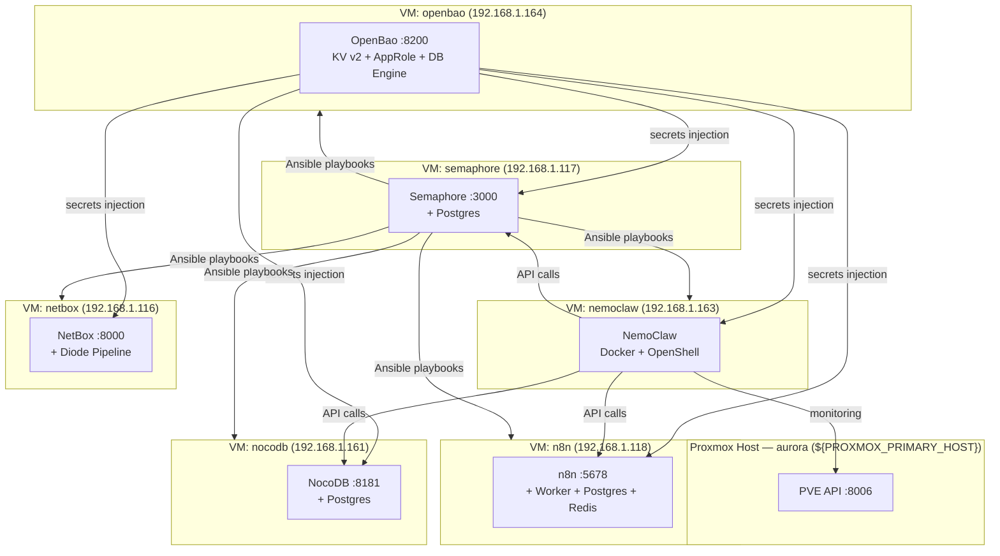
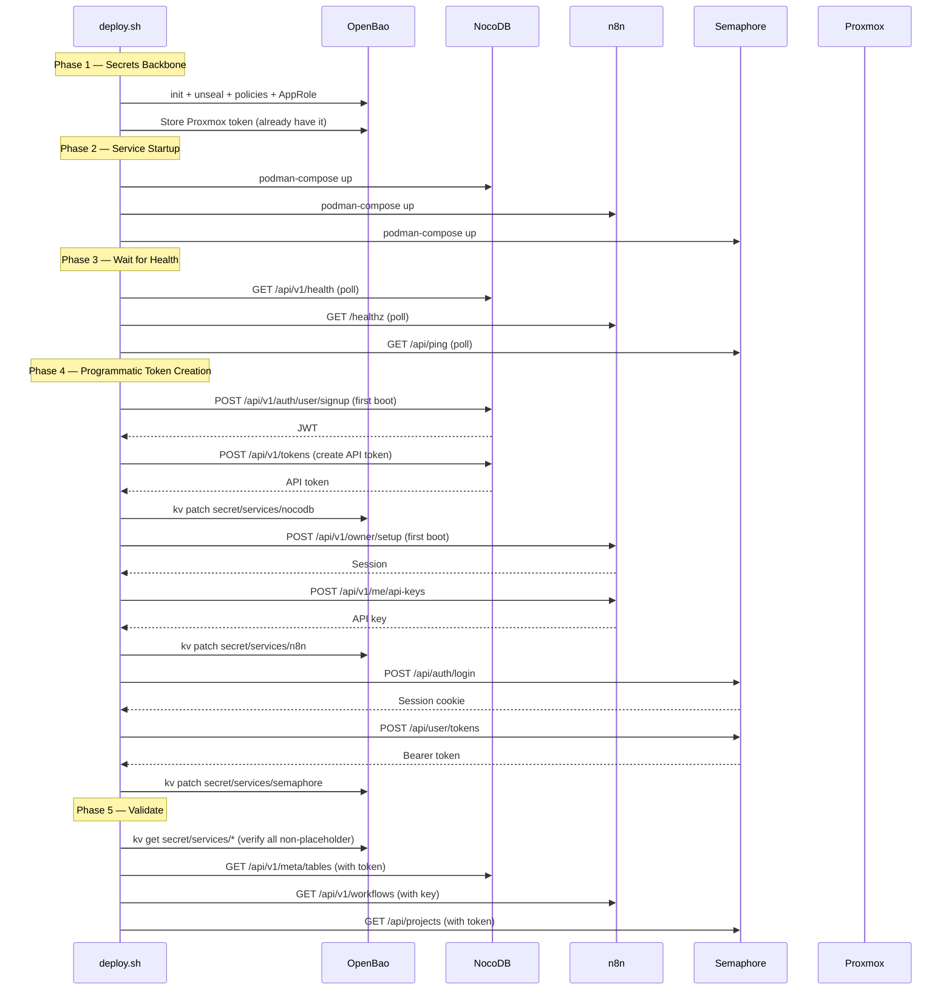
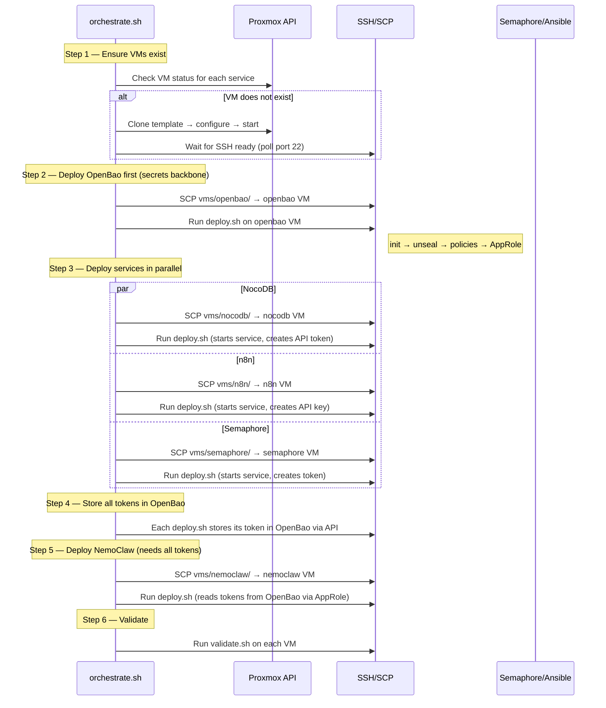

# System Design: Per-VM Deployment & Programmatic API Key Bootstrap

## Overview

This document designs two things: (1) breaking the monolithic compose stack into per-VM deployments managed through Proxmox, and (2) eliminating manual UI logins for API key creation by bootstrapping all tokens programmatically during deploy.

The NetBox deployment already solves this well — `deploy.sh` generates secrets, creates the superuser, registers OAuth2 clients, and provisions agent credentials without ever touching the UI. This design extends that pattern to the full agent-cloud stack.

## Current State

All services run in a single `compose.yml` on one machine (local dev). Production VMs exist but each runs its service independently with manual credential setup.

```
Current (Phase 0 — single-host dev):

┌─────────────────────────────────────────────────────────┐
│ Local Dev Machine (compose.yml)                         │
│                                                         │
│  ┌──────────┐ ┌──────────┐ ┌──────┐ ┌───────────┐       │
│  │ OpenBao  │ │  NocoDB  │ │  n8n │ │ Semaphore │       │
│  │ :8200    │ │  :8181   │ │:5678 │ │  :3100    │       │
│  └──────────┘ └──────────┘ └──────┘ └───────────┘       │
│       ↑ All share ac-net bridge                         │
└─────────────────────────────────────────────────────────┘
```

Production VMs already assigned (from `config/inventory.yml`):

| Service   | VM         | IP              | Status     |
|-----------|------------|-----------------|------------|
| NocoDB    | nocodb     | 192.168.1.161   | Deployed   |
| OpenBao   | nocodb     | 192.168.1.161   | Co-located |
| n8n       | n8n        | 192.168.1.118   | Deployed   |
| Semaphore | semaphore  | 192.168.1.117   | Deployed   |
| NemoClaw  | nemoclaw   | 192.168.1.163   | Deployed   |
| NetBox    | netbox     | 192.168.1.116   | Deployed   |

---

## Target Architecture



### Key Changes from Current State

1. **OpenBao gets its own VM** (192.168.1.164) — currently co-located with NocoDB on .161. Secrets backbone should not share a failure domain with a data service.
2. **Each service has a dedicated `deploy.sh`** that handles secrets generation, service startup, and programmatic API key bootstrap.
3. **Proxmox API drives VM provisioning** — create/clone/start VMs via the PVE REST API using the existing `${PVE_TOKEN_ID}` token.
4. **Semaphore orchestrates deployments** — Ansible playbooks run against the inventory to deploy and update services across VMs.

---

## Part 1: Programmatic API Key Bootstrap

### Design Principle

Every service must be deployable with zero UI interaction. The deploy script generates credentials, starts the service, waits for health, then creates API tokens programmatically. All tokens are stored in OpenBao as the source of truth.

### Per-Service Methods

#### OpenBao — Already Solved

OpenBao's own CLI handles everything. The existing `setup-openbao.sh` does: init → unseal → enable engines → write policies → create AppRole → seed placeholders. No changes needed.

```
Bootstrap: bao operator init → root token
Runtime:   bao write auth/approle/login role_id=X secret_id=Y → scoped token
```

#### Semaphore — REST API Login + Token Creation

Semaphore has full REST API support for token management. The admin user is created automatically on first boot via environment variables (`SEMAPHORE_ADMIN`, `SEMAPHORE_ADMIN_PASSWORD`).

```bash
# Step 1: Login to get session cookie
COOKIE=$(curl -s -c - -X POST http://localhost:3000/api/auth/login \
  -H 'Content-Type: application/json' \
  -d '{"auth":"admin","password":"'"$SEMAPHORE_ADMIN_PASSWORD"'"}' \
  | grep -o 'semaphore=[^[:space:]]*')

# Step 2: Create API token
TOKEN_RESPONSE=$(curl -s -X POST http://localhost:3000/api/user/tokens \
  -H "Cookie: $COOKIE" \
  -H 'Content-Type: application/json')

# Step 3: Extract token ID (this IS the bearer token)
API_TOKEN=$(echo "$TOKEN_RESPONSE" | jq -r '.id')

# Step 4: Store in OpenBao
bao kv patch secret/services/semaphore api_token="$API_TOKEN"
```

**Idempotency:** List tokens first (`GET /api/user/tokens`), skip creation if one exists.

#### NocoDB — Admin Seeding + Auth API Token

NocoDB creates an admin user on first signup via its `/api/v1/auth/user/signup` endpoint. After that, it returns a JWT. For a persistent API token, use the internal token management.

```bash
# Step 1: Create admin on first boot (signup endpoint, only works when no users exist)
AUTH_RESPONSE=$(curl -s -X POST http://localhost:8181/api/v1/auth/user/signup \
  -H 'Content-Type: application/json' \
  -d '{"email":"admin@my-site.io","password":"'"$NOCODB_ADMIN_PASSWORD"'"}')
JWT_TOKEN=$(echo "$AUTH_RESPONSE" | jq -r '.token')

# Step 2: Create a persistent API token via the auth endpoint
API_TOKEN_RESPONSE=$(curl -s -X POST http://localhost:8181/api/v1/tokens \
  -H "xc-auth: $JWT_TOKEN" \
  -H 'Content-Type: application/json' \
  -d '{"description":"nemoclaw-agent"}')
API_TOKEN=$(echo "$API_TOKEN_RESPONSE" | jq -r '.token')

# Step 3: Store in OpenBao
bao kv patch secret/services/nocodb api_token="$API_TOKEN"
```

**Idempotency:** Check if admin exists first (`POST /api/v1/auth/user/signin` returns 200 if user exists). List tokens before creating.

**Fallback if `/api/v1/tokens` is unavailable:** NocoDB also supports creating API tokens via `POST /api/v1/meta/api-tokens` with auth header `xc-auth: <jwt>`. The exact endpoint varies by NocoDB version; the deploy script should try both and use whichever responds.

#### n8n — Owner Setup API + Community API Key

n8n requires owner setup before any API access. The owner setup endpoint is available on first boot when no owner exists.

```bash
# Step 1: Create owner on first boot
OWNER_RESPONSE=$(curl -s -X POST http://localhost:5678/api/v1/owner/setup \
  -H 'Content-Type: application/json' \
  -d '{
    "email":"admin@my-site.io",
    "firstName":"Admin",
    "lastName":"User",
    "password":"'"$N8N_ADMIN_PASSWORD"'"
  }')

# Step 2: Login to get session cookie
LOGIN_RESPONSE=$(curl -s -c - -X POST http://localhost:5678/api/v1/login \
  -H 'Content-Type: application/json' \
  -d '{"email":"admin@my-site.io","password":"'"$N8N_ADMIN_PASSWORD"'"}')

# Step 3: Create API key via internal API
# n8n stores API keys in its database. Use the /api/v1/me/api-keys endpoint:
API_KEY_RESPONSE=$(curl -s -X POST http://localhost:5678/api/v1/me/api-keys \
  -H "Cookie: $SESSION_COOKIE" \
  -H 'Content-Type: application/json' \
  -d '{"label":"nemoclaw-agent"}')
API_KEY=$(echo "$API_KEY_RESPONSE" | jq -r '.apiKey')

# Step 4: Store in OpenBao
bao kv patch secret/services/n8n api_key="$API_KEY"
```

**Note:** The `/api/v1/me/api-keys` endpoint is available in n8n self-hosted. If this endpoint is not available in the deployed version, fall back to direct database insertion:

```bash
# Fallback: Direct DB insertion (n8n stores keys in api_keys table)
podman exec ac-n8n-postgres psql -U n8n_user -d n8n -c \
  "INSERT INTO api_key (user_id, label, api_key)
   VALUES (1, 'nemoclaw-agent', '$(openssl rand -hex 20)')
   ON CONFLICT (label) DO NOTHING
   RETURNING api_key;"
```

#### NetBox — Already Solved (Reference Pattern)

NetBox's `deploy.sh` is the gold standard in this codebase:
1. `generate-secrets.sh` creates all passwords
2. Django `createsuperuser --noinput` creates admin
3. `authmanager create-client` registers OAuth2 clients inside the diode-auth container
4. `manage.py shell` calls `netbox_diode_plugin.client.create_client()` for agent credentials

No changes needed — this is what we're replicating for the other services.

#### Proxmox — Token Already Exists

The Proxmox API token `${PVE_TOKEN_ID}` is already created and stored in `proxmox/secrets/`. Proxmox tokens are created via:

```bash
# Via PVE API (if creating more tokens programmatically)
curl -s -k -X POST "https://${PROXMOX_PRIMARY_HOST}:8006/api2/json/access/users/${USER}@pve/token/agent-cloud" \
  -H "Authorization: PVEAPIToken=${PVE_TOKEN_ID}=<existing-token>" \
  -H 'Content-Type: application/json' \
  -d '{"privsep":1}'
```

For this project, the existing token is sufficient. Store it in OpenBao:

```bash
bao kv patch secret/services/proxmox \
  api_token=${PVE_TOKEN_SECRET} \
  token_id=${PVE_TOKEN_ID} \
  url="https://${PROXMOX_PRIMARY_HOST}:8006"
```

### Bootstrap Sequence Diagram



---

## Part 2: Per-VM Deployment Architecture

### VM Inventory (Target State)

| VM Name   | IP              | Services                        | Runtime | Proxmox Node |
|-----------|-----------------|----------------------------------|---------|--------------|
| openbao   | 192.168.1.164   | OpenBao                          | Podman  | aurora       |
| nocodb    | 192.168.1.161   | NocoDB + Postgres                | Podman  | aurora       |
| n8n       | 192.168.1.118   | n8n + Worker + Postgres + Redis  | Podman  | aurora       |
| semaphore | 192.168.1.117   | Semaphore + Postgres             | Podman  | aurora       |
| nemoclaw  | 192.168.1.163   | NemoClaw + OpenShell             | Docker  | aurora       |
| netbox    | 192.168.1.116   | NetBox + Diode Pipeline          | Podman  | aurora       |

**Change:** OpenBao moves from co-located on nocodb (161) to its own VM (164). This gives it an independent failure domain and its own storage/memory for the Raft backend.

### Directory Structure Per VM

Each VM gets a deploy directory under `deployments/agent-cloud/vms/`. Semaphore manages deployment orchestration via Ansible playbooks.

```
deployments/agent-cloud/
├── orchestrate.sh                       # Full-stack deploy in dependency order (CLI)
├── lib/
│   ├── common.sh                        # Shared: logging, secrets, compose, health, env gen
│   └── bao-client.sh                    # HTTP-only OpenBao client (curl+jq, no binary)
├── vms/
│   ├── openbao/
│   │   ├── compose.yml                  # OpenBao only
│   │   ├── deploy.sh                    # Init, unseal, engines, policies, per-service AppRole
│   │   └── config/
│   │       ├── openbao.hcl
│   │       └── policies/
│   │           ├── nemoclaw-read.hcl    # Read-only all service secrets
│   │           ├── nemoclaw-rotate.hcl  # Dynamic DB credentials
│   │           ├── nocodb-write.hcl     # NocoDB: write own path
│   │           ├── n8n-write.hcl        # n8n: write own path
│   │           └── semaphore-write.hcl  # Semaphore: write own path
│   ├── nocodb/
│   │   ├── compose.yml                  # NocoDB + Postgres
│   │   └── deploy.sh                    # Signup/signin → API token → OpenBao
│   ├── n8n/
│   │   ├── compose.yml                  # n8n + Worker + Postgres + Redis
│   │   ├── deploy.sh                    # Owner setup → API key (DB fallback) → OpenBao
│   │   └── config/n8n-init-data.sh      # Creates n8n_user in Postgres
│   ├── semaphore/
│   │   ├── compose.yml                  # Semaphore + Postgres
│   │   └── deploy.sh                    # Login → API token → OpenBao
│   ├── nemoclaw/
│   │   └── deploy.sh                    # Delegates to nemoclaw-deploy/deploy.sh
│   └── netbox/
│       └── deploy.sh                    # Delegates to netbox/deploy.sh
├── semaphore/                           # Deployment orchestration (Semaphore-managed)
│   ├── setup-project.sh                 # Programmatic project config via API
│   ├── inventory/
│   │   ├── local.yml                    # All services on localhost
│   │   └── production.yml               # Per-VM inventory
│   └── playbooks/
│       ├── deploy-all.yml               # Full deploy in dependency order
│       ├── deploy-service.yml           # Single service (-e target_service=<name>)
│       ├── update-service.yml           # Pull latest + restart + validate
│       └── validate-all.yml             # Health check all services
└── proxmox/                             # VM provisioning (pending)
    ├── create-vm.sh
    ├── vm-templates.yml
    └── lib/pve-api.sh
```

### Proxmox VM Provisioning

The Proxmox API at `https://${PROXMOX_PRIMARY_HOST}:8006` is used to create and manage VMs. The existing API token `${PVE_TOKEN_ID}` provides access.

```bash
# proxmox/lib/pve-api.sh — Core API wrapper

PVE_HOST="https://${PROXMOX_PRIMARY_HOST}:8006"
PVE_TOKEN_ID=${PVE_TOKEN_ID}
PVE_TOKEN_SECRET=${PVE_TOKEN_SECRET}

pve_api() {
  local method="$1" path="$2"; shift 2
  curl -s -k -X "$method" \
    "${PVE_HOST}/api2/json${path}" \
    -H "Authorization: PVEAPIToken=${PVE_TOKEN_ID}=${PVE_TOKEN_SECRET}" \
    "$@"
}

# Clone a VM template
pve_clone_vm() {
  local template_id="$1" new_vmid="$2" name="$3" target_node="${4:-aurora}"
  pve_api POST "/nodes/${target_node}/qemu/${template_id}/clone" \
    -d "newid=${new_vmid}" \
    -d "name=${name}" \
    -d "full=1"
}

# Configure VM resources
pve_configure_vm() {
  local node="$1" vmid="$2" cores="$3" memory="$4" ip="$5"
  pve_api PUT "/nodes/${node}/qemu/${vmid}/config" \
    -d "cores=${cores}" \
    -d "memory=${memory}" \
    -d "ipconfig0=ip=${ip}/24,gw=192.168.1.1"
}

# Start VM
pve_start_vm() {
  local node="$1" vmid="$2"
  pve_api POST "/nodes/${node}/qemu/${vmid}/status/start"
}

# Get VM status
pve_vm_status() {
  local node="$1" vmid="$2"
  pve_api GET "/nodes/${node}/qemu/${vmid}/status/current"
}
```

### VM Template Configuration

```yaml
# proxmox/vm-templates.yml
template_id: 9000          # Ubuntu 24.04 cloud-init template
target_node: aurora

vms:
  openbao:
    vmid: 164
    name: openbao
    cores: 2
    memory: 2048
    disk: 20G
    ip: 192.168.1.164

  nocodb:
    vmid: 161
    name: nocodb
    cores: 2
    memory: 4096
    disk: 40G
    ip: 192.168.1.161

  n8n:
    vmid: 118
    name: n8n
    cores: 4
    memory: 4096
    disk: 40G
    ip: 192.168.1.118

  semaphore:
    vmid: 117
    name: semaphore
    cores: 2
    memory: 2048
    disk: 20G
    ip: 192.168.1.117

  nemoclaw:
    vmid: 163
    name: nemoclaw
    cores: 4
    memory: 8192
    disk: 60G
    ip: 192.168.1.163

  netbox:
    vmid: 116
    name: netbox
    cores: 2
    memory: 4096
    disk: 40G
    ip: 192.168.1.116
```

### Orchestration Flow



### Deploy Script Pattern (Template)

Each service's `deploy.sh` follows the same structure. Here's the pattern:

```bash
#!/usr/bin/env bash
set -euo pipefail

SCRIPT_DIR="$(cd "$(dirname "${BASH_SOURCE[0]}")" && pwd)"
source "${SCRIPT_DIR}/../../lib/common.sh"
source "${SCRIPT_DIR}/../../lib/bao-client.sh"

SERVICE_NAME="<service>"
OPENBAO_ADDR="${OPENBAO_ADDR:-http://192.168.1.164:8200}"

# ── Step 1: Generate secrets ────────────────────────────────────────────
generate_service_secrets() {
  # Generate random passwords for Postgres, encryption keys, etc.
  # Store in local secrets/ directory (chmod 600)
  # Write to config/<service>.env
}

# ── Step 2: Start services ──────────────────────────────────────────────
start_services() {
  podman-compose up -d
  wait_for_healthy "$SERVICE_NAME" 120
}

# ── Step 3: Bootstrap credentials (first-boot only) ────────────────────
bootstrap_credentials() {
  # Service-specific: create admin user, generate API token
  # This is the key function that differs per service
}

# ── Step 4: Store in OpenBao ────────────────────────────────────────────
store_in_openbao() {
  local api_token="$1"
  bao_authenticate  # AppRole login
  bao_kv_patch "secret/services/${SERVICE_NAME}" api_token="$api_token"
}

# ── Step 5: Validate ───────────────────────────────────────────────────
validate() {
  # Health check + API token verification
}

# ── Main ───────────────────────────────────────────────────────────────
main() {
  info "Deploying ${SERVICE_NAME}..."
  generate_service_secrets
  start_services

  local token
  token=$(bootstrap_credentials)
  store_in_openbao "$token"

  validate
  info "${SERVICE_NAME} deployment complete."
}

main "$@"
```

### OpenBao Client Library

Each VM needs to talk to OpenBao to store/retrieve secrets. The `bao-client.sh` library wraps the HTTP API (no OpenBao binary needed on service VMs):

```bash
# lib/bao-client.sh — Lightweight OpenBao HTTP client

OPENBAO_ADDR="${OPENBAO_ADDR}"
BAO_TOKEN=""

# Authenticate via AppRole
bao_authenticate() {
  local role_id secret_id
  role_id=$(cat secrets/role-id.txt 2>/dev/null) || error "Missing role-id"
  secret_id=$(cat secrets/secret-id.txt 2>/dev/null) || error "Missing secret-id"

  BAO_TOKEN=$(curl -s -X POST "${OPENBAO_ADDR}/v1/auth/approle/login" \
    -d '{"role_id":"'"$role_id"'","secret_id":"'"$secret_id"'"}' \
    | jq -r '.auth.client_token')
}

# Read a secret
bao_kv_get() {
  local path="$1"
  curl -s -H "X-Vault-Token: ${BAO_TOKEN}" \
    "${OPENBAO_ADDR}/v1/${path}" | jq -r '.data.data'
}

# Write/patch a secret
bao_kv_patch() {
  local path="$1"; shift
  local data="{}"
  for kv in "$@"; do
    local key="${kv%%=*}" val="${kv#*=}"
    data=$(echo "$data" | jq --arg k "$key" --arg v "$val" '. + {($k): $v}')
  done
  curl -s -X POST -H "X-Vault-Token: ${BAO_TOKEN}" \
    -H "Content-Type: application/merge-patch+json" \
    "${OPENBAO_ADDR}/v1/${path}" \
    -d "{\"data\": $data}"
}
```

### Semaphore as Deployment Orchestrator

Semaphore manages all production deployments via Ansible playbooks. This replaces the earlier `ansible/roles/` design with a simpler playbook-based approach that calls the existing `deploy.sh` scripts.

**Bootstrap sequence** (chicken-and-egg: Semaphore must run before it can orchestrate):
1. `vms/semaphore/deploy.sh` — brings up Semaphore + creates API token programmatically
2. `semaphore/setup-project.sh` — creates project, inventory, repository, environments, and 9 task templates via the Semaphore REST API
3. Use Semaphore UI or API to run "Deploy All" or individual service templates

**Playbooks:**
- `deploy-all.yml` — 4-phase deployment: OpenBao first → {NocoDB, n8n, Semaphore} in parallel (`strategy: free`) → NetBox → NemoClaw
- `deploy-service.yml` — deploys a single service via `-e target_service=<name>`
- `update-service.yml` — pulls latest images, restarts compose, validates health
- `validate-all.yml` — health checks all services via their HTTP endpoints

**Inventories:**
- `local.yml` — all services on localhost (local dev, `ansible_connection: local`)
- `production.yml` — per-VM inventory with SSH (`ansible_user: uhstray`, `ansible_become: true`)

**Task templates** created by `setup-project.sh`: Deploy All, Validate All, Deploy {OpenBao, NocoDB, n8n, Semaphore}, Update {NocoDB, n8n, Semaphore}.

Three deployment modes are supported:
1. **CLI** — `orchestrate.sh` for quick local deploys
2. **Per-service** — `cd vms/<service> && ./deploy.sh` for individual work
3. **Semaphore** — task templates for production (recommended)

---

## Part 3: Updated Network Policy

With OpenBao on its own VM, the NemoClaw network policy needs updating:

```yaml
# Changes to nemoclaw/agent-cloud.yaml:
# 1. Replace PROXMOX_HOST_PLACEHOLDER with ${PROXMOX_PRIMARY_HOST}
# 2. Update OpenBao endpoint from 192.168.1.161 to 192.168.1.164

endpoints:
  # Proxmox API (was placeholder)
  - host: ${PROXMOX_PRIMARY_HOST}
    port: 8006
    access: full

  # OpenBao secrets (moved to own VM)
  - host: 192.168.1.164
    port: 8200
    access: full
```

---

## Part 4: Security Considerations

### AppRole Distribution

Each service VM gets its own AppRole identity scoped to the minimum required secrets:

| Role          | Policy           | Secret Paths                        |
|---------------|------------------|-------------------------------------|
| nemoclaw      | nemoclaw-read    | `secret/services/*` (read)          |
| nocodb        | nocodb-write     | `secret/services/nocodb` (read/write) |
| n8n           | n8n-write        | `secret/services/n8n` (read/write)  |
| semaphore     | semaphore-write  | `secret/services/semaphore` (r/w)   |

Each role is created by `vms/openbao/deploy.sh` during Step 6. Credentials (`role-id.txt` + `secret-id.txt`) are stored locally in `secrets/` and SCPed to each VM for runtime auth. The deploy scripts use the service-specific AppRole to store their generated tokens. NemoClaw's read-only role can access all service secrets for API calls.

### Secret Flow

```
1. orchestrate.sh generates master secrets → stores in OpenBao (root token, one-time)
2. Each deploy.sh receives its AppRole role_id + secret_id via SCP
3. deploy.sh authenticates to OpenBao → gets scoped token
4. deploy.sh creates service API token → stores in OpenBao via scoped token
5. NemoClaw authenticates via its own AppRole → reads all service tokens
```

### TLS Consideration

For production, OpenBao on its own VM should enable TLS. The deploy scripts should support both `http://` (local dev) and `https://` (production) via the `OPENBAO_ADDR` variable. Self-signed certs are acceptable for internal lab traffic with the CA cert distributed to each VM.

---

## Part 5: Migration Plan

### Phase 1 — Split Compose (No VM Changes) ✅ COMPLETE

1. ✅ Extract OpenBao from `compose.yml` into `vms/openbao/compose.yml`
2. ✅ Extract NocoDB into `vms/nocodb/compose.yml`
3. ✅ Extract n8n into `vms/n8n/compose.yml`
4. ✅ Extract Semaphore into `vms/semaphore/compose.yml`
5. ✅ Write deploy.sh for each with programmatic token creation
6. ✅ YAML validated, bash syntax checked — awaiting live compose testing

### Phase 2 — Provision OpenBao VM ✅ READY (playbooks implemented)

1. **Create Ubuntu 24.04 template manually** via Proxmox UI (VMID 9000 on alphacentauri)
   - Install from `SharedISOs:iso/ubuntu-24.04.3-live-server-amd64.iso`
   - 2 CPU, 2GB RAM, 20GB disk on `vm-lvms`, vmbr0, firewall off
   - Install packages: `qemu-guest-agent cloud-init podman curl jq ansible genisoimage`
   - Create `uhstray` user with SSH key, NOPASSWD sudo
   - Clean: `cloud-init clean`, truncate machine-id, remove SSH host keys
   - Add cloud-init drive, convert to template
   - Note: Automated autoinstall via ISO + seed ISO hangs on serial console; manual creation required
2. Clone template → OpenBao VM via `provision-vm.yml -e target_service=openbao`
3. SCP `vms/openbao/` + `lib/` to the new VM
4. Run deploy.sh → OpenBao initialized on its own VM
5. Migrate secrets from old .161 instance (export/import KV)
6. Update all service configs to point to 192.168.1.164

### Phase 3 — Deploy to Existing VMs ⬜ PENDING

1. SCP each service's deploy directory + `lib/` to its respective VM
2. Run deploy.sh on each VM (services already running — this adds programmatic token creation)
3. Validate all tokens in OpenBao are non-placeholder
4. Update NemoClaw network policy with real IPs

### Phase 4 — Full Orchestration ✅ COMPLETE (local), ⬜ PENDING (production)

1. ✅ `orchestrate.sh` written with dependency ordering, --skip/--only/--dry-run
2. ✅ Semaphore playbooks and `setup-project.sh` for deployment orchestration
3. ⬜ Live testing against Proxmox VMs
4. ⬜ Proxmox monitoring via NemoClaw (Phase 1 Step 4)

---

## Trade-offs

| Decision | Chosen | Alternative | Why |
|----------|--------|-------------|-----|
| OpenBao on own VM | Yes | Keep co-located with NocoDB | Independent failure domain; secrets backbone shouldn't depend on data service availability |
| HTTP API for bao-client | Lightweight curl wrapper | Install OpenBao binary on each VM | Fewer dependencies; deploy scripts only need curl+jq |
| Per-service AppRole | Separate role per service | Single shared role | Least-privilege; compromise of one VM's credentials doesn't expose other services |
| Proxmox API for VM creation | REST API via curl | Terraform/Ansible proxmox module | Simpler; no Terraform state to manage; matches existing script-based approach |
| n8n API key fallback to DB | Try API first, fall back to DB insert | DB insert only | API is cleaner; DB insert is the safety net if n8n version doesn't expose the endpoint |

---

## Open Questions

1. ~~**OpenBao VM IP:** Proposed 192.168.1.164 — is this available in the subnet?~~ **Resolved:** 192.168.1.164 confirmed available, not in existing inventory.
2. **VM Template ID:** What is the Proxmox template ID for the base Ubuntu image used for cloning? This goes in `vm-templates.yml`. (Currently placeholder `9000` in the design.)
3. **NemoClaw AppRole distribution:** How should the NemoClaw VM receive its AppRole credentials on first boot? Currently in `secrets/` files — should these be provisioned via cloud-init user-data?
4. **TLS timeline:** When should OpenBao TLS be enabled? Before or after the VM migration?

## Implementation Status

| Component | Status | Notes |
|---|---|---|
| Per-service compose files | ✅ Done | `vms/{openbao,nocodb,n8n,semaphore}/compose.yml` |
| Shared libraries | ✅ Done | `lib/common.sh`, `lib/bao-client.sh` |
| Deploy scripts | ✅ Done | 5-step pattern, security hardened |
| Per-service AppRole policies | ✅ Done | `{nocodb,n8n,semaphore}-write.hcl` |
| Orchestrator | ✅ Done | `orchestrate.sh` with `--skip`, `--only`, `--dry-run` |
| Semaphore playbooks | ✅ Done | 4 playbooks + `setup-project.sh` |
| Delegation wrappers | ✅ Done | `vms/{nemoclaw,netbox}/deploy.sh` |
| Proxmox API wrapper | ✅ Done | `proxmox/lib/pve-api.sh` validated against PVE 9.0.3 |
| Pre-validation | ✅ Done | 8 checks (API, node, storage, ISO, VMIDs, template, network, SSH) |
| VM specs | ✅ Done | `proxmox/vm-specs.yml` with all 6 services |
| Cloud-init | ✅ Done | Autoinstall user-data + seed ISO builder |
| Ansible playbooks | ✅ Done | proxmox-validate, provision-template, provision-vm |
| Semaphore templates | ✅ Done | 8 new templates (validate, template, 6x provision) |
| Live VM deployment | ✅ Done | OpenBao VM 210 deployed via Semaphore (2026-03-30) |
| Git-driven deploys | ✅ Done | `uhstray-io/infra-automation` (public) + `uhstray-io/openbao` (private) |
| OpenBao credential mgmt | ✅ Done | Semaphore playbooks fetch secrets via `community.hashi_vault` AppRole auth |
| Multi-VM validation | ⬜ Pending | Remaining services need deploy playbooks like `deploy-openbao.yml` |
