# Unification Plan: agent-cloud Platform Monorepo — Full Detail

**Date:** 2026-03-30
**Status:** DRAFT — Architectural Plan for Review

> **Looking for the executive summary?** See [PLAN.md](./PLAN.md) (~150 lines).
> This document contains the full architectural detail, rationale, diagrams, and compliance audit.

---

## Executive Summary

This plan unifies the uhstray.io ecosystem — currently spread across 10+ repositories — into a coherent, AI-centered cloud platform that runs on Docker/Podman in dev/QA and scales to Kubernetes in production. The guiding philosophy: **open platforms, strong guardrails, AI manages context and workloads, automation tools (Ansible/Bash/Python) execute outcomes.**

The plan addresses three questions: (1) how should repositories be consolidated, (2) what architectural changes enable compose↔k8s portability, and (3) what technology gaps remain.

---

## 1. Platform Design Principles Alignment

The 10 uhstray.io platform design principles are the constitutional constraints for every architectural decision in this plan:

| # | Principle | How It Applies to Unification |
|---|-----------|-------------------------------|
| 1 | **Develop every system "as-code"** | All infrastructure, config, policies, and workflows defined in version-controlled files. No manual UI-only configuration. Every service has a `deploy.sh` and compose/k8s manifest. |
| 2 | **Use open-source and free systems first** | Every component in the stack has an OSS equivalent. No vendor lock-in. Proprietary tools only when no viable OSS option exists (none identified). |
| 3 | **Deploy via Kubernetes and containerized frameworks** | Compose for dev/QA, Kubernetes/OpenShift for prod. Dual-runtime architecture with Kustomize overlays. Every service containerized. |
| 4 | **Applications and platforms should be as simple as possible** | Prefer single-purpose tools over Swiss-army-knife platforms. vLLM/llama.cpp over complex ML pipelines. NocoDB over custom CRUD apps. MinIO over complex object storage. |
| 5 | **All deployments should be version or release controlled** | Compose files pin image versions (`${VERSION:-v4.5}`). K8s manifests reference tagged images from Harbor. Git tags trigger deploys. |
| 6 | **Track and document work using agile processes** | NocoDB as task tracker, Semaphore for deployment tracking, Git history as audit trail. Architecture Decision Records in `docs/adr/`. |
| 7 | **Use a single source of truth for all documentation** | Monorepo consolidation = one repo to search. Wiki.js for living docs. CLAUDE.md as the AI agent's single guidance file. |
| 8 | **Platforms should be resilient and fault tolerant** | Health checks on every service. OpenBao HA (Raft). Compose restart policies. K8s liveness/readiness probes. Alertmanager + ntfy for failure notification. |
| 9 | **Systems should use DevSecOps design principles** | OpenBao for secrets (never on disk in steady state). AppRole least-privilege per service. Kyverno policies in k8s. Network policies. Container image scanning via Harbor. |
| 10 | **Systems should be easy to contribute to** | Public monorepo with `.env.example` files, documented deploy patterns, and a 3-step quick-start. Private data isolated in `site-config`. Anyone can clone and run locally. |

### Additional Organizational Principles

| Principle | How It Applies |
|-----------|---------------|
| **Worker-owned, not-for-profit** | Infrastructure must be reproducible by anyone from public repos alone. |
| **Privacy-focused** | No telemetry. Self-hosted everything. Secrets never in public repos. |
| **Education platform** | The codebase itself teaches — clear separation, documented patterns, runnable examples. |
| **AI at the center** | AI (NemoClaw, WisBot, Claude) orchestrates *context and decisions*; Ansible/Bash/Python execute *actions* behind guardrails. |
| **Data-driven, fair attribution** | Observability and audit trails on every automated action. |

### The Guardrails Model

```
┌─────────────────────────────────────────────────────┐
│                   AI Layer                           │
│  NemoClaw (workflow) + NetClaw (network) +           │
│  WisBot (community) + CryptoBot + StockBot (market)  │
│  Claude Cowork (interactive)                          │
│  Backed by: vLLM + llama.cpp (local LLM inference)   │
│  Manages: context, planning, triage, development     │
├─────────────────────────────────────────────────────┤
│                Guardrail Layer                        │
│  Policies: OpenBao (secrets), Kyverno (k8s), OPA,    │
│  OpenShell network policies, RBAC, AppRole scoping,  │
│  Cilium network policies, Authentik SSO/OIDC,        │
│  ITSM gating (NetClaw config changes), GAIT audit    │
│  AI proposes → guardrails validate → automation runs │
├─────────────────────────────────────────────────────┤
│              Automation Layer                         │
│  Ansible playbooks, Bash deploy scripts, Python      │
│  tooling, pyATS — deterministic, idempotent, auditable│
├─────────────────────────────────────────────────────┤
│              Platform Layer                           │
│  Docker/Podman (dev) ↔ Kubernetes/OpenShift (prod)   │
│  Proxmox VMs (current) → k8s nodes (scale path)     │
└─────────────────────────────────────────────────────┘
```

---

## 2. Repository Consolidation Strategy

### Current State: 10+ Repos

```
PUBLIC:
  uhstray-io/agent-cloud     ← Meta-repo, service compose files
  uhstray-io/infra-automation     ← Ansible playbooks, inventory templates
  uhstray-io/o11y                 ← Observability stack
  uhstray-io/data-warehouse       ← Analytics (minimal)
  uhstray-io/workstations         ← Device management
  uhstray-io/open-k8s             ← Kubernetes bootstraps (k0s, kubeadm, microk8s)
  uhstray-io/autobox              ← Infrastructure backbone (referenced, WIP)
  uhstray-io/WisBot               ← C#/.NET Discord bot (voice, reminders, LLM chat) — external dependency
  uhstray-io/WisAI                ← Personal/workstation LLM stack (Ollama + Open WebUI) — external dependency

PRIVATE:
  uhstray-io/dev-test             ← Canonical inventory, agent-cloud, VM configs
  uhstray-io/openbao              ← OpenBao deploy + intentional secrets
  uhstray-io/NemoClaw             ← Fork of NVIDIA NemoClaw
```

### Problems with Current Structure

1. **Scattered compose files** — the old business-as-code repo had service composes (NocoDB, n8n, Caddy, Nextcloud, Wiki.js, Postiz) that overlap with agent-cloud's operational composes for the same services
2. **Duplicate patterns** — deploy.sh scripts in agent-cloud, netbox, and nemoclaw-deploy all reinvent secret generation, health checking, and compose wrappers
3. **Unclear boundary** — "business-as-code" was the vision; "agent-cloud" was the runtime. They describe the same system at different abstraction levels. Unified under the `agent-cloud` name.
4. **open-k8s is orphaned** — k8s bootstrap configs exist but aren't wired to any deployment pipeline
5. **autobox is referenced but empty** — the "infrastructure backbone" doesn't exist yet; agent-cloud's lib/ is filling that role

### Recommended Consolidation

**Merge into 5 purpose-driven repositories:**

```
┌─────────────────────────────────────────────────────────────────┐
│  uhstray-io/agent-cloud (PUBLIC) — The Platform Monorepo    │
│                                                                  │
│  The single source of truth for "what we run and how"            │
│                                                                  │
│  platform/                                                       │
│  ├── services/           ← Per-service: deployment/ + context/   │
│  │   ├── openbao/                                                │
│  │   │   ├── deployment/  ← compose.yml, deploy.sh, policies    │
│  │   │   └── context/     ← skills/, use-cases/, prompts/,      │
│  │   │                      architecture/                        │
│  │   ├── nocodb/          ← (same deployment/ + context/ split)  │
│  │   ├── n8n/                                                    │
│  │   ├── semaphore/                                              │
│  │   ├── netbox/                                                 │
│  │   ├── caddy/                                                  │
│  │   ├── nextcloud/                                              │
│  │   ├── wikijs/                                                 │
│  │   ├── postiz/                                                 │
│  │   ├── inference/       ← vLLM + llama.cpp (GPU inference)     │
│  │   ├── a2a-registry/    ← Agent Card discovery (FastAPI)       │
│  │   └── o11y/            ← Grafana/Prometheus/Loki/Tempo stack  │
│  ├── lib/                ← Shared libraries                      │
│  │   ├── common.sh       ← Logging, secrets, compose, health    │
│  │   └── bao-client.sh   ← OpenBao HTTP client                  │
│  ├── playbooks/          ← Ansible playbooks                     │
│  │   ├── deploy-all.yml                                          │
│  │   ├── deploy-service.yml  ← Canonical parameterized deploy    │
│  │   ├── provision-vm.yml                                        │
│  │   ├── validate-all.yml                                        │
│  │   └── ...                                                     │
│  ├── inventory/          ← Template inventories (no real IPs)    │
│  ├── hypervisor/proxmox/ ← VM provisioning, cloud-init           │
│  ├── k8s/                ← Kubernetes manifests (Kustomize)      │
│  │   ├── base/           ← Base manifests per service            │
│  │   ├── overlays/       ← dev / staging / prod overlays         │
│  │   └── bootstrap/      ← k0s/kubeadm cluster setup            │
│  └── scripts/            ← Setup and utility scripts             │
│                                                                  │
│  agents/                 ← Per-agent: deployment/ + context/     │
│  ├── nemoclaw/                                                   │
│  │   ├── deployment/      ← compose.yml, deploy.sh, policies,   │
│  │   │                      sandboxes                            │
│  │   └── context/         ← skills/, use-cases/, prompts/,      │
│  │                          architecture/                        │
│  ├── netclaw/             ← (same deployment/ + context/ split)  │
│  ├── cowork/              ← Interactive architect agent context   │
│  └── workflows/           ← n8n workflow exports, templates      │
│                                                                  │
│  data/                                                            │
│  ├── warehouse/          ← PostgreSQL schemas, migrations, views  │
│  ├── lake/               ← MinIO bucket configs, lifecycle rules  │
│  ├── analytics/          ← DuckDB queries, Dagster assets        │
│  └── docs/               ← Data dictionary, lineage diagrams      │
│                                                                  │
│  workstations/           ← Device setup (from workstations repo)  │
│  README.md               ← Project overview + quick start         │
│  CLAUDE.md               ← Agent guidance (merged)                │
└─────────────────────────────────────────────────────────────────┘

┌─────────────────────────────────────────────────────────────────┐
│  uhstray-io/openbao (PRIVATE) — Secrets Backup                   │
│  Intentionally committed secrets for disaster recovery.          │
│  deploy.sh, init.json, policies — unchanged.                     │
└─────────────────────────────────────────────────────────────────┘

┌─────────────────────────────────────────────────────────────────┐
│  uhstray-io/NemoClaw (PUBLIC fork) — NVIDIA NemoClaw fork        │
│  Upstream tracking + our patches. Separate lifecycle.            │
└─────────────────────────────────────────────────────────────────┘

┌─────────────────────────────────────────────────────────────────┐
│  uhstray-io/WisBot (PUBLIC) — Discord Bot (C#/.NET 10)           │
│  Standalone Discord agent with voice recording, reminders, LLM   │
│  chat. Separate build toolchain (.NET), own release cadence.     │
│  Integrates with agent-cloud as an external dependency via A2A.  │
└─────────────────────────────────────────────────────────────────┘

┌─────────────────────────────────────────────────────────────────┐
│  uhstray-io/WisAI (PUBLIC) — Self-Hosted LLM Reference Stack     │
│  Ollama + Open WebUI for personal/workstation LLM inference.     │
│  NOT the platform's core inference backbone (that's vLLM +       │
│  llama.cpp). WisAI is a standalone project usable independently. │
└─────────────────────────────────────────────────────────────────┘

┌─────────────────────────────────────────────────────────────────┐
│  uhstray-io/site-config (PRIVATE) — Site-Specific Overrides      │
│  Canonical inventory (real IPs), VM assignments, site secrets,   │
│  Semaphore environment configs, OpenBao AppRole creds.           │
│  This is the ONLY repo that contains environment-specific data.  │
└─────────────────────────────────────────────────────────────────┘

Note: WisBot and WisAI remain in their own repositories. WisBot has an
independent build toolchain (.NET) and release cadence. WisAI is a
reference stack for personal use — the platform's core inference backbone
is vLLM (GPU-heavy workloads) + llama.cpp (lighter workloads), deployed
as platform services under `platform/services/inference/`.
```

### What Gets Absorbed

| Current Repo | Destination | Rationale |
|---|---|---|
| `business-as-code` | Absorbed into agent-cloud monorepo | Vision repo merges with the runtime repo under the agent-cloud name |
| `agent-cloud` (dev-test) | `platform/` + `agents/` in monorepo | Operational configs belong with the platform definition |
| `infra-automation` | `platform/playbooks/` in monorepo | Playbooks are part of the platform, not a separate concern |
| `o11y` | `platform/services/o11y/` | Observability is a platform service |
| `data-warehouse` | `data/` in monorepo | Minimal content, belongs with the platform |
| `workstations` | `workstations/` in monorepo | Device setup is part of the developer experience |
| `open-k8s` | `platform/k8s/bootstrap/` | K8s bootstrap is the production scale path |
| `autobox` | Retired → replaced by `platform/lib/` | The shared libraries *are* the infrastructure backbone |
| `WisBot` | Stays separate (public) | Independent .NET build toolchain, own release cadence. Integrates via A2A as external dependency. |
| `WisAI` | Stays separate (public) | Personal/workstation LLM stack. Not the platform inference backbone (see Section 5). |
| `NetClaw integration plan` | `agents/netclaw/` in monorepo | Network agent config, testbed, MCP server selection, network policies |
| `openbao` | Stays separate (private) | Intentional secrets — must remain private |
| `NemoClaw` | Stays separate (public fork) | Upstream tracking has its own lifecycle |
| `site-config` (new) | New private repo | Clean separation of site-specific data |

### Why a Monorepo?

1. **Atomic changes** — a service config change, its Ansible playbook, and its k8s manifest update in one commit
2. **Shared libraries** — `common.sh`, `bao-client.sh`, `pve-api.sh` used everywhere, versioned together
3. **Single CLAUDE.md** — one source of truth for AI agent guidance across all services
4. **CI/CD simplicity** — Semaphore watches one repo, deploys affected services
5. **Educational value** — anyone cloning the repo gets the complete picture

### 2.1 WisBot & WisAI: Why They Stay Separate

**Decision: Both remain in their own public repos as external dependencies.**

**WisBot** (`uhstray-io/WisBot`) stays separate because it has a completely independent build toolchain (.NET 10 / C# 14) with zero overlap with the monorepo's Bash/Python/YAML. Its CI pipeline, release cadence, and contributor base are distinct — a C# developer shouldn't need to clone the full platform (Principle 10). WisBot connects to the platform via A2A protocol, the same integration pattern any external agent would use. The monorepo contains `platform/services/wisbot/` with compose.yml and deploy.sh that pull the pre-built image.

**WisAI** (`uhstray-io/WisAI`) stays separate because it's a personal/workstation LLM stack (Ollama + Open WebUI), not the platform inference backbone. That role belongs to vLLM + llama.cpp (Section 5). WisAI is useful independently of the platform and its architecture docs serve as reference material for the broader community.

**Trade-off acknowledged:** Keeping WisBot separate means cross-cutting changes (e.g., warehouse schema + WisBot code + Dagster asset) require multi-repo PRs. This is acceptable because such changes are infrequent and the toolchain isolation benefit outweighs the coordination cost.

### 2.2 NetClaw: Network Engineering Agent

NetClaw is a CCIE-level AI network agent built on OpenClaw (the same harness as NemoClaw). It brings 101+ network engineering skills and 46 MCP server backends for device monitoring, topology discovery, config backup, and security auditing.

**Why NetClaw belongs in the monorepo** (at `agents/netclaw/`):

NetClaw integrates deeply with the existing service layer — it reads/writes NetBox for DCIM/IPAM reconciliation, logs health data to NocoDB, triggers n8n workflows for alerts, and authenticates via OpenBao AppRole. Its network policy, testbed inventory, and MCP server selection are all platform-specific configuration, not standalone software. The full integration architecture is documented in `NETCLAW-INTEGRATION-PLAN.md`.

**Key architectural decisions from the integration plan:**

- **Separate VM (Option A)** — NetClaw runs on its own VM ({{ netclaw_host }}, VMID 265, Docker) because it needs direct network access to managed devices (SSH, SNMP to pfSense, switches, servers). This is fundamentally different from NemoClaw's API-only access pattern.
- **Selective MCP deployment** — Only 9 of 46 MCP servers are relevant to the homelab (NetBox, GitHub, nmap, Packet Buddy, Kroki, Protocol, ContainerLab, Prometheus, Grafana). The rest target enterprise Cisco/Juniper/Arista gear.
- **Broader network policy** — NetClaw's OpenShell policy allows {{ lan_subnet }} SSH+SNMP access. NemoClaw stays restricted to service APIs only.
- **Cross-agent coordination** — Task routing via NocoDB `task_type` field: `workflow:*` → NemoClaw, `network:*` → NetClaw.
- **13 agent roles identified** (5 existing, 4 planned, 2 deferred, 2 future) — see Section 8.1 WisAgent architecture for full mapping. Existing: NemoClaw (orchestration+dev), NetClaw (network), WisBot (community, external), Claude Cowork (interactive), vLLM+llama.cpp (inference backbone). Planned P1-P2: Reliability, Governance, Marketing, Research. Deferred: CryptoBot, StockBot. Future P3: Accounting, Storefront.

**Monorepo placement:**

```
agents/netclaw/
├── deployment/
│   ├── deploy.sh                  ← 5-step deploy following platform pattern
│   ├── config/
│   │   ├── testbed.yaml.example   ← pyATS device inventory template (real IPs in site-config)
│   │   ├── network-policy.yaml    ← OpenShell network access policy
│   │   ├── USER.md                ← NetClaw operator identity
│   │   └── mcp-servers.yml        ← Which MCP backends to enable
└── context/
    ├── skills/                    ← NetClaw agent capabilities
    ├── use-cases/                 ← Network ops patterns (config backup, topology discovery)
    ├── prompts/                   ← Network reasoning prompts, pyATS templates
    └── architecture/
        └── INTEGRATION-PLAN.md    ← Full architecture (current NETCLAW-INTEGRATION-PLAN.md)

platform/services/netclaw/
├── deployment/
│   ├── compose.yml                ← Supporting services (if any)
│   └── deploy.sh                  ← Delegates to agents/netclaw/deployment/deploy.sh
└── context/                       ← (optional — service-level context if needed)
```

### Public/Private Boundary Rule

```
PUBLIC (agent-cloud monorepo):
  ✅ Compose files with ${VARIABLE} placeholders
  ✅ Deploy scripts that read from env/secrets at runtime
  ✅ Ansible playbooks with {{ vault_lookup }} variables
  ✅ K8s manifests with configmap/secret references
  ✅ Documentation, architecture, runbooks
  ✅ .env.example files with empty values

PRIVATE (site-config):
  🔒 Real IP addresses and VMID assignments
  🔒 Semaphore environment JSON (AppRole creds)
  🔒 Production inventory (real hostnames)
  🔒 Site-specific agent.yaml (subnet targets)
  🔒 Any file that would expose network topology

PRIVATE (openbao):
  🔒 init.json (unseal keys, root token)
  🔒 Backed-up secret values
```

---

## 3. Compose ↔ Kubernetes Portability

### The Dual-Runtime Architecture

The same service definitions must work in both environments:

```
                   agent-cloud monorepo
                          │
              ┌───────────┴───────────┐
              ▼                       ▼
     platform/services/*/deployment/   platform/k8s/
     (compose files)                   (k8s manifests)
              │                       │
     ┌────────┴────────┐    ┌────────┴────────┐
     ▼                 ▼    ▼                  ▼
   Dev/QA            Prod  Dev/QA            Prod
   (Podman)        (Podman) (k3s/kind)    (k8s/OCP)
   localhost        Per-VM   minikube      Multi-node
```

### Implementation Approach: Kompose + Kustomize

Rather than maintaining two parallel config sets, use a **source-of-truth cascade**:

1. **Compose files remain the source of truth** — they're simpler, more accessible, and match the educational philosophy
2. **`kompose convert`** generates base k8s manifests from compose files — run as a CI step, not manually
3. **Kustomize overlays** add k8s-specific concerns (ingress, HPA, PDB, network policies, storage classes)
4. **Helm charts** (optional, Phase 2) for distribution to other organizations

```
platform/services/nocodb/
├── deployment/
│   ├── compose.yml                ← Source of truth
│   ├── deploy.sh                  ← Compose deployment
│   └── .env.example               ← Variable template
└── context/
    ├── skills/                    ← Claude/agent skills for this service
    ├── use-cases/                 ← Documented workflows
    ├── prompts/                   ← LLM prompt templates
    └── architecture/              ← Service-specific design docs

platform/k8s/
├── base/nocodb/                   ← Generated by kompose (CI step)
│   ├── deployment.yaml
│   ├── service.yaml
│   └── kustomization.yaml
├── overlays/
│   ├── dev/                       ← k3s/kind: NodePort, no replicas
│   │   └── kustomization.yaml
│   ├── staging/                   ← Single-node k8s: ClusterIP, 1 replica
│   │   └── kustomization.yaml
│   └── prod/                      ← Multi-node: Ingress, HPA, PDB
│       ├── kustomization.yaml
│       ├── hpa.yaml
│       └── network-policy.yaml
```

### Secret Management Across Runtimes

OpenBao remains the single source of truth in all environments:

| Runtime | Secret Injection Method |
|---------|----------------------|
| **Compose (dev)** | `deploy.sh` generates `env/*.env` from OpenBao via `bao-client.sh` |
| **Compose (prod VMs)** | Same, but `bao-client.sh` talks to remote OpenBao over network |
| **Kubernetes** | External Secrets Operator (ESO) syncs OpenBao → k8s Secrets |
| **OpenShift** | Same ESO pattern, or OpenBao CSI Provider for volume-mounted secrets |

```
OpenBao (source of truth)
    ├── Compose path:  bao-client.sh → env files → compose env_file
    └── K8s path:      ESO SecretStore → ExternalSecret → k8s Secret → pod envFrom
```

This means **zero secret changes** when moving from compose to k8s — only the injection mechanism changes.

### Container Image Strategy

All custom images must be buildable from the monorepo:

```
platform/services/netbox/deployment/
├── Dockerfile-Plugins      ← Custom NetBox image
├── compose.yml             ← references image: netbox:latest-plugins
└── deploy.sh               ← calls build_netbox_image()

platform/k8s/base/netbox/
└── deployment.yaml         ← references same image tag from registry
```

For k8s, images need a registry. Options (open-source):
- **Harbor** (recommended) — enterprise-grade, vulnerability scanning, replication
- **Distribution** (Docker Registry v2) — lightweight, sufficient for lab
- **Gitea** — if you add a git forge to the stack

---

## 4. Dynamic Variables Architecture

### The Three-Tier Variable System

```
Tier 1: DEFAULTS (in public repo, committed)
  └── .env.example, compose.yml defaults, k8s configmaps
      Examples: NOCODB_PORT=8181, REDIS_MAX_MEMORY=256mb

Tier 2: SITE CONFIG (in private repo, per-environment)
  └── inventory files, environment overrides, subnet definitions
      Examples: NOCODB_HOST={{ nocodb_host }}, PVE_NODE=alphacentauri

Tier 3: SECRETS (in OpenBao, never on disk in steady state)
  └── Passwords, tokens, API keys, TLS certs
      Examples: POSTGRES_PASSWORD, NOCODB_API_TOKEN, PVE_API_TOKEN
```

### Variable Resolution Flow

```
deploy.sh starts
  │
  ├── Load Tier 1: source .env.example (defaults)
  ├── Load Tier 2: source site-config/env/${SERVICE}.env (overrides)
  ├── Load Tier 3: bao_kv_get secret/services/${SERVICE} (secrets)
  │
  ├── Merge: Tier 3 > Tier 2 > Tier 1 (secrets win)
  │
  └── Write: env/${SERVICE}.env (runtime, gitignored, chmod 600)
       └── compose up -d --env-file env/${SERVICE}.env
```

### Making Compose Files Fully Parameterized

Every compose file should use variable substitution for anything environment-specific:

```yaml
# platform/services/nocodb/deployment/compose.yml
services:
  nocodb:
    image: nocodb/nocodb:${NOCODB_VERSION:-latest}
    ports:
      - "${NOCODB_BIND:-127.0.0.1}:${NOCODB_PORT:-8181}:8080"
    environment:
      NC_DB: "pg://nocodb-postgres:5432?u=${NC_DB_USER:-nocodb}&p=${NC_DB_PASSWORD}&d=${NC_DB_NAME:-nocodb}"
      NC_AUTH_JWT_SECRET: ${NC_AUTH_JWT_SECRET}
    # No hardcoded IPs, passwords, or ports
```

### Ansible Variable Injection

Playbooks use the same three tiers via Jinja2:

```yaml
# playbooks/deploy-service.yml
- name: Deploy {{ target_service }}
  hosts: "{{ target_service }}"
  vars:
    # Tier 2: from inventory (site-config)
    service_host: "{{ hostvars[inventory_hostname]['ansible_host'] }}"
    service_port: "{{ hostvars[inventory_hostname]['service_port'] | default(defaults[target_service].port) }}"
    # Tier 3: from OpenBao (runtime)
    db_password: "{{ lookup('community.hashi_vault.hashi_vault', ...) }}"
```

---

## 5. Inference Backbone + External Agents

### Core Inference: vLLM + llama.cpp

The platform's **local inference backbone** is a dual-engine setup running on Proxmox VMs with NVIDIA GPU passthrough (8-12 GB VRAM consumer cards). This replaces any dependency on a single inference tool — vLLM handles GPU-heavy workloads, llama.cpp handles lighter/edge inference.

**Architecture:**
```
Proxmox Host (GPU passthrough via vfio-pci)
  └── Ubuntu Server VM (UEFI/q35)
      └── Docker + NVIDIA Container Toolkit
          ├── vLLM (:8000) — GPU-heavy inference, OpenAI-compatible API
          └── llama.cpp (:8080) — Lighter workloads, on-agent/edge inference
```

**Why two engines:**
- **vLLM** — Optimized for throughput on NVIDIA GPUs. Continuous batching, PagedAttention, tensor parallelism. Serves the heavy models (Qwen 3.5 9B, DeepSeek R1, Qwen 2.5 Coder) to all platform agents and workflows.
- **llama.cpp** — C++ inference engine, runs anywhere (CPU or GPU). Powers lighter workloads: Hymba 1.5B sidecars for agent triage, edge inference on nodes without dedicated GPUs, and development/testing environments where vLLM is overkill.

**Model allocation:**

| Engine | Models | Use Case |
|--------|--------|----------|
| **vLLM** | Qwen 3.5 9B, DeepSeek R1, Qwen 2.5 Coder | Heavy reasoning, code generation, FIM, long-context tasks |
| **llama.cpp** | Hymba 1.5B, Whisper.cpp | On-agent triage/routing, speech-to-text, lightweight inference |

**Role in the unified platform:**
- Provides the OpenAI-compatible endpoints that NemoClaw, NetClaw, WisBot, n8n workflows, and all agents consume
- Multi-node expansion: each GPU node runs vLLM independently, load balanced via Caddy/Kong
- Inference endpoint URL stored in OpenBao at `secret/services/inference` — all consumers fetch it dynamically
- In k8s: vLLM runs as a Deployment with GPU resource requests on GPU nodes (NVIDIA device plugin), llama.cpp runs as a DaemonSet or sidecar

**Integration map:**
```
vLLM (OpenAI-compatible API at :8000)
  ├── NemoClaw → Agent reasoning and code generation
  ├── NetClaw → Network analysis, config reasoning
  ├── WisBot → /wisllm command (Discord LLM chat) — via A2A
  ├── n8n → LLM nodes in workflows (summarization, classification, extraction)
  ├── Claude Cowork → Optional local model fallback
  └── Future: RAG pipeline queries via OpenAI-compatible API

llama.cpp (lightweight inference at :8080)
  ├── Hymba 1.5B sidecars → Agent triage/routing (sub-10ms latency)
  ├── Whisper.cpp → Voice recording transcription
  └── Dev/test environments → Local inference without GPU
```

**Monorepo location:** `platform/services/inference/` — `deployment/` contains compose files for both vLLM and llama.cpp, model pull scripts, and deployment orchestration. `context/` contains model selection guides, inference prompt templates, and architecture docs.

### External Agents: WisBot + WisAI

WisBot and WisAI are **separate public repositories** that integrate with the platform as external dependencies. They are not part of the monorepo. See Section 2.1 for the full rationale.

**WisBot** (`uhstray-io/WisBot`) — C#/.NET 10 Discord bot providing voice recording, reminders, voice analytics, and LLM-powered chat. Connects to the platform inference backbone (vLLM) for LLM features. Integrates with the platform via A2A protocol for cross-agent coordination and MCP for tool access (Discord, PostgreSQL, MinIO, Qdrant).

**WisAI** (`uhstray-io/WisAI`) — Personal/workstation LLM inference stack (Ollama + Open WebUI). A standalone project usable independently of the platform. Not the platform's core inference backbone — that role belongs to vLLM + llama.cpp. WisAI remains useful for personal workstation inference, development testing, and as a reference stack for anyone who wants local LLM inference without the full platform.

### Platform ↔ External Agent Relationship

External agents (WisBot, future third-party) connect to the platform through A2A (agent discovery/delegation) and MCP (tool access). They consume the inference backbone via OpenAI-compatible HTTP and access platform services (MinIO, PostgreSQL, n8n, OpenBao) through scoped APIs. The integration pattern is identical whether the agent is in the monorepo or external.

---

## 6. Data Strategy: PostgreSQL + MinIO + DuckDB

### The Three-Tier Data Architecture

Each tier serves a different purpose — no single tool does everything well:

```
┌─────────────────────────────────────────────────────────┐
│  Tier 1: PostgreSQL — Operational Data (Source of Truth) │
│  What: Transactional data, application state, CRUD       │
│  Used by: NocoDB, n8n, Semaphore, NetBox, WisBot,       │
│           Authentik, OpenBao (database engine)            │
│  Pattern: Each service gets its own database             │
│  Scale: Vertical (per-VM) or HA (Patroni in k8s)        │
└─────────────────────────────────────────────────────────┘
                          │ ETL (Dagster assets + NiFi flows)
┌─────────────────────────▼───────────────────────────────┐
│  Tier 2: MinIO — Object Storage (S3-Compatible)          │
│  What: Binary blobs, recordings, backups, model weights, │
│        Parquet exports, Terraform state, Loki chunks     │
│  Used by: WisBot (recordings), o11y (Mimir/Tempo/Loki), │
│           Restic (backups), Harbor (image layers),       │
│           Dagster (pipeline artifacts), DuckDB (source)   │
│  Pattern: Bucket-per-concern with lifecycle policies     │
│  Scale: Distributed mode (4+ nodes) for HA              │
└─────────────────────────────────────────────────────────┘
                          │ Query (DuckDB reads Parquet from MinIO)
┌─────────────────────────▼───────────────────────────────┐
│  Tier 3: DuckDB — Analytical Queries (Performance)       │
│  What: Fast OLAP queries over exported data, ad-hoc      │
│        analytics, data exploration, report generation    │
│  Used by: Dagster pipelines, Superset, Grafana (via FDW  │
│           or direct), Claude Cowork (local analysis),    │
│           data team ad-hoc queries                       │
│  Pattern: Reads Parquet files from MinIO, no server      │
│  Scale: Embedded — runs wherever the query runs          │
└─────────────────────────────────────────────────────────┘
```

### Why This Combination?

| Concern | PostgreSQL | MinIO | DuckDB |
|---------|-----------|-------|--------|
| **OLTP (app state)** | ✅ Primary | — | — |
| **Object storage** | — | ✅ Primary | — |
| **OLAP (analytics)** | ⚠️ Possible but slow at scale | — | ✅ Primary |
| **Binary blobs** | ❌ Not suited | ✅ Primary | — |
| **Time-series (o11y)** | — | ✅ Mimir/Loki backend | — |
| **Ad-hoc exploration** | ⚠️ Locks tables | — | ✅ Zero-copy on Parquet |
| **Backup target** | — | ✅ Restic destination | — |
| **Server required** | Yes (per-service) | Yes (shared) | No (embedded) |

### MinIO Deployment

MinIO is already in the o11y stack (Mimir + Tempo backend). Unification promotes it to a **shared platform service**:

```
platform/services/minio/
├── deployment/
│   ├── compose.yml       ← Single-node dev, distributed prod
│   ├── deploy.sh         ← Creates buckets, sets lifecycle policies
│   └── buckets.yml       ← Declarative bucket definitions
└── context/
    ├── skills/           ← MinIO management skills
    ├── use-cases/        ← Backup workflows, data export patterns
    ├── prompts/          ← Bucket policy generation prompts
    └── architecture/     ← Storage architecture docs

Bucket Layout:
  wisbot-recordings/      ← Voice recordings (WAV, lifecycle: 90 days → Glacier-class)
  o11y-mimir/             ← Metrics long-term storage (existing)
  o11y-tempo/             ← Traces (existing)
  o11y-loki/              ← Log chunks (existing)
  backups/                ← Restic backup repository
  harbor-registry/        ← Container image layers
  data-exports/           ← Parquet files for DuckDB consumption
  dagster-artifacts/      ← Pipeline run artifacts
```

### Data Warehouse Schema (PostgreSQL)

A dedicated `warehouse` database on a shared or dedicated PostgreSQL instance:

```sql
-- Source tables (populated by Dagster ETL assets)
warehouse.voice_activity     ← From WisBot SQLite
warehouse.workflow_runs      ← From n8n API
warehouse.deployments        ← From Semaphore API
warehouse.infrastructure     ← From NetBox API
warehouse.incidents          ← From o11y Alertmanager
warehouse.git_activity       ← From GitHub API

-- Materialized views (refreshed on schedule)
warehouse.mv_daily_voice_stats
warehouse.mv_deployment_frequency
warehouse.mv_infrastructure_health
```

### DuckDB Usage Pattern

DuckDB doesn't run as a server — it runs embedded wherever analytics are needed:

```python
# In a Dagster asset, Superset query, or Jupyter notebook
import duckdb

conn = duckdb.connect()
conn.execute("INSTALL httpfs; LOAD httpfs;")
conn.execute("""
    SET s3_endpoint = 'minio.internal:9000';
    SET s3_access_key_id = '...';  -- from OpenBao
    SET s3_secret_access_key = '...';
""")

# Query Parquet files directly from MinIO — no ETL into DuckDB needed
result = conn.execute("""
    SELECT date_trunc('day', timestamp) as day, count(*) as events
    FROM read_parquet('s3://data-exports/voice_activity/*.parquet')
    GROUP BY 1 ORDER BY 1
""").fetchdf()
```

### Data Flow

```
Operational DBs (PostgreSQL per service)
    │
    ├── Dagster ETL assets (scheduled) + NiFi (real-time flow)
    │   ├── Extract from service APIs / DB replicas
    │   ├── Transform (clean, dedupe, join)
    │   └── Load → warehouse DB + Parquet exports to MinIO
    │
    ├── MinIO (Parquet files)
    │   └── DuckDB queries (ad-hoc, dashboards, AI context)
    │
    └── Grafana dashboards
        ├── PostgreSQL datasource (operational metrics)
        └── DuckDB/Parquet (analytical queries via plugin or API)
```

---

## 7. Technology Gap Analysis (Updated)

### What You Have vs. What You Need

```
HAVE (solid):
  ✅ Secrets management         → OpenBao (KV v2, AppRole, database engine)
  ✅ Workflow automation         → n8n (event-driven, LLM-capable)
  ✅ Deployment orchestration    → Semaphore + Ansible
  ✅ Data/project management     → NocoDB
  ✅ Infrastructure modeling     → NetBox + Diode discovery
  ✅ AI agents                   → NemoClaw (headless) + NetClaw (network) + Claude Cowork (interactive) + WisBot (Discord)
  ✅ LLM inference               → vLLM (GPU-heavy) + llama.cpp (lightweight) on GPU nodes
  ✅ Observability               → Grafana + Prometheus + Loki + Tempo + Mimir
  ✅ VM provisioning             → Proxmox API + Ansible playbooks
  ✅ Network proxy               → Caddy (with CloudFlare DNS)
  ✅ Knowledge management        → Wiki.js
  ✅ Cloud storage               → Nextcloud
  ✅ Content management          → Postiz
  ✅ S3 object storage           → MinIO (in o11y stack, promoting to shared service)
  ✅ Operational databases       → PostgreSQL (per-service, proven pattern)

PARTIAL (needs work):
  ⚠️ Container registry          → None currently. Need Harbor (ref-arch confirms).
  ⚠️ Kubernetes runtime          → open-k8s has configs but no integration with platform
  ⚠️ GitOps for k8s              → No ArgoCD/Flux. Required for k8s deployment path. Ref-arch confirms ArgoCD.
  ⚠️ Policy engine               → OpenBao policies exist, but need OPA + Kyverno for k8s (ref-arch shows OPA)
  ⚠️ Data warehouse              → Strategy defined (PostgreSQL + MinIO + DuckDB), needs implementation
  ⚠️ CNI / service mesh          → No inter-service encryption in current topology. Ref-arch specifies Cilium.
  ⚠️ Backup/DR                   → OpenBao secrets backed up, but no system-wide backup strategy
  ⚠️ WisBot persistence          → SQLite works for dev; needs PostgreSQL migration for prod HA
  ⚠️ Instrumentation standard    → Services emit metrics to Prometheus but no unified tracing. Ref-arch confirms OpenTelemetry.

MISSING (gaps):
  ❌ External Secrets Operator    → Required for OpenBao → k8s secret injection
  ❌ API Gateway                  → Caddy does reverse proxy but not API gateway (rate limiting, auth, routing)
  ❌ Message queue / event bus    → n8n handles workflows but no persistent event streaming
  ❌ Identity provider (IdP)      → No SSO/OIDC across services. Ref-arch confirms Authentik.
  ❌ Log-based alerting           → o11y collects but no alert routing (Alertmanager + ntfy)
  ❌ ETL / data pipelines         → No Dagster/NiFi to move data between services and warehouse. Ref-arch shows Airflow + NiFi; using Dagster instead (asset-based model, better Python-native experience).
  ❌ BI / data visualization      → No self-service analytics layer. Ref-arch confirms Superset.
  ❌ Vector database              → No RAG capability for AI agents yet
  ❌ Speech-to-text               → WisBot records audio but no Whisper transcription pipeline
  ❌ CI/CD for application code   → Semaphore does infra; need GitHub Actions for code CI (ref-arch confirms)
  ❌ Community forum              → No async community platform. Ref-arch shows Discourse.
  ❌ Chat bridge                  → No cross-platform message relay. Ref-arch shows Matterbridge.
  ❌ Social media management      → Manual posting only. Ref-arch shows Mixpost.
  ❌ ML pipeline                  → No model training/experiment tracking. Ref-arch shows Kubeflow.
  ❌ Financial AI agents          → CryptoBot + StockBot in ref-arch, not yet implemented
```

### Recommended Additions by Priority

All tool choices are justified in the **Decision Matrix (Section 12)**. This section summarizes the priority ordering.

**P0 — Required for compose↔k8s portability:** Harbor (registry), ESO (secret injection), ArgoCD (GitOps), Kyverno+OPA (policy), Cilium (CNI/mesh), OpenTelemetry (instrumentation)

**P1 — Required for production readiness:** Authentik (IdP/SSO), Kong or APISIX (API gateway), Alertmanager+ntfy (alerts), Restic+MinIO (backup), NATS (event bus), GitHub Actions (code CI)

**P2 — Enhances the AI-centered vision:** Qdrant (vector DB/RAG), Dagster+NiFi (ETL/data flow), Superset (BI), Whisper.cpp (speech-to-text), Kubeflow (ML pipeline)

**P3 — Community & content platform:** Discourse (forum), Matterbridge (chat bridge), Mixpost (social media), CryptoBot+StockBot (deferred financial agents)

---

## 8. AI-Centered Architecture

### AI Role Boundaries (Guardrails Model)

The platform has **5 active AI agents** today, with a target of **13 agent roles** (5 existing, 4 planned, 2 deferred, 2 future — see Section 8.1 for the full WisAgent mapping). The active agents and their scopes:

| Agent | Type | Runtime | Primary Role |
|-------|------|---------|-------------|
| **NemoClaw** | Headless engineer | Docker sandbox (VM 209) | Background automation, API integrations, CI/CD |
| **NetClaw** | Network engineer | Docker sandbox (VM 265) | Device monitoring, topology, config backup, security audit |
| **Claude Cowork** | Interactive architect | Personal device | Research, architecture, document generation, GUI tasks |
| **WisBot** | Community interface | Podman/k8s | Discord voice/chat, user-facing AI interactions |
| **CryptoBot** | Market analyst | ⏸️ Deferred | Cryptocurrency market analysis — revisit when core platform is stable |
| **StockBot** | Market analyst | ⏸️ Deferred | Equity market analysis — revisit when core platform is stable |
| **vLLM + llama.cpp** | Inference backbone | GPU VM (Docker) | LLM inference for all agents and workflows |

```
AI CAN:                              AI CANNOT:
  ✓ Read all service APIs              ✗ Write OpenBao policies
  ✓ Create NocoDB rows                 ✗ Modify network configs
  ✓ Trigger n8n workflows              ✗ Run Ansible playbooks directly
  ✓ Open GitHub issues/PRs             ✗ Access Proxmox API (destructive)
  ✓ Query NetBox inventory             ✗ Unseal OpenBao
  ✓ Read observability data            ✗ Delete any persistent data
  ✓ Propose infrastructure changes     ✗ Apply changes without human approval
  ✓ Manage context and workloads       ✗ Bypass AppRole scope
  ✓ Record and transcribe voice        ✗ Join voice channels without user command
  ✓ Run local LLM inference            ✗ Send data to external AI providers without consent
  ✓ Monitor network devices (read)     ✗ Push config changes without ITSM gate
  ✓ Scan subnets (scoped to policy)    ✗ Scan outside defined CIDR ranges
  ✓ Reconcile NetBox live state        ✗ Delete NetBox records without approval
```

### Agent Integration Map

```
┌─────────────────────────────────────────────────────────┐
│              vLLM + llama.cpp                              │
│         GPU-accelerated LLM inference backbone            │
│  Models: Qwen 3.5, Qwen Coder, DeepSeek R1, Whisper     │
│  vLLM (:8000) — heavy inference | llama.cpp (:8080)      │
│  Multi-node: load-balanced across GPU nodes               │
└────────┬──────────┬──────────┬──────────┬───────────────┘
         │          │          │          │
    ┌────▼───┐ ┌────▼───┐ ┌────▼───┐ ┌───▼────┐ ┌──▼──────┐
    │NemoClaw│ │NetClaw │ │ WisBot │ │ Claude │ │   n8n   │
    │workflow│ │network │ │Discord │ │Cowork  │ │workflows│
    └────┬───┘ └────┬───┘ └────┬───┘ └───┬────┘ └──┬──────┘
         │          │          │          │
    ┌────▼──────────▼──────────▼──────────▼───────────────┐
    │              Platform Services                        │
    │  OpenBao │ NocoDB │ NetBox │ MinIO │ PostgreSQL       │
    └─────────────────────────────────────────────────────┘
```

### Per-Agent Integration Summary

| Agent | OpenBao Role | Inference | Primary Integrations | Guardrails |
|---|---|---|---|---|
| **NemoClaw** | `nemoclaw-read` (read-only) | vLLM | NocoDB (task queue), n8n (workflows), GitHub (PRs/issues), NetBox (infra queries), Proxmox (read-only) | Destructive ops → Semaphore → human approval |
| **NetClaw** | `netclaw-readwrite` | vLLM (via Anthropic/OpenClaw) | NetBox (bidirectional DCIM/IPAM), pyATS (SSH/SNMP), nmap (scanning), NocoDB, n8n, GitHub, Kroki (diagrams), Prometheus | Config changes → ITSM gate → approval |
| **WisBot** | via platform services | vLLM | Discord, MinIO (recordings), PostgreSQL (stats/reminders), n8n (webhooks). *Future:* Whisper.cpp (transcription), Qdrant (RAG) | Voice channel join requires user command |
| **Claude Cowork** | N/A (personal device) | vLLM/llama.cpp (optional) | Local file access, browser automation, monorepo commits, NocoDB (task creation → NemoClaw) | Interactive — human in the loop |

### Cross-Agent Coordination

```
User Request
    │
    ├─ Discord chat? → WisBot handles (/wisllm, /remind, /recording)
    │   └── Needs background work? → n8n webhook → NemoClaw picks up
    │
    ├─ Interactive? → Claude Cowork handles directly
    │   └── Needs background work? → Creates NocoDB task → NemoClaw picks up
    │
    ├─ Automated? → n8n webhook → NemoClaw executes
    │   └── Needs human review? → WisBot Discord notification + NocoDB task
    │
    ├─ Network? → NetClaw handles (device health, topology, config backup)
    │   └── Config change? → ITSM gate → approval → NetClaw executes
    │
    ├─ Market data? → Deferred (CryptoBot/StockBot not yet scoped)
    │   └── Revisit when core platform is stable
    │
    └─ Infrastructure? → NemoClaw proposes change
        └── Requires approval → NocoDB task → Human approves → Semaphore executes

Task routing via NocoDB task_type field:
  workflow:*  → NemoClaw (GitHub, n8n, Semaphore operations)
  network:*   → NetClaw (device health, config, topology, pcap)
  market:*    → Deferred (CryptoBot / StockBot — not yet scoped)
  infra:*     → Either (Proxmox monitoring → NemoClaw, network tracing → NetClaw)

All LLM inference flows through vLLM (heavy) or llama.cpp (light) — OpenAI-compatible API, load-balanced across GPU nodes.
```

### 8.1 WisAgent: Hymba Hybrid-Head Small Business AI Agent Architecture

The WisAgent architecture (from the Hymba design) defines the target agent topology for the platform. It introduces a **bus-mediated, role-specialized multi-agent system** where every agent communicates through two shared buses — not point-to-point. This section maps every WisAgent role to the existing platform, identifies gaps, and specifies which protocols (A2A, MCP) govern each communication path.

#### The Two-Bus Architecture

```
                     ┌─────────────────────────────────┐
                     │     Orchestration Workflow        │
                     │     (n8n + Semaphore)             │
                     └──────────┬────────────────────────┘
                                │
                     ┌──────────▼────────────────────────┐
                     │     Orchestration Agent            │
                     │     (NemoClaw)                     │
                     └──────────┬────────────────────────┘
                                │
    ┌───────────────┐  ┌────────▼────────┐  ┌───────────────────────────────┐
    │ PostgreSQL    ├──┤  Data & Logic    ├──┤  Domain Agents                │
    │ Database      │  │  Bus             │  │  ┌─────────┐ ┌────────────┐  │
    ├───────────────┤  │  (NATS + NocoDB  │  │  │Marketing│ │ Stocks     │  │
    │ Vector        ├──┤   JetStream)     │  │  │Agent    │ │ Agent      │  │
    │ Database      │  │                  │  │  ├─────────┤ ├────────────┤  │
    │ (Qdrant)      │  └────────┬─────────┘  │  │Research │ │ Crypto     │  │
    ├───────────────┤           │             │  │Agent    │ │ Agent      │  │
    │ S3 Object     ├──┐       │             │  ├─────────┤ ├────────────┤  │
    │ Storage       │  │  ┌────▼─────────┐   │  │Developer│ │ Generalized│  │
    │ (MinIO)       │  ├──┤  Event &      │   │  │Agent    │ │ Agents/API │  │
    └───────────────┘  │  │  Telemetry    ├───┤  ├─────────┤ ├────────────┤  │
                       │  │  Bus           │   │  │Governan.│ │ Storefront │  │
                       │  │  (NATS +       │   │  │Agent    │ │ Agent      │  │
                       │  │   OpenTelemetry│   │  ├─────────┤ ├────────────┤  │
                       │  │   + Grafana)   │   │  │Account. │ │ Reliability│  │
                       │  └────────────────┘   │  │Agent    │ │ Agent      │  │
                       │                       │  └─────────┘ └────────────┘  │
                       │                       └───────────────────────────────┘
```

**Data & Logic Bus** — How agents read/write structured data and invoke business logic. Implemented as NATS JetStream (persistent messaging) + NocoDB (task queue and structured records) + direct PostgreSQL/Qdrant/MinIO connections via MCP servers. Agents publish requests ("I need sales data for Q1") and consume results without knowing which service answered.

**Event & Telemetry Bus** — How agents observe the world and report on themselves. Implemented as NATS subjects (event streaming) + OpenTelemetry (traces/metrics/logs) + Grafana (dashboards). Every agent emits telemetry; the Reliability Agent and Governance Agent consume it for health and compliance monitoring.

#### Agent Role Mapping: WisAgent → Platform

| WisAgent Role | Status | Platform Mapping | Implementation |
|---|---|---|---|
| **Orchestration Workflow** | ✅ EXISTS | **n8n** + **Semaphore** | n8n handles event-driven orchestration; Semaphore handles infrastructure playbooks. Combined, they are the workflow engine. |
| **Orchestration Agent** | ✅ EXISTS | **NemoClaw** | Headless agent that reads tasks from NocoDB queue, reasons about them via vLLM, and triggers workflows in n8n or playbooks in Semaphore. |
| **Developer Agent** | ✅ EXISTS | **NemoClaw** + **Claude Cowork** | NemoClaw handles background dev tasks (CI/CD, PRs, code review). Claude Cowork handles interactive development (architecture, debugging, document generation). |
| **Stocks Agent** | ⏸️ DEFERRED | **StockBot** | In ref-arch but deferred (Decision 8). Revisit when core platform is stable and there's a concrete business need. |
| **Crypto Agent** | ⏸️ DEFERRED | **CryptoBot** | In ref-arch but deferred (Decision 8). Same pattern as StockBot but targeting cryptocurrency exchanges/APIs. |
| **Generalized Agents & API** | ⚠️ PARTIAL | **WisBot** (Discord) + **n8n webhooks** (API) | WisBot serves as the general-purpose chat interface. n8n webhook nodes serve as the API layer for external integrations. Gap: no unified "general agent" API endpoint that routes to specialized agents. **A2A protocol fills this gap** (see below). |
| **Reliability Agent** | ⚠️ PARTIAL | **NetClaw** (network) + **o11y stack** (metrics) | NetClaw covers network reliability (device health, topology, config drift). The o11y stack (Grafana/Prometheus/Loki/Alertmanager) covers service metrics. Gap: no AI agent that reasons over alerts, does root-cause analysis, and auto-remediates. Needs: **HolmesGPT** or custom SRE agent on OpenClaw. |
| **Marketing Agent** | ❌ NEW | **n8n + Mixpost + vLLM** (initial) | No dedicated marketing agent exists. Phase 1: n8n workflows orchestrate content creation (vLLM generates drafts → Mixpost publishes to social platforms). Phase 2: dedicated agent on OpenClaw with MCP servers for Mixpost API, analytics APIs, and Discourse. |
| **Governance Agent** | ❌ NEW | **OPA + Kyverno + NeMo Guardrails + VerifyWise** | No dedicated governance agent exists. Phase 1: OPA/Kyverno enforce infrastructure policies. Phase 2: AI governance agent that validates agent outputs at runtime using NeMo Guardrails, audits compliance via VerifyWise, and reports to NocoDB. |
| **Storefront Agent** | ❌ NEW | **Medusa** (headless commerce) + **vLLM** | No storefront exists. When needed: deploy Medusa as the headless commerce engine under `platform/services/medusa/deployment/`. AI agent handles product catalog management, order processing, customer interactions via Discord/WisBot. |
| **Accounting Agent** | ❌ NEW | **Akaunting** or **BigCapital** + **vLLM** | No accounting platform exists. When needed: deploy Akaunting (PHP, lightweight) or BigCapital (Node.js, more features) under `platform/services/accounting/deployment/`. AI agent handles invoice processing, expense categorization, financial reporting via LLM analysis. |
| **Research Agent** | ⚠️ PARTIAL | **Claude Cowork** + **Qdrant** (RAG) | Claude Cowork does interactive research today. Gap: no headless research agent that can autonomously gather, synthesize, and report findings. Phase 2: OpenClaw-based agent with MCP servers for web search, document reading, Qdrant (RAG), and Wiki.js (knowledge base). |

#### Protocols: Where A2A and MCP Fit

The WisAgent architecture requires two distinct communication protocols. They are **complementary, not competing** — A2A handles agent↔agent communication (horizontal), MCP handles agent↔tool/data communication (vertical). See Appendix B Mermaid diagram for the full connectivity map.

**Per-agent MCP server assignments:**

| Agent | MCP Servers |
|---|---|
| NemoClaw | GitHub, NocoDB, n8n, Semaphore, NetBox (read-only) |
| NetClaw | NetBox, nmap, Prometheus, Grafana, Kroki, GitHub, packet-buddy, protocol, containerlab |
| WisBot | Discord, PostgreSQL, MinIO, Qdrant, Ollama |
| Marketing | Mixpost, Discourse, analytics APIs, NocoDB, MinIO |
| Reliability | Prometheus, Alertmanager, Grafana, k8s API, NocoDB |
| Research | Web search, Qdrant, Wiki.js, document reader, NocoDB |
| Governance | OPA, Kyverno, VerifyWise, audit logs, NocoDB |
| CryptoBot (deferred) | Exchange APIs, NocoDB, PostgreSQL |
| StockBot (deferred) | Market data APIs, NocoDB, PostgreSQL |

#### A2A: Agent-to-Agent Protocol

**What it does:** A2A (Google, Apache 2.0, Linux Foundation) standardizes how agents discover each other's capabilities and delegate tasks. Each agent publishes an "Agent Card" (JSON metadata) describing what it can do. Other agents discover cards, send task requests, and receive streaming updates.

**Where it fits in our architecture:**

| A2A Use Case | Example Flow |
|---|---|
| **Task delegation** | NemoClaw receives a `market:crypto-report` task → discovers CryptoBot's Agent Card → delegates via A2A → CryptoBot streams progress → NemoClaw collects result |
| **Cross-domain coordination** | Reliability Agent detects network anomaly → delegates to NetClaw via A2A for diagnosis → NetClaw returns root cause → Reliability Agent triggers n8n remediation workflow |
| **Capability discovery** | New agent joins the mesh → publishes Agent Card to registry → all other agents can now discover and delegate to it without code changes |
| **Human-in-the-loop** | WisBot receives Discord command → discovers which agent handles it via A2A → delegates → streams progress back to Discord channel |

**Implementation:**

```
platform/services/a2a-registry/
├── deployment/
│   ├── compose.yml          ← A2A Agent Card registry service
│   └── deploy.sh            ← Standard 5-step deploy
└── context/
    ├── skills/              ← Registry management skills
    ├── use-cases/           ← Agent registration, discovery patterns
    ├── prompts/             ← Agent Card generation templates
    └── architecture/        ← Registry design docs
    cards/                   ← Agent Card definitions
    ├── nemoclaw.json
    ├── netclaw.json
    ├── wisbot.json
    ├── cryptobot.json
    ├── stockbot.json
    ├── marketing.json
    ├── reliability.json
    ├── research.json
    ├── governance.json
    └── ...
```

The A2A registry runs as a lightweight service (the reference implementation is a Python server). Agents register on startup and query the registry to discover peers. NATS JetStream carries the actual A2A messages between agents, giving us persistence and replay — the A2A protocol rides on top of whatever transport you choose (HTTP/SSE, gRPC, or message queue).

#### MCP: Model Context Protocol

**What it does:** MCP (Anthropic, now under the Agentic AI Foundation / Linux Foundation) standardizes how an AI agent connects to tools and data sources. Each tool/service exposes an MCP server; the agent's MCP client connects to it. The agent sees a uniform interface — list tools, call tool, get result — regardless of whether the backend is a database, API, or file system.

**Where it fits in our architecture:**

| MCP Use Case | Example |
|---|---|
| **Database access** | Agent queries PostgreSQL warehouse via MCP server — gets structured schema, runs SQL, receives typed results |
| **API integration** | Marketing Agent calls Mixpost API via MCP server — creates posts, schedules campaigns, reads analytics |
| **Knowledge retrieval** | Research Agent queries Qdrant (vector DB) via MCP server — semantic search over Wiki.js docs + WisBot transcripts |
| **Infrastructure ops** | NetClaw queries NetBox via MCP server — reads/writes DCIM/IPAM data with structured types |
| **Observability** | Reliability Agent queries Prometheus via MCP server — runs PromQL, gets metric timeseries for anomaly detection |

**Implementation:** Each agent has an `mcp-servers.yml` in its `agents/` directory (e.g., `agents/netclaw/mcp-servers.yml`). NetClaw already uses 9 MCP servers from the NETCLAW-INTEGRATION-PLAN; the same pattern extends to all agents. See the per-agent MCP server table above for assignments.

#### A2A + MCP Decision Framework

| Communication Pattern | Protocol |
|---|---|
| Agent ↔ tool/database/API | **MCP** (vertical) |
| Agent ↔ agent coordination | **A2A** (horizontal, rides on NATS JetStream) |
| Workflow trigger / event notification | **NATS** (transport layer) |
| Telemetry / observability | **OpenTelemetry** (agent → collector → Grafana) |
| Human → agent | Native interface (Discord, CLI, API) — A2A handles delegation behind it |

#### Hymba Model Role

The WisAgent architecture is titled "Hymba Hybrid-Head" — referencing NVIDIA's Hymba small language model (1.5B params, hybrid attention + SSM architecture). Hymba is significant here because it's optimized for low-VRAM inference: 10x less KV cache than equivalent models, 3.5x higher throughput. This makes it a candidate for **on-agent inference** — running a small reasoning model directly inside each agent container (via llama.cpp) rather than routing every call to the central vLLM cluster.

**Where Hymba fits:**

| Inference Pattern | Model | Use Case |
|---|---|---|
| **Heavy reasoning** | Qwen 3.5 9B, DeepSeek R1 (via vLLM) | Complex analysis, code generation, long-context tasks |
| **On-agent routing/triage** | Hymba 1.5B (via llama.cpp sidecar) | Quick task classification, intent parsing, tool selection — no round-trip to vLLM needed |
| **Coding / FIM** | Qwen 2.5 Coder (via vLLM) | Code completion, code review, FIM autocomplete |
| **Transcription** | Whisper.cpp (via llama.cpp on GPU) | Voice recording transcription |

Running Hymba (via llama.cpp) as a sidecar in each agent container allows agents to handle simple decisions locally (sub-10ms latency) and only call the central vLLM cluster for heavy tasks. This reduces NATS traffic and vLLM load.

#### New Agent Implementation Priority

| Priority | Agent | Implementation Path | Effort |
|---|---|---|---|
| **P1** | Reliability Agent | OpenClaw sandbox + HolmesGPT + MCP servers for Prometheus/Alertmanager/Grafana. Consumes o11y data, does root-cause analysis, suggests remediation. | Medium — HolmesGPT is OSS and ready. |
| **P1** | Governance Agent | OPA + Kyverno (already planned) + NeMo Guardrails for runtime agent output validation. VerifyWise for compliance audit dashboard. | Medium — policy engines exist; agent wrapper is new. |
| **P2** | Marketing Agent | n8n workflows initially (vLLM generates content → Mixpost publishes). Graduate to OpenClaw agent when content strategy complexity grows. | Low (n8n) → Medium (OpenClaw) |
| **P2** | Research Agent | OpenClaw sandbox + MCP servers for web search, Qdrant, Wiki.js. Claude Cowork covers interactive research; this adds headless capability. | Medium — MCP servers exist; agent is new. |
| **P3** | Accounting Agent | Deploy Akaunting or BigCapital first as platform service. AI agent wraps it with LLM-powered categorization, anomaly detection, reporting. | High — requires accounting platform first. |
| **P3** | Storefront Agent | Deploy Medusa as headless commerce engine. AI agent handles catalog management, customer queries, order processing via MCP. | High — requires e-commerce platform first. |

#### Agent Count Summary

**13 agent roles** total: 5 existing, 4 planned (P1-P2), 2 deferred, 2 future (P3). See Section 8 for the full role table. The **Generalized Agents & API** role from the WisAgent diagram is not a separate agent — it's the **A2A registry + API gateway layer** that routes requests to the appropriate specialized agent.

---

## 9. Implementation Phases

### Phase 1: Monorepo Consolidation (Weeks 1-2)

**Goal:** Merge repos into agent-cloud monorepo, establish the public/private boundary.

1. Create `platform/`, `agents/`, `data/`, `workstations/` directory structure in agent-cloud
2. Establish `deployment/` + `context/` split within each `platform/services/<service>/` and `agents/<agent>/`
3. Move agent-cloud's `vms/` → `platform/services/*/deployment/`, `lib/` → `platform/lib/`, playbooks → `platform/playbooks/`
4. Move infra-automation content into `platform/playbooks/` and `platform/inventory/`
5. Move o11y into `platform/services/o11y/`
6. Move open-k8s into `platform/k8s/bootstrap/`
7. Create `platform/services/inference/deployment/` with vLLM + llama.cpp compose files, model pull scripts, and deployment orchestration
8. Create `platform/services/inference/context/` with model selection guides, inference architecture docs
9. Configure WisBot and WisAI as external dependencies — document A2A integration points and inference endpoint config
10. Move workstations into `workstations/`
11. Create `uhstray-io/site-config` (private) with real IPs, production inventory, Semaphore env configs
12. Update all `source` paths in deploy scripts to use new monorepo layout
13. Update Semaphore project to point at agent-cloud monorepo
14. Add inference backbone Semaphore task templates (deploy vLLM, deploy llama.cpp, pull models)
15. Document WisBot/WisAI external integration: inference endpoint URL in OpenBao, A2A agent card registration
16. Merge CLAUDE.md files into a single root-level CLAUDE.md
17. Validate: `orchestrate.sh` still works from new paths, Semaphore playbooks resolve, WisBot builds

**Deliverables:**
- Single monorepo with all platform services
- Private site-config repo with clean separation
- Updated Semaphore configuration
- Archived/deprecated repos (infra-automation, old agent-cloud path)

**Validation:** `grep -r '192.168' platform/` returns only `{{ }}` placeholders. `ansible-inventory -i inventory/local.yml --graph` shows all `_svc` groups. All Semaphore templates run against agent-cloud repo. `orchestrate.sh` or Semaphore deploy-all completes.
**Smoke test:** Clone fresh → run validate-all.yml against production inventory → all services reachable.
**Security:** No IPs, usernames, or credentials in public repo. Template variables only. site-config is the sole source of real infrastructure data. Collections auto-installed by Semaphore.

### Phase 2: Dynamic Variables + Compose Parameterization (Weeks 3-4)

**Goal:** Every compose file uses `${VARIABLES}` for all environment-specific values. Deploy scripts implement the three-tier variable system.

1. Audit every compose file for hardcoded values (IPs, ports, passwords, versions)
2. Replace with `${VAR:-default}` syntax
3. Create `.env.example` for every service
4. Update `lib/common.sh` with a `load_config()` function implementing Tier 1→2→3 merge
5. Update all deploy scripts to use `load_config()`
6. Document the variable system in `docs/variables.md`
7. Validate: fresh clone of public repo + site-config overlay = working deployment

**Validation:** Every compose file passes `docker compose config` without errors. `.env.example` exists for each service. `load_config()` resolves Tier 1→2→3 correctly.
**Smoke test:** Fresh clone + site-config overlay → `deploy.sh` succeeds for nocodb (representative service). No hardcoded IPs/passwords in any compose file.
**Security:** Tier 3 secrets always override Tier 2 and Tier 1. `.env` files (containing resolved secrets) are gitignored. `.env.example` committed with empty/default values only.

### Phase 3: Container Registry + K8s Foundation (Weeks 5-8)

**Goal:** Harbor running, k8s manifests generated, ArgoCD watching the monorepo.

1. Deploy Harbor on a Proxmox VM (compose-based initially)
2. Add Harbor to `platform/services/harbor/`
3. Configure image push in deploy scripts (build → tag → push to Harbor)
4. Run `kompose convert` on all compose files → `platform/k8s/base/`
5. Create Kustomize overlays for dev/staging/prod
6. Deploy k0s or k3s cluster (from `platform/k8s/bootstrap/`)
7. Install ArgoCD on k8s cluster, point at monorepo `platform/k8s/` path
8. Install ESO, configure OpenBao SecretStore
9. Install Kyverno, port OpenBao AppRole policies to Kyverno ClusterPolicies
10. Validate: service deploys via both compose (VM) and ArgoCD (k8s) paths

**Validation:** `kompose convert` generates valid k8s manifests for all services. `kustomize build overlays/prod` succeeds. ArgoCD syncs and all pods healthy. ESO creates k8s Secrets from OpenBao paths.
**Smoke test:** Deploy nocodb via ArgoCD → verify pod running + health endpoint → compare with compose deployment (same behavior).
**Security:** Harbor registry with RBAC (push = CI only, pull = all nodes). ESO fetches secrets at pod startup — never stored in etcd unencrypted. Kyverno policies enforce: no `latest` tags, no privileged containers except orb-agent, resource limits required.

### Phase 4: Identity + API Gateway + Alerting (Weeks 9-12)

**Goal:** SSO across all services, API gateway for external access, alert routing.

1. Deploy Authentik (or Keycloak) as IdP
2. Configure OIDC for: Grafana, NocoDB, n8n, Semaphore, NetBox, Wiki.js
3. Deploy Kong or APISIX as API gateway (replaces Caddy for API routing; Caddy remains for static sites)
4. Configure Alertmanager rules for critical service health
5. Deploy ntfy for self-hosted push notifications
6. Wire NemoClaw alerts through ntfy → Discord
7. Validate: single login across all services, API gateway routes traffic, alerts fire on failure

**Validation:** Single OIDC login grants access to Grafana, NocoDB, n8n, Semaphore, NetBox, Wiki.js. API gateway routes `/api/<service>/` to correct backend. Alertmanager fires test alert → ntfy → Discord within 2 minutes.
**Smoke test:** Log in to Grafana → navigate to NocoDB (no re-auth). Call API via gateway → verify routing. Stop a service → verify alert chain.
**Security:** Authentik as central IdP — revoke one user = revoke everywhere. API gateway enforces rate limiting and CORS. ntfy self-hosted (no external push notification provider). TLS on all inter-service communication via Caddy/gateway.

### Phase 5: Data + AI Pipeline (Weeks 13-16)

**Goal:** Data warehouse populated, voice transcription working, AI agents have RAG context, community platform live.

1. Promote MinIO to shared platform service (`platform/services/minio/`) with declarative bucket configs
2. Deploy Dagster for ETL orchestration + NiFi for real-time data flow
3. Build pipelines: NetBox → warehouse, NocoDB → warehouse, WisBot voice stats → warehouse
4. Export pipeline: PostgreSQL → Parquet → MinIO for DuckDB consumption
5. Deploy Superset for self-service analytics over PostgreSQL warehouse + DuckDB
6. Migrate WisBot recording storage from local disk to MinIO (S3 SDK in C#)
7. Deploy Whisper.cpp via llama.cpp on GPU nodes for voice transcription
8. Wire n8n trigger: MinIO upload event → Whisper transcription → LLM summary → Discord post
9. Deploy Qdrant for vector storage
10. Build RAG pipeline: Wiki.js docs + WisBot transcripts → embeddings → Qdrant
11. Deploy NATS for event streaming between services
12. Deploy Discourse (community forum) + Matterbridge (chat bridge to Discord)
13. Deploy Mixpost for social media scheduling (uhstray.io, Twitter/X, Mastodon, Bluesky, YouTube, LinkedIn)
14. Validate: DuckDB queries run over MinIO Parquet, Superset dashboards live, AI agents query structured (warehouse) and unstructured (RAG) data

**Validation:** DuckDB reads Parquet from MinIO without errors. Superset dashboard shows live data. Qdrant returns relevant results for test query. NATS pub/sub message round-trip < 100ms. Whisper transcribes a test audio file correctly.
**Smoke test:** Upload a WisBot recording → MinIO event → Whisper transcription → LLM summary → Discord post (full pipeline). Query Qdrant with "how does deployment work" → returns relevant doc chunks.
**Security:** MinIO credentials in OpenBao. S3 bucket policies restrict per-service access (WisBot can only write to wisbot-recordings). Qdrant vector DB not exposed externally. Voice recordings encrypted at rest in MinIO. PII in transcripts flagged by NeMo Guardrails before storage.

---

## 10. Hardening & Scaling

Detailed runbooks live in `platform/docs/runbooks/` — this section captures the key decisions and thresholds.

### Security Hardening Priority

| Task | Priority | Status | Detail |
|------|----------|--------|--------|
| Persistent `hvac` in Semaphore | High | Pending | Custom image (`FROM semaphore:latest` + `pip install hvac`) or startup hook. Lost on restart breaks vault lookups. |
| SSH key auth for Semaphore VM | High | Pending | Replace password auth. Store private key in OpenBao, deploy public key to `authorized_keys`, disable `PasswordAuthentication`. |
| Rename PVE API token | High | Pending | `{{ proxmox_token_id }}` → `stray@pve!agent-cloud`. Update: Proxmox, OpenBao (`secret/services/proxmox`), all playbooks. |
| AppRole TTLs | Medium | Pending | `token_ttl=1h`, `token_max_ttl=4h`, `secret_id_ttl=720h`. Short token TTL limits leaked token blast radius. |
| Root token rotation | Medium | Pending | `bao operator generate-root -init` ceremony. Rotate after any interactive session. |
| OpenBao TLS | Medium | Pending | Self-signed CA or Let's Encrypt. Update `OPENBAO_ADDR` from `http://` to `https://` across all consumers. |
| Auto-unseal | Medium | Pending | File-based unseal (pragmatic for lab): unseal key in `chmod 600` file, systemd runs `unseal.sh` after container starts. |
| Secret rotation policy | Low | Pending | 90-day TTL for service tokens. n8n workflow `rotate-credentials` runs monthly. Log rotations to NocoDB `audit_log`. |
| Scope PVE API token | Low | Pending | Create `agent-cloud-deploy` role with minimum privileges (VM.Allocate, VM.Clone, VM.Config.*, VM.PowerMgmt, VM.Audit, Datastore.*). |
| VM firewall rules | Low | Pending | Proxmox firewall: Semaphore→all:22, all→OpenBao:8200, NemoClaw→services, Diode→Proxmox:8006. |
| OpenBao listener binding | Low | Pending | Bind to `{{ openbao_host }}:8200` instead of `0.0.0.0:8200`. |

### Scaling Triggers

| Service | Trigger | Threshold | Action |
|---------|---------|-----------|--------|
| OpenBao | Concurrent AppRole logins | >200 | Vertical: 4 vCPU / 2 GB. Eventually: 3-node Raft HA (requires TLS first). |
| NocoDB | Postgres WAL size | >20 GB | Expand disk to 64 GB. Stage 2: read replicas. Stage 3: dedicated PG cluster. |
| n8n | Queue backlog | >100 pending | Add worker replicas in compose (zero-config if Redis/PG handle load). |
| Semaphore | Concurrent playbooks | >10 | Deploy remote runners on Proxmox nodes (256 MB RAM each, local execution). |
| NemoClaw | OpenShell OOM | — | 6 vCPU / 24 GB / 48 GB. Multi-sandbox: ~4 GB per sandbox, max 3-4 per VM. |
| NetBox | Device count | >5000 | Expand Postgres: 4 vCPU / 12 GB / 64 GB. |
| VM disk | Usage | >80% | Expand disk via Proxmox API. |

### Infrastructure Scaling Stages

**Network:** Stage 1 — VLAN segmentation (management, service mesh, cluster, storage). Stage 2 — Service mesh (Consul/Tailscale) at 15+ services.

**DNS:** Stage 1 — CoreDNS with `*.ac.lab` entries. Stage 2 — NetBox-driven zone export. Stage 3 — Consul service registry.

**Backup/DR tiers:** (1) VM daily snapshots via Semaphore, 7-day retention. (2) OpenBao Raft snapshots (`bao operator raft snapshot save`). (3) Database dumps (pg_dump for all PG services). (4) Off-site replication (future).

**Observability:** Stage 1 — Log aggregation (Vector/Promtail → Loki). Stage 2 — Metrics (Prometheus + Grafana). Stage 3 — Distributed tracing (OpenTelemetry SDK).

Full runbooks: `platform/docs/runbooks/hardening.md`, `platform/docs/runbooks/scaling.md`

---

## 11. Idempotency Guarantees

Every operation must be safe to run repeatedly:

| Layer | Idempotency Mechanism |
|-------|----------------------|
| **Compose** | `up -d` is inherently idempotent (creates if missing, no-ops if running) |
| **Deploy scripts** | Check-before-act pattern: `if secret exists, skip generation` |
| **OpenBao** | `kv patch` merges fields, `kv put` overwrites — scripts use patch |
| **Ansible** | Declarative modules are idempotent by design (`state: present`) |
| **ArgoCD** | Continuous reconciliation — desired state always converges |
| **Kustomize** | Declarative overlays — applying twice produces same result |
| **ESO** | Sync loop — secret changes in OpenBao auto-propagate to k8s |
| **Orchestrate.sh** | Per-service status checks; skips healthy services on re-run |

### Idempotency Testing

Add to CI:
```bash
# Run deploy twice — second run should be all no-ops
./orchestrate.sh --local
./orchestrate.sh --local  # Must complete with 0 changes
```

---

## 12. Migration Path: VMs → Kubernetes

This is not a flag-day migration. Both runtimes coexist:

```
Phase A (current): All services on Proxmox VMs via compose
Phase B (parallel): K8s cluster runs alongside VMs
  - New services deploy to k8s first
  - Existing services gradually migrate (stateless first)
Phase C (target): All services on k8s
  - Proxmox still runs k8s worker nodes
  - VMs only for k8s nodes, not individual services
```

### Migration Order (stateless → stateful → GPU)

1. **Caddy** → k8s Ingress Controller (Traefik or Nginx)
2. **WisBot** → k8s Deployment (singleton replica, Discord bot constraint)
3. **n8n workers** → k8s Deployment (Redis stays external initially)
4. **o11y stack** → k8s (Grafana, Prometheus, Loki already have Helm charts)
5. **MinIO** → k8s StatefulSet (distributed mode for HA, or operator)
6. **NocoDB** → k8s + PVC for Postgres
7. **Semaphore** → k8s + PVC for Postgres
8. **NetBox** → k8s (complex — Diode pipeline, orb-agent needs host network)
9. **OpenBao** → k8s (critical — needs careful HA setup with Raft)
10. **vLLM + llama.cpp** → k8s Deployment on GPU nodes (requires NVIDIA device plugin)
11. **NemoClaw** → k8s (hardest — requires Kata Containers for sandboxing, decided over DinD for isolation)
12. **NetClaw** → k8s (same Kata sandboxing as NemoClaw + needs host network for device polling)

---

## 13. Decision Matrix

| Decision | Recommendation | Rationale |
|----------|---------------|-----------|
| Monorepo vs multi-repo | **Monorepo** (agent-cloud) | Atomic changes, shared libs, single AI agent context |
| K8s distro | **k0s** (from open-k8s) | Already documented, lightweight, single-binary, FOSS |
| GitOps | **ArgoCD** | Largest OSS community, native Kustomize support. Ref-arch confirmed. |
| Secret injection (k8s) | **ESO + OpenBao** | Keeps OpenBao as single source of truth |
| Policy engine | **Kyverno** + **OPA** | Kyverno for k8s-native (YAML); OPA for cross-platform policy-as-code. Ref-arch confirmed. |
| IdP | **Authentik** | Python-based, lighter than Keycloak, better for small teams. Ref-arch confirmed. |
| Reverse proxy (compose) | **Caddy** | Stays for compose environments — simple config, CloudFlare DNS. No migration. |
| Ingress (k8s) | **Traefik** | Native k0s integration, IngressRoute CRDs. Additive in Phase 3. |
| API Gateway | **Kong OSS** or **APISIX** | Kong has largest ecosystem; APISIX is more performant |
| Container Registry | **Harbor** (+ DockerHub mirror) | Vuln scanning, Helm charts, replication, CNCF graduated. Ref-arch confirmed. |
| CNI / Service Mesh | **Cilium** | eBPF-based CNI, mTLS, network policies, observability. Ref-arch confirmed. |
| Message queue | **NATS** | Lightweight, supports JetStream, no JVM dependency |
| LLM Inference | **vLLM** (GPU-heavy) + **llama.cpp** (lightweight) | vLLM for throughput-optimized GPU inference (continuous batching, PagedAttention). llama.cpp for edge/sidecar inference (Hymba triage, Whisper). Both expose OpenAI-compatible APIs. |
| Vector DB | **Qdrant** | Rust-based (fast), simple API, good filtering |
| Data warehouse | **PostgreSQL** | Already deployed everywhere, shared tooling, pg extensions for analytics |
| Object storage | **MinIO** | Already in o11y stack, promoting to shared service. Ref-arch confirmed. |
| OLAP queries | **DuckDB** | Embedded, reads Parquet from MinIO, zero-server overhead |
| BI / Analytics | **Superset** | Self-service dashboards over PG + DuckDB. Ref-arch confirmed. |
| ETL orchestration | **Dagster** | Asset-based model with built-in lineage and observability. Python-native, cleaner than DAG-based Airflow. Ref-arch showed Airflow but Dagster is the better fit for this platform's data patterns. |
| Data flow / routing | **NiFi** | Real-time data routing between services. Ref-arch confirmed. |
| Speech-to-text | **Whisper.cpp** | Runs via llama.cpp on GPU nodes, transcribes WisBot recordings |
| ML pipeline | **Kubeflow** | Model training/serving on k8s. Ref-arch confirmed. |
| Alerting | **Alertmanager + ntfy** | Already in Prometheus ecosystem + self-hosted push |
| Instrumentation | **OpenTelemetry** | Unified traces/metrics/logs standard. Ref-arch confirmed. |
| Community forum | **Discourse** | Async discussion, SSO via Authentik. Ref-arch confirmed. |
| Chat bridge | **Matterbridge** | Cross-platform relay (Discord ↔ Discourse). Ref-arch confirmed. |
| Social media | **Mixpost** | Self-hosted scheduling/publishing. Ref-arch confirmed. |
| Code CI/CD | **GitHub Actions** | WisBot .NET builds, container images. Ref-arch confirmed. |
| Agent↔Agent protocol | **A2A** (Google/Linux Foundation) | Task delegation, capability discovery, cross-agent coordination. Rides on NATS transport. WisAgent-arch. |
| A2A Registry | **FastAPI server** (custom) | Lightweight Python server following A2A reference pattern. SQLite + JSON storage. OAuth 2.0 via Authentik. `platform/services/a2a-registry/`. |
| NemoClaw k8s sandbox | **Kata Containers** | Lightweight VM per sandbox. Better isolation than DinD, aligns with DevSecOps (Principle 9). |
| Agent lifecycle | **k8s probes + o11y** | Liveness/readiness probes for container health. Grafana/Prometheus/Loki dashboards for agent-level monitoring. No custom heartbeats. |
| Agent↔Tool protocol | **MCP** (Anthropic/Agentic AI Foundation) | Structured tool/data access per agent. Each agent gets scoped MCP servers. WisAgent-arch. |
| Agent runtime guardrails | **NeMo Guardrails** | Runtime output validation for AI agents. Governance Agent wrapper. |
| AI governance audit | **VerifyWise** | OSS compliance dashboard (EU AI Act, ISO 42001). Governance Agent backend. |
| SRE / root-cause analysis | **HolmesGPT** (Robusta) | OSS alert investigation agent. Reliability Agent backend. |
| On-agent inference | **Hymba 1.5B** (NVIDIA) | Lightweight hybrid-head SLM for per-agent triage/routing via llama.cpp sidecar. Avoids vLLM round-trip for simple decisions. |
| Backup | **Restic + MinIO** | Incremental, encrypted, MinIO is the backup target |

---

## 14. Decisions Log (formerly Open Questions)

All 13 open questions have been resolved. Decisions documented below with rationale.

1. **Caddy vs Traefik** — ✅ DECIDED: **Split: Caddy (compose) + Traefik (k8s).** Caddy continues handling compose environments (simpler config, CloudFlare DNS integration). Traefik serves as k8s ingress controller (native k0s integration, IngressRoute CRDs). Two tools, each in its best context. No migration needed — Caddy config stays as-is, Traefik is additive in Phase 3.

2. **NemoClaw sandboxing in k8s** — ✅ DECIDED: **Kata Containers.** Better isolation than DinD (lightweight VM per sandbox instead of privileged Docker daemon). More complex setup and higher per-sandbox overhead, but aligns with DevSecOps principles (Principle 9) — no privileged containers in production. Prototype during Phase 3 k8s foundation work.

3. **WisBot SQLite → PostgreSQL migration** — ✅ DECIDED: **After (platform-driven).** Wait until platform PostgreSQL patterns are solid (Phase 1-2), then migrate WisBot to use the shared PG infrastructure. WisBot is an external repo — migration happens in its own repo on its own timeline, but uses the platform's PG patterns and OpenBao-managed credentials when ready.

4. **Inference multi-node scheduling** — ✅ DECIDED: **Deployment with GPU resource requests.** vLLM runs as a k8s Deployment with `nvidia.com/gpu` resource requests — only schedules on nodes that have GPUs. More flexible than DaemonSet (doesn't waste resources on non-GPU nodes). llama.cpp sidecars run on any node with CPU fallback. NVIDIA device plugin required in k8s cluster.

5. **Multi-tenancy** — ✅ DECIDED: **Single organization, potentially multi-tenant within it.** The platform serves uhstray.io as one organization. Internal multi-tenancy may be needed (e.g., separate projects/teams within the org). Design for single-org but use namespace isolation and Authentik groups/roles to support internal team boundaries. Avoid hardcoded org references. Full multi-org multi-tenancy is out of scope.

6. **Cost envelope** — ✅ DECIDED: **Plenty of headroom.** Proxmox cluster has sufficient spare capacity across its nodes. Services can be deployed as needed without co-location constraints. No hardware purchasing required for P1-P3.

7. **Airflow vs Dagster** — ✅ DECIDED: **Dagster.** (Revised.) Dagster's asset-based model is a better fit for the platform's data patterns — built-in asset lineage, observability, and a cleaner Python-native experience. Ref-arch showed Airflow, but Dagster's tighter integration with the Python ecosystem and declarative asset definitions align better with the platform's data strategy (PostgreSQL → Parquet → MinIO → DuckDB).

8. **CryptoBot + StockBot scope** — ✅ DECIDED: **Defer entirely.** Financial agents are P3+ at best. Don't scope or design them now — revisit only when the core platform is stable and there's a concrete business need. Removed from active planning; kept as future possibilities in agent count table.

9. **WisBot voice recordings — transcription mode** — ✅ DECIDED: **Configurable both ways.** Transcription is user-configurable: automatic via an n8n trigger (user-defined rules: duration threshold, channel filter, schedule), or on-demand via a Discord `/transcribe` command or button. The n8n trigger and the on-demand endpoint both call the same Whisper.cpp pipeline (MinIO → llama.cpp/Whisper → transcript → optional LLM summary → Discord post or storage).

10. **A2A registry hosting** — ✅ DECIDED: **FastAPI-based lightweight Python server.** A dedicated A2A Agent Card registry built on FastAPI, following the pattern from the [A2A registry reference architecture](https://dev.to/sreeni5018/building-an-ai-agent-registry-server-with-fastapi-enabling-seamless-agent-discovery-via-a2a-15dj). Key design points:
    - Agents publish `.well-known/agent-card.json` — the registry fetches and indexes Agent Cards automatically
    - Search by skills, tags, provider, capabilities
    - SQLite with JSON extension for lightweight storage (no additional infra dependency)
    - OAuth 2.0 integration via Authentik for secured agent registration
    - Lives at `platform/services/a2a-registry/` in the monorepo
    - Deployed as a single-replica Deployment in k8s, Podman container in compose

11. **Hymba on-agent inference** — ✅ DECIDED: **All agents running on llama.cpp get sidecars.** Every agent that uses llama.cpp as its inference runtime gets a Hymba 1.5B sidecar for local triage/routing. This provides uniform architecture across the agent fleet. Adds ~1GB RAM per agent container and requires GGUF model distribution (via MinIO or init container). Agents that only call vLLM for heavy reasoning still benefit from the sidecar for quick intent parsing and tool selection.

12. **Agent lifecycle management** — ✅ DECIDED: **k8s-native liveness probes + o11y stack.** k8s handles container lifecycle via liveness/readiness probes and Deployment restarts — no custom heartbeat protocol needed. The observability stack (Grafana, Loki, Prometheus, OpenTelemetry) provides agent-level monitoring: per-agent dashboards for task throughput, error rates, inference latency, and queue depth. Alertmanager + ntfy fires alerts on agent health degradation. No need for NemoClaw to own agent lifecycle — k8s and o11y cover it.

13. **Storefront + Accounting timing** — ✅ DECIDED: **Keep in plan, defer execution.** Storefront (Medusa) and Accounting (Akaunting/BigCapital) remain documented as P3 possibilities. They are explicitly marked as "future plan revision" — not sized into the current 5-phase rollout. Revisit when there's a concrete business need for e-commerce or financial operations.

---

## Appendix A: Technology Stack Summary

```
INFRASTRUCTURE:
  Proxmox VE 9.0     ← Hypervisor / VM management
  k0s                 ← Kubernetes distribution (prod scale path)
  Podman / Docker     ← Container runtimes
  Kata Containers     ← Lightweight VM sandboxing for NemoClaw/NetClaw in k8s (NEW — Decision 2)
  Harbor              ← Container registry (NEW — ref-arch)
  Cilium              ← CNI, service mesh, network policies via eBPF (NEW — ref-arch)

SECRETS & IDENTITY:
  OpenBao             ← Secrets management (KV v2, AppRole, DB engine)
  Authentik           ← SSO / OIDC identity provider (NEW — ref-arch)
  ESO                 ← External Secrets Operator for k8s (NEW)
  OPA                 ← Cross-platform policy-as-code (NEW — ref-arch)

DEPLOYMENT & GITOPS:
  Semaphore           ← Ansible orchestration (infra deploys)
  ArgoCD              ← Kubernetes GitOps (NEW — ref-arch)
  Kyverno             ← Kubernetes policy engine (NEW)
  GitHub Actions      ← Code CI/CD — builds, tests, container images (NEW — ref-arch)

NETWORKING:
  Caddy               ← Reverse proxy + TLS (compose)
  Traefik/Kong        ← Ingress / API gateway (k8s) (NEW)
  NATS                ← Event streaming (NEW)
  NetBox              ← Network infrastructure modeling (IPAM/DCIM) — also ref-arch Network Backbone

DATA:
  PostgreSQL          ← OLTP — operational databases (per-service) + data warehouse
  MinIO               ← S3-compatible object storage (shared: o11y, recordings, backups, exports)
  DuckDB              ← OLAP — analytical queries over Parquet exports from MinIO (embedded, no server)
  NocoDB              ← Low-code data interface
  Superset            ← BI / self-service analytics dashboards (NEW — ref-arch)
  Qdrant              ← Vector database for RAG (NEW)
  Dagster             ← ETL orchestration: asset-based pipelines, built-in lineage, Python-native (NEW)
  NiFi                ← Real-time data flow / routing between services (NEW — ref-arch)

AI AGENTS (existing):
  NemoClaw            ← Orchestration + Developer agent (NVIDIA sandbox, Docker)
  NetClaw             ← Network engineering agent (OpenClaw + pyATS + 9 MCP servers, Docker)
  Claude Cowork       ← Interactive architect + research agent (personal device)
  WisBot              ← Discord community agent (C#/.NET 10, voice + chat + LLM) — EXTERNAL REPO
  n8n                 ← AI workflow automation (webhooks, scheduling, LLM nodes)

INFERENCE BACKBONE:
  vLLM                ← GPU-heavy LLM inference (continuous batching, PagedAttention, OpenAI-compatible API)
  llama.cpp           ← Lightweight/edge inference (agent sidecars, Whisper, Hymba, CPU fallback)

EXTERNAL DEPENDENCIES (separate repos, not in monorepo):
  WisAI (Ollama)      ← Personal/workstation LLM stack (uhstray-io/WisAI) — NOT the platform backbone
  Open WebUI          ← Chat frontend for WisAI (human interaction)

AI AGENTS (planned — from WisAgent/Hymba architecture):
  CryptoBot           ← Crypto market analysis agent (ref-arch)
  StockBot            ← Equity market analysis agent (ref-arch)
  Reliability Agent   ← SRE / platform health agent (HolmesGPT backend) (NEW — WisAgent P1)
  Governance Agent    ← Policy/compliance agent (NeMo Guardrails + VerifyWise) (NEW — WisAgent P1)
  Marketing Agent     ← Content/social media agent (Mixpost + Discourse MCP) (NEW — WisAgent P2)
  Research Agent      ← Headless research agent (Qdrant + Wiki.js MCP) (NEW — WisAgent P2)
  Accounting Agent    ← Financial operations agent (Akaunting backend) (NEW — WisAgent P3)
  Storefront Agent    ← E-commerce agent (Medusa backend) (NEW — WisAgent P3)

AGENT PROTOCOLS & FRAMEWORKS:
  A2A                 ← Agent-to-Agent protocol (Google/Linux Foundation) — task delegation, discovery (NEW — WisAgent)
  A2A Registry         ← FastAPI-based Agent Card registry (custom) — search, discovery, OAuth 2.0 (NEW — Decision 10)
  MCP                 ← Model Context Protocol (Anthropic/Agentic AI Foundation) — agent↔tool access (NEW — WisAgent)
  NATS JetStream      ← A2A message transport + Data & Logic Bus (shared with NETWORKING)
  NeMo Guardrails     ← Runtime AI output validation (NVIDIA, OSS) (NEW — WisAgent)
  VerifyWise          ← AI governance/compliance dashboard (NEW — WisAgent)
  HolmesGPT           ← OSS alert investigation / root-cause analysis (Robusta) (NEW — WisAgent)
  Hymba 1.5B          ← On-agent SLM for triage/routing via llama.cpp sidecar (NVIDIA, hybrid-head) (NEW — WisAgent)
  Whisper.cpp         ← Speech-to-text for voice recordings (NEW)

ML PLATFORM:
  Kubeflow            ← Model training, experiment tracking, serving on k8s (NEW — ref-arch)

OBSERVABILITY:
  Grafana             ← Dashboards (ops + infrastructure)
  Prometheus + Mimir  ← Metrics (short + long term)
  Loki                ← Logs
  Tempo               ← Traces
  OpenTelemetry       ← Unified instrumentation (traces/metrics/logs SDK + collector) (NEW — ref-arch)
  Alertmanager + ntfy ← Alert routing (NEW)
  Cilium + eBPF       ← Network-layer observability (NEW — ref-arch, shared with infrastructure)

COLLABORATION & COMMUNITY:
  Nextcloud           ← Cloud storage
  Wiki.js             ← Knowledge base
  Postiz              ← Content management / publishing
  Discourse           ← Community forum (NEW — ref-arch)
  Matterbridge        ← Cross-platform chat bridge (NEW — ref-arch)
  Mixpost             ← Social media scheduling and publishing (NEW — ref-arch)
  Discord             ← Community communication (via WisBot)
```

## Appendix B: Mermaid — Target Architecture

```mermaid
graph TB
    subgraph "AI Layer — WisAgent Topology"
        VLLM[vLLM + llama.cpp<br/>Inference Backbone]
        HYMBA[Hymba 1.5B<br/>On-Agent SLM]

        subgraph "Existing Agents"
            NC[NemoClaw<br/>Orchestration + Dev]
            NCL[NetClaw<br/>Network]
            CC[Claude Cowork<br/>Interactive]
            WB[WisBot<br/>Community]
        end

        subgraph "Planned Agents"
            REL[Reliability<br/>Agent - SRE]
            GOV[Governance<br/>Agent - Policy]
            MKT[Marketing<br/>Agent]
            RES[Research<br/>Agent]
        end

        subgraph "Deferred Agents"
            CB[CryptoBot<br/>Crypto Markets]
            SB[StockBot<br/>Equities]
        end

        VDB[Qdrant<br/>Vector DB]
        WHSP[Whisper<br/>Speech-to-Text]
        KF[Kubeflow<br/>ML Pipeline]
    end

    subgraph "Protocol Layer"
        A2A[A2A Registry<br/>Agent Discovery]
        DLB{Data & Logic<br/>Bus - NATS}
        ETB{Event & Telemetry<br/>Bus - NATS + OTEL}
    end

    subgraph "Guardrail Layer"
        OB[OpenBao<br/>Secrets]
        KV[Kyverno<br/>K8s Policies]
        OPA2[OPA<br/>Policy Engine]
        AUTH[Authentik<br/>SSO/OIDC]
        NMG[NeMo Guardrails<br/>AI Output Validation]
        VW[VerifyWise<br/>Compliance Audit]
    end

    subgraph "Automation Layer"
        SEM[Semaphore<br/>Ansible]
        ARGO[ArgoCD<br/>GitOps]
        N8N[n8n<br/>Workflows]
        GHA[GitHub Actions<br/>Code CI]
        AF[Dagster<br/>ETL]
        NIFI[NiFi<br/>Data Flow]
    end

    subgraph "Platform Layer"
        subgraph "Data Services"
            NOCO[NocoDB]
            NB[NetBox]
            PG[(PostgreSQL<br/>OLTP + Warehouse)]
            MINIO[(MinIO<br/>S3 Object Storage)]
            DUCK[DuckDB<br/>OLAP Analytics]
            SS[Superset<br/>BI Analytics]
        end
        subgraph "Community & Collaboration"
            NC2[Nextcloud]
            WIKI[Wiki.js]
            POST[Postiz]
            DISC[Discord]
            DCRS[Discourse<br/>Forum]
            MB[Matterbridge<br/>Chat Bridge]
            MXP[Mixpost<br/>Social Media]
        end
        subgraph "Observability"
            GRAF[Grafana]
            PROM[Prometheus]
            LOKI[Loki]
            TEMPO[Tempo]
            OTEL[OpenTelemetry<br/>Collector]
        end
    end

    subgraph "Infrastructure"
        PVE[Proxmox VE]
        K8S[k0s Cluster]
        HAR[Harbor Registry]
        CAD[Caddy / Kong]
        CIL[Cilium<br/>CNI + eBPF]
    end

    %% All agents → vLLM/llama.cpp for inference
    NC --> VLLM
    NCL --> VLLM
    CC --> VLLM
    WB --> VLLM
    CB --> VLLM
    SB --> VLLM
    REL --> VLLM
    MKT --> VLLM
    RES --> VLLM
    N8N --> VLLM
    VLLM --> WHSP
    VLLM --> KF

    %% Agents use Hymba for local triage
    REL -.-> HYMBA
    GOV -.-> HYMBA
    NC -.-> HYMBA

    %% A2A: agent-to-agent discovery and delegation
    NC <--> A2A
    NCL <--> A2A
    WB <--> A2A
    CB <--> A2A
    SB <--> A2A
    REL <--> A2A
    GOV <--> A2A
    MKT <--> A2A
    RES <--> A2A

    %% Data & Logic Bus (MCP + NATS)
    NC --> DLB
    NCL --> DLB
    WB --> DLB
    CB --> DLB
    SB --> DLB
    REL --> DLB
    GOV --> DLB
    MKT --> DLB
    RES --> DLB
    DLB --> PG
    DLB --> VDB
    DLB --> MINIO
    DLB --> NOCO

    %% Event & Telemetry Bus
    NC --> ETB
    NCL --> ETB
    REL --> ETB
    GOV --> ETB
    ETB --> OTEL
    ETB --> GRAF

    %% MCP: agent → specific tools
    NCL -->|MCP| NB
    WB -->|MCP| DISC
    MKT -->|MCP| MXP
    MKT -->|MCP| DCRS
    RES -->|MCP| WIKI
    RES -->|MCP| VDB
    GOV -->|MCP| OPA2
    GOV -->|MCP| NMG
    GOV -->|MCP| VW
    REL -->|MCP| PROM

    %% Guardrails
    OB --> SEM
    OB --> ARGO
    AUTH --> NOCO
    AUTH --> GRAF
    AUTH --> N8N
    AUTH --> DCRS

    %% Automation → infrastructure
    SEM --> PVE
    ARGO --> K8S
    GHA --> HAR
    N8N --> DLB
    AF --> PG
    AF --> MINIO
    NIFI --> DLB
    DUCK --> MINIO
    SS --> PG
    SS --> DUCK

    %% Platform internals
    NOCO --> PG
    NB --> PG
    GRAF --> PROM
    GRAF --> LOKI
    GRAF --> TEMPO
    OTEL --> LOKI
    OTEL --> TEMPO
    OTEL --> PROM
    LOKI --> MINIO
    TEMPO --> MINIO

    MB --> DISC
    MB --> DCRS

    PVE --> K8S
    K8S --> HAR
    K8S --> CIL
    CAD --> K8S
```



## Appendix C: Design Principles Compliance Audit

Every major decision in this plan is traced back to one or more of the 10 platform design principles. This matrix ensures nothing was decided in isolation from the philosophy.

### Principle 1 — Develop every system "as-code"

| Plan Section | How Compliance Is Achieved |
|---|---|
| Repo consolidation (§2) | All infrastructure, config, policies, and workflows are version-controlled files in the monorepo. No manual UI-only configuration persists after bootstrap. |
| Dynamic variables (§4) | Three-tier variable system ensures config is code: `.env.example` (Tier 1), inventory YAML (Tier 2), OpenBao KV (Tier 3). No hand-edited production configs. |
| NetClaw (§2.2) | Device testbed inventory is `testbed.yaml`, network policies are YAML, MCP server selection is declarative. Config backups go to Git automatically. |
| Data strategy (§6) | Warehouse schemas are SQL migrations in `data/warehouse/`. Bucket configs are declarative YAML. DuckDB queries are versioned Python/SQL files. |
| **Gap to address:** | WisBot guild/user IDs are currently hardcoded constants in `Bot.cs`. These should move to a config file or environment variables to fully comply. |

### Principle 2 — Use open-source and free systems first

| Plan Section | How Compliance Is Achieved |
|---|---|
| Technology decisions (§12) | Every component in the decision matrix is OSS: OpenBao (not HashiCorp Vault Enterprise), Authentik (not Okta), ArgoCD (not Harness), Harbor (not ECR), Kyverno (not Styra DAS). |
| Inference backbone (§5) | vLLM and llama.cpp — both fully OSS. Models are open-weight (Qwen, DeepSeek) in GGUF/safetensors formats. No proprietary inference APIs for local workloads. |
| **Exception noted:** | NetClaw uses the Anthropic Claude API for its OpenClaw reasoning engine. This is the one proprietary dependency. Mitigation: vLLM/llama.cpp could serve as a fallback inference backend if a compatible local model reaches sufficient quality. |

### Principle 3 — Deploy via Kubernetes and containerized frameworks

| Plan Section | How Compliance Is Achieved |
|---|---|
| Dual-runtime architecture (§3) | Every service runs in containers (Docker/Podman for dev, k8s for prod). Compose files are the source of truth; `kompose convert` generates k8s manifests. |
| Migration path (§11) | Phased VM → k8s migration order, stateless first, GPU workloads last. No service runs directly on bare metal. |
| K8s foundation (Phase 3) | k0s cluster, ArgoCD GitOps, Kustomize overlays, ESO for secrets, Kyverno for policy enforcement. |
| **Gap to address:** | NemoClaw and NetClaw both require Docker (not Podman) for OpenShell. K8s migration will use Kata Containers (Decision 2) for lightweight VM-based sandboxing — prototype during Phase 3. |

### Principle 4 — Applications and platforms should be as simple as possible

| Plan Section | How Compliance Is Achieved |
|---|---|
| Tool selection (§12) | Prefer single-purpose tools: NocoDB over custom CRUD, vLLM/llama.cpp over complex ML pipelines, MinIO over multi-backend object storage, DuckDB (embedded) over a dedicated OLAP server. |
| Agent separation | Five agents with distinct scopes rather than one monolithic agent trying to do everything. NemoClaw handles workflows, NetClaw handles network, WisBot handles community. |
| Compose as source of truth (§3) | Compose files are simpler than Helm charts. K8s manifests are generated, not hand-written. Complexity only added when k8s-specific concerns require it (HPA, PDB, network policies). |
| Shared libraries | `common.sh` and `bao-client.sh` reduce per-service complexity. Deploy scripts are 5 steps, not 50. |
| **Watch item:** | Adding Dagster, NiFi, Superset, NATS, Qdrant, Authentik, Discourse, Mixpost, and Kubeflow across Phases 4-5 increases total service count significantly. Each must justify its existence by eliminating manual work or filling a gap that can't be addressed by existing tools. Prioritize: deploy only what's needed now, queue the rest. |

### Principle 5 — All deployments should be version or release controlled

| Plan Section | How Compliance Is Achieved |
|---|---|
| Compose files | All images use `${VERSION:-tag}` variable substitution. No `latest` tags in production. |
| K8s manifests | ArgoCD deploys from Git — every change is a commit. Rollback = revert commit. |
| Harbor (Phase 3) | Container images are tagged and stored in a registry with vulnerability scanning. No pulling directly from Docker Hub in prod. |
| NetClaw GAIT | Every NetClaw action is logged with reasoning and outcomes in an append-only Git-backed audit trail. |
| **Gap to address:** | WisBot currently deploys via `docker build -t wisbot .` without image tags. Needs tagged builds pushed to Harbor. |

### Principle 6 — Track and document work using agile processes

| Plan Section | How Compliance Is Achieved |
|---|---|
| NocoDB as task tracker | All agent tasks route through NocoDB with `task_type`, `source`, and `status` fields. Cross-agent coordination is tracked, not ad-hoc. |
| Architecture Decision Records | `docs/adr/` in the monorepo captures why decisions were made (not just what). |
| Implementation phases | 5 phases with explicit deliverables and acceptance criteria. Each phase has a validation step. |
| NetClaw audit trail | GAIT logs every automated action with reasoning, enabling post-incident review. |

### Principle 7 — Use a single source of truth for all documentation

| Plan Section | How Compliance Is Achieved |
|---|---|
| Monorepo (§2) | One repo to search, one CLAUDE.md for AI agents, one `docs/` directory. |
| Wiki.js | Living documentation for anything that isn't code-adjacent. Monorepo docs are the definitive technical reference; Wiki.js covers processes, onboarding, and runbooks. |
| NetBox | Single source of truth for infrastructure inventory (IPAM/DCIM). NetClaw reconciles live state against it. |
| OpenBao | Single source of truth for credentials. No duplicated secrets across env files. |
| **Tension:** | WisBot and WisAI are separate repos with their own architecture docs. Cross-referencing from the platform docs to their repos is important to avoid drift. The inference backbone docs (vLLM + llama.cpp) live in `platform/services/inference/` within the monorepo. |

### Principle 8 — Platforms should be resilient and fault tolerant

| Plan Section | How Compliance Is Achieved |
|---|---|
| Health checks | Every compose service has a healthcheck. Deploy scripts wait for healthy before proceeding. |
| OpenBao HA | Raft consensus (single node now, multi-node ready). Separate failure domain on its own VM. |
| K8s probes | Liveness and readiness probes on every k8s Deployment. PodDisruptionBudgets in prod overlay. |
| Alerting (Phase 4) | Alertmanager + ntfy for self-hosted push notifications. o11y stack provides Grafana dashboards. |
| Idempotent deploys (§10) | Every operation safe to retry. `compose up -d` is idempotent. Deploy scripts check-before-act. |
| **Gap to address:** | No automated backup/restore tested end-to-end. Restic + MinIO is planned but not implemented. WisBot SQLite has no backup strategy — PostgreSQL migration resolves this. |

### Principle 9 — Systems should use DevSecOps design principles

| Plan Section | How Compliance Is Achieved |
|---|---|
| OpenBao | Secrets never on disk in steady state. AppRole least-privilege per service. Dynamic database credentials planned. |
| Kyverno (Phase 3) | K8s admission policies enforce container security (no privileged pods except agent sandboxes, image pull policies, resource limits). |
| Harbor (Phase 3) | Container image vulnerability scanning before deployment. |
| Network policies | OpenShell policies scope each agent to only the endpoints it needs. NetClaw gets {{ lan_subnet }}; NemoClaw stays API-only. |
| Public/private boundary | Real IPs, credentials, and topology data isolated in private `site-config` repo. Public monorepo contains only parameterized templates. |
| NetClaw ITSM gating | Write operations to production network devices require change management approval. |
| **Gap to address:** | No mTLS between services currently. Service mesh or Caddy mutual TLS should be added before opening any ports beyond localhost. |

### Principle 10 — Systems should be easy to contribute to

| Plan Section | How Compliance Is Achieved |
|---|---|
| Public monorepo | Anyone can clone, read `.env.example`, and run `orchestrate.sh --local` to get a working stack. |
| WisBot/WisAI analysis (§2.1) | Kept in separate repos so .NET (WisBot) or personal inference (WisAI) contributors don't need the full platform context. Platform inference backbone (vLLM + llama.cpp) lives in `platform/services/inference/` (`deployment/` for compose + `context/` for model docs). |
| 5-step deploy pattern | Every service follows the same pattern. Learn one, know all. |
| `.env.example` files | Every service has a documented template with empty secret values. |
| CLAUDE.md | AI-assisted development guidance embedded in the repo. |
| **Gap to address:** | No `CONTRIBUTING.md` at the monorepo root. Should include: how to add a new service, how to write a deploy script, how to add an agent, coding conventions per language (.NET for WisBot, Python for Dagster/NiFi, Bash for deploy scripts). |
