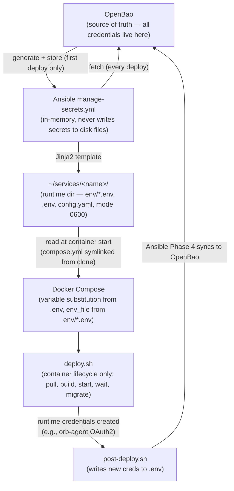
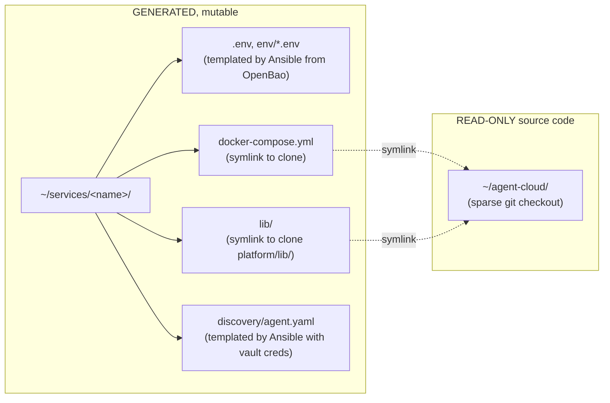
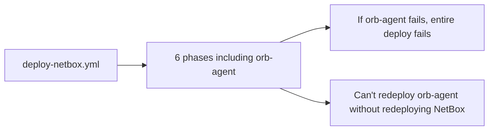
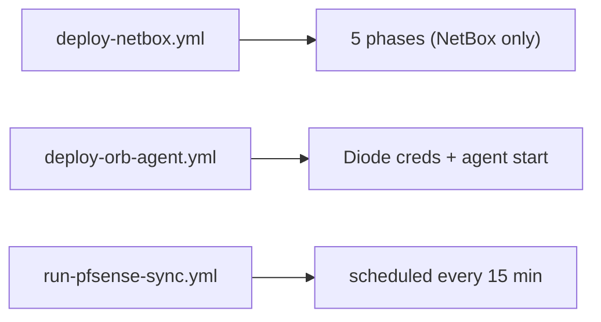
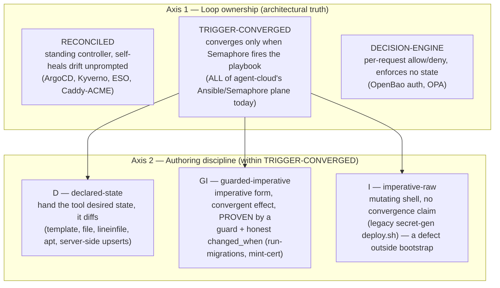
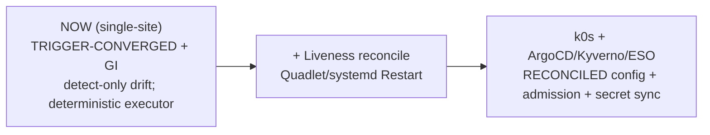

# 01 — Automation Model (composability + declarative/imperative)
> **Consolidates:** AUTOMATION-COMPOSABILITY.md, AUTOMATION-DECLARATIVE-VS-IMPERATIVE.md (originals archived in `plan/archive/`)
>
> **Depends on:** 00
>
> Part of the dependency-ordered `plan/architecture/` set (00–07). Source docs
> merged verbatim below under provenance dividers to preserve all detail.


<!-- ======================= source: AUTOMATION-COMPOSABILITY.md ======================= -->

# Automation Composability Plan

**Date:** 2026-04-02 (updated 2026-05-06)
**Status:** ACTIVE — Core composable deployment pattern proven for NetBox. Task library and playbook patterns are the standard for all service deployments. Implementation status of individual tasks and service migrations is tracked in development plans.
**Context:** The NetBox deployment exposed that deploy.sh scripts mix infrastructure concerns (credential management, OpenBao) with container operations (compose, migrations). This plan decomposes service deployments into reusable Ansible building blocks that Semaphore orchestrates.

---

## Problem

Each service's deploy.sh is a monolith that handles everything from secret generation to container lifecycle to API bootstrapping. This creates:

1. **Secret drift** — deploy.sh generates new secrets on each run if intermediary files are missing, causing password mismatches with existing databases
2. **Duplication** — Every deploy.sh reimplements OpenBao auth, secret generation, health waiting
3. **Tight coupling** — deploy.sh needs OpenBao credentials but Ansible already has them natively
4. **No validation** — Secrets are generated and used without verifying they work
5. **Intermediary files** — secrets/ directory on VM is a redundant copy of what's in OpenBao

## Solution: OpenBao-Driven Secret Lifecycle

**OpenBao is the single source of truth.** No `secrets/` directory on VMs. No local secret generation. Ansible fetches from OpenBao via `community.hashi_vault`, templates compose-ready config files, and deploy.sh only runs container operations.

### Architecture



**Source/Runtime Directory Split:**



See `plan/SPARSE-CHECKOUT-MIGRATION.md` for the full directory layout and migration details.

### Why Env Files on Disk?

Docker Compose does not integrate with OpenBao natively. The `.env` and `env/*.env` files are the **minimal required bridge** between Ansible-managed secrets and compose-consumed configuration. These files:
- Live in the runtime directory (`~/services/<name>/`), structurally separate from the git clone
- Are written by Ansible on every deploy (no drift)
- Contain resolved secrets but no generation logic
- Are the ONLY local secret storage — no `secrets/` directory
- Have mode `0600` (owner-read/write only)

This cannot be eliminated without switching to Docker Swarm secrets, Kubernetes + ESO, or a compose-external injection mechanism. For the Docker Compose pattern, env files on disk are the standard approach. The runtime directory separation ensures secrets never exist in the git working tree — filesystem isolation replaces `.gitignore` as the security boundary.

### What Ansible/Semaphore Manages Natively

| Layer | Mechanism | Disk? |
|-------|-----------|-------|
| Semaphore environment JSON | `bao_role_id`, `bao_secret_id`, `openbao_addr` | No — Semaphore injects as env vars |
| `community.hashi_vault` lookup | Reads secrets from OpenBao at runtime | No — Ansible memory only |
| `ansible.builtin.template` | Renders `.env.j2` → `.env` on VM | Yes — compose needs files |
| `ansible.builtin.uri` | Patches OpenBao with new creds (Phase 4) | No — API call |

### Secret Lifecycle

**First deploy (no secrets in OpenBao):**
1. `manage-secrets.yml` checks OpenBao — empty
2. Generates random secrets via Ansible `password` lookup (in memory)
3. Stores all secrets in OpenBao (single API call)
4. Templates env files on VM from generated values (Jinja2)
5. deploy.sh starts containers using the env files
6. post-deploy.sh creates runtime credentials (orb-agent OAuth2)
7. Phase 4 reads new creds from `.env`, patches OpenBao

**Subsequent deploys (secrets exist in OpenBao):**
1. `manage-secrets.yml` checks OpenBao — has values
2. Reuses ALL existing secrets (no regeneration, no drift)
3. Templates env files on VM from fetched values
4. deploy.sh starts containers — passwords match existing database volumes
5. post-deploy.sh finds existing credentials, skips creation
6. Phase 4 confirms creds in OpenBao (no-op patch)

**Credential rotation (scheduled — see Credential Lifecycle Plan):**
1. Rotation playbook creates new credential (Phase 1: CREATE)
2. New credential stored in OpenBao with `pending_verification` in metadata
3. Verification against live service (Phase 2: VERIFY)
4. If verified: old credential deleted from service + archived in OpenBao (Phase 3: RETIRE)
5. If verification fails: STOP, alert operator, old credential remains active
6. Env files re-templated with new credential values
7. Containers restarted to pick up new credentials

**Credential retirement (decommission — see Credential Lifecycle Plan):**
1. `revoke-service-credentials.yml` revokes AppRole secret_ids for the scope
2. Deletes service-level credentials (Hydra clients, API tokens)
3. Archives metadata (audit trail retained 90 days)
4. After retention period: permanent deletion

**Secret validation (check-secrets.yml / validate-secrets.yml):**
1. `check-secrets.yml` — Reads OpenBao, reports present/missing/empty (read-only)
2. `validate-secrets.yml` — Tests each credential against live services (DB, Redis, HTTP)
3. Neither modifies anything — pure verification

### No Local Secret Generation

deploy.sh and post-deploy.sh do NOT:
- Call `generate-secrets.sh`
- Write to a `secrets/` directory
- Generate random passwords
- Interact with OpenBao directly

They DO:
- Verify env files exist (fail if missing — means Ansible didn't run)
- Read credentials from `.env` (for compose exec commands that need passwords)
- Write runtime-created credentials to `.env` (orb-agent OAuth2 — synced to OpenBao by Ansible Phase 4)

### deploy.sh Split: Infrastructure + Application

deploy.sh is split into two scripts for independent retry and clear separation:

**deploy.sh (Infrastructure — steps 1-10):**
```
1.  Clone upstream dependency repos (netbox-docker)
2.  Copy .example templates (non-secret config)
3.  Verify env files present (fail if Ansible didn't run)
4.  Pull latest images
5.  Build custom image with plugins
6.  Stop stack gracefully
7.  Sync DB passwords to existing volumes
8.  Start services (staged: backing → Hydra → application)
10. Wait for NetBox healthy (up to 10 min for first-boot migrations)
```

**post-deploy.sh (Application — steps 11-16):**
```
11. Run database migrations
12. Create admin superuser (idempotent)
13. Register OAuth2 clients (Hydra)
14. Create/reuse orb-agent credentials (writes to .env)
15. Restart discovery services
16. Start Orb Agent (privileged, host networking)
```

The split enables:
- Retry post-deploy independently (if OAuth2 registration fails, don't rebuild containers)
- Different timeout profiles (infrastructure needs 10+ min, post-deploy is fast)
- Clear failure isolation (container startup vs application config)

---

## Composable Task Library

```
platform/playbooks/tasks/
  manage-secrets.yml       Fetch/generate secrets via OpenBao, template env files
  manage-approle.yml       Create/update AppRole + policy, store credentials     
  manage-diode-credentials.yml  Create fresh Diode orb-agent credentials         
  write-secret-metadata.yml     Write KV v2 custom metadata after secret store [PLANNED]   
  rotate-credential.yml         Generic Create→Verify→Retire rotation wrapper [PLANNED]    
  revoke-service-credentials.yml  Revoke AppRole secret_id + delete Hydra clients [PLANNED]
  clone-and-deploy.yml     Clone monorepo, run deploy.sh, health check           
  clean-service.yml        Destroy containers, volumes, clone + runtime dir       
  sparse-checkout.yml      Sparse-clone monorepo for specific service paths [PLANNED]       
  setup-runtime-dir.yml    Create ~/services/<name>/, symlinks to clone [PLANNED]           
  run-deploy.yml           Execute deploy.sh from runtime dir (passes CLONE_DIR) [PLANNED]  
  verify-health.yml        Health check a service endpoint [PLANNED]                        

platform/playbooks/
  deploy-<service>.yml     Composable: clone + secrets + deploy + verify            [NETBOX DONE]
  clean-deploy-<service>.yml  Wipe + fresh deploy                                  [NETBOX DONE]
  check-secrets.yml        Read-only secret inventory from OpenBao                
  validate-secrets.yml     Active credential testing (DB, Redis, HTTP)            
  distribute-ssh-keys.yml  Deploy SSH keys from OpenBao                           
  harden-ssh.yml           NOPASSWD sudo + sshd lockdown                          
  install-docker.yml       Install Docker CE (standalone)                          
  sync-secrets-to-openbao.yml  Push VM secrets → OpenBao (recovery/migration)     
  rotate-diode-credentials.yml  Monthly Diode client rotation (Hydra admin API)  
  rotate-ssh-keys.yml           Annual SSH key rotation                          
  audit-credentials.yml         Weekly credential inventory + stale detection    
```

`[PLANNED]` tasks are design targets that do **not** yet exist in `platform/playbooks/tasks/` — current playbooks use a full `git clone` (`ansible.builtin.git`), inline health checks (`ansible.builtin.uri`), and per-purpose playbooks instead (see `deploy-uhhcraft.yml` for the live pattern). Implement on demand; tracked in `plan/development/00-foundation-local-dev.md` Phase 0A.

### Task Responsibilities

**`sparse-checkout.yml`** *(planned — not yet implemented)*
- Sparse-clone `~/agent-cloud` via HTTPS with `--filter=blob:none --sparse`
- Configure `git sparse-checkout set` with service-specific `_sparse_paths`
- Idempotent: first run clones, subsequent runs pull
- No credentials needed (public repo)
- No convenience symlink — the runtime dir at `~/services/<name>/` replaces it

**`setup-runtime-dir.yml`** *(planned — not yet implemented)*
- Create `~/services/{{ service_name }}/` directory structure (mode `0700`)
- Symlink `docker-compose.yml` from runtime dir to clone
- Symlink `lib/` from runtime dir to clone's `platform/lib/`
- Symlink service-specific read-only dirs (workers, snmp-extensions) as needed
- Idempotent: Ansible `file: state: link` recreates symlinks on every run
- Accepts `_symlinks` list defining source (clone) and dest (runtime) pairs

**`manage-secrets.yml`**
- Authenticate to OpenBao via AppRole
- Fetch existing secrets from `secret/data/{{ vault_secret_prefix }}/{{ service_name }}` (default prefix: `"services"`)
- Generate missing secrets (random or Django-style, per `_secret_definitions`)
- Store all secrets (existing + generated) back to OpenBao
- Write KV v2 custom metadata (`created_at`, `creator`, `purpose`, `rotation_schedule`) after storing secrets — see Credential Lifecycle Plan
- Template service-specific env files into `_runtime_dir` (not the clone directory)
- Backward compatible: uses `vault_secret_prefix | default('services')` for paths, `_runtime_dir | default(...)` for template destinations
- Accepts `_secret_definitions` list: `[{name, type, length}]`
  - `type: random` — generated if missing (passwords, tokens)
  - `type: django` — Django secret key format if missing
  - `type: user` — user-managed, never auto-generated (SNMP, API keys)
  - `type: dynamic` — (Phase 6) OpenBao database engine credentials, not stored in KV — see Credential Lifecycle Plan
- Accepts `_env_templates` list of Jinja2 templates to render
- Accepts `_secret_metadata` dict: `{purpose, rotation_schedule}` — lifecycle tracking metadata written to KV v2

**`run-deploy.yml`**
- `cd` to `_runtime_dir` (e.g., `~/services/netbox/`), run deploy.sh from clone path
- Passes `CONTAINER_ENGINE` and `CLONE_DIR` as env vars
- deploy.sh resolves `LIB_DIR` from `$CLONE_DIR/platform/lib` (not relative path)
- deploy.sh validates `CLONE_DIR` contains a `.git` directory before sourcing libs
- deploy.sh verifies env files exist in runtime dir (but does NOT generate secrets)
- deploy.sh handles: upstream repos, image pull/build, compose lifecycle, migrations, superuser, OAuth2, agent start

**`verify-health.yml`**
- HTTP GET to `service_url + health_path`
- Retries with backoff
- Reports HEALTHY/UNHEALTHY

**`clean-service.yml`**
- Finds and stops compose stack (checks runtime dir then clone for compose file)
- Destroys all volumes (`compose down -v`)
- Removes any leftover containers with service name prefix
- Removes the runtime directory (`~/services/<name>/`)
- Removes the agent-cloud clone (sparse or full)
- Removes legacy convenience symlink (`~/<service>`) if present
- Requires `become: true` for killing stale port processes
- Used by `clean-deploy-<service>.yml` before a fresh deploy
- Note: does NOT revoke credentials — `clean-deploy-<service>.yml` calls `revoke-service-credentials.yml` first

**`write-secret-metadata.yml`**
- Writes KV v2 custom metadata to `secret/metadata/{{ vault_secret_prefix }}/{{ service_name }}`
- Fields: `created_at` (ISO 8601, set on first creation only), `creator` (playbook name), `purpose`, `rotation_schedule`
- Called by `manage-secrets.yml` after storing secrets, and by rotation tasks after storing new credentials
- Preserves existing `created_at` on subsequent runs (idempotent)

**`rotate-credential.yml`**
- Generic Create→Verify→Retire rotation wrapper following the credential lifecycle pattern
- Phase 1 (Create): runs `_create_tasks` block to generate and store new credential
- Phase 2 (Verify): runs `_verify_tasks` block to test new credential against live service
- Phase 3 (Retire): runs `_retire_tasks` block to delete old credential — **only if Phase 2 passed**
- If verification fails: STOP, alert operator, old credential remains active
- Dual-valid window bounded by single playbook execution
- Accepts `_create_tasks`, `_verify_tasks`, `_retire_tasks` as task include paths

**`revoke-service-credentials.yml`**
- Revokes the service's AppRole secret_id in OpenBao
- Deletes the service's Hydra/OAuth2 clients if applicable
- Archives credential metadata (retains audit trail)
- Called by `clean-deploy-<service>.yml` before `clean-service.yml`
- Requires OpenBao access (unlike `clean-service.yml` which is pure filesystem/container)

### Validation Playbooks

**`check-secrets.yml`** — Read-only secret inventory
- Lists all secrets in OpenBao for a service
- Reports which are present, which are missing, which are empty
- Does NOT generate or modify anything
- Usage: pre-deploy check, audit, troubleshooting

**`validate-secrets.yml`** — Active credential testing
- Fetches secrets from OpenBao
- Tests each against its service:
  - DB passwords: `psql` connection test
  - API tokens: HTTP request with auth header
  - Redis passwords: `redis-cli ping` with auth
- Reports: valid, invalid, unreachable
- Does NOT modify anything — read-only verification
- Usage: post-deploy verification, scheduled health checks

---

## Composable Playbook Pattern

Every `deploy-<service>.yml` follows this structure:

```yaml
vars:
  _monorepo_dir: "/home/{{ ansible_user }}/agent-cloud"
  _deploy_dir: "{{ _monorepo_dir }}/{{ monorepo_deploy_path }}"
  _runtime_dir: "/home/{{ ansible_user }}/services/{{ service_name }}"

# Phase 1: Sparse Checkout
- name: "Clone source code"
  hosts: <service>_svc
  tasks:
    # PLANNED — task does not exist yet; live playbooks use ansible.builtin.git
    - include_tasks: tasks/sparse-checkout.yml
      vars:
        _sparse_paths:
          - "platform/services/<service>/deployment"
          - "platform/lib"

# Phase 2: Secrets + Runtime Directory
- name: "Manage secrets and setup runtime"
  hosts: <service>_svc
  tasks:
    - include_tasks: tasks/manage-secrets.yml
      vars:
        _secret_definitions: [...]   # service-specific
        _env_templates: [...]        # service-specific (dest relative to _runtime_dir)
    # PLANNED — task does not exist yet
    - include_tasks: tasks/setup-runtime-dir.yml

# Phase 3: Container Operations (from runtime dir)
- name: "Deploy containers"
  hosts: <service>_svc
  tasks:
    # PLANNED — task does not exist yet; live playbooks run deploy.sh via ansible.builtin.shell
    - include_tasks: tasks/run-deploy.yml

# Phase 4: Verify
- name: "Verify deployment"
  hosts: <service>_svc
  tasks:
    - include_tasks: tasks/verify-health.yml
```

**Variable contract:** Every playbook defines `_monorepo_dir`, `_deploy_dir`, and `_runtime_dir`. The `_monorepo_dir` is the read-only sparse checkout. The `_runtime_dir` is the mutable working directory where env files are templated and deploy.sh executes. `_deploy_dir` points to source code within the clone.

Services that need Docker add `install-docker.yml` as a pre-phase. Services that need `become` for specific steps set it per-task.

**Legacy services** (not yet migrated to sparse checkout) omit `_runtime_dir` and continue using `clone-and-deploy.yml`. The `manage-secrets.yml` task falls back to the old path via `_runtime_dir | default(_monorepo_dir + '/' + monorepo_deploy_path)`.

### Lifecycle Workflow Patterns (Non-Deploy)

Not all workflows follow the 4-phase deploy pattern. Credential lifecycle workflows operate on existing deployments and follow their own patterns. See `plan/CREDENTIAL-LIFECYCLE-PLAN.md` for full details.

**Rotation pattern (scheduled):**
```yaml
# Phase 1: Create new credential
- include_tasks: tasks/rotate-credential.yml
  vars:
    _create_tasks: "tasks/create-diode-client.yml"    # service-specific
    _verify_tasks: "tasks/verify-diode-client.yml"     # test new cred against live service
    _retire_tasks: "tasks/retire-diode-client.yml"     # delete old client via Hydra admin API
```

**Audit pattern (scheduled, read-only):**
```yaml
# Single phase: inventory + report
- name: "Audit credentials"
  hosts: localhost
  tasks:
    # Iterates vault_secret_prefix, lists Hydra clients, checks AppRole ages
    # Reports stale/orphaned/missing-metadata credentials
    - include_tasks: tasks/audit-credentials.yml
```

These workflows get their own Semaphore templates and run on independent schedules. They do NOT require sparse checkout or runtime directory setup.

---

## What deploy.sh Keeps vs What Moves to Ansible

| Concern | deploy.sh | Ansible |
|---------|-----------|---------|
| Clone upstream repos (e.g., netbox-docker) | Yes | No |
| Copy .example templates | Yes | No |
| **Generate secrets** | **No** | **Yes (manage-secrets.yml)** |
| **Write env files from secrets** | **No** | **Yes (Jinja2 templates)** |
| **OpenBao read/write** | **No** | **Yes (native hashi_vault)** |
| Pull/build container images | Yes | No |
| Start/stop compose services | Yes | No |
| Wait for container health | Yes | No |
| Run DB migrations | Yes | No |
| Create admin users | Yes | No |
| Register OAuth2 clients | Yes | No |
| Start privileged agents | Yes (sudo) | No |
| **Clone monorepo** | **No** | **Yes (sparse-checkout.yml — planned; today: ansible.builtin.git)** |
| **Setup runtime directory** | **No** | **Yes (setup-runtime-dir.yml — planned)** |
| **Health check verification** | **No** | **Yes (verify-health.yml)** |
| **Docker/Podman installation** | **No** | **Yes (standalone playbook)** |
| **Secret validation** | **No** | **Yes (validate-secrets.yml)** |
| **Credential rotation** | **No** | **Yes (rotate-credential.yml + service-specific playbooks)** |
| **Credential metadata** | **No** | **Yes (write-secret-metadata.yml)** |
| **Credential revocation** | **No** | **Yes (revoke-service-credentials.yml)** |
| **Credential audit** | **No** | **Yes (audit-credentials.yml)** |

### deploy.sh Becomes Pure Container Operations

```bash
#!/usr/bin/env bash
# deploy.sh — Container operations only.
# Secrets and env files managed by Ansible. Monorepo cloned by Ansible.
# Runs from ~/services/<name>/ (runtime dir), NOT from the clone.

# CLONE_DIR set by Ansible; fallback resolves from script path
CLONE_DIR="${CLONE_DIR:-/home/${USER}/agent-cloud}"
LIB_DIR="${CLONE_DIR}/platform/lib"

# Validate CLONE_DIR before sourcing libs
[ -d "${CLONE_DIR}/.git" ] || error "CLONE_DIR (${CLONE_DIR}) is not a git repo."

# Verify env files exist in runtime dir (Ansible must run first)
[ -f ".env" ] || error ".env missing. Deploy via Semaphore."
[ -f "env/netbox.env" ] || error "env/netbox.env missing."

step 1: clone upstream dependency repos
step 2: copy .example templates (non-secret config only)
step 3: verify env files present (fail if missing)
step 4: pull images
step 5: build custom images
step 6: stop stack
step 7: sync DB passwords (existing volumes)
step 8: start stack (staged)
step 9+: wait, migrate, create superuser, OAuth2, agent
```

No `generate-secrets.sh` call. No OpenBao code. No `BAO_ROLE_ID`. Pure container lifecycle. Libraries sourced from the read-only clone via `CLONE_DIR`.

---

## Env File Templates (Jinja2)

Each service provides Jinja2 templates that `manage-secrets.yml` renders:

```
platform/services/netbox/deployment/
  templates/
    netbox.env.j2
    postgres.env.j2
    discovery.env.j2
    dot-env.j2
    hydra.yaml.j2
```

These replace `generate-secrets.sh`'s env file writing logic. Variables come from the `_resolved_secrets` dict populated by `manage-secrets.yml`.

---

## Configuration-as-Code for Deployments and Templates

All deployment configurations, Semaphore templates, and service settings are managed as code — not through manual UI actions or ad-hoc API calls.

### Principle: Templates Define the Deployment Surface

Semaphore task templates are the interface between operators and the automation. Each template maps a human-readable name to a composable playbook. Templates are defined in `platform/semaphore/templates.yml` (public repo, no secrets) and applied via `platform/semaphore/setup-templates.yml`.

**Implementation:**
- `platform/semaphore/templates.yml` — Declarative list of all task templates (name → playbook mapping)
- `platform/semaphore/setup-templates.yml` — Ansible playbook that creates/updates templates via Semaphore API
- Idempotent: existing templates are updated, new ones are created
- No secrets in templates — playbook paths only; credentials come from Semaphore environments

**Adding a new template:**
1. Add entry to `platform/semaphore/templates.yml`
2. Run `ansible-playbook semaphore/setup-templates.yml`
3. Verify in Semaphore UI

**Why not API calls:** Ad-hoc API calls are not tracked, not repeatable, and drift from the codebase. The config file is the source of truth for what templates should exist.

### Principle: Env Files as Jinja2 Templates

Service configuration files (`.env`, `env/*.env`, config YAML) are rendered from Jinja2 templates by Ansible's `manage-secrets.yml` task. This replaces bash `generate-secrets.sh` scripts.

**Template design rules:**
- Templates live in `platform/services/<name>/deployment/templates/`
- Variables come from the `_resolved` dict (OpenBao secrets merged with generated values)
- Secret-containing files get mode `0600` (default)
- Config files that containers read (e.g., `hydra.yaml`) get mode `0644` via the `mode` field in `_env_templates`
- Templates are Jinja2, not bash heredocs — supports conditionals, defaults, loops
- Each template maps to one compose-consumed file

**Template flow:**
```
templates/*.j2 (in sparse checkout, read-only)
  + secrets (from OpenBao, in Ansible memory)
  = env files (in ~/services/<name>/, mode 0600, compose-readable)
```

Templates are read from the clone (`_deploy_dir/templates/`). Rendered files are written to the runtime dir (`_runtime_dir/`). No template should write outside the runtime dir boundary.

### Principle: Clean Deploy for State Reset

When secrets or database schemas change incompatibly, a clean deploy destroys volumes and starts fresh. This is a deliberate, tracked operation — not a manual `docker compose down -v`.

**Implementation:**
- `tasks/revoke-service-credentials.yml` — revokes AppRole secret_ids and Hydra clients in OpenBao (credential cleanup)
- `tasks/clean-service.yml` — destroys containers, volumes, runtime dir, and clone (filesystem cleanup)
- `clean-deploy-<service>.yml` — revoke credentials + clean + deploy wrapper
- Semaphore template "Clean Deploy <Service>" exposes this as a UI action
- Destructive: requires explicit operator action, not triggered automatically

---

## Implementation Status

The core composable pattern is proven (NetBox reference implementation). Migration of remaining services and implementation of planned tasks is tracked in development plans:

- `plan/development/09-service-migrations-tooling.md` — sparse checkout and runtime directory separation
- `plan/architecture/02-service-onboarding.md` — per-service migration status and onboarding checklist
- `plan/development/01-secrets-credentials.md` — credential rotation and metadata tasks

During migration, services not yet converted continue using `clone-and-deploy.yml` — the `manage-secrets.yml` backward-compatible `default()` pattern ensures both old and new services work.

---

## Validation Criteria

| Check | Pass Condition |
|-------|---------------|
| No `secrets/` directory on VM | `ls secrets/` fails or is empty |
| No `generate-secrets.sh` call in deploy.sh | `grep generate-secrets deploy.sh` returns nothing |
| No `get_secret`/`put_secret` in deploy scripts | Functions read from `.env` only |
| deploy.sh fails without env files | Remove `.env` → deploy.sh errors immediately |
| OpenBao is authoritative | Redeploying reuses existing secrets (no new passwords) |
| First deploy works | Empty OpenBao → generate in memory → store → template → deploy |
| Subsequent deploy works | Existing OpenBao → fetch → template → deploy (DB passwords match) |
| Post-deploy creds sync | orb-agent creds written to `.env` → Phase 4 patches OpenBao |
| check-secrets reports accurately | Lists all secrets, flags missing |
| validate-secrets tests credentials | DB/API/Redis auth verified against live services |
| Task reuse works | Same manage-secrets.yml for netbox, nocodb, n8n |
| Idempotent end-to-end | Running deploy twice = same state, same passwords |
| deploy.sh split works | deploy.sh completes independently; post-deploy.sh retryable |
| Git pull after deploy works | `git -C ~/agent-cloud pull` succeeds, clean working tree |
| No generated files in clone | `git -C ~/agent-cloud status` shows nothing to commit |
| Runtime dir has all env files | `ls ~/services/<name>/.env env/*.env` succeeds |
| Symlinks resolve correctly | `readlink ~/services/<name>/docker-compose.yml` points to clone |
| Sparse checkout minimal | `du -sh ~/agent-cloud` < 5MB per service |
| Runtime dir permissions | `stat -c %a ~/services/<name>/` = 700, env files = 600 |
| Rotation creates new credential | Old cred still works until new is verified |
| Rotation verifies before retiring | Old cred only deleted after new passes validation |
| Metadata tracks lifecycle | Every secret has `created_at`, `creator`, `rotation_schedule` in KV v2 metadata |
| Audit playbook reports staleness | Credentials older than `rotation_schedule` flagged |
| AppRole TTLs enforced | `secret_id_ttl` > 0 and `token_num_uses` > 0 for all service AppRoles |

---

## Security Considerations

- **Source/runtime separation:** The git clone (`~/agent-cloud/`) is read-only source code. All secrets land in the runtime dir (`~/services/<name>/`). Filesystem isolation — not `.gitignore` — is the security boundary. No accidental `git add .` can capture secrets.
- **No `secrets/` directory in the clone:** Eliminated entirely. The bind-mount secret (`netbox_to_diode_client_secret.txt`) lives in `_runtime_dir/secrets/`, not the clone.
- **Runtime dir permissions:** `chmod 700` on the directory, `chmod 600` on all env files. Symlinked files (compose, libs) are world-readable since they contain no secrets.
- **Reduced attack surface per VM:** Sparse checkout means each VM only has code for its own service. A compromised NetBox VM cannot read deploy scripts for OpenBao, NemoClaw, or other services.
- **Root ownership eliminated:** deploy.sh never runs with `become`. Only specific sudo commands (orb-agent start) require privilege. No root-owned files in the clone.
- **CLONE_DIR validation:** deploy.sh validates that `CLONE_DIR` points to a directory containing `.git` before sourcing libraries. Prevents library injection via environment variable manipulation.
- **Minimal disk footprint:** Only `.env` and `env/*.env` files exist in the runtime dir (required by Docker Compose). These are overwritten on every deploy.
- **Secrets never in bash variables long-term:** Ansible holds secrets in memory during template rendering, then discards. deploy.sh reads from `.env` only when needed (compose exec).
- **Ansible `no_log: true`** on all secret-handling tasks — prevents credential leakage in Semaphore logs.
- **AppRole least privilege:** Semaphore's AppRole can read/write all service paths (orchestrator role). Per-service AppRoles are more restrictive.
- **AppRole TTL enforcement:** All AppRoles created via `manage-approle.yml` set `secret_id_ttl` (90 days) and `token_num_uses` (25). A `secret_id` with TTL=0 means a single leaked credential grants indefinite access. `token_num_uses` bounds the damage window if a token is intercepted. Semaphore's orchestrator AppRole is the documented exception (unlimited uses due to its cross-service orchestration role).
- **Verify before retiring (all credentials):** When rotating Diode OAuth2 clients, AppRole secret_ids, or any credential: (1) create the new credential, (2) verify it works against the live service, (3) only then revoke the old one. Never atomically swap — always maintain a dual-valid window with explicit verification. If verification fails, the old credential remains active. Dual-valid window is bounded by single playbook execution.
- **Audit metadata on every secret:** Every `manage-secrets.yml` invocation writes KV v2 custom metadata (`created_at`, `creator`, `purpose`, `rotation_schedule`). This enables the weekly credential inventory to distinguish active secrets from orphaned ones.
- **Audit logging:** OpenBao's file audit backend must be enabled and piped to the observability stack (Loki). Alerting rules fire on: same secret read >10x/minute (potential exfiltration), access from unknown AppRoles, and failed authentication attempts.
- **Scheduled credential inventory:** Weekly `audit-credentials.yml` (Semaphore-scheduled) compares OpenBao contents against inventory to detect orphaned credentials, missing metadata, and stale secrets.
- **Dynamic database credentials (planned):** Static Postgres passwords are the highest-risk credential type — they persist indefinitely. The credential lifecycle plan migrates these to OpenBao's database engine (1-hour leases). When implemented, DB credentials will not be templated into `.env` files; containers will fetch fresh credentials at startup. See `plan/CREDENTIAL-LIFECYCLE-PLAN.md`.
- **Validation catches drift:** `validate-secrets.yml` detects when a password in OpenBao no longer matches the database.
- **deploy.sh has no credential access:** Cannot authenticate to OpenBao, cannot generate secrets, cannot write to the source clone. Runs from the runtime dir only. Reduces blast radius if a deploy script is compromised.
- **Runtime credentials (orb-agent):** Created by post-deploy.sh, written to `_runtime_dir/.env`, synced to OpenBao by Ansible Phase 4. The `.env` is the transient holding area, not the source of truth.
- **Git pull is a security property:** With the clone always clean, `git pull` integrity is trivial to verify. Operators never need `git checkout .` or `git reset --hard`, which could mask malicious modifications.

---

## AppRole Management (Composable)

### Principle: Self-Service AppRole Provisioning

Services should not depend on OpenBao's `deploy.sh` to create their AppRole. Instead, any service playbook can provision its own AppRole via `tasks/manage-approle.yml`. This decouples identity management from the secrets backbone deployment.

**Implementation:** `tasks/manage-approle.yml`
- Creates/updates an HCL policy with the exact paths the service needs
- Creates/updates the AppRole with the policy attached
- Configures TTLs: `_approle_secret_id_ttl` (default: `"2160h"` / 90 days), `_approle_token_num_uses` (default: `25`)
- Returns `role_id` and `secret_id`
- Stores credentials at `secret/{{ vault_secret_prefix }}/approles/<name>` in OpenBao

**Semaphore's policy** (`semaphore-read.hcl`) includes `sys/policies/acl/*` and `auth/approle/role/*` capabilities so it can manage AppRoles for any service without root access. Semaphore's orchestrator AppRole overrides `_approle_token_num_uses: 0` (unlimited) since it already has the broadest policy and needs to make many API calls across all services.

**Example — provisioning an orb-agent AppRole:**
```yaml
- include_tasks: tasks/manage-approle.yml
  vars:
    _approle_name: "orb-agent"
    _approle_secret_id_ttl: "2160h"    # 90 days
    _approle_token_num_uses: 25
    _approle_policy: |
      path "secret/data/{{ vault_secret_prefix }}/netbox/orb_agent_*" {
        capabilities = ["read"]
      }
      path "secret/data/{{ vault_secret_prefix }}/netbox/snmp_community" {
        capabilities = ["read"]
      }
```

### Principle: Least-Privilege by Default

Each AppRole gets ONLY the paths it needs. The `manage-approle.yml` task enforces this by requiring the caller to specify the exact HCL policy. No blanket `secret/data/services/*` access unless explicitly requested.

### Principle: TTL Enforcement

All AppRoles must have bounded `secret_id_ttl` and `token_num_uses`. A `secret_id` with TTL=0 means a single leaked credential grants indefinite access. The secure defaults (`90d` / `25 uses`) are set via `| default()` so existing callers automatically get them. AppRole `secret_id` values must be rotated before their TTL expires — this is a Semaphore-scheduled playbook responsibility, not a deploy-time concern. See `plan/CREDENTIAL-LIFECYCLE-PLAN.md` for TTL rationale and rotation schedules.

---

## Workflow Decoupling

### Principle: Independent Workflows Over Monolithic Playbooks

Each deployment concern should be its own playbook that can run independently. Don't embed optional components (like the orb-agent) into the service deploy — create a separate workflow.

**Before (brittle):**



**After (decoupled):**



**Benefits:**
- Retry individual workflows without re-running the whole stack
- Schedule workflows independently (orb-agent after every NetBox deploy, pfsense-sync every 15 min)
- Different failure domains — orb-agent failure doesn't block NetBox availability
- Clear ownership — each playbook has one responsibility

### Principle: Semaphore Templates as Workflow Triggers

Each independent workflow gets its own Semaphore task template. Operators run "Deploy NetBox", then "Deploy Orb Agent", then schedule "Run pfSense Sync" — each independently observable and retryable in the Semaphore UI.

### Implemented Workflows

| Workflow | Playbook | Trigger | Depends On | Pattern |
|----------|----------|---------|------------|---------|
| Deploy NetBox | `deploy-netbox.yml` | Manual / CI | OpenBao unsealed | Sparse checkout + runtime dir |
| Deploy Orb Agent | `deploy-orb-agent.yml` | After NetBox deploy | NetBox healthy + Diode auth | Mounts split: agent.yaml from runtime dir, workers from clone |
| Clean Deploy NetBox | `clean-deploy-netbox.yml` | Manual (destructive) | OpenBao unsealed | Cleans both runtime dir + clone |
| pfSense Sync | `run-pfsense-sync.yml` (planned) | Every 15 min | NetBox + Diode healthy | — |
| Distribute SSH Keys | `distribute-ssh-keys.yml` | After VM provision | OpenBao has SSH keys | No monorepo needed |
| Harden SSH | `harden-ssh.yml` | After key distribution | Keys verified working | No monorepo needed |
| Rotate Diode Creds | `rotate-diode-credentials.yml` | Monthly (scheduled) | NetBox healthy + Hydra running | Create→Verify→Retire |
| Rotate SSH Keys | `rotate-ssh-keys.yml` | Annual (scheduled) | OpenBao + all VMs reachable | Create→Verify→Retire |
| Audit Credentials | `audit-credentials.yml` | Weekly (scheduled) | OpenBao unsealed | Read-only scan + report |

---

## Anti-Patterns to Avoid

### Brittle: Monolithic deploy scripts that handle everything
deploy.sh should NOT: generate secrets, authenticate to OpenBao, manage AppRoles, start auxiliary services, or handle credential rotation. Each concern has its own Ansible task.

### Brittle: Ad-hoc API calls for Semaphore/OpenBao management
All templates, policies, and AppRoles should be managed as code (`.yml`/`.hcl` files) and applied via playbooks. No `curl` one-liners.

### Brittle: Reusing stale credentials from OpenBao
Always verify credentials against the live service (e.g., `list_clients` from the Diode plugin), not just OpenBao. A clean deploy wipes the Hydra database but OpenBao retains old credentials. Beyond verification, **credential cleanup must be automated:**
- Diode OAuth2 clients: rotation playbook uses `hydra admin clients delete` (the Diode plugin has no `delete_client` API)
- AppRole secret_ids: old secret_ids must be revoked when new ones are generated; TTL enforcement (90 days) provides a safety net
- Decommissioned services: `clean-deploy-<service>.yml` calls `revoke-service-credentials.yml` before `clean-service.yml`
- Weekly `audit-credentials.yml` catches credentials that survive all other cleanup mechanisms

### Brittle: Atomic credential replacement without verification
Never delete an old credential and create a new one in the same task. The Create→Verify→Retire pattern requires three separate phases with a verification gate between Create and Retire. A failed rotation must leave the service operational with the old credential.

### Brittle: Sed-based credential injection
Don't resolve `${VARIABLE}` references via sed in config files. Use either:
- Ansible Jinja2 templates (for values known at deploy time)
- Service-native secret managers (e.g., orb-agent's vault integration)

### Brittle: Shared AppRoles across unrelated services
Each service/component should have its own AppRole with least-privilege policy. The `semaphore-read` AppRole is the exception — it's the orchestrator.

### Brittle: Writing generated files into the git clone
Never template `.env`, `agent.yaml`, or any generated config into `~/agent-cloud/`. The clone is read-only source code. All generated files go to `~/services/<name>/`. Violation causes git conflicts on pull, root ownership issues, and treats the clone as mutable. Use `manage-secrets.yml` to template into the runtime location (`setup-runtime-dir.yml` is planned, not yet implemented).

### Brittle: Running deploy.sh from the clone directory
deploy.sh must run from the runtime directory (`~/services/<name>/`), not the clone. The compose file in the runtime dir is a symlink to the clone, but `.env` and `env/*.env` are local to the runtime dir. Running from the clone means compose won't find its env files.

### Brittle: Using monorepo_deploy_path as the deploy working directory
`monorepo_deploy_path` identifies source code location within the clone. The runtime working directory is `~/services/<name>/`. Tasks that write files or run scripts must use `_runtime_dir`, not `_monorepo_dir/monorepo_deploy_path`.

### Brittle: Creating convenience symlinks to the clone
The old pattern (`~/netbox` → clone deploy path) is replaced by the runtime directory at `~/services/<name>/`. Convenience symlinks made the clone look like a working directory, which it is not.

<!-- ======================= source: AUTOMATION-DECLARATIVE-VS-IMPERATIVE.md ======================= -->

# Declarative vs Imperative Automation in agent-cloud

> **Location:** `plan/architecture/01-automation-model.md`
> **Date:** 2026-06-14 · **Status:** ADOPTED (reference standard) · **Owner:** uhstray-io
>
> **Purpose:** Decide *where* agent-cloud should use **declarative** automation and where **imperative** automation is correct — as a standing reference for classifying existing surfaces and authoring new ones. Read with `AUTOMATION-COMPOSABILITY.md` (the composable mechanics this builds on) and the root `CLAUDE.md` ("Foundational Over One-Shot").

**Goal:** A shared vocabulary and a set of rules that tell an engineer, for any automation surface in agent-cloud, *which style it should be and why* — and that name the platform's real automation debt honestly.

**TL;DR:** agent-cloud is **declarative at the description layer** (compose, Jinja2 env templates, `.hcl` policies, `templates.yml`, Kustomize) with a deliberately **thin imperative execution layer** (`deploy.sh` = container lifecycle only). The honest architectural baseline: **there are *zero* standing reconcilers in the running platform today** — everything converges *when Semaphore fires a playbook*, not continuously. That is the **correct** posture for single-site Compose/Podman; continuous reconciliation (ArgoCD/Kyverno/ESO) is the multi-site-Kubernetes future. The remaining imperative surfaces are either **forced** by host/OS/network constraints (not negotiable) or **known debt** (fixable) — and the single most urgent item is a real security defect in `manage-approle.yml` (see §7).

---

## 1. The two axes (the taxonomy this plan adopts)

"Declarative vs imperative" is too coarse for an ops repo. The useful model is **two orthogonal axes**. Axis 1 is the architectural truth (who closes the loop); Axis 2 is the task-author's discipline (how you write the step you must write today). Every automation surface gets a coordinate on both.

This document distinguishes *loop ownership* (does anything self-heal drift?) from *authoring discipline* (is this step honestly re-runnable?). The two are independent, and conflating them is what makes "is Ansible declarative?" an unanswerable question.



### Axis 1 — Loop ownership

- **RECONCILED** — a standing controller continuously diffs actual-vs-desired and converges **unprompted, forever**; drift self-heals at 3am with no human. *Litmus: "if reality drifts with no trigger, does it self-heal?"* Examples (all **future/edge** in agent-cloud): ArgoCD, Kyverno, External Secrets Operator, Caddy's internal ACME renewal loop.
- **TRIGGER-CONVERGED** — converges **only when invoked** (a Semaphore run). This is the **entire** current Ansible/Semaphore plane — including `state: present` modules and `compose up -d`. It is *not* declarative in the self-healing sense; calling it so hides the absence of a reconciler.
- **DECISION-ENGINE** — makes per-request allow/deny decisions; authors policy declaratively but enforces **no resource state**. OpenBao auth, OPA/Rego. (Distinct from Kyverno/ArgoCD, which *enforce* state — only the latter self-heals drift.)

### Axis 2 — Authoring discipline (applies *within* TRIGGER-CONVERGED)

- **D — declared-state:** you hand the tool the end state; it computes the diff; re-running is *intrinsically* a no-op. `ansible.builtin.template`/`file`/`lineinfile`/`apt`/`authorized_key`, `.j2`/`.hcl`/compose/`templates.yml` data, and server-side upserts (Vault policy `PUT`, Semaphore template `PUT`-by-id).
- **GI — guarded-imperative:** imperative *form*, declarative *effect*, where convergence is **hand-built** per task: a guard (`creates:`, a `when:` precondition, a `container exists` check) plus an **honest `changed_when`**. Legitimate and unavoidable at boundaries with no faithful module (podman/compose, in-container CLIs, vendor HTTP APIs). `run-migrations.yml`, `mint-internal-cert.yml`, the thin `deploy.sh` wrappers.
- **I — imperative-raw:** a mutating `shell`/`command` with **no** convergence — re-run behavior depends on side effects, not desired state. Outside genuine bootstrap/one-time genesis, this is a **defect**. The legacy n8n/nocodb secret-generating `deploy.sh` is the canonical instance.

> **The sharpest, most testable rule** (its own §6/§7): *a bare `changed_when: true` on a mutating `shell`/`command`/`podman exec` is an **unverified convergence claim** — GI-debt by default, and often I masquerading as GI.* Convergence in this repo is **authored, not free**; the author can get it wrong, and `manage-approle.yml` proves they did.

**Old labels → this model** (so prior notes reconcile): "3-tier A/B/C" → A=RECONCILED, B=imperative-raw/one-time, C=GI. "Idempotent-imperative" / "hybrid" → **GI**. "Policy-as-code" splits into *authoring* (always declarative) vs *runtime role* (DECISION-ENGINE vs RECONCILED).

---

## 2. Where agent-cloud sits today (the honest baseline)

- **Declarative *description* everywhere it counts:** `platform/services/*/deployment/compose.yml` (+ `compose.local.yml` overlays), `templates/*.j2` rendered by `manage-secrets.yml`, `platform/services/openbao/deployment/config/policies/*.hcl`, `platform/semaphore/templates.yml`, inventory vars. `setup-templates.yml` (list → `PUT`-if-exists / `POST`-if-new) is the in-repo gold standard for "declarative source, idempotent applier."
- **Thin imperative *execution*:** `deploy.sh` is container-lifecycle-only by rule (verify env → pull → `compose up -d` → wait healthy). That is the *intended* imperative residue, and it is correct GI.
- **Zero standing reconcilers in the live (Compose/Podman) plane.** `validate-secrets.yml` / `audit-credentials.yml` / `validate-all.yml` are scheduled **scans** (detect, never correct). The one unprompted reconciler that exists — the Diode **orb-agent** on a cron cadence — reconciles **NetBox inventory data**, not deployment/config state. So the compose tier has **detection without correction**; correction happens only on the next Semaphore-triggered deploy.
- **Kubernetes is greenfield.** `platform/k8s/` is empty `.gitkeep` scaffolding; ArgoCD/Kyverno/ESO are planned (Phase 3). Treat RECONCILED as **aspirational** for this platform today — it arrives with k0s.

Mapping to the **four-layer guardrails model**: the *Platform* layer is where RECONCILED pays off (k8s workloads, admission). The *Automation* layer is the TRIGGER-CONVERGED spine and should **stay** imperative-spine-with-declarative-leaves — it is the deterministic executor the AI layer is forbidden to bypass. The *Guardrail* layer is declarative-authored policy (some DECISION-ENGINE, some — in future — RECONCILED enforcement). The *AI* layer **proposes only** (§8).

---

## 3. Classification of agent-cloud surfaces

| Surface (file) | Axis 1 | Axis 2 | Note |
|---|---|---|---|
| k8s workloads (planned, `platform/k8s/`) | RECONCILED | D | ArgoCD reconciles Kustomize from git; self-heals. Empty today. |
| Kyverno admission (Phase 3) | RECONCILED | D | Admit/reject at the API boundary; pairs with ArgoCD. |
| External Secrets Operator (planned) | RECONCILED | D | OpenBao→k8s Secret sync loop. |
| Caddy ACME renewal (internal/prod) | RECONCILED | D | Caddy's own cert loop is a real reconciler. |
| Compose/Podman runtime (live) | TRIGGER-CONVERGED | GI | `compose up -d` converges *on trigger*; no orphan-reap, no 3am self-heal. Correct, not lesser. |
| Ansible playbook spine | TRIGGER-CONVERGED | D-leaves + GI | Phased plays, health-gated ordering. |
| `manage-secrets.yml` env render | TRIGGER-CONVERGED | **D** | `template` module — the model exemplar. |
| OpenBao secret *values* | TRIGGER-CONVERGED | GI (generate-if-missing) | Stateful + verification-gated; blind convergence would destroy data. Correctly never-regenerate. |
| `manage-approle.yml` | TRIGGER-CONVERGED | **I (defect)** | Mints a fresh `secret_id` every run, `secret_id_ttl: 0` — see §7. |
| OpenBao policies / `templates.yml` | TRIGGER-CONVERGED | D (data) over GI (apply) | Declarative source, idempotent upsert. |
| `deploy.sh` (dns/caddy/step-ca/uhhcraft/n8n) | TRIGGER-CONVERGED | GI (correct) | Thin lifecycle; no module does podman-compose+overlay faithfully. n8n is now composable (`.env` from `manage-secrets`; secrets no longer generated in `deploy.sh`). |
| legacy `deploy.sh` (nocodb) | TRIGGER-CONVERGED | **I (debt)** | Sources `bao-client.sh`, on-VM `secrets/` dir, programmatic admin/token creation — violates two Critical Rules. §7. |
| `mint-internal-cert.yml` | TRIGGER-CONVERGED | GI | Re-mints each run by design (cheap, overwrite); honest. |
| `run-migrations.yml` | TRIGGER-CONVERGED | GI (textbook) | goose idempotent at target + honest `changed_when`. |
| `harden-ssh.yml` | TRIGGER-CONVERGED | **D** | `lineinfile`+handler+`validate`+`assert` — best-in-repo. |
| bootstrap (local + prod genesis) | TRIGGER-CONVERGED | GI (sequenced) | ~25% irreducible ordering, ~75% reducible (§7). |
| OpenBao auth / OPA | DECISION-ENGINE | D (policy) | Per-request allow/deny; not a state reconciler. |
| host-side macOS wiring (resolver/forwarder/trust) | n/a (host) | GI (idempotent) | Forced imperative — outside the VM (§6). |
| n8n workflows | (unmanaged today) | — → D | Should be exported-as-code + applied via API (§7). |

---

## 4. Principles (the rules for choosing)

1. **Tag every surface on both axes.** "Is it declarative?" is ambiguous; "is it RECONCILED or TRIGGER-CONVERGED, and is it D / GI / I?" is answerable and actionable.
2. **Declarative *description* is mandatory; put desired state in data, never in shell.** Env contents, policies, the template catalog, zones, compose, n8n flows → files a tool reads (`.j2`/`.hcl`/`.yml`/JSON). Killing the legacy `common.sh generate_*_env()` heredocs is an instance.
3. **Reach for the module before `shell`.** `shell`/`command` is a last resort — justified only when no faithful module exists (podman/compose, in-container CLI, vendor API) or a module would be more convoluted than honest, guarded shell. `harden-ssh.yml` proves most "imperative" ops have a module.
4. **`changed_when` must be *true*, not `true`.** A mutating `shell`/`command` asserting `changed_when: true` is GI-debt unless the op genuinely always changes. Fix order: make the *operation* idempotent (read-guard before mutate), *then* report change honestly where a "changed" triggers a handler/restart/rotation. Enforce in CI (§7, rule AC-1).
5. **One reconciler per surface; never two sources of truth.** Secrets reconcile from OpenBao via `manage-secrets`; never *also* via `deploy.sh`. The n8n/nocodb dual path is the canonical violation.
6. **Imperative sequencing is legitimate only at genuine ordering boundaries** — genesis (first unseal/token/AppRole), `Create→Verify→Retire` rotation, staged stack start, destructive resets. Everywhere else, order is an *emergent property of declared state*, not a script.
7. **Single-site converges by trigger (permanent); reconcile *liveness*, not *config*.** Config-drift correction waits for multi-site k8s (RECONCILED pays off where a control plane already runs and drift surface is high). On single-site, the *only* worthwhile standing loop is **liveness** — Podman Quadlet / systemd `Restart=on-failure` so a crashed container self-heals without a Semaphore run. Keep config strictly trigger-driven so the executor stays deterministic.
8. **Genesis decomposes.** Process-genesis (running OpenBao+Semaphore) → declarative compose + a thin reconcile play. Only identity/trust-genesis (first unseal, first token, first `secret_id`) is irreducibly imperative-one-directional. Don't accept a 594-line hand-rolled bootstrap as inherent.
9. **Detection ≠ correction — say which you have.** The compose tier *detects* drift (scan playbooks) but does not *correct* it. Document that honestly; don't imply self-healing the platform doesn't yet have.

---

## 5. FORCED (non-negotiable) vs DEBT (fixable)

The imperative surfaces split cleanly. **FORCED** are correct and must not be "refactored to declarative." **DEBT** is fixable and tracked in §7.

| FORCED — imperative by real constraint | DEBT — imperative by choice/incompleteness |
|---|---|
| macOS host wiring: `/etc/resolver`, the `socat` LaunchDaemon, keychain trust — host files outside the podman VM, cannot go through Semaphore | `manage-approle.yml` `secret_id_ttl: 0` + unconditional `secret_id` mint — security defect |
| Privileged ports <1024 → root LaunchDaemon forwarder (no sysctl escape on macOS) | legacy n8n/nocodb secret generation in `deploy.sh` (+ `psql INSERT`) — violates 2 Critical Rules |
| Local token-mint cert issuance (`*.<zone>` not ACME-validatable inside the podman net) | `assert-orchestrated.yml` unwired — Critical Rule #1 unenforced *in the plays* |
| `.env`-on-disk secret bridge — Compose has no native OpenBao integration | env files templated into the clone, not a runtime dir — the doc's own anti-pattern; `[PLANNED]` runtime-dir tasks unbuilt |
| Semaphore env-var credential injection → `lookup('env','BAO_ROLE_ID')` | `changed_when: true` on idempotent `uri` API calls (bootstrap) — false change signal |
| same-path shared deploy dir — bind-mount source resolves on the VM engine | ~75% of bootstrap (control-plane `podman run` → compose; Semaphore resources → reconcile/provider) |
| SIGHUP / `caddy reload` apply — daemons reconcile config on signal, not file-watch | hand-rolled idempotency throughout the imperative control plane |
| `deploy.sh` = container lifecycle only — the *intended* thin imperative residue | — |

---

## 6. The unavoidable imperative core

Some imperative surfaces are **laws of the environment**, not preferences (all FORCED above). The clearest cluster is **macOS host-state**: `/etc/resolver/<zone>`, the System keychain, `/Library/LaunchDaemons`, and privileged-port binding all live *outside* the podman VM where Semaphore and the engine run — so they *cannot* be reconciled by the control plane and are correctly one-time, idempotent, host-bootstrap `make` targets. Likewise, daemons that reload config on a **signal** (step-ca SIGHUP, `caddy reload`) make the *apply* step imperative even when the config file itself is declarative. Trying to "declarative-ize" these is a category error.

---

## 7. Action backlog (ranked)

1. **`manage-approle.yml` — secret_id churn + `secret_id_ttl: 0` (SECURITY, do first).** It POSTs a fresh `/secret-id` on **every** run (orphaning the prior, which — with TTL 0 — never expires) and hardcodes `secret_id_ttl: 0` / `token_num_uses: 0` despite the security doc mandating bounded TTLs. Its sibling `provision-orb-agent-approle.yml` even documents the intended contract: *"run once, again only to rotate."* **Fix:** read the stored creds; generate a new `secret_id` only when absent / expired / `_approle_force_rotate`; on rotate, **revoke** the prior (`Create→Verify→Retire`); set a bounded `secret_id_ttl` (the doc's 90d). Converts the task from **I → D-effect**. (Note: local bootstrap inlines its own AppRole with bounded TTLs, so this bites the *prod/service* path.)
2. **Retire the legacy nocodb secret-generating path** (`common.sh:generate_*_env`, the on-VM `secrets/` dir, BAO creds passed into `deploy.sh` via `clone-and-deploy.yml`, the programmatic admin/API-token creation). Replace with `manage-secrets.yml` + `.env.j2` (→ D) and an idempotent post-deploy API bootstrap (→ GI). Held only on pre-seeding stateful secrets into OpenBao before cutover. (n8n already converted — composable `deploy.sh` + `manage-secrets`.)
3. **Wire `assert-orchestrated.yml`** as a declarative precondition in every deploy play (Critical Rule #1 is enforced today only by the `local-dev.sh` bash guard + convention).
4. **CI rule AC-1 (`changed_when` honesty):** a `shell`/`command`/`raw` task must not carry `changed_when: true` unless it bears an inline `# always-changes: <reason>` allow-comment. Carve-outs (annotate, don't change): `mint-internal-cert` (re-mints by design), `place-monorepo` local `tar|tar` (full re-sync), `clean-service` (destructive). ansible-lint's `no-changed-when` covers the *missing* case; AC-1 covers the *dishonest-`true`* case.
5. **Reconcile `AUTOMATION-COMPOSABILITY.md` with reality:** the `[PLANNED]` runtime-dir tasks (`sparse-checkout`/`setup-runtime-dir`/`run-deploy`/`verify-health`) don't exist, and `manage-secrets.yml` renders env *into the clone* — the doc's own anti-pattern. Either build the runtime-dir split or mark the doc as describing an unbuilt target.
6. **Decompose bootstrap** (§4.8): control-plane containers → a `compose.bootstrap.yml`; Semaphore resources → an "ensure resources" reconcile play (or a provider). Keep only the identity/seal kernel imperative.
7. **n8n workflows as managed declarative state:** export flows as JSON-in-repo, apply via an idempotent API task mirroring `setup-templates.yml`. Today they live only in n8n's DB — an unmanaged declarative surface.
8. **Liveness reconciliation (optional, single-site):** Podman Quadlet / systemd `Restart=on-failure` for crash self-heal — the one cheap standing loop that doesn't smuggle in autonomous config mutation.

---

## 8. The AI-layer invariant (load-bearing)

**The AI layer may only emit desired-state *proposals* into TRIGGER-CONVERGED / one-time pipelines that pass through the Guardrail layer. It must never *be* a RECONCILED controller nor author RECONCILED policy unmediated.** RECONCILED controllers (ArgoCD, Kyverno) act only on **human-merged** desired state. A standing autonomous convergence engine with an LLM authoring its target — able to act without a per-action trigger — is the one shape the four-layer model exists to forbid (an unattended loop with `down -v` reach and an LLM upstream). "AI proposes → guardrails validate → automation executes" is, precisely, *imperative control flow with declarative gates* — the right shape for a privacy/safety-critical platform. This is the default; weakening it requires an explicit, recorded decision.

---

## 9. Roadmap (where reconciliation arrives)



The runtime split *is* a decl/imp split, and that alignment is a feature: single-site Compose on Proxmox VMs has low drift surface and no cheap place to host a per-concern reconciler — TRIGGER-CONVERGED is *correct*. Multi-site k8s has high drift surface and a built-in control plane — RECONCILED wins decisively. Don't bolt continuous reconciliation onto the compose tier; let it arrive with Kubernetes.

---

## Decision criteria (alternatives considered)

| Option for the taxonomy | Verdict | Why |
|---|---|---|
| **Two axes (loop-ownership × authoring-discipline)** | **CHOSEN** | Separates the architectural truth (nothing self-heals yet) from the task-author's rule (write honest GI). Each answers a different real question; together they classify every surface without the "is Ansible declarative?" trap. |
| Binary declarative/imperative | Rejected | Forces `state: present` Ansible to be mislabeled "declarative," hiding the absence of a reconciler — the exact gap where the risk lives. |
| Three tiers (A/B/C) | Folded in | A good first cut; subsumed by the two-axis model (A=RECONCILED, C=GI, B=I/one-time). Kept as a cross-reference. |

The two-axis model was chosen because the project's central risk is **convergence that looks free but is hand-built and sometimes wrong** (`manage-approle.yml`); only a model that makes "who closes the loop" and "did you author idempotency honestly" *separately visible* surfaces that risk.

## Source context

This plan synthesizes a three-lens analysis of the repository, each verified against source, then cross-challenged:

- **Architecture lens** — declarative-vs-imperative as a property of *who closes the loop*; the four-layer mapping; the AI-invariant; liveness-vs-config reconciliation. Grounded in `AUTOMATION-COMPOSABILITY.md`, `IMPLEMENTATION_PLAN.md` (Idempotency Contract), `platform/k8s/` (empty), live deploy playbooks.
- **Automation lens** — the D/I/GI authoring discipline and the `changed_when: true` smell; refactor candidates. Grounded in `platform/playbooks/tasks/*` (`manage-secrets`, `manage-approle`, `place-monorepo`, `mint-internal-cert`, `run-migrations`), `harden-ssh.yml`, `common.sh`, `setup-templates.yml`.
- **Agent-cloud (ground-truth) lens** — current-state map, the FORCED-vs-DEBT split, and confirmation of the live `manage-approle` defect (`secret_id_ttl: 0` at lines ~60–61; unconditional `/secret-id` POST at ~75–85), the unwired `assert-orchestrated.yml`, and the unbuilt runtime-dir tasks. Grounded across `platform/playbooks/`, `platform/services/*/deployment/`, `platform/semaphore/`, `scripts/local-dev.sh`.

Consensus: adopt Axis-1 loop-ownership as the architectural truth (zero standing reconcilers today — names the k8s gap), layer D/I/GI authoring discipline within it, treat the `changed_when: true`-on-mutating-shell as the #1 debt signal, and rank the `manage-approle` defect as the most urgent fix.

## Target outcome

After this plan is adopted as the reference standard:

- Every new automation surface is authored with an explicit Axis-1/Axis-2 coordinate, and reviews reject **I masquerading as GI** (bare `changed_when: true` on mutating shell) via CI rule AC-1.
- The `manage-approle` security defect is fixed (`Create→Verify→Retire`, bounded TTL); the legacy n8n/nocodb secret path is retired; `assert-orchestrated.yml` is wired.
- `AUTOMATION-COMPOSABILITY.md` describes the system that actually exists (runtime-dir built, or the design dropped).
- The platform's drift story is stated honestly — *detect-only on the compose tier today; continuous reconciliation arrives with k0s/ArgoCD* — and the AI layer is constrained, by invariant, to proposing into gated pipelines rather than closing loops.
