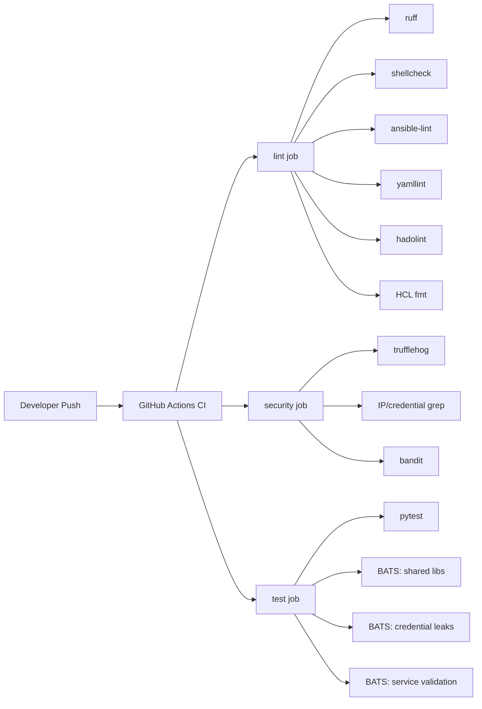
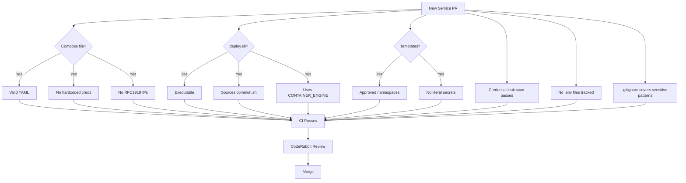
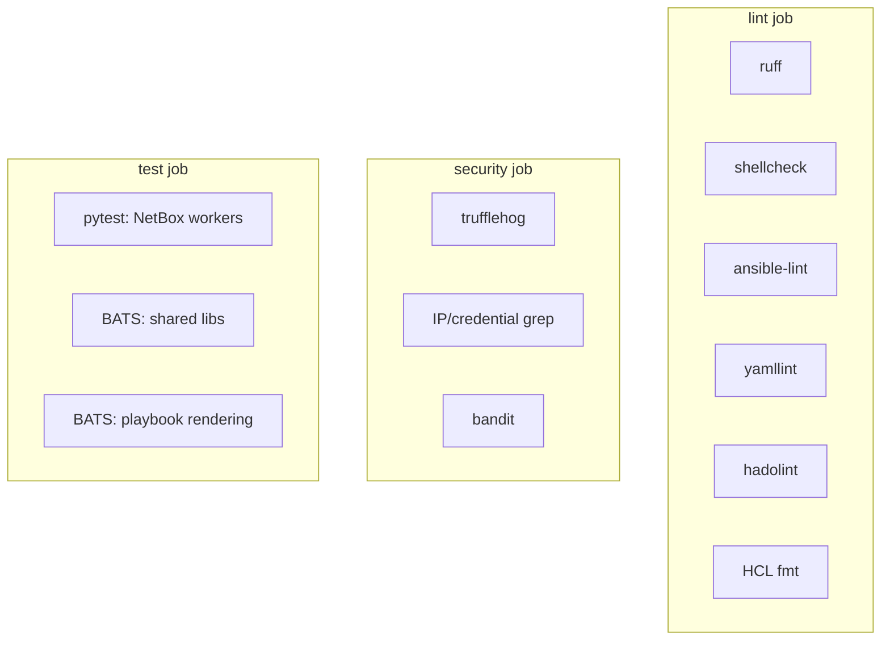
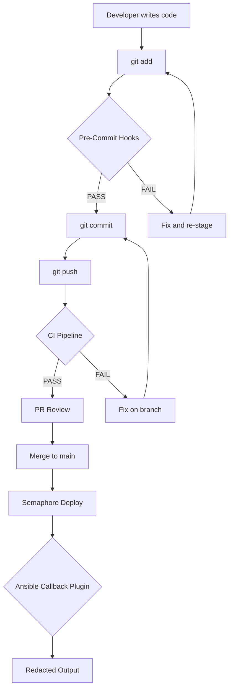
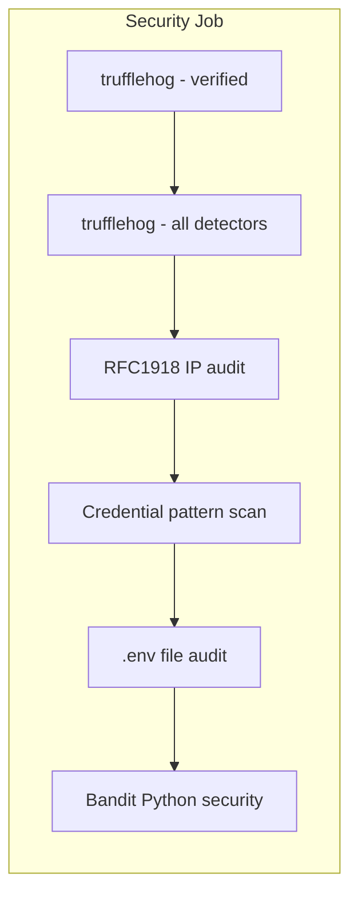
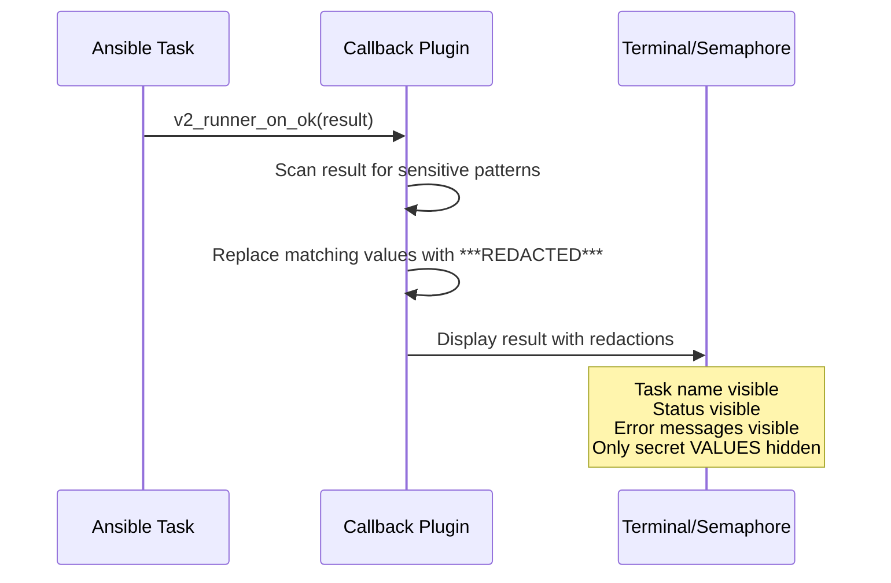
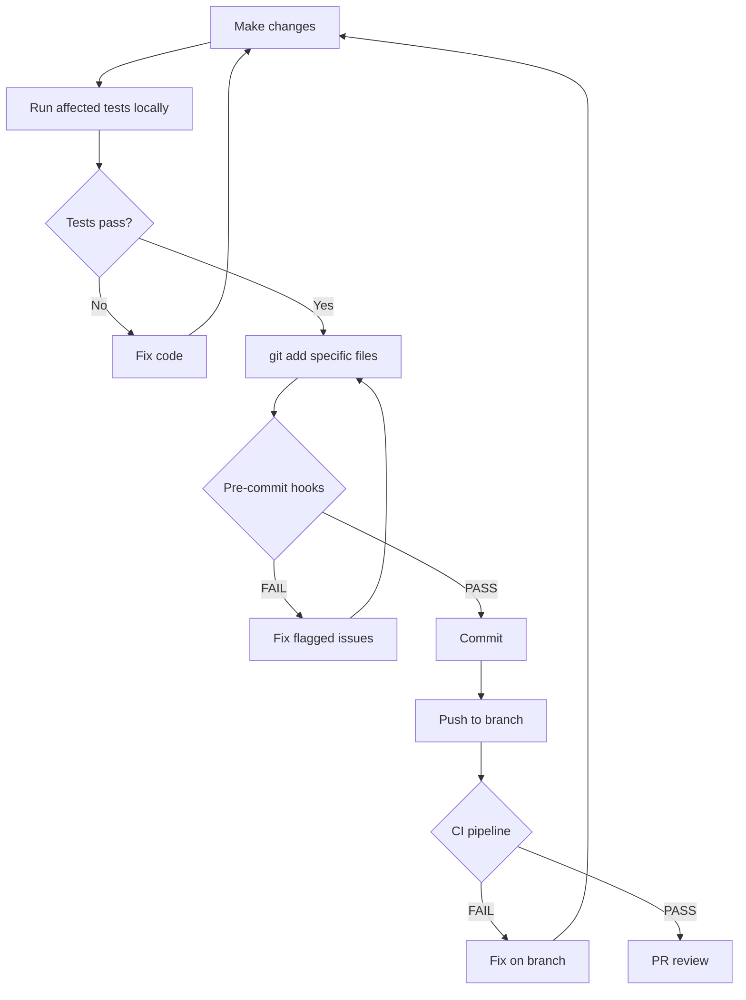
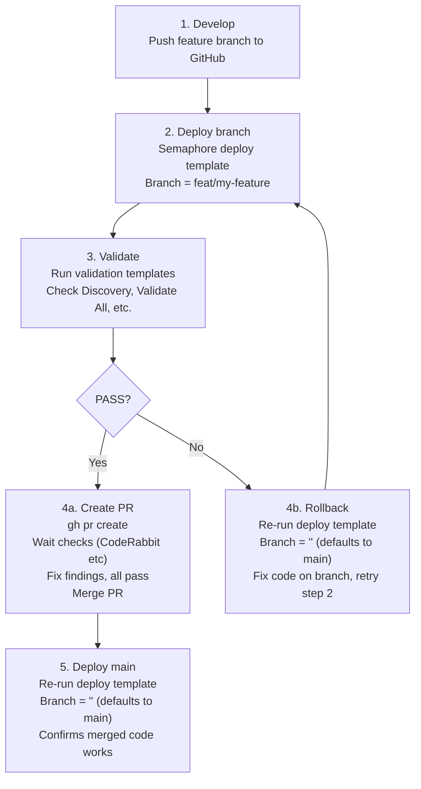

# 03 — Testing, CI & Quality Gates
> **Consolidates:** TESTING-AND-LINTING-PLAN.md, CI-TESTING-SPECIFICATION.md, LINTING-AND-TESTING.md, SECURITY-TESTING-STANDARDS.md, BRANCH-TESTING-WORKFLOW.md, OPENSSF-SCORECARD-PLAN.md (originals archived in `plan/archive/`)
>
> **Depends on:** 00, 01
>
> Part of the dependency-ordered `plan/architecture/` set (00–07). Source docs
> merged verbatim below under provenance dividers to preserve all detail.


<!-- ======================= source: TESTING-AND-LINTING-PLAN.md ======================= -->

# Testing and Linting Plan

**Date:** 2026-04-21
**Updated:** 2026-05-06
**Status:** ACTIVE — Phases 1-5 implemented for NetBox. Coverage gaps remain for 11 services and 3 agents.
**Contributors:** Architecture, Automation, Security, and Testing review agents

---

## Coverage Assessment (2026-05-06)

### What Exists

The CI pipeline (`.github/workflows/lint-and-test.yml`) runs 3 jobs with 8 linters on every PR to main. Python unit tests (79 cases) and BATS bash tests (39 cases across 3 files) provide functional coverage for NetBox workers and shared libraries.

| Component | Test Coverage | Notes |
|-----------|---------------|-------|
| `platform/lib/common.sh` | BATS (8 functions) | Shared library |
| `platform/services/netbox/deployment/lib/common.sh` | BATS (6 functions) | NetBox-specific library |
| `platform/playbooks/` | BATS (2 functions) | Heredoc/rendering validation |
| `platform/services/netbox/deployment/workers/` | pytest (79 cases) | Proxmox + pfSense helpers |

### What Is Missing

**11 services with zero tests:** caddy, inference, n8n, nextcloud, nocodb, o11y, openbao, postiz, semaphore, wikijs, a2a-registry

**3 agents with zero tests:** nemoclaw, netclaw, cowork

**No tests exist for:**
- Compose file validation (valid YAML, required services, no hardcoded credentials)
- deploy.sh structural validation (sources common.sh, uses CONTAINER_ENGINE variable)
- Environment template validation (Jinja2 templates use proper variable namespaces)
- Credential leak regression tests as standalone BATS tests (currently only CI grep)
- .gitignore coverage validation for sensitive patterns
- Tracked .env file detection

### New Testing Requirements

Every new service onboarded to agent-cloud must include tests before its PR can merge. See `plan/architecture/03-testing-ci-quality.md` for the full specification including:

- Test templates for compose files, deploy scripts, env templates, and credential leaks
- Service onboarding testing checklist
- CI pipeline extension recommendations

---

## Original State (2026-04-21)

The repository had **zero automated testing or linting infrastructure** at the start of this plan. No GitHub Actions, no pre-commit hooks, no pytest, no shellcheck, no ansible-lint. The only quality gates were:

- A manual `grep`-based pre-push audit for leaked IPs/credentials (CLAUDE.md)
- Runtime validation playbooks in Semaphore (`validate-all.yml`, `validate-secrets.yml`, `check-discovery.yml`)
- CodeRabbit automated code review on PRs

## Guiding Principles

1. **Automate what's manual** — the pre-push audit grep patterns should be a pre-commit hook, not discipline
2. **Static analysis before unit tests** — linting catches more bugs per hour of setup than writing tests
3. **Test pure functions first** — the discovery workers have ~15 helper functions with clear contracts
4. **Don't test what Semaphore already validates** — runtime health checks against live services stay in Semaphore
5. **Security scanning is non-negotiable for a public repo** — trufflehog must gate every PR

---

## Phase 1: Static Analysis (immediate, no test infrastructure needed)

### 1a. Python Linting — Ruff

**Scope:** 4 Python files (~1,800 LOC total)
- `workers/proxmox_discovery/proxmox_discovery/__init__.py`
- `workers/pfsense_sync/pfsense_sync/__init__.py`
- `lib/pfsense-sync.py`
- `configuration/plugins.py`

**Configuration:** Add `[tool.ruff]` to root `pyproject.toml`:
```toml
[tool.ruff]
target-version = "py311"
line-length = 120

[tool.ruff.lint]
select = ["E", "F", "W", "I", "UP", "B", "SIM", "PIE", "C4", "BLE"]
ignore = ["BLE001"]  # blind except is intentional in worker error handling
```

### 1b. Shell Linting — ShellCheck

**Scope:** 28 shell scripts across the repo
- `platform/lib/common.sh`, `platform/lib/bao-client.sh`
- `platform/services/*/deployment/deploy.sh`
- `platform/services/netbox/deployment/lib/common.sh`, `lib/generate-secrets.sh`
- `agents/nemoclaw/deployment/deploy.sh`, `update.sh`, `validate.sh`

**Tool:** `shellcheck` (install via `brew install shellcheck` or CI action). Scans the entire repo (excluding `netbox-docker/`).

### 1c. Ansible Linting

**Scope:** 50+ YAML playbooks and task files
- `platform/playbooks/*.yml`
- `platform/playbooks/tasks/*.yml`
- `platform/semaphore/templates.yml`

**Configuration:** `.ansible-lint` at repo root:
```yaml
skip_list:
  - command-instead-of-module  # deploy.sh invocations are intentional
  - no-changed-when            # many shell tasks are check commands
exclude_paths:
  - netbox-docker/
  - .github/
```

### 1d. YAML Linting

**Scope:** All YAML files (playbooks, compose files, agent configs, templates.yml)
**Tool:** `yamllint` with relaxed rules for Ansible compatibility

### 1e. Dockerfile Linting — hadolint

**Scope:** 1 custom Dockerfile
- `platform/services/netbox/deployment/Dockerfile-Plugins`
- (`netbox-docker/Dockerfile` is vendored upstream — excluded)

**Tool:** `hadolint` via CI action. Catches base image issues, layer inefficiencies, and security anti-patterns.

### 1f. Jinja2 Template Validation

**Scope:** 6 Jinja2 templates in `platform/services/netbox/deployment/templates/`
- `agent.yaml.j2`, `discovery.env.j2`, `dot-env.j2`, `hydra.yaml.j2`, `netbox.env.j2`, `postgres.env.j2`

**Tool:** `ansible-lint` validates Jinja2 syntax when checking playbooks that reference templates. Standalone `j2lint` available for direct template checking.

### 1g. HCL Policy Validation

**Scope:** 8 HCL files in `platform/services/openbao/deployment/config/`
- `openbao.hcl` (server config)
- `policies/*.hcl` (7 AppRole policies: semaphore-read, semaphore-write, orb-agent, nemoclaw-read, nemoclaw-rotate, nocodb-write, n8n-write)

**Tool:** `openbao policy fmt -check` or `terraform fmt -check` for syntax validation. These are security-critical files — invalid policy syntax could lock out services.

**Status:** Manual validation for now. CI integration planned when `openbao` CLI is available in GitHub Actions runners.

### 1h. Secret Scanning — trufflehog

**Scope:** All committed content + staged changes
**Tool:** `trufflehog` as pre-commit hook and CI gate
**Rationale:** The manual grep patterns in CLAUDE.md catch IPs and simple passwords but miss API tokens, SSH keys, base64 credentials, JWTs, PEM content. trufflehog covers all of these.

---

## Phase 2: Python Unit Tests

### Framework

**pytest** with a `conftest.py` providing shared fixtures and SDK mocks.

### Test Layout

```text
platform/services/netbox/deployment/
  tests/
    conftest.py              # SDK stubs (worker.backend, worker.models)
    test_proxmox_helpers.py  # 66 test cases via 14 parametrized functions
    test_pfsense_helpers.py  # 13 test cases via 1 parametrized function
```

### Mock Strategy

The `worker.backend.Backend` and `worker.models` modules are orb-agent runtime-only — not pip-installable. `conftest.py` stubs them via `sys.modules` injection. The real `netboxlabs-diode-sdk` is installed as a test dependency (entity constructors are pure data containers).

### Implemented Tests — Pure Logic (parametrized)

| Parametrized Function | Module | Test Cases |
|-----------------------|--------|------------|
| `test_int` | proxmox_discovery | 9 |
| `test_mb_to_gb` | proxmox_discovery | 4 |
| `test_bytes_to_gb` | proxmox_discovery | 3 |
| `test_should_skip_iface` | proxmox_discovery | 12 |
| `test_iface_type` | proxmox_discovery | 8 |
| `test_prefix_len` | proxmox_discovery | 8 |
| `test_returns_none` | proxmox_discovery | 3 |
| `test_strips_sensitive_lines` | proxmox_discovery | 7 |
| `test_preserves_words_containing_keywords` | proxmox_discovery | 3 |
| `test_clean_description_unchanged` | proxmox_discovery | 1 |
| `test_selection` | proxmox_discovery | 5 |
| `test_skips_non_routable` | proxmox_discovery | 3 |
| `test_is_valid_ip` | pfsense_sync | 13 |
| **Total** | **13 functions** | **79 test cases** |

### Future: Entity Builder Tests (mocked SDK/API)

These would test `_build_node()`, `_build_vm()`, `_build_lxc()`, `_build_seed_entities()`, and `_build_entities()` with mocked Proxmox API and SDK. Not yet implemented — prioritized pure function coverage first.

---

## Phase 3: Bash Script Testing

### ShellCheck (static, Phase 1)

Already covered in Phase 1b.

### BATS Unit Tests — IMPLEMENTED

**Framework:** [BATS](https://github.com/bats-core/bats-core) (Bash Automated Testing System)

```text
platform/tests/
  test_common.bats          # 8 functions testing platform/lib/common.sh
  test_netbox_common.bats   # 6 functions testing netbox lib/common.sh
```

**36 test cases across 14 composable functions:**

| Test File | Functions Tested | Test Cases |
|-----------|-----------------|------------|
| `test_common.bats` | gen_secret, needs_gen, get/put_secret, detect_runtime, info, warn | ~20 |
| `test_netbox_common.bats` | gen_secret, gen_django_key, get/put_secret, needs_gen, get_val, read_existing | ~16 |

Tests use multi-assertion patterns — each BATS function verifies multiple related behaviors (e.g., `put/get_secret` tests create, read, permissions, overwrite, and missing in one function).

---

## Phase 4: Security Testing

### 4a. Secret Scanning (Phase 1e)

Already covered. trufflehog as pre-commit + CI gate.

### 4b. Dependency Scanning — IMPLEMENTED

**Tool:** GitHub Dependabot (`.github/dependabot.yml`)
**Scope:** pip (3 directories), GitHub Actions, Docker base images. Weekly schedule.

### 4c. Python Security Linting — IMPLEMENTED

**Tool:** Bandit in CI security job. Skips B101 (assert) and B110 (try-except-pass).
**Scope:** Worker Python files and `lib/pfsense-sync.py`.

### 4d. Sanitization Regex Hardening

The `_sanitize_description()` regex covers `password|passwd|secret|token|key` but misses:
- `credential`, `apikey` (no underscore), `private`, `cert`, `bearer`, `auth`

Expand the pattern and add test cases. Balance false positives (stripping "keyboard" etc.) vs. credential leakage risk.

### 4e. TLS Verification Audit

Both `proxmox_discovery` and `pfsense_sync` default `verify_ssl=False`. Document this as an accepted risk for self-signed certs in uhstray.io datacenter, but add a config option to enable verification when proper CA infrastructure exists.

---

## Phase 5: CI Pipeline (GitHub Actions)

### Proposed Workflow

See `.github/workflows/lint-and-test.yml` for the actual implementation. The workflow runs two jobs on every PR to main:

**lint job:** ruff (Python), shellcheck (all `.sh` files, warning severity), ansible-lint (playbooks), yamllint (all YAML), hadolint (Dockerfiles)

**security job:** trufflehog (verified secrets), IP/credential grep audit

**test job** (Phase 2, planned): pytest with mocked SDK dependencies

### Semaphore Integration (unchanged)

Semaphore continues to own runtime validation:
- `validate-all.yml` — HTTP health checks
- `validate-secrets.yml` — credential testing against live services
- `check-discovery.yml` — entity count verification post-deploy

No changes needed to Semaphore. GitHub Actions handles pre-merge quality; Semaphore handles post-deploy verification.

---

## Implementation Priority

| Phase | Status | Tests/Tools |
|-------|--------|-------------|
| 1a. Ruff (Python lint) | Done | `pyproject.toml` config, violations fixed |
| 1b. ShellCheck | Done | Warning severity, full repo scan, violations fixed |
| 1c. Ansible-lint | Done | `.ansible-lint` config, CI step |
| 1d. YAML lint | Done | `.yamllint.yml`, trailing-spaces enforced |
| 1e. Hadolint | Done | Dockerfile linting in CI |
| 1f. Jinja2 validation | Done | Via ansible-lint |
| 1g. HCL validation | Done | `vault fmt -check` in CI |
| 1h. Trufflehog | Done | Secret scanning in CI |
| 2. Python unit tests | Done (NetBox only) | 79 test cases, 13 parametrized functions |
| 3. BATS bash tests | Done (shared libs only) | 39 test cases, 17 composable functions |
| 4a. Secret scanning | Done | Trufflehog in CI |
| 4b. Dependabot | Done | pip, GitHub Actions, Docker |
| 4c. Bandit | Done | Python security lint in CI |
| 5. CI pipeline | Done | 3 jobs: lint, security, test |
| 6. Credential leak tests | **New** | `platform/tests/test_credential_leaks.bats` |
| 7. Service onboarding tests | **Planned** | Per-service compose/deploy/template validation |
| 8. Compose dry-run validation | **Planned** | CI step using `docker compose config` |
| 9. Coverage reporting | **Planned** | pytest-cov + BATS TAP output |

---

## Challenges Identified by Review Team

1. **Orb-agent SDK not pip-installable** — `worker.backend.Backend` and `worker.models` are runtime-only. Tests must stub these via `sys.modules` in conftest.py.
2. **Shell scripts are platform-dependent** — `common.sh` detects Podman vs Docker at runtime. BATS tests need to mock or skip platform-specific paths.
3. **Ansible playbooks target live infrastructure** — Molecule would require extensive mocking. ansible-lint + `--check` mode are the pragmatic choices until a test environment exists.
4. **`_sanitize_description` false positive risk** — Expanding the keyword list risks stripping legitimate description content. Each new keyword needs negative test cases.
5. **TOCTOU in env file generation** — `generate_*_env()` functions in `common.sh` write files then chmod, leaving a brief window where secrets are world-readable. Fix: use `umask 077` subshells like `put_secret()` already does.
6. **Only NetBox has functional tests** — 11 services and 3 agents have zero test coverage. Service onboarding must require tests going forward.
7. **No compose validation in CI** — Compose files are YAML-linted but never checked for structural correctness (required services, volume mounts, network definitions).
8. **Credential leak tests are CI-only** — The IP/credential grep runs only in the security CI job diff. No standalone BATS tests exist for regression testing against the full committed tree.
9. **No Jinja2 template rendering tests** — Templates are validated only via ansible-lint syntax checks, not for correct variable namespace usage or rendering output.

---

## Related Documents

- `plan/architecture/03-testing-ci-quality.md` — Detailed specification for writing tests for new services
- `plan/architecture/03-testing-ci-quality.md` — OpenSSF Scorecard implementation plan
- `docs/LINTING-AND-TESTING.md` — Local setup and pre-PR checklist
- `plan/architecture/03-testing-ci-quality.md` — Branch deploy and validation workflow

<!-- ======================= source: CI-TESTING-SPECIFICATION.md ======================= -->

# CI Testing Specification

**Date:** 2026-05-06
**Status:** ACTIVE
**Scope:** Test standards, templates, and onboarding requirements for all agent-cloud services

---

## Overview

This specification defines what tests must exist for every service and agent in agent-cloud, how to write them, and what must pass before a PR is merged. It addresses the coverage gap where only NetBox has functional tests while 11 services and 3 agents have none.

### Test Pipeline Flow



---

## 1. Test Categories

### 1a. Unit Tests (BATS / pytest)

Test individual functions and scripts in isolation.

| Framework | Scope | Location |
|-----------|-------|----------|
| BATS | Bash libraries, deploy scripts, structural validation | `platform/tests/` |
| pytest | Python workers, helpers, data transformers | `platform/services/<svc>/deployment/tests/` |

### 1b. Security Tests (credential leak)

Validate that no credentials, private IPs, or secrets are committed to the repository.

| Test | Tool | Location |
|------|------|----------|
| RFC1918 IP detection | BATS + grep | `platform/tests/test_credential_leaks.bats` |
| Hardcoded password detection | BATS + grep | `platform/tests/test_credential_leaks.bats` |
| Template namespace validation | BATS + grep | `platform/tests/test_credential_leaks.bats` |
| Gitignore coverage | BATS | `platform/tests/test_credential_leaks.bats` |
| Tracked .env detection | BATS + git | `platform/tests/test_credential_leaks.bats` |
| Verified secret scanning | trufflehog | CI security job |

### 1c. Validation Tests (compose, template, structure)

Validate configuration files are well-formed and follow conventions.

| Test | Tool | Target |
|------|------|--------|
| Compose YAML validity | BATS + python yaml | `**/compose.yml`, `**/docker-compose.yml` |
| Compose required services | BATS + grep/yq | Service-specific compose files |
| Compose no hardcoded creds | BATS + grep | All compose files |
| Jinja2 template syntax | ansible-lint | `**/templates/*.j2` |
| Jinja2 namespace validation | BATS + grep | `**/templates/*.j2` |
| deploy.sh structure | BATS | `**/deploy.sh` |

### 1d. Integration Tests (health check)

Runtime validation against live services. These run in Semaphore, not GitHub Actions.

| Test | Playbook | Environment |
|------|----------|-------------|
| HTTP health checks | `validate-all.yml` | Semaphore |
| Credential validation | `validate-secrets.yml` | Semaphore |
| Discovery entity counts | `check-discovery.yml` | Semaphore |

---

## 2. New Service Testing Template

Every service added to `platform/services/<name>/` must have corresponding tests. Below are BATS test templates that can be copied and adapted.

### 2a. Compose File Validation

```bash
#!/usr/bin/env bats
# Tests for platform/services/<name>/deployment compose file.

SERVICE_NAME="<name>"
COMPOSE_DIR="$BATS_TEST_DIRNAME/../services/$SERVICE_NAME/deployment"

@test "$SERVICE_NAME compose: file exists and is valid YAML" {
  local compose_file
  compose_file=$(find "$COMPOSE_DIR" -maxdepth 1 \
    -name "compose.yml" -o -name "docker-compose.yml" | head -1)
  [ -n "$compose_file" ]
  python3 -c "import yaml; yaml.safe_load(open('$compose_file'))"
}

@test "$SERVICE_NAME compose: defines at least one service" {
  local compose_file
  compose_file=$(find "$COMPOSE_DIR" -maxdepth 1 \
    -name "compose.yml" -o -name "docker-compose.yml" | head -1)
  grep -q "^services:" "$compose_file"
}

@test "$SERVICE_NAME compose: no hardcoded credentials" {
  local compose_file
  compose_file=$(find "$COMPOSE_DIR" -maxdepth 1 \
    -name "compose.yml" -o -name "docker-compose.yml" | head -1)
  # Should use env_file or ${VAR} references, not literal passwords
  ! grep -iE 'password:\s*["\x27]?[A-Za-z0-9]{8,}' "$compose_file"
  ! grep -iE 'secret:\s*["\x27]?[A-Za-z0-9]{8,}' "$compose_file"
}

@test "$SERVICE_NAME compose: no hardcoded RFC1918 IPs" {
  local compose_file
  compose_file=$(find "$COMPOSE_DIR" -maxdepth 1 \
    -name "compose.yml" -o -name "docker-compose.yml" | head -1)
  ! grep -E '(192\.168\.|10\.[0-9]+\.[0-9]+\.|172\.(1[6-9]|2[0-9]|3[01])\.)' "$compose_file"
}
```

### 2b. deploy.sh Validation

```bash
#!/usr/bin/env bats
# Tests for platform/services/<name>/deployment/deploy.sh structure.

SERVICE_NAME="<name>"
DEPLOY_SCRIPT="$BATS_TEST_DIRNAME/../services/$SERVICE_NAME/deployment/deploy.sh"

@test "$SERVICE_NAME deploy.sh: exists and is executable" {
  [ -f "$DEPLOY_SCRIPT" ]
  [ -x "$DEPLOY_SCRIPT" ]
}

@test "$SERVICE_NAME deploy.sh: sources common.sh or defines CONTAINER_ENGINE" {
  # Must either source the shared library or handle container engine directly
  grep -qE '(source.*common\.sh|CONTAINER_ENGINE)' "$DEPLOY_SCRIPT"
}

@test "$SERVICE_NAME deploy.sh: uses CONTAINER_ENGINE variable, not hardcoded docker/podman" {
  # Direct docker/podman calls should use the variable
  # Allow lines that SET the variable or are comments
  local violations
  violations=$(grep -nE '^\s*(docker|podman)\s+(compose|run|start|stop|pull)' "$DEPLOY_SCRIPT" \
    | grep -v '^#' | grep -v 'CONTAINER_ENGINE' || true)
  [ -z "$violations" ]
}

@test "$SERVICE_NAME deploy.sh: has bash shebang" {
  head -1 "$DEPLOY_SCRIPT" | grep -q '#!/.*bash'
}
```

### 2c. Environment Template Validation

```bash
#!/usr/bin/env bats
# Tests for platform/services/<name>/deployment/templates/*.j2 files.

SERVICE_NAME="<name>"
TEMPLATE_DIR="$BATS_TEST_DIRNAME/../services/$SERVICE_NAME/deployment/templates"

@test "$SERVICE_NAME templates: use approved Jinja2 variable namespaces" {
  if [ ! -d "$TEMPLATE_DIR" ]; then
    skip "no templates directory"
  fi
  for tmpl in "$TEMPLATE_DIR"/*.j2; do
    [ -f "$tmpl" ] || continue
    # Jinja2 variables should use secrets.*, _*, ansible_*, inventory_hostname
    # or other approved namespaces -- not bare literal values
    local bare_vars
    bare_vars=$(grep -oE '\{\{\s*[a-z][a-z0-9_]*\s*\}\}' "$tmpl" \
      | grep -vE '\{\{\s*(secrets|_|ansible_|inventory_hostname|service_|monorepo_|container_|hostvars|groups|item)' \
      || true)
    if [ -n "$bare_vars" ]; then
      echo "WARNING: $tmpl has variables outside approved namespaces: $bare_vars"
    fi
  done
}

@test "$SERVICE_NAME templates: no hardcoded credential values" {
  if [ ! -d "$TEMPLATE_DIR" ]; then
    skip "no templates directory"
  fi
  for tmpl in "$TEMPLATE_DIR"/*.j2; do
    [ -f "$tmpl" ] || continue
    ! grep -iE '(password|secret|token|api_key)\s*[:=]\s*[A-Za-z0-9]{8,}' "$tmpl"
  done
}
```

### 2d. Credential Leak Tests (per-service)

```bash
#!/usr/bin/env bats
# Credential leak tests for platform/services/<name>/.

SERVICE_NAME="<name>"
SERVICE_DIR="$BATS_TEST_DIRNAME/../services/$SERVICE_NAME"

@test "$SERVICE_NAME: no RFC1918 IPs in committed files" {
  local violations
  violations=$(git ls-files -- "$SERVICE_DIR" \
    | xargs grep -lE '(192\.168\.|10\.[0-9]+\.[0-9]+\.|172\.(1[6-9]|2[0-9]|3[01])\.)' 2>/dev/null \
    | grep -v '\.example$' | grep -v 'test' || true)
  [ -z "$violations" ]
}

@test "$SERVICE_NAME: no .env files tracked (only .env.example)" {
  local tracked_env
  tracked_env=$(git ls-files -- "$SERVICE_DIR" | grep '\.env$' | grep -v '\.example$' || true)
  [ -z "$tracked_env" ]
}
```

---

## 3. Service Onboarding Testing Checklist

Every service PR must satisfy these requirements before merge:



### Checklist

- [ ] **Compose file** is valid YAML with at least one defined service
- [ ] **Compose file** contains no hardcoded credentials or RFC1918 IPs
- [ ] **deploy.sh** is executable with a bash shebang
- [ ] **deploy.sh** sources `common.sh` or uses `CONTAINER_ENGINE` variable
- [ ] **deploy.sh** does not hardcode `docker` or `podman` commands
- [ ] **Jinja2 templates** use only approved variable namespaces (`secrets.*`, `_*`, `ansible_*`)
- [ ] **Jinja2 templates** contain no hardcoded credential values
- [ ] **No .env files** are tracked by git (only `.env.example`)
- [ ] **No RFC1918 IPs** appear in any committed file (excluding examples/tests)
- [ ] **No hardcoded passwords** or API keys in committed files
- [ ] **.gitignore** covers `*.env`, `secrets/`, `*.key`, `*.pem` patterns
- [ ] **All CI checks** (lint, security, test) pass
- [ ] **CodeRabbit** review has no blocking findings

---

## 4. Credential Leak Testing

### 4a. Standalone BATS Tests

The file `platform/tests/test_credential_leaks.bats` contains repository-wide credential leak regression tests. These run in the CI test job alongside existing BATS tests.

**Coverage:**

| Test | What It Catches |
|------|----------------|
| RFC1918 IP scan | 192.168.x.x, 10.x.x.x, 172.16-31.x.x in committed files |
| Hardcoded password scan | `password=`, `secret=`, `token=` with literal values |
| Jinja2 namespace audit | Templates using bare variables instead of `secrets.*` / `_*` |
| Gitignore patterns | Missing coverage for `.env`, `secrets/`, `*.key`, `*.pem`, `*.secret` |
| Tracked .env files | Any `.env` file (non-example) in git index |
| Tracked secret files | Any `*.key`, `*.pem`, `*.secret` file in git index |

### 4b. RFC1918 IP Detection (expanded)

The CI security job currently only checks `192.168.x.x` in diffs. The standalone BATS test expands to all RFC1918 ranges:

| Range | CIDR | Use |
|-------|------|-----|
| 10.0.0.0/8 | `10\.\d+\.\d+\.\d+` | Large private networks |
| 172.16.0.0/12 | `172\.(1[6-9]\|2[0-9]\|3[01])\.\d+\.\d+` | Medium private networks |
| 192.168.0.0/16 | `192\.168\.\d+\.\d+` | Small private networks |

**Excluded from scans:**
- Files matching `*.example`, `*.md` (documentation), `test*` (test fixtures)
- Lines containing `target`, `host:`, `subnet`, `scope`, `example`, `RFC1918`, `CIDR`
- The test file itself
- `netbox-docker/` (vendored upstream)
- `.gitkeep` files

### 4c. Jinja2 Template Namespace Validation

Approved variable namespaces for Jinja2 templates:

| Namespace | Purpose | Example |
|-----------|---------|---------|
| `secrets.*` | Fetched from OpenBao | `{{ secrets.db_password }}` |
| `_*` | Ansible task-local variables | `{{ _netbox_superuser_password }}` |
| `ansible_*` | Ansible facts | `{{ ansible_hostname }}` |
| `inventory_hostname` | Ansible inventory | `{{ inventory_hostname }}` |
| `service_*` | Service inventory vars | `{{ service_name }}` |
| `monorepo_*` | Monorepo path vars | `{{ monorepo_deploy_path }}` |
| `container_*` | Container runtime vars | `{{ container_engine }}` |
| `hostvars`, `groups`, `item` | Ansible builtins | `{{ hostvars[host].var }}` |

Templates using variables outside these namespaces generate warnings. Variables that look like literal credentials (e.g., `password`, `secret`, `token` with hardcoded values) are test failures.

### 4d. Gitignore Required Patterns

The root `.gitignore` and any service-level `.gitignore` must collectively cover:

| Pattern | Rationale |
|---------|-----------|
| `secrets/` | Secret file directories |
| `*.secret` | Secret files |
| `*.key` | SSH/TLS private keys |
| `*.pem` | Certificate private keys |
| `**/config/*.env` | Runtime-generated env files |
| `data/` | Container data volumes |

---

## 5. CI Pipeline Extensions

### 5a. Current Pipeline



### 5b. Recommended Additions

#### Compose File Dry-Run Validation

Add a CI step that validates all compose files parse correctly:

```yaml
- name: Validate compose files
  run: |
    for f in $(find platform/services -name "compose.yml" -o -name "docker-compose.yml"); do
      echo "Validating $f..."
      docker compose -f "$f" config --quiet 2>&1 || echo "WARN: $f failed validation"
    done
```

**Note:** This requires Docker in the CI runner. Use `docker compose config` which parses the file without needing the images. Files using `env_file:` references will produce warnings but should not fail the build since the `.env` files are generated at deploy time.

#### Jinja2 Template Linting

Add `j2lint` as a dedicated linting step:

```yaml
- name: Jinja2 template lint
  run: |
    pip install j2lint
    find platform/services -name "*.j2" -exec j2lint {} +
```

#### Coverage Reporting

Add `pytest-cov` for Python and TAP output for BATS:

```yaml
- name: Run Python tests with coverage
  run: pytest tests/ -v --cov=workers --cov-report=xml

- name: Run BATS tests with TAP output
  run: bats --tap platform/tests/ | tee bats-results.tap
```

#### Credential Leak BATS Tests

The `platform/tests/test_credential_leaks.bats` file should run as part of the existing BATS step:

```yaml
- name: Run Bash tests
  run: bats platform/tests/
```

This already picks up all `.bats` files in the directory, so no CI change is needed.

---

## 6. Testing Standards

### 6a. Directory Structure

```text
platform/
  tests/                              # Repository-wide BATS tests
    test_common.bats                  # Shared lib tests
    test_netbox_common.bats           # NetBox lib tests
    test_playbook_rendering.bats      # Playbook structure tests
    test_credential_leaks.bats        # Credential leak regression tests
    test_service_<name>.bats          # Per-service validation (future)
  services/<name>/deployment/
    tests/                            # Service-specific unit tests
      conftest.py                     # pytest fixtures (Python services)
      test_<module>.py                # Python unit tests
```

### 6b. Naming Conventions

| Convention | Example |
|-----------|---------|
| BATS test files | `test_<scope>.bats` |
| pytest test files | `test_<module>.py` |
| BATS test names | `"<service> <component>: <behavior>"` |
| pytest test names | `test_<function>_<scenario>` |
| pytest parametrize IDs | Descriptive strings: `"empty-string"`, `"valid-uuid"` |

### 6c. Running Tests Locally

```bash
# Run all BATS tests
bats platform/tests/

# Run a single BATS file
bats platform/tests/test_credential_leaks.bats

# Run all Python tests
cd platform/services/netbox/deployment
PYTHONPATH=workers/proxmox_discovery:workers/pfsense_sync pytest tests/ -v

# Run with coverage
pytest tests/ -v --cov=workers --cov-report=term-missing

# Run shellcheck on all scripts
find . -name "*.sh" -not -path "*/netbox-docker/*" -exec shellcheck -S warning {} +

# Run the full lint suite locally
ruff check .
yamllint -c .yamllint.yml .
ansible-lint platform/playbooks/
```

### 6d. Writing Good BATS Tests

1. **Use `setup()` and `teardown()`** for temp directories and environment variables.
2. **One logical assertion group per `@test` block** -- multiple related assertions are fine (the multi-assertion pattern used throughout the repo).
3. **Use `skip` for conditional tests** -- e.g., `skip "no templates directory"` when a service has no templates.
4. **Use `run` for commands that might fail** -- captures exit code and output for assertion.
5. **Quote all variable expansions** -- especially file paths that might contain spaces.
6. **Exclude vendored code** -- `netbox-docker/` is upstream and should not be tested.

### 6e. Writing Good pytest Tests

1. **Use `conftest.py`** for shared fixtures and module stubs.
2. **Use `@pytest.mark.parametrize`** for data-driven tests with descriptive IDs.
3. **Stub unavailable SDKs** via `sys.modules` injection in conftest.
4. **Test pure functions first** -- they have clear inputs/outputs and no side effects.
5. **Keep test files focused** -- one test file per source module.

<!-- ======================= source: LINTING-AND-TESTING.md ======================= -->

# Linting and Testing Guide

This guide covers the automated quality gates that run on every pull request to main.

---

## CI Pipeline

Every PR triggers three GitHub Actions jobs:

### Static Analysis

| Tool | What it checks | Config file | Scope |
| ---- | -------------- | ----------- | ----- |
| **Ruff** | Python lint (style, imports, bugs) | `pyproject.toml` | All `.py` files |
| **ShellCheck** | Bash lint (quoting, unused vars, bugs) | Built-in rules | All `.sh` files (excludes `netbox-docker/`) |
| **ansible-lint** | Ansible playbook lint (syntax, best practices) | `.ansible-lint` | `platform/playbooks/` |
| **yamllint** | YAML lint (syntax, trailing spaces, newlines) | `.yamllint.yml` | All `.yml`/`.yaml` files (excludes `netbox-docker/`) |
| **hadolint** | Dockerfile lint (base images, layers, security) | Built-in rules | Custom Dockerfiles (excludes vendored) |
| **vault fmt** | HCL policy format check | Built-in rules | `platform/services/openbao/**/*.hcl` |

### Security Scan

| Tool | What it checks | Scope |
| ---- | -------------- | ----- |
| **TruffleHog** | Verified secrets (API keys, tokens, passwords) | Full repo history |
| **Bandit** | Python security lint (hardcoded passwords, eval, etc.) | Worker Python files |
| **IP/credential grep** | Leaked IPs (`192.168.*`) and credential patterns | PR diff only |

### Unit Tests

| Framework | What it tests | Test count | Scope |
| --------- | ------------- | ---------- | ----- |
| **pytest** | Python worker helper functions | 79 tests | `platform/services/netbox/deployment/tests/` |
| **BATS** | Bash common.sh functions (secrets, runtime detection) | 36 tests | `platform/tests/` |

---

## Running Locally

### Python (Ruff)

```bash
pip install ruff
ruff check .                    # Check all Python files
ruff check --fix .              # Auto-fix safe issues
ruff check --fix --unsafe-fixes .  # Fix all (review changes)
```

Configuration is in `pyproject.toml` under `[tool.ruff]`.

### Bash (ShellCheck)

```bash
# macOS
brew install shellcheck

# Ubuntu
apt install shellcheck

# Check all scripts (excludes netbox-docker/)
find . -name '*.sh' ! -path '*/netbox-docker/*' -exec shellcheck -S warning {} +
```

### Ansible (ansible-lint)

```bash
pip install ansible-lint
ansible-lint platform/playbooks/
```

Configuration is in `.ansible-lint`. Skips `command-instead-of-module` and `no-changed-when` (intentional patterns in deploy playbooks).

### YAML (yamllint)

```bash
pip install yamllint
yamllint -c .yamllint.yml .
```

### Dockerfiles (hadolint)

```bash
# macOS
brew install hadolint

# Check custom Dockerfile
hadolint platform/services/netbox/deployment/Dockerfile-Plugins
```

### HCL Policies (vault fmt)

```bash
# macOS
brew install vault  # or: brew install openbao

# Check all HCL files
find platform/services/openbao -name '*.hcl' -exec vault fmt -check {} +
```

### BATS (Bash tests)

```bash
# macOS
brew install bats-core

# Run all bash tests
bats platform/tests/
```

### Python Tests (pytest)

```bash
# Requires Python 3.11+
cd platform/services/netbox/deployment
PYTHONPATH=workers/proxmox_discovery:workers/pfsense_sync \
  python3.11 -m pytest tests/ -v
```

### Secret Scanning (TruffleHog)

```bash
# Install
brew install trufflehog  # or: pip install trufflehog

# Scan current branch
trufflehog git file://. --only-verified --branch HEAD
```

---

## Rules and Exceptions

### Ruff (Python)

**Selected rules:** E (errors), F (pyflakes), W (warnings), I (imports), UP (pyupgrade), B (bugbear), SIM (simplify), PIE (misc), C4 (comprehensions), BLE (blind except).

**Intentionally ignored:**

| Rule | Reason |
| ---- | ------ |
| BLE001 | Blind `except Exception` is intentional in worker error handling — workers must not crash the orb-agent |
| SIM105 | `try-except-pass` is clearer than `contextlib.suppress` for inline type coercion |
| C408 | `dict(key=value)` calls are preferred over `{"key": value}` for readability with many keyword args |

**Per-file overrides:** `platform/services/netbox/deployment/lib/pfsense-sync.py` allows E501 (long lines) because it's a legacy standalone script.

### ShellCheck (Bash)

Severity is set to **warning** — both errors and warnings fail CI.

Common fixes:

| Code | Issue | Fix |
| ---- | ----- | --- |
| SC2064 | Trap uses double quotes (expands now) | Use single quotes: `trap 'cleanup' EXIT` |
| SC2034 | Variable appears unused | Remove it, export it, or prefix with `_` |
| SC2086 | Unquoted variable | Quote it: `"$VAR"` |
| SC2155 | Declare and assign separately | Split: `local x; x=$(cmd)` |

### yamllint (YAML)

Uses the `relaxed` base with:
- Line length: 200 characters max
- Trailing spaces: **enforced** (remove all trailing whitespace)
- Newline at end of file: **enforced**
- Truthy values: only `true`, `false`, `yes`, `no` allowed

---

## Adding a New Service

When onboarding a new service, your code must pass all CI checks before merge:

1. **Python code**: Run `ruff check` on any `.py` files. Fix import ordering, unused imports, and f-string issues before pushing.
2. **Shell scripts**: Run `shellcheck -S warning` on your `deploy.sh`. Quote variables, use single-quoted traps, remove unused vars.
3. **Ansible playbooks**: Run `ansible-lint` on new or modified playbooks.
4. **YAML files**: Run `yamllint -c .yamllint.yml` on compose files, playbooks, and templates. Remove trailing spaces, ensure final newline.
5. **Dockerfiles**: Run `hadolint` on custom Dockerfiles.
6. **HCL policies**: Run `vault fmt -check` on any `.hcl` files. These are security-critical.
7. **Tests**: Run `pytest` (Python) and `bats` (Bash) to verify helper functions.
8. **Secrets**: Never commit real IPs, passwords, API tokens, or GPS coordinates. Use Jinja2 `{{ variable }}` references. Real values live in site-config (private repo).

### Pre-PR Checklist

```bash
# 1. Python lint
ruff check .

# 2. Shell lint
find . -name '*.sh' ! -path '*/netbox-docker/*' -exec shellcheck -S warning {} +

# 3. Ansible lint
ansible-lint platform/playbooks/

# 4. YAML lint
yamllint -c .yamllint.yml .

# 5. Dockerfile lint
hadolint platform/services/netbox/deployment/Dockerfile-Plugins

# 6. HCL format check
find platform/services/openbao -name '*.hcl' -exec vault fmt -check {} +

# 7. Python tests
cd platform/services/netbox/deployment
PYTHONPATH=workers/proxmox_discovery:workers/pfsense_sync python3.11 -m pytest tests/ -v
cd -

# 8. Bash tests
bats platform/tests/

# 9. Secret scan
git diff --staged | grep -iE '^\+.*192\.168\.' | grep -v 'target\|host:\|subnet\|scope\|example'
git diff --staged | grep -iE '^\+.*password\s*[:=]\s*[A-Za-z0-9]{8}|^\+.*secret_id[:=]\s*[a-f0-9-]{30}'
```

---

## Test Framework

### Python (pytest) — 79 test cases, 13 parametrized functions

Tests use `@pytest.mark.parametrize` for composability — each function covers multiple inputs in a single definition.

| Test File | Functions Covered | Test Cases |
| --------- | ----------------- | ---------- |
| `test_proxmox_helpers.py` | `_int`, `_mb_to_gb`, `_bytes_to_gb`, `_should_skip_iface`, `_iface_type`, `_prefix_len`, `_sanitize_description`, `_pick_primary_ipv4` | 66 |
| `test_pfsense_helpers.py` | `_is_valid_ip` | 13 |

**Requires:** Python 3.11+ and `pip install netboxlabs-diode-sdk proxmoxer requests pytest`.

The `conftest.py` stubs the orb-agent runtime modules (`worker.backend`, `worker.models`) that aren't pip-installable. The real Diode SDK is installed for entity constructor validation.

### Bash (BATS) — 36 test cases, 14 composable functions

Tests use multi-assertion patterns — each BATS function verifies multiple related behaviors in one test.

| Test File | Functions Covered | Test Cases |
| --------- | ----------------- | ---------- |
| `test_common.bats` | `gen_secret`, `needs_gen`, `get/put_secret`, `detect_runtime`, `info`, `warn` | ~20 |
| `test_netbox_common.bats` | `gen_secret`, `gen_django_key`, `get/put_secret`, `needs_gen`, `get_val`, `read_existing` | ~16 |

**Requires:** `brew install bats-core` (macOS) or `apt install bats` (Ubuntu).

### Total: 115 test cases across 27 composable test functions

See `plan/architecture/03-testing-ci-quality.md` for the full testing roadmap.

<!-- ======================= source: SECURITY-TESTING-STANDARDS.md ======================= -->

# Security Testing Standards

**Date:** 2026-05-06
**Status:** ACTIVE
**Scope:** All code, playbooks, templates, and configuration in agent-cloud

---

## Overview

This document defines mandatory security testing requirements for every change to agent-cloud. These standards address three categories of risk:

1. **Credential leakage** -- secrets, tokens, passwords committed to the public repo
2. **Infrastructure exposure** -- private IPs, hostnames, or network topology in committed files
3. **Ansible output leakage** -- sensitive values printed to Semaphore logs or terminal output

All three categories are covered by automated gates: pre-commit hooks (local), CI pipeline (GitHub Actions), and Ansible callback plugin (runtime).



---

## 1. Pre-Commit Hooks (Mandatory)

Pre-commit hooks are the first line of defense. They run automatically on every `git commit` and block commits that contain sensitive content.

**Configuration:** `.pre-commit-config.yaml` in the repo root.

**Installation (one-time):**
```bash
pip install pre-commit
pre-commit install
```

### Required Hooks

| Hook | Purpose | Blocks Commit? |
|------|---------|----------------|
| trufflehog | Scan staged changes for secrets (API keys, tokens, PEM content, JWTs) | Yes |
| RFC1918 IP scan | Detect private IP addresses (192.168.x, 10.x, 172.16-31.x) | Yes |
| Credential pattern scan | Detect `password=`, `secret_id=`, `token=` with real values | Yes |
| .env file guard | Prevent staging non-example .env files | Yes |

### trufflehog Local Configuration

Local scans run **without** `--only-verified`. This catches potential secrets even when verification endpoints are unreachable from developer machines. The CI pipeline runs both verified and unverified scans.

### IP Address Patterns

The pre-commit hook scans for all RFC1918 ranges:

```
192.168.0.0/16    (192\.168\.\d+\.\d+)
10.0.0.0/8        (10\.\d+\.\d+\.\d+)
172.16.0.0/12     (172\.(1[6-9]|2\d|3[01])\.\d+\.\d+)
```

Exceptions (do not trigger):
- Lines containing `target`, `host:`, `subnet`, `scope`, `example`, `0\.0\.0\.0`, `127\.0\.0\.1`
- Lines inside Jinja2 template variable blocks (`{{ }}`)
- CIDR documentation examples explicitly marked as such

### Credential Patterns

| Pattern | Example Match | Risk |
|---------|---------------|------|
| `password\s*[:=]\s*[A-Za-z0-9]{8,}` | `password=RealValue123` | Hardcoded password |
| `secret_id\s*[:=]\s*[a-f0-9-]{30,}` | `secret_id=abc123-def456...` | OpenBao secret ID |
| `token\s*[:=]\s*[A-Za-z0-9_-]{20,}` | `token=ghp_xxxxxxxxxxxx` | API token |
| `api_key\s*[:=]\s*[A-Za-z0-9_-]{16,}` | `api_key=sk-ant-xxxxx` | API key |
| `private_key\s*[:=]` | PEM content | SSH/TLS key material |
| `BEGIN (RSA|EC|OPENSSH) PRIVATE KEY` | PEM block headers | Private key file |
| `bearer\s+[A-Za-z0-9_-]{20,}` | `Bearer eyJhbGci...` | JWT/bearer token |
| `client_secret\s*[:=]\s*\S{8,}` | `client_secret=xyz123...` | OAuth client secret |

### .env File Guard

Only files matching `*.env.example`, `*.env.template`, or `*.env.j2` may be staged. Any other `.env` file triggers a block.

Known historical issue: commit `aecd47d` added a `.env` file to git history. This has been removed from the working tree but persists in history. Consider `git filter-repo` or BFG Repo-Cleaner if the content contains real credentials.

---

## 2. CI Security Checks

The GitHub Actions pipeline (`.github/workflows/lint-and-test.yml`) provides a second layer of defense on every PR to main.



### trufflehog Configuration

Two scan steps in CI:

1. **Verified scan** -- `--only-verified` flag confirms secrets are live. Catches actively dangerous leaks.
2. **All-detectors scan** -- No `--only-verified` flag. Catches potential secrets even if verification fails. Runs against the diff between the PR branch and main.

### Expanded IP Audit

The CI pipeline scans for all RFC1918 ranges, not just `192.168.x`:

```bash
# All RFC1918 private ranges
! git diff origin/main...HEAD \
  | grep -iE '^\+.*(192\.168\.[0-9]+\.[0-9]+|10\.[0-9]+\.[0-9]+\.[0-9]+|172\.(1[6-9]|2[0-9]|3[01])\.[0-9]+\.[0-9]+)' \
  | grep -v 'target\|host:\|subnet\|scope\|example\|0\.0\.0\.0\|127\.0\.0\.1'
```

### Jinja2 Template Content Validation

CI validates that Jinja2 templates (`.j2` files) do not contain hardcoded values where template variables are expected. Specifically:

- No hardcoded IPs in `.j2` files (must use `{{ variables }}`)
- No hardcoded passwords or tokens in `.j2` files
- All `.j2` files should reference `{{ secrets.* }}` or inventory variables, never literals

Known issue: `agent.yaml.j2` contains hardcoded `192.168.1.0/24` on lines 47 and 107. This must be replaced with a template variable sourced from site-config inventory.

### .env File Audit

CI verifies no non-example `.env` files are tracked in git:

```bash
# Fail if any .env files (excluding examples/templates) are tracked
! git ls-files '*.env' ':!:*.env.example' ':!:*.env.template'
```

---

## 3. Credential Redaction in Ansible (Callback Plugin)

### The Problem

Ansible's `no_log: true` directive suppresses ALL output from a task, including the task name, status, and error messages. This makes debugging impossible when a task fails -- operators see `CENSORED` with no context.

There are currently 41 instances of `no_log: true` across playbooks. This is the wrong tool for the job.

### The Solution: Callback Plugin

A custom Ansible callback plugin (`redact_secrets.py`) intercepts task results and replaces sensitive values with `***REDACTED***` while preserving all other output (task names, status, error messages, non-sensitive data).



### How It Works

1. The plugin maintains a list of variable name patterns known to contain secrets
2. On every task completion (`v2_runner_on_ok`, `v2_runner_on_failed`), it scans the result dictionary
3. Values matching sensitive variable names are replaced with `***REDACTED***`
4. The actual values remain in Ansible memory for use by subsequent tasks
5. Only the display output is affected -- task execution is unchanged

### Variable Patterns to Redact

| Pattern | Matches | Source |
|---------|---------|--------|
| `*_token` | `client_token`, `api_token` | OpenBao auth responses |
| `*_secret*` | `secret_id`, `client_secret` | AppRole credentials |
| `*_password` | `db_password`, `redis_password` | Service credentials |
| `*_key` | `secret_key`, `django_key` | Encryption keys |
| `_bao_auth` | Full OpenBao auth response | manage-secrets, manage-approle |
| `_bao_existing` | Fetched secret data | manage-secrets |
| `_resolved` | Generated/fetched secrets dict | manage-secrets |
| `_admin_auth` | Admin OpenBao auth | manage-approle |
| `_new_role_id` | AppRole role ID | manage-approle |
| `_new_secret_id` | AppRole secret ID | manage-approle |
| `_orb_client_secret` | Diode credential | manage-diode-credentials |
| `_new_creds` | Raw credential response | manage-diode-credentials |
| `_bao_role_id` | Input variable | All vault tasks |
| `_bao_secret_id` | Input variable | All vault tasks |
| `role_id` | Body field | AppRole login |
| `secret_id` | Body field | AppRole login |
| `X-Vault-Token` | Header | All vault API calls |

### Configuration

```ini
# ansible.cfg
[defaults]
callback_plugins = ./callback_plugins
stdout_callback = redact_secrets
```

### Benefits Over no_log

| Aspect | `no_log: true` | Callback Plugin |
|--------|----------------|-----------------|
| Task name visible | No (shows CENSORED) | Yes |
| Error messages visible | No | Yes (with redacted values) |
| Debugging failed tasks | Impossible | Full context available |
| Covers all tasks | Must annotate each one | Automatic for all tasks |
| New secrets auto-covered | No (must add no_log) | Yes (pattern-based) |
| Audit trail | None | Clear redaction markers |

See `plan/development/01-secrets-credentials.md` for the full implementation plan.

---

## 4. Testing Before Commit

Every change must pass through this sequence before being committed:



### Local Test Requirements

| Change Type | Required Tests |
|-------------|---------------|
| Python worker code | `pytest platform/services/netbox/deployment/tests/ -v` |
| Bash library code | `bats platform/tests/` |
| Ansible playbooks | `ansible-lint platform/playbooks/` |
| Jinja2 templates | Manual review for hardcoded values + `ansible-lint` |
| Shell scripts | `shellcheck <script>` |
| HCL policies | `terraform fmt -check <file>` |

### Jinja2 Template Review Checklist

For any `.j2` file change, manually verify:

- [ ] No hardcoded IP addresses (use inventory variables)
- [ ] No hardcoded passwords/tokens (use `{{ secrets.* }}`)
- [ ] No hardcoded hostnames (use inventory variables)
- [ ] No hardcoded port numbers that should be configurable
- [ ] Template variables reference documented source (secrets dict, inventory, facts)

---

## 5. Comprehensive Credential Pattern Reference

### Patterns That Must Never Appear in Committed Code

| Category | Pattern (Regex) | Description |
|----------|----------------|-------------|
| **IP Addresses** | `192\.168\.\d+\.\d+` | RFC1918 Class C |
| | `10\.\d+\.\d+\.\d+` | RFC1918 Class A |
| | `172\.(1[6-9]\|2\d\|3[01])\.\d+\.\d+` | RFC1918 Class B |
| **Passwords** | `password\s*[:=]\s*[A-Za-z0-9!@#$%^&*]{8,}` | Hardcoded password |
| | `passwd\s*[:=]\s*\S{8,}` | Alternate password field |
| **Tokens** | `token\s*[:=]\s*[A-Za-z0-9_.-]{20,}` | Generic token |
| | `ghp_[A-Za-z0-9]{36}` | GitHub PAT |
| | `gho_[A-Za-z0-9]{36}` | GitHub OAuth |
| | `glpat-[A-Za-z0-9_-]{20,}` | GitLab PAT |
| **API Keys** | `api[_-]?key\s*[:=]\s*[A-Za-z0-9_-]{16,}` | Generic API key |
| | `sk-[A-Za-z0-9]{32,}` | OpenAI/Anthropic key prefix |
| | `xox[bpras]-[A-Za-z0-9-]{10,}` | Slack tokens |
| **Secrets** | `secret[_-]?id\s*[:=]\s*[a-f0-9-]{30,}` | OpenBao/Vault secret ID |
| | `client[_-]?secret\s*[:=]\s*\S{8,}` | OAuth client secret |
| | `secret[_-]?key\s*[:=]\s*\S{16,}` | Generic secret key |
| **Cryptographic** | `BEGIN (RSA\|EC\|OPENSSH\|DSA) PRIVATE KEY` | PEM private key headers |
| | `BEGIN CERTIFICATE` | TLS certificate (may contain private info) |
| **Auth Headers** | `[Bb]earer\s+[A-Za-z0-9_.-]{20,}` | JWT/Bearer tokens |
| | `[Bb]asic\s+[A-Za-z0-9+/=]{20,}` | Base64 basic auth |
| **Infrastructure** | `[a-z0-9]+\.uhstray\.io` | Internal hostnames |
| | `role_id\s*[:=]\s*[a-f0-9-]{30,}` | AppRole role ID |

### Allowed Patterns (False Positive Exclusions)

| Pattern | Why Allowed |
|---------|-------------|
| `{{ variable_name }}` | Jinja2 template variables |
| `password: "{{ secrets.* }}"` | Template reference, not real value |
| `example`, `placeholder`, `changeme` | Documented placeholder values |
| `0.0.0.0`, `127.0.0.1`, `::1` | Loopback/bind addresses |
| `target`, `host:`, `subnet`, `scope` | Network documentation context |

---

## 6. New Service Testing Requirements

Before any new service is merged to main, it must pass all of the following:

### Security Gate Checklist

- [ ] **No hardcoded credentials** -- all secrets come from OpenBao via `manage-secrets.yml`
- [ ] **No hardcoded IPs** -- all addresses come from site-config inventory
- [ ] **Jinja2 templates only** -- `.env` files are generated, never committed
- [ ] **Pre-commit hooks pass** -- trufflehog, IP scan, credential scan, .env guard
- [ ] **CI pipeline passes** -- all security job steps green
- [ ] **deploy.sh is container-only** -- no secret generation, no OpenBao calls
- [ ] **AppRole is scoped** -- if the service needs vault access, it has its own AppRole with minimal policy
- [ ] **Templates reviewed** -- manual review of all `.j2` files for hardcoded values
- [ ] **Secret definitions documented** -- `_secret_definitions` and `_env_templates` are defined and complete
- [ ] **No `no_log: true`** -- credential redaction is handled by the callback plugin

### Template Validation

Every `.j2` template must be validated:

```bash
# Check for hardcoded IPs in templates
grep -rn '[0-9]\{1,3\}\.[0-9]\{1,3\}\.[0-9]\{1,3\}\.[0-9]\{1,3\}' platform/services/<name>/deployment/templates/

# Check for hardcoded credentials (non-template values)
grep -rn 'password\|secret\|token\|api_key' platform/services/<name>/deployment/templates/ \
  | grep -v '{{ '
```

---

## 7. no_log Policy

**`no_log: true` is BANNED from all playbooks and task files.**

Do not use `no_log: true` anywhere in the codebase. The Ansible credential redaction callback plugin handles all sensitive output masking. Using `no_log: true`:

- Hides error messages, making debugging impossible
- Requires manual annotation on every sensitive task (error-prone, easy to forget)
- Provides no indication of what was redacted or why
- Cannot be audited (output is simply suppressed)

### Migration

All 41 existing instances of `no_log: true` will be removed as part of the callback plugin rollout. The affected files are:

| File | Count |
|------|-------|
| `tasks/manage-secrets.yml` | 5 |
| `tasks/manage-diode-credentials.yml` | 4 |
| `tasks/manage-approle.yml` | 4 |
| `tasks/seed-discovery-credential.yml` | 4 |
| `tasks/update-vault-field.yml` | 2 |
| `tasks/apply-openbao-policy.yml` | 1 |
| `sync-secrets-to-openbao.yml` | 4 |
| `validate-secrets.yml` | 5 |
| `check-secrets.yml` | 2 |
| `deploy-orb-agent.yml` | 3 |
| `deploy-netbox.yml` | 1 |
| `distribute-ssh-keys.yml` | 1 |
| `harden-ssh.yml` | 1 |
| `update-proxmox-token.yml` | 1 |
| `apply-openbao-policies.yml` | 1 |
| `seed-discovery-credentials.yml` | 1 |
| `provision-template.yml` | 1 |

Removal will happen after the callback plugin is tested and deployed. See `plan/development/01-secrets-credentials.md`.

### Enforcement

A CI lint step will scan for `no_log: true` in all YAML files under `platform/playbooks/` and fail the build if any are found:

```bash
! grep -rn 'no_log:\s*true' platform/playbooks/ --include='*.yml'
```

This will be added to the CI pipeline after the callback plugin migration is complete.

---

## Revision History

| Date | Change |
|------|--------|
| 2026-05-06 | Initial version -- pre-commit hooks, CI expansion, callback plugin spec, no_log ban |

<!-- ======================= source: BRANCH-TESTING-WORKFLOW.md ======================= -->

# Branch Testing Workflow

**Date:** 2026-04-22
**Status:** ACTIVE

---

## Overview

All deploy playbooks support a `service_branch` variable (defaults to `main`). This enables deploying feature branches to production infrastructure for validation before merging, with instant rollback by re-deploying from main.

## Workflow



## How It Works

### Playbook Support

Every deploy playbook reads `service_branch` with a fallback to `main`:

```yaml
# deploy-orb-agent.yml
- name: "Update monorepo to latest"
  ansible.builtin.git:
    repo: "{{ monorepo_repo }}"
    dest: "{{ _monorepo_dir }}"
    version: "{{ service_branch | default('main') }}"
    force: true
```

Playbooks with `service_branch` support:
- `deploy-all.yml`
- `deploy-openbao.yml`
- `deploy-nocodb.yml`
- `deploy-n8n.yml`
- `deploy-semaphore.yml`
- `deploy-netbox.yml`
- `deploy-nemoclaw.yml`
- `clean-deploy-netbox.yml`
- `deploy-orb-agent.yml`

### Semaphore Survey Variables

All deploy templates include a `survey_vars` field for `service_branch`. In the Semaphore UI, this appears as a "Branch" text field when launching a task. Leave it empty to deploy from main.

```yaml
# platform/semaphore/templates.yml
- name: Deploy Orb Agent
  playbook: platform/playbooks/deploy-orb-agent.yml
  survey_vars:
    - name: service_branch
      title: "Branch"
      description: "Git branch to deploy (default: main)"
      type: string
      required: false
```

### API Usage

**Deploy playbooks** (deploy code on target VM from a branch):

```bash
curl -X POST -H "Authorization: Bearer $TOKEN" -H "Content-Type: application/json" \
  -d '{
    "template_id": 47,
    "project_id": 1,
    "environment": "{\"service_branch\": \"feat/my-feature\"}"
  }' \
  "http://$SEMAPHORE_HOST:3000/api/project/1/tasks"
```

**Any playbook** (run Semaphore's own repo clone from a branch — works for validation, cleanup, secrets, and all non-deploy playbooks):

```bash
curl -X POST -H "Authorization: Bearer $TOKEN" -H "Content-Type: application/json" \
  -d '{
    "template_id": 56,
    "project_id": 1,
    "git_branch": "feat/my-feature"
  }' \
  "http://$SEMAPHORE_HOST:3000/api/project/1/tasks"
```

The `git_branch` parameter tells Semaphore to clone the repo from that branch before running the playbook. This works for **every** template — deploy, validation, cleanup, secrets, SSH, infrastructure. No merge to main required.

**Rollback** (deploy from main):

```bash
curl -X POST -H "Authorization: Bearer $TOKEN" -H "Content-Type: application/json" \
  -d '{"template_id": 47, "project_id": 1}' \
  "http://$SEMAPHORE_HOST:3000/api/project/1/tasks"
```

### Two Branch Mechanisms

| Parameter | What it does | Scope |
| --------- | ------------ | ----- |
| `git_branch` | Semaphore clones the repo from this branch (the playbook itself runs from the branch) | All templates |
| `service_branch` | The playbook's internal git clone on the target VM uses this branch | Deploy templates only |

For deploy playbooks, use both: `git_branch` gets the latest playbook code, `service_branch` deploys the branch code on the target VM.

## Safety Properties

1. **Low risk**: The branch deploy changes code on the target VM but does not modify OpenBao secrets, database state, or persistent volumes. However, if branch code runs migrations or alters container state, those effects may persist after rollback.
2. **Fast rollback**: Re-running the deploy template with `service_branch` set to `main` typically reverts within a few minutes. Rollback time depends on git pull speed and container restart duration.
3. **No merge required**: Branch code can be validated in production without touching main. If it fails, rollback and fix.
4. **Composable with validation**: After deploying a branch, run any validation template (Check Discovery, Validate All, Validate Secrets) to confirm the change works.
5. **Caveat**: Branch deploys that include database migrations, destructive container operations, or schema changes may not be fully reversible by simply re-deploying main. Test those changes on a dedicated test environment when possible.

## Validation Templates

| Template | Purpose | When to Use |
| -------- | ------- | ----------- |
| Check Discovery Pipeline | Entity counts, worker logs, VMs, Clusters, primary_ip4 | After deploying worker code changes |
| Validate All Services | HTTP health checks on all services | After any service deploy |
| Validate Secrets | Test credentials against live services | After secret or AppRole changes |
| Cleanup NetBox (dry_run) | Check for orphaned entities | After entity model changes |

## PR Merge Rules

After branch validation succeeds:

1. Create a PR via `gh pr create`
2. Wait for **all PR checks** to complete (CodeRabbit, CI, linters)
3. Address all review findings and push fixes
4. Confirm all checks pass after fixes
5. Merge the PR
6. Re-deploy from main to confirm the merge is clean

**Never merge a PR before its checks have completed and passed.**

On `main` these rules are codified in the `protect-main` repository ruleset (`.github/rulesets/`), not just procedurally — currently in `evaluate`/dry-run (logging would-be violations, not yet blocking) until flipped to `active`: required status checks (`Static Analysis` / `Security Scan` / `Unit Tests`) and conversation resolution block the merge button, and force-push and deletion are rejected. The rollback story above ("re-deploy from `main`") stays valid precisely because `main` history can never be rewritten.

<!-- ======================= source: OPENSSF-SCORECARD-PLAN.md (was in plan/development/) ======================= -->

# OpenSSF Scorecard Implementation Plan

**Date:** 2026-04-22
**Status:** TODO
**Reference:** [ossf/scorecard](https://github.com/ossf/scorecard), [scorecard-action](https://github.com/ossf/scorecard-action)

---

## Overview

The [OpenSSF Scorecard](https://scorecard.dev/) evaluates open-source repositories against 20 security health checks. It runs as a GitHub Action, produces a score (0-10 per check), publishes results to the Security tab, and enables a badge for the README.

Free for all public repositories.

---

## Current State Assessment

Mapping each Scorecard check against the agent-cloud repository's current state:

| Check | Current State | Expected Score | Action Needed |
| ----- | ------------- | -------------- | ------------- |
| **Binary-Artifacts** | No binaries in repo | 10 | None |
| **Branch-Protection** | No branch protection rules configured | 0 | Configure branch protection on main |
| **CI-Tests** | GitHub Actions CI pipeline (PR #7) | 10 | Already implemented |
| **CII-Best-Practices** | No OpenSSF badge | 0 | Register at bestpractices.coreinfrastructure.org |
| **Code-Review** | CodeRabbit reviews PRs | ~7 | Already in practice |
| **Contributors** | Single-org project | ~3 | Low priority — community growth over time |
| **Dangerous-Workflow** | No `pull_request_target`, no `workflow_run` with untrusted input | 10 | Already safe |
| **Dependency-Update-Tool** | Dependabot configured | 10 | Already implemented |
| **Fuzzing** | No fuzzing configured | 0 | Consider OSS-Fuzz for Python workers |
| **License** | No LICENSE file | 0 | Add LICENSE file |
| **Maintained** | Active commits weekly | 10 | Already active |
| **Packaging** | No package publishing | 0 | Low priority — internal platform |
| **Pinned-Dependencies** | GHA actions use tags not SHAs | ~5 | Pin to commit SHAs |
| **SAST** | Ruff + Bandit + ShellCheck | 10 | Already implemented |
| **SBOM** | No SBOM generation | 0 | Add SBOM generation to CI |
| **Security-Policy** | No SECURITY.md | 0 | Add SECURITY.md |
| **Signed-Releases** | No releases or signing | 0 | Low priority — no published releases |
| **Token-Permissions** | Workflow uses default token permissions | ~5 | Add top-level `permissions: read-all` |
| **Vulnerabilities** | Dependabot monitors deps | ~8 | Already scanning |
| **Webhooks** | No webhooks configured | N/A | Not applicable |

**Estimated initial score: ~5/10.** With the quick wins below: ~7-8/10.

---

## Implementation Phases

### Phase 1: Quick Wins (30 minutes)

These improve the score with minimal effort:

#### 1a. Add GitHub Actions Scorecard Workflow

```yaml
# .github/workflows/scorecard.yml
name: OpenSSF Scorecard
on:
  branch_protection_rule:
  schedule:
    - cron: '0 6 * * 1'  # Weekly Monday 6am UTC
  push:
    branches: [main]

permissions: read-all

jobs:
  analysis:
    name: Scorecard analysis
    runs-on: ubuntu-latest
    permissions:
      security-events: write
      id-token: write
      contents: read
      actions: read
    steps:
      - uses: actions/checkout@v4
        with:
          persist-credentials: false

      - name: Run Scorecard
        uses: ossf/scorecard-action@v2.4.0
        with:
          results_file: results.sarif
          results_format: sarif
          publish_results: true

      - name: Upload SARIF
        uses: github/codeql-action/upload-sarif@v3
        with:
          sarif_file: results.sarif
```

#### 1b. Add SECURITY.md

Create `SECURITY.md` at repo root with vulnerability disclosure guidance.

#### 1c. Add LICENSE file

Add appropriate open-source license (the project's design principles state "use open-source and free systems first").

#### 1d. Pin GitHub Actions to commit SHAs

Replace tag references with pinned SHAs in all workflow files:

```yaml
# Before
- uses: actions/checkout@v4
# After  
- uses: actions/checkout@<sha>  # v4.x.x
```

#### 1e. Set top-level workflow permissions

Add `permissions: read-all` at the top level of all workflow files, with job-level write permissions only where needed.

### Phase 2: Medium Effort (1-2 hours)

#### 2a. Configure Branch Protection

Set up branch protection rules on `main`:
- Require PR before merging
- Require status checks to pass (lint, security, test jobs)
- Require CodeRabbit review
- Disallow force pushes to main

#### 2b. Add SBOM Generation

Add a step to the CI pipeline that generates a Software Bill of Materials:

```yaml
- name: Generate SBOM
  uses: anchore/sbom-action@v0
  with:
    format: spdx-json
    output-file: sbom.spdx.json
```

#### 2c. Register for CII Best Practices Badge

Register the project at [bestpractices.coreinfrastructure.org](https://bestpractices.coreinfrastructure.org/) and work through the self-assessment. Many criteria are already met (version control, CI, issue tracking, documentation).

### Phase 3: Longer Term

#### 3a. Fuzzing (optional)

Consider adding fuzzing for the Python worker parsing functions (`_pick_primary_ipv4`, `_sanitize_description`, LLDP JSON parser). Tools: `atheris` (Python fuzzer) or OSS-Fuzz integration.

#### 3b. Signed Releases (optional)

If the project publishes releases in the future, add Sigstore signing via `cosign` or SLSA provenance generation.

---

## Expected Score Progression

| Phase | Estimated Score | Checks Improved |
| ----- | --------------- | --------------- |
| Current | ~5/10 | — |
| Phase 1 (quick wins) | ~7/10 | Security-Policy, License, Pinned-Dependencies, Token-Permissions |
| Phase 2 (medium effort) | ~8/10 | Branch-Protection, SBOM, CII-Best-Practices |
| Phase 3 (long term) | ~9/10 | Fuzzing, Signed-Releases |

---

## Badge

After the Scorecard workflow runs, add the badge to README.md:

```markdown
[](https://scorecard.dev/viewer/?uri=github.com/uhstray-io/agent-cloud)
```
