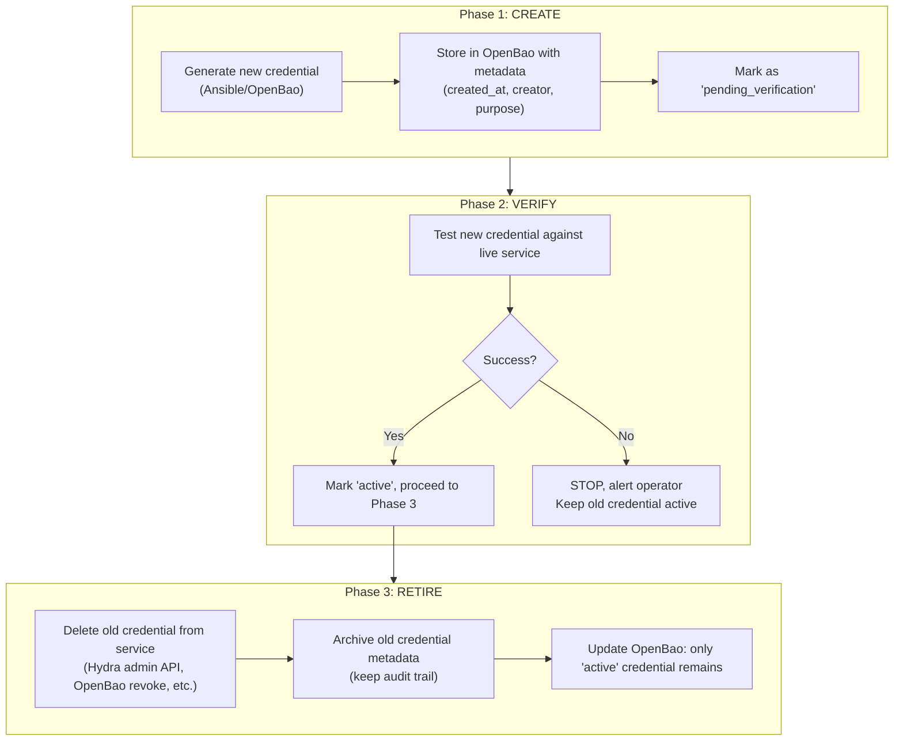
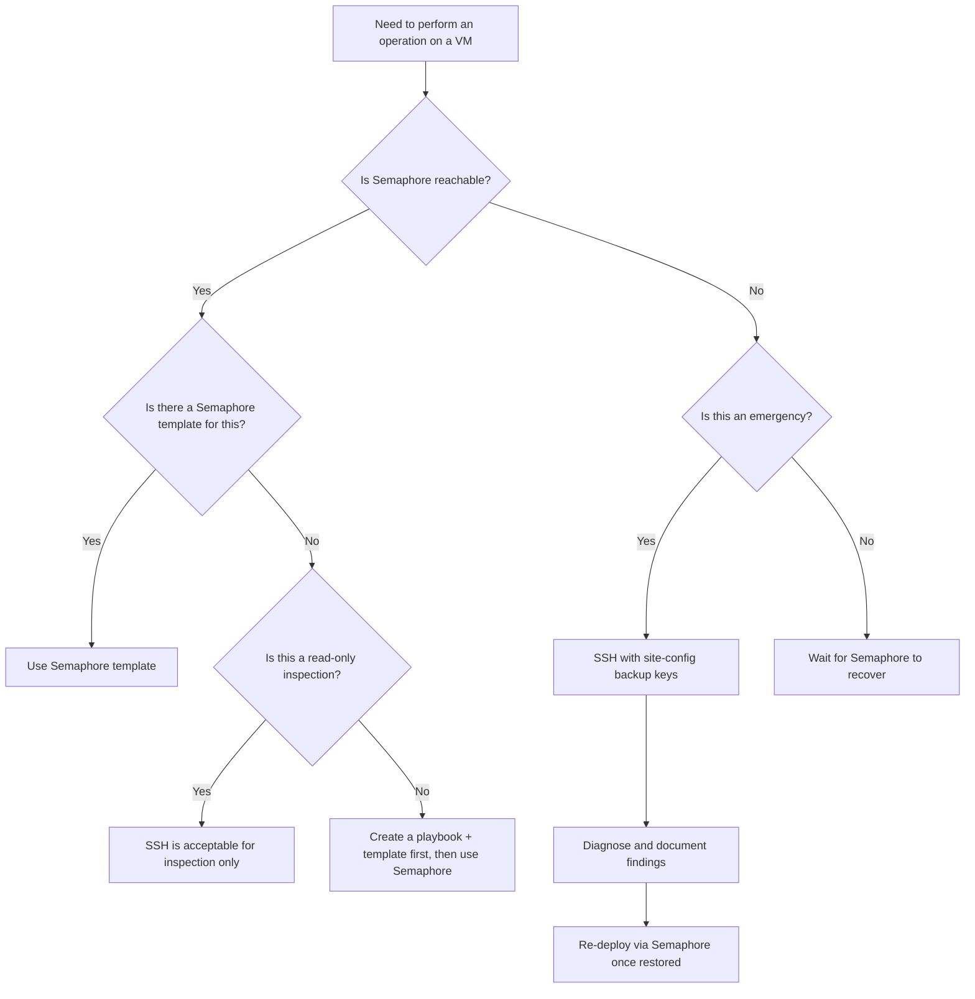
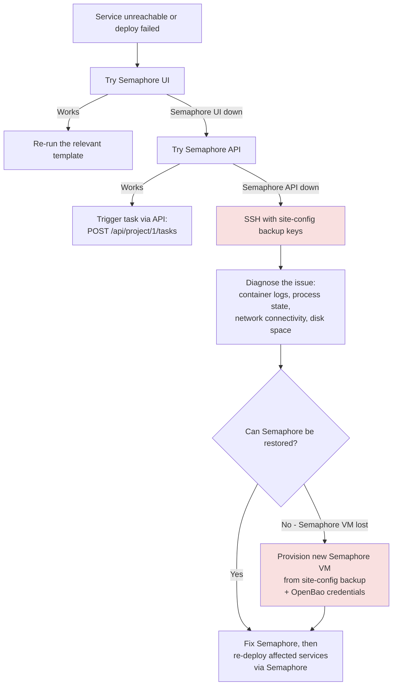

# 04 — Credential Lifecycle & Access Governance
> **Consolidates:** CREDENTIAL-LIFECYCLE-PLAN.md, ACCESS-BOUNDARIES.md (originals archived in `plan/archive/`)
>
> **Depends on:** 00, 01
>
> **Constitution:** `PRINCIPLES.md` is the platform constitution; this document elaborates its Section 3 (Identity, Secrets & the Guardrail Triad) — credential lifecycle, the OpenBao -> Ansible -> Jinja -> `.env` boundary, the genesis exemption, and the role-based access model. Where the two disagree, PRINCIPLES.md wins.
>
> Part of the dependency-ordered `plan/architecture/` set (00–07). Source docs
> merged verbatim below under provenance dividers to preserve all detail.


<!-- ======================= source: CREDENTIAL-LIFECYCLE-PLAN.md ======================= -->

# Credential Lifecycle Governance

**Date:** 2026-04-05 (governance extracted 2026-05-07)
**Status:** ACTIVE
**Context:** Defines mandatory credential lifecycle rules for the agent-cloud platform: creation, rotation, metadata, audit, and decommissioning. These governance standards apply regardless of implementation phase. Implementation details are in `plan/development/01-secrets-credentials.md`.

---

## Design Principles

1. **Every credential has a lifecycle:** created → active → verified → retired → deleted
2. **Every credential has metadata:** created_at, creator, site, purpose, expiry
3. **Verify before retiring:** new credential must pass validation before old is deleted
4. **Per-site isolation:** compromise of one site's credentials doesn't affect others
5. **OpenBao is the sole authority:** no credentials managed outside OpenBao
6. **Automation over manual:** rotation, cleanup, and auditing are scheduled playbooks

---

## Bootstrap (Genesis) Services

Two services are the **genesis layer**: the secret store (**OpenBao**) and the orchestrator (**Semaphore**). They face a chicken-and-egg problem — neither can fetch its own credentials from a system that does not exist yet, and Semaphore cannot deploy *through* an orchestrator that is not yet running. On a **fresh LOCAL deploy** they therefore generate and manage their own credentials directly. This is the **sole sanctioned exception** to the `deploy.sh`-lifecycle-only / Ansible-owns-secrets boundary (PRINCIPLES.md Section 3).

- **Committed as code, never hand-typed.** The genesis sequence is committed in `bootstrap-local-dev.yml` and run on `localhost` (`make local-bootstrap`). It is auditable and idempotent like any other playbook — the only difference from the normal path is the invocation context, not forked playbooks.
- **Anything provisioned from a RUNNING instance follows the strict boundary.** Once an agent-cloud instance is up, provisioning a new tenant or service from it MUST take the single path: **OpenBao -> Ansible memory -> Jinja2 -> `.env`**; `deploy.sh` never calls OpenBao. The genesis carve-out does not generalize beyond OpenBao and Semaphore.
- **Genesis-exempt vs. violation.** `semaphore` deploy.sh sourcing `bao-client.sh` is **defensible as genesis**. `nocodb` deploy.sh doing the same is **a violation to retire** — NocoDB is a normal service provisioned from a running instance, so its self-fetch must be refactored to the strict boundary (`manage-secrets.yml` + Jinja templates), not grandfathered.
- **CI allowlist.** The `deploy.sh`-secret-free grep (Section 7 of PRINCIPLES.md) carries an allowlist naming **only** OpenBao and Semaphore; every other `deploy.sh` matching `gen_secret`/`put_secret`/`get_secret`/`bao-client` is a hard failure.

(Section 1's "Genesis-Bootstrap Exemption" below describes the *access-path* side of the same carve-out — that genesis runs un-forked `deploy-<svc>.yml` on localhost outside Semaphore. This subsection is the *credential-ownership* side: genesis services own their own secrets; everything else does not.)

---

## Composable Vault Paths (Multi-Site Ready)

The path structure is driven by a **`vault_secret_prefix`** inventory variable defined in **site-config**. This keeps agent-cloud site-agnostic and makes multi-site a configuration change, not a vault restructuring.

### How It Works

The `manage-secrets.yml` task constructs paths from the inventory variable:

```
secret/data/{{ vault_secret_prefix }}/{{ service_name }}
```

Site-config's inventory controls the prefix per site:

```yaml
# site-config/inventory/production.yml
agent_cloud:
  vars:
    vault_secret_prefix: "services"    # single-site (current)

# Future: site-config/inventory/remote-site.yml
remote_agent_cloud:
  vars:
    vault_secret_prefix: "sites/remote-dc/services"
```

### Single-Site Layout (Current)

With `vault_secret_prefix: "services"`, paths remain exactly as they are today:

```
secret/
  services/                            # vault_secret_prefix = "services"
    netbox                             # All NetBox secrets
    nocodb                             # NocoDB secrets
    n8n                                # n8n secrets
    ssh/management                     # Central SSH key
    ssh/<service>                      # Per-service SSH keys
    approles/semaphore                 # Platform orchestrator credentials
    approles/orb-agent                 # Orb-agent credentials
    discovery/
      pfsense                          # host, api_key
      snmp_v3                          # username, auth_password, priv_password
```

### Multi-Site Layout (Future)

When a second site is added, its inventory sets a site-scoped prefix. The original site stays untouched — no path moves, no dual-write, no archive phase.

### Why Not a Hardcoded Path Hierarchy

- **Site identity is a site-config concern** — embedding site identifiers into agent-cloud leaks private topology into the public repo
- **No migration needed** — the current flat layout works as-is with `vault_secret_prefix: "services"`; multi-site is additive
- **Composable** — each site's inventory controls its own vault prefix
- **AppRole policies follow the same pattern** — scoped to `{{ vault_secret_prefix }}/*` per site

---

## Credential Types & TTL Requirements

| Credential Type | Required TTL | Rotation | Owner |
|----------------|-------------|----------|-------|
| AppRole token | 30m | Auto-renew | OpenBao |
| AppRole secret_id | **90 days** | Scheduled playbook | Ansible |
| AppRole token_num_uses | **25** | Per-token | OpenBao |
| Diode OAuth2 client | **90 days** | Create→Verify→Retire | Ansible |
| Postgres password (static) | **Migrate to dynamic** | On-demand (1h lease) | OpenBao DB engine |
| SSH keys | 1 year | Annual rotation playbook | Ansible |
| SNMP community (v2c) | Until SNMPv3 migration | — | Manual |
| SNMPv3 credentials | 180 days | Scheduled | Ansible |
| pfSense API key | 180 days | Manual + store in OpenBao | Operator |
| OpenBao root token | **Rotate after setup** | One-time | Operator |

**Documented exception:** The Semaphore orchestrator AppRole uses unlimited TTL (`secret_id_ttl: 0`, `token_num_uses: 0`) because it requires broad cross-service access and runs in an isolated runner environment. This exception is compensated by Semaphore's own access controls and audit logging.

---

## Rotation Pattern: Create → Verify → Retire

All credential rotations follow this three-phase pattern:



**Critical rule:** Never delete the old credential before the new one is verified working.

---

## Credential Metadata Standard

Every secret stored by `manage-secrets.yml` must carry KV v2 custom metadata:

```json
{
  "created_at": "2026-04-05T12:00:00Z",
  "creator": "deploy-netbox.yml",
  "site": "{{ site_name }}",
  "purpose": "NetBox Postgres password",
  "rotation_schedule": "dynamic-1h"
}
```

Required fields: `created_at`, `creator`, `site`, `purpose`, `rotation_schedule`.

---

## Audit Requirements

- **Audit logging must be enabled** on OpenBao (file audit backend piped to observability stack)
- **Required alert conditions:**
  - Same secret read >10x in 1 minute (potential exfiltration)
  - Secret access from unknown AppRole
  - Failed authentication attempts
- **Weekly credential inventory** — scheduled playbook lists all credentials with ages, flags stale (>30 days unused), expired, or orphaned credentials

---

## Decommissioning Security Requirements

When decommissioning a site or service:

1. All scoped credentials must be revoked before decommissioning completes
2. Credential data must be archived for **90 days** before permanent deletion (audit trail requirement)
3. All services must be stopped before credential revocation begins
4. AppRole secret_ids scoped to the site/service must be explicitly revoked

---

## Cross-References

- `plan/development/01-secrets-credentials.md` — implementation phases and playbook specs
- `plan/development/01-secrets-credentials.md` — specific plan for Phase 3 (AppRole TTLs)
- `plan/architecture/04-credentials-access.md` — who can access credentials and through which path
- `plan/architecture/03-testing-ci-quality.md` — credential leak prevention in code
- `plan/architecture/01-automation-model.md` — composable secret management pattern

<!-- ======================= source: ACCESS-BOUNDARIES.md ======================= -->

# Access Boundaries

**Date:** 2026-05-06
**Status:** ACTIVE
**Context:** The agent-cloud platform enforces a strict boundary between orchestrated automation (Semaphore) and direct operator access (SSH). This document codifies when each access path is permitted, how SSH keys are scoped, and how AppRole boundaries limit blast radius.

**References:**
- [AUTOMATION-COMPOSABILITY.md](AUTOMATION-COMPOSABILITY.md) -- Composable task library and deploy patterns
- [CREDENTIAL-LIFECYCLE-PLAN.md](CREDENTIAL-LIFECYCLE-PLAN.md) -- Secret generation, storage, rotation, TTLs
- [SERVICE-INTEGRATION-PLAN.md](SERVICE-INTEGRATION-PLAN.md) -- Service onboarding checklist
- [DISASTER-RECOVERY-PLAN.md](../development/DISASTER-RECOVERY-PLAN.md) -- DR procedures (planned)

---

## 0. RBAC & Access Governance Model

This section codifies *who* a person is and *how much they may do*, which the rest of this document (Semaphore-vs-SSH paths, SSH key scope, AppRole boundaries) then enforces. It elaborates PRINCIPLES.md Section 3's "Human access is provisioned by role, never granted by hand."

### Identity Decomposition (two orthogonal axes)

Identity is **not** one opaque "user type." It decomposes along two independent axes:

```
Axis 1 - WHO (job placement):   Organization > Department > Team > Role
Axis 2 - HOW MUCH (privilege):  Admin > Maintainer > Developer > User   (highest -> lowest)
```

- **Role = job function** (e.g. `platform-engineer`, `network-operator`, `data-analyst`). It says *what a person does*.
- **Access Level = privilege tier**. It says *how much they may do*. It is **orthogonal** to Role: the same Role can hold different Access Levels in different projects, and the same Access Level spans many Roles.
- **Organization is the hard tenant-isolation boundary** — **tenants are orgs**. An identity in org A can never see org B's secrets, projects, or infrastructure. Department/Team/Role only place a person *within* their org; they are not isolation boundaries.
- The model is applied **per tenant and per project**: a person carries an (org, department, team, role, access-level) tuple, and Access Level is resolved per project (User on project X, Maintainer on project Y).

### Authentik Is the Source of Truth

**Authentik groups are the single source of truth** for the (org, department, team, role, access-level) tuple. A **provisioning mechanism** reads an identity's groups and derives its per-service roles — no per-person hand-grant in any downstream service. This is the no-monkey-patch rule (PRINCIPLES.md Section 2) applied to people: the *second* user inherits the first's recipe.

Group-schema convention (the encoding of the tuple in Authentik group names):

```
<org>-<department>-<team>-<role>       # placement (Axis 1)
<org>-<access-level>                   # privilege within the org (Axis 2)

Examples:
  uhstray-platform-infra-engineer      # WHO: uhstray / platform dept / infra team / engineer role
  uhstray-admins                       # HOW MUCH: Admin tier for the uhstray org
  uhstray-developers                   # HOW MUCH: Developer tier for the uhstray org
```

### Access Level -> Per-Service Role Mapping

The provisioning mechanism maps each Access Level to concrete per-service roles. Authoritative mapping table:

| Access Level | Semaphore | NetBox | OpenBao (per-tenant prefix) | Project visibility |
|--------------|-----------|--------|-----------------------------|--------------------|
| **Admin** | `admin` flag on user (global admin) | superuser / Full Access on all object types | read across the tenant's `{{ vault_secret_prefix }}/*` (via orchestrator, not direct) | **ALL projects, automatically** |
| **Maintainer** | Project **Owner** | staff + change perms on assigned object types | read scoped to assigned services | assigned projects |
| **Developer** | Project **Manager** | change perms on assigned object types (no delete) | read scoped to assigned services | assigned projects |
| **User** | `task_runner` (run pre-defined templates) / `guest` (read-only) | view-only on assigned object types | none (no direct secret access) | assigned projects, read-only |

Rules that fall out of the table:

- **Admin is fully derived, never hand-granted.** Any identity in the org's Admin group (`uhstray-admins`) is provisioned with the Semaphore `admin` flag **and** all-project visibility **automatically** — there is no per-service "make this person admin" click. Granting admin by hand is a defect, not a shortcut.
- **Role scopes *which* projects/services; Access Level scopes *what* you may do in them.** A `network-operator` Role with Developer Access Level gets Project-Manager rights on the NetBox/network projects their team owns — not on unrelated projects.
- **User is genuinely least-privilege:** no direct OpenBao path, run-only or read-only in Semaphore/NetBox.

### As-Built (honest status)

**[TARGET] / NOT BUILT:** the provisioning automation (Authentik groups -> per-service roles) and the full group schema above are **not implemented yet**. Do not reason as if role-based provisioning already holds. Today's reality:

- **`platform-admins` is the sole admin group**, and it is **being renamed `uhstray-admins`** (the uhstray-org Admin tier in the schema above).
- **Semaphore user `stray` was hand-set to `admin` as a stopgap** — a PRINCIPLES.md Section 2 monkey-patch explicitly called out as a stopgap, not the foundational fix. The foundational fix is the provisioning mechanism in this section: derive `stray`'s admin flag from membership in `uhstray-admins` instead of hand-setting it.
- There is no Department/Team/Role decomposition wired into Authentik groups yet, and no automated (tuple -> per-service role) mapper. Until it ships, downstream service roles are set by hand and this section is the design target they converge to.

---

## 1. Semaphore-Mediated Operations (ALWAYS use Semaphore)

All of the following operations MUST go through Semaphore. Direct SSH execution of these operations is prohibited because Semaphore provides an audit trail, AppRole credential injection, idempotent playbook execution, and branch-aware deployment.

| Operation Category | Examples | Rationale |
|--------------------|----------|-----------|
| **Service deployment** | `deploy-netbox.yml`, `deploy-nocodb.yml`, `deploy-all.yml` | AppRole injected via Semaphore environment; deploy.sh has no vault access |
| **Secret management** | `manage-secrets.yml`, `check-secrets.yml`, `validate-secrets.yml` | Secrets flow OpenBao -> Ansible memory -> Jinja2 templates; never on disk as intermediary files |
| **SSH key distribution** | `distribute-ssh-keys.yml`, `harden-ssh.yml` | Keys fetched from OpenBao at runtime; verify-before-harden pattern |
| **VM provisioning** | `provision-vm.yml`, `provision-template.yml` | Proxmox API calls require tokens stored in OpenBao |
| **Branch testing** | Any template with `service_branch` survey var | Semaphore selects branch, deploys to target, validates health |
| **OpenBao policy management** | `apply-openbao-policies.yml`, `apply-policy-*.yml` | Policies are code (.hcl files); Semaphore applies via API |
| **AppRole provisioning** | `manage-approle.yml` | Creates policy + role + stores credentials atomically |
| **Scheduled operations** | Credential rotation, audit, discovery sync | Semaphore cron triggers ensure consistent execution |
| **Container lifecycle** | `clean-deploy-*.yml`, `update-*.yml` | Destructive operations need audit trail and rollback path |
| **Docker/runtime install** | `install-docker.yml` | Idempotent; Semaphore tracks which hosts have been provisioned |

### Why Semaphore Is Required

```
Operator clicks "Deploy NetBox" in Semaphore UI
  -> Semaphore injects BAO_ROLE_ID + BAO_SECRET_ID as environment variables
  -> Ansible authenticates to OpenBao via AppRole
  -> Secrets fetched into memory, never written to intermediary files
  -> Jinja2 templates render .env files on target VM
  -> deploy.sh runs container lifecycle only (no vault access)
  -> Health check verifies deployment
  -> Full audit trail in Semaphore task log
```

Without Semaphore, the operator would need to manually export AppRole credentials, losing the audit trail and risking credential exposure in shell history.

### Genesis-Bootstrap Exemption (the one sanctioned non-Semaphore path)

Rule #1 has exactly one carve-out: a service cannot deploy *through* an orchestrator that does not exist yet. The **genesis bootstrap** therefore stands up the secure foundation directly, before Semaphore — and Semaphore comes up **last, already OIDC-secured** (local-dev: `make local-bootstrap`; LOCAL-DEV-DEPLOYMENT.md §12A).

- **Scope of the exemption:** OpenBao → dns → step-ca → caddy → authentik (the secure foundation) **+ Semaphore**. This *widens* the prior "OpenBao + Semaphore only" exemption to the whole foundation, and no further — everything after genesis (Tier-3 services, all redeploys) still goes through Semaphore.
- **Not a fork, not manual SSH:** genesis runs each service's existing `deploy-<svc>.yml` un-forked, on `localhost`, carrying the bootstrap's own BAO AppRole creds (which is also the marker `tasks/assert-orchestrated.yml` accepts). The only difference from the Semaphore path is the invocation context, not the playbooks.
- **Still code, still auditable:** the genesis sequence is committed in `bootstrap-local-dev.yml`; nothing is hand-run. (Prod's genesis is the analogous out-of-Semaphore bootstrap of OpenBao + Semaphore.)

---

## 2. Direct SSH Access (PERMITTED scenarios)

Direct SSH access is permitted ONLY in the following scenarios. The critical constraint is: **never modify Ansible-managed state via SSH**. This means no editing `.env` files, no running `deploy.sh` manually, no writing to OpenBao, and no changing `sshd_config` or sudo configuration.

| Scenario | When | What You May Do | What You Must NOT Do |
|----------|------|-----------------|----------------------|
| **Emergency debugging** | Semaphore is unreachable (UI and API both down) | Inspect logs, check process state, verify connectivity | Run deploy.sh, edit .env files, restart services |
| **Live container log inspection** | Diagnosing an issue that Semaphore logs do not capture | `docker logs`, `docker exec` for read-only inspection | Modify container state, exec write commands |
| **Manual OpenBao unseal** | After VM reboot or OpenBao restart | Run `bao operator unseal` with unseal key shards | Modify policies, create tokens, write secrets |
| **One-time data recovery** | Database corruption, volume recovery | Copy data out, run pg_dump, inspect filesystem | Restore without re-deploying via Semaphore afterward |
| **Network diagnostics** | Connectivity issues between services | `ping`, `curl`, `ss`, `traceroute`, DNS checks | Change firewall rules, modify network config |

### Access Decision Tree



### Post-SSH Reconciliation

Any changes made via emergency SSH access MUST be reconciled:

1. Document what was done and why in a GitHub issue
2. Re-deploy the affected service via Semaphore to restore Ansible-managed state
3. Verify that the Semaphore deploy produces the expected state (no drift)

---

## 3. SSH Key Usage Matrix

Four categories of SSH keys exist in the platform. Each has a specific scope and usage constraint.

| Key Category | Storage Location | Who Uses It | How It Is Used | Deployment Allowed? |
|-------------|-----------------|-------------|----------------|---------------------|
| **Per-service keys** | OpenBao `secret/services/ssh/<service>` | Semaphore (via Ansible) | Fetched at runtime, written to tempfile, used for target host auth, cleaned up in `always` block | Yes -- this is the normal deploy path |
| **Management key** | OpenBao `secret/services/ssh/management` | Semaphore (via Ansible) | Used by `distribute-ssh-keys.yml` and `harden-ssh.yml` for initial host setup | Yes -- infrastructure provisioning only |
| **Backup keys** | `site-config/secrets/` (private repo, local machine) | Human operator (emergency) | Last resort when OpenBao is unreachable or Semaphore is down | NO -- read-only diagnostics only |
| **Local operator keys** | `~/.ssh/` on operator workstation | Human operator (development) | Git operations, GitHub access, local development | NEVER for production deployments |

### Key Lifecycle

```
Per-service key lifecycle:
  Generated by Ansible -> Stored in OpenBao -> Distributed via Semaphore
  -> Rotated annually via rotate-ssh-keys.yml -> Old key archived

Backup key lifecycle:
  Copied from OpenBao to site-config/secrets/ -> Used ONLY for DR
  -> Updated when per-service keys rotate -> Never used for deployments
```

---

## 4. AppRole Scope Boundaries

AppRoles enforce least-privilege access to OpenBao secrets. Three tiers of AppRole exist, each with different scope and lifecycle.

### AppRole Tiers

| Tier | AppRole | Scope | TTL | token_num_uses | Purpose |
|------|---------|-------|-----|----------------|---------|
| **Orchestrator** | `semaphore` | `secret/data/services/*`, `sys/policies/acl/*`, `auth/approle/role/*` | token: 30m, secret_id: 0 (see note) | 0 (unlimited) | Cross-service orchestration, AppRole provisioning, policy management |
| **Runtime (current)** | `orb-agent` | `secret/data/services/netbox/orb_agent_*`, `secret/data/services/netbox/snmp_community` | token: 30m, secret_id: 0 (see note) | 0 (see note) | Agent fetches Diode + SNMP credentials at runtime via vault references |
| **Runtime (planned)** | Per-service (e.g., `netbox-deploy`, `nocodb-deploy`) | Scoped to single service path | token: 30m, secret_id: 90d | 25 | Deploy-time credential fetch for a single service |

**Note on TTL enforcement:** The `manage-approle.yml` task currently hardcodes `secret_id_ttl: 0` and `token_num_uses: 0`, which contradicts the 90-day TTL requirement in CREDENTIAL-LIFECYCLE-PLAN.md. See [APPROLE-TTL-ENFORCEMENT-PLAN.md](../development/APPROLE-TTL-ENFORCEMENT-PLAN.md) for the remediation plan.

### Scope Isolation Principle

```
Semaphore orchestrator:
  CAN read/write secrets for ALL services (orchestration role)
  CAN create/update policies and AppRoles
  CANNOT use root token operations (unseal, audit config)

Per-service runtime AppRole:
  CAN read secrets for ONE service only
  CANNOT read other services' secrets
  CANNOT modify policies or AppRoles
  CANNOT write to OpenBao (read-only)

Per-service deploy AppRole (planned):
  CAN read/write secrets for ONE service only
  CANNOT read other services' secrets
  CANNOT modify policies or AppRoles
```

### Blast Radius

If a credential is compromised, the damage is bounded by its AppRole scope:

| Compromised Credential | Blast Radius | Mitigation |
|------------------------|-------------|------------|
| Semaphore secret_id | All services' secrets, all AppRoles | Revoke immediately; rotate all service credentials |
| orb-agent secret_id | NetBox Diode + SNMP credentials only | Revoke; rotate Diode OAuth2 client + SNMP |
| Per-service deploy secret_id | Single service's secrets only | Revoke; rotate that service's credentials |
| SSH per-service key | Shell access to one VM | Rotate key; audit VM for unauthorized changes |
| SSH management key | Shell access to all VMs | Rotate key; audit all VMs; re-run harden-ssh.yml |

---

## 5. Disaster Recovery Reference

A comprehensive disaster recovery plan for the entire agent-cloud platform is planned but not yet written. The full plan will cover Semaphore outage, OpenBao sealed/lost, VM failure, data loss, and credential compromise scenarios.

**Planned document:** `plan/development/10-infra-resilience.md`

### Escalation Path

When a service is unreachable or a deployment fails, follow this escalation path in order:



### Emergency Access Procedure

1. **Attempt Semaphore UI** -- check task history for recent failures, re-run the template
2. **Attempt Semaphore API** -- `curl -X POST` with API token from `site-config/secrets/semaphore/`
3. **SSH with backup keys** -- use keys from `site-config/secrets/` (never the local operator key)
4. **Diagnose only** -- do not modify Ansible-managed state; document everything
5. **Restore via Semaphore** -- once Semaphore is back, re-deploy to reconcile state

---

## 6. Pattern Used Per Service

Services are at different stages of migration from the legacy clone-and-deploy pattern to the composable manage-secrets pattern. The target state is all services on the composable pattern.

| Service | Deploy Pattern | Playbook | Secrets Management | Notes |
|---------|---------------|----------|-------------------|-------|
| **NetBox** | Composable (5-phase) | `deploy-netbox.yml` | `manage-secrets.yml` + Jinja2 templates | Fully migrated; reference implementation |
| **Orb Agent** | Composable (standalone) | `deploy-orb-agent.yml` | `manage-diode-credentials.yml` + agent.yaml template | Independent workflow, uses NetBox secrets |
| **OpenBao** | Legacy (clone-and-deploy) | `deploy-openbao.yml` -> `deploy-service.yml` | Self-bootstrapping (special case) | Cannot use composable pattern for its own secrets |
| **NocoDB** | Legacy (clone-and-deploy) | `deploy-nocodb.yml` -> `deploy-service.yml` | deploy.sh manages secrets directly | Migration planned |
| **n8n** | Legacy (clone-and-deploy) | `deploy-n8n.yml` -> `deploy-service.yml` | deploy.sh manages secrets directly | Migration planned |
| **Semaphore** | Legacy (clone-and-deploy) | `deploy-semaphore.yml` -> `deploy-service.yml` | deploy.sh manages secrets directly | New-VM-only deploy |
| **NemoClaw** | Legacy (clone-and-deploy) | `deploy-nemoclaw.yml` -> `deploy-service.yml` | deploy.sh manages secrets directly | AI agent tier |
| **Caddy** | Not yet integrated | -- | Manual | Reverse proxy; integration pending |
| **WisAI** | Not yet integrated | -- | Manual | Local LLM inference; separate repo |
| **WisBot** | Not yet integrated | -- | Manual | Discord bot; separate repo |
| **Nextcloud** | Not yet integrated | -- | Manual | Auxiliary tier; integration pending |
| **Wiki.js** | Not yet integrated | -- | Manual | Auxiliary tier; integration pending |
| **Postiz** | Not yet integrated | -- | Manual | Auxiliary tier; integration pending |
| **a2a-registry** | Not yet integrated | -- | Manual | Auxiliary tier; integration pending |

### Migration Priority

1. **NocoDB + n8n** -- Automation tier, highest value from composable pattern (secret drift risk)
2. **NemoClaw** -- AI tier, needs tightened AppRole policy (currently uses wildcard)
3. **Caddy** -- Infrastructure tier, minimal secrets (TLS certs via ACME)
4. **Auxiliary services** -- Lower priority, simpler 3-phase pattern sufficient

### Legacy vs Composable Flow Comparison

```
Legacy (clone-and-deploy):
  Semaphore -> clone-and-deploy.yml -> deploy.sh (generates secrets + manages containers)
  Risk: Secret drift on re-deploy, no OpenBao as source of truth

Composable (manage-secrets):
  Semaphore -> manage-secrets.yml (OpenBao fetch/generate) -> template .env -> deploy.sh (containers only)
  Benefit: Idempotent, OpenBao authoritative, deploy.sh has no vault access
```
