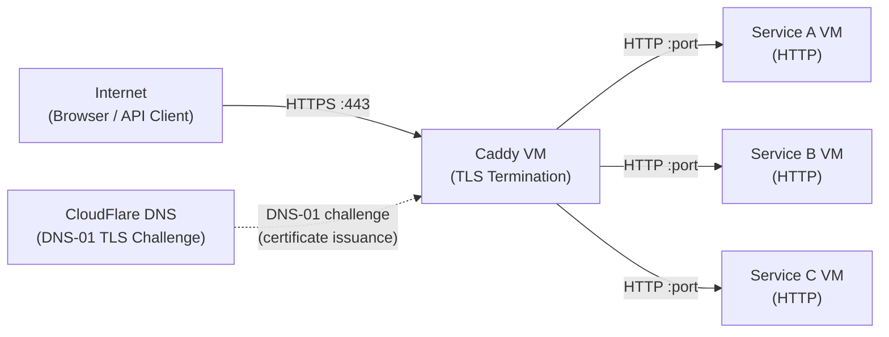
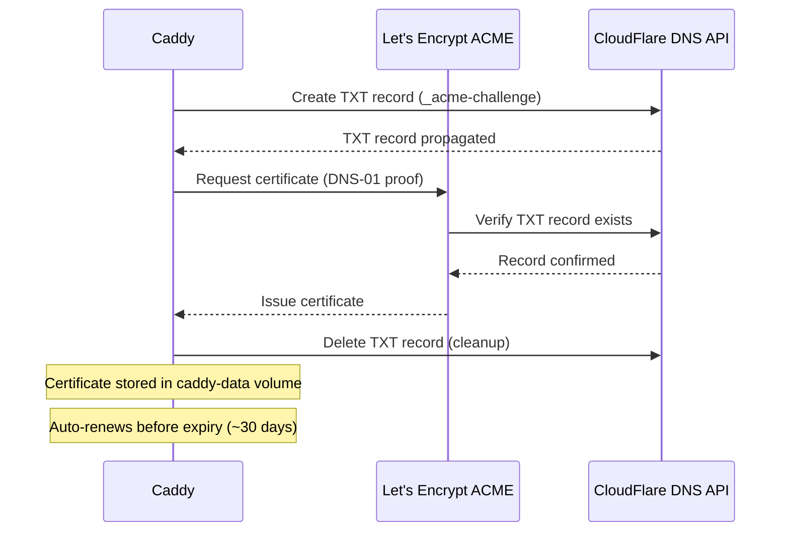
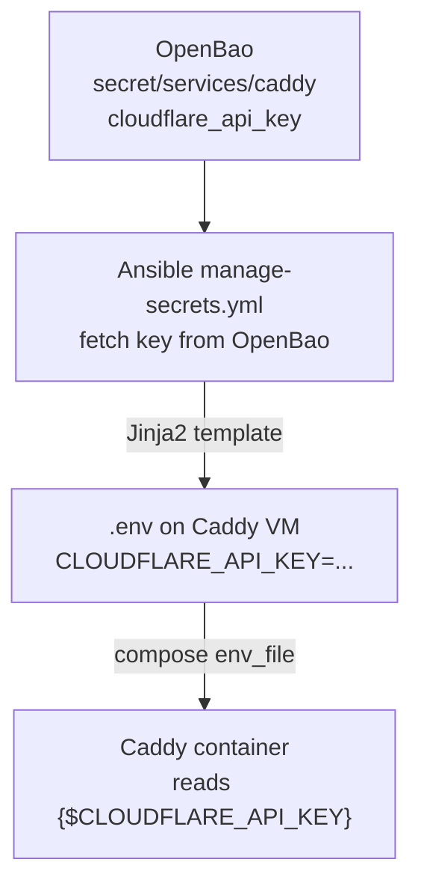
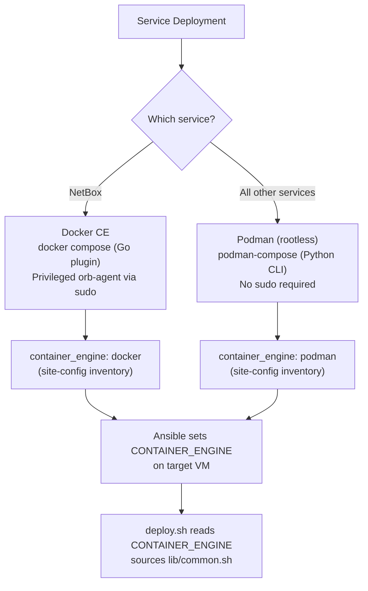
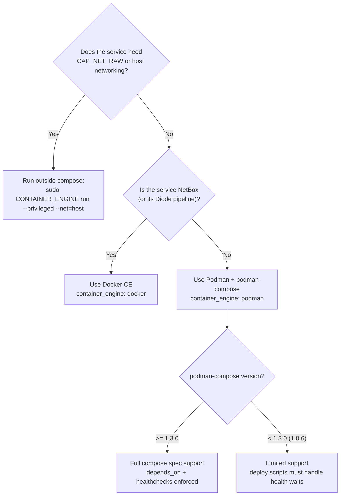

# 05 — Platform Layer: Caddy & Container Runtime
> **Consolidates:** CADDY-REVERSE-PROXY.md, PODMAN-VS-DOCKER-COMPOSE.md (originals archived in `plan/archive/`)
>
> **Depends on:** 00, 01, 04
>
> Part of the dependency-ordered `plan/architecture/` set (00–07). Source docs
> merged verbatim below under provenance dividers to preserve all detail.


<!-- ═══════════════════════ source: CADDY-REVERSE-PROXY.md ═══════════════════════ -->

# Caddy Reverse Proxy Architecture

**Date:** 2026-05-06
**Status:** ACTIVE
**Contributors:** Network architecture review

**References:**
- [SERVICE-INTEGRATION-PLAN.md](SERVICE-INTEGRATION-PLAN.md) -- Service onboarding checklist
- [AUTOMATION-COMPOSABILITY.md](AUTOMATION-COMPOSABILITY.md) -- Composable task library and deploy patterns
- [CREDENTIAL-LIFECYCLE-PLAN.md](CREDENTIAL-LIFECYCLE-PLAN.md) -- Secret generation, storage, rotation
- `platform/services/caddy/deployment/` -- Templatized Caddyfile and compose stack

---

## Purpose

Caddy is the sole HTTPS ingress point for the uhstray-io platform. Every external request to a platform service passes through Caddy for TLS termination, routing, and security header enforcement. This document defines the architecture, integration patterns, and automation gaps for the Caddy reverse proxy.

---

## Role in the 4-Layer Model

Caddy operates at the **Platform Layer** -- it is infrastructure, not automation or AI. It has no business logic; its sole responsibility is accepting inbound HTTPS connections, terminating TLS, and forwarding requests to internal service VMs over HTTP.

```text
AI Layer         NemoClaw, NetClaw, WisBot, Claude Cowork
                 (consumers of services behind Caddy)

Guardrail Layer  OpenBao, Kyverno, OPA
                 (Caddy does not enforce policy -- it routes)

Automation Layer Ansible, Semaphore
                 (Caddy deployment should be orchestrated here -- GAP)

Platform Layer   Caddy (HTTPS ingress) -> Docker/Podman services on VMs
                 Proxmox VMs, container runtimes
```

Caddy is classified as **Infrastructure tier** per the SERVICE-INTEGRATION-PLAN.md taxonomy -- it requires a dedicated VM, has a critical-tier credential (CloudFlare API key), and is a single point of failure for all external access.

---

## Traffic Flow



Key properties:
- **All external traffic enters through Caddy on port 443.** Port 80 redirects to 443 (Caddy default behavior).
- **TLS terminates at Caddy.** Backend services receive plain HTTP. No double encryption overhead.
- **CloudFlare is DNS only.** Traffic does not proxy through CloudFlare's network -- Caddy handles TLS directly using certificates obtained via DNS-01 challenge.
- **Internal services are not exposed to the internet.** Only Caddy's ports 80/443 are forwarded through the router.

---

## Service Routing Pattern

The Caddyfile uses environment variable substitution for all domains, IPs, and ports. No hardcoded values appear in the committed template.

### Standard Caddyfile Block

```caddyfile
{$SERVICE_DOMAIN} {
    tls {
        dns cloudflare {$CLOUDFLARE_API_KEY}
        resolvers 1.1.1.1 1.0.0.1
    }

    header {
        Strict-Transport-Security max-age=15552000;
    }

    reverse_proxy {$SERVICE_IP}:{$SERVICE_PORT}
}
```

### WebSocket-Aware Block

For services that require WebSocket support (e.g., collaborative editing, real-time dashboards):

```caddyfile
{$SERVICE_DOMAIN} {
    tls {
        dns cloudflare {$CLOUDFLARE_API_KEY}
        resolvers 1.1.1.1 1.0.0.1
    }

    header {
        Strict-Transport-Security max-age=15552000;
    }

    @ws {
        header Connection *Upgrade*
        header Upgrade websocket
    }

    reverse_proxy {$SERVICE_IP}:{$SERVICE_PORT_MAIN}
    reverse_proxy @ws {$SERVICE_IP}:{$SERVICE_PORT_WS}
}
```

### Variable Resolution

Environment variables are resolved at container startup. The current deployment uses `start-caddy.sh` to parse CLI arguments and export variables before running `docker compose up`. The target state replaces this with Ansible-templated `.env` files following the composable pattern.

### Per-Site Fragment (Composable Pattern)

The two patterns above use the central `Caddyfile` with `{$VAR}`-driven substitution and are appropriate for legacy services. **All new services should use the per-site fragment pattern** instead — it keeps the main Caddyfile small, gives each service its own rollout/rollback unit, and lets each service template arbitrary Caddy directives (CSP, route handlers, asset proxies) without touching shared infrastructure.

**Mechanism:**

```text
1. Each service ships templates/caddy-site.j2 (Jinja2)
       platform/services/<svc>/deployment/templates/caddy-site.j2

2. The service's deploy playbook renders the fragment on the service VM
       platform/playbooks/deploy-<svc>.yml  (Phase 5)

3. tasks/distribute-caddy-site.yml delegates to the central Caddy host,
   copies the rendered fragment into the mounted sites/ directory, and
   reloads Caddy in-place
       platform/playbooks/tasks/distribute-caddy-site.yml
```

The central `Caddyfile` enables this with one line:

```caddyfile
import sites/*.caddy
```

Each fragment is a standalone Caddy site block. Example shape (from `platform/services/uhhcraft/deployment/templates/caddy-site.j2`):

```caddyfile
{{ uhhcraft_domain }} {
    encode brotli gzip
    header { ... HSTS, CSP, ... }

    # Routed asset paths — cross-MinIO proxies
    handle_path /generated/img/* { reverse_proxy {{ comfyui_minio_upstream }} ... }
    handle_path /generated/3d/*  { reverse_proxy {{ hunyuan_minio_upstream }} ... }

    # Static + app
    handle /static/*  { reverse_proxy {{ uhhcraft_upstream }} ... }
    reverse_proxy {{ uhhcraft_upstream }} { ... }
}
```

**Reload safety:**

`caddy reload --config /etc/caddy/Caddyfile` is zero-downtime — inflight requests complete; new requests use the new config; cert state is preserved. If a fragment is malformed, Caddy refuses to reload and keeps serving the previous config, so a broken deploy degrades to "no new fragment" rather than an outage.

**File ownership:**

The `sites/` directory is mounted read-only into the Caddy container (`./sites:/etc/caddy/sites:ro`). The only writer is `tasks/distribute-caddy-site.yml`, which runs as `ansible_user` on the Caddy host. Humans don't edit files here.

**Conflict resolution:**

Fragments are namespaced by filename (`sites/<svc>.caddy`). Two services cannot occupy the same domain — Caddy will fail to start if a domain is declared twice. Coordinate domain allocations in inventory, not in fragments.

**When to keep using the legacy `{$VAR}` pattern instead:**

- Existing services already in the main Caddyfile. Migrate when their deploy is rewritten to the composable pattern.
- One-off / temporary routes (e.g., a maintenance redirect) where a fragment would be overkill.

| Variable | Source | Example Placeholder |
|----------|--------|-------------------|
| `{$SERVICE_DOMAIN}` | FQDN from site-config | `svc.example.com` |
| `{$SERVICE_IP}` | Internal IP from site-config | `10.0.0.x` |
| `{$SERVICE_PORT}` | Service listening port | `8080` |
| `{$CLOUDFLARE_API_KEY}` | OpenBao secret | (API token) |

---

## TLS and DNS Integration

### TLS strategy: two needs, neither is being a public CA (decided 2026-06-13)

TLS for agent-cloud decomposes into two distinct needs. Conflating hosting with *being a CA* briefly over-scoped the work; the decided architecture:

| Need | Solution | Notes |
|---|---|---|
| **Public TLS** — the hosted SaaS app + customer/tenant domains (browser-trusted) | **Caddy automatic-HTTPS + Let's Encrypt** (DNS-01 below). For SaaS tenant *custom domains*, **Caddy On-Demand TLS** issues per-domain certs from LE on first request, gated by an `ask` authorization endpoint. | TLS **consumption** — you obtain public certs from LE; you do **not** run a CA. This is the canonical SaaS custom-domain pattern. |
| **Internal TLS** — services/operators on `*.agent-cloud.test` / internal zones / LAN | **step-ca internal CA** (`INTERNAL-CA-DEPLOYMENT.md`) — the default: a **stable** shared root trusted once (`make local-tls-trust`) that persists across redeploys/volume-wipes and is reusable across local-dev, prod, and every developer; Caddy serves a step-ca-issued wildcard. **Caddy's own internal CA** (`tls internal` / `local_certs`) is a narrow fallback only — its root is ephemeral + per-instance (re-trust on every wipe), fine if step-ca is down. | Internal-only; LE can't validate non-public names. |

**Key principle:** hosting agent-cloud as SaaS + Enterprise needs TLS **consumption** (Caddy + Let's Encrypt), not TLS **production** (running a public CA — out of scope). Enterprise self-hosted installs use the same Caddy automatic-HTTPS (their LE certs + their internal CA); even air-gapped installs that can't reach LE want an *internal* CA (step-ca), not a public-CA product.

### Why DNS-01 Challenge

Caddy uses the **CloudFlare DNS-01 ACME challenge** for certificate issuance and renewal. This is required because:

1. **Wildcard certificates** -- DNS-01 is the only ACME challenge type that supports wildcard certs (`*.example.com`).
2. **No port 80 dependency** -- HTTP-01 requires port 80 to be publicly reachable. DNS-01 works entirely via DNS record creation, making it compatible with NAT and firewall configurations.
3. **Automatic renewal** -- Caddy handles certificate renewal automatically before expiry. The DNS-01 plugin creates and cleans up TXT records via the CloudFlare API.

### Certificate Lifecycle



### CloudFlare API Key Scope

The CloudFlare API key needs **Zone:DNS:Edit** permission for the target zone. It does not need account-level access or any permissions beyond DNS record management. A scoped API token (not a Global API Key) is the recommended credential type.

---

## Adding a New Service to the Proxy

When a new platform service needs external HTTPS access, follow these steps in coordination with the SERVICE-INTEGRATION-PLAN.md onboarding checklist.

**New services should use the per-site fragment pattern** (recommended path below). The legacy `{$VAR}`-in-main-Caddyfile path is preserved only for the existing services that haven't been migrated yet.

### Recommended path — per-site fragment

#### Step 1: Allocate DNS Record

In CloudFlare (or via Terraform/API), create an A record pointing the service's FQDN to the Caddy VM's public IP. Record the FQDN in site-config inventory.

#### Step 2: Write `templates/caddy-site.j2` in your service

Inside `platform/services/<svc>/deployment/templates/`, create `caddy-site.j2`. It's a full Caddy site block with Jinja2 variables for everything dynamic (domain, upstream IP, ports). UhhCraft's is the reference shape — read `platform/services/uhhcraft/deployment/templates/caddy-site.j2`.

Minimum useful skeleton:

```jinja
{{ '{{' }} svc_domain {{ '}}' }} {
    encode brotli gzip
    header {
        Strict-Transport-Security "max-age=15552000;"
        X-Content-Type-Options "nosniff"
        Referrer-Policy "strict-origin-when-cross-origin"
    }
    reverse_proxy {{ '{{' }} svc_upstream {{ '}}' }} {
        header_up X-Real-IP {remote_host}
        header_up X-Forwarded-For {remote_host}
        header_up X-Forwarded-Proto {scheme}
    }
}
```

#### Step 3: Wire distribution into your deploy playbook

In `platform/playbooks/deploy-<svc>.yml`, add a phase that renders the fragment locally and then includes `tasks/distribute-caddy-site.yml`:

```yaml
- name: "Distribute Caddy fragment"
  hosts: <svc>_svc
  tasks:
    - name: "Render"
      ansible.builtin.template:
        # src resolves on the CONTROLLER (the checked-out monorepo), never the
        # remote clone path — ansible.builtin.template always reads src locally.
        src: "{{ playbook_dir }}/../services/<svc>/deployment/templates/caddy-site.j2"
        dest: "/tmp/<svc>-caddy-site.caddy"
      vars:
        svc_domain: "{{ service_url | regex_replace('^https?://', '') }}"
        svc_upstream: "{{ ansible_default_ipv4.address }}:<port>"

    - name: "Push + reload"
      ansible.builtin.include_tasks: tasks/distribute-caddy-site.yml
      vars:
        _fragment_src: "/tmp/<svc>-caddy-site.caddy"
        _fragment_name: "<svc>.caddy"
```

#### Step 4: Deploy

Run `deploy-<svc>.yml` via Semaphore. The fragment is rendered, copied to the central Caddy host's `sites/` directory, and Caddy is reloaded — all zero-downtime.

#### Step 5: Verify

- Confirm HTTPS access at `https://svc.example.com`.
- Check the Let's Encrypt certificate is issued.
- Confirm the security headers and CSP are what the service expects.

### Legacy path — `{$VAR}`-driven block

For services already on the legacy pattern (or for one-off routes):

1. Allocate the DNS record (same as Step 1 above).
2. Add a new block to `platform/services/caddy/deployment/Caddyfile` using `{$NEWSERVICE_DOMAIN}`, `{$NEWSERVICE_IP}`, `{$NEWSERVICE_PORT}`.
3. Add the variables to the `.env` template (or to `start-caddy.sh` CLI flags).
4. Reload Caddy: `<engine> exec caddy caddy reload --config /etc/caddy/Caddyfile` (`<engine>` is `podman` by default on this platform; `docker` only on the NetBox host).
5. Verify the same way.

The legacy path is being phased out as each service migrates to the composable deploy pattern. Don't add new services here unless there's a strong reason.

---

## Credential Management

### Current State

The CloudFlare API key is currently managed outside the composable pattern:
- The standalone `caddy` repo has the key hardcoded in its Caddyfile
- The agent-cloud template uses `{$CLOUDFLARE_API_KEY}` substitution
- The `start-caddy.sh` script accepts the key as a CLI argument (`-k`)
- site-config has a placeholder Caddyfile (0 bytes)

### Target State

The CloudFlare API key should follow the standard credential flow:



### OpenBao Secret Path

| Path | Key | Type | Rotation |
|------|-----|------|----------|
| `secret/services/caddy` | `cloudflare_api_key` | `user` (externally managed) | 90-day rotation cycle |

The CloudFlare API key is classified as `type: user` in `_secret_definitions` because it is created externally (in CloudFlare's dashboard), not auto-generated. The `manage-secrets.yml` task fetches it from OpenBao but never generates it.

### Rotation Policy

- **Rotation cycle:** 90 days (critical-tier credential per CREDENTIAL-LIFECYCLE-PLAN.md)
- **Rotation method:** Generate new scoped API token in CloudFlare, store in OpenBao, redeploy Caddy, verify certificates still renew, then revoke old token in CloudFlare
- **Dual-valid window:** Both old and new tokens are active during rotation. Caddy uses the new token after redeployment. The old token is revoked only after confirming successful certificate renewal with the new one.

---

## Automation Gap

Caddy is the only infrastructure-tier service that lacks full composable automation. The following items are needed to bring it into compliance with the platform deployment pattern.

### Missing Components

| Component | Status | Required Action |
|-----------|--------|-----------------|
| **Ansible playbook** (`deploy-caddy.yml`) | Missing | Create 3-phase playbook: secrets -> deploy -> verify |
| **Clean deploy playbook** (`clean-deploy-caddy.yml`) | Missing | Create using `tasks/clean-service.yml` |
| **Semaphore templates** | Missing | Add "Deploy Caddy" and "Clean Deploy Caddy" to `platform/semaphore/templates.yml` |
| **OpenBao secret path** | Missing | Store CloudFlare API key at `secret/services/caddy` |
| **Jinja2 env template** | Missing | Create `platform/services/caddy/deployment/templates/caddy.env.j2` |
| **deploy.sh** | Partial (`start-caddy.sh` exists) | Refactor to container-lifecycle-only `deploy.sh` following composable pattern |
| **Health check** | Missing | Add to `validate-all.yml` (check HTTPS response from Caddy) |
| **SSH key pair** | Missing | Generate and store in OpenBao at `secret/services/ssh/caddy` |
| **Inventory entry** | Missing | Add `caddy_svc` host group to site-config inventory |

### Deployment Classification

Per SERVICE-INTEGRATION-PLAN.md, Caddy is an **auxiliary-to-infrastructure** tier service:

- **No database** -- state is in the `caddy-data` volume (certificates) and `caddy-config` volume
- **No runtime OpenBao access** -- credentials injected at deploy time via `.env`
- **Single container** -- simple compose stack
- **3-phase playbook** (simplified pattern): manage-secrets -> deploy -> verify

### Priority

Caddy automation should be implemented as part of the next service onboarding wave (alongside NocoDB and n8n migration). The CloudFlare API key must be stored in OpenBao before Caddy can use the composable credential flow.

---

## Backend Policies

### HTTP vs HTTPS Backend Connections

| Scenario | Backend Protocol | When to Use |
|----------|-----------------|-------------|
| **Plain HTTP** (default) | `reverse_proxy http://IP:PORT` | All internal services on trusted network. Standard pattern. |
| **HTTPS with TLS skip verify** | `reverse_proxy https://IP:PORT { transport http { tls_insecure_skip_verify } }` | Backend has self-signed cert (e.g., Proxmox API). Use sparingly -- only when the backend requires HTTPS and you control the certificate. |
| **HTTPS with trusted CA** | `reverse_proxy https://IP:PORT { transport http { tls_trusted_ca_certs /path/to/ca.pem } }` | Backend uses internal CA. Preferred over skip verify when an internal CA exists. |

**Default policy:** All platform services run plain HTTP on the internal network. Caddy handles TLS termination. Do not configure backends with HTTPS unless the service explicitly requires it (e.g., Proxmox's management API).

### HSTS Policy

All Caddyfile blocks include the `Strict-Transport-Security` header:

```text
Strict-Transport-Security max-age=15552000;
```

This tells browsers to always use HTTPS for the domain for 180 days. Notes:

- **Do not enable `includeSubDomains`** unless all subdomains are also served via HTTPS through Caddy.
- **Do not enable `preload`** until the HSTS policy has been stable for at least 6 months and all services are confirmed working under HTTPS.
- The 180-day `max-age` is a conservative starting point. Increase to 1 year (`31536000`) after confirming no services need HTTP fallback.

### Security Headers

Beyond HSTS, consider adding these headers as the proxy matures:

```caddyfile
header {
    Strict-Transport-Security max-age=15552000;
    X-Content-Type-Options nosniff
    X-Frame-Options DENY
    Referrer-Policy strict-origin-when-cross-origin
}
```

These should be evaluated per-service -- some services (e.g., collaborative editors, iframe-embedded dashboards) may need `X-Frame-Options` set to `SAMEORIGIN` instead of `DENY`.

---

## Caddyfile Management: Public vs Private

The Caddyfile in `agent-cloud/platform/services/caddy/deployment/Caddyfile` is the **public template** -- it contains only environment variable references (`{$VAR}`), no real domains or IPs.

The production Caddyfile with real routing configuration lives in **site-config**. This split follows the public/private repository boundary:

| Repository | File | Contains |
|------------|------|----------|
| agent-cloud | `platform/services/caddy/deployment/Caddyfile` | Template with `{$VAR}` placeholders |
| agent-cloud | `platform/services/caddy/deployment/compose.yml` | Compose stack definition |
| site-config | Caddy configuration files | Real FQDNs, IPs, and routing rules |

When the composable automation is implemented, the production Caddyfile will be rendered from Jinja2 templates using values from site-config inventory, matching the pattern used by all other services.

---

## Kubernetes Migration Path

When the platform migrates to Kubernetes (k0s), Caddy's role shifts:

- **Current (Compose):** Caddy runs as a standalone container on a dedicated VM, routing to other VMs by IP.
- **Future (Kubernetes):** Caddy becomes an Ingress controller, routing to Kubernetes Services by name. The Caddyfile is replaced by Ingress resources or a CRD-based configuration.

The CloudFlare DNS-01 integration remains relevant in Kubernetes via [cert-manager](https://cert-manager.io/) with a CloudFlare DNS01 solver, or by running Caddy as the ingress controller directly.

<!-- ═══════════════════════ source: PODMAN-VS-DOCKER-COMPOSE.md ═══════════════════════ -->

# Podman vs Docker Compose Compatibility Guide

**Date:** 2026-05-06
**Status:** ACTIVE
**Applies to:** All services in `platform/services/` and `agents/`
**Context:** Phase 2 infrastructure architecture review

---

## Overview

This document captures the behavioral differences between Docker Compose (Go-based `docker compose` plugin) and podman-compose (Python CLI wrapper, `pip install podman-compose`) as they affect agent-cloud service deployments. It serves as the single reference for writing compose files that work correctly under both runtimes.

The platform uses a split-runtime strategy: NetBox runs on Docker (due to privileged container requirements), while all other services run on Podman with podman-compose. This guide ensures compose files are portable and deploy scripts handle runtime-specific quirks.

---

## 1. Runtime Strategy



**Runtime selection rules:**

| Service | Runtime | Reason |
|---------|---------|--------|
| NetBox (+ Diode pipeline) | Docker | Privileged orb-agent needs `CAP_NET_RAW` via `sudo docker run --privileged`. Compose healthcheck dependency chains are critical for the 12-container stack. `lib/common.sh` (NetBox-specific) hardcodes Docker. |
| OpenBao | Podman | Simple single-container service. `cap_add: IPC_LOCK` works in rootless Podman. |
| Semaphore | Podman | Two-container stack (app + postgres). |
| NocoDB | Podman | Two-container stack (app + postgres). |
| n8n | Podman | Four-container stack (app + worker + postgres + redis). |
| Caddy | Podman | Single container, binds ports 80/443. |
| Postiz | Podman | Three-container stack (app + postgres + redis). |

**Runtime is controlled per-host** via the `container_engine` variable in the site-config inventory. Ansible passes this to deploy scripts as the `CONTAINER_ENGINE` environment variable. The platform-level `lib/common.sh` auto-detects if not set (prefers Podman), while the NetBox-specific `lib/common.sh` requires Docker and errors if it is not found.

---

## 2. Container Naming

Docker Compose and podman-compose use different naming conventions for containers when `container_name` is not set:

| Runtime | Default Pattern | Example |
|---------|----------------|---------|
| Docker Compose | `{project}-{service}-{replica}` | `netbox-postgres-1` |
| podman-compose | `{project}_{service}_{replica}` | `netbox_postgres_1` |

The separator difference (`-` vs `_`) breaks any script that constructs container names dynamically.

**Best practice:** Always set explicit `container_name` in compose files.

```yaml
# CORRECT: explicit names, runtime-agnostic
services:
  nocodb-postgres:
    container_name: workflow-nocodb-postgres
    image: docker.io/postgres:16.6

# INCORRECT: relies on auto-generated names
services:
  postgres:
    image: docker.io/postgres:16.6
    # Name will be "project-postgres-1" (Docker) or "project_postgres_1" (Podman)
```

All agent-cloud compose files use a `workflow-` prefix for container names (e.g., `workflow-nocodb`, `workflow-semaphore-db`) or a service-specific prefix (e.g., `postiz-postgres`). This convention prevents naming collisions across services on the same host and makes container names deterministic regardless of runtime.

When scripts must reference containers without knowing the name, use the `CONTAINER_SEP` variable from `lib/common.sh`:
- Docker: `CONTAINER_SEP="-"`
- Podman: `CONTAINER_SEP="_"`

---

## 3. Volume Naming

### The `name:` property problem

Docker Compose supports the `name:` property in the top-level `volumes:` section to set explicit volume names:

```yaml
volumes:
  db_data:
    name: my-explicit-volume-name  # Docker: works. podman-compose 1.0.6: IGNORED.
```

In podman-compose 1.0.6, the `name:` property is silently ignored. The volume gets the default auto-generated name (`{project}_{volume}`), which can cause data loss on redeployment if the project name changes.

**Best practice:** Always declare volumes in the top-level `volumes:` section but do NOT use the `name:` property. Instead, control the project name via `--project-name` flag in the compose wrapper.

```yaml
# CORRECT: no name: property, project name controls prefix
volumes:
  db_data:       # Becomes "{project}_db_data"
  redis_data:    # Becomes "{project}_redis_data"

# INCORRECT: name: property (incompatible with podman-compose < 1.3.0)
volumes:
  db_data:
    name: nocodb-db-data
```

The compose wrapper in `lib/common.sh` uses `--project-name` to ensure consistent naming:

```bash
compose() {
  $COMPOSE_CMD -f compose.yml "$@"
  # For NetBox: $CONTAINER_ENGINE compose --project-name "netbox" -f docker-compose.yml "$@"
}
```

### Volume name resolution

| Runtime | Auto-generated Name | With `--project-name foo` |
|---------|-------------------|--------------------------|
| Docker Compose | `{directory}_db_data` | `foo_db_data` |
| podman-compose | `{directory}_db_data` | `foo_db_data` |

Both runtimes use the same pattern when `--project-name` is set. The difference only matters when relying on directory-based inference, which varies by cwd.

---

## 4. depends_on with service_healthy

**This is the most critical compatibility issue.**

The `depends_on` condition `service_healthy` tells the compose engine to wait until a dependency's healthcheck reports healthy before starting the dependent service:

```yaml
services:
  app:
    depends_on:
      postgres:
        condition: service_healthy  # Docker: waits. podman-compose < 1.3.0: IGNORED.
```

**podman-compose 1.0.6 behavior:** The `condition: service_healthy` directive is parsed but not enforced. Containers start in dependency order but without waiting for health. This means application containers start before their database is ready, causing connection errors or crashes.

**podman-compose >= 1.3.0 behavior:** The `condition: service_healthy` directive is properly enforced, matching Docker Compose behavior.

### Current workaround

All deploy scripts that run on Podman VMs use explicit health-wait functions from `lib/common.sh` instead of relying on compose dependency conditions:

```bash
# From deploy.sh — start backing services, wait, then start app
compose up -d postgres redis
wait_for_healthy "workflow-nocodb-postgres" 120
compose up -d nocodb
wait_for_http "${NOCODB_URL}/api/v1/health" "NocoDB" 120
```

The `wait_for_healthy()` function polls `$CONTAINER_ENGINE inspect --format='{{.State.Health.Status}}'` until the container reports `healthy` or times out. The `wait_for_http()` function polls an HTTP endpoint with curl.

### Staged startup pattern

For services with deep dependency chains (like NetBox's 12-container stack), compose files declare `depends_on` for documentation and Docker compatibility, but deploy scripts implement staged startup:

```bash
# Stage 1: backing services
compose up -d postgres redis redis-cache diode-redis
sleep 15

# Stage 2: middleware
compose up -d hydra hydra-migrate
wait_for_completed "hydra-migrate" 300

# Stage 3: application
compose up -d
```

### Migration path

Once all VMs are upgraded to podman-compose >= 1.3.0 (see `plan/development/09-service-migrations-tooling.md`), deploy scripts can optionally simplify to `compose up -d` and let compose enforce the dependency chain. The explicit staged startup pattern will remain as a documented fallback and for NetBox, which benefits from the staged approach due to first-boot migration timing.

---

## 5. Healthcheck Behavior

### JSON output format differences

`compose ps --format json` returns different JSON structures between runtimes:

**Docker Compose:**
```json
{
  "Name": "workflow-nocodb",
  "Service": "nocodb",
  "State": "running",
  "Health": "healthy"
}
```

**podman-compose (via `podman ps --format json`):**
```json
{
  "Names": ["workflow-nocodb"],
  "Labels": {
    "io.podman.compose.service": "nocodb"
  },
  "State": "running",
  "Status": "Up 2 minutes (healthy)"
}
```

Key differences:
- Docker uses `Name` (string), Podman uses `Names` (array)
- Docker uses `Service`, Podman uses `Labels["io.podman.compose.service"]`
- Docker has a dedicated `Health` field, Podman embeds health in the `Status` string

### Python parser pattern

The NetBox-specific `lib/common.sh` includes an inline Python parser that handles both formats:

```python
c_svc = c.get('Service', '') or c.get('Labels', {}).get('io.podman.compose.service', '')
c_names = c.get('Names', [c.get('Name', '')])
if not isinstance(c_names, list): c_names = [c_names]
```

### Inspect format

The `inspect` command works identically across both runtimes for health status:

```bash
$CONTAINER_ENGINE inspect --format='{{.State.Health.Status}}' container_name
# Returns: "healthy", "unhealthy", "starting", or "" (no healthcheck)
```

This is the preferred method for health polling in deploy scripts (`wait_for_healthy()`), as it avoids the JSON format differences entirely.

---

## 6. env_file Handling

### Format requirements

podman-compose 1.0.6 requires strict `KEY=VALUE` format in env files. It does not support:
- Quoted values with embedded newlines
- Multi-line values using `\` continuation
- Variable interpolation within env files (`${OTHER_VAR}`)
- Comments after values (`KEY=value # comment`)

**Best practice:** Use simple `KEY=VALUE` format with no quotes, no interpolation, no trailing comments.

```bash
# CORRECT: simple KEY=VALUE
POSTGRES_USER=nocodb
POSTGRES_PASSWORD=s3cur3p4ss
POSTGRES_DB=nocodb

# INCORRECT: features not supported in podman-compose 1.0.6
POSTGRES_PASSWORD="${ADMIN_PASS}"    # Variable interpolation
DATABASE_URL="postgres://..."        # Quotes may cause issues
POSTGRES_DB=nocodb # the database     # Trailing comment
```

### env_file vs environment

Both runtimes support the `environment:` section in compose files for non-secret configuration. Use `env_file:` for secret-containing files (templated by Ansible from OpenBao) and `environment:` for static, non-secret values:

```yaml
services:
  app:
    env_file: ./config/app.env       # Secrets (gitignored, templated)
    environment:                      # Static config (in compose file)
      NODE_ENV: production
      DB_HOST: postgres
```

### YAML anchors in env_file

podman-compose 1.0.6 supports YAML anchors (`&name` / `*name`) for the `environment:` section but does NOT support the merge key (`<<: *anchor`). The n8n compose file uses this pattern:

```yaml
x-n8n-env: &n8n-env
  N8N_HOST: localhost
  NODE_ENV: production

services:
  n8n:
    environment:
      <<: *n8n-env    # Works in Docker Compose, may not work in podman-compose 1.0.6
```

If this causes issues on podman-compose 1.0.6, move shared env vars into the `env_file` instead.

---

## 7. Pull and Build

### The `--ignore-buildable` flag

Docker Compose supports `compose pull --ignore-buildable` to skip pulling images for services that have a `build:` section. podman-compose does not support this flag.

**Workaround:** Fall back to pulling specific service names:

```bash
# Try --ignore-buildable first (Docker), fall back to explicit list (Podman)
compose pull --ignore-buildable 2>/dev/null || \
  compose pull postgres redis redis-cache
```

### Build behavior

Both runtimes support `compose build` and `$CONTAINER_ENGINE build`. For services with a `build:` section and `pull_policy: never` (like NetBox), always build explicitly before `compose up`:

```bash
$CONTAINER_ENGINE build --no-cache -t netbox:latest-plugins \
  -f Dockerfile-Plugins --build-arg VERSION="${VERSION}" .
```

### Image references

Always use fully qualified image references (`docker.io/library/postgres:16`) to avoid differences in default registry resolution between Docker (docker.io) and Podman (configurable via `registries.conf`).

---

## 8. Compose Down Cleanup

### Stale container problem

podman-compose `down` may silently leave containers behind when pod dependency chains block removal. This is particularly common after:
- Changing volume mount paths in the compose file
- Renaming services
- Interrupted previous deployments

**Detection and cleanup pattern:**

```bash
compose down 2>&1 || true

# Detect stale containers by project prefix
leftover=$($CONTAINER_ENGINE ps -a --format '{{.Names}}' 2>/dev/null \
  | grep "^${PROJECT_PREFIX}" || true)

if [ -n "$leftover" ]; then
  warn "Stale containers remain after compose down - force-removing..."
  echo "$leftover" | xargs $CONTAINER_ENGINE rm -f 2>/dev/null || true
  # Remove orphaned pod/network if present (Podman creates pods)
  $CONTAINER_ENGINE pod rm -f "pod_${PROJECT_NAME}" 2>/dev/null || true
  $CONTAINER_ENGINE network rm "${PROJECT_NAME}_default" 2>/dev/null || true
fi
```

This pattern is implemented in the NetBox deploy.sh (step 6) and should be replicated in all deploy scripts.

### Pod cleanup (Podman-specific)

podman-compose creates an implicit pod for each project. When containers are force-removed but the pod remains, the next `compose up` may fail. Always clean up the pod after force-removing containers.

---

## 9. Network Configuration

### DNS resolution

Both runtimes provide DNS resolution between containers on the same compose network, but the underlying mechanisms differ:

| Runtime | DNS Provider | Default Network |
|---------|-------------|-----------------|
| Docker Compose | Built-in DNS server (127.0.0.11) | `{project}_default` bridge |
| Podman (rootless) | netavark + aardvark-dns | `{project}_default` bridge |

**Requirement:** Podman must use netavark (not CNI) as the network backend for DNS resolution to work. Check with:

```bash
podman info --format '{{.Host.NetworkBackend}}'
# Should return: netavark
```

If using the older CNI backend, install the `dnsname` plugin or upgrade to Podman 4.0+ which defaults to netavark.

### Cross-service resolution

Container-to-container DNS uses the service name as defined in the compose file (not the `container_name`). Both runtimes resolve `postgres` to the IP of the container running the `postgres` service:

```yaml
services:
  app:
    environment:
      DB_HOST: postgres     # Resolves via compose DNS in both runtimes
  postgres:
    container_name: workflow-nocodb-postgres  # Not used for DNS resolution
```

### Custom networks

podman-compose 1.0.6 supports the `networks:` section but may not support all properties (like `external: true` in some configurations). Keep network definitions simple:

```yaml
networks:
  app-network:
    external: false    # Works in both runtimes
```

---

## 10. Rootless Considerations

### CAP_NET_RAW limitation

Rootless Podman cannot grant `CAP_NET_RAW` even with `privileged: true` in the compose file. This capability is required for:
- ICMP ping (host discovery)
- Raw socket SYN scans (nmap)
- Network packet capture

**This is why the NetBox orb-agent runs outside compose** as a standalone `sudo $CONTAINER_ENGINE run --privileged --net=host` container.

### Workarounds for rootless

| Capability Need | Rootless Workaround |
|----------------|-------------------|
| `CAP_NET_RAW` (SYN scan) | TCP connect scan fallback (`scan_types: [connect]`) |
| `CAP_NET_RAW` (ICMP ping) | `skip_host: true` (skip ping, scan directly) |
| `IPC_LOCK` (memory locking) | Works in rootless via `cap_add: IPC_LOCK` (OpenBao uses this) |
| Bind port < 1024 | `sysctl net.ipv4.ip_unprivileged_port_start=0` or rootful |

### sudo compose is not viable

Running `sudo podman-compose up` creates containers in root's storage, which is separate from the rootless user's storage (different images, networks, volumes). This breaks the deployment model. Only use `sudo` for individual `podman run` commands that genuinely need privileges (like orb-agent).

---

## 11. Restart Policies After Reboot

### The problem

Docker containers with `restart: always` automatically restart when the Docker daemon starts at boot. Podman has no persistent daemon (daemonless architecture), so containers do not auto-restart after a host reboot.

### systemd integration

Podman containers must be managed by systemd for restart-after-reboot behavior:

```bash
# Generate systemd unit from running container
podman generate systemd --new --name workflow-nocodb > \
  ~/.config/systemd/user/container-workflow-nocodb.service

# Enable with lingering (survives logout)
loginctl enable-linger $USER
systemctl --user enable container-workflow-nocodb.service
```

### podman-compose + systemd

For compose-managed stacks, generate a systemd unit for the entire compose project:

```bash
# Option A: systemd unit that runs compose up/down
cat > ~/.config/systemd/user/nocodb-stack.service << 'EOF'
[Unit]
Description=NocoDB Stack (podman-compose)
After=network-online.target

[Service]
Type=oneshot
RemainAfterExit=true
WorkingDirectory=/home/%u/services/nocodb
ExecStart=/usr/bin/podman-compose -f compose.yml up -d
ExecStop=/usr/bin/podman-compose -f compose.yml down
TimeoutStartSec=300

[Install]
WantedBy=default.target
EOF
```

### Current state

systemd integration is not yet automated in agent-cloud playbooks. Services are restarted after reboot by re-running the deploy playbook via Semaphore. A planned playbook (`configure-podman-systemd.yml`) will automate systemd unit generation for all Podman services.

---

## 12. Minimum Version Requirements

### Current state on VMs

| Component | Current Version | Target Version | Status |
|-----------|----------------|---------------|--------|
| Podman | 4.9.3 | >= 4.0 | MEETS TARGET |
| podman-compose | 1.0.6 | >= 1.3.0 | NEEDS UPGRADE |
| Docker CE (NetBox VM only) | Latest stable | Latest stable | MEETS TARGET |

### Why podman-compose >= 1.3.0

podman-compose 1.3.0 (released 2024-08-15) introduced:
- Proper enforcement of `depends_on: condition: service_healthy`
- Support for the `name:` property in top-level `volumes:`
- Improved `--format json` output parsing
- Better handling of compose spec extensions (`x-` prefixes)

### Upgrade path

**Upgrade automation must be built before standardizing on >= 1.3.0.** See `plan/development/09-service-migrations-tooling.md` for the phased upgrade plan.

The upgrade is a pip install since podman-compose is a Python package:

```bash
pip3 install --upgrade podman-compose>=1.3.0
```

**Critical:** The platform uses `podman-compose` (Python CLI wrapper installed via pip), NOT `podman compose` (Go-based native plugin). These are different tools with different behavior. Do not install or use `podman compose`.

---

## 13. Compose Spec Feature Compatibility Matrix

| Feature | Docker Compose | podman-compose 1.0.6 | podman-compose >= 1.3.0 | Notes |
|---------|---------------|---------------------|------------------------|-------|
| `depends_on: condition: service_healthy` | Yes | IGNORED | Yes | Most critical gap |
| `depends_on: condition: service_started` | Yes | Yes | Yes | Basic ordering works |
| `depends_on: condition: service_completed_successfully` | Yes | IGNORED | Partial | Use `wait_for_completed()` |
| Top-level `volumes:` (basic) | Yes | Yes | Yes | |
| Top-level `volumes: name:` | Yes | IGNORED | Yes | Use `--project-name` instead |
| `container_name:` | Yes | Yes | Yes | Always set explicitly |
| `healthcheck:` definition | Yes | Yes | Yes | Runs but not enforced for deps |
| `restart: always` | Yes | Yes | Yes | But no daemon restart (see sec 11) |
| `restart: unless-stopped` | Yes | Yes | Yes | |
| `restart: "no"` | Yes | Yes | Yes | One-shot containers |
| `env_file:` (simple KEY=VALUE) | Yes | Yes | Yes | |
| `env_file:` (quoted values) | Yes | Partial | Partial | Avoid quotes |
| `environment:` | Yes | Yes | Yes | |
| YAML merge key (`<<: *anchor`) | Yes | Partial | Yes | Test before relying |
| `pull_policy: never` | Yes | Yes | Yes | For locally-built images |
| `compose pull --ignore-buildable` | Yes | No | No | Fall back to explicit list |
| `compose down` (clean removal) | Yes | Partial | Partial | May leave stale containers |
| `networks:` (basic) | Yes | Yes | Yes | |
| `networks: external: true` | Yes | Partial | Yes | |
| `cap_add:` | Yes | Yes | Yes | IPC_LOCK works rootless |
| `privileged: true` | Yes | Yes (limited) | Yes (limited) | No CAP_NET_RAW rootless |
| `--format json` output | Structured | Different schema | Different schema | Use inspect instead |
| `compose exec` | Yes | Yes | Yes | |
| `compose logs` | Yes | Yes | Yes | |
| `profiles:` | Yes | No | Partial | Avoid |
| `compose watch` | Yes | No | No | Docker-only feature |

---

## 14. Cross-Runtime Best Practices

These 10 rules ensure compose files and deploy scripts work correctly under both Docker and Podman runtimes.

### Rule 1: Always set explicit `container_name`

Prevents the underscore-vs-hyphen naming divergence. Every service must have a deterministic, predictable container name.

### Rule 2: Never use the `name:` property on volumes

Use `--project-name` to control the volume name prefix. Declare volumes in the top-level section but leave them bare.

### Rule 3: Use fully qualified image references

Always include the registry domain (`docker.io/`, `ghcr.io/`). Podman's default registry resolution differs from Docker's.

```yaml
image: docker.io/postgres:16    # CORRECT
image: postgres:16              # INCORRECT: ambiguous registry
```

### Rule 4: Implement staged startup in deploy scripts

Never rely solely on `depends_on: service_healthy` for startup ordering. Deploy scripts must explicitly start backing services, wait for health, then start application services.

### Rule 5: Use `wait_for_healthy()` or `wait_for_http()` instead of compose dependency conditions

Poll health via `$CONTAINER_ENGINE inspect` or HTTP checks. These work identically across runtimes.

### Rule 6: Keep env files in simple KEY=VALUE format

No quotes, no variable interpolation, no trailing comments. This is the lowest common denominator that works everywhere.

### Rule 7: Clean up stale containers after compose down

Always check for leftover containers after `compose down` and force-remove them. Clean up orphaned pods and networks on Podman.

### Rule 8: Detect runtime via `CONTAINER_ENGINE` variable

Never hardcode `docker` or `podman` in compose files or scripts. Use the `detect_runtime()` function from `lib/common.sh` or accept `CONTAINER_ENGINE` from Ansible.

### Rule 9: Handle `compose pull` flag differences

Use the fallback pattern: try Docker-specific flags first, fall back to explicit service names.

```bash
compose pull --ignore-buildable 2>/dev/null || \
  compose pull service1 service2 service3
```

### Rule 10: Test compose changes on both runtimes

Before merging compose file changes, verify they work on both a Docker host (NetBox VM) and a Podman host (all other VMs). The CI pipeline runs linting but does not currently test runtime behavior.

---

## Appendix: Compose File Naming Convention

The codebase uses two naming patterns for compose files:

| Pattern | Used By | Reason |
|---------|---------|--------|
| `compose.yml` | OpenBao, NocoDB, n8n, Semaphore, Caddy, Postiz | Modern compose spec default filename |
| `docker-compose.yml` | NetBox | Legacy filename; NetBox's compose wrapper uses explicit `-f docker-compose.yml` |

Both are valid. New services should use `compose.yml`. The `compose()` wrapper in `lib/common.sh` uses `compose.yml` by default; the NetBox-specific wrapper overrides this.

## Appendix: Runtime Decision Flowchart



## Appendix: References

- [podman-compose GitHub repository](https://github.com/containers/podman-compose)
- [podman-compose man page](https://docs.podman.io/en/latest/markdown/podman-compose.1.html)
- [Docker Compose specification](https://docs.docker.com/compose/compose-file/)
- [Podman networking (netavark)](https://docs.podman.io/en/latest/markdown/podman-network.1.html)
- [Compose spec depends_on reference](https://docs.docker.com/compose/how-tos/startup-order/)

## Appendix: UhhCraft — reference Podman service

[`platform/services/uhhcraft/deployment/`](../../platform/services/uhhcraft/deployment/) is the first agent-cloud service designed Podman-first from the start. Its `compose.yml` illustrates every pattern this document recommends:

| Pattern | UhhCraft applies it as |
|---------|------------------------|
| **Explicit `container_name:`** | `uhhcraft-postgres`, `uhhcraft-redis`, `uhhcraft-minio`, `uhhcraft-app` |
| **Fully-qualified image names** | `docker.io/library/postgres:16-alpine` (not bare `postgres:16-alpine`) — Podman requires the registry prefix; Docker accepts both |
| **No top-level `name:` property on volumes** | Volume keys are short (`postgres_data`, `redis_data`, `minio_data`); the project name `uhhcraft` (set by `name: uhhcraft` at the top of the file) prefixes them |
| **`depends_on` with `condition: service_healthy`** | Declared on `app` for `postgres`/`redis`/`minio`. Honored by Docker and podman-compose ≥ 1.3.0; on podman-compose 1.0.6 it is parsed but **not** enforced (see §4), so readiness is gated by the explicit health-wait helpers in deploy/post-deploy scripts |
| **Healthchecks on every backing service** | Postgres uses `pg_isready`, Redis uses authenticated `redis-cli ping`, MinIO uses its `/minio/health/ready` endpoint |
| **Loopback port binding** | App is published as `127.0.0.1:3000:3000` so only the central Caddy on the same host can reach it; backing services don't expose ports at all |
| **`env_file: [.env]`** | The Ansible-templated `.env` is the single source of compose env-vars; no literal values in `compose.yml` |
| **`nvidia.com/gpu=all` device** | Sister services [`inference-comfyui`](../../platform/services/inference-comfyui/deployment/compose.yml) and [`inference-hunyuan3d`](../../platform/services/inference-hunyuan3d/deployment/compose.yml) use the CDI handoff for GPU passthrough under Podman |

UhhCraft also demonstrates how to handle the Go + templ + sqlc generation lifecycle inside a multi-stage `Dockerfile` (Stage 1 installs the tool-chain, Stage 2 generates + builds, Stage 3 is distroless runtime). See [`platform/services/uhhcraft/deployment/Dockerfile`](../../platform/services/uhhcraft/deployment/Dockerfile) for the pattern any future Go service should mirror.

Compose file: [`platform/services/uhhcraft/deployment/compose.yml`](../../platform/services/uhhcraft/deployment/compose.yml). Use it as a template when starting a new Podman-first service.
