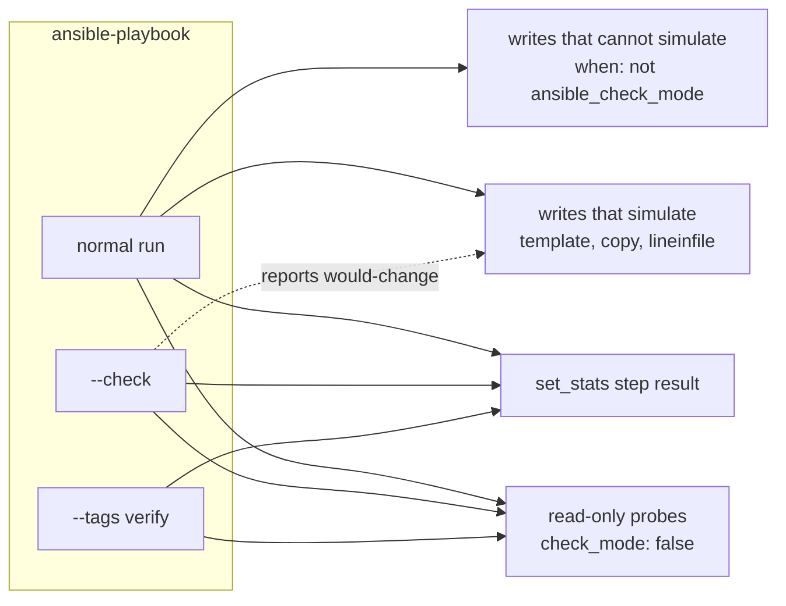

# 08 — Ansible Automation Standards

**Date:** 2026-09-22
**Status:** ACTIVE
**Author:** Joseph A. Wisneski IV
**Context:** Every deployment on the platform is an Ansible playbook run by Semaphore, and the
service deployment workflow (plan 15, OpenSpec change `service-deployment-workflow`) needs
every one of them to support a dry run and a verify run. The repository had no written
Ansible standard: conventions lived in `platform/playbooks/README.md`, ansible-lint's skip
list and habit. This document records what the official Ansible documentation says, with a
link per rule, and the platform conventions layered on top. Where the two differ, this
document says so and why.

---

## Problem

- **No dry run.** 110 playbooks; none uses check mode, three accept a bespoke `dry_run`
  variable (verified 2026-09-22 by grep over `platform/playbooks/`).
- **Silent verification under a dry run.** `ansible.builtin.uri` does not support check mode
  and is skipped under `--check` (module attributes, and a throwaway run on ansible-core
  2.21.0 reported `skipping`). 275 `uri` tasks across 62 playbook and task files (grep,
  2026-09-22), health probes among them, would do nothing under a dry run.
- **Output parsed by eye.** Results a machine must read are printed with `debug`, whose
  default rendering escapes embedded JSON.

## Design Principles

1. **The official mechanism first.** If Ansible has a feature for it (check mode, diff mode,
   `set_stats`, tags, `failed_when`), use it rather than a variable or a text convention.
2. **A normal run is unchanged by dry-run support.** Every check-mode guard is inert when
   `--check` is absent.
3. **Deviations are written down.** A platform rule that departs from the official guidance
   names the guidance and the reason.

## Architecture

The three ways any state-changing playbook can run, and which tasks execute in each:

## Official Ansible guidance this platform adopts

Each row is a rule from the linked page, read 2026-09-22.

| Topic | Rule | Source |
|---|---|---|
| Check mode | `ansible-playbook --check` runs without changing remote systems. Modules that support it report what they would change; modules that do not "report nothing and do nothing". | [Validating tasks: check mode and diff mode](https://docs.ansible.com/ansible/latest/playbook_guide/playbooks_checkmode.html) |
| Check mode | `check_mode: false` on a task forces it to run for real even under `--check`; `check_mode: true` forces simulation. | same page |
| Check mode | The magic variable `ansible_check_mode` is `true` under `--check`; use it in `when:` to skip a task, or in `ignore_errors:` to tolerate a failure caused by skipped predecessors. | same page |
| Check mode | Tasks conditioned on results registered by earlier tasks produce no meaningful output in check mode. | same page |
| Diff mode | `--diff` shows before and after; it can reveal sensitive values, so set `diff: false` on tasks that render secrets. | same page |
| Module support | `ansible.builtin.uri`: check mode `support: none`. | [uri module](https://docs.ansible.com/ansible/latest/collections/ansible/builtin/uri_module.html) |
| Module support | `ansible.builtin.command`: check mode `support: partial`; the command itself cannot be simulated, `creates`/`removes` are the workaround. | [command module](https://docs.ansible.com/ansible/latest/collections/ansible/builtin/command_module.html) |
| Run statistics | `ansible.builtin.set_stats` sets or accumulates stats for the run, per host or for the whole run; check mode `support: full`. Displayed when `show_custom_stats` is enabled (`ANSIBLE_SHOW_CUSTOM_STATS=true`). | [set_stats module](https://docs.ansible.com/ansible/latest/collections/ansible/builtin/set_stats_module.html) |
| Tags | Tags select tasks only on the command line. `always` runs unless explicitly skipped. Tag selection supersedes block error handling: a task tagged inside a `block` whose `rescue` or `always` section is untagged will not trigger those sections when only that tag is selected. | [Tags](https://docs.ansible.com/ansible/latest/playbook_guide/playbooks_tags.html) |
| Failure and change | `failed_when` and `changed_when` define failure and change per task; list conditions join with `and`, use one string with `or` for any-of. | [Error handling in playbooks](https://docs.ansible.com/ansible/latest/playbook_guide/playbooks_error_handling.html) |
| Blocks | `block` / `rescue` / `always` group tasks and handle their errors. | [Blocks](https://docs.ansible.com/ansible/latest/playbook_guide/playbooks_blocks.html) |
| Variables | Names use letters, numbers and underscores, cannot start with a number, and cannot be Python or playbook keywords. A leading underscore is not private in Ansible. | [Using variables](https://docs.ansible.com/ansible/latest/playbook_guide/playbooks_variables.html) |
| Variables | Special variables such as `playbook_dir` locate paths instead of relying on `ansible.cfg` position. | [Special variables](https://docs.ansible.com/ansible/latest/reference_appendices/special_variables.html), [Tips and tricks](https://docs.ansible.com/ansible/latest/tips_tricks/ansible_tips_tricks.html) |
| Style | Keep it simple; name every play, task and block; state `state:` explicitly; comment what a name cannot say; use fully qualified collection names (`ansible.builtin.copy`). | [Tips and tricks](https://docs.ansible.com/ansible/latest/tips_tricks/ansible_tips_tricks.html) |
| Inventory | Separate production and staging inventory so `-i` chooses the target; group by function. | [Tips and tricks](https://docs.ansible.com/ansible/latest/tips_tricks/ansible_tips_tricks.html), [How to build your inventory](https://docs.ansible.com/ansible/latest/inventory_guide/intro_inventory.html) |
| Staging | Try changes in staging first; `--syntax-check` catches syntax errors. | [Tips and tricks](https://docs.ansible.com/ansible/latest/tips_tricks/ansible_tips_tricks.html) |
| Layout | Directory layout for playbooks, inventories, group and host vars, roles. | [Sample setup](https://docs.ansible.com/ansible/latest/tips_tricks/sample_setup.html) |
| Reuse | Roles are the unit Ansible recommends for structuring reusable content. | [Roles](https://docs.ansible.com/ansible/latest/playbook_guide/playbooks_reuse_roles.html) |
| YAML | Syntax reference. | [YAML syntax](https://docs.ansible.com/ansible/latest/reference_appendices/YAMLSyntax.html) |
| Lint | ansible-lint validates playbooks against rule profiles (`min`, `basic`, `moderate`, `safety`, `shared`, `production`). | [Ansible Lint](https://docs.ansible.com/projects/lint/), [profiles](https://docs.ansible.com/projects/lint/profiles/) |

## Platform conventions on top

1. **Dry run is `--check`.** No playbook introduces a variable for it. Semaphore's "Dry run"
   task option becomes `--check` and "Diff" becomes `--diff` (Semaphore v2.18.12
   `services/tasks/LocalJob.go:432-439`, read 2026-09-22).
2. **Every task falls in one of three check-mode classes.**
   - *Read-only probe on a module without full check-mode support* (`uri` GET, a
     `command` or `shell` that only reads, or any call the author marks
     `changed_when: false`, such as the OpenBao AppRole login, a POST that only reads a
     token): `check_mode: false`, `changed_when: false`. Read-only modules with full
     support (`stat`, `slurp`) need neither.
   - *Write that cannot simulate* (`command`, `shell`, non-GET `uri`, container engine
     calls): `when: not ansible_check_mode`, or `creates`/`removes` where they express it.
   - *Write that simulates* (a module whose documentation lists check mode as `full`, such
     as `template`, `copy`, `lineinfile`, `file`): nothing extra. Check with
     `ansible-doc --json <module>`; support was read that way on 2026-09-22.
   A task that reads a value a later write needs, and must not run for real under `--check`,
   uses `ignore_errors: "{{ ansible_check_mode }}"` on the consumer instead.
3. **Verify is a tag.** Each state-changing playbook tags its verification tasks `verify`,
   and also tags `verify` on anything verification needs: OpenBao authentication, the
   transport guard, and every `rescue` and `always` section of a block that contains verify
   tasks (the tag rule above). `--tags verify` makes no change.
4. **Machine-read results use `set_stats`.** One shared task,
   `platform/playbooks/tasks/emit-step-result.yml`, records the workflow step result;
   `ANSIBLE_SHOW_CUSTOM_STATS=true` is set in both controllers' environment. `debug` stays
   for humans.
5. **Secrets.** Credential tasks keep `no_log: true` (root `AGENTS.md`, "Credential
   Handling"), and tasks that render secret files add `diff: false`. A visible task never
   loops over, or prints, a protected registered result (a `no_log` result, or a `uri`
   result that sent headers): a failed loop item is printed whole, request included. Loop
   over the clean input and index into the results with `index_var`
   (`platform/tests/test_no_request_in_loop_items.py`). The repository `ansible.cfg` also
   selects `callback_plugins/redact_requests.py`, which strips every nested result's
   request from the display (`docs/MISTAKES.md` 4.6).
6. **Environments.** Production and local-dev are separate inventories and separate
   controllers, as the tips page advises for production and staging.

### Deviations from the official guidance

| Guidance | Platform practice | Why |
|---|---|---|
| Roles structure reusable content | Composable task files under `platform/playbooks/tasks/` included by playbooks | Predates this document; the task library is the repo's reuse unit (`plan/architecture/01-automation-model.md`). Migration to roles is out of scope |
| Secrets in Ansible Vault | Secrets in OpenBao, fetched at run time; no Vault files | OpenBao is the platform's single secret authority (`PRINCIPLES.md`) |
| ansible-lint defines change with `changed_when` (rule `no-changed-when`) | `no-changed-when` is in `.ansible-lint`'s `skip_list` | Recorded here as debt: under check mode an unreported change is indistinguishable from none. The check-mode guard (change task 1.4) requires `changed_when` on read-only probes; removing the skip is a follow-up |
| `command-instead-of-module` | Skipped in `.ansible-lint`, and uses also carry `# noqa` (for example `apply-firewall.yml:160`) | The runner installs only `collections/requirements.yml` (`community.hashi_vault`, `ansible.posix`), so collection modules such as `community.general.ufw` are unavailable to it; `apply-firewall.yml:18-19` records this choice. Recorded as debt: a module call simulates under `--check`, a `command` does not |
| Leading underscore has no meaning | `_name` marks play-local facts by convention | Readability only; nothing relies on privacy |

## Implementation Phases

### Phase 1: Reference and guard

**Goal:** the standard exists and is enforced for new code.

**Tasks:** this document; the shared step-result task; a pytest guard for the three
check-mode classes, seeded with an allowlist of current violations.

**Acceptance criteria:** the guard passes on the current tree and fails on a fixture with an
unguarded write.

### Phase 2: Retrofit

**Goal:** every playbook runs cleanly under `--check` and `--tags verify`.

**Tasks:** registry executors first, then the rest by service, each removed from the
allowlist as it is fixed.

**Acceptance criteria:** the allowlist is empty.

## Validation Criteria

| Check | Pass Condition |
|---|---|
| Dry run | Every playbook exits zero under `--check` against a converged local-dev target and changes nothing |
| Probe honesty | No `uri` GET task lacks `check_mode: false` (pytest guard) |
| Unguarded writes | No `command`, `shell` or non-GET `uri` lacks a check-mode guard (pytest guard) |
| Verify | `--tags verify` changes nothing and records a step result |
| Lint | ansible-lint passes with the repo's `.ansible-lint` |

## Security Considerations

- `--diff` can print secrets; secret-rendering tasks set `diff: false`, and the Semaphore
  "Diff" option is not used on credential playbooks.
- `check_mode: false` makes a task run for real during a dry run; it is allowed only on
  tasks that cannot change state, which the guard checks by module and HTTP method.
- `set_stats` output lands in Semaphore's durable task log; step results carry names,
  statuses and evidence, never credential values.

## Cross-references

| Document | Relationship |
|---|---|
| `platform/playbooks/README.md` | Playbook conventions; links here for dry run and verify |
| `plan/architecture/01-automation-model.md` | Composable task library this document treats as the reuse unit |
| `plan/architecture/03-testing-ci-quality.md` | CI lint and test gates |
| `plan/development/15-service-deployment-workflow-agents.md` | The workflow that needs dry run and verify on every step |
| OpenSpec change `service-deployment-workflow` | Requirements `platform/automation-standards` |
| root `AGENTS.md` | Credential handling and `no_log` scope |

## Revision History

| Date | Change |
|---|---|
| 2026-09-22 | Initial version from the official documentation |
