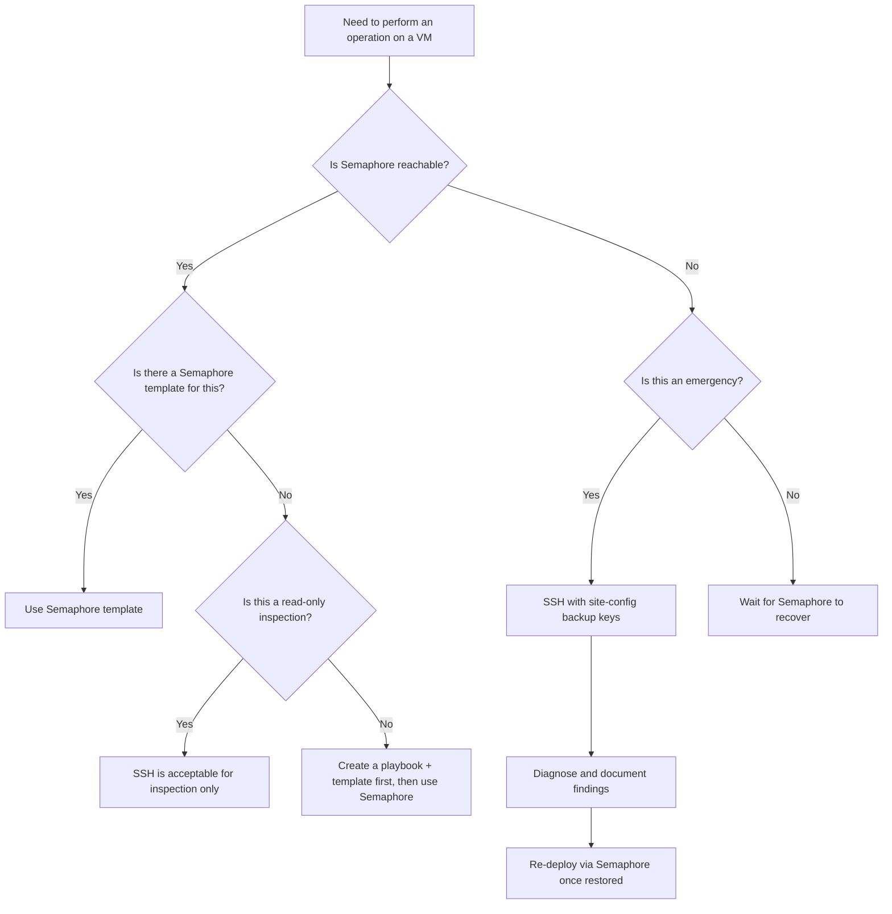
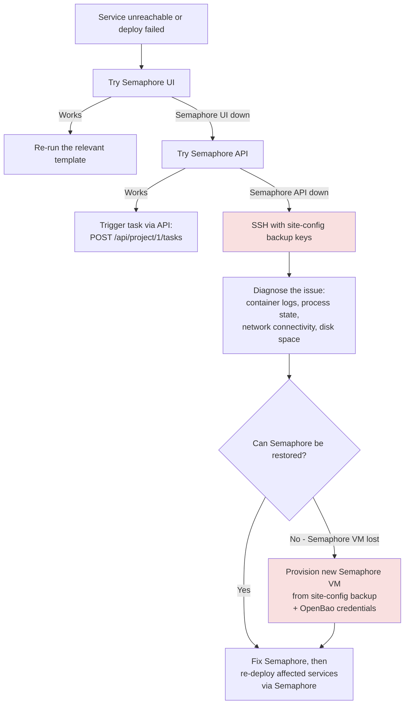

# Access Boundaries

**Date:** 2026-05-06
**Status:** ACTIVE
**Context:** The agent-cloud platform enforces a strict boundary between orchestrated automation (Semaphore) and direct operator access (SSH). This document codifies when each access path is permitted, how SSH keys are scoped, and how AppRole boundaries limit blast radius.

**References:**
- [AUTOMATION-COMPOSABILITY.md](AUTOMATION-COMPOSABILITY.md) -- Composable task library and deploy patterns
- [CREDENTIAL-LIFECYCLE-PLAN.md](CREDENTIAL-LIFECYCLE-PLAN.md) -- Secret generation, storage, rotation, TTLs
- [SERVICE-INTEGRATION-PLAN.md](SERVICE-INTEGRATION-PLAN.md) -- Service onboarding checklist
- [DISASTER-RECOVERY-PLAN.md](../development/DISASTER-RECOVERY-PLAN.md) -- DR procedures (planned)

---

## 1. Semaphore-Mediated Operations (ALWAYS use Semaphore)

All of the following operations MUST go through Semaphore. Direct SSH execution of these operations is prohibited because Semaphore provides an audit trail, AppRole credential injection, idempotent playbook execution, and branch-aware deployment.

| Operation Category | Examples | Rationale |
|--------------------|----------|-----------|
| **Service deployment** | `deploy-netbox.yml`, `deploy-nocodb.yml`, `deploy-all.yml` | AppRole injected via Semaphore environment; deploy.sh has no vault access |
| **Secret management** | `manage-secrets.yml`, `check-secrets.yml`, `validate-secrets.yml` | Secrets flow OpenBao -> Ansible memory -> Jinja2 templates; never on disk as intermediary files |
| **SSH key distribution** | `distribute-ssh-keys.yml`, `harden-ssh.yml` | Keys fetched from OpenBao at runtime; verify-before-harden pattern |
| **VM provisioning** | `provision-vm.yml`, `provision-template.yml` | Proxmox API calls require tokens stored in OpenBao |
| **Branch testing** | Any template with `service_branch` survey var | Semaphore selects branch, deploys to target, validates health |
| **OpenBao policy management** | `apply-openbao-policies.yml`, `apply-policy-*.yml` | Policies are code (.hcl files); Semaphore applies via API |
| **AppRole provisioning** | `manage-approle.yml` | Creates policy + role + stores credentials atomically |
| **Scheduled operations** | Credential rotation, audit, discovery sync | Semaphore cron triggers ensure consistent execution |
| **Container lifecycle** | `clean-deploy-*.yml`, `update-*.yml` | Destructive operations need audit trail and rollback path |
| **Docker/runtime install** | `install-docker.yml` | Idempotent; Semaphore tracks which hosts have been provisioned |

### Why Semaphore Is Required

```
Operator clicks "Deploy NetBox" in Semaphore UI
  -> Semaphore injects BAO_ROLE_ID + BAO_SECRET_ID as environment variables
  -> Ansible authenticates to OpenBao via AppRole
  -> Secrets fetched into memory, never written to intermediary files
  -> Jinja2 templates render .env files on target VM
  -> deploy.sh runs container lifecycle only (no vault access)
  -> Health check verifies deployment
  -> Full audit trail in Semaphore task log
```

Without Semaphore, the operator would need to manually export AppRole credentials, losing the audit trail and risking credential exposure in shell history.

---

## 2. Direct SSH Access (PERMITTED scenarios)

Direct SSH access is permitted ONLY in the following scenarios. The critical constraint is: **never modify Ansible-managed state via SSH**. This means no editing `.env` files, no running `deploy.sh` manually, no writing to OpenBao, and no changing `sshd_config` or sudo configuration.

| Scenario | When | What You May Do | What You Must NOT Do |
|----------|------|-----------------|----------------------|
| **Emergency debugging** | Semaphore is unreachable (UI and API both down) | Inspect logs, check process state, verify connectivity | Run deploy.sh, edit .env files, restart services |
| **Live container log inspection** | Diagnosing an issue that Semaphore logs do not capture | `docker logs`, `docker exec` for read-only inspection | Modify container state, exec write commands |
| **Manual OpenBao unseal** | After VM reboot or OpenBao restart | Run `bao operator unseal` with unseal key shards | Modify policies, create tokens, write secrets |
| **One-time data recovery** | Database corruption, volume recovery | Copy data out, run pg_dump, inspect filesystem | Restore without re-deploying via Semaphore afterward |
| **Network diagnostics** | Connectivity issues between services | `ping`, `curl`, `ss`, `traceroute`, DNS checks | Change firewall rules, modify network config |

### Access Decision Tree



### Post-SSH Reconciliation

Any changes made via emergency SSH access MUST be reconciled:

1. Document what was done and why in a GitHub issue
2. Re-deploy the affected service via Semaphore to restore Ansible-managed state
3. Verify that the Semaphore deploy produces the expected state (no drift)

---

## 3. SSH Key Usage Matrix

Four categories of SSH keys exist in the platform. Each has a specific scope and usage constraint.

| Key Category | Storage Location | Who Uses It | How It Is Used | Deployment Allowed? |
|-------------|-----------------|-------------|----------------|---------------------|
| **Per-service keys** | OpenBao `secret/services/ssh/<service>` | Semaphore (via Ansible) | Fetched at runtime, written to tempfile, used for target host auth, cleaned up in `always` block | Yes -- this is the normal deploy path |
| **Management key** | OpenBao `secret/services/ssh/management` | Semaphore (via Ansible) | Used by `distribute-ssh-keys.yml` and `harden-ssh.yml` for initial host setup | Yes -- infrastructure provisioning only |
| **Backup keys** | `site-config/secrets/` (private repo, local machine) | Human operator (emergency) | Last resort when OpenBao is unreachable or Semaphore is down | NO -- read-only diagnostics only |
| **Local operator keys** | `~/.ssh/` on operator workstation | Human operator (development) | Git operations, GitHub access, local development | NEVER for production deployments |

### Key Lifecycle

```
Per-service key lifecycle:
  Generated by Ansible -> Stored in OpenBao -> Distributed via Semaphore
  -> Rotated annually via rotate-ssh-keys.yml -> Old key archived

Backup key lifecycle:
  Copied from OpenBao to site-config/secrets/ -> Used ONLY for DR
  -> Updated when per-service keys rotate -> Never used for deployments
```

---

## 4. AppRole Scope Boundaries

AppRoles enforce least-privilege access to OpenBao secrets. Three tiers of AppRole exist, each with different scope and lifecycle.

### AppRole Tiers

| Tier | AppRole | Scope | TTL | token_num_uses | Purpose |
|------|---------|-------|-----|----------------|---------|
| **Orchestrator** | `semaphore` | `secret/data/services/*`, `sys/policies/acl/*`, `auth/approle/role/*` | token: 30m, secret_id: 0 (see note) | 0 (unlimited) | Cross-service orchestration, AppRole provisioning, policy management |
| **Runtime (current)** | `orb-agent` | `secret/data/services/netbox/orb_agent_*`, `secret/data/services/netbox/snmp_community` | token: 30m, secret_id: 0 (see note) | 0 (see note) | Agent fetches Diode + SNMP credentials at runtime via vault references |
| **Runtime (planned)** | Per-service (e.g., `netbox-deploy`, `nocodb-deploy`) | Scoped to single service path | token: 30m, secret_id: 90d | 25 | Deploy-time credential fetch for a single service |

**Note on TTL enforcement:** The `manage-approle.yml` task currently hardcodes `secret_id_ttl: 0` and `token_num_uses: 0`, which contradicts the 90-day TTL requirement in CREDENTIAL-LIFECYCLE-PLAN.md. See [APPROLE-TTL-ENFORCEMENT-PLAN.md](../development/APPROLE-TTL-ENFORCEMENT-PLAN.md) for the remediation plan.

### Scope Isolation Principle

```
Semaphore orchestrator:
  CAN read/write secrets for ALL services (orchestration role)
  CAN create/update policies and AppRoles
  CANNOT use root token operations (unseal, audit config)

Per-service runtime AppRole:
  CAN read secrets for ONE service only
  CANNOT read other services' secrets
  CANNOT modify policies or AppRoles
  CANNOT write to OpenBao (read-only)

Per-service deploy AppRole (planned):
  CAN read/write secrets for ONE service only
  CANNOT read other services' secrets
  CANNOT modify policies or AppRoles
```

### Blast Radius

If a credential is compromised, the damage is bounded by its AppRole scope:

| Compromised Credential | Blast Radius | Mitigation |
|------------------------|-------------|------------|
| Semaphore secret_id | All services' secrets, all AppRoles | Revoke immediately; rotate all service credentials |
| orb-agent secret_id | NetBox Diode + SNMP credentials only | Revoke; rotate Diode OAuth2 client + SNMP |
| Per-service deploy secret_id | Single service's secrets only | Revoke; rotate that service's credentials |
| SSH per-service key | Shell access to one VM | Rotate key; audit VM for unauthorized changes |
| SSH management key | Shell access to all VMs | Rotate key; audit all VMs; re-run harden-ssh.yml |

---

## 5. Disaster Recovery Reference

A comprehensive disaster recovery plan for the entire agent-cloud platform is planned but not yet written. The full plan will cover Semaphore outage, OpenBao sealed/lost, VM failure, data loss, and credential compromise scenarios.

**Planned document:** `plan/development/DISASTER-RECOVERY-PLAN.md`

### Escalation Path

When a service is unreachable or a deployment fails, follow this escalation path in order:



### Emergency Access Procedure

1. **Attempt Semaphore UI** -- check task history for recent failures, re-run the template
2. **Attempt Semaphore API** -- `curl -X POST` with API token from `site-config/secrets/semaphore/`
3. **SSH with backup keys** -- use keys from `site-config/secrets/` (never the local operator key)
4. **Diagnose only** -- do not modify Ansible-managed state; document everything
5. **Restore via Semaphore** -- once Semaphore is back, re-deploy to reconcile state

---

## 6. Pattern Used Per Service

Services are at different stages of migration from the legacy clone-and-deploy pattern to the composable manage-secrets pattern. The target state is all services on the composable pattern.

| Service | Deploy Pattern | Playbook | Secrets Management | Notes |
|---------|---------------|----------|-------------------|-------|
| **NetBox** | Composable (5-phase) | `deploy-netbox.yml` | `manage-secrets.yml` + Jinja2 templates | Fully migrated; reference implementation |
| **Orb Agent** | Composable (standalone) | `deploy-orb-agent.yml` | `manage-diode-credentials.yml` + agent.yaml template | Independent workflow, uses NetBox secrets |
| **OpenBao** | Legacy (clone-and-deploy) | `deploy-openbao.yml` -> `deploy-service.yml` | Self-bootstrapping (special case) | Cannot use composable pattern for its own secrets |
| **NocoDB** | Legacy (clone-and-deploy) | `deploy-nocodb.yml` -> `deploy-service.yml` | deploy.sh manages secrets directly | Migration planned |
| **n8n** | Legacy (clone-and-deploy) | `deploy-n8n.yml` -> `deploy-service.yml` | deploy.sh manages secrets directly | Migration planned |
| **Semaphore** | Legacy (clone-and-deploy) | `deploy-semaphore.yml` -> `deploy-service.yml` | deploy.sh manages secrets directly | New-VM-only deploy |
| **NemoClaw** | Legacy (clone-and-deploy) | `deploy-nemoclaw.yml` -> `deploy-service.yml` | deploy.sh manages secrets directly | AI agent tier |
| **Caddy** | Not yet integrated | -- | Manual | Reverse proxy; integration pending |
| **WisAI** | Not yet integrated | -- | Manual | Local LLM inference; separate repo |
| **WisBot** | Not yet integrated | -- | Manual | Discord bot; separate repo |
| **Nextcloud** | Not yet integrated | -- | Manual | Auxiliary tier; integration pending |
| **Wiki.js** | Not yet integrated | -- | Manual | Auxiliary tier; integration pending |
| **Postiz** | Not yet integrated | -- | Manual | Auxiliary tier; integration pending |
| **a2a-registry** | Not yet integrated | -- | Manual | Auxiliary tier; integration pending |

### Migration Priority

1. **NocoDB + n8n** -- Automation tier, highest value from composable pattern (secret drift risk)
2. **NemoClaw** -- AI tier, needs tightened AppRole policy (currently uses wildcard)
3. **Caddy** -- Infrastructure tier, minimal secrets (TLS certs via ACME)
4. **Auxiliary services** -- Lower priority, simpler 3-phase pattern sufficient

### Legacy vs Composable Flow Comparison

```
Legacy (clone-and-deploy):
  Semaphore -> clone-and-deploy.yml -> deploy.sh (generates secrets + manages containers)
  Risk: Secret drift on re-deploy, no OpenBao as source of truth

Composable (manage-secrets):
  Semaphore -> manage-secrets.yml (OpenBao fetch/generate) -> template .env -> deploy.sh (containers only)
  Benefit: Idempotent, OpenBao authoritative, deploy.sh has no vault access
```
