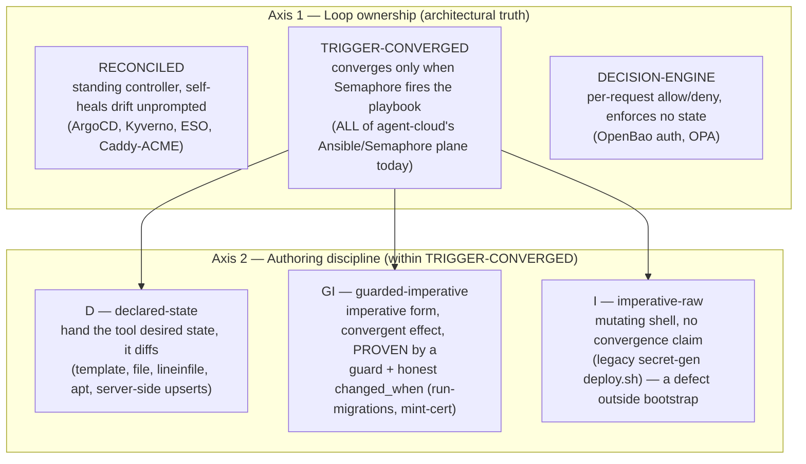
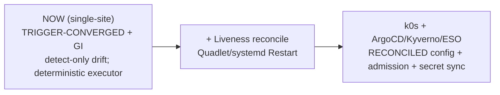

# Declarative vs Imperative Automation in agent-cloud

> **Location:** `plan/architecture/AUTOMATION-DECLARATIVE-VS-IMPERATIVE.md`
> **Date:** 2026-06-14 · **Status:** ADOPTED (reference standard) · **Owner:** uhstray-io
>
> **Purpose:** Decide *where* agent-cloud should use **declarative** automation and where **imperative** automation is correct — as a standing reference for classifying existing surfaces and authoring new ones. Read with `AUTOMATION-COMPOSABILITY.md` (the composable mechanics this builds on) and the root `CLAUDE.md` ("Foundational Over One-Shot").

**Goal:** A shared vocabulary and a set of rules that tell an engineer, for any automation surface in agent-cloud, *which style it should be and why* — and that name the platform's real automation debt honestly.

**TL;DR:** agent-cloud is **declarative at the description layer** (compose, Jinja2 env templates, `.hcl` policies, `templates.yml`, Kustomize) with a deliberately **thin imperative execution layer** (`deploy.sh` = container lifecycle only). The honest architectural baseline: **there are *zero* standing reconcilers in the running platform today** — everything converges *when Semaphore fires a playbook*, not continuously. That is the **correct** posture for single-site Compose/Podman; continuous reconciliation (ArgoCD/Kyverno/ESO) is the multi-site-Kubernetes future. The remaining imperative surfaces are either **forced** by host/OS/network constraints (not negotiable) or **known debt** (fixable) — and the single most urgent item is a real security defect in `manage-approle.yml` (see §7).

---

## 1. The two axes (the taxonomy this plan adopts)

"Declarative vs imperative" is too coarse for an ops repo. The useful model is **two orthogonal axes**. Axis 1 is the architectural truth (who closes the loop); Axis 2 is the task-author's discipline (how you write the step you must write today). Every automation surface gets a coordinate on both.

This document distinguishes *loop ownership* (does anything self-heal drift?) from *authoring discipline* (is this step honestly re-runnable?). The two are independent, and conflating them is what makes "is Ansible declarative?" an unanswerable question.

### Axis 1 — Loop ownership
- **RECONCILED** — a standing controller continuously diffs actual-vs-desired and converges **unprompted, forever**; drift self-heals at 3am with no human. *Litmus: "if reality drifts with no trigger, does it self-heal?"* Examples (all **future/edge** in agent-cloud): ArgoCD, Kyverno, External Secrets Operator, Caddy's internal ACME renewal loop.
- **TRIGGER-CONVERGED** — converges **only when invoked** (a Semaphore run). This is the **entire** current Ansible/Semaphore plane — including `state: present` modules and `compose up -d`. It is *not* declarative in the self-healing sense; calling it so hides the absence of a reconciler.
- **DECISION-ENGINE** — makes per-request allow/deny decisions; authors policy declaratively but enforces **no resource state**. OpenBao auth, OPA/Rego. (Distinct from Kyverno/ArgoCD, which *enforce* state — only the latter self-heals drift.)

### Axis 2 — Authoring discipline (applies *within* TRIGGER-CONVERGED)
- **D — declared-state:** you hand the tool the end state; it computes the diff; re-running is *intrinsically* a no-op. `ansible.builtin.template`/`file`/`lineinfile`/`apt`/`authorized_key`, `.j2`/`.hcl`/compose/`templates.yml` data, and server-side upserts (Vault policy `PUT`, Semaphore template `PUT`-by-id).
- **GI — guarded-imperative:** imperative *form*, declarative *effect*, where convergence is **hand-built** per task: a guard (`creates:`, a `when:` precondition, a `container exists` check) plus an **honest `changed_when`**. Legitimate and unavoidable at boundaries with no faithful module (podman/compose, in-container CLIs, vendor HTTP APIs). `run-migrations.yml`, `mint-internal-cert.yml`, the thin `deploy.sh` wrappers.
- **I — imperative-raw:** a mutating `shell`/`command` with **no** convergence — re-run behavior depends on side effects, not desired state. Outside genuine bootstrap/one-time genesis, this is a **defect**. The legacy n8n/nocodb secret-generating `deploy.sh` is the canonical instance.

> **The sharpest, most testable rule** (its own §6/§7): *a bare `changed_when: true` on a mutating `shell`/`command`/`podman exec` is an **unverified convergence claim** — GI-debt by default, and often I masquerading as GI.* Convergence in this repo is **authored, not free**; the author can get it wrong, and `manage-approle.yml` proves they did.

**Old labels → this model** (so prior notes reconcile): "3-tier A/B/C" → A=RECONCILED, B=imperative-raw/one-time, C=GI. "Idempotent-imperative" / "hybrid" → **GI**. "Policy-as-code" splits into *authoring* (always declarative) vs *runtime role* (DECISION-ENGINE vs RECONCILED).

---

## 2. Where agent-cloud sits today (the honest baseline)

- **Declarative *description* everywhere it counts:** `platform/services/*/deployment/compose.yml` (+ `compose.local.yml` overlays), `templates/*.j2` rendered by `manage-secrets.yml`, `platform/services/openbao/deployment/config/policies/*.hcl`, `platform/semaphore/templates.yml`, inventory vars. `setup-templates.yml` (list → `PUT`-if-exists / `POST`-if-new) is the in-repo gold standard for "declarative source, idempotent applier."
- **Thin imperative *execution*:** `deploy.sh` is container-lifecycle-only by rule (verify env → pull → `compose up -d` → wait healthy). That is the *intended* imperative residue, and it is correct GI.
- **Zero standing reconcilers in the live (Compose/Podman) plane.** `validate-secrets.yml` / `audit-credentials.yml` / `validate-all.yml` are scheduled **scans** (detect, never correct). The one unprompted reconciler that exists — the Diode **orb-agent** on a cron cadence — reconciles **NetBox inventory data**, not deployment/config state. So the compose tier has **detection without correction**; correction happens only on the next Semaphore-triggered deploy.
- **Kubernetes is greenfield.** `platform/k8s/` is empty `.gitkeep` scaffolding; ArgoCD/Kyverno/ESO are planned (Phase 3). Treat RECONCILED as **aspirational** for this platform today — it arrives with k0s.

Mapping to the **four-layer guardrails model**: the *Platform* layer is where RECONCILED pays off (k8s workloads, admission). The *Automation* layer is the TRIGGER-CONVERGED spine and should **stay** imperative-spine-with-declarative-leaves — it is the deterministic executor the AI layer is forbidden to bypass. The *Guardrail* layer is declarative-authored policy (some DECISION-ENGINE, some — in future — RECONCILED enforcement). The *AI* layer **proposes only** (§8).

---

## 3. Classification of agent-cloud surfaces

| Surface (file) | Axis 1 | Axis 2 | Note |
|---|---|---|---|
| k8s workloads (planned, `platform/k8s/`) | RECONCILED | D | ArgoCD reconciles Kustomize from git; self-heals. Empty today. |
| Kyverno admission (Phase 3) | RECONCILED | D | Admit/reject at the API boundary; pairs with ArgoCD. |
| External Secrets Operator (planned) | RECONCILED | D | OpenBao→k8s Secret sync loop. |
| Caddy ACME renewal (internal/prod) | RECONCILED | D | Caddy's own cert loop is a real reconciler. |
| Compose/Podman runtime (live) | TRIGGER-CONVERGED | GI | `compose up -d` converges *on trigger*; no orphan-reap, no 3am self-heal. Correct, not lesser. |
| Ansible playbook spine | TRIGGER-CONVERGED | D-leaves + GI | Phased plays, health-gated ordering. |
| `manage-secrets.yml` env render | TRIGGER-CONVERGED | **D** | `template` module — the model exemplar. |
| OpenBao secret *values* | TRIGGER-CONVERGED | GI (generate-if-missing) | Stateful + verification-gated; blind convergence would destroy data. Correctly never-regenerate. |
| `manage-approle.yml` | TRIGGER-CONVERGED | **I (defect)** | Mints a fresh `secret_id` every run, `secret_id_ttl: 0` — see §7. |
| OpenBao policies / `templates.yml` | TRIGGER-CONVERGED | D (data) over GI (apply) | Declarative source, idempotent upsert. |
| `deploy.sh` (dns/caddy/step-ca/uhhcraft) | TRIGGER-CONVERGED | GI (correct) | Thin lifecycle; no module does podman-compose+overlay faithfully. |
| legacy `deploy.sh` (n8n/nocodb) | TRIGGER-CONVERGED | **I (debt)** | Generates secrets, `psql INSERT` fallback — violates two Critical Rules. §7. |
| `mint-internal-cert.yml` | TRIGGER-CONVERGED | GI | Re-mints each run by design (cheap, overwrite); honest. |
| `run-migrations.yml` | TRIGGER-CONVERGED | GI (textbook) | goose idempotent at target + honest `changed_when`. |
| `harden-ssh.yml` | TRIGGER-CONVERGED | **D** | `lineinfile`+handler+`validate`+`assert` — best-in-repo. |
| bootstrap (local + prod genesis) | TRIGGER-CONVERGED | GI (sequenced) | ~25% irreducible ordering, ~75% reducible (§7). |
| OpenBao auth / OPA | DECISION-ENGINE | D (policy) | Per-request allow/deny; not a state reconciler. |
| host-side macOS wiring (resolver/forwarder/trust) | n/a (host) | GI (idempotent) | Forced imperative — outside the VM (§6). |
| n8n workflows | (unmanaged today) | — → D | Should be exported-as-code + applied via API (§7). |

---

## 4. Principles (the rules for choosing)

1. **Tag every surface on both axes.** "Is it declarative?" is ambiguous; "is it RECONCILED or TRIGGER-CONVERGED, and is it D / GI / I?" is answerable and actionable.
2. **Declarative *description* is mandatory; put desired state in data, never in shell.** Env contents, policies, the template catalog, zones, compose, n8n flows → files a tool reads (`.j2`/`.hcl`/`.yml`/JSON). Killing the legacy `common.sh generate_*_env()` heredocs is an instance.
3. **Reach for the module before `shell`.** `shell`/`command` is a last resort — justified only when no faithful module exists (podman/compose, in-container CLI, vendor API) or a module would be more convoluted than honest, guarded shell. `harden-ssh.yml` proves most "imperative" ops have a module.
4. **`changed_when` must be *true*, not `true`.** A mutating `shell`/`command` asserting `changed_when: true` is GI-debt unless the op genuinely always changes. Fix order: make the *operation* idempotent (read-guard before mutate), *then* report change honestly where a "changed" triggers a handler/restart/rotation. Enforce in CI (§7, rule AC-1).
5. **One reconciler per surface; never two sources of truth.** Secrets reconcile from OpenBao via `manage-secrets`; never *also* via `deploy.sh`. The n8n/nocodb dual path is the canonical violation.
6. **Imperative sequencing is legitimate only at genuine ordering boundaries** — genesis (first unseal/token/AppRole), `Create→Verify→Retire` rotation, staged stack start, destructive resets. Everywhere else, order is an *emergent property of declared state*, not a script.
7. **Single-site converges by trigger (permanent); reconcile *liveness*, not *config*.** Config-drift correction waits for multi-site k8s (RECONCILED pays off where a control plane already runs and drift surface is high). On single-site, the *only* worthwhile standing loop is **liveness** — Podman Quadlet / systemd `Restart=on-failure` so a crashed container self-heals without a Semaphore run. Keep config strictly trigger-driven so the executor stays deterministic.
8. **Genesis decomposes.** Process-genesis (running OpenBao+Semaphore) → declarative compose + a thin reconcile play. Only identity/trust-genesis (first unseal, first token, first `secret_id`) is irreducibly imperative-one-directional. Don't accept a 594-line hand-rolled bootstrap as inherent.
9. **Detection ≠ correction — say which you have.** The compose tier *detects* drift (scan playbooks) but does not *correct* it. Document that honestly; don't imply self-healing the platform doesn't yet have.

---

## 5. FORCED (non-negotiable) vs DEBT (fixable)

The imperative surfaces split cleanly. **FORCED** are correct and must not be "refactored to declarative." **DEBT** is fixable and tracked in §7.

| FORCED — imperative by real constraint | DEBT — imperative by choice/incompleteness |
|---|---|
| macOS host wiring: `/etc/resolver`, the `socat` LaunchDaemon, keychain trust — host files outside the podman VM, cannot go through Semaphore | `manage-approle.yml` `secret_id_ttl: 0` + unconditional `secret_id` mint — security defect |
| Privileged ports <1024 → root LaunchDaemon forwarder (no sysctl escape on macOS) | legacy n8n/nocodb secret generation in `deploy.sh` (+ `psql INSERT`) — violates 2 Critical Rules |
| Local token-mint cert issuance (`*.<zone>` not ACME-validatable inside the podman net) | `assert-orchestrated.yml` unwired — Critical Rule #1 unenforced *in the plays* |
| `.env`-on-disk secret bridge — Compose has no native OpenBao integration | env files templated into the clone, not a runtime dir — the doc's own anti-pattern; `[PLANNED]` runtime-dir tasks unbuilt |
| Semaphore env-var credential injection → `lookup('env','BAO_ROLE_ID')` | `changed_when: true` on idempotent `uri` API calls (bootstrap) — false change signal |
| same-path shared deploy dir — bind-mount source resolves on the VM engine | ~75% of bootstrap (control-plane `podman run` → compose; Semaphore resources → reconcile/provider) |
| SIGHUP / `caddy reload` apply — daemons reconcile config on signal, not file-watch | hand-rolled idempotency throughout the imperative control plane |
| `deploy.sh` = container lifecycle only — the *intended* thin imperative residue | — |

---

## 6. The unavoidable imperative core

Some imperative surfaces are **laws of the environment**, not preferences (all FORCED above). The clearest cluster is **macOS host-state**: `/etc/resolver/<zone>`, the System keychain, `/Library/LaunchDaemons`, and privileged-port binding all live *outside* the podman VM where Semaphore and the engine run — so they *cannot* be reconciled by the control plane and are correctly one-time, idempotent, host-bootstrap `make` targets. Likewise, daemons that reload config on a **signal** (step-ca SIGHUP, `caddy reload`) make the *apply* step imperative even when the config file itself is declarative. Trying to "declarative-ize" these is a category error.

---

## 7. Action backlog (ranked)

1. **`manage-approle.yml` — secret_id churn + `secret_id_ttl: 0` (SECURITY, do first).** It POSTs a fresh `/secret-id` on **every** run (orphaning the prior, which — with TTL 0 — never expires) and hardcodes `secret_id_ttl: 0` / `token_num_uses: 0` despite the security doc mandating bounded TTLs. Its sibling `provision-orb-agent-approle.yml` even documents the intended contract: *"run once, again only to rotate."* **Fix:** read the stored creds; generate a new `secret_id` only when absent / expired / `_approle_force_rotate`; on rotate, **revoke** the prior (`Create→Verify→Retire`); set a bounded `secret_id_ttl` (the doc's 90d). Converts the task from **I → D-effect**. (Note: local bootstrap inlines its own AppRole with bounded TTLs, so this bites the *prod/service* path.)
2. **Retire the legacy n8n/nocodb secret-generating path** (`common.sh:generate_*_env`, the on-VM `secrets/` dir, BAO creds passed into `deploy.sh` via `clone-and-deploy.yml`, the n8n `psql INSERT` API-key fallback). Replace with `manage-secrets.yml` + `.env.j2` (→ D) and an idempotent post-deploy API bootstrap (→ GI). Held only on pre-seeding stateful secrets into OpenBao before cutover.
3. **Wire `assert-orchestrated.yml`** as a declarative precondition in every deploy play (Critical Rule #1 is enforced today only by the `local-dev.sh` bash guard + convention).
4. **CI rule AC-1 (`changed_when` honesty):** a `shell`/`command`/`raw` task must not carry `changed_when: true` unless it bears an inline `# always-changes: <reason>` allow-comment. Carve-outs (annotate, don't change): `mint-internal-cert` (re-mints by design), `place-monorepo` local `tar|tar` (full re-sync), `clean-service` (destructive). ansible-lint's `no-changed-when` covers the *missing* case; AC-1 covers the *dishonest-`true`* case.
5. **Reconcile `AUTOMATION-COMPOSABILITY.md` with reality:** the `[PLANNED]` runtime-dir tasks (`sparse-checkout`/`setup-runtime-dir`/`run-deploy`/`verify-health`) don't exist, and `manage-secrets.yml` renders env *into the clone* — the doc's own anti-pattern. Either build the runtime-dir split or mark the doc as describing an unbuilt target.
6. **Decompose bootstrap** (§4.8): control-plane containers → a `compose.bootstrap.yml`; Semaphore resources → an "ensure resources" reconcile play (or a provider). Keep only the identity/seal kernel imperative.
7. **n8n workflows as managed declarative state:** export flows as JSON-in-repo, apply via an idempotent API task mirroring `setup-templates.yml`. Today they live only in n8n's DB — an unmanaged declarative surface.
8. **Liveness reconciliation (optional, single-site):** Podman Quadlet / systemd `Restart=on-failure` for crash self-heal — the one cheap standing loop that doesn't smuggle in autonomous config mutation.

---

## 8. The AI-layer invariant (load-bearing)

**The AI layer may only emit desired-state *proposals* into TRIGGER-CONVERGED / one-time pipelines that pass through the Guardrail layer. It must never *be* a RECONCILED controller nor author RECONCILED policy unmediated.** RECONCILED controllers (ArgoCD, Kyverno) act only on **human-merged** desired state. A standing autonomous convergence engine with an LLM authoring its target — able to act without a per-action trigger — is the one shape the four-layer model exists to forbid (an unattended loop with `down -v` reach and an LLM upstream). "AI proposes → guardrails validate → automation executes" is, precisely, *imperative control flow with declarative gates* — the right shape for a privacy/safety-critical platform. This is the default; weakening it requires an explicit, recorded decision.

---

## 9. Roadmap (where reconciliation arrives)

The runtime split *is* a decl/imp split, and that alignment is a feature: single-site Compose on Proxmox VMs has low drift surface and no cheap place to host a per-concern reconciler — TRIGGER-CONVERGED is *correct*. Multi-site k8s has high drift surface and a built-in control plane — RECONCILED wins decisively. Don't bolt continuous reconciliation onto the compose tier; let it arrive with Kubernetes.

---

## Decision criteria (alternatives considered)

| Option for the taxonomy | Verdict | Why |
|---|---|---|
| **Two axes (loop-ownership × authoring-discipline)** | **CHOSEN** | Separates the architectural truth (nothing self-heals yet) from the task-author's rule (write honest GI). Each answers a different real question; together they classify every surface without the "is Ansible declarative?" trap. |
| Binary declarative/imperative | Rejected | Forces `state: present` Ansible to be mislabeled "declarative," hiding the absence of a reconciler — the exact gap where the risk lives. |
| Three tiers (A/B/C) | Folded in | A good first cut; subsumed by the two-axis model (A=RECONCILED, C=GI, B=I/one-time). Kept as a cross-reference. |

The two-axis model was chosen because the project's central risk is **convergence that looks free but is hand-built and sometimes wrong** (`manage-approle.yml`); only a model that makes "who closes the loop" and "did you author idempotency honestly" *separately visible* surfaces that risk.

## Source context

This plan synthesizes a three-lens analysis of the repository, each verified against source, then cross-challenged:

- **Architecture lens** — declarative-vs-imperative as a property of *who closes the loop*; the four-layer mapping; the AI-invariant; liveness-vs-config reconciliation. Grounded in `AUTOMATION-COMPOSABILITY.md`, `IMPLEMENTATION_PLAN.md` (Idempotency Contract), `platform/k8s/` (empty), live deploy playbooks.
- **Automation lens** — the D/I/GI authoring discipline and the `changed_when: true` smell; refactor candidates. Grounded in `platform/playbooks/tasks/*` (`manage-secrets`, `manage-approle`, `place-monorepo`, `mint-internal-cert`, `run-migrations`), `harden-ssh.yml`, `common.sh`, `setup-templates.yml`.
- **Agent-cloud (ground-truth) lens** — current-state map, the FORCED-vs-DEBT split, and confirmation of the live `manage-approle` defect (`secret_id_ttl: 0` at lines ~60–61; unconditional `/secret-id` POST at ~75–85), the unwired `assert-orchestrated.yml`, and the unbuilt runtime-dir tasks. Grounded across `platform/playbooks/`, `platform/services/*/deployment/`, `platform/semaphore/`, `scripts/local-dev.sh`.

Consensus: adopt Axis-1 loop-ownership as the architectural truth (zero standing reconcilers today — names the k8s gap), layer D/I/GI authoring discipline within it, treat the `changed_when: true`-on-mutating-shell as the #1 debt signal, and rank the `manage-approle` defect as the most urgent fix.

## Target outcome

After this plan is adopted as the reference standard:

- Every new automation surface is authored with an explicit Axis-1/Axis-2 coordinate, and reviews reject **I masquerading as GI** (bare `changed_when: true` on mutating shell) via CI rule AC-1.
- The `manage-approle` security defect is fixed (`Create→Verify→Retire`, bounded TTL); the legacy n8n/nocodb secret path is retired; `assert-orchestrated.yml` is wired.
- `AUTOMATION-COMPOSABILITY.md` describes the system that actually exists (runtime-dir built, or the design dropped).
- The platform's drift story is stated honestly — *detect-only on the compose tier today; continuous reconciliation arrives with k0s/ArgoCD* — and the AI layer is constrained, by invariant, to proposing into gated pipelines rather than closing loops.
