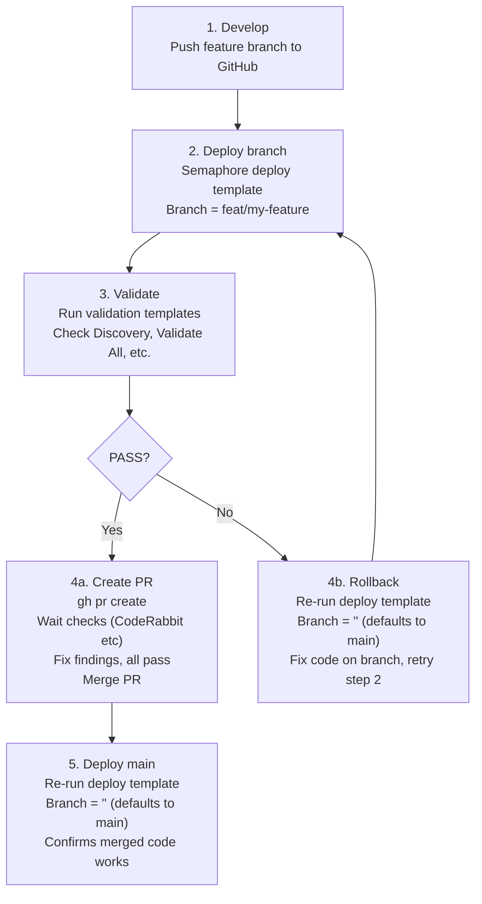

# Branch Testing Workflow

**Date:** 2026-04-22
**Status:** ACTIVE

---

## Overview

All deploy playbooks support a `service_branch` variable (defaults to `main`). This enables deploying feature branches to production infrastructure for validation before merging, with instant rollback by re-deploying from main.

## Workflow



## How It Works

### Playbook Support

Every deploy playbook reads `service_branch` with a fallback to `main`:

```yaml
# deploy-orb-agent.yml
- name: "Update monorepo to latest"
  ansible.builtin.git:
    repo: "{{ monorepo_repo }}"
    dest: "{{ _monorepo_dir }}"
    version: "{{ service_branch | default('main') }}"
    force: true
```

Playbooks with `service_branch` support:
- `deploy-all.yml`
- `deploy-openbao.yml`
- `deploy-nocodb.yml`
- `deploy-n8n.yml`
- `deploy-semaphore.yml`
- `deploy-netbox.yml`
- `deploy-nemoclaw.yml`
- `clean-deploy-netbox.yml`
- `deploy-orb-agent.yml`

### Semaphore Survey Variables

All deploy templates include a `survey_vars` field for `service_branch`. In the Semaphore UI, this appears as a "Branch" text field when launching a task. Leave it empty to deploy from main.

```yaml
# platform/semaphore/templates.yml
- name: Deploy Orb Agent
  playbook: platform/playbooks/deploy-orb-agent.yml
  survey_vars:
    - name: service_branch
      title: "Branch"
      description: "Git branch to deploy (default: main)"
      type: string
      required: false
```

### API Usage

**Deploy playbooks** (deploy code on target VM from a branch):

```bash
curl -X POST -H "Authorization: Bearer $TOKEN" -H "Content-Type: application/json" \
  -d '{
    "template_id": 47,
    "project_id": 1,
    "environment": "{\"service_branch\": \"feat/my-feature\"}"
  }' \
  "http://$SEMAPHORE_HOST:3000/api/project/1/tasks"
```

**Any playbook** (run Semaphore's own repo clone from a branch — works for validation, cleanup, secrets, and all non-deploy playbooks):

```bash
curl -X POST -H "Authorization: Bearer $TOKEN" -H "Content-Type: application/json" \
  -d '{
    "template_id": 56,
    "project_id": 1,
    "git_branch": "feat/my-feature"
  }' \
  "http://$SEMAPHORE_HOST:3000/api/project/1/tasks"
```

The `git_branch` parameter tells Semaphore to clone the repo from that branch before running the playbook. This works for **every** template — deploy, validation, cleanup, secrets, SSH, infrastructure. No merge to main required.

**Rollback** (deploy from main):

```bash
curl -X POST -H "Authorization: Bearer $TOKEN" -H "Content-Type: application/json" \
  -d '{"template_id": 47, "project_id": 1}' \
  "http://$SEMAPHORE_HOST:3000/api/project/1/tasks"
```

### Two Branch Mechanisms

| Parameter | What it does | Scope |
| --------- | ------------ | ----- |
| `git_branch` | Semaphore clones the repo from this branch (the playbook itself runs from the branch) | All templates |
| `service_branch` | The playbook's internal git clone on the target VM uses this branch | Deploy templates only |

For deploy playbooks, use both: `git_branch` gets the latest playbook code, `service_branch` deploys the branch code on the target VM.

## Safety Properties

1. **Low risk**: The branch deploy changes code on the target VM but does not modify OpenBao secrets, database state, or persistent volumes. However, if branch code runs migrations or alters container state, those effects may persist after rollback.
2. **Fast rollback**: Re-running the deploy template with `service_branch` set to `main` typically reverts within a few minutes. Rollback time depends on git pull speed and container restart duration.
3. **No merge required**: Branch code can be validated in production without touching main. If it fails, rollback and fix.
4. **Composable with validation**: After deploying a branch, run any validation template (Check Discovery, Validate All, Validate Secrets) to confirm the change works.
5. **Caveat**: Branch deploys that include database migrations, destructive container operations, or schema changes may not be fully reversible by simply re-deploying main. Test those changes on a dedicated test environment when possible.

## Validation Templates

| Template | Purpose | When to Use |
| -------- | ------- | ----------- |
| Check Discovery Pipeline | Entity counts, worker logs, VMs, Clusters, primary_ip4 | After deploying worker code changes |
| Validate All Services | HTTP health checks on all services | After any service deploy |
| Validate Secrets | Test credentials against live services | After secret or AppRole changes |
| Cleanup NetBox (dry_run) | Check for orphaned entities | After entity model changes |

## PR Merge Rules

After branch validation succeeds:

1. Create a PR via `gh pr create`
2. Wait for **all PR checks** to complete (CodeRabbit, CI, linters)
3. Address all review findings and push fixes
4. Confirm all checks pass after fixes
5. Merge the PR
6. Re-deploy from main to confirm the merge is clean

**Never merge a PR before its checks have completed and passed.**
