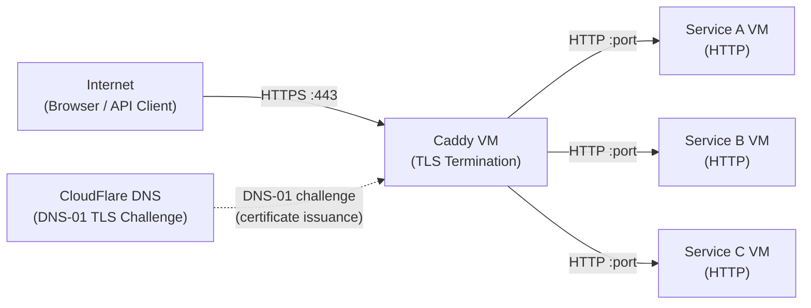
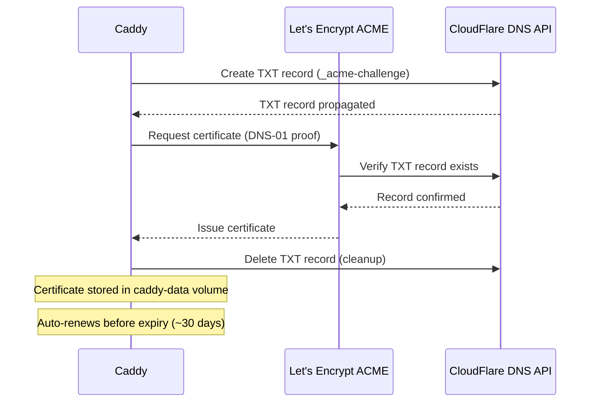
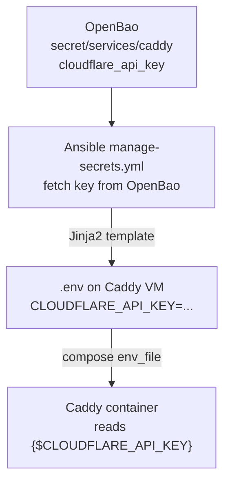

# Caddy Reverse Proxy Architecture

**Date:** 2026-05-06
**Status:** ACTIVE
**Contributors:** Network architecture review

**References:**
- [SERVICE-INTEGRATION-PLAN.md](SERVICE-INTEGRATION-PLAN.md) -- Service onboarding checklist
- [AUTOMATION-COMPOSABILITY.md](AUTOMATION-COMPOSABILITY.md) -- Composable task library and deploy patterns
- [CREDENTIAL-LIFECYCLE-PLAN.md](CREDENTIAL-LIFECYCLE-PLAN.md) -- Secret generation, storage, rotation
- `platform/services/caddy/deployment/` -- Templatized Caddyfile and compose stack

---

## Purpose

Caddy is the sole HTTPS ingress point for the uhstray-io platform. Every external request to a platform service passes through Caddy for TLS termination, routing, and security header enforcement. This document defines the architecture, integration patterns, and automation gaps for the Caddy reverse proxy.

---

## Role in the 4-Layer Model

Caddy operates at the **Platform Layer** -- it is infrastructure, not automation or AI. It has no business logic; its sole responsibility is accepting inbound HTTPS connections, terminating TLS, and forwarding requests to internal service VMs over HTTP.

```
AI Layer         NemoClaw, NetClaw, WisBot, Claude Cowork
                 (consumers of services behind Caddy)

Guardrail Layer  OpenBao, Kyverno, OPA
                 (Caddy does not enforce policy -- it routes)

Automation Layer Ansible, Semaphore
                 (Caddy deployment should be orchestrated here -- GAP)

Platform Layer   Caddy (HTTPS ingress) -> Docker/Podman services on VMs
                 Proxmox VMs, container runtimes
```

Caddy is classified as **Infrastructure tier** per the SERVICE-INTEGRATION-PLAN.md taxonomy -- it requires a dedicated VM, has a critical-tier credential (CloudFlare API key), and is a single point of failure for all external access.

---

## Traffic Flow



Key properties:
- **All external traffic enters through Caddy on port 443.** Port 80 redirects to 443 (Caddy default behavior).
- **TLS terminates at Caddy.** Backend services receive plain HTTP. No double encryption overhead.
- **CloudFlare is DNS only.** Traffic does not proxy through CloudFlare's network -- Caddy handles TLS directly using certificates obtained via DNS-01 challenge.
- **Internal services are not exposed to the internet.** Only Caddy's ports 80/443 are forwarded through the router.

---

## Service Routing Pattern

The Caddyfile uses environment variable substitution for all domains, IPs, and ports. No hardcoded values appear in the committed template.

### Standard Caddyfile Block

```caddyfile
{$SERVICE_DOMAIN} {
    tls {
        dns cloudflare {$CLOUDFLARE_API_KEY}
        resolvers 1.1.1.1 1.0.0.1
    }

    header {
        Strict-Transport-Security max-age=15552000;
    }

    reverse_proxy {$SERVICE_IP}:{$SERVICE_PORT}
}
```

### WebSocket-Aware Block

For services that require WebSocket support (e.g., collaborative editing, real-time dashboards):

```caddyfile
{$SERVICE_DOMAIN} {
    tls {
        dns cloudflare {$CLOUDFLARE_API_KEY}
        resolvers 1.1.1.1 1.0.0.1
    }

    header {
        Strict-Transport-Security max-age=15552000;
    }

    @ws {
        header Connection *Upgrade*
        header Upgrade websocket
    }

    reverse_proxy {$SERVICE_IP}:{$SERVICE_PORT_MAIN}
    reverse_proxy @ws {$SERVICE_IP}:{$SERVICE_PORT_WS}
}
```

### Variable Resolution

Environment variables are resolved at container startup. The current deployment uses `start-caddy.sh` to parse CLI arguments and export variables before running `docker compose up`. The target state replaces this with Ansible-templated `.env` files following the composable pattern.

| Variable | Source | Example Placeholder |
|----------|--------|-------------------|
| `{$SERVICE_DOMAIN}` | FQDN from site-config | `svc.example.com` |
| `{$SERVICE_IP}` | Internal IP from site-config | `10.0.0.x` |
| `{$SERVICE_PORT}` | Service listening port | `8080` |
| `{$CLOUDFLARE_API_KEY}` | OpenBao secret | (API token) |

---

## TLS and DNS Integration

### Why DNS-01 Challenge

Caddy uses the **CloudFlare DNS-01 ACME challenge** for certificate issuance and renewal. This is required because:

1. **Wildcard certificates** -- DNS-01 is the only ACME challenge type that supports wildcard certs (`*.example.com`).
2. **No port 80 dependency** -- HTTP-01 requires port 80 to be publicly reachable. DNS-01 works entirely via DNS record creation, making it compatible with NAT and firewall configurations.
3. **Automatic renewal** -- Caddy handles certificate renewal automatically before expiry. The DNS-01 plugin creates and cleans up TXT records via the CloudFlare API.

### Certificate Lifecycle



### CloudFlare API Key Scope

The CloudFlare API key needs **Zone:DNS:Edit** permission for the target zone. It does not need account-level access or any permissions beyond DNS record management. A scoped API token (not a Global API Key) is the recommended credential type.

---

## Adding a New Service to the Proxy

When a new platform service needs external HTTPS access, follow these steps in coordination with the SERVICE-INTEGRATION-PLAN.md onboarding checklist.

### Step 1: Allocate DNS Record

In CloudFlare (or via Terraform/API), create an A record pointing the service's FQDN to the Caddy VM's public IP. Record the FQDN in site-config inventory.

### Step 2: Add Caddyfile Block

Add a new block to the Caddyfile template in `platform/services/caddy/deployment/Caddyfile`:

```caddyfile
{$NEWSERVICE_DOMAIN} {
    tls {
        dns cloudflare {$CLOUDFLARE_API_KEY}
        resolvers 1.1.1.1 1.0.0.1
    }

    header {
        Strict-Transport-Security max-age=15552000;
    }

    reverse_proxy {$NEWSERVICE_IP}:{$NEWSERVICE_PORT}
}
```

### Step 3: Add Environment Variables

Add the corresponding variables to the `.env` template (or the site-config Caddyfile, depending on current deployment method):

```
NEWSERVICE_DOMAIN=svc.example.com
NEWSERVICE_IP=10.0.0.x
NEWSERVICE_PORT=8080
```

### Step 4: Reload Caddy

Caddy supports zero-downtime config reloads. After updating the Caddyfile and environment:

```bash
docker exec caddy caddy reload --config /etc/caddy/Caddyfile
```

Or redeploy via the deploy workflow (when automated -- see Automation Gap below).

### Step 5: Verify

- Confirm HTTPS access at `https://svc.example.com`
- Verify the TLS certificate is issued by Let's Encrypt
- Check HSTS header is present
- Test WebSocket connectivity if applicable

---

## Credential Management

### Current State

The CloudFlare API key is currently managed outside the composable pattern:
- The standalone `caddy` repo has the key hardcoded in its Caddyfile
- The agent-cloud template uses `{$CLOUDFLARE_API_KEY}` substitution
- The `start-caddy.sh` script accepts the key as a CLI argument (`-k`)
- site-config has a placeholder Caddyfile (0 bytes)

### Target State

The CloudFlare API key should follow the standard credential flow:



### OpenBao Secret Path

| Path | Key | Type | Rotation |
|------|-----|------|----------|
| `secret/services/caddy` | `cloudflare_api_key` | `user` (externally managed) | 90-day rotation cycle |

The CloudFlare API key is classified as `type: user` in `_secret_definitions` because it is created externally (in CloudFlare's dashboard), not auto-generated. The `manage-secrets.yml` task fetches it from OpenBao but never generates it.

### Rotation Policy

- **Rotation cycle:** 90 days (critical-tier credential per CREDENTIAL-LIFECYCLE-PLAN.md)
- **Rotation method:** Generate new scoped API token in CloudFlare, store in OpenBao, redeploy Caddy, verify certificates still renew, then revoke old token in CloudFlare
- **Dual-valid window:** Both old and new tokens are active during rotation. Caddy uses the new token after redeployment. The old token is revoked only after confirming successful certificate renewal with the new one.

---

## Automation Gap

Caddy is the only infrastructure-tier service that lacks full composable automation. The following items are needed to bring it into compliance with the platform deployment pattern.

### Missing Components

| Component | Status | Required Action |
|-----------|--------|-----------------|
| **Ansible playbook** (`deploy-caddy.yml`) | Missing | Create 3-phase playbook: secrets -> deploy -> verify |
| **Clean deploy playbook** (`clean-deploy-caddy.yml`) | Missing | Create using `tasks/clean-service.yml` |
| **Semaphore templates** | Missing | Add "Deploy Caddy" and "Clean Deploy Caddy" to `platform/semaphore/templates.yml` |
| **OpenBao secret path** | Missing | Store CloudFlare API key at `secret/services/caddy` |
| **Jinja2 env template** | Missing | Create `platform/services/caddy/deployment/templates/caddy.env.j2` |
| **deploy.sh** | Partial (`start-caddy.sh` exists) | Refactor to container-lifecycle-only `deploy.sh` following composable pattern |
| **Health check** | Missing | Add to `validate-all.yml` (check HTTPS response from Caddy) |
| **SSH key pair** | Missing | Generate and store in OpenBao at `secret/services/ssh/caddy` |
| **Inventory entry** | Missing | Add `caddy_svc` host group to site-config inventory |

### Deployment Classification

Per SERVICE-INTEGRATION-PLAN.md, Caddy is an **auxiliary-to-infrastructure** tier service:

- **No database** -- state is in the `caddy-data` volume (certificates) and `caddy-config` volume
- **No runtime OpenBao access** -- credentials injected at deploy time via `.env`
- **Single container** -- simple compose stack
- **3-phase playbook** (simplified pattern): manage-secrets -> deploy -> verify

### Priority

Caddy automation should be implemented as part of the next service onboarding wave (alongside NocoDB and n8n migration). The CloudFlare API key must be stored in OpenBao before Caddy can use the composable credential flow.

---

## Backend Policies

### HTTP vs HTTPS Backend Connections

| Scenario | Backend Protocol | When to Use |
|----------|-----------------|-------------|
| **Plain HTTP** (default) | `reverse_proxy http://IP:PORT` | All internal services on trusted network. Standard pattern. |
| **HTTPS with TLS skip verify** | `reverse_proxy https://IP:PORT { transport http { tls_insecure_skip_verify } }` | Backend has self-signed cert (e.g., Proxmox API). Use sparingly -- only when the backend requires HTTPS and you control the certificate. |
| **HTTPS with trusted CA** | `reverse_proxy https://IP:PORT { transport http { tls_trusted_ca_certs /path/to/ca.pem } }` | Backend uses internal CA. Preferred over skip verify when an internal CA exists. |

**Default policy:** All platform services run plain HTTP on the internal network. Caddy handles TLS termination. Do not configure backends with HTTPS unless the service explicitly requires it (e.g., Proxmox's management API).

### HSTS Policy

All Caddyfile blocks include the `Strict-Transport-Security` header:

```
Strict-Transport-Security max-age=15552000;
```

This tells browsers to always use HTTPS for the domain for 180 days. Notes:

- **Do not enable `includeSubDomains`** unless all subdomains are also served via HTTPS through Caddy.
- **Do not enable `preload`** until the HSTS policy has been stable for at least 6 months and all services are confirmed working under HTTPS.
- The 180-day `max-age` is a conservative starting point. Increase to 1 year (`31536000`) after confirming no services need HTTP fallback.

### Security Headers

Beyond HSTS, consider adding these headers as the proxy matures:

```caddyfile
header {
    Strict-Transport-Security max-age=15552000;
    X-Content-Type-Options nosniff
    X-Frame-Options DENY
    Referrer-Policy strict-origin-when-cross-origin
}
```

These should be evaluated per-service -- some services (e.g., collaborative editors, iframe-embedded dashboards) may need `X-Frame-Options` set to `SAMEORIGIN` instead of `DENY`.

---

## Caddyfile Management: Public vs Private

The Caddyfile in `agent-cloud/platform/services/caddy/deployment/Caddyfile` is the **public template** -- it contains only environment variable references (`{$VAR}`), no real domains or IPs.

The production Caddyfile with real routing configuration lives in **site-config**. This split follows the public/private repository boundary:

| Repository | File | Contains |
|------------|------|----------|
| agent-cloud | `platform/services/caddy/deployment/Caddyfile` | Template with `{$VAR}` placeholders |
| agent-cloud | `platform/services/caddy/deployment/compose.yml` | Compose stack definition |
| site-config | Caddy configuration files | Real FQDNs, IPs, and routing rules |

When the composable automation is implemented, the production Caddyfile will be rendered from Jinja2 templates using values from site-config inventory, matching the pattern used by all other services.

---

## Kubernetes Migration Path

When the platform migrates to Kubernetes (k0s), Caddy's role shifts:

- **Current (Compose):** Caddy runs as a standalone container on a dedicated VM, routing to other VMs by IP.
- **Future (Kubernetes):** Caddy becomes an Ingress controller, routing to Kubernetes Services by name. The Caddyfile is replaced by Ingress resources or a CRD-based configuration.

The CloudFlare DNS-01 integration remains relevant in Kubernetes via [cert-manager](https://cert-manager.io/) with a CloudFlare DNS01 solver, or by running Caddy as the ingress controller directly.
