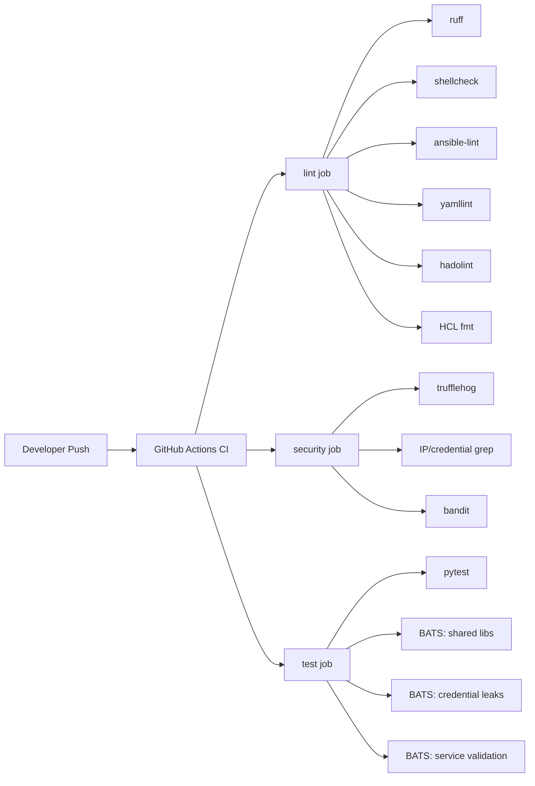
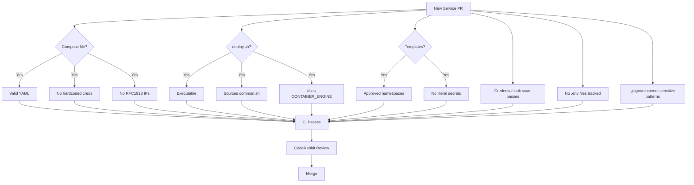
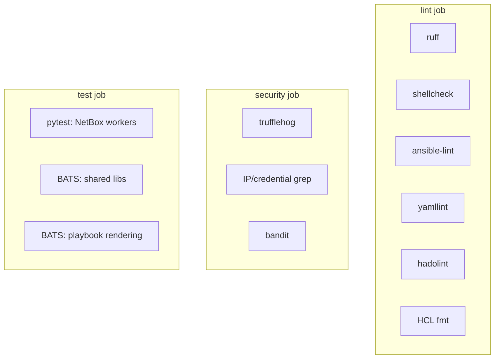

# CI Testing Specification

**Date:** 2026-05-06
**Status:** ACTIVE
**Scope:** Test standards, templates, and onboarding requirements for all agent-cloud services

---

## Overview

This specification defines what tests must exist for every service and agent in agent-cloud, how to write them, and what must pass before a PR is merged. It addresses the coverage gap where only NetBox has functional tests while 11 services and 3 agents have none.

### Test Pipeline Flow



---

## 1. Test Categories

### 1a. Unit Tests (BATS / pytest)

Test individual functions and scripts in isolation.

| Framework | Scope | Location |
|-----------|-------|----------|
| BATS | Bash libraries, deploy scripts, structural validation | `platform/tests/` |
| pytest | Python workers, helpers, data transformers | `platform/services/<svc>/deployment/tests/` |

### 1b. Security Tests (credential leak)

Validate that no credentials, private IPs, or secrets are committed to the repository.

| Test | Tool | Location |
|------|------|----------|
| RFC1918 IP detection | BATS + grep | `platform/tests/test_credential_leaks.bats` |
| Hardcoded password detection | BATS + grep | `platform/tests/test_credential_leaks.bats` |
| Template namespace validation | BATS + grep | `platform/tests/test_credential_leaks.bats` |
| Gitignore coverage | BATS | `platform/tests/test_credential_leaks.bats` |
| Tracked .env detection | BATS + git | `platform/tests/test_credential_leaks.bats` |
| Verified secret scanning | trufflehog | CI security job |

### 1c. Validation Tests (compose, template, structure)

Validate configuration files are well-formed and follow conventions.

| Test | Tool | Target |
|------|------|--------|
| Compose YAML validity | BATS + python yaml | `**/compose.yml`, `**/docker-compose.yml` |
| Compose required services | BATS + grep/yq | Service-specific compose files |
| Compose no hardcoded creds | BATS + grep | All compose files |
| Jinja2 template syntax | ansible-lint | `**/templates/*.j2` |
| Jinja2 namespace validation | BATS + grep | `**/templates/*.j2` |
| deploy.sh structure | BATS | `**/deploy.sh` |

### 1d. Integration Tests (health check)

Runtime validation against live services. These run in Semaphore, not GitHub Actions.

| Test | Playbook | Environment |
|------|----------|-------------|
| HTTP health checks | `validate-all.yml` | Semaphore |
| Credential validation | `validate-secrets.yml` | Semaphore |
| Discovery entity counts | `check-discovery.yml` | Semaphore |

---

## 2. New Service Testing Template

Every service added to `platform/services/<name>/` must have corresponding tests. Below are BATS test templates that can be copied and adapted.

### 2a. Compose File Validation

```bash
#!/usr/bin/env bats
# Tests for platform/services/<name>/deployment compose file.

SERVICE_NAME="<name>"
COMPOSE_DIR="$BATS_TEST_DIRNAME/../services/$SERVICE_NAME/deployment"

@test "$SERVICE_NAME compose: file exists and is valid YAML" {
  local compose_file
  compose_file=$(find "$COMPOSE_DIR" -maxdepth 1 \
    -name "compose.yml" -o -name "docker-compose.yml" | head -1)
  [ -n "$compose_file" ]
  python3 -c "import yaml; yaml.safe_load(open('$compose_file'))"
}

@test "$SERVICE_NAME compose: defines at least one service" {
  local compose_file
  compose_file=$(find "$COMPOSE_DIR" -maxdepth 1 \
    -name "compose.yml" -o -name "docker-compose.yml" | head -1)
  grep -q "^services:" "$compose_file"
}

@test "$SERVICE_NAME compose: no hardcoded credentials" {
  local compose_file
  compose_file=$(find "$COMPOSE_DIR" -maxdepth 1 \
    -name "compose.yml" -o -name "docker-compose.yml" | head -1)
  # Should use env_file or ${VAR} references, not literal passwords
  ! grep -iE 'password:\s*["\x27]?[A-Za-z0-9]{8,}' "$compose_file"
  ! grep -iE 'secret:\s*["\x27]?[A-Za-z0-9]{8,}' "$compose_file"
}

@test "$SERVICE_NAME compose: no hardcoded RFC1918 IPs" {
  local compose_file
  compose_file=$(find "$COMPOSE_DIR" -maxdepth 1 \
    -name "compose.yml" -o -name "docker-compose.yml" | head -1)
  ! grep -E '(192\.168\.|10\.[0-9]+\.[0-9]+\.|172\.(1[6-9]|2[0-9]|3[01])\.)' "$compose_file"
}
```

### 2b. deploy.sh Validation

```bash
#!/usr/bin/env bats
# Tests for platform/services/<name>/deployment/deploy.sh structure.

SERVICE_NAME="<name>"
DEPLOY_SCRIPT="$BATS_TEST_DIRNAME/../services/$SERVICE_NAME/deployment/deploy.sh"

@test "$SERVICE_NAME deploy.sh: exists and is executable" {
  [ -f "$DEPLOY_SCRIPT" ]
  [ -x "$DEPLOY_SCRIPT" ]
}

@test "$SERVICE_NAME deploy.sh: sources common.sh or defines CONTAINER_ENGINE" {
  # Must either source the shared library or handle container engine directly
  grep -qE '(source.*common\.sh|CONTAINER_ENGINE)' "$DEPLOY_SCRIPT"
}

@test "$SERVICE_NAME deploy.sh: uses CONTAINER_ENGINE variable, not hardcoded docker/podman" {
  # Direct docker/podman calls should use the variable
  # Allow lines that SET the variable or are comments
  local violations
  violations=$(grep -nE '^\s*(docker|podman)\s+(compose|run|start|stop|pull)' "$DEPLOY_SCRIPT" \
    | grep -v '^#' | grep -v 'CONTAINER_ENGINE' || true)
  [ -z "$violations" ]
}

@test "$SERVICE_NAME deploy.sh: has bash shebang" {
  head -1 "$DEPLOY_SCRIPT" | grep -q '#!/.*bash'
}
```

### 2c. Environment Template Validation

```bash
#!/usr/bin/env bats
# Tests for platform/services/<name>/deployment/templates/*.j2 files.

SERVICE_NAME="<name>"
TEMPLATE_DIR="$BATS_TEST_DIRNAME/../services/$SERVICE_NAME/deployment/templates"

@test "$SERVICE_NAME templates: use approved Jinja2 variable namespaces" {
  if [ ! -d "$TEMPLATE_DIR" ]; then
    skip "no templates directory"
  fi
  for tmpl in "$TEMPLATE_DIR"/*.j2; do
    [ -f "$tmpl" ] || continue
    # Jinja2 variables should use secrets.*, _*, ansible_*, inventory_hostname
    # or other approved namespaces -- not bare literal values
    local bare_vars
    bare_vars=$(grep -oE '\{\{\s*[a-z][a-z0-9_]*\s*\}\}' "$tmpl" \
      | grep -vE '\{\{\s*(secrets|_|ansible_|inventory_hostname|service_|monorepo_|container_|hostvars|groups|item)' \
      || true)
    if [ -n "$bare_vars" ]; then
      echo "WARNING: $tmpl has variables outside approved namespaces: $bare_vars"
    fi
  done
}

@test "$SERVICE_NAME templates: no hardcoded credential values" {
  if [ ! -d "$TEMPLATE_DIR" ]; then
    skip "no templates directory"
  fi
  for tmpl in "$TEMPLATE_DIR"/*.j2; do
    [ -f "$tmpl" ] || continue
    ! grep -iE '(password|secret|token|api_key)\s*[:=]\s*[A-Za-z0-9]{8,}' "$tmpl"
  done
}
```

### 2d. Credential Leak Tests (per-service)

```bash
#!/usr/bin/env bats
# Credential leak tests for platform/services/<name>/.

SERVICE_NAME="<name>"
SERVICE_DIR="$BATS_TEST_DIRNAME/../services/$SERVICE_NAME"

@test "$SERVICE_NAME: no RFC1918 IPs in committed files" {
  local violations
  violations=$(git ls-files -- "$SERVICE_DIR" \
    | xargs grep -lE '(192\.168\.|10\.[0-9]+\.[0-9]+\.|172\.(1[6-9]|2[0-9]|3[01])\.)' 2>/dev/null \
    | grep -v '\.example$' | grep -v 'test' || true)
  [ -z "$violations" ]
}

@test "$SERVICE_NAME: no .env files tracked (only .env.example)" {
  local tracked_env
  tracked_env=$(git ls-files -- "$SERVICE_DIR" | grep '\.env$' | grep -v '\.example$' || true)
  [ -z "$tracked_env" ]
}
```

---

## 3. Service Onboarding Testing Checklist

Every service PR must satisfy these requirements before merge:



### Checklist

- [ ] **Compose file** is valid YAML with at least one defined service
- [ ] **Compose file** contains no hardcoded credentials or RFC1918 IPs
- [ ] **deploy.sh** is executable with a bash shebang
- [ ] **deploy.sh** sources `common.sh` or uses `CONTAINER_ENGINE` variable
- [ ] **deploy.sh** does not hardcode `docker` or `podman` commands
- [ ] **Jinja2 templates** use only approved variable namespaces (`secrets.*`, `_*`, `ansible_*`)
- [ ] **Jinja2 templates** contain no hardcoded credential values
- [ ] **No .env files** are tracked by git (only `.env.example`)
- [ ] **No RFC1918 IPs** appear in any committed file (excluding examples/tests)
- [ ] **No hardcoded passwords** or API keys in committed files
- [ ] **.gitignore** covers `*.env`, `secrets/`, `*.key`, `*.pem` patterns
- [ ] **All CI checks** (lint, security, test) pass
- [ ] **CodeRabbit** review has no blocking findings

---

## 4. Credential Leak Testing

### 4a. Standalone BATS Tests

The file `platform/tests/test_credential_leaks.bats` contains repository-wide credential leak regression tests. These run in the CI test job alongside existing BATS tests.

**Coverage:**

| Test | What It Catches |
|------|----------------|
| RFC1918 IP scan | 192.168.x.x, 10.x.x.x, 172.16-31.x.x in committed files |
| Hardcoded password scan | `password=`, `secret=`, `token=` with literal values |
| Jinja2 namespace audit | Templates using bare variables instead of `secrets.*` / `_*` |
| Gitignore patterns | Missing coverage for `.env`, `secrets/`, `*.key`, `*.pem`, `*.secret` |
| Tracked .env files | Any `.env` file (non-example) in git index |
| Tracked secret files | Any `*.key`, `*.pem`, `*.secret` file in git index |

### 4b. RFC1918 IP Detection (expanded)

The CI security job currently only checks `192.168.x.x` in diffs. The standalone BATS test expands to all RFC1918 ranges:

| Range | CIDR | Use |
|-------|------|-----|
| 10.0.0.0/8 | `10\.\d+\.\d+\.\d+` | Large private networks |
| 172.16.0.0/12 | `172\.(1[6-9]\|2[0-9]\|3[01])\.\d+\.\d+` | Medium private networks |
| 192.168.0.0/16 | `192\.168\.\d+\.\d+` | Small private networks |

**Excluded from scans:**
- Files matching `*.example`, `*.md` (documentation), `test*` (test fixtures)
- Lines containing `target`, `host:`, `subnet`, `scope`, `example`, `RFC1918`, `CIDR`
- The test file itself
- `netbox-docker/` (vendored upstream)
- `.gitkeep` files

### 4c. Jinja2 Template Namespace Validation

Approved variable namespaces for Jinja2 templates:

| Namespace | Purpose | Example |
|-----------|---------|---------|
| `secrets.*` | Fetched from OpenBao | `{{ secrets.db_password }}` |
| `_*` | Ansible task-local variables | `{{ _netbox_superuser_password }}` |
| `ansible_*` | Ansible facts | `{{ ansible_hostname }}` |
| `inventory_hostname` | Ansible inventory | `{{ inventory_hostname }}` |
| `service_*` | Service inventory vars | `{{ service_name }}` |
| `monorepo_*` | Monorepo path vars | `{{ monorepo_deploy_path }}` |
| `container_*` | Container runtime vars | `{{ container_engine }}` |
| `hostvars`, `groups`, `item` | Ansible builtins | `{{ hostvars[host].var }}` |

Templates using variables outside these namespaces generate warnings. Variables that look like literal credentials (e.g., `password`, `secret`, `token` with hardcoded values) are test failures.

### 4d. Gitignore Required Patterns

The root `.gitignore` and any service-level `.gitignore` must collectively cover:

| Pattern | Rationale |
|---------|-----------|
| `secrets/` | Secret file directories |
| `*.secret` | Secret files |
| `*.key` | SSH/TLS private keys |
| `*.pem` | Certificate private keys |
| `**/config/*.env` | Runtime-generated env files |
| `data/` | Container data volumes |

---

## 5. CI Pipeline Extensions

### 5a. Current Pipeline



### 5b. Recommended Additions

#### Compose File Dry-Run Validation

Add a CI step that validates all compose files parse correctly:

```yaml
- name: Validate compose files
  run: |
    for f in $(find platform/services -name "compose.yml" -o -name "docker-compose.yml"); do
      echo "Validating $f..."
      docker compose -f "$f" config --quiet 2>&1 || echo "WARN: $f failed validation"
    done
```

**Note:** This requires Docker in the CI runner. Use `docker compose config` which parses the file without needing the images. Files using `env_file:` references will produce warnings but should not fail the build since the `.env` files are generated at deploy time.

#### Jinja2 Template Linting

Add `j2lint` as a dedicated linting step:

```yaml
- name: Jinja2 template lint
  run: |
    pip install j2lint
    find platform/services -name "*.j2" -exec j2lint {} +
```

#### Coverage Reporting

Add `pytest-cov` for Python and TAP output for BATS:

```yaml
- name: Run Python tests with coverage
  run: pytest tests/ -v --cov=workers --cov-report=xml

- name: Run BATS tests with TAP output
  run: bats --tap platform/tests/ | tee bats-results.tap
```

#### Credential Leak BATS Tests

The `platform/tests/test_credential_leaks.bats` file should run as part of the existing BATS step:

```yaml
- name: Run Bash tests
  run: bats platform/tests/
```

This already picks up all `.bats` files in the directory, so no CI change is needed.

---

## 6. Testing Standards

### 6a. Directory Structure

```text
platform/
  tests/                              # Repository-wide BATS tests
    test_common.bats                  # Shared lib tests
    test_netbox_common.bats           # NetBox lib tests
    test_playbook_rendering.bats      # Playbook structure tests
    test_credential_leaks.bats        # Credential leak regression tests
    test_service_<name>.bats          # Per-service validation (future)
  services/<name>/deployment/
    tests/                            # Service-specific unit tests
      conftest.py                     # pytest fixtures (Python services)
      test_<module>.py                # Python unit tests
```

### 6b. Naming Conventions

| Convention | Example |
|-----------|---------|
| BATS test files | `test_<scope>.bats` |
| pytest test files | `test_<module>.py` |
| BATS test names | `"<service> <component>: <behavior>"` |
| pytest test names | `test_<function>_<scenario>` |
| pytest parametrize IDs | Descriptive strings: `"empty-string"`, `"valid-uuid"` |

### 6c. Running Tests Locally

```bash
# Run all BATS tests
bats platform/tests/

# Run a single BATS file
bats platform/tests/test_credential_leaks.bats

# Run all Python tests
cd platform/services/netbox/deployment
PYTHONPATH=workers/proxmox_discovery:workers/pfsense_sync pytest tests/ -v

# Run with coverage
pytest tests/ -v --cov=workers --cov-report=term-missing

# Run shellcheck on all scripts
find . -name "*.sh" -not -path "*/netbox-docker/*" -exec shellcheck -S warning {} +

# Run the full lint suite locally
ruff check .
yamllint -c .yamllint.yml .
ansible-lint platform/playbooks/
```

### 6d. Writing Good BATS Tests

1. **Use `setup()` and `teardown()`** for temp directories and environment variables.
2. **One logical assertion group per `@test` block** -- multiple related assertions are fine (the multi-assertion pattern used throughout the repo).
3. **Use `skip` for conditional tests** -- e.g., `skip "no templates directory"` when a service has no templates.
4. **Use `run` for commands that might fail** -- captures exit code and output for assertion.
5. **Quote all variable expansions** -- especially file paths that might contain spaces.
6. **Exclude vendored code** -- `netbox-docker/` is upstream and should not be tested.

### 6e. Writing Good pytest Tests

1. **Use `conftest.py`** for shared fixtures and module stubs.
2. **Use `@pytest.mark.parametrize`** for data-driven tests with descriptive IDs.
3. **Stub unavailable SDKs** via `sys.modules` injection in conftest.
4. **Test pure functions first** -- they have clear inputs/outputs and no side effects.
5. **Keep test files focused** -- one test file per source module.
