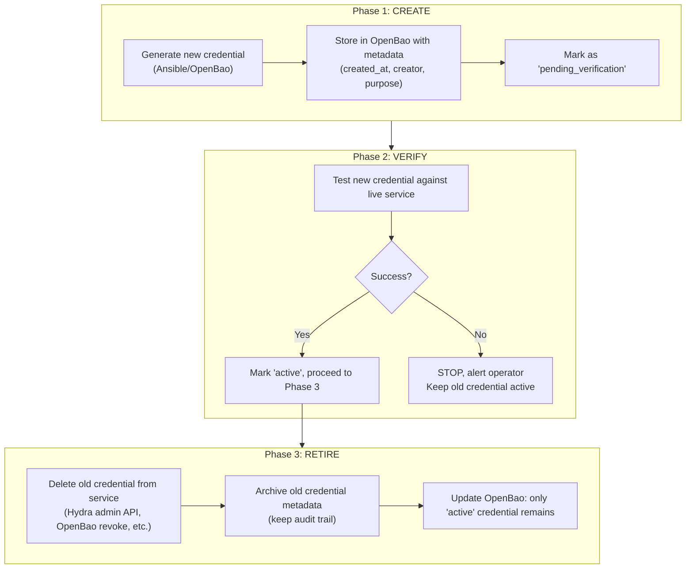

# Credential Lifecycle Governance

**Date:** 2026-04-05 (governance extracted 2026-05-07)
**Status:** ACTIVE
**Context:** Defines mandatory credential lifecycle rules for the agent-cloud platform: creation, rotation, metadata, audit, and decommissioning. These governance standards apply regardless of implementation phase. Implementation details are in `plan/development/CREDENTIAL-LIFECYCLE-IMPLEMENTATION.md`.

---

## Design Principles

1. **Every credential has a lifecycle:** created → active → verified → retired → deleted
2. **Every credential has metadata:** created_at, creator, site, purpose, expiry
3. **Verify before retiring:** new credential must pass validation before old is deleted
4. **Per-site isolation:** compromise of one site's credentials doesn't affect others
5. **OpenBao is the sole authority:** no credentials managed outside OpenBao
6. **Automation over manual:** rotation, cleanup, and auditing are scheduled playbooks

---

## Composable Vault Paths (Multi-Site Ready)

The path structure is driven by a **`vault_secret_prefix`** inventory variable defined in **site-config**. This keeps agent-cloud site-agnostic and makes multi-site a configuration change, not a vault restructuring.

### How It Works

The `manage-secrets.yml` task constructs paths from the inventory variable:

```
secret/data/{{ vault_secret_prefix }}/{{ service_name }}
```

Site-config's inventory controls the prefix per site:

```yaml
# site-config/inventory/production.yml
agent_cloud:
  vars:
    vault_secret_prefix: "services"    # single-site (current)

# Future: site-config/inventory/remote-site.yml
remote_agent_cloud:
  vars:
    vault_secret_prefix: "sites/remote-dc/services"
```

### Single-Site Layout (Current)

With `vault_secret_prefix: "services"`, paths remain exactly as they are today:

```
secret/
  services/                            # vault_secret_prefix = "services"
    netbox                             # All NetBox secrets
    nocodb                             # NocoDB secrets
    n8n                                # n8n secrets
    ssh/management                     # Central SSH key
    ssh/<service>                      # Per-service SSH keys
    approles/semaphore                 # Platform orchestrator credentials
    approles/orb-agent                 # Orb-agent credentials
    discovery/
      pfsense                          # host, api_key
      snmp_v3                          # username, auth_password, priv_password
```

### Multi-Site Layout (Future)

When a second site is added, its inventory sets a site-scoped prefix. The original site stays untouched — no path moves, no dual-write, no archive phase.

### Why Not a Hardcoded Path Hierarchy

- **Site identity is a site-config concern** — embedding site identifiers into agent-cloud leaks private topology into the public repo
- **No migration needed** — the current flat layout works as-is with `vault_secret_prefix: "services"`; multi-site is additive
- **Composable** — each site's inventory controls its own vault prefix
- **AppRole policies follow the same pattern** — scoped to `{{ vault_secret_prefix }}/*` per site

---

## Credential Types & TTL Requirements

| Credential Type | Required TTL | Rotation | Owner |
|----------------|-------------|----------|-------|
| AppRole token | 30m | Auto-renew | OpenBao |
| AppRole secret_id | **90 days** | Scheduled playbook | Ansible |
| AppRole token_num_uses | **25** | Per-token | OpenBao |
| Diode OAuth2 client | **90 days** | Create→Verify→Retire | Ansible |
| Postgres password (static) | **Migrate to dynamic** | On-demand (1h lease) | OpenBao DB engine |
| SSH keys | 1 year | Annual rotation playbook | Ansible |
| SNMP community (v2c) | Until SNMPv3 migration | — | Manual |
| SNMPv3 credentials | 180 days | Scheduled | Ansible |
| pfSense API key | 180 days | Manual + store in OpenBao | Operator |
| OpenBao root token | **Rotate after setup** | One-time | Operator |

**Documented exception:** The Semaphore orchestrator AppRole uses unlimited TTL (`secret_id_ttl: 0`, `token_num_uses: 0`) because it requires broad cross-service access and runs in an isolated runner environment. This exception is compensated by Semaphore's own access controls and audit logging.

---

## Rotation Pattern: Create → Verify → Retire

All credential rotations follow this three-phase pattern:



**Critical rule:** Never delete the old credential before the new one is verified working.

---

## Credential Metadata Standard

Every secret stored by `manage-secrets.yml` must carry KV v2 custom metadata:

```json
{
  "created_at": "2026-04-05T12:00:00Z",
  "creator": "deploy-netbox.yml",
  "site": "{{ site_name }}",
  "purpose": "NetBox Postgres password",
  "rotation_schedule": "dynamic-1h"
}
```

Required fields: `created_at`, `creator`, `site`, `purpose`, `rotation_schedule`.

---

## Audit Requirements

- **Audit logging must be enabled** on OpenBao (file audit backend piped to observability stack)
- **Required alert conditions:**
  - Same secret read >10x in 1 minute (potential exfiltration)
  - Secret access from unknown AppRole
  - Failed authentication attempts
- **Weekly credential inventory** — scheduled playbook lists all credentials with ages, flags stale (>30 days unused), expired, or orphaned credentials

---

## Decommissioning Security Requirements

When decommissioning a site or service:

1. All scoped credentials must be revoked before decommissioning completes
2. Credential data must be archived for **90 days** before permanent deletion (audit trail requirement)
3. All services must be stopped before credential revocation begins
4. AppRole secret_ids scoped to the site/service must be explicitly revoked

---

## Cross-References

- `plan/development/CREDENTIAL-LIFECYCLE-IMPLEMENTATION.md` — implementation phases and playbook specs
- `plan/development/APPROLE-TTL-ENFORCEMENT-PLAN.md` — specific plan for Phase 3 (AppRole TTLs)
- `plan/architecture/ACCESS-BOUNDARIES.md` — who can access credentials and through which path
- `plan/architecture/SECURITY-TESTING-STANDARDS.md` — credential leak prevention in code
- `plan/architecture/AUTOMATION-COMPOSABILITY.md` — composable secret management pattern
