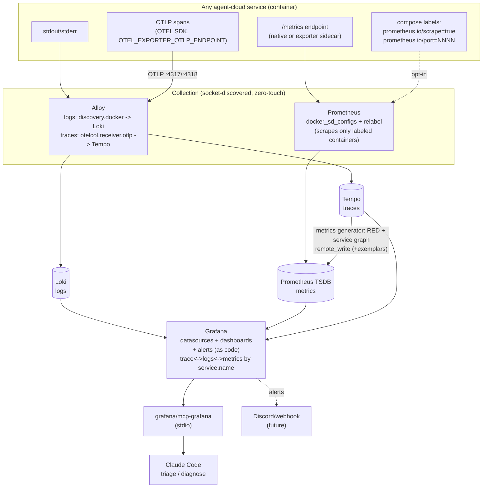
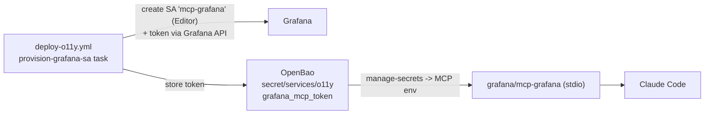

# Observability Instrumentation Standard

> **Location:** `plan/architecture/OBSERVABILITY-INSTRUMENTATION.md`
> **Date:** 2026-06-14 · **Status:** PROPOSED · **Owner:** uhstray-io
>
> **Context:** The o11y stack (Grafana + Prometheus + Loki + Alloy — `O11Y-DEPLOYMENT.md`) is deployed, and **logs are already zero-touch**: Alloy discovers every container over the podman/docker socket and ships stdout/stderr to Loki labeled by container name (`config.alloy`). But **metrics, dashboards, and alerts are opt-in and mostly absent** — Prometheus today scrapes only itself (`prometheus.yml`), no per-service dashboards exist beyond one overview, and there are no alerts. So a newly-added service lands **observability-blind for metrics** and is triaged ad-hoc (`podman logs`). This document defines a **reusable instrumentation contract** every service satisfies on onboarding, plus the **Grafana MCP** triage workflow, so any service can be diagnosed conversationally and consistently.
>
> **For agentic workers:** This is a standard + process, not a one-shot build. The centerpiece is the **metrics auto-discovery** mechanism (Phase 1) that makes metrics as zero-touch as logs. Extend the "Adding a New Service" checklist (root `CLAUDE.md`, `SERVICE-INTEGRATION-PLAN.md`) with the contract here — that is what makes it repeatable.

**Goal:** Every service added to agent-cloud is automatically diagnosable through Grafana (logs, metrics, health, dashboards, alerts) and triageable via the **Grafana MCP** — with no bespoke per-service plumbing beyond declaring intent in the service's compose file.

**Architecture:** Three signal paths converge on Grafana and are exposed to Claude through the Grafana MCP. **Logs** auto-flow via Alloy's socket discovery (already live). **Metrics** become equally zero-touch via Prometheus socket service-discovery + relabel — a service opts in with two compose labels (`prometheus.io/scrape`, `prometheus.io/port`), and datastores without native metrics get a standard exporter sidecar. **Traces** flow OTLP into the *same Alloy* (a traces pipeline added alongside the logs one) and on to **Grafana Tempo**; Tempo's metrics-generator derives RED span metrics + service-graph topology back into Prometheus, so even un-instrumented call paths get request/error/latency signal. A **generic, templated "Service Overview" dashboard** covers any service by label; bespoke dashboards and alerts are provisioned as code. The Grafana **service-account token** is provisioned through Ansible into OpenBao (no ad-hoc API calls), and the MCP reads it. `service.name` is the single correlation key joining logs↔metrics↔traces.

**Tech stack:** Grafana 11 (+ provisioning: datasources, dashboards, alerting), Prometheus (`docker_sd_configs` over the podman socket; `--web.enable-remote-write-receiver` for Tempo), Loki + Alloy (live; Alloy gains a traces pipeline), **Grafana Tempo** (monolithic `-target=all`, local filesystem → MinIO/S3 for prod), `grafana/mcp-grafana` (stdio MCP), standard exporters (postgres/redis/mysqld/node/cadvisor), OTEL SDKs, composable Ansible + OpenBao.

---

## Problem

| # | Gap | Evidence | Impact |
|---|-----|----------|--------|
| 1 | **Metrics are opt-in & absent** | `prometheus.yml` scrapes only `localhost:9090`; Phase 2 targets are commented out | New services have no metrics, no RED/USE signals, no resource visibility |
| 2 | **No per-service dashboards** | only `agent-cloud-overview.json` provisioned | No at-a-glance health per service; triage is manual |
| 3 | **No alerts** | no `provisioning/alerting/` | Failures are noticed by humans, not surfaced |
| 4 | **Triage is ad-hoc** | `podman logs <name>` by hand | No consistent, queryable, conversational diagnosis path |
| 5 | **No instrumentation step in onboarding** | "Adding a New Service" (CLAUDE.md) has no observability item | Each service reinvents (or skips) observability |
| 6 | **MCP not wired** | Grafana MCP absent from MCP config | Claude can't query the telemetry it needs to triage |

Logs are the one pillar that already works for free — the model to replicate, not rebuild.

---

## Design Principles

1. **Zero-touch by default, opt-in by declaration.** Logs need nothing (Alloy). Metrics need only two **compose labels** — discovery + relabel does the rest, exactly mirroring how Alloy labels logs. No `prometheus.yml` edit per service.
2. **One generic dashboard covers everyone; bespoke is additive.** A templated "Service Overview" (variable = `service`/`container`) gives every service log-rate/error-rate/restarts/resource panels immediately; services add a bespoke dashboard only when they need depth.
3. **Everything as code.** Datasources, dashboards, alerts, and the MCP service-account token are provisioned/declared in the repo — never clicked in the UI or created by ad-hoc API calls (root `CLAUDE.md` → *Policy and Configuration Changes — Code Only*).
4. **Consistent label taxonomy.** `service`, `component`, `cluster`, `env` on every signal so logs↔metrics↔alerts correlate and the MCP can pivot across them.
5. **The MCP is the triage interface, not a data store.** It reads Loki/Prometheus/dashboards/alerts; all truth stays in the stack. Token is least-privilege and OpenBao-managed.
6. **Same contract local↔prod.** The instrumentation a service ships is environment-agnostic; only scrape endpoints/labels differ by inventory (no forks).

---

## Architecture

Two collection paths feed Grafana; Claude triages through the MCP over stdio.



### Why socket discovery for metrics (the centerpiece)

Alloy already proves the pattern for logs: it lists every container over the podman socket (docker-API compatible) and labels each line. Prometheus has the identical capability — `docker_sd_configs` — so it can discover the same containers and, via `relabel_configs`, **scrape only those that opt in** with a label. A new service then needs **no Prometheus config change**: it sets two labels in its compose file and Prometheus picks it up on the next discovery refresh. This is the foundational fix for Problem #1 — metrics become as zero-touch as logs.

```yaml
# prometheus.yml — the reusable auto-discovery job (replaces per-service static_configs)
scrape_configs:
  - job_name: agent-cloud-containers
    docker_sd_configs:
      - host: unix:///var/run/docker.sock
        refresh_interval: 30s
    relabel_configs:
      # only scrape containers that opted in
      - source_labels: [__meta_docker_container_label_prometheus_io_scrape]
        regex: "true"
        action: keep
      # use the container's declared metrics port
      - source_labels: [__meta_docker_container_label_prometheus_io_port,
                        __meta_docker_container_ip]
        regex: "(.+);(.+)"
        replacement: "$2:$1"
        target_label: __address__
      # optional custom path (default /metrics)
      - source_labels: [__meta_docker_container_label_prometheus_io_path]
        regex: "(.+)"
        target_label: __metrics_path__
      # taxonomy: service + component labels from the container name
      - source_labels: [__meta_docker_container_label_com_docker_compose_service]
        target_label: component
      - source_labels: [__meta_docker_container_name]
        regex: "/?(.*)"
        target_label: service
```

```yaml
# any service's compose.yml — opt into metrics with two labels:
services:
  myservice:
    labels:
      prometheus.io/scrape: "true"
      prometheus.io/port: "8080"
      # prometheus.io/path: "/metrics"   # optional, defaults to /metrics
```

---

## Tracing (Tempo) — the third pillar

Traces answer "where did the latency/error happen across services?" — the question logs and metrics can't. Grafana **Tempo** is the backend; it "only requires object storage to operate" and runs as a single binary for our scale.

### Deployment — monolithic Tempo, no Kafka

Run `grafana/tempo` in **monolithic mode** (`-target=all`) — all components (distributor/ingester/querier/compactor/metrics-generator) in one process, **no Kafka** (Kafka is only required for *microservices* mode as of Tempo v3.0). Storage is the local filesystem locally, MinIO/S3 in prod — a single config param, no fork (matches the compose-overlay convention).

```yaml
# platform/services/tempo/deployment/compose.yml (sketch) — local tier
services:
  tempo:
    image: docker.io/grafana/tempo:${TEMPO_VERSION:-2.7.0}   # pin at deploy
    command: ["-target=all", "-config.file=/etc/tempo.yaml"]
    volumes:
      - ./config/tempo.yaml:/etc/tempo.yaml:ro
      - tempo-data:/var/tempo
    ports:
      - "${TEMPO_BIND:-127.0.0.1}:${TEMPO_API_PORT:-3200}:3200"   # API (loopback debug)
    networks: [o11y]
volumes:
  tempo-data:
```

```yaml
# config/tempo.yaml — minimal; storage.trace.backend swaps local<->s3 by env/overlay
server: { http_listen_port: 3200 }
distributor:
  receivers:
    otlp:
      protocols:
        grpc: { endpoint: "0.0.0.0:4317" }   # 0.0.0.0 so Alloy/other hosts reach it
        http: { endpoint: "0.0.0.0:4318" }
storage:
  trace:
    backend: local                  # prod: s3 (MinIO) — bucket/endpoint/creds from OpenBao
    wal:   { path: /var/tempo/wal }
    local: { path: /var/tempo/blocks }
metrics_generator:
  storage:
    path: /var/tempo/generator/wal
    remote_write:
      - url: http://prometheus:9090/api/v1/write
        send_exemplars: true
compactor:
  compaction:
    block_retention: 336h           # 14d trace TTL (tune)
overrides:
  defaults:
    metrics_generator:
      processors: ["span-metrics", "service-graphs"]
usage_report: { reporting_enabled: false }
```

### Ingestion — reuse the existing Alloy (add a traces pipeline)

We already run Alloy for logs; **add three River blocks to the same `config.alloy`** — the logs pipeline (`discovery.docker`/`loki.write`) is untouched. Services send OTLP to Alloy; Alloy batches and forwards to Tempo. (A standalone OTel Collector is the alternative, but a second collector is needless when Alloy is already here.)

```alloy
// traces pipeline — additive to the existing logs config
otelcol.receiver.otlp "default" {
  grpc { endpoint = "0.0.0.0:4317" }
  http { endpoint = "0.0.0.0:4318" }
  output { traces = [otelcol.processor.batch.default.input] }
}
otelcol.processor.batch "default" {
  output { traces = [otelcol.exporter.otlp.tempo.input] }
}
otelcol.exporter.otlp "tempo" {
  client {
    endpoint = "tempo:4317"
    tls { insecure = true }   // in-network plaintext (local); prod uses step-ca TLS
  }
}
```

### Metrics from traces (triage gold, zero app work)

Tempo's **metrics-generator** derives RED metrics (`traces_spanmetrics_calls_total`, `traces_spanmetrics_latency_*`) and service-graph topology (`traces_service_graph_request_total`, `..._failed_total`, `..._server_seconds`) from ingested spans and `remote_write`s them to Prometheus. This gives per-service request/error/latency and the call graph **without instrumenting metrics in any app**. Prometheus must run with `--web.enable-remote-write-receiver` (+ `--enable-feature=exemplar-storage,native-histograms`); with `send_exemplars: true` you click a latency spike straight into the offending trace.

### Grafana datasource + correlation

Provision a Tempo datasource (`type: tempo`, `url: http://tempo:3200`) with `jsonData.serviceMap.datasourceUid: prometheus` (service-graph view), `tracesToLogsV2` → Loki, and `tracesToMetrics` → Prometheus. **`service.name` is the join key** across all three signals — set it consistently per service (`OTEL_SERVICE_NAME`) and align it with the Loki `service`/`job` label so trace→logs links resolve.

### Instrumentation

A service emits spans via an **OTEL SDK** (or zero-code auto-instrumentation: Java agent, Python `opentelemetry-instrument`, Node `--require @opentelemetry/auto-instrumentations-node/register`) with two env vars: `OTEL_EXPORTER_OTLP_ENDPOINT=http://o11y-alloy:4317` and `OTEL_SERVICE_NAME=<service>`. No spans → no trace cost; this is opt-in like metrics.

---

## The Service Observability Contract

Every service onboarded to agent-cloud **MUST** satisfy the *minimum* tier; the *full* tier is required for stateful/user-facing services.

### Minimum (every service)

| Requirement | How | Verify |
|-------------|-----|--------|
| **Logs to stdout/stderr** | 12-factor; no log files inside the container | line appears in Loki `{container="<name>"}` |
| **Healthcheck** | `healthcheck:` in compose (already a repo convention) | `podman ps` shows `(healthy)`; surfaced in overview dashboard |
| **Covered by the generic dashboard** | nothing — the templated "Service Overview" picks it up by `container` label | service selectable in the dashboard variable |
| **Consistent name** | `container_name`/compose `name` matches `service_name` inventory var | label correlation works |

### Full (stateful / user-facing services)

| Requirement | How | Verify |
|-------------|-----|--------|
| **Metrics exposed** | native `/metrics`, OR an **exporter sidecar** (see below) | target `UP` in Prometheus |
| **Opt-in labels** | `prometheus.io/scrape=true` + `prometheus.io/port` in compose | discovered + scraped |
| **Bespoke dashboard** | one dashboard JSON provisioned under `config/grafana/dashboards/<service>.json` | loads in Grafana |
| **At least one alert** | rule in `provisioning/alerting/<service>.yaml` (e.g. down, error-rate, saturation) | fires in test |
| **Traces (where it serves requests)** | OTEL SDK/auto-instrument → `OTEL_EXPORTER_OTLP_ENDPOINT=http://o11y-alloy:4317` + `OTEL_SERVICE_NAME=<service>` | spans in Tempo; node in the service graph |

### Standard exporter sidecars (services without native metrics)

| Backend | Exporter | Scrape port |
|---------|----------|-------------|
| PostgreSQL | `quay.io/prometheuscommunity/postgres-exporter` | 9187 |
| Redis | `oliver006/redis_exporter` | 9121 |
| MariaDB/MySQL | `prom/mysqld-exporter` | 9104 |
| Host / container resources | `node-exporter` + `cadvisor` (platform-wide, deploy once) | 9100 / 8080 |

Exporters ride in the service's compose file with the same two opt-in labels, so they're auto-discovered like everything else.

---

## Grafana MCP — triage workflow

### Connection (provisioned, not clicked)



- **Server:** `podman run --rm -i -e GRAFANA_URL -e GRAFANA_SERVICE_ACCOUNT_TOKEN grafana/mcp-grafana -t stdio`.
- **Auth:** a Grafana **service account** (`mcp-grafana`, Editor role — later narrowed to `dashboards:read`, `datasources:query`, `alert.rules:read`) with a token. The token is created **idempotently by Ansible** (a `provision-grafana-sa` task folded into `deploy-o11y.yml`) and stored at `secret/services/o11y` → `grafana_mcp_token`; the MCP config reads it. **No ad-hoc token clicks/API calls** — this honors the code-only configuration rule (the one-time local connect below is the scoped exception, with this task as its foundational follow-up).
- **Client config:** user-scope MCP (`claude mcp add grafana -- podman run …`) or a project `.mcp.json`. Tools become callable after a session reload.

### MCP capabilities used for triage

Querying Prometheus (metrics) and Loki (logs) via their datasource UIDs (`prometheus`, `loki`), dashboard search, and alert-rule listing — i.e. the MCP turns "why is erpnext unhealthy?" into Loki/Prometheus queries against the live stack.

### Reusable triage loop (per service)

1. **Health** — is the container up/healthy? (overview dashboard / `podman ps` mirror)
2. **Logs** — `{container="<svc>"} |= "error"` over the incident window via Loki.
3. **Metrics** — restarts, error rate, saturation (CPU/mem via cadvisor; backend-specific via exporter).
4. **Correlate** — pivot logs↔metrics on the shared `service`/`component` labels.
5. **Dashboard/alert** — open the service dashboard; check firing alerts.

---

## Implementation Phases

### Phase 0 — Connect the MCP + generic dashboard *(now)*

- Provision the `mcp-grafana` service account + token (one-time API for the live local connect; encode as the `provision-grafana-sa` Ansible task immediately after).
- Wire the Grafana MCP into the MCP config (podman stdio, token from OpenBao/env).
- Add a templated **Service Overview** dashboard (`config/grafana/dashboards/service-overview.json`) with a `service` variable: panels for log volume, error-log rate, restarts, healthy state, and (when present) CPU/mem.
- **Acceptance:** MCP lists datasources + dashboards; a Loki query for any running service returns logs; overview dashboard renders for each container.

### Phase 1 — Metrics auto-discovery *(the centerpiece)*

- Replace `prometheus.yml`'s static job with the `docker_sd_configs` + relabel job above; wire a Prometheus reload (`POST /-/reload`) into `deploy-o11y.yml`.
- Document the two opt-in labels in the service contract; add them to the "Adding a New Service" checklist.
- Pilot on one service that already exposes metrics (e.g. Caddy's metrics listener, n8n).
- **Acceptance:** adding the two labels to a service makes it appear as a Prometheus target with **no `prometheus.yml` change**.

### Phase 2 — Exporters for datastores

- Add exporter sidecars (postgres/redis/mariadb) + the two labels to stateful services (authentik PG, erpnext MariaDB, netbox PG, n8n PG). Deploy `node-exporter` + `cadvisor` platform-wide once.
- **Acceptance:** DB/cache metrics + host/container resource metrics visible in Grafana.

### Phase 3 — Dashboards + alerts as code

- Per-service dashboards under `config/grafana/dashboards/<service>.json`; alert rules under `provisioning/alerting/<service>.yaml` (service-down, error-rate, saturation). Wire a notification channel (Discord webhook — secret in OpenBao).
- **Acceptance:** kill a service → alert fires → notification delivered.

### Phase 4 — Distributed tracing (Tempo)

- New composable service `platform/services/tempo/` (compose + `config/tempo.yaml` + deploy.sh + `deploy-tempo.yml`), monolithic `-target=all`, `storage.trace.backend: local`; add the three traces blocks to `config.alloy` (otlp receiver → batch → otlp exporter to `tempo:4317`); add `--web.enable-remote-write-receiver` + `--enable-feature=exemplar-storage,native-histograms` to Prometheus; provision the Tempo datasource with `serviceMap` + `tracesToLogsV2`/`tracesToMetrics` correlation.
- Instrument a first service (e.g. erpnext or a sample app) via OTEL env vars; verify spans land and the metrics-generator emits RED + service-graph metrics.
- **Acceptance:** a request trace is visible end-to-end in Grafana; the service graph renders; a latency exemplar opens the trace; trace→logs jumps to Loki by `service.name`.

### Phase 5 — Prod promotion + audit log

- Promote logs/metrics/traces to prod inventory (scrape/OTLP over the prod network; Tempo `storage.trace.backend: s3` against MinIO with creds from OpenBao; prod Grafana SA token in OpenBao). Tail the OpenBao audit log into Loki.
- **Acceptance:** prod services self-instrument identically via inventory vars; no forked config (local↔prod differ only by the storage-backend param + endpoints).

---

## Validation Criteria

| Check | Signal | Pass |
|-------|--------|------|
| Logs zero-touch | new container's lines in Loki | present within seconds, labeled |
| Metrics opt-in | add 2 labels, no prom edit | target `UP` after refresh |
| Generic dashboard | open Service Overview | every running service selectable |
| MCP connected | `claude mcp list` | grafana ✔ connected |
| MCP triage | ask "errors in <svc>?" | MCP returns Loki results |
| Exporters | DB/cache metrics | panels populated |
| Traces (P4) | instrument a service | span in Tempo + node in service graph |
| Trace correlation | click a span | jumps to Loki logs by `service.name` |
| Alerts | stop a service | alert fires + notifies |
| Onboarding | new service PR | observability checklist item satisfied |

---

## Security Considerations

- **MCP token least-privilege** — start with Editor for convenience, narrow to `dashboards:read` + `datasources:query` + `alert.rules:read`. Token is OpenBao-managed (`secret/services/o11y` → `grafana_mcp_token`), `no_log` on the provisioning task, never committed.
- **Socket exposure** — Prometheus/Alloy read the podman socket (read-only API use). Same trust surface already accepted for Alloy; no new privilege.
- **Metrics endpoints bind in-network** — `/metrics` and exporters are reachable only on the service network (not published to loopback unless debugging), and Grafana sits behind Caddy (TLS) + Authentik (forward_auth) per the SSO work.
- **No telemetry to third parties** — `GF_ANALYTICS_*` already disabled; self-hosted only (privacy-focused posture).
- **Label hygiene** — never put secrets/PII in labels or metric names (high-cardinality + exposed in queries).

---

## Cross-references

- `plan/development/O11Y-DEPLOYMENT.md` — the Grafana/Prometheus/Loki/Alloy stack this instruments (Phase 2 metrics/OTLP hooks referenced here)
- `plan/architecture/SERVICE-INTEGRATION-PLAN.md` — the onboarding checklist this extends (add the Observability Contract step)
- root `CLAUDE.md` → *Adding a New Service* — add "instrument observability (OBSERVABILITY-INSTRUMENTATION.md)" as a step
- `plan/architecture/CI-TESTING-SPECIFICATION.md` — testing standard this parallels for observability
- `plan/development/AUTH-SSO-DEPLOYMENT.md` — Grafana behind Caddy + Authentik (the network/identity gate for the MCP's Grafana access)
- Grafana MCP — https://grafana.com/docs/grafana/latest/developer-resources/mcp/ · image `grafana/mcp-grafana`
- Grafana Tempo (accessed 2026-06-14) — overview https://grafana.com/docs/tempo/latest/ · setup https://grafana.com/docs/tempo/latest/set-up-for-tracing/setup-tempo/ · config https://grafana.com/docs/tempo/latest/configuration/ · Alloy collector https://grafana.com/docs/tempo/latest/set-up-for-tracing/instrument-send/set-up-collector/grafana-alloy/ · OTel collector https://grafana.com/docs/tempo/latest/set-up-for-tracing/instrument-send/set-up-collector/otel-collector/ · OTLP https://grafana.com/docs/grafana-cloud/send-data/otlp/

> **Unverified against a live fetch:** the metrics-generator **span-metric** exact names (`traces_spanmetrics_calls_total`, `traces_spanmetrics_latency_*`) are the Tempo standard but those doc pages 404'd during research — confirm against the deployed version's `metrics-from-traces/span-metrics/` page. Service-graph metric names are doc-verified. Pin the current stable `grafana/tempo` tag at deploy.

---

## Revision History

| Date | Summary |
|------|---------|
| 2026-06-14 | Initial draft — instrumentation contract, socket-SD metrics auto-discovery, Grafana MCP triage workflow, phased rollout. |
| 2026-06-14 | Added the tracing pillar — Tempo (monolithic, local→MinIO), OTLP via the existing Alloy, metrics-generator RED/service-graph, trace↔logs↔metrics correlation by `service.name`; Phase 4 (tracing) + Phase 5 (prod). |
