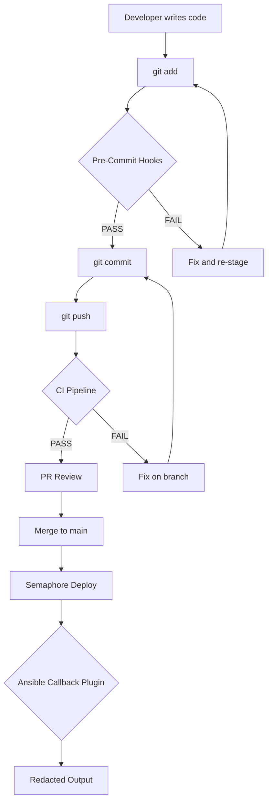
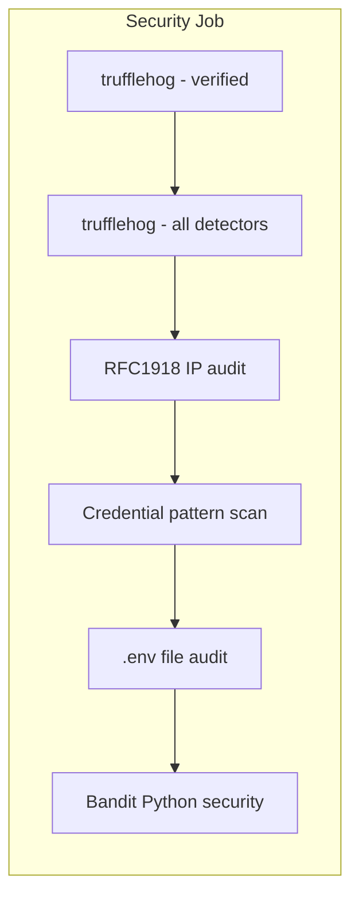
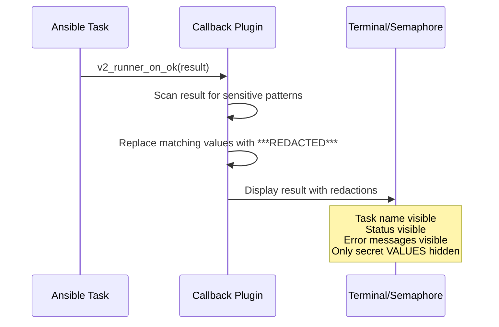
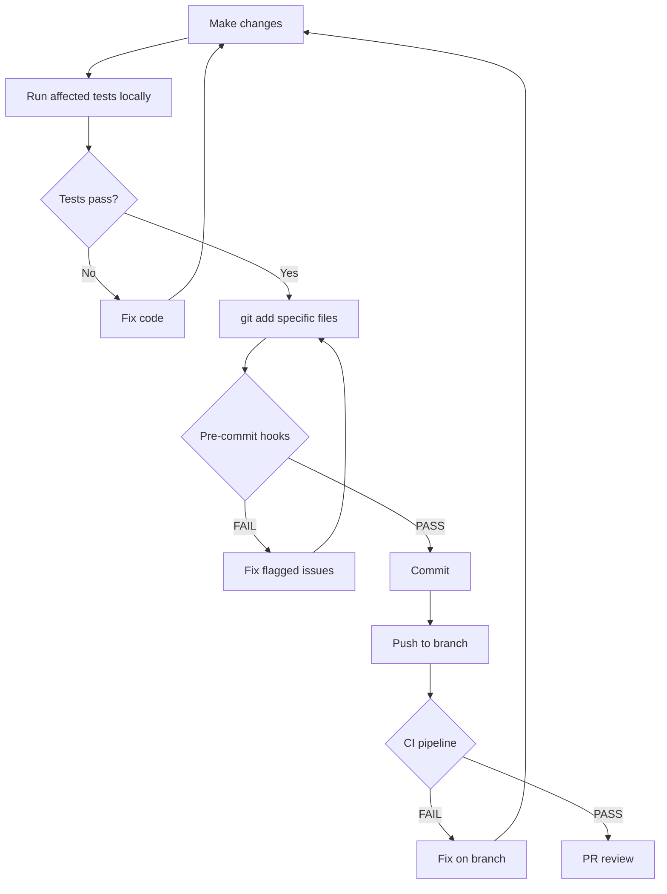

# Security Testing Standards

**Date:** 2026-05-06
**Status:** ACTIVE
**Scope:** All code, playbooks, templates, and configuration in agent-cloud

---

## Overview

This document defines mandatory security testing requirements for every change to agent-cloud. These standards address three categories of risk:

1. **Credential leakage** -- secrets, tokens, passwords committed to the public repo
2. **Infrastructure exposure** -- private IPs, hostnames, or network topology in committed files
3. **Ansible output leakage** -- sensitive values printed to Semaphore logs or terminal output

All three categories are covered by automated gates: pre-commit hooks (local), CI pipeline (GitHub Actions), and Ansible callback plugin (runtime).



---

## 1. Pre-Commit Hooks (Mandatory)

Pre-commit hooks are the first line of defense. They run automatically on every `git commit` and block commits that contain sensitive content.

**Configuration:** `.pre-commit-config.yaml` in the repo root.

**Installation (one-time):**
```bash
pip install pre-commit
pre-commit install
```

### Required Hooks

| Hook | Purpose | Blocks Commit? |
|------|---------|----------------|
| trufflehog | Scan staged changes for secrets (API keys, tokens, PEM content, JWTs) | Yes |
| RFC1918 IP scan | Detect private IP addresses (192.168.x, 10.x, 172.16-31.x) | Yes |
| Credential pattern scan | Detect `password=`, `secret_id=`, `token=` with real values | Yes |
| .env file guard | Prevent staging non-example .env files | Yes |

### trufflehog Local Configuration

Local scans run **without** `--only-verified`. This catches potential secrets even when verification endpoints are unreachable from developer machines. The CI pipeline runs both verified and unverified scans.

### IP Address Patterns

The pre-commit hook scans for all RFC1918 ranges:

```
192.168.0.0/16    (192\.168\.\d+\.\d+)
10.0.0.0/8        (10\.\d+\.\d+\.\d+)
172.16.0.0/12     (172\.(1[6-9]|2\d|3[01])\.\d+\.\d+)
```

Exceptions (do not trigger):
- Lines containing `target`, `host:`, `subnet`, `scope`, `example`, `0\.0\.0\.0`, `127\.0\.0\.1`
- Lines inside Jinja2 template variable blocks (`{{ }}`)
- CIDR documentation examples explicitly marked as such

### Credential Patterns

| Pattern | Example Match | Risk |
|---------|---------------|------|
| `password\s*[:=]\s*[A-Za-z0-9]{8,}` | `password=RealValue123` | Hardcoded password |
| `secret_id\s*[:=]\s*[a-f0-9-]{30,}` | `secret_id=abc123-def456...` | OpenBao secret ID |
| `token\s*[:=]\s*[A-Za-z0-9_-]{20,}` | `token=ghp_xxxxxxxxxxxx` | API token |
| `api_key\s*[:=]\s*[A-Za-z0-9_-]{16,}` | `api_key=sk-ant-xxxxx` | API key |
| `private_key\s*[:=]` | PEM content | SSH/TLS key material |
| `BEGIN (RSA|EC|OPENSSH) PRIVATE KEY` | PEM block headers | Private key file |
| `bearer\s+[A-Za-z0-9_-]{20,}` | `Bearer eyJhbGci...` | JWT/bearer token |
| `client_secret\s*[:=]\s*\S{8,}` | `client_secret=xyz123...` | OAuth client secret |

### .env File Guard

Only files matching `*.env.example`, `*.env.template`, or `*.env.j2` may be staged. Any other `.env` file triggers a block.

Known historical issue: commit `aecd47d` added a `.env` file to git history. This has been removed from the working tree but persists in history. Consider `git filter-repo` or BFG Repo-Cleaner if the content contains real credentials.

---

## 2. CI Security Checks

The GitHub Actions pipeline (`.github/workflows/lint-and-test.yml`) provides a second layer of defense on every PR to main.



### trufflehog Configuration

Two scan steps in CI:

1. **Verified scan** -- `--only-verified` flag confirms secrets are live. Catches actively dangerous leaks.
2. **All-detectors scan** -- No `--only-verified` flag. Catches potential secrets even if verification fails. Runs against the diff between the PR branch and main.

### Expanded IP Audit

The CI pipeline scans for all RFC1918 ranges, not just `192.168.x`:

```bash
# All RFC1918 private ranges
! git diff origin/main...HEAD \
  | grep -iE '^\+.*(192\.168\.[0-9]+\.[0-9]+|10\.[0-9]+\.[0-9]+\.[0-9]+|172\.(1[6-9]|2[0-9]|3[01])\.[0-9]+\.[0-9]+)' \
  | grep -v 'target\|host:\|subnet\|scope\|example\|0\.0\.0\.0\|127\.0\.0\.1'
```

### Jinja2 Template Content Validation

CI validates that Jinja2 templates (`.j2` files) do not contain hardcoded values where template variables are expected. Specifically:

- No hardcoded IPs in `.j2` files (must use `{{ variables }}`)
- No hardcoded passwords or tokens in `.j2` files
- All `.j2` files should reference `{{ secrets.* }}` or inventory variables, never literals

Known issue: `agent.yaml.j2` contains hardcoded `192.168.1.0/24` on lines 47 and 107. This must be replaced with a template variable sourced from site-config inventory.

### .env File Audit

CI verifies no non-example `.env` files are tracked in git:

```bash
# Fail if any .env files (excluding examples/templates) are tracked
! git ls-files '*.env' ':!:*.env.example' ':!:*.env.template'
```

---

## 3. Credential Redaction in Ansible (Callback Plugin)

### The Problem

Ansible's `no_log: true` directive suppresses ALL output from a task, including the task name, status, and error messages. This makes debugging impossible when a task fails -- operators see `CENSORED` with no context.

There are currently 41 instances of `no_log: true` across playbooks. This is the wrong tool for the job.

### The Solution: Callback Plugin

A custom Ansible callback plugin (`redact_secrets.py`) intercepts task results and replaces sensitive values with `***REDACTED***` while preserving all other output (task names, status, error messages, non-sensitive data).



### How It Works

1. The plugin maintains a list of variable name patterns known to contain secrets
2. On every task completion (`v2_runner_on_ok`, `v2_runner_on_failed`), it scans the result dictionary
3. Values matching sensitive variable names are replaced with `***REDACTED***`
4. The actual values remain in Ansible memory for use by subsequent tasks
5. Only the display output is affected -- task execution is unchanged

### Variable Patterns to Redact

| Pattern | Matches | Source |
|---------|---------|--------|
| `*_token` | `client_token`, `api_token` | OpenBao auth responses |
| `*_secret*` | `secret_id`, `client_secret` | AppRole credentials |
| `*_password` | `db_password`, `redis_password` | Service credentials |
| `*_key` | `secret_key`, `django_key` | Encryption keys |
| `_bao_auth` | Full OpenBao auth response | manage-secrets, manage-approle |
| `_bao_existing` | Fetched secret data | manage-secrets |
| `_resolved` | Generated/fetched secrets dict | manage-secrets |
| `_admin_auth` | Admin OpenBao auth | manage-approle |
| `_new_role_id` | AppRole role ID | manage-approle |
| `_new_secret_id` | AppRole secret ID | manage-approle |
| `_orb_client_secret` | Diode credential | manage-diode-credentials |
| `_new_creds` | Raw credential response | manage-diode-credentials |
| `_bao_role_id` | Input variable | All vault tasks |
| `_bao_secret_id` | Input variable | All vault tasks |
| `role_id` | Body field | AppRole login |
| `secret_id` | Body field | AppRole login |
| `X-Vault-Token` | Header | All vault API calls |

### Configuration

```ini
# ansible.cfg
[defaults]
callback_plugins = ./callback_plugins
stdout_callback = redact_secrets
```

### Benefits Over no_log

| Aspect | `no_log: true` | Callback Plugin |
|--------|----------------|-----------------|
| Task name visible | No (shows CENSORED) | Yes |
| Error messages visible | No | Yes (with redacted values) |
| Debugging failed tasks | Impossible | Full context available |
| Covers all tasks | Must annotate each one | Automatic for all tasks |
| New secrets auto-covered | No (must add no_log) | Yes (pattern-based) |
| Audit trail | None | Clear redaction markers |

See `plan/development/ANSIBLE-CREDENTIAL-REDACTION-PLAN.md` for the full implementation plan.

---

## 4. Testing Before Commit

Every change must pass through this sequence before being committed:



### Local Test Requirements

| Change Type | Required Tests |
|-------------|---------------|
| Python worker code | `pytest platform/services/netbox/deployment/tests/ -v` |
| Bash library code | `bats platform/tests/` |
| Ansible playbooks | `ansible-lint platform/playbooks/` |
| Jinja2 templates | Manual review for hardcoded values + `ansible-lint` |
| Shell scripts | `shellcheck <script>` |
| HCL policies | `terraform fmt -check <file>` |

### Jinja2 Template Review Checklist

For any `.j2` file change, manually verify:

- [ ] No hardcoded IP addresses (use inventory variables)
- [ ] No hardcoded passwords/tokens (use `{{ secrets.* }}`)
- [ ] No hardcoded hostnames (use inventory variables)
- [ ] No hardcoded port numbers that should be configurable
- [ ] Template variables reference documented source (secrets dict, inventory, facts)

---

## 5. Comprehensive Credential Pattern Reference

### Patterns That Must Never Appear in Committed Code

| Category | Pattern (Regex) | Description |
|----------|----------------|-------------|
| **IP Addresses** | `192\.168\.\d+\.\d+` | RFC1918 Class C |
| | `10\.\d+\.\d+\.\d+` | RFC1918 Class A |
| | `172\.(1[6-9]\|2\d\|3[01])\.\d+\.\d+` | RFC1918 Class B |
| **Passwords** | `password\s*[:=]\s*[A-Za-z0-9!@#$%^&*]{8,}` | Hardcoded password |
| | `passwd\s*[:=]\s*\S{8,}` | Alternate password field |
| **Tokens** | `token\s*[:=]\s*[A-Za-z0-9_.-]{20,}` | Generic token |
| | `ghp_[A-Za-z0-9]{36}` | GitHub PAT |
| | `gho_[A-Za-z0-9]{36}` | GitHub OAuth |
| | `glpat-[A-Za-z0-9_-]{20,}` | GitLab PAT |
| **API Keys** | `api[_-]?key\s*[:=]\s*[A-Za-z0-9_-]{16,}` | Generic API key |
| | `sk-[A-Za-z0-9]{32,}` | OpenAI/Anthropic key prefix |
| | `xox[bpras]-[A-Za-z0-9-]{10,}` | Slack tokens |
| **Secrets** | `secret[_-]?id\s*[:=]\s*[a-f0-9-]{30,}` | OpenBao/Vault secret ID |
| | `client[_-]?secret\s*[:=]\s*\S{8,}` | OAuth client secret |
| | `secret[_-]?key\s*[:=]\s*\S{16,}` | Generic secret key |
| **Cryptographic** | `BEGIN (RSA\|EC\|OPENSSH\|DSA) PRIVATE KEY` | PEM private key headers |
| | `BEGIN CERTIFICATE` | TLS certificate (may contain private info) |
| **Auth Headers** | `[Bb]earer\s+[A-Za-z0-9_.-]{20,}` | JWT/Bearer tokens |
| | `[Bb]asic\s+[A-Za-z0-9+/=]{20,}` | Base64 basic auth |
| **Infrastructure** | `[a-z0-9]+\.uhstray\.io` | Internal hostnames |
| | `role_id\s*[:=]\s*[a-f0-9-]{30,}` | AppRole role ID |

### Allowed Patterns (False Positive Exclusions)

| Pattern | Why Allowed |
|---------|-------------|
| `{{ variable_name }}` | Jinja2 template variables |
| `password: "{{ secrets.* }}"` | Template reference, not real value |
| `example`, `placeholder`, `changeme` | Documented placeholder values |
| `0.0.0.0`, `127.0.0.1`, `::1` | Loopback/bind addresses |
| `target`, `host:`, `subnet`, `scope` | Network documentation context |

---

## 6. New Service Testing Requirements

Before any new service is merged to main, it must pass all of the following:

### Security Gate Checklist

- [ ] **No hardcoded credentials** -- all secrets come from OpenBao via `manage-secrets.yml`
- [ ] **No hardcoded IPs** -- all addresses come from site-config inventory
- [ ] **Jinja2 templates only** -- `.env` files are generated, never committed
- [ ] **Pre-commit hooks pass** -- trufflehog, IP scan, credential scan, .env guard
- [ ] **CI pipeline passes** -- all security job steps green
- [ ] **deploy.sh is container-only** -- no secret generation, no OpenBao calls
- [ ] **AppRole is scoped** -- if the service needs vault access, it has its own AppRole with minimal policy
- [ ] **Templates reviewed** -- manual review of all `.j2` files for hardcoded values
- [ ] **Secret definitions documented** -- `_secret_definitions` and `_env_templates` are defined and complete
- [ ] **No `no_log: true`** -- credential redaction is handled by the callback plugin

### Template Validation

Every `.j2` template must be validated:

```bash
# Check for hardcoded IPs in templates
grep -rn '[0-9]\{1,3\}\.[0-9]\{1,3\}\.[0-9]\{1,3\}\.[0-9]\{1,3\}' platform/services/<name>/deployment/templates/

# Check for hardcoded credentials (non-template values)
grep -rn 'password\|secret\|token\|api_key' platform/services/<name>/deployment/templates/ \
  | grep -v '{{ '
```

---

## 7. no_log Policy

**`no_log: true` is BANNED from all playbooks and task files.**

Do not use `no_log: true` anywhere in the codebase. The Ansible credential redaction callback plugin handles all sensitive output masking. Using `no_log: true`:

- Hides error messages, making debugging impossible
- Requires manual annotation on every sensitive task (error-prone, easy to forget)
- Provides no indication of what was redacted or why
- Cannot be audited (output is simply suppressed)

### Migration

All 41 existing instances of `no_log: true` will be removed as part of the callback plugin rollout. The affected files are:

| File | Count |
|------|-------|
| `tasks/manage-secrets.yml` | 5 |
| `tasks/manage-diode-credentials.yml` | 4 |
| `tasks/manage-approle.yml` | 4 |
| `tasks/seed-discovery-credential.yml` | 4 |
| `tasks/update-vault-field.yml` | 2 |
| `tasks/apply-openbao-policy.yml` | 1 |
| `sync-secrets-to-openbao.yml` | 4 |
| `validate-secrets.yml` | 5 |
| `check-secrets.yml` | 2 |
| `deploy-orb-agent.yml` | 3 |
| `deploy-netbox.yml` | 1 |
| `distribute-ssh-keys.yml` | 1 |
| `harden-ssh.yml` | 1 |
| `update-proxmox-token.yml` | 1 |
| `apply-openbao-policies.yml` | 1 |
| `seed-discovery-credentials.yml` | 1 |
| `provision-template.yml` | 1 |

Removal will happen after the callback plugin is tested and deployed. See `plan/development/ANSIBLE-CREDENTIAL-REDACTION-PLAN.md`.

### Enforcement

A CI lint step will scan for `no_log: true` in all YAML files under `platform/playbooks/` and fail the build if any are found:

```bash
! grep -rn 'no_log:\s*true' platform/playbooks/ --include='*.yml'
```

This will be added to the CI pipeline after the callback plugin migration is complete.

---

## Revision History

| Date | Change |
|------|--------|
| 2026-05-06 | Initial version -- pre-commit hooks, CI expansion, callback plugin spec, no_log ban |
