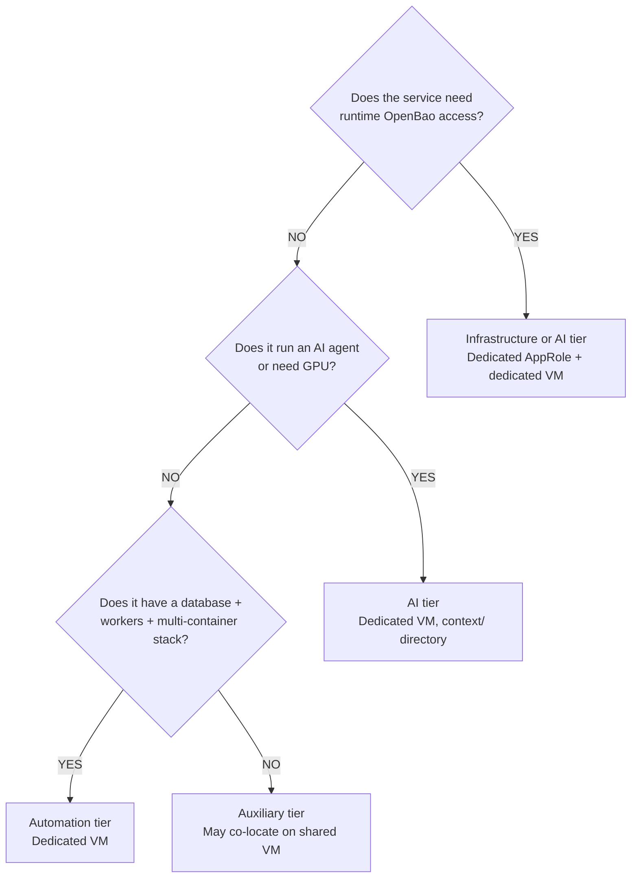
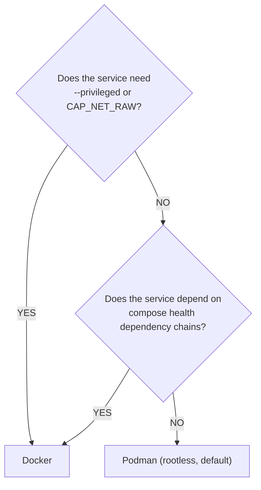

# Service Integration Plan

**Date:** 2026-04-22
**Status:** ACTIVE
**Contributors:** Architecture, Security, Automation, Infrastructure, DevOps review agents

**References:**
- [AUTOMATION-COMPOSABILITY.md](AUTOMATION-COMPOSABILITY.md) — Composable task library and deploy patterns
- [CREDENTIAL-LIFECYCLE-PLAN.md](CREDENTIAL-LIFECYCLE-PLAN.md) — Secret generation, storage, rotation
- [TESTING-AND-LINTING-PLAN.md](TESTING-AND-LINTING-PLAN.md) — CI/CD, linting, and testing requirements
- [BRANCH-TESTING-WORKFLOW.md](BRANCH-TESTING-WORKFLOW.md) — Branch deploy and validation workflow

---

## Purpose

This plan defines the standard process for integrating any new service into the agent-cloud platform. It ensures every service follows consistent patterns for deployment, credential management, testing, monitoring, and documentation — regardless of complexity.

---

## Service Classification

New services fall into one of four tiers, each with different integration weight:

| Tier | Examples | Integration Weight | Typical VM Size |
| ---- | -------- | ------------------ | --------------- |
| **Infrastructure** | OpenBao, Semaphore, NetBox, Caddy | Full (5-phase playbook, dedicated VM, AppRole if runtime vault access) | Small-Medium |
| **Automation** | n8n, NocoDB | Full (5-phase playbook, dedicated VM) | Medium |
| **AI/Agent** | NemoClaw, NetClaw, WisAI, WisBot | Full + agent context directory | Large (GPU for inference) |
| **Auxiliary** | Wiki.js, Postiz, Nextcloud, a2a-registry | Simplified (3-phase playbook, may co-locate on shared VM) | Small-Medium |
| **Website** | UhhCraft, future WebSmith-built sites | Full + signed SPEC in `context/spec/` (see §Sites Built via WebSmith below) | Medium-Large (depends on archetype) |

### Classification Decision



---

## Onboarding Checklist

### Phase 0: Planning

- [ ] Classify the service (infrastructure / automation / AI / auxiliary)
- [ ] Determine VM requirements: dedicated vs co-located, CPU/RAM/disk (see sizing table)
- [ ] Determine container runtime: Docker (privileged/health-deps) or Podman (default)
- [ ] Determine if runtime OpenBao access is needed (dedicated AppRole) or deploy-time only (Semaphore's AppRole)
- [ ] Identify all secrets the service needs (database passwords, API tokens, etc.)
- [ ] Identify the health check endpoint (URL + path + expected status code)

### Phase 1: Infrastructure Provisioning

- [ ] Allocate static IP and VMID in `site-config/proxmox/vm-specs.yml`
- [ ] Provision VM via Semaphore "Provision VM" template (clone VMID 9000, configure cloud-init)
- [ ] Install container runtime via "Install Docker" template (if Docker needed)
- [ ] Generate SSH key pair, store in OpenBao at `secret/services/ssh/<service>`
- [ ] Distribute SSH keys via "Distribute SSH Keys" template
- [ ] Verify SSH key auth works, then harden SSH via "Harden SSH" template

**Co-location exception:** Auxiliary-tier services may skip VM provisioning and deploy to an existing shared VM. Add the service to the existing host's inventory groups.

### Phase 2: Repository Setup

- [ ] Create `platform/services/<name>/deployment/` directory structure:
  ```text
  platform/services/<name>/
    deployment/
      deploy.sh            # Container lifecycle only (no secrets, no OpenBao)
      compose.yml          # Docker Compose service definitions
      templates/
        <name>.env.j2      # Jinja2 env file template(s)
      CLAUDE.md            # Service-specific operational reference
      README.md            # Quick-start deployment notes
  ```
- [ ] For AI/Agent tier, additionally create `context/` with skills, prompts, MCP configs
- [ ] Ensure `deploy.sh` is container-lifecycle only — no `gen_secret`, `put_secret`, `get_secret`, or OpenBao calls
- [ ] All secrets in Jinja2 templates use `{{ variable }}` references, never hardcoded values
- [ ] Add compose healthchecks on every container that supports them

### Phase 3: Credential Setup

- [ ] Define `_secret_definitions` list (each secret: name, type, length):
  - `random` — auto-generated passwords
  - `django` — extended charset (for Django SECRET_KEY etc.)
  - `user` — operator-managed, never auto-generated (external API keys, etc.)
- [ ] Define `_env_templates` list mapping Jinja2 sources to runtime destinations
- [ ] Secrets stored at `secret/data/services/<service_name>` in OpenBao
- [ ] If runtime vault access needed: provision AppRole via `tasks/manage-approle.yml`
  - Create least-privilege HCL policy at `platform/services/openbao/deployment/config/policies/<service>.hcl`
  - Scope to exactly the paths the service needs — no wildcards
  - Store AppRole credentials at `secret/data/services/approles/<service>`

**Decision: AppRole scope**

| Scenario | AppRole | Rationale |
| -------- | ------- | --------- |
| Deploy-time secrets only (DB password, API key injected via .env) | Semaphore's orchestrator | No runtime vault access needed |
| Service authenticates to OpenBao at runtime | Dedicated per-service | Blast radius isolation — compromised service can only read its own secrets |
| Agent that reads multiple services' secrets | Dedicated with enumerated paths | Never use `secret/data/services/*` wildcard for new services |

### Phase 4: Automation Setup

- [ ] Create `platform/playbooks/deploy-<service>.yml` following the composable pattern:

  ```text
  Phase 1: Clone repo + manage-secrets (fetch/generate → template .env)
  Phase 2: Run deploy.sh (container lifecycle)
  Phase 3: Application bootstrap (migrations, superuser creation — if needed)
  Phase 4: Runtime credential sync (if service creates runtime creds — if needed)
  Phase 5: Health verification (HTTP check against service_url + health_path)
  ```

- [ ] Create `platform/playbooks/clean-deploy-<service>.yml` using `tasks/clean-service.yml`
- [ ] Add service to `validate-all.yml` (HTTP health check play block)
- [ ] Add service credentials to `validate-secrets.yml` (DB/Redis/API auth tests)
- [ ] Add Semaphore templates to `platform/semaphore/templates.yml`:

  | Template | Playbook | survey_vars |
  | -------- | -------- | ----------- |
  | Deploy \<Service\> | `deploy-<service>.yml` | `service_branch` (default: main) |
  | Clean Deploy \<Service\> | `clean-deploy-<service>.yml` | `service_branch` (default: main) |

- [ ] Run `setup-templates.yml` to apply new templates to Semaphore

**Auxiliary-tier simplification:** Services with no Phase 3 or Phase 4 use a 3-phase playbook (secrets → deploy → verify). This is a recognized "simple deploy" variant — not every service needs the full 5-phase pattern.

### Phase 5: Inventory and Configuration

- [ ] Add host to `site-config/inventory/production.yml`:
  ```yaml
  <service>_svc:
    hosts:
      <service>:
        ansible_host: <ip>
        service_name: <service>
        monorepo_deploy_path: platform/services/<service>/deployment
        monorepo_repo: https://github.com/uhstray-io/agent-cloud.git
        service_url: "http://<ip>:<port>"
        health_path: "/health"
        container_engine: podman  # or docker
  ```
- [ ] Verify no real IPs, passwords, or usernames are committed to the public repo

### Phase 6: Testing and Validation

- [ ] Run pre-push audit: `git diff --staged | grep -iE '^\+.*192\.168\.'` and credential patterns
- [ ] Create PR from feature branch, wait for all checks:
  - gitleaks secret scan
  - ShellCheck on `deploy.sh`
  - ansible-lint on playbooks
  - Ruff on Python code (if any)
  - IP/credential audit grep
  - CodeRabbit review
- [ ] Address all review findings, confirm checks pass
- [ ] Deploy from feature branch via Semaphore (set `Branch` survey var)
- [ ] Run validation templates (Validate All, Validate Secrets)
- [ ] On pass: merge PR to main
- [ ] Re-deploy from main to confirm

### Phase 7: Documentation

- [ ] `CLAUDE.md` in deployment directory (operational reference — see NetBox exemplar):
  - Service stack (what containers run)
  - Configuration layers (env files, config files, mounts)
  - Common commands (deploy, manage, troubleshoot)
  - File structure
  - Container runtime notes
- [ ] `README.md` (quick-start for operators)
- [ ] Update `CLAUDE.md` at repo root if the service adds new cross-cutting patterns

---

## VM Resource Sizing

| Tier | Cores | Memory | Disk | Use When |
| ---- | ----- | ------ | ---- | -------- |
| **Small** | 2 | 2 GB | 20 GB | Single-process, low-state (OpenBao, Semaphore) |
| **Medium** | 2-4 | 4 GB | 40 GB | App + database + workers (NetBox, NocoDB, n8n) |
| **Large** | 4+ | 8+ GB | 60-100 GB | AI sandbox, container registry, GPU workloads |

Co-location guideline: two small-tier services may share a medium VM. Never co-locate services with independent failure domain requirements (OpenBao, databases, privileged containers).

---

## Credential Lifecycle Tiers

Not all secrets need the same rotation rigor. New services should classify their credentials:

| Tier | Examples | Rotation | Rationale |
| ---- | -------- | -------- | --------- |
| **Critical** | OpenBao root token, SSH keys, AppRole secret_ids | 90-day (secret_ids), annual (SSH) | Compromise grants broad platform access |
| **Standard** | Database passwords, API tokens, Redis passwords | On incident or annual | Service-scoped, rotated via clean-deploy |
| **Static** | SNMP community strings, external vendor tokens | Manual, on change | Managed externally, rotation controlled by vendor |

New auxiliary-tier services with standard-tier credentials do not need scheduled rotation automation from day one. Critical-tier credentials always require it.

---

## Container Runtime Decision



Set `container_engine` per-host in site-config inventory.

---

## Integration Touchpoints (Dependency Order)

A new service integrates with these platform systems in order:

1. **OpenBao** — secret path created, credentials generated/stored
2. **site-config** — inventory entry with host vars
3. **Semaphore** — template entries for deploy + clean-deploy
4. **SSH** — key pair in OpenBao, distributed to target VM
5. **Container runtime** — Docker or Podman installed on target
6. **Monitoring** — health endpoint added to `validate-all.yml`
7. **NetBox** (auto) — Proxmox discovery auto-populates the VM as a VirtualMachine entity

Prerequisites: OpenBao must be running, Semaphore must have the orchestrator AppRole, SSH keys must be distributed, and the container runtime must be installed before the first deploy can succeed.

---

## Anti-Patterns

| Anti-Pattern | Correct Pattern | Source |
| ------------ | --------------- | ------ |
| deploy.sh generates secrets or calls OpenBao | deploy.sh is container lifecycle only; Ansible manages credentials | NetBox migration lesson |
| Secrets in a `secrets/` directory on the VM | `.env` files in runtime dir, templated by Ansible, mode 0600 | Composable pattern |
| Flat 5-step deploy.sh conflating secrets + containers | Ansible phases 1-2,4-5; deploy.sh owns phase 3 only | NocoDB/n8n legacy |
| Wildcard AppRole policies (`secret/data/services/*`) | Enumerate specific paths in HCL policy | NemoClaw policy needs tightening |
| Hardcoded IPs or credentials in committed files | Jinja2 `{{ variable }}` references; real values in site-config only | Public/private repo split |
| SSH and run deploy.sh directly on VM | All deploys go through Semaphore | Critical Deployment Rule #1 |
| Merging PRs before checks complete | Wait for all checks, address findings, confirm pass, then merge | PR Merge Rules |

---

## In-Progress Migrations

### NocoDB and n8n Composable Migration

**Branch:** `feat/nocodb-n8n-composable` (incomplete)

Development is in progress to migrate NocoDB and n8n from legacy deploy scripts to the composable pattern. The branch includes:

- **Jinja2 env templates** (`nocodb.env.j2`, `n8n.env.j2`) replacing bash-generated env files
- **4-phase composable playbooks** (`deploy-nocodb.yml`, `deploy-n8n.yml`) using `manage-secrets.yml`
- **deploy.sh refactored** to container-lifecycle-only (no `generate-secrets.sh`, no OpenBao interaction)
- **Secret seeding playbook** (`seed-secrets-from-env.yml`) for migrating existing VM `.env` secrets into OpenBao
- **Clean-deploy playbooks** and Semaphore template entries for both services
- **BATS tests** for template rendering validation

**What is NOT yet done on that branch:**
- Sparse checkout and runtime directory separation (uses `clone-and-deploy.yml`)
- Integration testing against live VMs
- Final CodeRabbit review resolution

This migration serves as the reference for onboarding additional services. The design decisions (particularly around `seed-secrets-from-env.yml` for pre-existing deployments) apply to any service migrating from the legacy pattern.

See `plan/architecture/AUTOMATION-COMPOSABILITY.md` (Migration Path section) for the full rollout sequence.

---

## Sites Built via WebSmith

Websites — both customer-facing storefronts and internal portals — go through one extra layer before the standard onboarding checklist applies: the **WebSmith agent** at [`agents/websmith/`](../../agents/websmith/). WebSmith is a prompt-only meta-framework that walks a human through five phases (purpose, template, tooling, style, considerations) plus an optional intake to produce a signed `SPEC.md`. Only after the spec is signed does the build start.

For a fuller treatment of the WebSmith ↔ agent-cloud contract, read [`WEBSITE-BUILDING-AGENT.md`](WEBSITE-BUILDING-AGENT.md). The short version:

### How website onboarding differs

1. **Decisions before code.** Phases 1-5 of WebSmith run first. No directories under `platform/services/` are created until the user signs `SPEC.md`. This is non-negotiable — it prevents the common failure mode of scaffolding a stack before deciding what the site is for.
2. **Spec lives with the service.** The six phase artefacts + assembled `SPEC.md` land at `platform/services/<sitename>/context/spec/`. This is a deviation from WebSmith's framework default (which writes to a separate working directory) — but inside agent-cloud, the spec is committed alongside the implementation it constrains.
3. **agent-cloud preset is surfaced during Phase 3.** Tooling phase presents the platform's defaults (Postgres, Podman, central Caddy, OpenBao, Semaphore, dedicated Proxmox VM, generate-in-CI) as the recommended path. User overrides are recorded in `SPEC.md` under `## Alignment with agent-cloud conventions` or `## Tracking future deviations`.
4. **Standard onboarding picks up at Phase 0.** Once `SPEC.md` is signed, the rest of this document applies: Planning → Infrastructure → Repository → Credentials → Automation → Inventory → Testing → Documentation. The signed spec drives the answers to the questions Phase 0 asks (tier classification, dependencies, sizing).
5. **Recipe is fixed.** Every site lands as a `platform/services/<sitename>/` with the same `deployment/ + context/` shape UhhCraft uses. The second site doesn't get to be bespoke — see the "second-site recipe" in [`WEBSITE-BUILDING-AGENT.md`](WEBSITE-BUILDING-AGENT.md).

### Reference site

[`platform/services/uhhcraft/`](../../platform/services/uhhcraft/) is the first WebSmith-built site. Use its tree as the shape to mirror. Its `context/spec/SPEC.md` shows what a fully-signed spec looks like, including the `## Alignment with agent-cloud conventions` section that captures the platform-level updates.

### Cross-references

- [`WEBSITE-BUILDING-AGENT.md`](WEBSITE-BUILDING-AGENT.md) — architectural contract.
- [`../development/WEBSMITH-INTEGRATION-PLAN.md`](../development/WEBSMITH-INTEGRATION-PLAN.md) — 11-phase rollout (current sites).
- [`agents/websmith/context/architecture/integration-with-agent-cloud.md`](../../agents/websmith/context/architecture/integration-with-agent-cloud.md) — second-site recipe (agent-facing).

---

## Known Gaps

1. **No automated volume backup** — persistent compose volumes lack backup automation. Gap flagged by infrastructure review.
2. **Legacy deploy scripts** — NocoDB and n8n deploy.sh still manage secrets directly. Migration in progress on `feat/nocodb-n8n-composable`.
3. **NemoClaw wildcard policy** — `nemoclaw-read.hcl` grants `secret/data/services/*` read access. Should be tightened to enumerated paths.
4. **No ephemeral test environments** — single production cluster. Branch testing workflow mitigates but doesn't replace proper staging.
5. **Template creation semi-manual** — Proxmox VM template from ISO requires manual serial console steps. Fully automated template provisioning not yet viable.
6. **Credential rotation not wired** — `manage-approle.yml` hardcodes `secret_id_ttl: 0` despite the lifecycle plan requiring 90-day TTL.
7. **Sparse checkout not implemented** — All services currently use full git clone. The sparse checkout + runtime directory separation pattern is designed but not yet implemented as reusable tasks.
