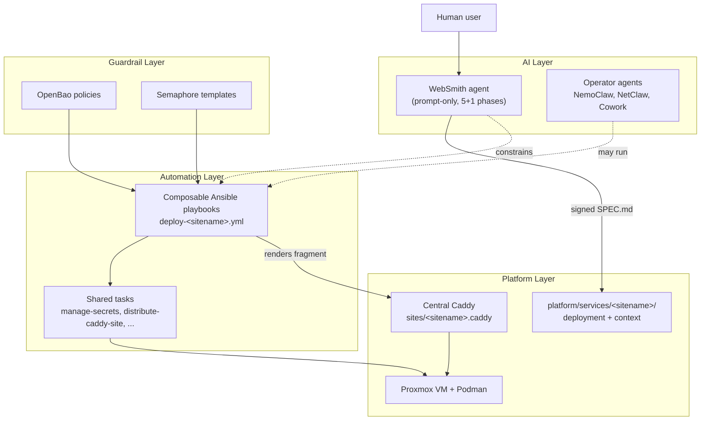
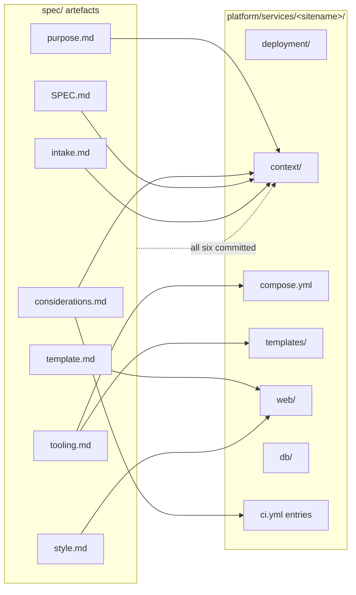

# Website-Building Agent

**Date:** 2026-05-25
**Status:** ACTIVE
**Context:** Defines how the **WebSmith** agent integrates with agent-cloud. WebSmith is a prompt-only meta-framework that walks a human user through five mandatory phases (plus optional intake) to produce a signed `SPEC.md` for a new website. This document captures the architectural contract between that spec-producing workflow and the implementation infrastructure (composable Ansible, Podman, OpenBao, central Caddy) that makes a real platform service out of it.

---

## Problem

The agent-cloud platform already standardises *how to run* a service: secrets in OpenBao, Podman containers, central Caddy proxy, Semaphore-orchestrated Ansible deploys, GitHub Actions CI. But there has been no equivalent standard for *deciding what to build* when someone says "we need a website."

Without that upstream discipline, every new site re-asks the same questions (purpose, page inventory, stack choice, styling, considerations like accessibility/legal/SEO), and either skips them, answers them inconsistently across sites, or buries the answers in chat history. WebSmith fills that gap.

The mismatch this document resolves: WebSmith was originally designed as a standalone framework writing into a separate working directory. agent-cloud wants every concrete site to land inside `platform/services/<sitename>/` and inherit the platform's conventions. We need an explicit contract for how WebSmith's output becomes an agent-cloud service.

---

## Design Principles

1. **WebSmith is decision-only.** Phases 0–5 produce markdown artefacts. They do not scaffold code, install packages, or run build tools. Implementation happens after `SPEC.md` is signed.
2. **The spec is the contract.** After Phase 5, the six phase artefacts are assembled into `SPEC.md`. Implementation that deviates updates `SPEC.md` first (under `## Alignment with agent-cloud conventions` or `## Tracking future deviations`) and gets fresh signoff.
3. **The spec lives with the service.** WebSmith's framework default is to write into a separate working directory. Inside agent-cloud, that's overridden: `SPEC.md` and the five precursor artefacts live at `platform/services/<sitename>/context/spec/`. They are the single source of truth for that site's intent.
4. **Catalogs are non-exhaustive.** WebSmith's `catalogs/` enumerate common archetypes, stacks, components, and considerations. They are starting points, not menus. Sites with novel needs surface them via Phase 5's catch-all question instead of being forced into the nearest entry.
5. **agent-cloud convention beats catalog defaults.** When WebSmith's Phase 3 (Tooling) presents stack choices, the agent-cloud preset is always offered first. Users may override per-site, but the override is recorded as an explicit deviation in `SPEC.md`.
6. **Reusable, not bespoke.** Every site that lands in `platform/services/` follows the same deployment + context shape as UhhCraft. The second site doesn't get to be a snowflake.

---

## Architecture

### Position in the four-layer model

WebSmith is part of the **AI layer**. Its output (signed `SPEC.md`) flows down through the guardrail layer (OpenBao policy, Semaphore template approval) into the automation layer (composable Ansible playbooks) and finally onto the platform layer (Proxmox VMs running Podman containers).

### SPEC → service handoff

Each phase artefact maps to a slice of the resulting service tree:

Concretely: Phase 2 (Template) decides the page inventory, which lands in `web/templates/pages/`. Phase 3 (Tooling) picks the stack — Postgres + Go + templ for UhhCraft — which determines what's in `compose.yml`, `go.mod`, and the language-specific CI jobs. Phase 4 (Style) drives the Tailwind config in `web/static/css/`. Phase 5 (Considerations) settles regulatory + accessibility + observability decisions that land partly in code and partly in CI gates.

`context/spec/` keeps the full artefact set even after implementation begins. Reviewers and future contributors can read the spec to understand intent without spelunking through commits.

### The agent-cloud preset

When a WebSmith session reaches Phase 3 (Tooling), the agent must surface these defaults derived from agent-cloud conventions:

| Concern | agent-cloud default | Source |
|---------|--------------------|--------|
| Database | PostgreSQL | NetBox, NocoDB, UhhCraft — no incompatible service in production |
| Container runtime | Podman | Root `CLAUDE.md`; NetBox is the only Docker exception |
| Reverse proxy | Central Caddy with CloudFlare DNS-01 | [`CADDY-REVERSE-PROXY.md`](CADDY-REVERSE-PROXY.md) |
| Secrets management | OpenBao + Ansible-templated `.env` (not runtime AppRole in v1) | Root `CLAUDE.md` "Secrets Management" |
| CI/CD | Unified `lint-and-test.yml` with path filters | [`CI-TESTING-SPECIFICATION.md`](CI-TESTING-SPECIFICATION.md) |
| Deployment orchestration | Semaphore running composable playbooks | [`AUTOMATION-COMPOSABILITY.md`](AUTOMATION-COMPOSABILITY.md) |
| Hosting | Dedicated Proxmox VM per service | `platform/hypervisor/proxmox/vm-specs.example.yml` |
| SSH | Per-service ed25519 key from OpenBao | `distribute-ssh-keys.yml` + `harden-ssh.yml` |
| Generated code | Generate-in-CI; nothing generated lives in git | UhhCraft `_templ.go` / `sqlcdb/` policy |

Any user-chosen deviation from this preset is recorded in the site's `SPEC.md` under `## Alignment with agent-cloud conventions` (for *adjustments* during integration) or `## Tracking future deviations` (for *changes* after the spec is signed).

### Second-site recipe

Once a `SPEC.md` is signed, implementation follows a fixed template (the same one UhhCraft used). This is the contract every future site inherits:

1. **Service skeleton.** `platform/services/<sitename>/` with the `deployment/ + context/` split.
2. **Spec home.** All six phase artefacts + `SPEC.md` in `context/spec/`. `## Alignment` section added on first integration.
3. **Container image.** Multi-stage `Dockerfile`, distroless runtime, build args for any code generators.
4. **`compose.yml`.** Podman-friendly (no `version:` key, `docker.io/library/` prefixes, no exposed-to-world data-service ports, `nvidia.com/gpu=all` for GPU services).
5. **`deploy.sh`.** Lifecycle only. Sources `platform/lib/common.sh`. No secret gen, no migrations, no API calls.
6. **`post-deploy.sh`.** Migrations, schema bootstrap, healthcheck. Idempotent.
7. **`templates/env.j2`.** Every env var referenced in `compose.yml` and the app, fed by OpenBao via `tasks/manage-secrets.yml`.
8. **`templates/caddy-site.j2`.** Central Caddy fragment with TLS, CSP, compression, route handlers. Distributed by `tasks/distribute-caddy-site.yml`.
9. **Service `CLAUDE.md`.** Anything site-specific future contributors need.
10. **Composable Ansible.** `platform/playbooks/deploy-<sitename>.yml` + `update-<sitename>.yml` + (optionally) `clean-deploy-<sitename>.yml`, all 5-phase composable mirroring `deploy-uhhcraft.yml`.
11. **OpenBao policy.** Reserved HCL file in `platform/services/openbao/deployment/config/policies/<sitename>.hcl` + `apply-policy-<sitename>.yml` wrapper. Even when not consumed at runtime, the file documents scope.
12. **Inventory.** Host group `<sitename>_svc` in `platform/inventory/{local,production}.yml`. Real IPs in site-config.
13. **VM spec.** Entry in `platform/hypervisor/proxmox/vm-specs.example.yml` (and the real one in site-config).
14. **Semaphore templates.** `Deploy <Sitename>`, `Update <Sitename>`, `Apply Policy - <Sitename>` entries in `platform/semaphore/templates.yml`.
15. **CI.** Path-gated jobs in `.github/workflows/lint-and-test.yml` if the language is new.
16. **Cross-references.** Root `README.md`, `CLAUDE.md`, `kickstart.md`, and `architecture-reference.md` cross-links.

The recipe is also captured in [`agents/websmith/context/architecture/integration-with-agent-cloud.md`](../../agents/websmith/context/architecture/integration-with-agent-cloud.md) for the agent itself to consult during a session.

---

## Implementation Phases

The implementation of WebSmith + UhhCraft inside agent-cloud is tracked in [`plan/development/WEBSMITH-INTEGRATION-PLAN.md`](../development/WEBSMITH-INTEGRATION-PLAN.md) as 11 sequential phases. This architecture doc describes the *steady state*; the integration plan describes how we get there.

The integration plan is the authoritative phase tracker — see its **Status** line and per-phase sections rather than duplicating a snapshot here. In summary: Phases 1–9 are merged to `main` (each as its own reviewed PR), with the Phase 6 GPU sub-plan §1 still awaiting a user decision; Phases 10 (branch-deploy validation, needs the real VMs from Phase 6) and 11 (second-site recipe codified in WebSmith catalogs) are pending.

---

## Validation Criteria

| Check | Pass condition |
|-------|---------------|
| WebSmith session can be started from a fresh repo | `agents/websmith/context/AGENTS.md` + `agents/websmith/CLAUDE.md` together brief an LLM to run Phase 1 end-to-end without external references |
| Spec artefacts land in the right place | A WebSmith session writes the six artefacts + `SPEC.md` into `platform/services/<sitename>/context/spec/`, not into `agents/websmith/` |
| agent-cloud preset is offered, not assumed | Phase 3 (Tooling) presents the table above as the recommended path before the user picks something else |
| Deviations are recorded | Every `platform/services/<svc>/context/spec/SPEC.md` either has a `## Alignment with agent-cloud conventions` section or carries a `(none)` placeholder. No silent drift |
| Second site lands without rewriting Phase 2 | Implementation of a new site after UhhCraft follows the recipe above without needing tooling-shape changes to playbooks, CI, or Caddy plumbing |
| Spec → CI gates | Phase 5 (Considerations) decisions about accessibility / security / observability are reflected as gates in `.github/workflows/lint-and-test.yml` (e.g., hadolint, bandit, gosec, golangci-lint) |

---

## Security Considerations

### Blast radius of a WebSmith session

A WebSmith session is **conversational**. It produces markdown artefacts and writes them under `platform/services/<sitename>/context/spec/`. It does not run code, does not touch OpenBao, does not deploy anything. The blast radius of a malicious or misconfigured session is bounded by what the human user lets it commit — and ordinary git review applies.

### Spec-as-code review

`SPEC.md` and the precursor artefacts are committed to git like any other code. They go through normal PR review. CI's `lint-and-test.yml` does not currently parse spec content, but a reviewer is expected to confirm that platform-level commitments (regulatory scope, hosting region, payment processor) match the build before merge.

### Per-site secret isolation

Every WebSmith-built site gets its own OpenBao path tree (`secret/services/<sitename>/...`) and its own reserved policy. The Semaphore-read wildcard policy covers it transparently; no policy edit is required to onboard a new site, but an explicit per-site policy is created as scope documentation and as a future-proof anchor for runtime AppRole binding.

### Catalogs are not security boundaries

WebSmith's `catalogs/` are intentionally non-exhaustive. They are starting points, not allowlists. A user who needs (say) a payment processor not in the catalog should be guided into adding it, not blocked. Compliance posture is enforced in `SPEC.md` and in CI, not by catalog membership.

### Cross-site contamination

Sites built via WebSmith share infrastructure (central Caddy, OpenBao, Semaphore) but get isolated VMs, OpenBao secret trees, MinIO instances, and (typically) databases. Site A cannot read Site B's secrets, hit Site B's MinIO, or proxy through Site B's Caddy route. The only shared dependencies are Semaphore (authorisation gate), the central Caddy (TLS termination + per-site fragment), and the agent-cloud monorepo itself.

---

## Cross-references

### Platform documents

- Root [`CLAUDE.md`](../../CLAUDE.md) — repo-wide conventions and the four-layer model.
- Root [`README.md`](../../README.md) — service surface, AI agent inventory.
- [`AUTOMATION-COMPOSABILITY.md`](AUTOMATION-COMPOSABILITY.md) — the deployment half once a spec is signed.
- [`SERVICE-INTEGRATION-PLAN.md`](SERVICE-INTEGRATION-PLAN.md) — standard onboarding checklist (sites are a special case detailed in §2 of that doc).
- [`CADDY-REVERSE-PROXY.md`](CADDY-REVERSE-PROXY.md) — per-site fragment pattern.
- [`PODMAN-VS-DOCKER-COMPOSE.md`](PODMAN-VS-DOCKER-COMPOSE.md) — UhhCraft is the reference example.
- [`CI-TESTING-SPECIFICATION.md`](CI-TESTING-SPECIFICATION.md) — language-specific CI patterns.

### Integration plan

- [`plan/development/WEBSMITH-INTEGRATION-PLAN.md`](../development/WEBSMITH-INTEGRATION-PLAN.md) — 11-phase rollout, locked decisions, open questions, definition of done.
- [`plan/development/UHHCRAFT-GPU-PASSTHROUGH.md`](../development/UHHCRAFT-GPU-PASSTHROUGH.md) — GPU host preparation for the inference VMs.

### Agent files

- [`agents/websmith/README.md`](../../agents/websmith/README.md) — human entry point.
- [`agents/websmith/CLAUDE.md`](../../agents/websmith/CLAUDE.md) — agent-cloud overrides + agent-cloud preset (operative copy).
- [`agents/websmith/context/AGENTS.md`](../../agents/websmith/context/AGENTS.md) — master rules for an LLM running a session.
- [`agents/websmith/context/architecture/integration-with-agent-cloud.md`](../../agents/websmith/context/architecture/integration-with-agent-cloud.md) — the second-site recipe (agent-facing).

### Reference service

- [`platform/services/uhhcraft/`](../../platform/services/uhhcraft/) — first concrete site built with WebSmith. The deployment + context + spec shape that future sites mirror.
- [`platform/services/uhhcraft/context/spec/SPEC.md`](../../platform/services/uhhcraft/context/spec/SPEC.md) — the signed spec, including the `## Alignment with agent-cloud conventions` section.

---

## Revision History

| Date | Summary |
|------|---------|
| 2026-05-25 | Initial draft. Status: ACTIVE. Authored alongside Phase 9 of `WEBSMITH-INTEGRATION-PLAN.md`. |
| 2026-06-01 | Reconciled against merged Phases 1–8: replaced the dated phase-status snapshot with a pointer to the plan (the authoritative tracker). Landed as the Phase 9 PR. |
