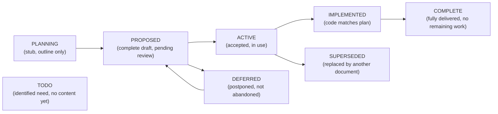
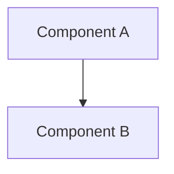

# Architecture Reference

**Date:** 2026-05-06
**Status:** ACTIVE
**Context:** Master index of all architecture and development plan documents in the agent-cloud repository. Defines document standards, naming conventions, required sections, and diagram standards.

---

## Purpose

This document serves as the master index and standard reference for all architecture and development plan documents in `plan/`. It ensures consistency across documents, makes the full document set discoverable, and defines the lifecycle for plan documents from proposal through completion or supersession.

---

## Document Standards

### Naming Convention

All plan documents use **SCREAMING-KEBAB-CASE** filenames with a `.md` extension:

- `AUTOMATION-COMPOSABILITY.md`
- `CREDENTIAL-LIFECYCLE-PLAN.md`
- `DEV-PROXMOX-CLUSTER-PLAN.md`

Exceptions: `IMPLEMENTATION_PLAN.md` (legacy underscore, retained for link stability).

### Required Sections

Every architecture or development plan document must include the following sections. Not all sections need extensive content, but each must be present:

1. **Title** -- H1 heading matching the document purpose
2. **Frontmatter** -- Date, Status (see Status Values below), Context (one paragraph explaining why this document exists)
3. **Problem** -- What gap or issue this plan addresses
4. **Design Principles** -- Guiding constraints for the solution (align with platform design principles in IMPLEMENTATION_PLAN.md)
5. **Architecture** -- Solution design with at least one mermaid diagram
6. **Implementation Phases** -- Ordered steps with acceptance criteria per phase
7. **Validation Criteria** -- Table of checks and pass conditions
8. **Security Considerations** -- Credential handling, blast radius, access control, network exposure
9. **Cross-references** -- Links to related documents in `plan/` and root `CLAUDE.md`
10. **Revision History** -- Date and summary of significant changes (optional for initial drafts)

Stub documents (status: PLANNING or TODO) may defer sections 5-8 with a note indicating they are pending.

---

## Status Values

Every document carries a `**Status:**` field in its frontmatter. Valid values:



| Status | Meaning |
|---|---|
| **PLANNING** | Stub or outline only. Sections may be incomplete. |
| **PROPOSED** | Complete draft ready for review. Not yet accepted. |
| **ACTIVE** | Accepted and in use. Implementation may be ongoing. |
| **IMPLEMENTED** | Core implementation matches the plan. May have planned extensions. |
| **COMPLETE** | Fully delivered. No remaining work items. Candidate for archival. |
| **SUPERSEDED** | Replaced by another document. Retained for historical reference. Move to `plan/archive/`. |
| **DEFERRED** | Postponed intentionally. Not abandoned. Will return to PROPOSED when conditions change. |
| **TODO** | Identified need with no substantive content yet. |

---

## Diagram Standards

**ALL diagrams MUST use mermaid fenced blocks.** ASCII art box-drawing (Unicode U+2500-U+257F) is NOT permitted in `plan/` markdown files. CI enforces this via the `No ASCII art in plan docs` lint step.

Existing ASCII art must be converted to mermaid in the next PR that touches the file.

### Supported Mermaid Types

| Mermaid Type | Use For |
|---|---|
| `flowchart TD` / `flowchart LR` | Decision trees, process flows, deployment flows |
| `graph TD` with `subgraph` | Layer diagrams, architecture stacks, topology |
| `sequenceDiagram` | Runtime interactions between services |
| `stateDiagram-v2` | Credential lifecycle states, document status transitions |
| `gantt` | Implementation timelines (if needed) |
| `classDiagram` | Data models, API contracts (rare) |
| `erDiagram` | Database schemas, entity relationships |

### Diagram Guidelines

- Keep diagrams focused. One concept per diagram.
- Use `subgraph` for grouping related components (layers, VLANs, VMs).
- Use descriptive node IDs (`OPENBAO`, `WEBUI`) not single letters.
- Use `<br/>` for line breaks within node labels, not `\n`.
- Escape special characters in labels with HTML entities (`&lt;`, `&gt;`, `&amp;`).
- Use dashed lines (`-. "label" .->`) for optional or future connections.

---

## Architecture Documents Index

Documents in `plan/architecture/` define cross-cutting patterns and standards.

| Document | Status | Purpose |
|---|---|---|
| [architecture-reference.md](architecture-reference.md) | ACTIVE | This document. Master index and document standards. |
| [AUTOMATION-COMPOSABILITY.md](AUTOMATION-COMPOSABILITY.md) | ACTIVE | Composable task library, 4-phase deploy pattern, secret lifecycle, runtime directory separation. The foundational deployment architecture. |
| [BRANCH-TESTING-WORKFLOW.md](BRANCH-TESTING-WORKFLOW.md) | ACTIVE | Branch deploy and validation workflow via Semaphore survey variables. |
| [CREDENTIAL-LIFECYCLE-PLAN.md](CREDENTIAL-LIFECYCLE-PLAN.md) | ACTIVE | Credential governance: TTL requirements, Create-Verify-Retire rotation, metadata standard, vault paths, audit requirements. |
| [SERVICE-INTEGRATION-PLAN.md](SERVICE-INTEGRATION-PLAN.md) | ACTIVE | Standard onboarding checklist for new services. Tier classification, phases, anti-patterns. |
| [TESTING-AND-LINTING-PLAN.md](TESTING-AND-LINTING-PLAN.md) | ACTIVE | CI pipeline design: ruff, shellcheck, ansible-lint, yamllint, hadolint, pytest, BATS, trufflehog, bandit. Coverage gaps remain. |
| [ACCESS-BOUNDARIES.md](ACCESS-BOUNDARIES.md) | ACTIVE | SSH key scoping, Semaphore vs direct access, AppRole blast radius boundaries. |
| [CADDY-REVERSE-PROXY.md](CADDY-REVERSE-PROXY.md) | ACTIVE | Caddy reverse proxy architecture, TLS DNS-01, routing patterns, credential management. |
| [CI-TESTING-SPECIFICATION.md](CI-TESTING-SPECIFICATION.md) | ACTIVE | Test standards, templates, and onboarding requirements for all services. |
| [PODMAN-VS-DOCKER-COMPOSE.md](PODMAN-VS-DOCKER-COMPOSE.md) | ACTIVE | Compatibility guide for Podman vs Docker across all services. |
| [SECURITY-TESTING-STANDARDS.md](SECURITY-TESTING-STANDARDS.md) | ACTIVE | Security testing standards for code, playbooks, templates, and configuration. |
| [skills-recommendation.md](skills-recommendation.md) | ACTIVE | Maps Claude Code skills to agent-cloud development activities. |
| [WEBSITE-BUILDING-AGENT.md](WEBSITE-BUILDING-AGENT.md) | ACTIVE | WebSmith agent integration: position in 4-layer model, SPEC → service handoff, agent-cloud preset, second-site recipe. |

---

## Development Plans Index

Documents in `plan/development/` define service-specific implementation plans.

| Document | Status | Purpose |
|---|---|---|
| [IMPLEMENTATION_PLAN.md](../development/IMPLEMENTATION_PLAN.md) | COMPLETE | Master implementation plan. Agent roles, service topology, guardrails model, phase roadmap. |
| [OPA-INTEGRATION-PLAN.md](../development/OPA-INTEGRATION-PLAN.md) | PROPOSED | OPA policy engine deployment, agent authorization, Rego policies, Semaphore governance. |
| [NETCLAW-INTEGRATION-PLAN.md](../development/NETCLAW-INTEGRATION-PLAN.md) | PROPOSED | NetClaw network agent deployment, MCP server selection, device inventory, cross-agent coordination. |
| [WISAI-DEPLOYMENT-PLAN.md](../development/WISAI-DEPLOYMENT-PLAN.md) | PLANNING | WisAI inference backbone (Ollama + Open WebUI), GPU node management, model profiles. |
| [DEV-PROXMOX-CLUSTER-PLAN.md](../development/DEV-PROXMOX-CLUSTER-PLAN.md) | PLANNING | Dev Proxmox cluster with ZimaBoard + nested VMs, VLAN isolation, MAAS assessment. |
| [SPARSE-CHECKOUT-MIGRATION.md](../development/SPARSE-CHECKOUT-MIGRATION.md) | PROPOSED | Migrate from full clone to sparse checkout + runtime directory separation. |
| [NETBOX-DISCOVERY-EXPANSION.md](../development/NETBOX-DISCOVERY-EXPANSION.md) | IMPLEMENTED | NetBox discovery pipeline architecture (Diode, proxmox_discovery, pfsense_sync). |
| [OPENSSF-SCORECARD-PLAN.md](../development/OPENSSF-SCORECARD-PLAN.md) | TODO | OpenSSF Scorecard integration for supply chain security. |
| [SNMPV3-UPGRADE-PLAN.md](../development/SNMPV3-UPGRADE-PLAN.md) | DEFERRED | Migration from SNMPv2c to SNMPv3 for discovery agents. |
| [ANSIBLE-CREDENTIAL-REDACTION-PLAN.md](../development/ANSIBLE-CREDENTIAL-REDACTION-PLAN.md) | PLANNING | Ansible callback plugin for credential redaction in Semaphore logs. |
| [APPROLE-TTL-ENFORCEMENT-PLAN.md](../development/APPROLE-TTL-ENFORCEMENT-PLAN.md) | PROPOSED | Enforce 90-day TTL and bounded token_num_uses on all AppRoles. |
| [DISASTER-RECOVERY-PLAN.md](../development/DISASTER-RECOVERY-PLAN.md) | PLANNING | Disaster recovery procedures for critical infrastructure failures. |
| [PODMAN-UPGRADE-PLAN.md](../development/PODMAN-UPGRADE-PLAN.md) | PLANNING | Podman-compose upgrade strategy for services using Podman. |
| [CREDENTIAL-LIFECYCLE-IMPLEMENTATION.md](../development/CREDENTIAL-LIFECYCLE-IMPLEMENTATION.md) | PROPOSED | Implementation phases for credential rotation, metadata, dynamic secrets, site lifecycle. |
| [ARCHITECTURE-REVIEW-FOLLOWUP.md](../development/ARCHITECTURE-REVIEW-FOLLOWUP.md) | TODO | Deferred items from the 2026-05-07 architecture review. |
| [WEBSMITH-INTEGRATION-PLAN.md](../development/WEBSMITH-INTEGRATION-PLAN.md) | ACTIVE | 11-phase integration of the WebSmith agent + UhhCraft platform service into agent-cloud (Phases 1–9 + 11 merged; only Phase 10 go-live pending). |
| [UHHCRAFT-GO-LIVE-PLAN.md](../development/UHHCRAFT-GO-LIVE-PLAN.md) | ACTIVE | Phase 10 production-validation runbook: decisions, provisioning chain, deploy sequence, smoke + rollback, Definition of Done. Execution pending hardware. |
| [UHHCRAFT-GO-LIVE-WALKTHROUGH.md](../development/UHHCRAFT-GO-LIVE-WALKTHROUGH.md) | ACTIVE | Step-by-step operator session script for the go-live: sequential [YOU]/[CLAUDE] steps with hand-off cues. Companion to the go-live plan. |
| [UHHCRAFT-GPU-PASSTHROUGH.md](../development/UHHCRAFT-GPU-PASSTHROUGH.md) | PLANNING | Proxmox PCIe passthrough procedure for the two inference VMs. §1 decision pending. |
| [ERPNEXT-DEPLOYMENT.md](../development/ERPNEXT-DEPLOYMENT.md) | PROPOSED | ERPNext + LLM integration: dev/prod VMs, accounting cutover, backup cross-mirror, read-only MCP, llm-gate service. |
| [LOCAL-DEV-DEPLOYMENT.md](../development/LOCAL-DEV-DEPLOYMENT.md) | ACTIVE | Local dev instance via podman: make bootstraps, local Semaphore operates; slim overlays; promotion pipeline; local DNS (hickory-dns), ERPNext/OPA local tiers. |
| [DNS-SERVER-DEPLOYMENT.md](../development/DNS-SERVER-DEPLOYMENT.md) | PROPOSED | hickory-dns internal DNS platform service: zones-as-code, pfSense delegation, decision-gated internal ACME (RFC 2136 + TSIG). |

### Archived Plans

Documents in `plan/archive/` have reached terminal status (COMPLETE or SUPERSEDED).

| Document | Status | Reason |
|---|---|---|
| [UNIFICATION-PLAN.md](../archive/UNIFICATION-PLAN.md) | SUPERSEDED | Content absorbed into IMPLEMENTATION_PLAN.md. |
| [LINT-COMPLIANCE-PLAN.md](../archive/LINT-COMPLIANCE-PLAN.md) | COMPLETE | All violations fixed in PR #7. |

---

## Document Template

Copy this template when creating a new architecture or development plan document:

````markdown
# DOCUMENT-TITLE

**Date:** YYYY-MM-DD
**Status:** PLANNING
**Context:** One paragraph explaining why this document exists and what triggered its creation.

---

## Problem

What gap, risk, or need does this plan address?

## Design Principles

1. **Principle name** -- How it constrains the solution
2. **Principle name** -- How it constrains the solution

## Architecture



## Implementation Phases

### Phase 1: Name (Timeline)

**Goal:** One sentence.

**Tasks:**
1. Task description
2. Task description

**Acceptance criteria:**
- Criterion 1
- Criterion 2

## Validation Criteria

| Check | Pass Condition |
|---|---|
| Check name | Expected outcome |

## Security Considerations

- Bullet point per consideration

## Cross-references

| Document | Relationship |
|---|---|
| [DOCUMENT.md](path) | How this plan relates |

## Revision History

| Date | Change |
|---|---|
| YYYY-MM-DD | Initial draft |
````

---

## Composability and Translation

These architecture documents are designed for the uhstray.io datacenter platform but follow patterns that translate to other projects:

- **4-phase deploy pattern** (AUTOMATION-COMPOSABILITY.md) applies to any Docker Compose + Ansible stack
- **Create-Verify-Retire rotation** (CREDENTIAL-LIFECYCLE-PLAN.md) applies to any secrets manager (Vault, AWS Secrets Manager, Azure Key Vault)
- **Service integration checklist** (SERVICE-INTEGRATION-PLAN.md) applies to any multi-service platform
- **Branch testing workflow** (BRANCH-TESTING-WORKFLOW.md) applies to any Semaphore/CI orchestrated deployment

To adapt for another project:
1. Replace `OpenBao` references with your secrets manager
2. Replace `Semaphore` references with your CI/CD orchestrator
3. Replace `Proxmox` references with your hypervisor/cloud provider
4. Keep the structural patterns (composable tasks, runtime/source separation, tiered service classification)

---

## Testing Requirements

All changes to plan documents must pass CI before merging:

1. **No ASCII art** -- The `No ASCII art in plan docs` CI step rejects Unicode box-drawing characters (U+2500-U+257F) in `plan/**/*.md`
2. **No credentials or IPs** -- The security scan steps reject hardcoded private IPs and credential patterns
3. **YAML lint** -- yamllint validates any embedded YAML blocks
4. **BASH lint** -- shellcheck validates any bash script code/blocks
5. **Python lint** -- ruff validates any Python code (pylint is not currently in CI but may be added)
6. **Markdown rendering** -- Mermaid diagrams must use valid syntax (test locally with a mermaid-capable renderer)

See [TESTING-AND-LINTING-PLAN.md](TESTING-AND-LINTING-PLAN.md), [SECURITY-TESTING-STANDARDS.md](SECURITY-TESTING-STANDARDS.md) and [CI-TESTING-SPECIFICATION.md](CI-TESTING-SPECIFICATION.md) for the full testing strategy and CI pipeline reference.

---

## Revision History

| Date | Change |
|---|---|
| 2026-05-06 | Initial creation as part of architecture review. Indexes all existing plan documents, defines document standards, diagram standards, and status values. |
| 2026-05-10 | Reviewed by @jestyr27, updated some naming conventions and added references to missing documents. |
