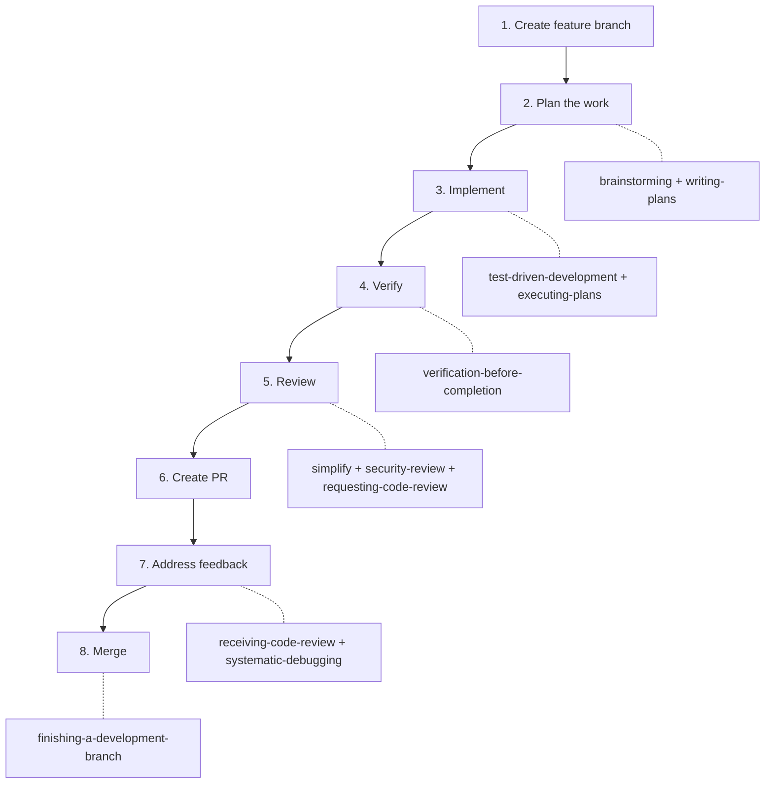

# Skills Recommendation for agent-cloud Development

**Date:** 2026-05-06
**Status:** ACTIVE
**Context:** This document maps Claude Code skills from the [uhstray-io/huhhb](https://github.com/uhstray-io/huhhb) repository and locally available skills to specific development activities in the agent-cloud platform.

---

## Skill Categories and Recommendations

### Architecture and Planning

Skills for design work, technical decisions, and documentation.

| Skill | Source | Use When |
|-------|--------|----------|
| `brainstorming` | huhhb (superpowers) | Before any creative work: new service design, architecture decisions, feature scoping. Explores intent and requirements before implementation. |
| `writing-plans` | huhhb (superpowers) | When you have a spec or requirements for a multi-step task. Creates structured implementation plans in `plan/development/` before coding begins. |

**Recommended workflow:** For any new service or significant feature, run `brainstorming` first to explore the design space, then `writing-plans` to produce a plan in `plan/development/`.

### Implementation

Skills for executing planned work and writing code.

| Skill | Source | Use When |
|-------|--------|----------|
| `test-driven-development` | huhhb (superpowers) | Before writing implementation code for any feature or bugfix. Ensures tests exist before the code they validate. |
| `executing-plans` | huhhb (superpowers) | When you have a written implementation plan to execute. Provides review checkpoints throughout execution. |
| `subagent-driven-development` | huhhb (superpowers) | When an implementation plan has independent tasks that can run in parallel within a single session. |

**Recommended workflow:** For composable task implementation (e.g., building `sparse-checkout.yml`), use `test-driven-development` to write BATS tests first, then `executing-plans` to work through the implementation plan.

### Quality

Skills for verification, review, and debugging.

| Skill | Source | Use When |
|-------|--------|----------|
| `verification-before-completion` | huhhb (superpowers) | Before claiming any work is complete, fixed, or passing. Requires running verification commands and confirming output before success claims. |
| `requesting-code-review` | huhhb (superpowers) | When completing tasks or implementing major features. Verifies work meets requirements before merge. |
| `receiving-code-review` | huhhb (superpowers) | When receiving CodeRabbit or human review feedback. Requires technical rigor, not performative agreement. |
| `systematic-debugging` | huhhb (superpowers) | When encountering any bug, test failure, or unexpected behavior. Must be used before proposing fixes. |
| `simplify` | Built-in | Review changed code for reuse, quality, and efficiency. Run on every branch before creating a PR. |
| `security-review` | Built-in | Complete a security review of pending branch changes. Run before every PR per branch workflow. |

**Recommended workflow:** After implementation, run `verification-before-completion`, then `simplify`, then `security-review`, then `requesting-code-review` before creating a PR.

### Operations

Skills for git workflow, parallel execution, and branch management.

| Skill | Source | Use When |
|-------|--------|----------|
| `dispatching-parallel-agents` | huhhb (superpowers) | When facing 2+ independent tasks that can be worked on without shared state. Useful for multi-file architecture reviews or independent playbook development. |
| `using-git-worktrees` | huhhb (superpowers) | When starting feature work that needs isolation from the current workspace. Creates isolated git worktrees for parallel development. |
| `finishing-a-development-branch` | huhhb (superpowers) | When implementation is complete and all tests pass. Guides completion with structured options for merge, PR, or cleanup. |

**Recommended workflow:** For large multi-task efforts (like service onboarding), use `dispatching-parallel-agents` to split independent work. Use `finishing-a-development-branch` when ready to create the PR.

### Memory and Context

Skills for preserving session state and searching past work.

| Skill | Source | Use When |
|-------|--------|----------|
| `memory` | mempalace | General memory operations: store, recall, and organize knowledge about the codebase. |
| `memory-mine` | mempalace | Mine projects and conversations into the MemPalace. Useful after completing significant work to preserve learnings. |
| `memory-search` | mempalace | Search memories across the MemPalace using semantic search. Find past decisions, patterns, or context. |
| `memory-status` | mempalace | Show current state of the memory palace: wings, rooms, drawer counts. |
| `remember` | remember | Save session state for clean continuation in the next session. Use at the end of long sessions. |

**Recommended workflow:** At the end of significant development sessions, run `remember` to save state. After completing major features, run `memory-mine` to preserve learnings about the codebase.

---

## Skills Active on Local Machine

The following skills are currently available in the local Claude Code installation:

**From huhhb (superpowers):**
- `brainstorming`
- `writing-plans`
- `executing-plans`
- `test-driven-development`
- `subagent-driven-development`
- `verification-before-completion`
- `requesting-code-review`
- `receiving-code-review`
- `systematic-debugging`
- `dispatching-parallel-agents`
- `using-git-worktrees`
- `finishing-a-development-branch`
- `writing-skills`
- `using-superpowers`

**Built-in / other:**
- `simplify` — code quality review
- `security-review` — security audit of branch changes
- `review` — PR review
- `code-review:code-review` — PR code review
- `init` — initialize CLAUDE.md
- `remember` — session state persistence
- `mempalace:*` — memory palace (search, status, mine, help, init)
- `caveman:*` — token-efficient communication mode
- `claude-md-management:*` — CLAUDE.md audit and improvement
- `claude-code-setup:claude-automation-recommender` — automation setup analysis
- `firecrawl:*` — web scraping and search
- `frontend-design:frontend-design` — UI component generation
- `skill-creator:skill-creator` — skill creation and benchmarking

---

## Recommended Skill Development for agent-cloud

The following skills do not yet exist but would significantly improve development workflows for this project:

### 1. Ansible Playbook Validator

**Purpose:** Validate Ansible playbooks against agent-cloud conventions before committing.
**Checks:**
- `no_log: true` on all secret-handling tasks
- `_secret_definitions` and `_env_templates` use correct schema
- Playbooks follow the composable pattern (phases, variable contracts)
- No hardcoded IPs or credentials
- Task files in `tasks/` are reusable (no host-specific logic)

### 2. Service Onboarding Assistant

**Purpose:** Guide through the SERVICE-INTEGRATION-PLAN.md checklist interactively.
**Actions:**
- Scaffold `platform/services/<name>/deployment/` directory structure
- Generate deploy.sh skeleton (container-lifecycle-only)
- Generate Jinja2 env templates from a secret definition list
- Create playbook stubs for deploy and clean-deploy
- Add Semaphore template entries

### 3. OpenBao Policy Reviewer

**Purpose:** Audit HCL policies for least-privilege compliance.
**Checks:**
- No wildcard paths (`secret/data/services/*`) in new policies
- TTL enforcement on AppRoles (secret_id_ttl > 0, token_num_uses > 0)
- Policy paths match the service's actual secret paths in `_secret_definitions`

### 4. Composable Pattern Linter

**Purpose:** Verify that deploy.sh scripts follow the container-lifecycle-only pattern.
**Checks:**
- No `generate-secrets`, `put_secret`, `get_secret` calls
- No `BAO_ROLE_ID` or `BAO_SECRET_ID` references
- Env file verification present (fail if `.env` missing)
- `CLONE_DIR` validation present
- No writing to the git clone directory

---

## Mapping Skills to Branch Workflow

The agent-cloud branch workflow (from CLAUDE.md) maps to skills at each step:

