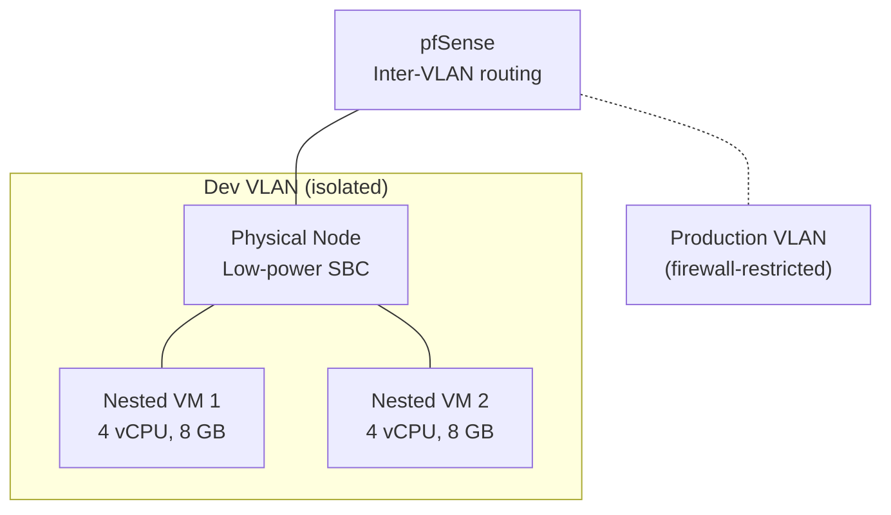

# Dev Proxmox Cluster Plan

**Date:** 2026-04-25
**Status:** PLANNING
**Context:** Build a separate "dev" Proxmox cluster for testing breaking changes, automation development, and upgrade rehearsals before applying them to the production cluster.

> **Full plan with network topology, IP allocations, and node configurations lives in the private `site-config` repository at `plan/DEV-PROXMOX-CLUSTER-PLAN.md`.** This stub exists in the public repo for cross-referencing only.

---

## Problem

All Proxmox automation (playbooks, Semaphore templates, cloud-init, proxmox_discovery worker, VM provisioning) is developed and tested directly against the production cluster. There is no safe environment to:

- Test Proxmox version upgrades before applying them to production nodes
- Validate breaking changes to `provision-vm.yml`, `proxmox-validate.yml`, or cloud-init templates
- Experiment with cluster operations (join/leave, quorum, HA) without risking production workloads
- Rehearse `proxmox_discovery` worker changes against a different cluster topology
- Test MAAS-based bare-metal provisioning workflows

## Architecture Overview

The dev cluster is a hybrid: one physical bare-metal node and two nested-virtualization VMs on the existing production Proxmox cluster, connected via a dedicated VLAN isolated from production traffic.

## Key Design Decisions

- **Nested virtualization** via `cpu: host` on KVM VMs — enables running VMs inside VMs for realistic testing
- **VLAN isolation** — dev cluster on a separate VLAN with firewall rules blocking production access
- **Shared Proxmox API** — dev nodes join a separate cluster but credentials are managed through OpenBao
- **ZimaBoard constraints** — 2 GB RAM limits the physical node to LXC containers and quorum participation only

## Cross-References

- `plan/architecture/AUTOMATION-COMPOSABILITY.md` — composable tasks used for dev cluster provisioning
- `plan/architecture/PODMAN-VS-DOCKER-COMPOSE.md` — container runtime considerations for dev VMs
- `plan/architecture/ACCESS-BOUNDARIES.md` — Semaphore vs direct access for dev cluster
- `site-config/plan/DEV-PROXMOX-CLUSTER-PLAN.md` — full implementation details (private)
