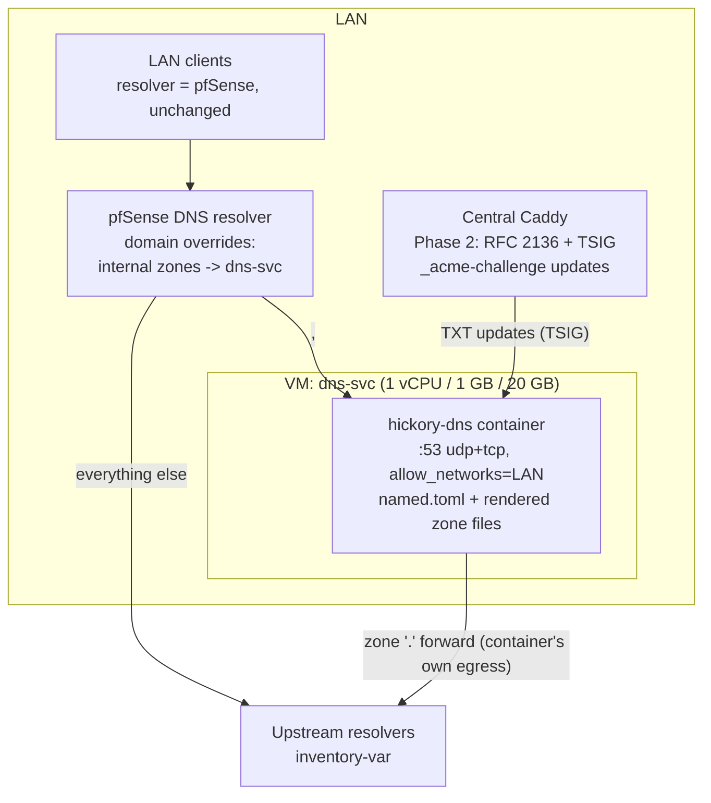
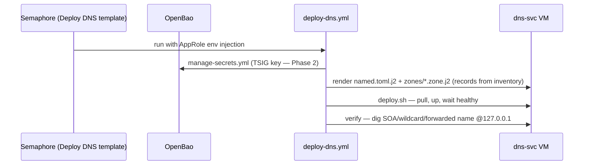

# DNS Server Deployment Plan — hickory-dns

> **Location:** `plan/development/DNS-SERVER-DEPLOYMENT.md`
> **Date:** 2026-06-12 · **Status:** PROPOSED · **Owner:** uhstray-io
> **Context:** A code-managed internal DNS service for the uhstray-io platform — authoritative for the internal zones (`<internal-zone>`, `<local-dev-zone>`, and similar), forwarding everything else upstream — deployed as a platform service via the composable pattern. The same engine and zone templates back the laptop's local DNS (`LOCAL-DEV-DEPLOYMENT.md` §5.1), so local rehearses prod DNS exactly like local Semaphore rehearses prod orchestration.
>
> **For agentic workers:** Execute phase-by-phase; every phase ends at a validation gate. Real zone names, IPs, and TSIG material live exclusively in **site-config** — this document uses `<placeholders>` per the public-repo rules.

**Goal:** Internal name resolution becomes a versioned, Semaphore-deployed platform service instead of hand-maintained pfSense host overrides — with a path to RFC 2136 dynamic updates so Caddy can solve ACME DNS-01 for internal zones.

**Architecture:** One hickory-dns container on a minimal VM, deployed by `deploy-dns.yml` (manage-secrets → zone templating → deploy.sh → `dig` verify). Zone files are Jinja2-templated RFC 1035 master files rendered from inventory vars; pfSense forwards the internal zones to it via domain overrides (Phase 1) and may later hand it full LAN resolution (Phase 3, optional).

**Tech stack:** hickory-dns (Rust; formerly trust-dns) via the official `docker.io/hickorydns/hickory-dns` image, podman + podman-compose, composable Ansible tasks, OpenBao (TSIG key material), Semaphore templates-as-code.

---

## Design principles

1. **DNS sits below everything — keep it dependency-free at runtime.** The container reads rendered files only; no OpenBao, NetBox, or Semaphore calls after deploy. A platform outage must not take name resolution down with it.
2. **Records are code.** Zone content is inventory vars rendered through versioned templates; the running server is never the editable source of truth (the one scoped exception: the Phase 2 dynamic challenge zone, whose records are transient by design).
3. **Degrade, don't gate.** pfSense remains the clients' resolver; this service answers only the zones delegated to it. Its failure mode is "internal names unresolvable," never "LAN offline" — until a future phase consciously revisits that.
4. **Prove the production-grade subset only.** Authoritative serving + forwarding are hickory's mature components; recursion stays disabled, HA waits for upstream maturity.
5. **One engine, two environments.** The laptop's local DNS (`LOCAL-DEV-DEPLOYMENT.md` §5.1) and this service share image, config shape, and zone templates — parameterized by env/inventory, never forked.

---

## Target outcome

When Phase 2's gate passes:

- **Zones are code.** Every internal record is a line in a versioned `.j2` zone template rendered from inventory vars; a record change is a PR + a Semaphore template run, not a pfSense UI session.
- **One engine, two environments.** The laptop (`LOCAL-DEV-DEPLOYMENT.md` §5.1) and prod run the same image, the same `named.toml` shape, and the same zone-template structure — drift between "how dev names resolve" and "how prod names resolve" is structural, not policy.
- **Internal ACME has a decided path.** Phase 2 resolves the ACME-CA decision (public challenge delegation vs internal CA — see §5) and, if either hickory-backed option is chosen, wires Caddy's RFC 2136 + TSIG updates (hickory ≥0.26) to it. Until then, the existing Cloudflare DNS-01 wildcard path keeps issuing publicly-trusted certs.
- **Resolution keeps working when the platform doesn't.** DNS sits below every other service; the design accepts zero runtime dependencies on OpenBao, NetBox, or Semaphore once deployed.

## 1. Problem

Internal names (`<erpnext-dev-domain>` and friends) are resolved today by pfSense host overrides — hand-entered, unversioned, invisible to CI, and impossible to rehearse locally. The local-dev plan needs wildcard dev-zone resolution on laptops; ERPNext Phase 1A already requires a LAN-only DNS entry; future services each add another manual override. There is no authoritative, code-managed source of truth for internal DNS, and no path to ACME DNS-01 for zones that never face the public internet.

## 2. Decision criteria (alternatives considered)

| Decision | Chosen | Alternatives — and why they lost |
|---|---|---|
| DNS engine | **hickory-dns** [1][2] — owner-directed; memory-safe Rust, ~12 MiB official multi-arch image, TOML config + standard RFC 1035 zone files, authoritative + forwarding are production-grade per maintainers [3], TSIG/RFC 2136 dynamic updates since 0.26 | BIND9 — battle-tested but C, heavyweight config, the platform gains nothing it needs; CoreDNS — Go, plugin-chain config diverges from zone-file convention; dnsmasq — C, no real zone authority model; staying on pfSense overrides — unversioned, the problem itself |
| Topology | **One instance on a minimal dedicated VM**, pfSense forwards internal zones to it (domain overrides) | Replacing pfSense's resolver outright on day one — makes a new, unproven service the LAN's single point of failure; HA pair — premature, hickory's secondary/AXFR story is weak [1] and the failure mode (pfSense override falls through) is tolerable |
| Recursion | **Forward-only**: `.` zone forwards to upstream resolvers (inventory-var); hickory's recursor stays off | Full recursion — explicitly experimental upstream [1][3]; forwarding rides hickory-resolver, the production-grade component |
| Zone management | **Jinja2-templated RFC 1035 zone files** rendered at deploy; records are inventory vars in site-config | Dynamic-updates-as-primary-workflow — sqlite journal becomes the live state and the flat zone file silently stops being the truth [1]; hand-edited files on the VM — unversioned again |
| ACME DNS-01 for internal zones | **Decision deferred to Phase 2 start** — a public ACME CA must be able to *resolve* `_acme-challenge.<name>` from the internet, so a LAN-only hickory cannot back Let's Encrypt issuance by itself. Options on the table: (a) publicly delegate only the challenge sub-zone to this service (scoped :53 exposure for that zone alone) + RFC 2136/TSIG [1][4]; (b) keep Cloudflare DNS-01 with **wildcard certs** (status quo — already proven for LAN-only names in ERPNext §8.1; wildcards also mitigate the CT-log hostname disclosure that exists for *any* publicly-trusted per-host cert); (c) internal ACME CA (e.g. step-ca) doing DNS-01 against hickory — trusted only on managed devices | Pretending RFC 2136 alone unblocks public ACME — it only writes the TXT; it does not make the zone resolvable to the CA. The defensible argument against (b) long-term is SaaS-token coupling, not "hostname leakage" — CT logs disclose certified names regardless of DNS provider |
| Container engine | **podman, with the privileged-port caveat handled at deploy**: binding :53 needs `net.ipv4.ip_unprivileged_port_start=53` (sysctl task in `deploy-dns.yml`) or a rootful service unit — recorded, not assumed away | Docker — reserved for services that need root engine features (NetBox); DNS needs a port sysctl, not Docker |
| Port exposure | **VM binds :53 udp+tcp on the LAN interface** (the service IS the name server), via **env-parameterized compose bindings** (`${DNS_LISTEN:-0.0.0.0}:${DNS_PORT:-53}:53/udp` …) — compose overlays merge `ports` by *appending*, they can never remove a base binding, so port shifts must be env-driven in the base file (the NocoDB/UhhCraft pattern); `allow_networks` ACL limits queries to LAN CIDRs | High-port + pfSense port-forward — needless indirection on a dedicated VM; hardcoded `53:53` + overlay "override" — structurally impossible with compose merge semantics |

## 3. Architecture

The service slots into the platform layer like any other composable service; the only unusual property is that pfSense (the LAN's existing resolver) delegates the internal zones to it, so clients keep using pfSense as their resolver and never need reconfiguration:



Deploy-time flow is the standard composable pattern — the zone files are just one more set of Jinja2 templates rendered next to `.env`:



### Repository structure

```text
platform/services/dns/
  deployment/
    compose.yml                 # one service: hickory-dns, pinned tag
    deploy.sh                   # container lifecycle only (rule #2)
    templates/
      named.toml.j2             # listen addrs, ACLs, zone list, forward config
      zone.internal.j2          # <internal-zone> master file (records = inventory vars)
      zone.local-dev.j2         # <local-dev-zone> master file (wildcard -> target var)
                                #   rendered ONLY by the laptop deploy — prod serves
                                #   <internal-zone> alone (a second authority for the
                                #   dev zone, answering 127.0.0.1 LAN-wide, would be
                                #   wrong and rebind-scrubbed by pfSense anyway)
  context/
    architecture.md             # how agents reason about/query the DNS service
```

`compose.yml` sketch (final form at Phase 0): image `docker.io/hickorydns/hickory-dns:<pinned>`, `container_name: dns`, ports `"${DNS_LISTEN:-0.0.0.0}:${DNS_PORT:-53}:53/udp"` + the tcp twin (env-parameterized — see §2 port-exposure row; local-dev sets `DNS_LISTEN=127.0.0.1 DNS_PORT=5300`, never an overlay port "override"), read-only bind of the rendered config/zone dir, `restart: unless-stopped`. Healthcheck: prefer a query-based probe (`dig SOA <internal-zone> @127.0.0.1` via the image's bundled bind-tools) over `hickory-dns --validate` — validate proves config parses, not that the daemon answers; record the final form at Phase 0.

## 4. OpenBao layout additions

| Path | Contents |
|------|----------|
| `secret/services/dns` | `tsig_key_name`, `tsig_key_secret` (Phase 2 — base64 HMAC-SHA256; decoded into hickory's raw `key_file` at deploy), shared with Caddy's rfc2136 config |
| `secret/services/ssh/dns` | Per-service ed25519 keypair |

No runtime AppRole: the container never talks to OpenBao (deploy-time access uses Semaphore's AppRole, per the platform default).

## 5. Implementation phases

### Phase 0 — Scaffolding (service onboarding checklist)

- [ ] `platform/services/dns/deployment/` per §3 structure; `deploy.sh` container-only; lint (shellcheck, yamllint, ansible-lint) + BATS `test_service_dns.bats` (image pinned, no secrets in scripts, compose valid)
- [ ] `deploy-dns.yml` + `clean-deploy-dns.yml` using composable tasks; `dig`-based verify phase (SOA, a known A record, a wildcard miss→hit pair, and one forwarded external name)
- [ ] Semaphore templates **Deploy DNS** / **Clean Deploy DNS** in `platform/semaphore/templates.yml`; local variant in `templates-local.yml`
- [ ] site-config: `dns_svc` host group (VM IP), zone vars (`internal_zone`, `local_dev_zone`, record maps, upstream resolvers), `secret/services/ssh/dns` keypair
- [ ] Docs: root `CLAUDE.md` (secrets table + workflows row), `README.md` service list, and this plan added to `plan/architecture/architecture-reference.md`'s Development Plans Index

**Gate 0:** CI green; templates registered; `ansible-playbook --syntax-check` clean; zone templates render valid master files (`hickory-dns --validate` in a container against rendered output).

### Phase 1 — Authoritative for internal zones (prod live)

- [ ] Provision the `dns-svc` VM (1 vCPU / 1 GB / 20 GB — hickory's in-memory footprint is tens of MB [1]); SSH keys → distribute → verify → harden (rule #5 order)
- [ ] Privileged-port handling in `deploy-dns.yml`: persist `net.ipv4.ip_unprivileged_port_start=53` (sysctl.d) before the container starts — rootless podman cannot publish :53 otherwise; document the alternative (rootful unit) if the sysctl is rejected
- [ ] **Deploy DNS** via Semaphore; `allow_networks` restricted to LAN CIDRs; AXFR stays default-deny
- [ ] pfSense: domain override for `<internal-zone>` → dns-svc IP, **plus** `private-domain: "<internal-zone>"` in unbound's custom options — without it, pfSense's DNS-rebinding protection scrubs every RFC 1918 answer this service returns (manual UI step today; record in the site-config runbook — pfSense API automation is a future enhancement). The `<local-dev-zone>` is **not** delegated on prod (laptop-only authority, §3)
- [ ] Migrate existing host overrides (ERPNext dev, service names) into the zone templates; remove the pfSense per-host entries **only after** parallel verification (rule #5 applied to DNS)
- [ ] Add a DNS block to `validate-all.yml` (`dig` checks through pfSense and direct)

**Gate 1:** every migrated name resolves identically via pfSense and via dns-svc directly; a record change lands as PR → template run → live answer; VM survives reboot with resolution intact; external names still resolve for LAN clients (forward path).

### Phase 2 — ACME for internal zones (decision-gated)

**Preconditions (blocking):** (1) the ACME-CA decision in §2 is made — public challenge-sub-zone delegation (a), Cloudflare wildcard status quo (b), or internal CA (c); options (a)/(c) require everything below, option (b) ends this phase at the decision record. (2) **Caddy composable automation exists** — today Caddy has no playbook, no Semaphore template, no manage-secrets flow, and runs an unpinned third-party image (`CADDY-REVERSE-PROXY.md` gaps; `LOCAL-DEV-DEPLOYMENT.md` Phase 4 builds `deploy-caddy.yml` local-first); an owned Caddy image build is required to add the `caddy-dns/rfc2136` module.

- [ ] Record the ACME-CA decision + rationale here (§2 row updated, §8 row closed)
- [ ] Carve the dynamic challenge zone (shape per the decision: publicly-delegated `_acme-challenge.<internal-zone>` or an internal-CA-queried zone) backed by hickory's **sqlite store** with `allow_update = true` — the template-rendered primary zones stay static (journal-vs-zonefile truth split is the known trap [1])
- [ ] TSIG key: generate, store in `secret/services/dns`, render into hickory's `key_file` (raw decoded bytes) and into Caddy's `rfc2136` provider config via each side's manage-secrets flow
- [ ] Caddy: `caddy-dns/rfc2136` module in the owned image build; internal-zone sites switch to DNS-01 against hickory [4]
- [ ] Restore/rebuild runbook: sqlite journal is ephemeral by design here (challenges are transient) — a clean redeploy may drop in-flight challenges, never issued certs

**Gate 2:** decision recorded; if (a)/(c): one internal-zone certificate issued end-to-end via DNS-01 against hickory, TSIG-less update attempts refused, journal-backed zone survives container restart, static zones still render-only.

### Phase 3 — Optional: primary LAN resolver

Only after sustained Gate-1/2 stability: point pfSense DHCP at dns-svc (or run hickory as pfSense's sole forwarder). Explicitly **not** required by any other plan; revisit when operational confidence and the HA question (secondary instance, AXFR maturity [1]) are both answered.

## 6. Security considerations

- **Query surface:** `allow_networks` limits to LAN CIDRs; AXFR default-deny; no public exposure of internal zones at any phase. The recursor feature stays disabled (experimental upstream [1][3]).
- **Update surface:** dynamic updates exist only in the Phase 2 sub-zone, TSIG-authenticated (HMAC-SHA256), key stored in OpenBao and templated at deploy — never on-disk in the repo. Static zones cannot be modified at runtime.
- **Secrets hygiene:** zone names and record IPs are inventory vars in site-config; this repo holds `<placeholders>` only. TSIG material flows OpenBao → Ansible memory → rendered key file (0600, gitignored path) per rule #4.
- **Blast radius:** pfSense override fall-through means a dead dns-svc degrades to "internal names unresolvable," not "LAN offline" (until/unless Phase 3 changes that calculus — recorded there).
- **Known upstream issues watched:** query-loss report hickory-dns#2613 (open, unconfirmed) — Gate 1 includes a sustained-resolution soak; wildcard NSEC behavior #3034 is irrelevant for unsigned internal zones [1].

## 7. Validation criteria (master)

| Phase | Critical check | Pass |
|---|---|---|
| 0 | Render + lint | Zone templates validate via `hickory-dns --validate`; CI green; templates registered |
| 1 | Authoritative + forward | Migrated names answer via pfSense and direct; record-change-as-PR proven; external resolution intact; 24 h soak without query loss |
| 2 | ACME decision + (if hickory-backed) dynamic updates | Decision recorded; for options (a)/(c): internal-zone cert via DNS-01, unauthenticated updates refused, static zones unaffected |
| 3 (opt) | Resolver promotion | Defined when the phase is picked up |

## 8. Open decisions & risks

| Item | Status | Resolution path |
|---|---|---|
| Pinned image tag | Phase 0 | Pin the newest tag the official image publishes (0.26.x line; 0.26.1 binary released 2026-05-01 [2]) and record it in inventory |
| **ACME-CA choice for internal zones** | **Open — blocks Phase 2 work items** | Decide (a) public challenge-sub-zone delegation, (b) Cloudflare wildcard status quo, (c) internal CA (step-ca); §2 records the trade-offs honestly (CT logs disclose per-host names under every option; wildcards mitigate under (a) and (b) alike) |
| Caddy automation precondition | Open — tracked in LOCAL-DEV Phase 4 + CADDY-REVERSE-PROXY gaps | `deploy-caddy.yml`, Semaphore template, owned image build land before (or with) Phase 2 |
| `_acme-challenge` zone shape | Phase 2 start (after the CA decision) | Spike against caddy-dns/rfc2136; pick the shape that keeps the static zones journal-free |
| pfSense override automation | Manual at Phase 1 | pfSense API/Ansible module evaluation — separate enhancement, not load-bearing |
| HA / secondary | Deferred | hickory AXFR/secondary maturity is the blocker [1]; revisit at Phase 3 |
| hickory#2613 query-loss report | Watch | Gate 1 soak measures; if observed, evaluate 0.27 line or revisit engine choice with evidence |

## 9. Convention compliance map

| Platform rule | How this plan satisfies it |
|---|---|
| All deployments through Semaphore (rule #1) | Deploy DNS / Clean Deploy DNS templates; no SSH deploys |
| deploy.sh containers-only (rule #2) | Zone rendering is Ansible's job; deploy.sh pulls/starts/waits |
| Independent workflows (rule #3) | DNS deploy, clean-deploy, and the Phase 2 Caddy change are separate playbooks/PRs |
| No intermediary secret files (rule #4) | TSIG: OpenBao → Ansible memory → rendered 0600 key file (the compose-readable minimum) |
| Verify before hardening (rule #5) | Parallel-resolution verification before pfSense overrides are removed; SSH harden only after key auth verified |
| No real values in public repo | Zones/IPs/TSIG in site-config; placeholders here |
| Local-dev parity | Same image/config/zone templates; `compose.local.yml` overlay only (LOCAL-DEV-DEPLOYMENT §5.1) |

## 10. References

1. *(web)* github.com/hickory-dns/hickory-dns — README + `bin/` config/CLI source + test configs (accessed 2026-06-12): authoritative + forwarding production-grade, recursion experimental; TOML `named.toml`; RFC 1035 zone files with wildcard support; RFC 2136 + TSIG (≥0.26, sqlite store, `key_file` raw bytes); AXFR default-deny; sqlite journal supersedes the flat zone file once updates land; issues #2613, #3034.
2. *(web)* hub.docker.com/r/hickorydns/hickory-dns + github.com/hickory-dns/docker (accessed 2026-06-12) — official image, multi-arch (amd64/arm64/+), ~12 MiB Alpine, config `/etc/named.toml`, zones `/var/named`, `--validate` healthcheck pattern, forwarding smoke-test config.
3. *(web)* memorysafety.org/blog/hickory-update-2025 (accessed 2026-06-12) — ISRG/Prossimo: authoritative server + stub resolver have production deployment experience; recursive resolver still in development.
4. *(web)* github.com/caddy-dns/rfc2136 (accessed 2026-06-12) — Caddy DNS-01 provider speaking RFC 2136 with TSIG (`key_alg hmac-sha256`, base64 key), matching hickory ≥0.26 update support.
5. *(repo)* `plan/development/LOCAL-DEV-DEPLOYMENT.md` §5.1 — the local half of this design (same engine/templates; loopback 5300; `/etc/resolver` integration).
6. *(repo)* `plan/architecture/CADDY-REVERSE-PROXY.md` — current TLS/DNS-01 posture this plan's Phase 2 amends.
7. *(repo)* `plan/development/ERPNEXT-DEPLOYMENT.md` §8.1 — the pfSense host-override step this service replaces with zone templates.
8. *(repo)* `CLAUDE.md` — Critical Deployment Rules #1–#5; secrets layout table this plan extends.

## 11. Revision history

| Date | Change |
|---|---|
| 2026-06-12 | Initial plan: hickory-dns chosen (owner-directed; criteria + rejected alternatives recorded), forward-only posture, three phases (authoritative → RFC 2136 ACME → optional resolver promotion), shared-engine parity with local-dev §5.1 |
| 2026-06-12 | Architecture-review pass: ACME story corrected (LAN-only authority can't back public DNS-01 — Phase 2 is now decision-gated across delegation/Cloudflare-wildcard/internal-CA, CT-log rationale fixed); env-parameterized port bindings mandated (compose overlays append `ports`, never replace); rootless-:53 sysctl step added; pfSense `private-domain` rebind-protection step added; prod no longer serves the dev zone; Caddy-automation precondition made explicit; design-principles section + query-based healthcheck note + architecture-reference index item added |
