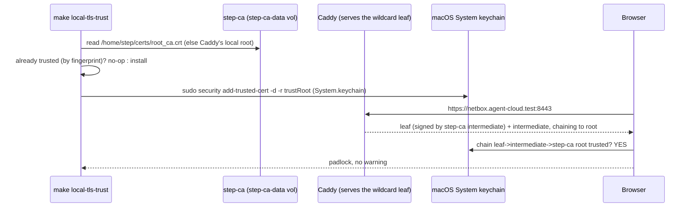

# Local-Dev TLS Trust Plan — fix the `*.agent-cloud.test` cert warning

> **Location:** `plan/development/LOCAL-DEV-TLS-TRUST.md`
> **Date:** 2026-06-13 · **Status:** IMPLEMENTED (root-of-trust now step-ca) · **Owner:** uhstray-io
>
> **Root-of-trust update (2026-06-14) — this plan's original Caddy-CA approach is SUPERSEDED by step-ca** (see `INTERNAL-CA-DEPLOYMENT.md`, IMPLEMENTED 2026-06-14). The idempotent, fingerprint-based `make local-tls-trust`/`untrust` mechanism this plan designed **carries over unchanged**; what changed is *which root* it trusts. `scripts/local-dev.sh` (`_internal_root_pem`) now **prefers step-ca's STABLE shared root** (`podman exec step-ca cat /home/step/certs/root_ca.crt`, in the `step-ca-data` volume) and falls back to Caddy's own ephemeral local root (`/data/caddy/pki/authorities/local/root.crt`) only when step-ca isn't deployed. The step-ca root survives Caddy redeploys/volume wipes — the core win over `local_certs`; only a `step-ca-data` wipe forces a re-trust. References to Caddy's `local_certs` root below describe the **fallback** path.
>
> **Context:** Browsing `https://netbox.agent-cloud.test` (and the other local Caddy routes) shows `NET::ERR_CERT_AUTHORITY_INVALID` / "Not Secure" until the internal-CA root is trusted. Caddy serves a step-ca-minted `*.agent-cloud.test` wildcard (or, as a fallback, mints from its **own internal CA**), which macOS and browsers don't trust by default. This plan makes local TLS trusted — the foundational, repeatable way — and points at the prod TLS path.
>
> **Sequencing — REVISED RECOMMENDATION:** the owner's order was auth-first, then this. The adversarial review (2026-06-13) found trusted TLS is effectively a **prerequisite** for clean local OIDC, not a follow-on: browsers clip `Secure`/`SameSite` cookies on untrusted chains (login loops), and server-to-server OIDC discovery (`https://auth.agent-cloud.test/.well-known/openid-configuration`) fails TLS verification against the untrusted CA unless every service is told to skip-verify. This fix is one small phase. **Recommend doing it FIRST, or at least before AUTH Phase 1's "gate one service" step.** If the owner keeps auth-first, AUTH Phase 1 must add per-service TLS-verify-skip + accept cookie quirks as throwaway. (Owner to confirm the order.)
>
> **For agentic workers:** one phase, one validation gate. The trust install is a `make` target (idempotent, sudo), never manual keychain clicking.

**Goal:** `https://<service>.agent-cloud.test` (and `:8443`) loads with a trusted padlock in the browser — no cert warning — via a repeatable, idempotent step, with a clear teardown and a documented prod path.

**Architecture:** Caddy serves a step-ca-minted `*.agent-cloud.test` wildcard (or, as a fallback, issues per-host certs from its own internal CA, `local_certs`). The only missing piece is **trusting the internal-CA root** in the macOS system keychain. Extract the root cert — step-ca's stable root when present, else Caddy's — and install it as trusted via an idempotent `make local-tls-trust` (mirrors `make local-dns-resolver` / `make local-https`: one sudo, no-op when already trusted, teardown). Prod uses real ACME (DNS-01) instead — cross-referenced, not duplicated.

**Tech stack:** step-ca internal CA (`/home/step/certs/root_ca.crt`, stable, in the `step-ca-data` volume) with Caddy's internal CA (`pki/authorities/local/root.crt`) as the fallback, macOS `security add-trusted-cert`, the `local-dev.sh` wrapper + Makefile, OpenBao (step-ca key-decryption password + prod TLS secrets).

---

## Target outcome

- `https://netbox.agent-cloud.test:8443`, `https://semaphore.agent-cloud.test:8443`, `https://openbao.agent-cloud.test:8443`, `https://auth.agent-cloud.test:8443` all load **trusted** (no `ERR_CERT_AUTHORITY_INVALID`), in Safari/Chrome (macOS keychain) — Firefox noted as a caveat (own trust store).
- The trust step is **idempotent + repeatable + reversible**: `make local-tls-trust` installs, no-ops when already present, `make local-tls-untrust` removes. The step-ca root persists across Caddy redeploys (it lives in the `step-ca-data` volume); the Caddy-fallback root lives in `caddy-data`.
- Combined with `make local-dns-resolver` + `make local-https`, a developer gets **clean, trusted `https://<app>.agent-cloud.test`** end to end.
- Prod TLS is explicitly the **ACME** path (`DNS-SERVER-DEPLOYMENT.md`), not internal-CA trust — documented so the two never get conflated.

## 1. Problem

Caddy's `local_certs` makes it a private CA and signs each `*.agent-cloud.test` host cert from a root that nothing trusts. So the TLS handshake succeeds (real encryption) but the browser rejects the chain → warning. The cert is **valid**; the **CA is untrusted**. The fix is to trust the CA root once — but doing that by hand (export the cert, open Keychain Access, click "Always Trust") is exactly the manual one-off the platform's engineering principles forbid. It must be a repeatable, idempotent command.

## 2. Decision criteria (alternatives considered)

| Option | Local verdict | Why |
|---|---|---|
| **Trust Caddy's own internal-CA root** (`security add-trusted-cert`) | **CHOSEN (local)** | Zero new components — Caddy already IS the CA. Extract its `root.crt`, trust it once. Idempotent, reversible, scriptable. The root persists in Caddy's `caddy-data` volume across redeploys. |
| **mkcert** (separate locally-trusted CA) | Rejected (local) | Adds a second CA + tool; Caddy would need to use mkcert-issued certs or mkcert's CA. More moving parts for no gain over trusting Caddy's own root. Keep mkcert as a fallback note for non-Caddy local TLS. |
| **step-ca internal CA** | Deferred → prod option | Heavier; a real internal CA is a prod/multi-host concern, not a laptop need. Could back prod internal zones (ties to `DNS-SERVER-DEPLOYMENT.md` §2 option (c)). |
| **Real ACME (Let's Encrypt, DNS-01)** | **Prod path, not local** | Needs publicly-resolvable names; `agent-cloud.test` is RFC-6761 reserved + LAN-only. This is the **prod** answer (Cloudflare DNS-01 wildcard, already used for `<erpnext-dev-domain>`), tracked in `DNS-SERVER-DEPLOYMENT.md` Phase 2. Not applicable locally. |
| **Per-cert trust** (trust each leaf) | Rejected | Re-trust on every cert rotation; trusting the CA root once covers all `*.agent-cloud.test` hosts forever. |

**Decision:** local = trust Caddy's internal-CA **root** (one CA, all hosts, idempotent command). prod = real ACME (separate plan). Never trust prod via a custom CA on client machines.

## 3. Design principles
1. **Trust the CA root, not leaves** — one install covers every `*.agent-cloud.test` host and survives cert rotation.
2. **A `make` target, never manual keychain clicks** — idempotent (no-op when present), reversible (`untrust`), reads the CA from Caddy's data volume.
3. **Local ≠ prod TLS** — internal-CA trust is a laptop convenience; prod is ACME. The plan refuses to blur them.
4. **The CA must be stable** — trust the *root* in Caddy's persistent `caddy-data` volume (not an ephemeral per-deploy cert); document that a volume wipe ⇒ re-trust.

## 4. How it works

The CA root to trust is **step-ca's stable root** at
**`/home/step/certs/root_ca.crt`** inside the `step-ca` container (the
`step-ca-data` named volume) — falling back to Caddy's own local root at
`/data/caddy/pki/authorities/local/root.crt` (the `caddy-data` volume) only when
step-ca isn't deployed. The wrapper extracts it (`podman exec step-ca cat
/home/step/certs/root_ca.crt`, else `podman exec caddy cat …`), compares by
**fingerprint** against what's already trusted (idempotent), and on change
installs it into `/Library/Keychains/System.keychain` as trusted for SSL
(`security add-trusted-cert -d -r trustRoot -k …`).

Facts verified against the running containers, load-bearing for the
implementation:
- **Per-host leaves are signed by an intermediate, not the root.** Caddy serves
  `leaf + intermediate` in the handshake, chaining to the root — so trusting the
  **root** lets macOS build `leaf → intermediate → root`. (Trust the root, never
  just the intermediate.)
- **step-ca's root is STABLE** (ECDSA-P256, 2026→2036), so it does *not* rotate
  on redeploy — trust it once and it persists across Caddy redeploys and volume
  wipes (only a `step-ca-data` wipe forces a re-trust). The Caddy fallback root,
  by contrast, is year-stamped and rotates annually (e.g.
  `Caddy Local Authority - 2026 ECC Root`, leaf issuer
  `Caddy Local Authority - ECC Intermediate`). Either way `untrust` must **not**
  key on a hardcoded CN — remove by the SHA-256/SHA-1 **fingerprint** of the
  extracted root (or the CN read live at run time); this is what makes the logic
  robust across both roots and the "volume wipe ⇒ new CA" caveat (§7).

## 5. Implementation (one phase)
- [x] `scripts/local-dev.sh tls-trust` / `tls-untrust`: extract the internal-CA root — step-ca's stable root (`/home/step/certs/root_ca.crt`) when step-ca is up, else Caddy's local root (`/data/caddy/pki/authorities/local/root.crt`); idempotent install/remove into the System keychain **by fingerprint** (not CN); sudo; `--yes`/`ASSUME_YES` for scripting; verify with `security find-certificate -Z` / a trusted `curl` (no `-k`)
- [ ] `make local-tls-trust` / `make local-tls-untrust`
- [ ] Pre-check: Caddy must be deployed (root.crt exists) — else point at `make local-deploy-caddy`
- [ ] Docs: `LOCAL-DEV-README.md` access section (replace "accept the warning" with `make local-tls-trust`), `docs/LOCAL-DEV.md` (the trust fact + caddy-data-volume-wipe ⇒ re-trust caveat), Firefox caveat (separate NSS store — `certutil`/manual import, optional)
- [ ] Extend `local-smoke.sh`: a `curl` to a `agent-cloud.test` route **without `-k`** succeeds (trust verified) when trust is installed; SKIP otherwise
- [ ] BATS: the trust/untrust idempotency logic (sudo-free parts)

**Gate:** with Caddy deployed + `make local-dns-resolver` + `make local-tls-trust`, `curl https://netbox.agent-cloud.test:8443/login/` (no `-k`) returns 200, and the browser shows a trusted padlock. `make local-tls-untrust` cleanly removes trust. Re-running `tls-trust` no-ops.

## 6. Security considerations
- Trusting a CA root is **powerful** — that CA can mint a cert for *any* domain that the machine will trust. Scope is acceptable here because the root is **local-only** (Caddy's own, generated on this laptop, never shared) and the private key never leaves the developer's machine. **Never** distribute Caddy's local root or trust a *shared* CA across machines — that would let one machine MITM others.
- `untrust` is documented so the CA can be removed when local-dev is torn down (don't leave a trusted dev CA lingering).
- Prod uses publicly-trusted ACME certs — **no custom CA is ever installed on client machines** for prod.
- macOS-only (`security`/keychain). Linux contributors: `update-ca-trust` / `update-ca-certificates` — note as a follow-up if/when a Linux local-dev contributor appears.

## 7. Open decisions & risks
| Item | Status | Resolution |
|---|---|---|
| CA extraction path under Caddy version changes | Verify at execution | Caddy `pki/authorities/local/root.crt` is stable across 2.x; confirm in the running container |
| internal-CA root changes (volume wipe) | Documented caveat | step-ca's root is stable across Caddy redeploys; only a `step-ca-data` wipe (or, in the Caddy-fallback case, a `caddy-data` wipe) ⇒ new root ⇒ re-run `make local-tls-trust` |
| Firefox separate trust store | Caveat, optional | Document `certutil`/manual import; not blocking (Safari/Chrome use keychain) |
| Linux local-dev contributors | Out of scope now | Add `update-ca-trust` path when a Linux contributor appears |
| Sequencing | After Authentik | Execute after `AUTH-SSO-DEPLOYMENT.md` per owner; Authentik's `auth.agent-cloud.test` benefits from trusted TLS too |

## 8. References
1. *(repo)* `platform/services/caddy/deployment/` — `local_certs` internal CA; the local Caddy routes (`*.agent-cloud.test:8443`) that currently warn. Verified live (2026-06-13): root at `/data/caddy/pki/authorities/local/root.crt`, root CN `Caddy Local Authority - 2026 ECC Root`, leaf issuer `Caddy Local Authority - ECC Intermediate` (leaf signed by the intermediate, both served in the handshake).
2. *(repo)* `plan/development/LOCAL-DEV-DEPLOYMENT.md` — the `make local-dns-resolver` / `make local-https` idempotent-sudo pattern this mirrors; the `:8443` reality.
3. *(repo)* `plan/development/DNS-SERVER-DEPLOYMENT.md` — the **prod** TLS path (ACME DNS-01); this plan is explicitly the *local* counterpart, not prod.
4. *(repo)* `plan/development/AUTH-SSO-DEPLOYMENT.md` — SSO depends on trusted TLS; this fix is sequenced right after it.
5. *(repo)* `CLAUDE.md` — "Foundational Over One-Shot": the trust step is an idempotent make target, not a manual keychain edit.

## 9. Revision history
| Date | Change |
|---|---|
| 2026-06-13 | Initial plan: fix `*.agent-cloud.test` cert warning by trusting Caddy's internal-CA root via an idempotent `make local-tls-trust` (mirrors resolver/https tooling); decision criteria (trust-root vs mkcert vs step-ca vs ACME); prod = ACME (cross-ref DNS plan); sequenced after Authentik per owner |
| 2026-06-13 | Adversarial-review fixes (verified against the live container): corrected CA path to `/data/caddy/pki/authorities/local/root.crt`; root CN is year-stamped (`Caddy Local Authority - 2026 ECC Root`) so untrust by **fingerprint** not CN; noted leaves are intermediate-signed (trust the root, Caddy serves the chain); revised sequencing to recommend TLS-trust FIRST (OIDC prerequisite) — owner to confirm |
