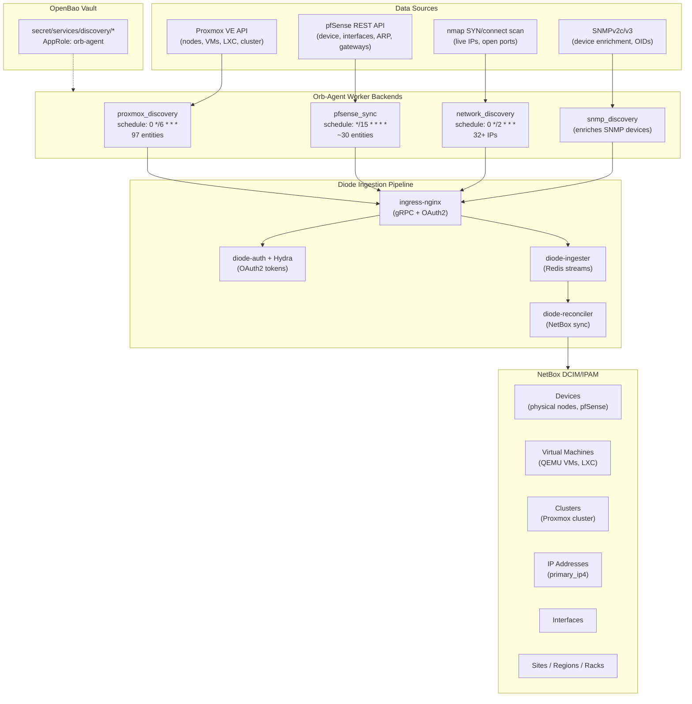

# NetBox Discovery Pipeline Architecture

**Date:** 2026-04-04 (original) / **2026-05-06** (converted to architecture reference)
**Status:** IMPLEMENTED — Core pipeline (Phases 1-2c) complete and operational. Phase D (SNMPv3) and E (LLDP) are deferred extensions.

---

## Overview

The NetBox discovery pipeline automatically populates NetBox DCIM/IPAM with infrastructure data from multiple sources. Four orb-agent worker backends collect data via APIs, network scans, and SNMP, then push entities through the Diode ingestion pipeline into NetBox. The pipeline runs on a schedule via Semaphore and requires no manual data entry for supported device types.

---

## Pipeline Architecture



---

## Discovery Tiers

| Tier | Source | Worker | Schedule | Entities | What It Discovers |
|------|--------|--------|----------|----------|-------------------|
| **T1 -- Network Scan** | nmap | network_discovery | Every 2h | IPs, ports | Live hosts on {{ discovery_target_subnet }} |
| **T2 -- SNMP Enrichment** | SNMPv2c | snmp_discovery | With T1 | Device details | Hostname, manufacturer, model, interfaces, MACs |
| **T3 -- API Workers** | Proxmox REST | proxmox_discovery | Every 6h | 97 entities | Nodes, VMs, LXC, interfaces, guest IPs |
| **T3 -- API Workers** | pfSense REST | pfsense_sync | Every 15m | ~30 entities | Firewall device, interfaces, ARP, gateways |
| **T4 -- Topology** | LLDP/CDP | *(deferred)* | -- | Cables | Physical network connections |

---

## Worker Specifications

### proxmox_discovery (v3.0.0)

Custom orb-agent worker (`workers/proxmox_discovery/`). Queries Proxmox VE API for the complete cluster inventory.

**Entity mapping:**
```
Node      -> Device (role: hypervisor)     + Interface + IPAddress (primary_ip4)
VM (QEMU) -> VirtualMachine               + VMInterface + IPAddress (primary_ip4)
LXC       -> VirtualMachine               + VMInterface + IPAddress (primary_ip4)
Cluster   -> Cluster (type: "Proxmox VE", scope_site from inventory)
```

**Key behaviors:**
- `_build_node()` uses first IPv4 from management bridge interfaces for `primary_ip4`
- `_build_vm()` uses first guest agent IPv4 (falls back gracefully without agent)
- `_build_lxc()` uses first container IPv4
- `_pick_primary_ipv4()` skips loopback, link-local, and IPv6 addresses
- `_sanitize_description()` strips lines containing credential keywords before ingestion
- VMs and LXC use `VMInterface` (not `Interface`) and `assigned_object_vm_interface` for IP linking
- Resource fields (`vcpus`, `memory`, `disk`) are set directly on VirtualMachine
- Cluster name is queried from the Proxmox API (`prox.cluster.status.get()`)
- Credentials from OpenBao at `secret/services/discovery/proxmox_api/`

### pfsense_sync (v1.3.0)

Orb-agent worker (`workers/pfsense_sync/`). Queries pfSense REST API every 15 minutes.

**Entity mapping:**
```
pfSense   -> Device (role: gateway-router) + Interface + IPAddress (primary_ip4)
```

**Key behaviors:**
- Device name uses FQDN from pfSense
- Queries interfaces before device creation to find LAN interface by `descr == "LAN"` for primary IP
- Pushes interfaces, IPs, gateways, and ARP entries
- Site entity always emitted with lat/lon coordinates regardless of region
- Credentials from OpenBao at `secret/services/discovery/pfsense/`

### network_discovery

Orb-agent worker using nmap SYN/connect scans.

**Key behaviors:**
- Scans {{ discovery_target_subnet }} every 2 hours
- Discovers 32+ live IPs and open ports
- Creates bare IPAddress entities (no device association)

### snmp_discovery

Orb-agent worker for SNMPv2c device enrichment.

**Key behaviors:**
- Runs alongside network_discovery
- Enriches SNMP-responsive devices with hostname, manufacturer, model, interfaces, MACs
- Currently SNMPv2c; SNMPv3 upgrade deferred (see `plan/development/SNMPV3-UPGRADE-PLAN.md`)

---

## Organizational Hierarchy

All organizational data is templated from site-config inventory into `agent.yaml.j2`:

| Inventory Variable | NetBox Entity |
|-------------------|---------------|
| `discovery_region` | Region |
| `discovery_site_name` | Site |
| `discovery_site_latitude`, `discovery_site_longitude` | Site GPS coordinates |
| `discovery_location_name` | Location |
| `discovery_tenant_name` | Tenant |
| `discovery_rack_assignments` | Per-node rack mapping |
| `discovery_pfsense_device_role` | DeviceRole for pfSense |
| `discovery_pfsense_rack` | Rack for pfSense |

**Current state:**
- 1 region (US East), 1 site (Uhstray.io Datacenter), 1 location (Server Room)
- 2 racks (Server Rack, GPU Server Rack)
- 11 devices with rack assignment, 31 with tenant

---

## Deduplication Strategy

Each discovery source uses a unique `agent_name` / `app_name` to prevent cross-source conflicts:

| Source | Agent Name | Entity Types |
|--------|-----------|--------------|
| network_discovery | `netbox-discovery-agent` | IPAddress (bare) |
| snmp_discovery | `netbox-discovery-agent` | Device, Interface, IPAddress |
| proxmox_discovery | `proxmox-discovery-agent` | Device, VirtualMachine, Cluster, Interface, IPAddress |
| pfsense_sync | `pfsense-sync-agent` | Device, Interface, IPAddress |

**Merge rules:** Proxmox API is authoritative for nodes and VMs. pfSense REST API is authoritative for firewall devices. Network/SNMP discovery fills gaps for non-API-accessible devices.

---

## Cleanup Tooling

Diode is strictly additive -- it creates and updates but never deletes. Config renames, version bumps, or template variable changes create orphaned objects. The `cleanup-netbox.yml` playbook (Semaphore Template 57) provides safe, parameterized cleanup.

**Operations (all default off, dry_run=true for safety):**

| Operation | Extra Var | Description |
|-----------|-----------|-------------|
| Cleanup duplicates | `cleanup_duplicates=true` | Remove duplicate devices by strategy (tenant/lowest_id/highest_id) |
| Replace device | `replace_device_old=X replace_device_new=Y` | Delete old device when replacement exists |
| Migrate region | `migrate_region_old=X migrate_region_new=Y` | Move sites between regions, delete empty source |
| Migrate rack | `migrate_rack_old=X migrate_rack_new=Y` | Move devices between racks, delete empty source |
| Delete orphans | `delete_orphans=true` | Remove regions/racks/locations with zero references |
| Cleanup VMs as Devices | `cleanup_vm_orphans=true` | Remove Device entries that now exist as VirtualMachine (post-v3.0.0 migration) |

The cleanup playbook is a permanent operational tool, not a one-time fix.

---

## OpenBao Credential Organization

| Path | Contents | Used By |
|------|----------|---------|
| `secret/services/discovery/proxmox_api` | url, token_id, api_token | Proxmox worker |
| `secret/services/discovery/pfsense` | api_key, host | pfSense sync |
| `secret/services/discovery/snmp_v3` | username, auth_password, priv_password | SNMP (Phase D) |
| `secret/services/netbox` | All NetBox secrets | orb-agent, deploy |
| `secret/services/approles/orb-agent` | role_id, secret_id | orb-agent vault auth |

---

## Diode SDK Entity Coverage

**Currently used (17 types):** Cluster, ClusterType, Device, DeviceRole, DeviceType, Entity, Interface, IPAddress, Location, Manufacturer, Platform, Rack, Region, Site, Tenant, VirtualMachine, VMInterface

**Available in SDK v1.10.0 but not yet needed:** Cable, CircuitTermination, ConsolePort, FrontPort, PowerFeed, Prefix, RearPort, VLAN, VLANGroup, VRF, and 70+ more

---

## Deferred Extensions

### Phase D: SNMPv3 Upgrade

Moved to a dedicated plan: [SNMPV3-UPGRADE-PLAN.md](SNMPV3-UPGRADE-PLAN.md)

**Status:** DEFERRED
**Rationale:** SNMPv2c is sufficient for current device set. SNMPv3 adds authentication and encryption but requires per-device credential management.

### Phase E: LLDP Topology Discovery

**Status:** DEFERRED (awaiting test Proxmox cluster)
**Priority:** MEDIUM -- completes the physical topology picture
**Blocked by:** Requires installing lldpd on Proxmox hypervisors. Playbooks are on branch `feat/lldp-hypervisor-setup` -- to be tested on a dedicated Proxmox test cluster before production deployment.

LLDP maps physical cable connections -- which port on device A connects to which port on device B. This creates NetBox Cable entities linking interfaces across devices.

**Current state:**
- pfSense: lldpd installed and running, seeing switch neighbors
- Proxmox nodes: lldpd NOT installed

**Data collection approach:** SSH-based `lldpctl -f json0` (pfrest v2 does not expose LLDP via REST). Collected by Ansible playbook on schedule (every 6h), parsed and pushed to Diode as Cable entities.

**Implementation steps (when unblocked):**
1. Install lldpd on Proxmox nodes (`install-lldpd.yml`)
2. Collect LLDP topology and push to Diode (`collect-lldp-topology.yml`)
3. Validate Cable entities in NetBox (`check-discovery.yml` extension)

**Diode SDK Cable entity pattern:**

```python
from netboxlabs.diode.sdk.ingester import Cable, Entity, GenericObject, Interface, Device, DeviceType, Manufacturer, Site

a_term = GenericObject(
    object_interface=Interface(
        name="eth0",
        device=Device(name="hypervisor-01", device_type=DeviceType(model="...", manufacturer=Manufacturer(name="...")), site=Site(name="...")),
    )
)

b_term = GenericObject(
    object_interface=Interface(
        name="port24",
        device=Device(name="switch-01", device_type=DeviceType(model="...", manufacturer=Manufacturer(name="...")), site=Site(name="...")),
    )
)

cable = Cable(
    a_terminations=[a_term],
    b_terminations=[b_term],
    status="connected",
    label="LLDP-discovered",
)
entities.append(Entity(cable=cable))
```

**Device name resolution:**

| LLDP Field | NetBox Match |
|------------|-------------|
| Chassis sysName | Device.name (exact match or FQDN to hostname) |
| Port ID (ifname) | Interface.name on the matched device |
| Port description | Fallback for interface name if Port ID is a MAC |
| Management IP | Fallback device lookup via IPAddress.address |

Unresolved neighbors (devices not in NetBox) are logged but do not create cables.

---

## Dropped Approaches

| Approach | Why Dropped | Alternative |
|----------|-------------|-------------|
| NAPALM device_discovery | No FreeBSD driver for pfSense, Linux driver useless for Proxmox | pfSense REST + Proxmox API workers |

---

## Implementation History

The following phases were completed during initial development and are documented here for context on design decisions made.

| Phase | Date | What Was Done |
|-------|------|---------------|
| 1. pfSense REST API sync | 2026-04-05 | Worker package, 15m schedule, FQDN naming, gateway-router role |
| 2a. Proxmox cluster metadata | 2026-04-16 | Worker for nodes/VMs/LXC, resource annotations, Proxmox API auth |
| 2b. Proxmox guest network | 2026-04-16 | Guest agent IP queries, graceful fallback |
| 2.5. Seed data templating | 2026-04-17 | Organizational hierarchy from inventory vars into agent.yaml.j2 |
| 2.6. Cleanup tooling | 2026-04-18 | Generic parameterized cleanup playbook (Semaphore Template 57) |
| 2c-i. Primary IPv4 | 2026-04-21 | All devices/VMs get primary_ip4 via restructured builders |
| 2c-ii. Cluster modeling | 2026-04-21 | VMs/LXC as VirtualMachine entities, Cluster from API |
| 2c-iii. GPS coordinates | 2026-04-21 | Site entity always emitted with lat/lon |
| 2c-iv. Description sanitization | 2026-04-21 | Credential keyword stripping before Diode ingestion |

---

## Operational Lessons

1. **Semaphore inventory is an inline copy** -- it does NOT read from `site-config/inventory/production.yml`. Must be synced manually via API PUT when inventory vars change. This caused a duplication incident (34 to 63 devices).

2. **YAML `>-` breaks Python in Ansible** -- folded scalar collapses multi-line Python into one line, destroying indentation. Use `ansible.builtin.shell` with literal `|` scalar and bash heredoc (`<< 'PYSCRIPT'`).

3. **Diode is additive-only** -- never deletes. Any config rename, version bump, or template variable change creates orphans. The cleanup playbook is a permanent operational tool, not a one-time fix.

4. **NetBox v2 API tokens** with pepper-based hashing may return "Invalid v1 token" -- workaround: use Django management shell via Semaphore for admin operations.
