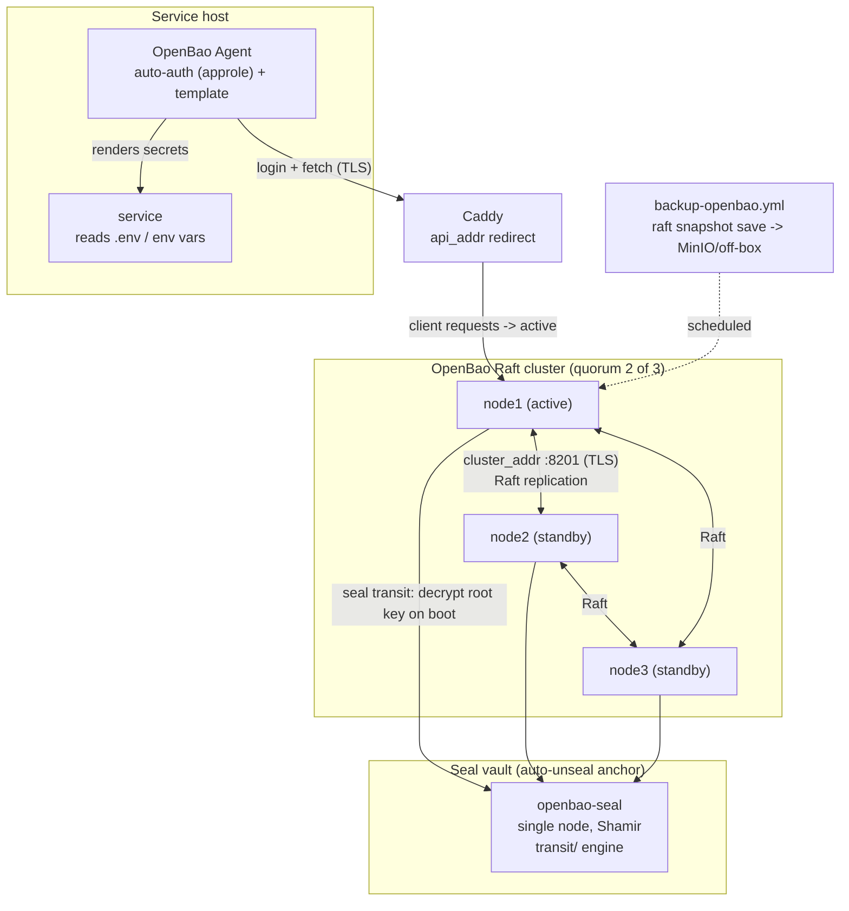
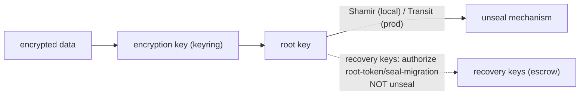

# OpenBao HA & Resilience Deployment Plan

> **Location:** `plan/development/OPENBAO-HA-DEPLOYMENT.md`
> **Date:** 2026-06-14 · **Status:** PROPOSED · **Owner:** uhstray-io
>
> **Context:** OpenBao is the platform's root of trust — every deploy, every AppRole login, and every service `.env` flows from it (root `CLAUDE.md` → Secrets Management). Yet it is today the least-resilient component in the stack. Local-dev *was* in-memory (a `podman machine` restart wiped all secrets and bricked every stateful volume — see [[local-openbao-is-in-memory-vm-restart-resets-all-secrets]]); that is now fixed with a persistent file backend (Track A, Phase A1 — landed). Production runs a **single-node Raft** vault with **manual Shamir unseal** (sealed after every reboot — a standing "High" risk in `IMPLEMENTATION_PLAN.md:1616` and a manual SSH operation in `ACCESS-BOUNDARIES.md:57`), **no TLS** (`tls_disable = 1`), **no snapshots**, and a **legacy bash `deploy.sh`** that generates secrets + writes policies + creates AppRoles itself — a direct violation of Critical Rules #2/#4. This plan makes local-dev resilient for testing and brings production to a convenient, self-healing HA cluster.
>
> **For agentic workers:** Execute phase-by-phase; every phase ends at a validation gate. The root/recovery keys and unseal material are the crown jewels — `no_log` every task that touches them, escrow them to site-config, never commit them. Real domains/IPs stay in site-config. TLS (Phase B0) is a hard prerequisite for Raft HA — do not reorder it.

**Goal:** A single source of truth for platform secrets that (a) survives restarts unattended, (b) tolerates a node failure in production without a credential outage, and (c) is deployed and operated entirely through the composable Semaphore/Ansible pattern — no hand-rolled bootstrap, no manual unseal, no on-VM `secrets/` directory.

**Architecture:** Both environments converge on **Integrated Storage (Raft)** — single-node locally, a 3-node quorum in production. Production nodes **auto-unseal** via an OpenBao **Transit** seal so they come back unsealed (and therefore HA-capable) after any reboot. Listener + cluster traffic run over **TLS issued by the existing step-ca internal CA**. Services stop hand-rolling token lifecycle and receive secrets through the **OpenBao Agent** (auto-auth + templating). Deploy/operate is composable: `templates/openbao.hcl.j2` → `deploy.sh` (containers only) → minimal genesis init/unseal play → `apply-openbao-policies.yml` → `manage-approle.yml`, with scheduled `backup-openbao.yml` Raft snapshots.

**Tech stack:** OpenBao (Integrated Storage/Raft, Transit auto-unseal, Agent), step-ca (internal TLS, already deployed — `INTERNAL-CA-DEPLOYMENT.md`), composable Ansible tasks (`manage-secrets`, `manage-approle`, `apply-openbao-policies`, `clean-service`), Semaphore templates-as-code, Proxmox VMs.

---

## Problem

| # | Gap | Evidence | Impact |
|---|-----|----------|--------|
| 1 | **Single-node Raft, no quorum/failover** | prod `config/openbao.hcl`: `node_id="node1"`, `cluster_addr=http://127.0.0.1:8201` (loopback) | OpenBao VM loss = total platform credential outage |
| 2 | **Manual Shamir unseal, no auto-unseal** | `site-config/CLAUDE.md:95` "OpenBao starts sealed"; `IMPLEMENTATION_PLAN.md:1616` ("High"), `:1664` ("Auto-unseal — deferred"); `ACCESS-BOUNDARIES.md:57` | Every reboot needs a manual SSH unseal; a **sealed standby cannot fail over** [4] |
| 3 | **No snapshot/backup** | no `bao operator raft snapshot` anywhere in repo; DR Scenario 3 is an unchecked stub | No recovery path for storage corruption / lost quorum |
| 4 | **TLS disabled** | `tls_disable = 1` in prod + local HCL; `openbao_addr: http://192.168.1.164:8200` | Secrets cross the LAN in plaintext; **TLS is a hard prerequisite for Raft cluster traffic** [1][4] |
| 5 | **No OpenBao Agent** | clients use bespoke curl/`uri` (`bao-client.sh`, `manage-secrets.yml`) | Token lifecycle hand-rolled; no caching/renewal sidecar |
| 6 | **Legacy non-composable deploy** | `deploy.sh` generates secrets + writes policies + creates AppRoles + seeds (violates Rules #2/#4); "Deploy OpenBao" template wraps it; no `clean-deploy-openbao.yml` | Unauditable, non-idempotent, contradicts every other service |
| 7 | **Init/secret escrow gaps** | root token never revoked (`IMPLEMENTATION_PLAN.md:1666`); `site-config/secrets/openbao/` referenced but **absent**; no audit device (`:1670`) | Long-lived root token on VM; no audit trail; manual key backup |
| 8 | **Storage-backend fork local↔prod** | local-dev = `file`; prod = `raft` | Local never exercises the Raft path prod runs (init/unseal/snapshot untested) |

---

## Design Principles

Aligned with root `CLAUDE.md` → *Engineering Principles — Foundational Over One-Shot* and `AUTOMATION-DECLARATIVE-VS-IMPERATIVE.md`:

1. **One codebase, no forks.** Local-dev and prod use the **same Raft backend** and the **same `openbao.hcl.j2`**, differing only by inventory vars (`node_id`, `retry_join`, TLS paths, seal stanza). Kill the file-vs-raft fork (Problem #8).
2. **Genesis is the only imperative step.** First-init, first-unseal, and the auto-unseal bootstrap are irreducibly one-directional (`AUTOMATION-DECLARATIVE-VS-IMPERATIVE.md:99`); everything else (policies, AppRoles, secrets, snapshots) reconciles declaratively. Do **not** reproduce the 594-line hand-rolled `deploy.sh`.
3. **deploy.sh handles containers only** (Critical Rule #2). Secret generation, policy writes, AppRole creation, and seeding move to `manage-secrets` / `apply-openbao-policies` / `manage-approle`.
4. **Convenience = unattended recovery.** A node (or the whole cluster) must come back **unsealed and serving** after a reboot with zero human steps — this is the entire point of auto-unseal, and the prerequisite for real HA standbys [4].
5. **Resiliency = no single point of total loss.** Quorum survives one node; snapshots survive storage loss; recovery keys survive a seal-service outage [seal-concept].
6. **The blast radius is the platform.** TLS in transit, an audit device, least-privilege policies applied **everywhere** (including local), and a revocable root token.

---

## Decision Criteria

This section makes the rejected options visible so the chosen path reads as a decision, not an assumption.

### D1 — Storage backend

| Option | HA-capable | External dep | Verdict |
|--------|-----------|--------------|---------|
| **Integrated Storage (Raft)** | **Yes** | None (embedded) | **CHOSEN** — doc-recommended "for most use cases"; transactional; HA built-in [1, raft] |
| PostgreSQL | Yes | External DB to run + monitor + back up | Rejected — adds an HA dependency we'd also have to make HA |
| `file` | No | None | Rejected for prod (not transactional, no file locking, "not for production" [1]); **retained as the shipped local baseline** until A5 migrates local to single-node Raft |
| `inmem` | No | None | The original bug — never again |

Raft also forbids a separate `ha_storage` stanza (it *is* the HA layer) [1], simplifying config.

### D2 — Unseal strategy

| Option | Reboot behavior | Convenience | Resiliency caveat | Verdict |
|--------|-----------------|-------------|-------------------|---------|
| **Transit auto-unseal** (dedicated seal vault) | Auto-unseals on boot → standby-ready | High (zero human steps) | Seal service is a hard dependency/SPOF; mitigate with HA seal node + **recovery keys** [seal-concept] | **CHOSEN for prod** |
| Cloud KMS auto-unseal (AWS/GCP/Azure) | Auto-unseals | High | External cloud dependency — conflicts with privacy-focused/self-hosted posture | Rejected (no cloud trust anchor) |
| Manual Shamir | **Stays sealed** until human unseals | Low | Sealed standbys can't fail over [4] | Rejected for prod (the current pain); **kept for local** single-node (1-of-1, key escrowed) |

**Why Transit, not KMS:** the platform is self-hosted and privacy-focused (root `CLAUDE.md`). A small dedicated OpenBao "seal" instance gives auto-unseal with no third party. The SPOF is acknowledged and mitigated: the seal vault is itself snapshotted, and **recovery keys** (Shamir-split, PGP-encrypted, escrowed to site-config) authorize break-glass root-token generation and seal migration if the seal service is ever lost [seal-concept].

### D3 — Secret delivery to services

| Option | Token lifecycle | Verdict |
|--------|-----------------|---------|
| **OpenBao Agent** (auto-auth + template/env-inject) | Owned by the Agent sidecar — auto-renew, cache, re-render | **CHOSEN (phased, B5)** — replaces bespoke `bao-client.sh` token juggling [2] |
| Bespoke API (`manage-secrets.yml` / `bao-client.sh`) | Hand-rolled; `renew-self` sprinkled across policies | Status quo — kept for deploy-time `.env` templating; superseded for long-running runtime secret refresh |

### D4 — HA topology

3-node Raft is the MVP (quorum 2, tolerates 1 failure); 5 nodes is the later high-tolerance option. Odd counts only. All nodes **must be unsealed** to act as standbys [4] — which is exactly why D2 chose auto-unseal.

### D5 — Local-dev backend (the live tension)

Phase A1 shipped a **`file`** backend (proven, persistent, solves the immediate restart bug). The no-fork principle (D1, Principle #1) wants local on Raft too. Resolution: **keep `file` as the working baseline** and treat **single-node Raft migration as Phase A5** — a clean, low-risk upgrade that (a) makes local exercise prod's exact backend and (b) unlocks `bao operator raft snapshot` locally. We do *not* rip out the just-landed, currently-recovering file backend to chase parity mid-incident.

---

## Architecture

### Target production topology

Three OpenBao nodes form a Raft quorum behind Caddy; each auto-unseals from a dedicated Transit seal vault on boot, so a reboot or single-node loss never seals the cluster. Services obtain secrets via a local OpenBao Agent rather than calling the API directly.

### Why each address matters (HA correctness)

`api_addr` is the URL standbys hand back to clients for redirect; `cluster_addr` (`:8201`, always TLS) is the server-to-server forwarding/replication address and is **required** for Raft [1][4]. Misconfiguring either silently breaks HA — clients get redirected nowhere, or nodes can't replicate. Both must be the node's **reachable** address (not loopback, the current bug in Problem #1).

### Seal/unseal key hierarchy

Auto-unseal moves the top of the key chain out of human hands: the external Transit service decrypts the root key on boot, which unlocks the keyring, which unlocks data [seal-concept]. Recovery keys exist for break-glass but **cannot themselves unseal** — if the seal service is permanently lost, the cluster is unrecoverable even from backups [seal-concept]. That caveat drives the seal-vault-must-be-backed-up requirement.

---

## Implementation Phases

### Track A — Local-dev resilience

#### Phase A1 — Persistent file backend *(LANDED — 2026-06-14)*

`bootstrap-local-dev.yml` Stage 1 now runs `openbao server` (not `-dev`) on a `file` backend in the named volume `local-openbao-data` (at `/openbao/file`, the image-owned path), with idempotent init (1 share / 1 threshold) + unseal using the key persisted to `~/.agent-cloud-local/openbao-init.json` (0600), KV v2 enable, a recreate-if-still-dev migration, and a lost-key guard. `make local-clean` is the sole intentional wipe (now also removes the data volume + init/config artifacts).

**Acceptance (met):** container restart preserves secrets; re-unseal with the persisted key restores access (validated). `ansible-playbook --syntax-check` + shellcheck clean.

#### Phase A2 — Local snapshot / restore

- **Files:** `Makefile` (`local-bao-snapshot`, `local-bao-restore` targets), `scripts/local-dev.sh` (subcommands).
- File backend: snapshot = `podman stop local-openbao` → tar the volume → timestamped artifact under `~/.agent-cloud-local/snapshots/`; restore = reverse. After A5 (Raft), switch to `bao operator raft snapshot save/restore`.
- **Acceptance:** snapshot before a risky op, corrupt the volume, restore → secrets intact.

#### Phase A3 — Restart self-heal (unseal-on-boot)

- **Problem:** the bootstrap `podman run` has no `--restart` and unseal only happens when the operator re-runs `make`; a bare machine reboot leaves the container stopped/sealed.
- **Files:** convert local OpenBao to a **podman Quadlet** (`~/.config/containers/systemd/local-openbao.container`) or add `--restart=always` + a tiny `local-openbao-unseal` boot hook that reads `openbao-init.json` and POSTs `/v1/sys/unseal`.
- **Acceptance:** `podman machine stop && start` → vault auto-unseals with no `make` invocation.

#### Phase A4 — Init-key escrow

- Copy `openbao-init.json` into a second location (and optionally age/gpg-encrypt it) so a single-file loss isn't fatal. Document in `docs/LOCAL-DEV.md`.
- **Acceptance:** delete the primary init file, restore from escrow, bootstrap unseals.

#### Phase A5 — Migrate local to single-node Raft *(kills the fork)*

- Switch the inline local HCL to `storage "raft"` + `node_id` + `cluster_addr` (required for Raft [1]); same `openbao.hcl.j2` prod uses, single-node params.
- **Acceptance:** fresh `make local-clean && make local-up` inits a Raft node; `bao operator raft snapshot save` works locally; A2 switches to raft snapshots.

#### Phase A6 — Policy parity

- Run `apply-openbao-policies.yml` against the local instance so `config/policies/*.hcl` (least-privilege per-service) are exercised locally, not just the inline `local-semaphore` policy.
- **Acceptance:** local vault carries the same named policies as prod; a per-service AppRole login is denied paths it shouldn't read.

### Track B — Production HA

#### Phase B0 — TLS (prerequisite for everything else)

- **Files:** `templates/openbao.hcl.j2` (listener `tls_cert_file`/`tls_key_file`, `cluster_addr`), `tasks/mint-internal-cert.yml` reuse (step-ca already issues internal certs — `INTERNAL-CA-DEPLOYMENT.md`), site-config TLS path vars.
- Issue an OpenBao server cert from step-ca; enable listener TLS (`tls_min_version = "tls12"`); flip `openbao_addr` to `https://`.
- **Acceptance:** `bao status` over TLS; AppRole login over `https://`; step-ca root trusted by clients. **Gate: no plaintext :8200.**

#### Phase B1 — Composable deploy/operate (replace legacy deploy.sh)

- **Files:** `templates/openbao.hcl.j2` (parameterized: `node_id`, `retry_join` peers, TLS, seal stanza, `performance_multiplier = 1`, `disable_mlock = true`), slimmed `deploy.sh` (containers only), new `deploy-openbao.yml` (place-monorepo → manage-secrets → deploy.sh → minimal genesis init/unseal reconcile → verify), `clean-deploy-openbao.yml` (via `tasks/clean-service.yml`), `platform/semaphore/templates.yml` (repoint "Deploy OpenBao", add "Clean Deploy OpenBao").
- Delete secret-gen / policy-write / AppRole-create / seed logic from `deploy.sh`; policies come from `apply-openbao-policies.yml`, AppRoles from `manage-approle.yml`. Keep a documented `-e github_deploy_key=` / `-e bao_init=` break-glass for the irreducible genesis chicken-and-egg.
- **Acceptance:** a clean prod deploy stands up OpenBao with **zero secrets generated in bash**; re-running converges; `clean-deploy` wipes + rebuilds.

#### Phase B2 — Transit auto-unseal

- **Files:** stand up `openbao-seal` (single node, Shamir, `transit/` engine, snapshotted); add `seal "transit" { ... }` to `openbao.hcl.j2` (address, token, key_name, mount_path, tls_*); init cluster nodes with `recovery_shares`/`recovery_threshold` (+ `recovery_pgp_keys`); escrow recovery keys to `site-config/secrets/openbao/` (**create this dir**).
- The transit token must be **orphan + periodic** with `update` on `transit/encrypt/<key>` + `transit/decrypt/<key>` only [seal-transit].
- **Acceptance:** restart a node → it auto-unseals (no human); recovery keys generate a root token; **seal-vault backup verified** (its loss = cluster loss [seal-concept]).

#### Phase B3 — 3-node Raft cluster

- **Files:** Proxmox provisioning for `openbao-{1,2,3}` (`hypervisor/proxmox/`), per-node inventory (`node_id`, `raft_retry_join` peer list, `api_addr`, `cluster_addr`), autopilot defaults.
- Bring up node1, `retry_join` node2/node3; verify `bao operator raft list-peers`; step down active and confirm a standby takes over (all unsealed via B2).
- **Acceptance:** kill the active node → a standby becomes active, secret reads continue; rejoin → autopilot re-adds it.

#### Phase B4 — Snapshots / backup / DR

- **Files:** `backup-openbao.yml` (`bao operator raft snapshot save` → MinIO/off-box), Semaphore "Snapshot OpenBao" template + schedule, documented restore in `DISASTER-RECOVERY-PLAN.md` (Scenario 3).
- **Acceptance:** scheduled snapshot lands off-box; restore into a fresh cluster reproduces secrets.

#### Phase B5 — OpenBao Agent rollout

- **Files:** Agent config per service host (`auto_auth` approle reading a **response-wrapped** secret_id, `cache { persist }`, `template`/`env_template` rendering `.env` or injecting env vars), incrementally replacing `bao-client.sh` runtime calls [2].
- Start with one service (e.g. n8n), prove auto-renew across token expiry, then fan out.
- **Acceptance:** a service's secrets refresh without a redeploy when rotated in OpenBao; no service-side login/renew code.

#### Phase B6 — Hardening

- Enable an **audit device** (`bao audit enable`); **revoke the genesis root token** after AppRoles exist; finalize all Semaphore templates-as-code; pin `openbao_svc` `container_engine` in production.yml.
- **Acceptance:** audit log captures secret access; no live root token; `setup-templates.yml` reproduces every OpenBao template.

---

## Validation Criteria

| Check | Command / signal | Pass condition |
|-------|------------------|----------------|
| Local persistence (A1) | restart `local-openbao`, re-unseal | secret read back intact ✅ (done) |
| Local self-heal (A3) | `podman machine stop && start` | vault unsealed, no `make` run |
| Local Raft (A5) | `bao operator raft list-peers` | one node, leader |
| TLS (B0) | `bao status` / login over `https://` | no plaintext :8200 reachable |
| Composable deploy (B1) | grep `deploy.sh` for secret/policy/approle gen | none; deploy converges on re-run |
| Auto-unseal (B2) | restart a node | comes back unsealed unattended |
| HA failover (B3) | stop active node | standby serves reads within seconds |
| Snapshot/restore (B4) | restore snapshot into fresh cluster | secrets reproduced |
| Agent (B5) | rotate a secret in OpenBao | service picks it up without redeploy |
| Audit (B6) | read a secret, tail audit log | access recorded; root token revoked |

---

## Security Considerations

- **Crown-jewel material** — unseal key (local), recovery keys + transit token (prod), genesis root token: every task touching them carries `no_log: true` (per [[feedback_no_log_and_permissions]] — `no_log` is reserved for exactly these credential-handling tasks, written as discrete functions). They are escrowed to `site-config/secrets/openbao/`, never committed.
- **Seal-service SPOF** — auto-unseal makes the Transit seal vault a hard dependency: its permanent loss makes the cluster unrecoverable *even from backups* [seal-concept]. Mitigations: the seal vault is itself snapshotted (B4), and **recovery keys** provide break-glass root-token generation / seal migration.
- **TLS everywhere (B0)** closes the current plaintext-secret-on-LAN exposure (Problem #4) and is mandatory for Raft cluster traffic.
- **Least privilege** — `config/policies/*.hcl` applied in **both** environments (A6); the `semaphore-read` super-policy (`sys/policies/acl/*` + `auth/approle/role/*`) stays scoped to the orchestrator only.
- **Audit + root revocation (B6)** — given read-all policies exist (`nemoclaw-read`, `semaphore-read`), an audit device and a revoked genesis root token are required to bound blast radius.
- **Break-glass genesis** — OpenBao's own deploy can't fetch its GitHub deploy key from itself; the documented `-e github_deploy_key=` extra-var is the *only* sanctioned manual injection, scoped to first deploy.

---

## Cross-references

- Root `CLAUDE.md` — Secrets Management, Critical Deployment Rules #2/#4, OpenBao Secrets Layout
- `plan/architecture/AUTOMATION-COMPOSABILITY.md` — composable task pattern this plan adopts
- `plan/architecture/AUTOMATION-DECLARATIVE-VS-IMPERATIVE.md` — genesis-only-imperative principle (`:96`, `:99`)
- `plan/development/INTERNAL-CA-DEPLOYMENT.md` — step-ca, the TLS issuer for Phase B0
- `plan/development/LOCAL-DEV-DEPLOYMENT.md` — local control-plane bootstrap (Track A host)
- `plan/development/DISASTER-RECOVERY-PLAN.md` — Scenarios 2/3/7 fulfilled by B4
- `plan/development/IMPLEMENTATION_PLAN.md` — `:1616` (sealed-after-reboot risk), `:1664–1672` (auto-unseal/audit/root-revoke deferred), `:1813`/`:1827` (3-node Raft, snapshots)
- `plan/architecture/ACCESS-BOUNDARIES.md` — `:57` (manual unseal as standing SSH op, retired by B2)
- site-config — `inventory/production.yml` (`openbao_svc`, `openbao_addr`), `CLAUDE.md:95` (sealed-on-boot known issue), `secrets/openbao/` (to be created in B2)

### References (OpenBao docs, accessed 2026-06-14)

1. Configuration — https://openbao.org/docs/configuration/ (+ storage/raft, listener/tcp, seal children)
2. Agent & Proxy — https://openbao.org/docs/agent-and-proxy/
3. Internals: Architecture — https://openbao.org/docs/internals/architecture/
4. Internals: High Availability — https://openbao.org/docs/internals/high-availability/
- seal-concept — https://openbao.org/docs/concepts/seal/ · seal-transit — https://openbao.org/docs/configuration/seal/transit/

> **Unverified against fetched pages (confirm before quoting as OpenBao-official):** exact quorum/fault-tolerance numbers and autopilot operator defaults (`min_quorum`, `cleanup_dead_servers`, …); `bao operator raft snapshot save/restore` + `list-peers`/`remove-peer` CLI syntax; the precise `disable_mlock` guidance text; multi-seal `priority`. These live in the operator/CLI docs not fetched here.

---

## Revision History

| Date | Summary |
|------|---------|
| 2026-06-14 | Initial draft. A1 (persistent local file backend) landed; Tracks A/B and decision criteria authored from OpenBao docs + repo current-state assessment. |
