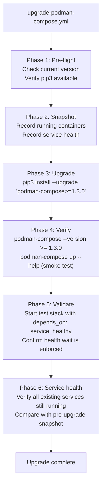
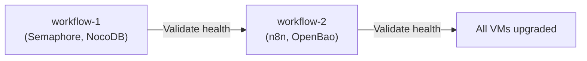

# Podman-Compose Upgrade Plan

**Date:** 2026-05-06
**Status:** PLANNING
**Priority:** HIGH
**Effort:** Low (pip upgrade + validation)
**Impact:** High (unblocks compose spec compliance for all Podman services)
**Depends on:** None (can execute immediately)
**Blocks:** Simplifying deploy scripts to rely on `depends_on: service_healthy`

---

## Problem

All Podman VMs in the platform run podman-compose 1.0.6 (installed via pip). This version has critical limitations:

1. **`depends_on: condition: service_healthy` is ignored** -- containers start in dependency order but do NOT wait for healthchecks. Application containers start before their database is ready, causing connection errors. Every deploy script must implement manual health-wait loops to compensate.

2. **Volume `name:` property is silently ignored** -- volumes always get auto-generated names (`{project}_{volume}`). Explicit naming requires `--project-name` workarounds.

3. **YAML merge key (`<<: *anchor`) may not work** -- shared environment blocks via anchors are unreliable.

4. **Compose spec extensions (`x-` prefix) may be mishandled** -- custom extension fields used for shared config blocks may cause parse errors.

These limitations force deploy scripts to work around compose features that should be handled by the compose engine itself. The workarounds add complexity, increase deploy time (sequential health polling), and create a divergence between how compose files are written (with `depends_on` conditions) and how they actually behave.

See `plan/architecture/PODMAN-VS-DOCKER-COMPOSE.md` for the full compatibility matrix.

---

## Current State

| VM | Role | Podman | podman-compose | Services |
|----|------|--------|---------------|----------|
| workflow-1 | Semaphore, NocoDB | 4.9.3 | 1.0.6 | Semaphore, NocoDB |
| workflow-2 | n8n, OpenBao | 4.9.3 | 1.0.6 | n8n, OpenBao |

NetBox runs on Docker and is not affected by this upgrade.

---

## Target

| Component | Current | Target | Rationale |
|-----------|---------|--------|-----------|
| podman-compose | 1.0.6 | >= 1.3.0 | Enforces `depends_on: service_healthy`, supports volume `name:` |
| Podman | 4.9.3 | >= 4.0 (no change needed) | Already meets minimum |

**Target tool:** `podman-compose` (Python CLI wrapper, installed via pip). NOT `podman compose` (Go-based native plugin). The platform standardizes on the Python CLI exclusively.

---

## Approach

### Ansible Playbook: `upgrade-podman-compose.yml`

A new playbook that upgrades podman-compose on all Podman VMs via pip, verifies the upgrade, and validates that `depends_on: service_healthy` works correctly afterward.



### Playbook Structure

```yaml
# platform/playbooks/upgrade-podman-compose.yml
- name: "Upgrade podman-compose on {{ target_service | default('podman_hosts') }}"
  hosts: "{{ target_service | default('podman_hosts') }}"
  gather_facts: true
  become: false
  vars:
    _min_version: "1.3.0"
    _target_version: ">=1.3.0"

  tasks:
    # Phase 1: Pre-flight
    - name: "Check current podman-compose version"
      command: podman-compose --version
      register: _pc_version_before
      changed_when: false

    - name: "Display current version"
      debug:
        msg: "Current: {{ _pc_version_before.stdout }}"

    - name: "Verify pip3 is available"
      command: pip3 --version
      register: _pip_check
      changed_when: false
      failed_when: _pip_check.rc != 0

    # Phase 2: Snapshot existing state
    - name: "Record running containers"
      command: podman ps --format '{{ "{{" }}.Names{{ "}}" }}'
      register: _containers_before
      changed_when: false

    # Phase 3: Upgrade
    - name: "Upgrade podman-compose via pip"
      pip:
        name: "podman-compose{{ _target_version }}"
        executable: pip3
        state: latest

    # Phase 4: Verify upgrade
    - name: "Check new podman-compose version"
      command: podman-compose --version
      register: _pc_version_after
      changed_when: false

    - name: "Display upgraded version"
      debug:
        msg: "Upgraded: {{ _pc_version_after.stdout }}"

    # Phase 5: Validate depends_on enforcement
    # (Uses a minimal test compose file with healthcheck dependency)

    # Phase 6: Verify existing services still running
    - name: "Record running containers after upgrade"
      command: podman ps --format '{{ "{{" }}.Names{{ "}}" }}'
      register: _containers_after
      changed_when: false

    - name: "Compare container lists"
      assert:
        that: _containers_before.stdout_lines | sort == _containers_after.stdout_lines | sort
        fail_msg: >-
          Container list changed after upgrade.
          Before: {{ _containers_before.stdout_lines | sort }}
          After: {{ _containers_after.stdout_lines | sort }}
```

---

## Rollout Strategy

### One VM at a time

Upgrade VMs sequentially, not in parallel. Validate service health after each VM before proceeding.



### Rollout order

1. **workflow-2 first** (n8n, OpenBao) -- lower risk; OpenBao is a single container with no `depends_on` conditions. n8n has health dependencies but is less critical than Semaphore.
2. **workflow-1 second** (Semaphore, NocoDB) -- Semaphore is the orchestration platform; upgrade it last to ensure the upgrade playbook can still run if workflow-2 has issues.

### Rollback

If the upgrade causes issues:

```bash
# Rollback to exact previous version
pip3 install podman-compose==1.0.6

# Verify rollback
podman-compose --version

# Restart affected services
podman-compose -f compose.yml up -d
```

The upgrade only modifies a Python package (no system packages, no Podman binary changes). Rollback is a single pip install command.

---

## Validation Checklist

### Per-VM validation (automated by playbook)

- [ ] `podman-compose --version` reports >= 1.3.0
- [ ] All containers that were running before the upgrade are still running
- [ ] `podman-compose up -d` succeeds on each service's compose file
- [ ] Container health statuses are unchanged

### depends_on enforcement test (manual or automated)

Create a temporary test compose file with a deliberately slow healthcheck:

```yaml
# /tmp/test-healthcheck-compose.yml
services:
  slow-db:
    image: docker.io/postgres:16-alpine
    environment:
      POSTGRES_PASSWORD: testonly
    healthcheck:
      test: ["CMD-SHELL", "pg_isready -U postgres"]
      interval: 2s
      timeout: 2s
      retries: 5
      start_period: 10s

  app:
    image: docker.io/alpine:latest
    command: echo "app started"
    depends_on:
      slow-db:
        condition: service_healthy
```

**Expected behavior after upgrade:**
- `slow-db` starts first
- `app` does NOT start until `slow-db` healthcheck passes
- Before upgrade (1.0.6): `app` starts immediately (bug)
- After upgrade (>= 1.3.0): `app` waits for `slow-db` to be healthy

### Post-upgrade service validation

Run the existing service health checks:

```bash
# Via Semaphore
ansible-playbook validate-all.yml
```

---

## Post-Upgrade Cleanup

Once all VMs are confirmed on >= 1.3.0, the following simplifications become possible (but are NOT required immediately):

1. **Deploy scripts can simplify staged startup** -- Services with simple dependency chains (NocoDB, Semaphore) can use `compose up -d` and let compose enforce health ordering. Complex stacks (NetBox on Docker) should keep staged startup for first-boot migration timing.

2. **Volume `name:` property becomes usable** -- Though the current `--project-name` approach is still preferred for consistency.

3. **YAML merge keys become reliable** -- The n8n compose file's `<<: *n8n-env` pattern can be used confidently.

4. **Documentation updates** -- Remove "CRITICAL: ignored in podman-compose < 1.3.0" warnings from `PODMAN-VS-DOCKER-COMPOSE.md` once all VMs are upgraded.

These simplifications should be tracked as separate tasks, not bundled into the upgrade itself.

---

## Semaphore Integration

### New template

Add to `platform/semaphore/templates.yml`:

```yaml
- name: "Upgrade podman-compose"
  playbook: "platform/playbooks/upgrade-podman-compose.yml"
  description: "Upgrade podman-compose to >= 1.3.0 on Podman VMs"
  extra_vars:
    target_service: "podman_hosts"
```

### Inventory group

Add a `podman_hosts` group to site-config inventory that includes all VMs using Podman as their container runtime:

```yaml
podman_hosts:
  children:
    nocodb_svc: {}
    n8n_svc: {}
    semaphore_svc: {}
    openbao_svc: {}
```

---

## Timeline

| Step | Action | Duration | Risk |
|------|--------|----------|------|
| 1 | Write `upgrade-podman-compose.yml` playbook | 1 hour | None |
| 2 | Add Semaphore template and inventory group | 15 min | None |
| 3 | Upgrade workflow-2 (n8n, OpenBao) | 15 min | Low |
| 4 | Validate workflow-2 services | 15 min | None |
| 5 | Upgrade workflow-1 (Semaphore, NocoDB) | 15 min | Medium (Semaphore is orchestrator) |
| 6 | Validate workflow-1 services | 15 min | None |
| 7 | Run `validate-all.yml` across all services | 10 min | None |
| **Total** | | **~2 hours** | |

---

## Dependencies and Related Plans

| Document | Relationship |
|----------|-------------|
| `plan/architecture/PODMAN-VS-DOCKER-COMPOSE.md` | Parent reference; documents all compatibility issues this upgrade resolves |
| `plan/architecture/AUTOMATION-COMPOSABILITY.md` | Composable playbook patterns; the upgrade playbook follows the same conventions |
| `platform/playbooks/install-docker.yml` | Pattern reference for idempotent infrastructure playbooks |
