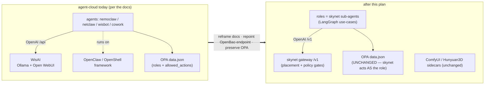

# Plan — align agent-cloud docs with the skynet replacement + harvest its use-cases

> **Origin / provenance.** Authored in the **skynet** repo
> (`github.com/uhstray-io/skynet`, `docs/agent-cloud-doc-migration-plan.md`) and raised here
> per CONTRIBUTING (plans live in `plan/development/`). This is skynet's *recommendation* for
> realigning agent-cloud's docs; cross-references below to skynet docs — `DESIGN-DECISIONS.md`
> (Qn/§n), `use-case-catalog.yaml`, `agent-cloud-requirements.md` — live in the skynet repo.
> The `[n]` references point to **agent-cloud's own** files.

**Premises (given):** skynet replaces agent-cloud's **AI inferencing/backend** (WisAI's
LLM plane) and replaces the **NemoClaw/OpenClaw** agent framework.

**Boundary discipline.** skynet authored this as a *recommendation*; the edits land as
agent-cloud PRs (skynet doesn't edit agent-cloud unilaterally). It is the doc-alignment
counterpart to the skynet repo's `agent-cloud-requirements.md` (which tracks *capabilities*
skynet needs). Decisions referenced: skynet `DESIGN-DECISIONS.md` Q5 (WisAI replacement), Q3
(sub-agent OPA identity), §14/§15.

The two things that must NOT get lost in the reframe:
- **What persists:** the OPA role catalog (`data.json` nemoclaw/netclaw) + `agent_actions.rego`
  — the *authorization contract*. skynet acts **as** these roles (least-privilege, Q3).
- **What stays separate:** the non-LLM inference sidecars (ComfyUI image-gen, Hunyuan3D
  3D-gen, vLLM-reserved) — out of skynet's LLM-gateway scope; skynet may route to them as
  modality backends later, but they are NOT replaced.

---

## The shift this plan documents

Today agent-cloud's docs describe WisAI as the inference plane and OpenClaw as the
agent framework, with each agent a client of WisAI. After this plan, skynet's `/v1`
is the inference backbone and the agents are skynet sub-agent *roles*; the OPA
authorization contract is untouched.

## Decision criteria

Three choices drive the plan; the rejected options are recorded so the path isn't read
later as an assumption.

- **WisAI's LLM plane — replace, keep, or dual-run?** *Chosen: replace.* skynet's `/v1`
  adds placement scheduling + policy gates that Open WebUI structurally lacks, and keeps
  data on-box; one inference plane is simpler to operate; there's no cutover pressure
  because WisAI's *platform integration* is unbuilt [1][2]. This **reverses** agent-cloud's
  explicit "no separate inference gateway" decision [1:32]. *Rejected:* keeping WisAI
  (loses policy + placement); dual-run behind a selector (two planes to maintain, no
  durable benefit).
- **NemoClaw/OpenClaw — one super-identity, per-role identities, or keep OpenClaw?**
  *Chosen: skynet replaces the framework, keeps the per-role OPA identities* (skynet acts
  *as* `netclaw`/`nemoclaw`). It reuses agent-cloud's existing `data.json` catalog [4] and
  preserves least-privilege. *Rejected:* one `skynet` super-identity (needs the union of
  all roles' permissions — a least-privilege regression, Q3); keeping OpenClaw/OpenShell
  (fails the "replace NemoClaw/OpenClaw" premise).
- **Use-case harvest — wait for agent-cloud's docs, or infer now?** *Chosen: infer now*
  from OPA `allowed_actions` + the agent READMEs, define in skynet's catalog, and have
  agent-cloud's (empty) `context/use-cases/` dirs reference back. The per-agent use-case
  dirs are empty `.gitkeep` stubs [5], so waiting blocks indefinitely; defining-first makes
  skynet's catalog the single source of truth.

## Source context

This plan rests on a repo inventory of agent-cloud (read 2026-06-23). Load-bearing facts:

- The inference backbone is documented as WisAI (Ollama workers + Open WebUI coordinator,
  OpenAI-compatible), with the explicit assumption *"No separate inference gateway is
  planned… agents consume Open WebUI directly"* [1][2], surfaced to agents via README [3]
  and kickstart [6]. The endpoint indirection is `secret/services/inference/endpoint` [2].
- NemoClaw is deployed as an OpenShell + OpenClaw container (Docker, not Podman) [7]; the
  durable authorization contract is the OPA `data.json` role catalog (`nemoclaw`/`netclaw`
  with per-service `allowed_actions`) [4] — the part that persists.
- The per-agent `context/use-cases/` dirs (nemoclaw, netclaw, cowork) are empty stubs;
  WebSmith's context is the one richly-populated set [5].
- Non-LLM inference is separate: ComfyUI image-gen and Hunyuan3D 3D-gen sidecars [3] — out
  of skynet's LLM-gateway scope.

### References (agent-cloud files)

- [1] `plan/development/WISAI-DEPLOYMENT-PLAN.md` (esp. :32 "no separate inference gateway")
- [2] `plan/development/IMPLEMENTATION_PLAN.md:230-246` (WisAI backbone, endpoint secret)
- [3] `README.md:109,129-133` (services table, sidecars)
- [4] `platform/services/opa/deployment/policies/agentcloud/data.json` (role catalog)
- [5] `agents/{nemoclaw,netclaw,cowork}/context/use-cases/` (empty `.gitkeep`); `agents/websmith/context/` (populated)
- [6] `kickstart.md:13,26,414` ("clients of WisAI")
- [7] `agents/nemoclaw/deployment/{README,CLAUDE}.md` (OpenShell + OpenClaw, Docker)

## Part 1 — Reframe WisAI → skynet (the inference backbone)

**The flip:** WisAI's *LLM plane* (Ollama workers + Open WebUI coordinator, the
OpenAI-compatible endpoint behind `secret/services/inference/endpoint`) is replaced by
**skynet's gateway `/v1`**. Agents repoint to skynet's `/v1` — same OpenAI-compatible
protocol, so it's a drop-in *plus* placement scheduling + policy gates that Open WebUI
lacks. **Load-bearing assumption to reverse:** `WISAI-DEPLOYMENT-PLAN.md` line 32 +
`IMPLEMENTATION_PLAN.md` line 238 say *"No separate inference gateway is planned… agents
consume Open WebUI directly."* skynet **is** that gateway now, by design.

| agent-cloud doc | current assumption | recommended change |
|---|---|---|
| `README.md` (109, 129-133) | "WisAI — Local LLM inference backbone (Ollama + Open WebUI)" | "skynet — local-first, policy-gated inference backbone (OpenAI-compatible `/v1`, placement scheduler, policy gates)". Mark `inference-ollama`/`inference-webui` **legacy → superseded by skynet**; keep `inference-comfyui`/`inference-hunyuan3d` (sidecars); note `inference-vllm` may become a skynet backend. |
| `CLAUDE.md` (19, 72-73) | "Backed by: WisAI — Ollama + Open WebUI" | "Backed by: skynet — OpenAI-compatible `/v1`, multi-backend placement, policy-gated." |
| `kickstart.md` (13, 26, 414) | "All four agents are clients of WisAI" | "clients of **skynet's `/v1`**." |
| `plan/development/WISAI-DEPLOYMENT-PLAN.md` | the whole WisAI deploy plan | **Archive** to `plan/archive/` with a superseded banner pointing at skynet. Preserve the Ollama-vs-vLLM hardware reasoning as provenance (still useful) — skynet now owns that placement decision. |
| `plan/development/IMPLEMENTATION_PLAN.md` (82, 151, 230-246) | WisAI backbone + "No separate inference gateway" + per-agent WisAI bindings | Repoint the inference-backbone section + the NemoClaw/NetClaw/WisBot/Cowork bindings to skynet `/v1`. **Reverse** the "no separate gateway" decision (skynet is the gateway *because* it adds placement + policy). |
| OpenBao `secret/services/inference/endpoint` | WisAI URL + token | Repoint value to skynet's `/v1` URL + bearer token. **Keep the OpenBao indirection** (one swap, all consumers follow). This is the actual cutover lever. |

**Stays untouched:** `inference-comfyui/CLAUDE.md`, `inference-hunyuan3d/CLAUDE.md` (non-LLM).

## Part 2 — Reframe NemoClaw/OpenClaw → skynet sub-agent roles

**The flip:** skynet replaces the **OpenClaw/OpenShell framework** (the harness + sandbox +
Docker deployment). The **roles** (`nemoclaw`, `netclaw`) persist as **OPA identities +
LangGraph use-case sets** that skynet runs. The `data.json` catalog is the durable contract,
unchanged; skynet queries OPA *as* the role (Q3).

| agent-cloud doc | current assumption | recommended change |
|---|---|---|
| `agents/nemoclaw/deployment/{README,CLAUDE}.md` | "OpenShell + OpenClaw; Docker not Podman; fork is source" | Reframe: nemoclaw is a **skynet sub-agent role** (an OPA identity + its catalog use-cases), not an OpenShell/OpenClaw container. **Archive** the OpenShell/OpenClaw/Docker deployment specifics (provenance). |
| `plan/development/NETCLAW-INTEGRATION-PLAN.md` | "NetClaw built on OpenClaw, sibling of NemoClaw; deploy as standalone OpenClaw VM (Option A)" | Reframe: netclaw is a skynet sub-agent role; the OpenClaw harness is replaced by skynet's orchestrator. Supersede "Option A (separate OpenClaw VM)." |
| `README.md` (12, 88-89) + `CLAUDE.md` (18, 68) | agent list "NemoClaw (headless), NetClaw (network), WisBot, Cowork" | NemoClaw/NetClaw → **skynet sub-agent roles** (skynet is the runtime; roles are policy identities + use-case sets). Clarify **WisBot** (Discord, external image) and **Cowork** (on user's device) are **consumers of skynet `/v1`**, not OpenClaw agents. |
| `platform/services/opa/.../data.json` + `agent_actions.rego` | role catalog + policy | **PRESERVE.** Add one line that skynet is now the runtime acting as these roles. This is the persistence point. |

## Part 3 — Harvest agent-cloud use-cases → skynet's catalog (define-first)

Most `agents/*/context/use-cases/` dirs are **empty `.gitkeep` stubs** — the real workload
definitions live in the agent READMEs + the OPA `allowed_actions`. So the harvest is
*infer-from-(OPA + README)*, then define as skynet catalog entries. Bidirectional close-out:
agent-cloud's empty `context/use-cases/` dirs then **reference skynet's catalog** as the one
source of truth.

Per harvested use-case, extract: `id · consumer · caller(role) · capability · io_contract ·
output_consumer · privacy · OPA {agent,service,action} · category(A/B/C/D)`.

| source (agent-cloud) | workload → candidate skynet use-case | category | OPA {agent,service,action} | catalog status |
|---|---|---|---|---|
| `agents/netclaw` (OPA + README) | netbox device add | A | netclaw/netbox/create | **done** (build #1) |
| `agents/netclaw` | config backup, topology discovery, SNMP/nmap health, pfSense read | A/B | netclaw/{netbox,snmp,nmap,pfsense}/… | seed `netclaw-network-reasoning` exists; expand |
| `agents/nemoclaw` (OPA + README) | deploy approved service | A | (semaphore run_task) | **done** (build #2 in catalog) |
| `agents/nemoclaw` | GitHub issue triage/CI-CD, n8n workflow trigger, NocoDB task queue | A/B | nemoclaw/{github,n8n,nocodb}/… | **harvest** → new catalog entries |
| `agents/websmith/context` (rich: 5-phase + catalogs) | website spec authoring | C | (none — human_chat) | seed `websmith-spec` exists; enrich with phases |
| `agents/cowork` (stub + README) | research / architecture / doc-gen | C | (none) | seed `cowork-architecture` exists |
| `agents/wisbot` | Discord LLM chat | C | (consumer of /v1) | consumer, not a role — note only |
| `inference-comfyui`, `inference-hunyuan3d` | image / 3D gen | — | — | **NOT harvested** (non-LLM; future modality backends) |

## Part 4 — Execution & sequencing

1. **skynet-side (now):** finalize this harvest table → draft the new catalog entries
   (define-first). Pure skynet work; no agent-cloud dependency.
2. **agent-cloud PRs (framing first):** `README.md` / `CLAUDE.md` / `kickstart.md` headline
   reframe (WisAI→skynet, NemoClaw/OpenClaw→roles) → then the plan docs (archive
   `WISAI-DEPLOYMENT-PLAN.md`, reframe `IMPLEMENTATION_PLAN.md` inference section +
   `NETCLAW-INTEGRATION-PLAN.md`). **Preserve** the OPA files.
3. **Cutover (coordinated):** repoint `secret/services/inference/endpoint` to skynet `/v1`;
   migrate consumers one at a time (Q5, no parallel-run fallback). Gated on skynet's model
   ladders being filled (skynet Phase 5) and on the netclaw↔Semaphore decision (skynet
   `agent-cloud-requirements.md` N3).

## Target outcome

When this plan has landed (across agent-cloud PRs + skynet catalog entries):

- agent-cloud's docs name **skynet** as the inference backbone; `secret/services/inference/endpoint`
  resolves to skynet's `/v1`, so every agent reaches inference through one policy-gated,
  placement-scheduled surface. The "no separate inference gateway" assumption is gone.
- `nemoclaw`/`netclaw` are documented as **skynet sub-agent roles** — skynet is the runtime,
  the OPA `data.json` catalog is unchanged, and skynet queries OPA *as* the role
  (least-privilege). The OpenClaw/OpenShell deployment docs are archived as provenance.
- skynet's `use-case-catalog.yaml` is the **single source of truth** for AI workloads;
  agent-cloud's previously-empty per-agent `context/use-cases/` dirs reference it.
- The non-LLM sidecars (ComfyUI, Hunyuan3D) and the OpenBao endpoint-indirection pattern are
  untouched; WisBot and Cowork are documented as *consumers* of `/v1`, not sub-agents.

The net: a reader landing in agent-cloud sees one inference plane (skynet), a stable OPA
authorization contract, and a clear pointer to skynet's catalog for "what the agents do" —
with no lingering WisAI/OpenClaw assumptions to mislead them.

## Risks / open questions

- Role-as-identity persistence depends on the **netclaw↔Semaphore** decision (skynet
  `agent-cloud-requirements.md` N3, A vs B) — resolve before the nemoclaw/netclaw reframe ships.
- Empty `context/use-cases/` dirs mean the harvest is **inferred** — validate each with
  agent-cloud owners before treating it as canonical.
- **Don't over-reframe:** WisBot + Cowork are *consumers*, not sub-agent roles; the inference
  sidecars are *not* replaced.
- Prod telemetry: skynet's GenAI telemetry has no agent-cloud ingest yet (agent-cloud's Alloy
  has no OTLP receiver enabled + no Tempo) — unrelated to this doc work, but don't let the
  reframe imply skynet telemetry lands in agent-cloud today.
