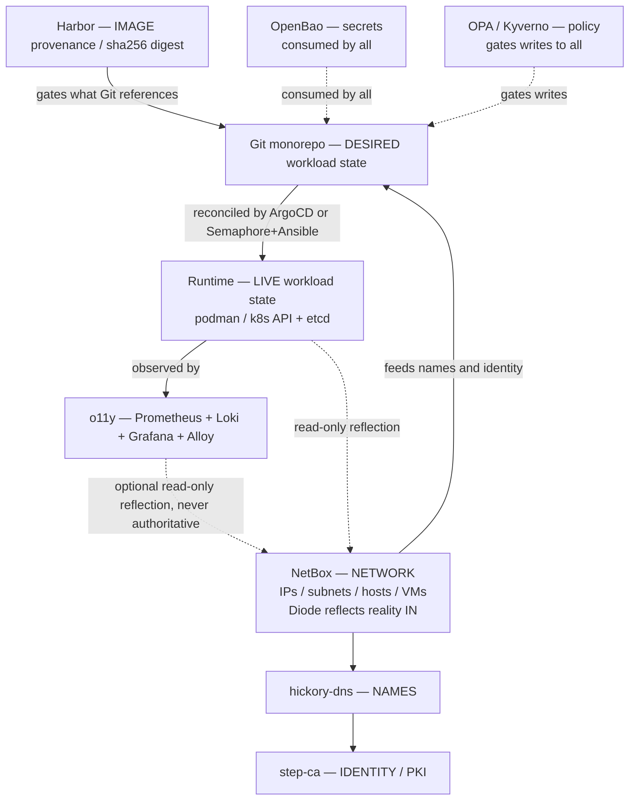

# Source of Truth — Architecture Decision Record & Development Plan

**Status:** Architecture ENDORSED (maintainer-approved direction); development plan PROPOSED.
**Owner:** Platform architecture.
**Scope:** Defines the single authoritative source for every cross-cutting concern in agent-cloud, the invariants that keep those authorities from drifting, and the phased work to realize the model as the platform moves from single-site Compose/Podman toward multi-site Kubernetes/k0s.

---

## Goal

Establish **exactly one authoritative source per concern** across the platform, with a named, CI-enforceable set of invariants so that:

- humans and AI agents always know *where* a fact lives and *which* direction it flows;
- no second writer or "convenience" reflection can silently invert authority;
- the model degrades honestly during the long Compose→k8s transition instead of pretending the future state already exists.

This document is **both** an architecture decision record (PART I) and a development plan (PART II). It is the canonical reference cited from `CLAUDE.md` and `plan/architecture/architecture-reference.md`.

## Architecture summary

agent-cloud splits source-of-truth **by concern**, never by store. Network/IP/host facts live in **NetBox** (fed by the Diode pipeline). Desired workload state lives in **Git** (compose today, Kustomize under `platform/k8s/` tomorrow, reconciled by ArgoCD). Live workload state lives in the **runtime itself** (`podman` today, the Kubernetes API/etcd in the k8s era). Image provenance lives in **Harbor**. Telemetry lives in the **o11y** stack. Secrets live in **OpenBao**. Policy lives in **OPA** (agent actions) and **Kyverno** (k8s admission). Any unified inventory pane is a strictly **read-only reflection** that may flow *into* NetBox but never out — the same shape the live Diode `proxmox_discovery`/`pfsense_sync` workers already implement.

This maps directly onto the four-layer guardrails model and the AI-loop invariant in `plan/architecture/AUTOMATION-DECLARATIVE-VS-IMPERATIVE.md` §8: **AI proposes → guardrails validate → automation executes.** Agents *read* every SoT but *write* to none directly; they emit proposals (Git PRs, NetBox journal entries via the discovery path, OpenBao via `tasks/manage-secrets.yml`) that pass the Guardrail layer.

## Status grounding (verified against the repo, 2026-06-16)

| Component | Verified state |
|-----------|----------------|
| NetBox + Diode | **LIVE.** `proxmox_discovery` worker is the 873-line v3.0.0 package at `platform/services/netbox/deployment/workers/proxmox_discovery/proxmox_discovery/__init__.py` (the outer `workers/proxmox_discovery/__init__.py` is the empty package shim). Scheduled **every 15 min** (`*/15 * * * *`, `agent.yaml.j2` line 149), not 6h. `pfsense_sync` also 15 min. |
| `roles.yaml` | Reserves `kubernetes-cluster` and `container` device roles (lines 9–10) — **unused today**, awaiting the k8s reflection. |
| `scripts/local-netbox-discover.sh` | **SHIPPED and non-compliant.** Writes containers as `VirtualMachine` objects into NetBox via the Django ORM (`manage.py shell`) inside the container — no token, no Diode, no `source` tag, no prune (`update_or_create` only). This is the current live-inventory reflection and it violates the read-only-reflection invariant this document codifies. |
| OpenBao | **LIVE.** Prod is single-node Raft with `tls_disable = 1` (`platform/services/openbao/deployment/config/openbao.hcl` lines 5, 8). **No `backup-openbao.yml` exists** in `platform/playbooks/` — zero backup playbooks present. |
| OPA | LIVE (Rego under `platform/services/opa/.../policies/`). |
| Kyverno, k0s, ArgoCD, Harbor, MetalLB/Cilium-LB, ESO | **PLANNED.** `platform/k8s/{base,bootstrap,overlays/{dev,staging,prod}}` are `.gitkeep`-only. Zero `metallb`/`ipaddresspool`/ESO references anywhere in `platform/`. |
| `compose.prod.yml` | **Does not exist.** `platform/lib/common.sh:compose()` has two branches only: `LOCAL_MODE=true` → `-f compose.yml -f compose.local.yml`, else `-f compose.yml`. |
| hickory-dns / step-ca / Caddy | LIVE in local-dev; the §12A genesis order is OpenBao→dns→step-ca→caddy→authentik→Semaphore-LAST. |

---

# PART I — Architecture (Decision Record)

## 1. The layered SoT model

There are **six concern layers**, each with exactly one authority. They form a directed dependency chain, not a set of peers:



The chain is **directed**: Harbor gates what Git references; Git gates what the reconciler applies; the reconciler gates what the runtime holds; the runtime is observed by o11y; o11y/runtime may be *reflected* read-only into NetBox. NetBox supplies network/name/identity facts *upward* to everything. Reflections only ever close the loop **into** NetBox, never back out.

## 2. Per-concern authority table

| Concern | Source of truth | Status | Fed by / reconciled by |
|---------|-----------------|--------|------------------------|
| Network: IPs, subnets, prefixes, physical + virtual hosts (Proxmox VMs, VLANs, pfSense, k8s **nodes** as VMs) | **NetBox** (IPAM/DCIM + Virtualization model) | LIVE | Diode pipeline: `network_discovery` (nmap/SNMP), `pfsense_sync`, `proxmox_discovery` (Cluster/VM/VMInterface, 15-min cadence). Reality flows IN. |
| Management/node subnet, **LB/MetalLB pool prefix**, ingress VIP allocation, aggregate CNI pod/service CIDRs | **NetBox** (IPAM `Prefix` objects with explicit role/status) | LIVE (pools = PLANNED) | Authored in site-config inventory as Prefixes; the cluster allocates *within* the ranges. |
| DESIRED workload state — compose tier (single-site prod, all local-dev) | **Git**: per-service `compose.yml` base (env-parameterized) + `compose.local.yml`/`compose.prod.yml` overlays + inventory vars | LIVE | Semaphore → Ansible (`tasks/manage-secrets` → `deploy.sh`) → `compose()` in `platform/lib/common.sh`. |
| DESIRED workload state — k8s tier (multi-site prod) | **Git**: `platform/k8s/base/<svc>` + `platform/k8s/overlays/{dev,staging,prod,site-<name>}` | PLANNED | ArgoCD reconciles human-merged Git. Base is **derived** from compose (see §3, Decision D1). |
| LIVE workload state — what IS running (containers/pods, replicas, placement, running digest) | **The runtime itself**: `podman`/compose on the compose tier; **Kubernetes API (etcd)** on the k8s tier | LIVE (k8s = PLANNED) | Emergent; never authored. Read via the tier-bound LIVE-state contract (§7). |
| Proxmox VMs / virtual hosts (substrate) | DESIRED: `proxmox/vm-specs.yml` (Git/site-config; schema `platform/hypervisor/proxmox/vm-specs.example.yml`). OBSERVED: **NetBox** via `proxmox_discovery`. | LIVE | `provision-vm.yml` consumes the spec; discovery reflects what exists. |
| Container images / tags / versions / provenance / scan results | **Harbor** — identity is the **`@sha256` digest**; tag is a mutable label | PLANNED (interim: Git-pinned tags) | `build-and-push-image.yml` (Trivy + Cosign), `promote-image.yml` (retag + **resolve to digest**). |
| Runtime telemetry: metrics, logs, traces, alerts, health | **o11y** (Prometheus + Loki + Grafana + Alloy) | LIVE | Alloy scrapes/ships; never authoritative for desired or network state. |
| Secrets & credentials | **OpenBao** (KV v2) | LIVE | `tasks/manage-secrets.yml`; `.env`/templated configs are gitignored reflections, NOT SoT. |
| Policy / authorization | **OPA** (agent-action authz, Rego) + **Kyverno** (k8s admission) | OPA LIVE; Kyverno PLANNED | Policy-as-code under `platform/services/opa/` and `platform/k8s/`; PR-gated. |
| Internal DNS names / zones (`*.agent-cloud.test`) | **hickory-dns** (zones-as-code) | LIVE (local-dev) | Rendered from inventory `dns_records`; consumes NetBox-allocated IPs. Direction: IPAM → DNS only. |
| Internal identity / PKI (root, intermediate, leaf certs) | **step-ca** (root in `step-ca-data` volume; key password in OpenBao) | LIVE (local-dev) | SANs derived from DNS/IPAM. Direction: IPAM → DNS → PKI. |
| L7 ingress / reverse-proxy routing (compose tier) | **Caddy config** (config-as-code) | LIVE (local-dev) | DNS-01 against step-ca; routes `*.agent-cloud.test`. See §4 Decision D7. |
| Unified inventory / cross-concern pane (optional) | **NONE — a read-only PROJECTION** into NetBox, never an authority | OPTIONAL | A Diode-style read-only reflection; deletable with zero authoritative loss. |

## 3. Core invariants

These are the load-bearing rules. Each is **machine-enforceable** (CI guard targets named in PART II, Phase 1).

- **INV-1 — Single authority per concern.** Every concern in the table has exactly one authoritative store. If a fact can be edited authoritatively in two places, there are two sources of truth — which is a defect, full stop.
- **INV-2 — Reflections are read-only and flow only INTO a SoT.** A reflection records observed reality into a SoT (the Diode `proxmox_discovery`/`pfsense_sync` flow is the canonical reference). It must never write back out. Reference counter-example *currently in the repo*: `scripts/local-netbox-discover.sh` (a token-less ORM writer) — scheduled for retirement (Phase 1).
- **INV-3 — Authority is never inverted.** Network reality flows into NetBox; NetBox never drives the runtime (NetBox → pfSense is forbidden; `pfsense-sync.py` is one-way). NetBox is never the workload/container SoT. The cluster never becomes the IP allocator for ranges NetBox owns.
- **INV-4 — Ephemeral state never pollutes IPAM.** Pod `/32`s, Service ClusterIPs, and other churn are **never** ingested into NetBox. NetBox records the **aggregate CIDR block** (status=reserved) for collision protection; the members live in etcd/o11y only.
- **INV-5 — Derived artifacts are not SoTs and are never hand-edited.** A `kompose`-generated `platform/k8s/base/<svc>` is a build artifact regenerated in CI; the only hand-authored k8s deltas live in overlays. A service has **at most one hand-authored desired-state surface per runtime tier.** (See Decision D1.)
- **INV-6 — Image identity is the `@sha256` digest, end-to-end.** Harbor digest == Git reference == running image == Kyverno verify target. Mutable tags (including any fixed tag, not just `:latest`) are human labels only and are insufficient to identify the running bytes.
- **INV-7 — No SoT has a direct LLM writer.** Agents read all SoTs and mutate them only by emitting proposals through the Guardrail layer. No agent holds push-to-main, ArgoCD sync, etcd-write, or a NetBox/OpenBao raw-write credential.
- **INV-8 — Reflections carry freshness; stale = unknown.** Every reflected object carries a `source=<runtime>-reflect` tag and a `last-seen` timestamp. Agents treat any reflection past its TTL as *unknown*, never as authoritative. The orb-agent 15-min cadence is the precedent for the timestamp/TTL convention.

## 4. Resolved cross-domain decisions

These resolve the conflicts surfaced in the cross-challenge round. Each is a **decision**, not an average.

### D1 — k8s base manifests are DERIVED from compose, never hand-authored peers

**Conflict:** Platform proposed keeping *both* a hand-authored `compose.yml` and a hand-authored `platform/k8s/base` per service ("keep both"); Cloud proposed generating `base` from `compose.yml` via `kompose convert` in CI.

**Decision: Cloud wins. `compose.yml` is the single hand-authored desired-state artifact; `platform/k8s/base/<svc>` is a CI-generated, committed-but-never-hand-edited build artifact.** Overlays carry the only hand-authored k8s-specific deltas (replicas/HPA/PDB/Ingress/NetworkPolicy/digest pins).

**Rationale:** Two hand-authored desired-state files for one service is a fork by construction (INV-1, INV-5) and directly violates CLAUDE.md's one-codebase principle — they drift the moment someone edits an env var in one. A CI check fails any PR that edits `platform/k8s/base/<svc>` without regenerating it from `compose.yml`. Tier selection (compose vs k8s) is bound by inventory var (`cluster_mode`), not a runtime fork. A service is **fully migrated** to k8s only when its site is multi-site; until then its compose base is retained and remains the authored surface.

### D2 — ArgoCD prod sync is MANUAL (two gates); dev/staging may auto-sync

**Conflict:** Cloud wanted auto-sync+self-heal ON as default, relying on the human Git merge as the sole gate; Architecture argued that with AI agents authoring PRs, a single merge is insufficient mediation for prod.

**Decision: prod overlays default to ArgoCD auto-sync DISABLED (manual sync), with self-heal scoped to drift-correction only (revert out-of-band `kubectl` edits back to Git) — NOT auto-apply of newly merged desired state. Dev/staging overlays may auto-sync freely.** Promotion to prod requires an explicit human sync action — a two-gate path (PR merge + sync). Encoded as a per-overlay ArgoCD `syncPolicy` field, env-parameterized (no fork).

**Rationale:** Kyverno only catches the narrow class it has policies for (unsigned image, `:latest`, privileged); it cannot catch a policy-clean-but-semantically-bad change (wrong replica count, deleted NetworkPolicy, misrouted Ingress). Auto-sync collapses all safety onto PR review quality. Per INV-7, when AI agents are PR authors, prod RECONCILED-state mutation needs a second explicit human checkpoint where blast radius is highest. This preserves GitOps velocity for dev while keeping the AI-loop invariant intact for prod.

### D3 — The LB/MetalLB pool CIDR is OWNED by NetBox, consumed read-only by N enforcers, written to Git only via a CI-opened PR

**Conflict:** Network said NetBox owns the LB pool and Git "reads" the CIDR; Cloud/Infra noted that a live agent auto-writing the overlay CIDR would author a RECONCILED ArgoCD target (forbidden by INV-7), while a manual copy makes NetBox mere documentation that drifts.

**Decision: NetBox owns the LB pool as an IPAM `Prefix` (role=loadbalancer). On a prefix change, a Semaphore/CI job opens a PR bumping the overlay's pool CIDR (human-merged) — NetBox stays the range authority, Git stays the only thing ArgoCD reconciles, and no automation authors the reconciled target directly.** A Kyverno admission policy asserts any cluster-assigned VIP falls inside the NetBox-declared prefix — *that admission check, not the doc, is what makes NetBox authoritative at runtime.* The pool CIDR is the canonical example of "a boundary value owned by one SoT and consumed read-only by N enforcers" — the same shape as an OpenBao secret consumed by many services.

**LB controller is parameterized, not hard-coded.** k0s ships no MetalLB; the workload-LB choice (MetalLB IPAddressPool vs Cilium `CiliumLoadBalancerIPPool` vs kube-vip) differs in CRD kind and failure mode. The pool is expressed as a single CIDR value behind `lb_controller: metallb|cilium|kube-vip`; the CNI/LB stack is decided in Phase 3 **before** writing the pool manifest.

**Partition the management subnet explicitly.** NetBox carves three non-overlapping prefixes: a **Caddy/compose-tier ingress** range (role=ingress, status=active — added now, since Caddy is live), a **cluster LB pool** range, and a **Proxmox-VM** range. MetalLB is not the only VIP consumer; modeling it as such would collide with live Caddy allocations.

### D4 — k8s nodes link to NetBox VMs by an immutable VMID, never by `primary_ip4`

**Conflict:** Infra proposed merging the k8s node onto the existing `proxmox_discovery` `VirtualMachine` keyed on `primary_ip4 + name`; Network/Platform showed `primary_ip4` is a mutable, *derived* field (`_pick_primary_ipv4()` heuristic) that diverges from the kubelet `--node-ip` under multi-NIC clusters, causing mis-merge or silent duplication.

**Decision: correlate on a stable, network-independent identity — the Proxmox VMID — carried as a NetBox custom field and stamped onto the k8s node as a label by cloud-init/`provision-vm.yml` (`node-labels=proxmox-vmid=<vmid>`).** The reflection merges on `proxmox-vmid` (authored, immutable, single-valued), annotates the existing `VirtualMachine` (custom field `k8s-node: <cluster>/<nodename>`), and records the kubelet node-IP as an *additional* `VMInterface`/`IPAddress` — never a second `VirtualMachine`. Reuse the `kubernetes-cluster` role in `roles.yaml`.

**Two distinct reflection scopes, two write surfaces (resolves the Infra↔Cloud "merge vs scoped-token" conflict):** (a) the **node** reflection annotates the existing proxmox VM via the VMID join; (b) the **workload** reflection (LoadBalancer VIPs, ingress hostnames) writes into a dedicated `source=k8s-reflect` namespace/tag with a NetBox token scoped to only those objects, physically unable to mutate proxmox-authored VMs. Each domain described only half; both halves are required.

### D5 — Containers reflect as `container`-role Devices, NEVER as VirtualMachines; pruning happens only via tagged reconciliation

**Conflict:** `local-netbox-discover.sh` writes containers as `VirtualMachine` objects under a "Podman" ClusterType — colliding the container concern into the *same* model `proxmox_discovery` uses for real VMs (split authority, double-count). Platform proposed adding a prune step to that ORM script; Network/Infra showed a destructive ORM delete against the shared `VirtualMachine` table is itself the inversion risk (one bad query deletes real VM inventory).

**Decision: retire the ORM-shell write path.** Containers reflect as Devices with `role=container` (the role already reserved in `roles.yaml`, currently unused) under a dedicated `source=podman-reflect` tag — **never** as `VirtualMachine`. The VM model stays exclusively for hypervisor-backed VMs and k8s nodes. Route the reflection through the **same Diode pipeline** `proxmox_discovery` uses (a small podman-ps Diode worker), giving exactly one writer to NetBox and prune-on-absence for free. If Diode is genuinely unavailable in local-dev, the correct behavior is to **not write to NetBox at all** and expose the podman view through the LIVE-state read contract (§7) — a local-dev convenience must not ship a parallel un-reconciled writer. Prune is permitted *only* after writes are tagged, scoped strictly by `source=*-reflect` cluster/tag, with a refuse-to-touch-untagged guard asserted by test.

### D6 — Pod/Service CIDRs are per-site overlay variables allocated from a NetBox-owned supernet

**Conflict:** Cloud treated reserving pod/service CIDRs as a nice-to-have; Network showed default CNI behavior reuses identical CIDRs (e.g. `10.244.0.0/16`, `10.96.0.0/12`) on every cluster, making future site-to-site routing unroutable with no remedy short of re-IPing a live cluster.

**Decision: NetBox owns one aggregate supernet for all cluster pod CIDRs and another for all service CIDRs; each site is carved a non-overlapping block (status=reserved, role=container — aggregate only, never members per INV-4).** The per-site Kustomize overlay reads its pod-CIDR/service-CIDR as a variable sourced from that allocation (same single-CIDR-from-NetBox contract as D3). This makes future inter-site routing possible by construction and turns CIDR overlap from a latent unrecoverable bug into a collision NetBox already prevents.

### D7 — Caddy is the L7 routing SoT on the compose tier; its VIPs are NetBox allocations

**Gap closed:** No domain assigned an authority to L7 routing on the compose tier. Caddy is the actual authority for which `*.agent-cloud.test` name routes to which backend, and it does DNS-01 against step-ca.

**Decision: Caddy config (config-as-code) is the routing SoT on the compose tier; its bound VIPs/host-ports are authored NetBox IPAM allocations (role=ingress).** When k8s Ingress/Gateway arrives, the route-table authority is the k8s Ingress object (Git→etcd) for k8s-tier services and Caddy for compose-tier services — tier-bound, never both for one service. The reachable-name→backend mapping is part of the network read path (§7).

### D8 — IPAM → DNS → PKI is strictly one-directional; the cluster never self-allocates names from authored ranges

**Decision: the chain is NetBox (IP allocation) → hickory-dns (names) → step-ca (cert SANs), one direction only.** Authoritative A records for stable VIPs/hosts originate from the NetBox allocation. Reflected k8s LB VIPs may generate hickory records via the planned RFC-2136 dynamic sub-zone, **but** that sub-zone is delegated and scoped: the cluster may self-register names only for VIPs it bound *within the NetBox-owned LB pool* (enforced by D3's Kyverno in-range check). No hand-edit of hickory records or step-ca SANs to cluster IPs may bypass NetBox allocation. step-ca's issued-cert DB (which SANs are valid, expiry, revocation) is itself a queryable operational inventory and is backed up (Phase 1; cert expiry is a classic silent outage).

### D9 — SoT-store backup tiers, bootstrap order, and ownership

**Backup tiers (resolves the etcd Cloud↔Infra conflict):**

- **Tier-A — irrecoverable, MUST be backed up off-site:** Git remotes (GitHub + private site-config mirror); **OpenBao Raft data + unseal/recovery keys**; NetBox Postgres (human-curated IPAM/DCIM); Harbor Postgres + **blob store for any image with no reachable upstream** (relevant at network-isolated multi-sites — a privacy-platform selling point); **etcd/kine control-plane state**; and **PersistentVolume data** for any StatefulSet on k8s.
- **Tier-B — reconstructible from Tier-A:** every service VM (re-provisioned from `vm-specs.yml`); every `.env` (re-rendered by `tasks/manage-secrets.yml`); OpenBao policies/AppRoles (re-derived from `.hcl` via `apply-openbao-policies.yml` + `tasks/manage-approle.yml`); the NetBox host/network *reflection* (re-discovered); Harbor images whose source is Git+Dockerfile **iff** the build is reproducible (base images + pinned deps still available — an unverified link, see Risks).

**etcd is Tier-A, not "cheap to lose."** ArgoCD re-reconciles *desired* workload state, but etcd also holds runtime-authored state with no Git source: ESO-materialized Secrets, step-ca/cert-manager-issued leaf certs+keys, PV/PVC bindings, in-flight Jobs, ArgoCD's own app sync history and cluster registrations, and CNI/ClusterIP allocations (which Network assigns to etcd as authoritative). Recovery is a **multi-source replay in order**: restore etcd/kine snapshot → live control plane + ArgoCD + its OpenBao-sourced repo creds → ArgoCD re-reconciles from Git → Harbor restored from its own backup → PV data restored separately (Velero/restic). Detect the datastore type first: **k0s defaults to kine/SQLite for a single controller and uses etcd only for multi-controller HA** — back up whichever is actually present. **Recommendation: keep stateful services (Postgres, OpenBao, NetBox-DB) on Compose/Proxmox VMs even in the multi-site era**, so etcd genuinely stays stateless-and-reconstructible and the existing VM-volume backup story stays authoritative for the data that matters most.

**Bootstrap order (the §12A-derived acyclic chain — corrects the flattened "Proxmox→OpenBao→Semaphore"):**

```
Git (config + escrowed unseal keys in site-config)
  → Proxmox
  → OpenBao (genesis: file/no-TLS baseline, already shipped)
  → hickory-dns         (zone rendered from STATIC Git inventory, NOT NetBox — genesis only)
  → step-ca             (issues OpenBao's cluster TLS cert)
  → [re-key OpenBao onto step-ca TLS for the Raft-HA target]
  → Caddy
  → (Authentik)
  → Semaphore           (LAST, already OIDC-secured)
  → NetBox              (steady-state IPAM→DNS enrichment engages only after this)
  → everything else
  → [k8s era] k0s control plane → ArgoCD + ESO (AppRole seeded imperatively by Semaphore) → ArgoCD reconciles apps
```

Two chicken-and-eggs are named, not hidden: (1) **OpenBao↔step-ca TLS** — OpenBao genesis starts on the no-TLS baseline, step-ca then issues OpenBao's cert, OpenBao is re-keyed onto TLS (genesis is imperative, the rest reconciles). (2) **ESO↔OpenBao** — ESO runs in the cluster ArgoCD bootstraps from Git (which holds no secrets), yet ESO needs an OpenBao credential to start; the cycle is broken imperatively by Semaphore seeding the ESO SecretStore AppRole during control-plane bring-up (via `tasks/manage-approle.yml`), exactly as §12A seeds the secure foundation before the declarative layer takes over.

**Ownership (resolves the unowned `backup-openbao.yml` gap):** the OpenBao HA plan (`plan/development/OPENBAO-HA-DEPLOYMENT.md`) is the determining artifact and already specifies `backup-openbao.yml`. **The Secrets/OpenBao track AUTHORS `backup-openbao.yml`** (it requires raft-snapshot-token scoping, unseal/recovery-key escrow, Transit-seal interplay — all secrets-domain concerns). **The Infrastructure track OWNS the Semaphore schedule, the off-VM encrypted destination, retention, and the Tier-A/Tier-B DR classification.** Neither re-authors the other's part. The "who owns it" question is closed.

## 5. AI-agent read path (tied to the four-layer guardrails model)

| Layer | Agent action | SoT touched | Direction |
|-------|--------------|-------------|-----------|
| AI | NemoClaw/NetClaw/WisBot/Cowork form an intent | (reads only) | — |
| AI → Guardrail | Read DESIRED from **Git**; LIVE from **k8s API + o11y** (k8s tier) or **podman + o11y** (compose tier, §7); NETWORK/names/identity from **NetBox / hickory / step-ca**; images from **Harbor**; policy from **OPA** | all SoTs | READ |
| Guardrail | OPA authorizes the agent ACTION (e.g. `run_task`); Kyverno gates k8s admission | OPA / Kyverno | VALIDATE |
| Automation | The proposal becomes a Git PR (DESIRED), a NetBox journal/discovery entry (NETWORK enrichment), or an OpenBao write via `tasks/manage-secrets.yml` (secrets) — executed by Semaphore/Ansible/ArgoCD | the owning SoT | PROPOSE → human/gate → WRITE |
| Platform | The runtime converges; o11y observes; reflection (optional) records into NetBox | runtime → o11y → NetBox | OBSERVE / REFLECT |

**Per INV-7, no agent writes a SoT directly.** Each agent's `context/` docs must declare, as machine-readable metadata, which SoTs it READS and which it PROPOSES-TO, so CI can audit the invariant rather than trusting prose. `a2a-registry` is confirmed an agent-discovery (A2A) registry, **not** a workload SoT, and does not compete in this model — but it *is* a stateful service (FastAPI + SQLite/JSON) holding agent cards/registrations, so its store is assigned a backup tier (Tier-A if registrations are not re-derivable).

## 6. Alternatives considered and rejected

| Alternative | Why rejected |
|-------------|--------------|
| **NetBox as the CMDB of everything** (containers, pods, workloads, desired state) | Inverts authority (INV-3): NetBox would become a stale shadow of etcd the instant a pod restarts, and a second writer to desired state alongside Git. Pod-IP churn would flood IPAM (INV-4). The platform already proves the *correct* shape (Diode reflects reality IN, NetBox never drives the runtime); CMDB-of-everything throws that away. The shipped `local-netbox-discover.sh` is exactly this anti-pattern in miniature and is being retired (D5). |
| **Single graph DB / unified data model** (one store joins network + workloads + secrets + images) | Collapses six concerns with different consistency, churn, and blast-radius profiles (network changes slowly; pods churn by the second; secrets must never co-locate with workload metadata) into one SPOF with one access-control surface. Loses the directed-chain property and the per-concern backup tiering of D9. No single store is authoritative-by-construction for liveness the way etcd is, for IP collision the way NetBox is, or for secrets the way OpenBao is. |
| **Backstage (or similar developer-portal as SoT)** | A portal is a *read aggregator*, not an authority — exactly the role this model reserves for the optional read-only NetBox pane. Treating it as SoT recreates the CMDB inversion. It would also add a heavyweight Node/plugin service whose own state needs backing up, for a "single pane" the existing NetBox + o11y + ArgoCD UIs already provide read-only. agent-cloud's privacy posture favors fewer, self-hosted authorities over a broad portal surface. |
| **k8s base manifests as hand-authored peers of compose** | A fork by construction (D1/INV-5). |
| **etcd as the only LIVE-state SoT, flat across tiers** | False on the compose tier where no k8s API exists; would have agents read an API that isn't there (§7). |

## 7. The tier-bound LIVE-state read contract

**Problem (a permanent gap, not transitional):** the model says "agents read LIVE state from the k8s API," but (a) the compose tier has no k8s API, (b) multi-site means N per-cluster etcds, and (c) compose-tier single-site prod persists indefinitely alongside k8s. "LIVE = k8s API" fractures into a *set* of heterogeneous endpoints partitioned by site and runtime.

**Decision:** define a versioned **LIVE-state RESOLVER** — a thin read-only projection (NOT a new SoT) that answers "for service X, the live-read endpoint is …". It is *derived*: the `(service → site)` map comes from Git desired-state joined with NetBox (which site = which cluster/VMs); the `(site → runtime → endpoint)` map comes from inventory vars (`cluster_mode: compose|k8s` per site). This keeps NetBox out of the workload-SoT business while giving agents one logical interface.

**Per-tier binding (one logical interface, switched by `cluster_mode`, never a fork):**

- **Compose tier:** LIVE = `podman inspect` (running container + **digest read from inspect, not free-text comments**) + **Caddy config** (L7 routing/reachability) + **hickory-dns** (name resolution) + **o11y** (health). *Not* `podman ps` + o11y alone — that gives liveness but not the network-reachability fact an agent needs before acting, and would push agents to read Git-desired-as-live (the silent drift hole).
- **k8s tier:** LIVE = the cluster's k8s API (Service/Endpoint/Ingress + pod status + running digest) + o11y.

**Staleness has teeth (INV-8):** every resolver result and reflected object carries a `last-seen`/TTL; an agent treats stale/missing as **unknown**, never as "not running." The DNS-resolver cache adds a *third* invisible staleness layer (zone TTL ~60s) stacked on reflection cadence and record-render — agents resolving a name must treat the A record as a hint, re-validating against the runtime for action.

**Until the resolver exists, the contract is: agents MUST NOT treat Git desired-state as live-state.** This is the cross-domain gap both Architecture and Cloud named but neither closed for the compose tier; it is closed here.

---

# PART II — Development Plan

Phased, grounded in the verified repo state: NetBox + Diode + OpenBao + OPA + hickory + step-ca + Caddy are LIVE; `platform/k8s/*` is `.gitkeep`-only; k0s/ArgoCD/Harbor/Kyverno/ESO/MetalLB are PLANNED. Most value is in **Phase 1**, which is entirely doable *today* on the compose tier and is gated by nothing.

## Phase 1 — Compose-era hardening & the SoT contract (do now; no k8s dependency)

**1.1 Author this document's companion CI guards** — encode INV-1…INV-8 as grep/AST rules extending `.github/workflows/lint-and-test.yml`:
- fail if any code writes to NetBox outside the Diode/orb-agent path (this **starts in WARN mode** — it will flag `local-netbox-discover.sh` as expected — and flips to FAIL after that script is retired in 1.3, giving the invariant teeth + a deadline);
- fail on any committed `.env`/secret-bearing file (extend trufflehog) or a secret literal in a compose base;
- fail if `platform/k8s/base/<svc>` is edited without regeneration from `compose.yml` (INV-5, activates when bases exist);
- placeholder (documented) for the future Harbor digest-pin check (INV-6).
- *Touchpoints:* `.github/workflows/lint-and-test.yml`, `pyproject.toml`, `scripts/` rules.

**1.2 Pin all floating image tags** — eliminate `:latest` defaults (verified live on `openbao`, `nocodb`, `semaphore`, `postiz`, and `ghcr.io/uhstray-io/*` for `uhhcraft`/`inference-*`) to explicit tags in the compose bases, keeping `${SVC_IMAGE:-pinned}` so a future Harbor digest repoint is a one-line default change. *(Interim: Git-pinned tag is the version SoT until Harbor lands; authority transfers to Harbor at Phase 3.)* — *Touchpoints:* `platform/services/{openbao,nocodb,semaphore,postiz,uhhcraft,inference-comfyui,inference-hunyuan3d}/deployment/compose.yml`.

**1.3 Retire `local-netbox-discover.sh` → tagged read-only reflection (D5)** — replace the ORM-shell writer with either (a) a small podman-ps **Diode worker** writing `container`-role Devices under `source=podman-reflect` with `last-seen`, or (b) nothing-to-NetBox + the §7 podman read path for local-dev. Add a prune-on-absence sweep scoped strictly by tag with a refuse-to-touch-untagged guard + test. Document it as a reflection sink in the netbox CLAUDE.md. *Then flip the 1.1 NetBox-writer guard to FAIL.* — *Touchpoints:* `scripts/local-netbox-discover.sh` (retire), `platform/services/netbox/deployment/workers/` (new worker or removal), `platform/services/netbox/deployment/CLAUDE.md`.

**1.4 Add a stale-sweep to `proxmox_discovery`** — Diode is **additive-only** (verified: the 873-line worker has no `delete`/prune). Destroyed VMs linger in IPAM forever today. Add a NetBox-side reconciliation sweep that deactivates `source=*-reflect`/discovery objects whose `last-seen` is older than 2× the 15-min cadence. — *Touchpoints:* `platform/services/netbox/deployment/workers/`, a new prune task.

**1.5 `backup-openbao.yml` (Secrets track authors)** — Raft snapshot (`bao operator raft snapshot save`) as a composable task on a Semaphore cron, encrypted off-VM, unseal/recovery-key escrow in site-config. This is the platform's **#1 backup gap** (verified: zero backup playbooks exist). Land before any k8s work. — *Touchpoints:* `platform/playbooks/backup-openbao.yml` (new), `platform/playbooks/tasks/`, `platform/semaphore/templates.yml`, `plan/development/OPENBAO-HA-DEPLOYMENT.md`.

**1.6 `backup-netbox-db.yml`** — scheduled `pg_dump` of `netbox-postgres` (netbox+diode+hydra DBs) off-VM, same composable shape as 1.5. Discovery output is Tier-B (re-discoverable); human-curated IPAM/DCIM is Tier-A. — *Touchpoints:* `platform/playbooks/backup-netbox-db.yml` (new), `platform/semaphore/templates.yml`.

**1.7 Promote the DR plan from stub to runbook** — fill Scenarios 3/5/7; add the Tier-A/Tier-B table (D9), the §12A bootstrap chain, and the OpenBao↔step-ca TLS two-phase note. Add anti-affinity placement for OpenBao + Semaphore (the two recovery-critical VMs must not co-pin to one Proxmox node). — *Touchpoints:* `plan/development/DISASTER-RECOVERY-PLAN.md`, cross-ref `plan/architecture/CREDENTIAL-LIFECYCLE-PLAN.md`.

**1.8 NetBox IPAM partition (pre-cluster) (D3/D6)** — define site-config Prefixes: management/node subnet, **Caddy/compose-tier ingress range** (role=ingress, status=active — *add Caddy's live VIPs now*), a reserved LB-pool range, a Proxmox-VM range, and per-cluster aggregate pod/service CIDR supernets (role=container, status=reserved). Scope the `kubernetes-cluster`/`container` roles in `roles.yaml` to reflection-only via comment; document that pod/ClusterIP `/32`s are NEVER ingested and no authoritative `container`-role device may be authored. — *Touchpoints:* `platform/services/netbox/deployment/discovery/seed-data.yaml`, `discovery/roles.yaml`, `platform/services/netbox/deployment/CLAUDE.md`, site-config inventory.

**1.9 Per-agent SoT-access metadata** — add a machine-readable "SoT access" section to each agent's `context/` (READS vs PROPOSES-TO) so 1.1 CI can audit INV-7. — *Touchpoints:* `agents/*/context/`, `platform/services/a2a-registry/context/`.

**1.10 `validate-vm-inventory.yml` (read-only drift)** — diff `vm-specs.yml` (desired) against NetBox `VirtualMachine` (observed via `proxmox_discovery`); report-only, no auto-sync; treat NetBox data older than 2× the 15-min cadence as stale; join `validate-all.yml`. — *Touchpoints:* `platform/playbooks/validate-vm-inventory.yml` (new), `validate-all.yml`, `platform/semaphore/templates.yml`.

## Phase 1.5 — Single-site prod formalization (depends on Phase 1)

**1.5.1 Introduce `compose.prod.yml` overlays** mirroring the `compose.local.yml` shape (resource caps, prod networks, secure-cookie/HTTPS-behind-Caddy), driven by inventory vars — proving the no-fork base+overlay pattern for prod before any k8s work. Extend `compose()` in `platform/lib/common.sh` to layer the prod overlay by mode (it currently has only local/default branches). — *Touchpoints:* `platform/services/*/deployment/compose.prod.yml`, `platform/lib/common.sh`, `platform/inventory/production.yml`.

## Phase 2 — Image SoT (Harbor) (depends on 1.2; runs on Docker per its installer)

**2.1 `deploy-harbor.yml` + compose** under `platform/services/harbor/deployment/` with projects `upstream/`, `dev/`, `qa/`, `prod/`; `container_engine: docker` for the Harbor host. — *Touchpoints:* `platform/services/harbor/deployment/`, `platform/playbooks/deploy-harbor.yml`.

**2.2 `build-and-push-image.yml` + `promote-image.yml`** — build → Trivy gate → **Cosign sign** → push `qa/`; promote retags `qa/`→`prod/` **and resolves to `@sha256` digest** committed into the overlay/compose default (INV-6, amends `IMPLEMENTATION_PLAN.md` §3B which currently pins by mutable tag). First artifact: `netbox:plugins` from `build_netbox_image()`. Cosign signing key in OpenBao `secret/services/harbor`; the **public** verify key cached as a long-lived k8s ConfigMap so Kyverno has no runtime OpenBao dependency. — *Touchpoints:* `platform/playbooks/build-and-push-image.yml`, `promote-image.yml`, `platform/services/netbox/deployment/deploy.sh`, OpenBao `secret/services/harbor`.

**2.3 Repoint compose `${SVC_IMAGE}` defaults to Harbor digests** once Harbor is live; **authority for image version transfers from Git-pinned-tag to Harbor here** (state the transition explicitly so the same image is never pinned in two places during overlap). — *Touchpoints:* `platform/services/*/deployment/compose.yml`.

## Phase 3 — k8s/GitOps foundation (depends on Phase 2; decide CNI/LB stack first)

**3.0 Decide the k0s CNI + LB stack** (`lb_controller: metallb|cilium|kube-vip`) and the datastore topology (single-controller kine/SQLite vs multi-controller etcd) **before** writing any pool or backup manifest (D3/D9). — *Touchpoint:* this document's revision log + `IMPLEMENTATION_PLAN.md`.

**3.1 First Kustomize base from kompose (D1)** — `kompose convert compose.yml → platform/k8s/base/<svc>` as a **CI step** for a stateless pilot (`opa` or an o11y component); CI fails if a committed base diverges from regeneration. Overlays carry only k8s deltas + digest pins. Document the compose↔kustomize field mapping. — *Touchpoints:* `platform/k8s/base/<svc>`, `platform/k8s/overlays/{dev,staging,prod}/<svc>`, `.github/workflows/`.

**3.2 Cluster + GitOps bootstrap** — populate `platform/k8s/bootstrap/` with k0s install + ArgoCD + an **app-of-apps** root pointing at overlays; deploy via a Semaphore bootstrap playbook (Semaphore deploys the control plane, ArgoCD deploys apps — never both writing etcd). **prod overlays default to manual sync (D2).** Branch protection on `platform/k8s/` (human review, no bot bypass); agents get PR-open creds only, no sync/etcd RBAC (INV-7). — *Touchpoints:* `platform/k8s/bootstrap/`, `platform/playbooks/deploy-k8s-bootstrap.yml`.

**3.3 ESO secret projection (break the cycle imperatively)** — Semaphore seeds the ESO SecretStore AppRole (`tasks/manage-approle.yml`) during 3.2; ArgoCD **sync-waves** order ESO → ExternalSecrets → workloads (gated by a hook that waits for the target Secret). Kyverno policy rejects inline-data Secrets and SealedSecret CRDs (no secret material in Git). — *Touchpoints:* `platform/k8s/bootstrap/` (ESO install), `platform/k8s/base/<svc>/externalsecret.yaml`.

**3.4 Kyverno admission guardrails** — install Kyverno; author `verifyImages` (Cosign pubkey via ConfigMap, **fail-closed only after OpenBao HA + auto-unseal lands**; until then **Audit/warn** so a sealed OpenBao degrades to unverified-but-running, not cluster-wide-outage), `block-mutable-tags` (stronger than block-`:latest` — require `@sha256`), `require-limits`, `restrict-privileged` (except sandboxes), **`verify-VIP-in-NetBox-LB-pool`** (D3), **`reject-NetBox-workload-writer`** (INV-3). PR-gate these like OPA Rego. — *Touchpoints:* `platform/k8s/` (Kyverno policies), `platform/services/opa/` (shared intent reference).

**3.5 LB pool wiring (D3)** — the chosen LB controller's pool CRD reads its CIDR from a single env-parameterized overlay value; a CI job opens a PR on NetBox-prefix change (no direct automation write). — *Touchpoints:* `platform/k8s/base` + `overlays/*`, a Semaphore/CI prefix-diff job.

**3.6 Backups for the k8s SoT stores (D9)** — `backup-etcd.yml`/`backup-kine.yml` (datastore-type aware, per 3.0), `backup-harbor.yml` (Postgres + blob store), and PV-data backup (Velero/restic) — same composable Semaphore-cron shape as Phase 1. Classify each in the DR table. — *Touchpoints:* `platform/playbooks/backup-{etcd,harbor}.yml`, `plan/development/DISASTER-RECOVERY-PLAN.md`.

## Phase 4 — k8s reflection & unified pane (OPTIONAL; non-blocking)

**4.1 Read-only k8s reflection** — a Diode-style `workers/k8s_discovery/` (mirroring the **nested** `proxmox_discovery/proxmox_discovery/` package layout, or a no-op ships) that: annotates the existing `VirtualMachine` via the `proxmox-vmid` join (D4); reflects type=LoadBalancer Service VIPs + ingress hostnames under `source=k8s-reflect` with a scoped token; **drops pod IPs and pod/service CIDR members** (INV-4); uses a **6h cadence for stable VIPs** (NOT the 15-min proxmox cadence). — *Touchpoints:* `platform/services/netbox/deployment/workers/k8s_discovery/` (new), `discovery/roles.yaml`.

**4.2 `deploy-k8s-reflection.yml`** — composable (manage-secrets for k8s API + Diode creds → start worker → verify tagged objects), Semaphore template, reconcile-only/idempotent. **Validation split into two gates:** (a) merge-key/object-shape correctness — testable on macOS local-dev k0s with any LB stub; (b) **LB-VIP-on-LAN correctness — REQUIRES a representative bridged-LAN staging site, explicitly marked NOT-COVERED by macOS local-dev** (no L2 LB path there). — *Touchpoints:* `platform/playbooks/deploy-k8s-reflection.yml` (new), `platform/semaphore/templates.yml`.

## Non-goals / out of scope

- **NetBox as a workload/container SoT** (INV-3) — explicitly never.
- **Ingesting pod/ClusterIP `/32`s into IPAM** (INV-4) — never; aggregate blocks only.
- **Hand-authoring `platform/k8s/base`** (INV-5/D1) — generated only.
- **Auto-sync to prod / agent write-access to ArgoCD or etcd** (D2/INV-7) — manual prod gate; PRs only.
- **Bidirectional NetBox↔k8s sync** — read-only reflection only; any write-back is forbidden.
- **Migrating live NocoDB/n8n to the composable pattern** — separately HELD (`nocodb-n8n-composable-migration.md`); not gated by this document.
- **Multi-site DNS zone-delegation / split-horizon design** — flagged below as an open question, not designed here.

---

## Open questions / unresolved conflicts (carried from the cross-challenge round)

1. **Multi-cluster ArgoCD topology** — one central ArgoCD reconciling N clusters (single blast-radius control plane, itself Tier-A, juicy RBAC target) vs per-cluster ArgoCD? Affects backup tiering and compromise blast radius. **Decide in Phase 3.0.**
2. **Multi-site DNS authority** — one global hickory authoritative for all sites' zones, or per-site hickory with zone delegation/split-horizon? Cross-site name resolution (service@A resolving name@B) is undefined. The zones-as-code model assumes one zone file.
3. **Multi-site Git blast radius** — a bad merge to a *shared base* (not an overlay) reconciles to every site's ArgoCD at once. D2 (manual prod sync) mitigates but does not fully solve progressive/staged rollout across sites. Need a per-site canary/progressive-sync gate.
4. **ApplicationSet generation hole** — if an ApplicationSet git-directory generator auto-creates Applications from agent-influenceable paths under `platform/k8s/overlays/`, an agent adding a directory could spawn an Application with no review of the Application object itself. The "human merges the manifest" gate (INV-7) needs an explicit ApplicationSet-scope rule.
5. **o11y self-recovery during DR** — o11y is the compose-tier LIVE read path, but in the k8s era o11y becomes a workload whose live-state is in the very etcd it observes. The DR order must place o11y's own recovery; currently unsequenced.
6. **netbox-kubernetes plugin read-only feasibility** — confirm a strictly one-way (k8s→NetBox) mode that CI can assert has no write-back; if only bidirectional exists, the Diode-worker fallback (4.1) is mandatory.
7. **Reflection vs authority conflict semantics** — when `proxmox_discovery` (observed) and `vm-specs.yml` (desired) disagree, the model *detects* (1.10 drift report) but does not define a *precedence/resolution* rule. Multi-writer-to-one-object precedence is still undefined.
8. **Secret-staleness window** — a rotated OpenBao secret does not reach a running container until redeploy (OpenBao→Ansible→`.env`→container-at-START). Nobody owns detecting this live-vs-declared drift on *secrets* (ties to `CREDENTIAL-LIFECYCLE-PLAN.md`).

## Risks

- **R1 — OpenBao SPOF + plaintext transport (PRESENT).** Prod OpenBao is single-node Raft with `tls_disable = 1` (verified) and no snapshots; every credential the SoT model depends on transits cleartext to a sealed-after-reboot SPOF. Every other store's recovery depends on OpenBao. *Mitigation:* Phase 1.5 backup + OPENBAO-HA-DEPLOYMENT.md (auto-unseal/Transit + step-ca TLS + 3-node Raft) must precede fail-closed Kyverno (3.4) and in-cluster ESO (3.3).
- **R2 — The rogue writer already ships.** `local-netbox-discover.sh` violates INV-2/INV-3 today (token-less ORM, no prune, no tag, containers-as-VMs). *Mitigation:* D5 retirement is Phase 1.3, gated by the WARN→FAIL CI flip (1.1).
- **R3 — Diode never prunes.** Both the live `proxmox_discovery` worker and the discover script are additive-only (verified); the "unified pane" lies by accumulation. *Mitigation:* 1.4 stale-sweep, retrofitted to proxmox first.
- **R4 — Tag drift breaks four-way SoT agreement.** Any mutable tag (not just `:latest`) lets Harbor/Git/etcd name different bytes and makes Kyverno signature checks bypassable. *Mitigation:* INV-6 digest pinning end-to-end + CI guard.
- **R5 — Fail-closed Kyverno on a sealed OpenBao = cluster-wide admission outage.** *Mitigation:* Audit mode until OpenBao HA; cache the Cosign *public* key as a ConfigMap so verification has no runtime OpenBao dependency (3.4).
- **R6 — Fork-by-drift if k8s base is hand-authored.** *Mitigation:* D1 + INV-5 CI guard.
- **R7 — Build non-reproducibility.** A "reconstructible" `ghcr.io/uhstray-io/*` image whose upstream base image has vanished is not actually reconstructible. The reproducibility of the build itself is unverified; until verified, treat such images as Tier-A at isolated sites.
- **R8 — Proxmox node-loss strands recovery tooling.** OpenBao + Semaphore are themselves VMs; a single node loss can strand both. *Mitigation:* anti-affinity placement (1.7).
- **R9 — Temporal inconsistency across SoTs.** proxmox reflection (15 min), o11y (seconds), Git (commit-time), k8s reflection (6h) — an agent correlating across them joins data of wildly different ages. *Mitigation:* INV-8 per-read freshness stamps + treat-as-unknown contract (§7).

## Revision log

| Date | Change |
|------|--------|
| 2026-06-16 | Initial ADR + development plan. Integrated 5-domain perspectives + cross-challenge round. Resolved D1 (k8s base derived, not hand-authored), D2 (manual prod ArgoCD sync), D3 (NetBox-owned LB pool via CI-PR + Kyverno in-range check; LB controller parameterized; management-subnet partitioned incl. live Caddy), D4 (VMID join, not primary_ip4; node-annotate vs workload-scoped-token split), D5 (containers as `container`-role Devices via Diode, retire `local-netbox-discover.sh`), D6 (per-site pod/service CIDRs from NetBox supernet), D7 (Caddy as compose-tier L7 routing SoT), D8 (one-directional IPAM→DNS→PKI; step-ca cert DB inventory), D9 (backup tiers, §12A bootstrap order incl. OpenBao↔step-ca TLS and ESO cycle, `backup-openbao.yml` ownership). Verified all load-bearing claims against the repo: 15-min discovery cadence (not 6h), nested `proxmox_discovery/proxmox_discovery/` package, OpenBao `tls_disable=1` single-node Raft, zero backup playbooks, `.gitkeep`-only `platform/k8s/`, shipped non-compliant `local-netbox-discover.sh`. |
