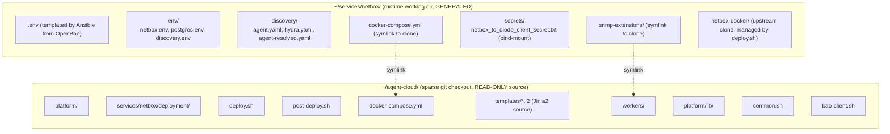

# Sparse Checkout & Runtime Directory Migration Plan

**Date:** 2026-04-05
**Status:** PROPOSED
**Context:** The current deployment pattern clones the entire monorepo onto each VM, then templates generated files (`.env`, `agent.yaml`, `hydra.yaml`) directly into the clone. This causes git conflicts on subsequent pulls, root ownership issues, and unnecessary disk usage. This plan migrates to sparse checkout (clone only what's needed) with a separate runtime directory for generated files.

---

## Problem

1. **Git conflicts on pull** — Ansible templates `.env`, `agent.yaml`, `env/*.env` into the clone. These are tracked or untracked files that conflict with `git pull`.
2. **Root ownership** — Some deploys run with `become: true`, creating root-owned files inside the clone. Subsequent user-level git operations fail.
3. **Unnecessary clone size** — Each VM clones the entire monorepo (~50MB) but only needs its own service dir + shared libs.
4. **Clone = mutable** — The clone is treated as both source code AND runtime config directory. This violates separation of concerns.

## Solution: Sparse Checkout + Runtime Directory

### Architecture



### Key Principles

1. **Clone is read-only.** Never write generated files into the clone. Ansible templates into the runtime dir.
2. **Runtime dir is per-service.** Each service gets `~/services/<name>/` for its generated config, volumes, data.
3. **Symlinks bridge the gap.** `docker-compose.yml`, `lib/`, `workers/`, `snmp-extensions/` symlink from the runtime dir to the clone. deploy.sh runs from the runtime dir.
4. **Sparse checkout per service.** Each VM only clones the directories it needs.
5. **Git pull is always safe.** Since the clone has no local modifications, `git pull` never conflicts.

### Sparse Checkout Configuration

Each service defines what it needs from the monorepo:

**NetBox VM:**
```bash
git clone --filter=blob:none --sparse https://github.com/uhstray-io/agent-cloud.git ~/agent-cloud
cd ~/agent-cloud
git sparse-checkout set \
  platform/services/netbox/deployment \
  platform/lib \
  platform/playbooks \
  collections
```

**NocoDB VM:**
```bash
git sparse-checkout set \
  platform/services/nocodb/deployment \
  platform/lib
```

**OpenBao VM:**
```bash
git sparse-checkout set \
  platform/services/openbao/deployment \
  platform/lib
```

**NemoClaw VM:**
```bash
git sparse-checkout set \
  agents/nemoclaw/deployment \
  platform/lib
```

### Runtime Directory Setup

Ansible creates the runtime directory structure and populates it:

```yaml
# tasks/setup-runtime-dir.yml
- name: "Create runtime directory"
  file:
    path: "~/services/{{ service_name }}"
    state: directory

- name: "Template env files into runtime dir"
  template:
    src: "{{ clone_dir }}/platform/services/{{ service_name }}/deployment/templates/{{ item.src }}"
    dest: "~/services/{{ service_name }}/{{ item.dest }}"
  loop: "{{ _env_templates }}"

- name: "Symlink compose file"
  file:
    src: "{{ clone_dir }}/platform/services/{{ service_name }}/deployment/docker-compose.yml"
    dest: "~/services/{{ service_name }}/docker-compose.yml"
    state: link

- name: "Symlink shared libs"
  file:
    src: "{{ clone_dir }}/platform/lib"
    dest: "~/services/{{ service_name }}/lib"
    state: link
```

### deploy.sh Changes

deploy.sh runs from the runtime directory (`~/services/netbox/`), not the clone:

```bash
SCRIPT_DIR="$(cd "$(dirname "${BASH_SOURCE[0]}")" && pwd)"   # ~/services/netbox/
CLONE_DIR="${CLONE_DIR:-/home/${USER}/agent-cloud}"            # read-only source
LIB_DIR="${CLONE_DIR}/platform/lib"                           # shared libs from clone
```

The `LIB_DIR` path changes from relative (`../../../lib`) to explicit (`$CLONE_DIR/platform/lib`). This is the main code change in deploy scripts.

---

## Migration Steps

### Phase 1: Create composable tasks

**New tasks:**
- `tasks/sparse-checkout.yml` — Clone repo with sparse checkout for a specific service
- `tasks/setup-runtime-dir.yml` — Create runtime dir, template env files, create symlinks

**Changes to existing tasks:**
- `tasks/manage-secrets.yml` — Template into runtime dir instead of clone dir
- `tasks/deploy-orb-agent.yml` — Mount agent.yaml from runtime dir, workers from clone
- `tasks/clean-service.yml` — Clean runtime dir + clone separately

### Phase 2: Migrate NetBox (first service)

1. Update `deploy-netbox.yml`:
   - Phase 1: sparse checkout → manage secrets → setup runtime dir
   - Phase 2: deploy.sh runs from runtime dir
   - Phase 3: post-deploy.sh from runtime dir
2. Update NetBox `deploy.sh` and `post-deploy.sh`:
   - Source `lib/common.sh` from `$CLONE_DIR/platform/lib/`
   - `cd` to runtime dir for compose operations
3. Update `deploy-orb-agent.yml`:
   - Mount `agent.yaml` from runtime dir
   - Mount `workers/` from clone (read-only)
   - Mount `snmp-extensions/` from clone (read-only)
4. Test: clean deploy via Semaphore, verify git pull works after deploy

### Phase 3: Migrate remaining services

Apply the same pattern to NocoDB, n8n, OpenBao, Semaphore, NemoClaw:
- Each gets its own sparse checkout config
- Each gets a runtime dir
- deploy.sh updated to use `$CLONE_DIR`

### Phase 4: Update shared infrastructure

- `clone-and-deploy.yml` (legacy) — Update to use sparse checkout + runtime dir
- `distribute-ssh-keys.yml` — Doesn't need the monorepo at all (operates via SSH)
- `validate-all.yml` — Doesn't need the monorepo (HTTP health checks)
- Remove the convenience symlink pattern (`~/<service>` → clone)

---

## Sparse Checkout Definitions (per service)

| VM | Sparse Paths | Runtime Dir |
|----|-------------|-------------|
| NetBox | `platform/services/netbox/deployment`, `platform/lib` | `~/services/netbox/` |
| NocoDB | `platform/services/nocodb/deployment`, `platform/lib` | `~/services/nocodb/` |
| n8n | `platform/services/n8n/deployment`, `platform/lib` | `~/services/n8n/` |
| OpenBao | `platform/services/openbao/deployment`, `platform/lib` | `~/services/openbao/` |
| Semaphore | `platform/services/semaphore/deployment`, `platform/lib` | `~/services/semaphore/` |
| NemoClaw | `agents/nemoclaw/deployment`, `platform/lib` | `~/services/nemoclaw/` |

---

## deploy.sh LIB_DIR Migration

**Current (relative path from clone):**
```bash
SCRIPT_DIR="$(cd "$(dirname "${BASH_SOURCE[0]}")" && pwd)"
LIB_DIR="$(dirname "$(dirname "$(dirname "$SCRIPT_DIR")")")/lib"
```

**New (explicit from CLONE_DIR):**
```bash
SCRIPT_DIR="$(cd "$(dirname "${BASH_SOURCE[0]}")" && pwd)"
CLONE_DIR="${CLONE_DIR:-$(dirname "$(dirname "$(dirname "$(dirname "$SCRIPT_DIR")")")")}"
LIB_DIR="${CLONE_DIR}/platform/lib"
```

The `CLONE_DIR` env var is set by Ansible and passed to deploy.sh. Fallback resolves from the script path for backward compatibility.

---

## Validation Criteria

| Check | Pass Condition |
|-------|---------------|
| Git pull never conflicts | `git -C ~/agent-cloud pull` succeeds after deploy |
| No generated files in clone | `git -C ~/agent-cloud status` shows clean working tree |
| Runtime dir has all env files | `ls ~/services/netbox/.env env/*.env` succeeds |
| deploy.sh works from runtime dir | Compose starts, health check passes |
| Sparse checkout minimal | `du -sh ~/agent-cloud` < 5MB per service |
| Symlinks resolve correctly | `readlink ~/services/netbox/docker-compose.yml` points to clone |
| Workers mount from clone | orb-agent finds `/opt/orb/workers/workers.txt` |

## Security Considerations

- **Clone is read-only** — No Ansible-generated secrets in the git directory
- **Runtime dir permissions** — `chmod 700` on runtime dir, `chmod 600` on env files
- **Symlinks don't expose secrets** — Symlinks point to code (compose, libs), not to env files
- **Root ownership eliminated** — deploy.sh never runs with become; only specific sudo commands (orb-agent start)

## Backward Compatibility

- Phase 1-2 implement for NetBox only. Other services continue with full clone.
- `CLONE_DIR` env var has a fallback that resolves from script path — old deploys still work.
- The convenience symlink `~/<service>` is replaced by `~/services/<service>/` (runtime dir).
- The `~/agent-cloud/` clone path is unchanged — just smaller via sparse checkout.
