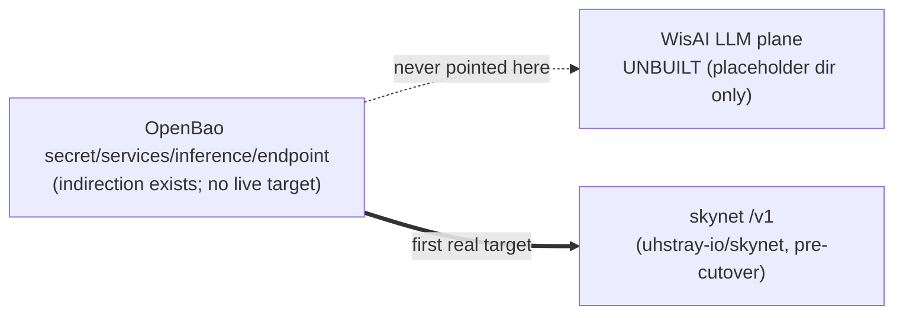
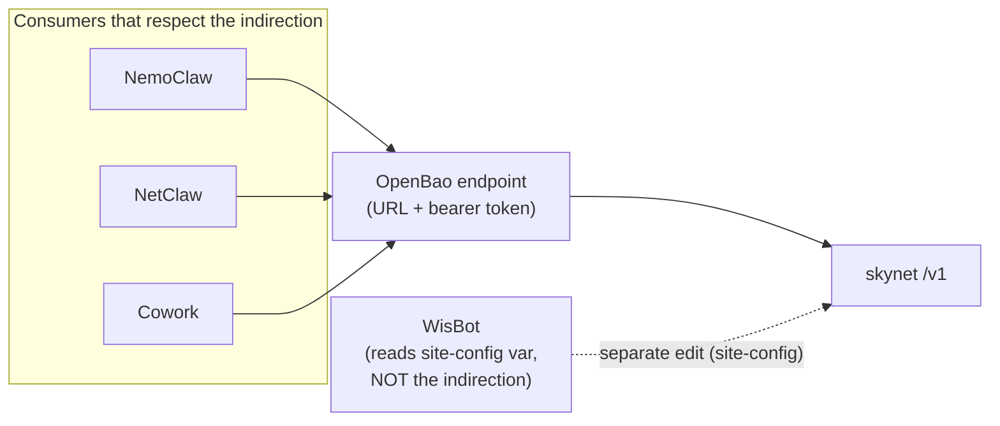
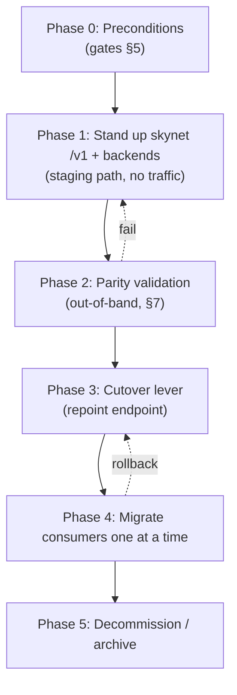
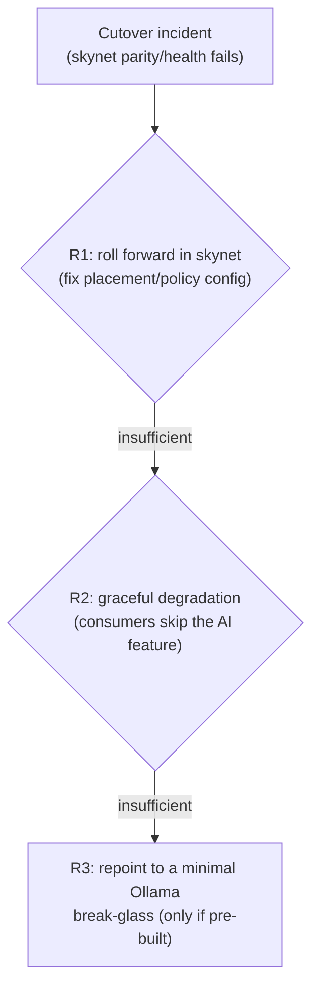

# WisAI → skynet Feature Migration Plan

**Date:** 2026-06-23 · **Status:** PLANNING
**Scope:** Replace WisAI's **LLM plane** with **skynet's** OpenAI-compatible `/v1` gateway across agent-cloud — the *operational* counterpart to the doc reframe.

> **Companion docs.** `plan/development/SKYNET-REPLACEMENT-PLAN.md` renames things and harvests use-cases (the *what*); this plan owns the *operational swap* (prove parity → flip one OpenBao value → migrate consumers → decommission). `plan/development/WISAI-DEPLOYMENT-PLAN.md` is **SUPERSEDED** — provenance for the model-ladder/hardware reasoning skynet's scheduler now owns. Source of capability gates: skynet `docs/agent-cloud-requirements.md` (X1/X2/N1–N3/D1).

---

## The reality that reshapes this migration

A repo inventory (2026-06-23) establishes the load-bearing fact: **the WisAI plane was documented but never built.** `platform/services/inference-ollama/`, `inference-webui/`, and `inference-vllm/` **do not exist on disk** — only the bare `platform/services/inference/` placeholder, plus the two non-LLM sidecars (`inference-comfyui/`, `inference-hunyuan3d/`). No WisAI Semaphore templates, no `secret/services/inference-webui`, and `secret/services/inference/endpoint` has never resolved to a live WisAI URL.

**Consequences:**
- This is a **green-field stand-up** of skynet as the first real inference plane — not a hot-swap of a running one. "Decommission legacy" is mostly *reference cleanup*, not service teardown.
- "Rollback to WisAI" is largely a **roll-forward** story: there is no incumbent to fall back to (see §6).
- The point of no return is unusually early because there is no incumbent consuming resources.

## Goal + scope

**Goal.** Replace WisAI's LLM plane (Ollama workers + Open WebUI coordinator, the OpenAI-compatible endpoint behind `secret/services/inference/endpoint`) with **skynet's `/v1` gateway** — which sits *in front of* local model backends and adds multi-backend **placement scheduling** + pre-inference **policy gates** that Open WebUI structurally lacks. skynet is not itself Ollama/Open WebUI; it lives in the private `uhstray-io/skynet` repo.

**In scope:** every consumer of `secret/services/inference/endpoint` — NemoClaw, NetClaw, WisBot, Cowork (`IMPLEMENTATION_PLAN.md:165-168`), plus ERPNext Plane-A AI features.

**Explicitly preserved (not touched by this migration):**
- **Non-LLM sidecars** `inference-comfyui` / `inference-hunyuan3d` (separate OpenBao paths; skynet may route to them later — separate plan).
- **The OPA authorization contract** — `policies/agentcloud/data.json` + `agent_actions.rego`. skynet acts *as* the `nemoclaw`/`netclaw` roles (least-privilege, Q3). The cutover changes **zero** bytes of `data.json`. The only OPA change is additive and tracked as skynet **X1** (register `catalog.skynet`) — not part of this migration.
- **The OpenBao endpoint-indirection pattern** — `secret/services/inference/endpoint` stays; only its *value* changes (§4).

## 2. Feature-parity matrix

WisAI capability (FROM, per `WISAI-DEPLOYMENT-PLAN.md`) → skynet equivalent (TO) → verdict. **ADD** = new skynet capability; **DROP/RE-HOME** = WisAI capability with no skynet equivalent.

| # | WisAI capability | skynet equivalent | Verdict |
|---|---|---|---|
| 1 | OpenAI-compatible endpoint (`/api/chat/completions`) | skynet `/v1` (chat, completions, embeddings, `/v1/models`) | **PARITY** — drop-in at the wire |
| 2 | Model serving (Ollama GGUF on GPU VMs) | skynet routes to local model backends (engine can stay Ollama) | **PARITY (re-homed)** — backends are skynet-internal, not agent-visible |
| 3 | Multi-node GPU scaling (`OLLAMA_BASE_URLS` from inventory) | skynet backend registry / placement | **PARITY + ADD** — scheduling, not just fan-out |
| 4 | Coordinator / fan-out (Open WebUI) | skynet gateway *is* the coordinator | **PARITY + ADD** — fan-out subsumed by placement |
| 5 | Model profiles / ladders (`profiles.yml` small/med/large) | skynet model ladders (**gated**: skynet Phase 5) | **PARITY (owner moves)** — unprovable until ladders filled |
| 6 | — (no placement) | skynet placement scheduler | **ADD** — why "no separate gateway" is reversed |
| 7 | — (no policy layer) | skynet pre-inference policy gates (OPA *as* role) | **ADD** — depends on X1; does not modify `data.json` |
| 8 | **Human chat WebUI** (Open WebUI browser UI + admin + history) | **NONE** (skynet is headless) | **DROP / RE-HOME** — the one true feature loss (§2.1) |
| 9 | WebUI credential set (session key, admin creds, Postgres pw) | gone (no WebUI) + shared endpoint URL+token | **CHANGES** — WebUI-specific secrets disappear |
| 10 | Endpoint indirection (`secret/services/inference/endpoint`) | identical pattern, repointed value | **PARITY (preserved)** — the cutover lever (§4) |
| 11 | 4-phase Semaphore deploy, idempotent | skynet via Semaphore templates (skynet repo); needs **D1** backend templates | **PARITY (constraint held)** — Semaphore-only |
| 12 | GPU plumbing (`install-nvidia-toolkit.yml`, `verify-gpu.yml`) | reused by skynet's backends | **PARITY (reused)** |
| 13 | Embeddings (`nomic-embed-text`) | skynet `/v1/embeddings` | **PARITY** — easy to miss; explicit test (§7-E) |
| 14 | DCGM GPU observability | skynet GenAI telemetry (tokens/TTFT/cost) | **PARITY + ADD, blocked ingest** — see **X2** (§7) |
| 15 | Conversation-history PII (WebUI Postgres, DR target) | NONE in agent-cloud | **DROP** — removes a PII/DR liability |

### 2.1 The one real feature loss — the human chat UI (#8)

skynet is a headless `/v1` gateway with no browser chat UI or conversation store. **Decision: drop it.** WisBot (Discord) is the standing human LLM surface and is a *consumer* of `/v1`, not a sub-agent; Cowork (on-device) is the other human-in-the-loop surface. *Rejected:* reinstating Open WebUI pointed at skynet (re-introduces the DMZ VM + PII Postgres + admin-credential lifecycle — reverses the simplification; parked as a documented fallback only). **Validation implication:** parity testing must *not* treat "human can open a browser chat" as a required criterion — track its retirement so a future reviewer doesn't read its absence as a regression.

## 3. The cutover lever

**One OpenBao value: `secret/services/inference/endpoint` (URL + bearer token).**

- **Stays:** the indirection pattern — consumers resolve the endpoint from OpenBao at render time, never hardcode it.
- **Changes:** only the value (Open WebUI `:3000/api/...` → skynet `/v1`; new bearer token).
- **Atomicity:** one Semaphore-driven write (Phase 3) changes the source of truth for all indirection-respecting consumers; it *materializes* per consumer at next env-render (Phase 4), which is why migration is staged and isolatable. Rollback is one reverse write.
- **⚠️ The exception that breaks the abstraction:** **WisBot** reads `OLLAMA_ENDPOINT` from site-config inventory (`wisbot_ollama_endpoint`), *not* OpenBao (`agents/wisbot/deployment/.env.example:12`, `templates/wisbot.env.j2:6`, README/CLAUDE). The lever does **not** move WisBot — it needs an explicit site-config + template edit. Without this, an operator flips the lever, sees three consumers move, and silently leaves WisBot on a dead URL.

## 4. Phased migration

Five phases; each foundational, idempotent, Semaphore-driven. Nothing flips until Phase 3, so Phases 1–2 are reversible at zero consumer cost.

- **Phase 0 — Preconditions.** All §5 gates green (or explicitly waived with owner sign-off).
- **Phase 1 — Stand up skynet `/v1` + backends (no prod traffic).** Deploy skynet + backends via skynet's Semaphore templates; store skynet's URL+token at a **staging** OpenBao path (`endpoint-skynet`), leaving the live `endpoint` un-pulled. Exit: `/v1` answers on staging; `GET /v1/models` lists the ladder; backends healthy.
- **Phase 2 — Parity validation (out-of-band).** Run the §7 suite against staging. Exit: every check passes + sign-off (human-chat-UI criterion excluded). Fail → loop to Phase 1; consumers untouched.
- **Phase 3 — Cutover lever (atomic repoint).** Via a Semaphore set-secret template (never manual SSH), write skynet's validated value into the live `secret/services/inference/endpoint` with KV-v2 metadata. **Rehearse the reverse write first** (§6). No consumer redeployed yet.
- **Phase 4 — Migrate consumers one at a time (Q5: no parallel-run).** Order, lowest blast radius first: **WisBot → Cowork → NemoClaw → NetClaw** (NetClaw gated on N3). Per consumer: re-render env from OpenBao via its Semaphore template; **WisBot is the exception** — edit site-config + `wisbot.env.j2`; then run a real `/v1` round-trip. Verify each before the next.
- **Phase 5 — Decommission / archive.** Physically archive `WISAI-DEPLOYMENT-PLAN.md` → `plan/archive/` (provenance preserved). "Legacy dirs" = ensure docs don't imply live dirs (they were never built). Sweep residual refs (`wisbot` env/docs say "WisAI/Ollama"; reword to skynet). Decommission any WisAI-era OpenBao secrets *if seeded* (verified absent → likely no-op).

## 5. Dependency / decision gates

Each gate must be all-true before the phase it guards. Evaluated at PR/cutover review; machine-checkable items named.

- **Gate 0 — Doc reframe merged** (guards all): README/CLAUDE/kickstart/IMPLEMENTATION_PLAN name skynet; "no separate gateway" reversed; OPA preserved (`git diff data.json` empty).
- **Gate N3 — netclaw↔Semaphore decided** (guards NetClaw migration + build #1): record **A** (thin agent-cloud capability fronts Semaphore; skynet's gate stays on the logical `(netclaw, netbox, create)`; **recommended**, skynet is built against A) vs **B** (delegate `run_task` to the `nemoclaw` role; second OPA query, no catalog widening). Reject the netclaw-catalog-widening variant. Satisfy **X1** (skynet roles in `data.json`) or traffic is default-denied.
- **Gate LADDER — skynet model ladders filled** (guards Phase 2): every model a consumer requests resolves to a skynet placement target; **embeddings explicit** (`nomic-embed-text`); WisBot's `OLLAMA_DEFAULT_MODEL=llama3` resolves or is updated.
- **Gate X2 — prod telemetry ingest** (guards Phase 2; see §7): agent-cloud Alloy enables `otelcol.receiver.otlp` + a trace store (Tempo), and o11y is deployed in **prod** — or an explicit interim measurement plan is accepted.
- **Gate CUTOVER** (guards Phase 3): Gates 0/N3/LADDER/X2 green; **D1** backend Semaphore templates exist; rollback rehearsed; privacy posture re-verified (§6).
- **Gate PNR — point of no return** (guards Phase 5 teardown): full parity-soak window with no P1 incident; per-consumer health confirmed (not inferred); no consumer references a WisAI/Ollama URL directly.

## 6. Rollback — stress-tested

**There is no deployed WisAI to roll back to**, so the OpenBao indirection is a genuine roll-*forward* lever and only a *theoretical* roll-*back* one. Recovery, in preference order:

- **R1 (primary):** most failures (backend down, policy gate over-blocking) are fixed *in skynet config* — because skynet *is* a gateway. This is the real standing recovery mode.
- **R2:** inference is non-load-bearing for the system of record — per ERPNext's principle "LLMs narrate, ERPNext computes," an inference outage degrades narration/drafting, it does not corrupt data. Confirm every consumer treats a `/v1` 5xx as "skip the AI feature," not "crash."
- **R3 (escape hatch — exists only if deliberately built):** keep the legacy compose/profile material *archived but resurrectable* for one parity-soak window (proposal: skynet served all consumers in prod 2 weeks, no P1, X2 healthy). **Decision required:** build R3 break-glass, or commit to R1+R2 only? Q5's "no parallel-run" defaults to **no R3** — but then R1/R2 sufficiency must be demonstrated at Gate CUTOVER.

## 7. Blast radius, validation & the X2 gap

**Consumers and failure modes at incomplete parity:**

| Consumer | Consumes via | Failure mode if parity incomplete |
|---|---|---|
| NemoClaw (role) | `/v1` reasoning | proposal loop errors; no state mutation (also gated on N3/D1) |
| NetClaw (role) | `/v1` reasoning | build #1 blocked until N1/N2/N3 |
| WisBot (*consumer*) | `OLLAMA_ENDPOINT` → must move to `/v1` | `/wisllm` fails if `llama3` unresolved |
| Cowork (*consumer*) | `/v1` | degrades to no-AI; local, low blast radius |
| ERPNext Plane A | OpenAI-compat over LAN | Plane-A backlog *waits* (it "floats"); ERPNext core unaffected |

**Privacy invariant (hard):** skynet **IS** ERPNext Plane A. A placement misconfig routing PII/GL/bank data off-box would breach the platform's hardest guarantee. **Gate CUTOVER must assert skynet's Plane-A placement is on-box-only.** WisBot + Cowork are *consumers*, not roles — a cutover script must not mis-gate them as OPA roles; the non-LLM sidecars are out of scope (distinct OpenBao paths).

**The X2 measurement gap:** `platform/services/o11y/.../config.alloy` ships only Loki log shipping — `otelcol.receiver.otlp` is deliberately omitted, Tempo is deferred, and o11y itself is PROPOSED/local-only. So at a naive cutover there is **no way to measure parity/health in prod**. Resolution, ordered: (1) enable OTLP receiver + deploy o11y to prod + Tempo (what X2 asks); (2) **accepted interim** if (1) can't land: skynet's gateway HTTP `/metrics` + skynet's *local* o11y stack + a Semaphore-scheduled **synthetic probe** (`validate-skynet.yml`: canned `/v1` prompt per consumer model → assert 200 + non-empty + latency budget → Discord alert). Do not let the reframe imply skynet telemetry lands in agent-cloud today.

**Parity suite (run against staging before the lever, re-run per consumer after):** chat (stream + non-stream), `/v1/completions` if used, `/v1/models` lists the ladder, **`/v1/embeddings`**, OpenAI error-shape parity, bearer-token auth (accept valid / reject invalid), placement across backends, policy-gate default-deny when X1 absent, backend-down degrades-not-fails, endpoint KV metadata present, per-consumer round-trip (incl. WisBot via its site-config path), **`git diff` proves `data.json` + sidecars untouched**, and a grep proving no live WisAI refs remain.

## 8. Risks / open questions

1. **No real WisAI to roll back to** — backward rollback (R3) exists only if a break-glass Ollama node is built + kept warm. Decide R3 vs R1+R2-only before Gate CUTOVER.
2. **X2 telemetry gap vs no-parallel-run** — cutting over blind is the central risk; if o11y-prod can't land first, the synthetic-probe interim must be accepted *in writing*.
3. **N3 is a single blocker for build #1** — netclaw can't `run_task`; N1/N2/N3 ship together; the nemoclaw/netclaw reframe (and NetClaw migration) must wait on A-vs-B.
4. **Embeddings & model-name parity** — a chat-only gateway is not parity; validate against real consumer configs (`llama3`, `nomic-embed-text`), not assumptions.
5. **Plane-A privacy invariant** — assert on-box-only placement for Plane-A traffic at cutover.
6. **D1 templates don't exist** — Semaphore "Deploy `<backend>`" templates for skynet's backends are unbuilt; Semaphore-only execution can't deploy backends without them.
7. **Inferred consumer list** — empty `context/use-cases/` stubs mean §7's consumer inventory is partly inferred; validate with owners before treating as canonical.
8. **Don't over-reframe consumers** — WisBot + Cowork are consumers, not sub-agent roles; sidecars are not replaced.
