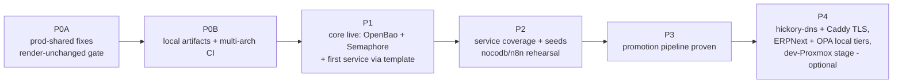
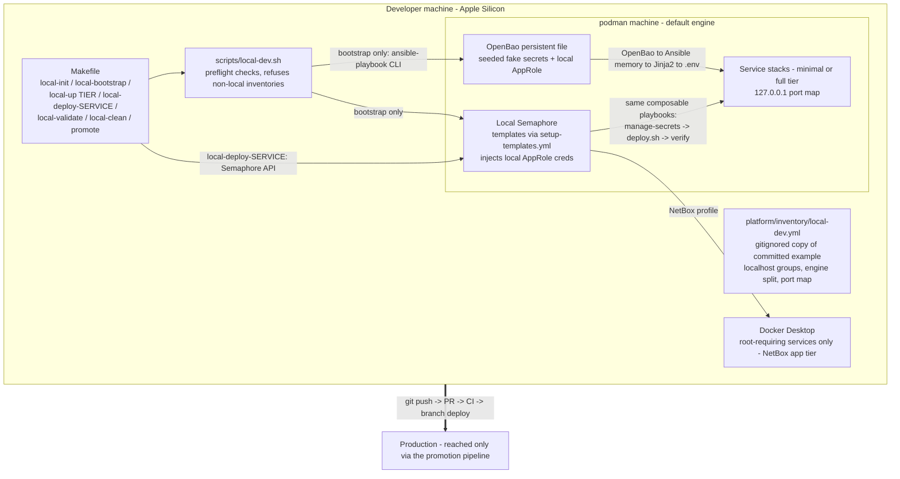
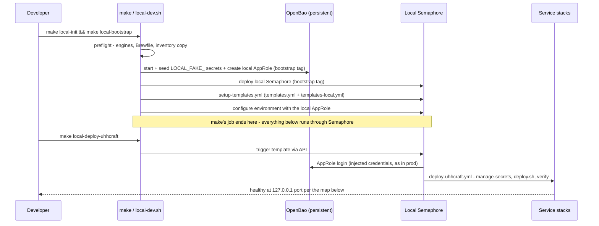
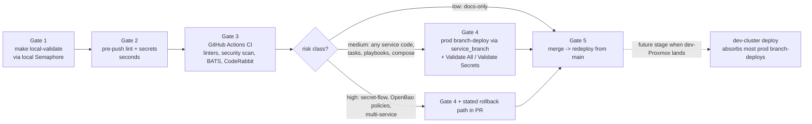
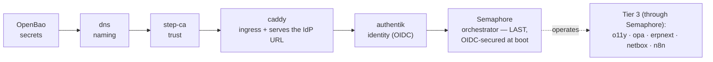
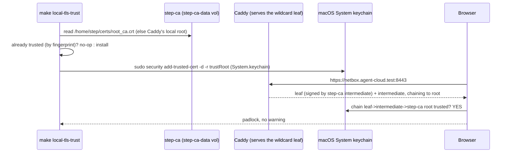
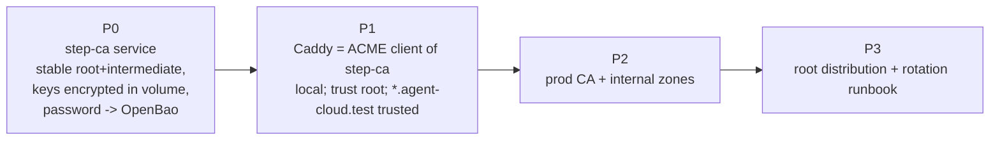
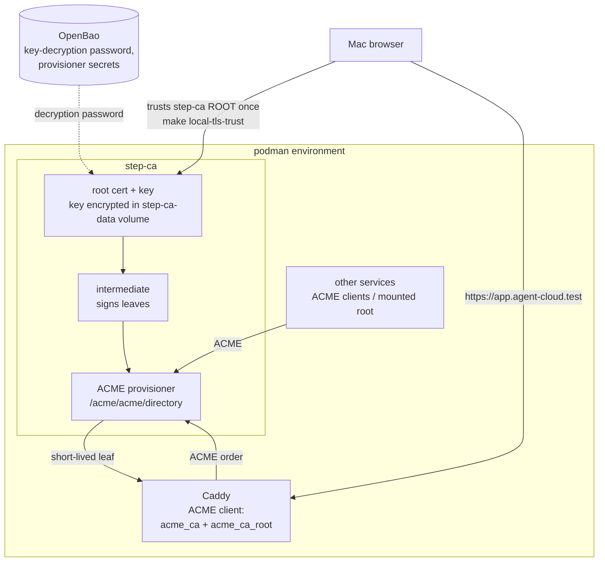
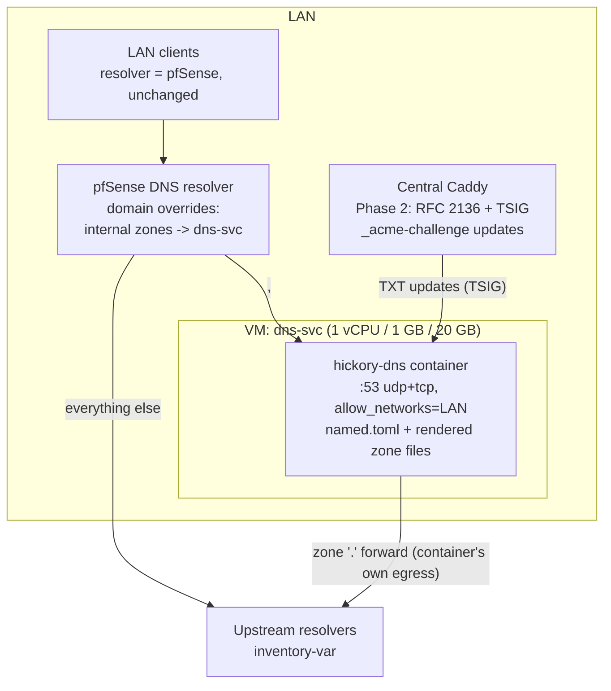
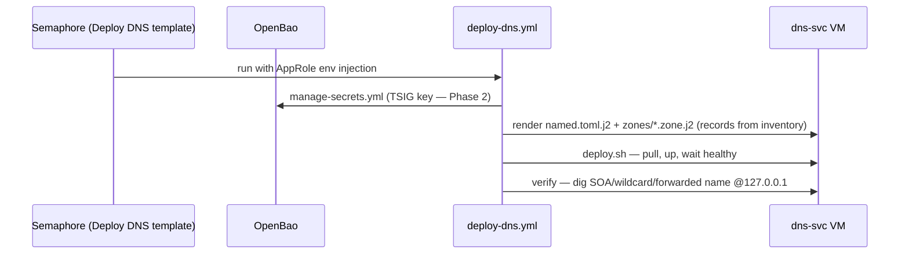

# 00 — Foundation & Local-Dev Bootstrap
> **Consolidates:** LOCAL-DEV-DEPLOYMENT.md, LOCAL-DEV-12A-IMPLEMENTATION.md, LOCAL-DEV-TLS-TRUST.md, INTERNAL-CA-DEPLOYMENT.md, DNS-SERVER-DEPLOYMENT.md (originals archived in `plan/archive/`)
>
> **Depends on:** —
>
> Part of the dependency-ordered `plan/development/` set (00–10). The source
> plans are merged verbatim below under provenance dividers to preserve all
> detail; read in numbered order to execute.


<!-- ======================= source: LOCAL-DEV-DEPLOYMENT.md ======================= -->

# Local Dev Deployment + Promotion Pipeline Implementation Plan

> **Location:** `plan/development/00-foundation-local-dev.md`
> **Date:** 2026-06-12 · **Status:** ACTIVE (Phases 0A–1 in execution on `feat/local-dev-phase0`) · **Owner:** uhstray-io
> **Context:** A local development instance of agent-cloud on developer machines (Apple Silicon macOS; podman machine default, Docker Desktop where root is required), driven by a **local Semaphore** so the laptop mirrors production's entire control plane, plus a promotion pipeline that carries locally-validated changes to production.
>
> **For agentic workers:** Execute phase-by-phase with `superpowers:executing-plans` or `superpowers:subagent-driven-development`. Every phase ends at a validation gate — do not start a phase until the prior gate passes.

**Goal:** One command takes a fresh clone to a running local agent-cloud stack — OpenBao, Semaphore, and services deployed by the same templates and playbooks as production — and a defined gate sequence promotes validated changes from laptop to prod.

**Architecture:** Two-stage paradigm — **make bootstraps, Semaphore operates**. The Makefile provisions initial resources only (engines, pinned deps, inventory, persistent file-backed OpenBao, local Semaphore, registered templates, local AppRole) — exactly what prod itself bootstraps outside Semaphore. From that point **every platform stands up through local Semaphore templates running the unchanged Ansible playbooks**, with credentials injected just like prod. Containers run under podman machine (Docker Desktop only for root-requiring services — today: NetBox app tier); each service carries a `compose.local.yml` slim overlay (resource caps, trimmed workers/optional sidecars, named volumes, loopback ports) so the stack fits laptop budgets. Owned GHCR images build multi-arch (arm64+amd64) in CI. Promotion: local validate → pre-push lint/secrets → CI → risk-classed prod branch-deploy → merge.

**Tech stack:** podman machine + podman-compose (default), Docker Desktop (root-requiring services), Semaphore (local instance), OpenBao (persistent file backend; init/unseal key escrowed to `~/.agent-cloud-local/openbao-init.json`), Ansible composable tasks unchanged, make + bash wrapper, existing BATS/pytest/CI suites.

---

## Target outcome

When Phase 3's gate passes:

- **Fresh clone to running platform in one command — make bootstraps, Semaphore operates.** `make local-init && make local-bootstrap` provisions the initial resources; everything after is `make local-deploy-<service>` triggering local Semaphore templates. Cold minimal tier in under 10 minutes (pulls included), warm restart under 3.
- **Slim by default.** Every locally-deployable service ships a `compose.local.yml` overlay — memory/CPU caps, trimmed worker counts and optional sidecars, alpine-class images where prod already uses them — with a measured budget per service: minimal tier ≤4 GB RAM, full tier ≤14 GB (fits a 16 GB machine).
- **The laptop runs production's control plane, not a substitute.** Same playbooks, same `manage-secrets.yml` flow, same templates-as-code, same credential injection (local AppRole) — differences confined to inventory vars, one prerequisites task, and fake secret values. Multi-dev ready: pinned tool versions, preflight diagnostics, self-serve docs.
- **Critical Rule #1 becomes code.** Deploy playbooks refuse to run unless a Semaphore environment is detected (prod or local) or the play is tagged bootstrap — laptop-to-prod accidents are structurally impossible, not policy-discouraged.
- **No real values on the laptop.** Persistent (file-backed) OpenBao holds generated fakes seeded by the bootstrap playbook — secrets survive a podman-machine restart; the committed inventory is localhost-only and publishable.
- **Promotion is a pipeline.** Five gates (§8) with stricter-tier risk classes: any service code change proves itself on a prod branch-deploy until the local stack earns trust.
- **The held NocoDB/n8n migration gets rehearsed.** Local greenfield composable deploys (fresh instances — no stateful secrets to lose) exercise the migration's playbooks, unblocking the prod cutover.
- **The dev Proxmox cluster slots in later.** When `DEV-PROXMOX-CLUSTER-PLAN.md` executes, its cluster becomes a promotion stage; nothing here depends on it.



## 1. Problem

All development today validates either in CI (static only) or directly against production VMs via branch deploys — a test-in-prod mechanism with no inner loop. The playbooks assume Linux targets with `apt`/`become`, Semaphore-injected credentials, and `/home/<user>` paths; nothing defines which subset of the 15 services constitutes a workable development stack; and owned images ship amd64-only while developer machines are arm64.

## 2. Source context — the three-agent panel

This plan synthesizes a structured panel [14]: **architecture**, **automation**, and **developer-experience** agents independently reviewed agent-cloud (+ site-config structure), then cross-challenged each other's findings against the repo. Two panel recommendations were subsequently **overruled by the owner** during plan review (engine default, local Semaphore) — recorded in §4 with rationale. Bracketed `[n]` markers here and throughout resolve in §13 — References. Panel outcomes the plan rests on:

| Panel outcome | Type | Consequence |
|---|---|---|
| `tasks/sparse-checkout.yml` / `tasks/setup-runtime-dir.yml` documented in `AUTOMATION-COMPOSABILITY.md` but **absent** from `platform/playbooks/tasks/` [2][10] | Gap (high) | P0A de-references (implement on demand) |
| `tasks/install-podman-compose.yml` hardcodes `apt` + `become`; paths assume `/home/{{ ansible_user }}` [9] | Gap (high) | OS-conditional prerequisites + optional path vars, Linux defaults unchanged |
| "Linux VM impersonating a prod VM = 100% playbook parity" — debunked: Semaphore env, apt/become, paths break regardless of SSH topology [9][14] | Challenge (high) | Topology = localhost targeting with local-mode vars; no SSH theater |
| NocoDB/n8n migration HELD for **live** stateful secrets; local greenfield has none [8] | Insight | Local dev is the migration's rehearsal environment (P2) |
| Full 13-service stack ≈ 20–30 containers, 15–25 min bootstrap [14] | Challenge (high) | Three-tier service model; minimal tier is the daily path |
| NetBox orb-agent needs `--privileged`/`CAP_NET_RAW` + a real network to discover [3] | Finding | NetBox app-only locally (Docker Desktop); discovery stays prod-only |
| Prod branch-deploy is test-in-prod [4] | Challenge (med) | Risk-classed promotion (§8); dev-Proxmox absorbs this later |
| *(unexamined by panel)* owned GHCR images are amd64-only; laptops are arm64 [16] | Review gap | Multi-arch CI builds (P0B) |

The plan instantiates the platform's existing doctrine rather than inventing one: the Critical Deployment Rules and secret flow come from the root conventions [1], the composable pattern it reuses from [2], the engine constraints from [3], the Gate 4 mechanism from [4], the service-tier framing from [5], the operational boundaries it amends from [6], the scope split with the dev cluster from [7], and the plan-document conventions from [13]. The artifacts it touches are the real ones the panel verified: the task library [9][10], the shared bash library [11], and the templates-as-code apply mechanism [12].

## 3. Design principles

1. **One codebase, two targets.** Production playbooks are never forked; local behavior is selected by inventory vars and one prerequisites task. Drift between a "local copy" and prod automation was the panel's #1 risk.
2. **The control plane is part of parity.** Secrets flow, compose files, deploy scripts, playbooks, *and the Semaphore template layer* all run locally. What doesn't: TLS/DNS, multi-VM networking, SSH hardening, real data — each covered by a later promotion gate (§7).
3. **No real values on the laptop.** Local OpenBao holds generated fakes; the committed inventory is localhost-only; nothing from site-config is needed.
4. **Rules are code.** Rule #1 is enforced by an assertion task, the wrapper refuses non-local inventories, and the bootstrap playbook refuses non-local OpenBao addresses.
5. **Each promotion gate is cheaper than the failure it prevents.** Seconds for lint, minutes for local validate, CI before review, prod branch-deploy where the risk class demands it.
6. **Make bootstraps, Semaphore operates.** The Makefile's job ends when Semaphore is configured; if a step can be a playbook behind a local template (deploys, validation, data seeding), it must be — wrapper-side logic is bootstrap-only by definition.
7. **Slim by default locally.** Footprint is minimized per service via `compose.local.yml` overlays (image variants, worker counts, sidecar trims, resource caps) — never by forking base compose files. The parity cost is explicit: trimmed topology is a §7 right-column item, covered at the branch-deploy gate.

## 4. Decision criteria (alternatives considered)

| Decision | Chosen | Alternatives — and why they lost |
|---|---|---|
| Local topology | **Containers in the engine's Linux VM; playbooks target `localhost` (`ansible_connection: local`) with local-mode vars** | SSH-into-a-VM "prod impersonation" — parity claim failed challenge (env/apt/paths break identically), adds a hop for nothing; waiting for the dev Proxmox cluster — different purpose, not a laptop inner loop |
| Container engine | **podman machine default; Docker Desktop only for root-requiring services (today: NetBox app tier)** — prod's exact split [3] | Docker-Desktop-default (panel 2-of-3 pick) — **overruled by owner**: platform identity is rootless/FOSS podman, and developing on prod's engine catches podman-compose quirks before prod does; both-engines-always — VM resource thrash |
| Image architecture | **Owned GHCR images (uhhcraft, wisbot, future erpnext/llm-gate) build multi-arch (arm64+amd64) in CI** [16] | Emulation-only — slow, flaky for DB containers, undermines the bootstrap gate; build-from-source locally — minutes per rebuild, diverges from the pull-based prod path (kept as a per-service dev override, not the default) |
| Orchestrator locally | **Local Semaphore in the core tier**: bootstrap CLI-deploys OpenBao + Semaphore (exactly what prod bootstraps outside Semaphore), `setup-templates.yml` registers templates locally, all further deploys run through local Semaphore with local-AppRole credential injection | No local Semaphore + CLI wrapper (panel unanimous) — **overruled by owner**: maximal automation parity wanted; the wrapper survives as the bootstrap/convenience layer, not the deploy path |
| Rule #1 enforcement | **Code: shared assertion task — deploy plays run only under a detected Semaphore environment (prod or local) or a `bootstrap` tag** | Wrapper/doc-only guard — leaves the laptop→prod accident surface open; manual prod deploys were never permitted anyway (ACCESS-BOUNDARIES) |
| Secrets locally | **Persistent file-backed OpenBao seeded with fakes by `bootstrap-local-dev.yml` (init/unseal key escrowed locally, survives restarts); `manage-secrets.yml` unchanged; local Semaphore env carries the local AppRole** | Dummy strings without OpenBao — skips the flow the platform exists to enforce; dev/in-memory mode — a machine restart wipes every secret and bricks stateful volumes (the bug that motivated the file backend) |
| Inventory | **`platform/inventory/local-dev.yml.example` committed (localhost-only = publishable); `make local-init` copies to a gitignored working file** | Tracking the live file — machine drift in git; home-dir-only — breaks fresh-clone bootstrap |
| Service tiers | **Minimal (OpenBao + Semaphore + target service + backing stores, ~12 containers) / full (pre-merge integration) / excluded (GPU inference, orb-agent discovery; postiz/nextcloud/wikijs optional)** | Whole-stack default — unusable daily (panel withdrew it on challenge) |
| NocoDB/n8n locally | **Greenfield composable deploys — P2 writes the playbooks the migration plan designed; rehearsal un-HELDs the prod migration** | Waiting for prod migration first — inverts the safe order |
| Audience | **Multi-dev from day one**: pinned tool versions (Brewfile), preflight diagnostics in the wrapper, seed-fixture ownership, self-serve docs | Single-dev-now — cheaper, but retrofitting robustness costs more than building it in |
| Promotion risk classes | **Stricter tier**: low = docs-only; medium = any service code or automation/compose change → prod branch-deploy required; high = secret-flow/OpenBao/multi-service → branch-deploy + stated rollback | As-drafted (app code = low) — deferred until the local stack demonstrates local-pass→prod-pass agreement; loosen via §11 revisit |
| macOS adaptation style | **Centralized `tasks/local-prereqs.yml` + optional inventory vars (Linux defaults); named volumes for databases** (10–50× bind-mount I/O penalty) | Scattered OS-conditionals — unreviewable; forked playbooks — drift |
| Local footprint | **Per-service `compose.local.yml` slim overlay** (resource caps, reduced worker counts, trimmed optional sidecars, named volumes, loopback ports), applied by the shared `compose` wrapper in `local_mode`; budgets measured at P2 | Prod-shaped stacks locally — RAM blowout (the panel already killed the whole-stack default); forked slim compose files — drift, the panel's #1 risk |
| Local DNS / hostnames | **hickory-dns container** (official multi-arch image, ~12 MiB) authoritative for the local dev zone (wildcard → `127.0.0.1`), forwarding `.` upstream; macOS `/etc/resolver/<zone>` port-targeted entry; deployed via a local Semaphore template and **shared with the production DNS plan** (`DNS-SERVER-DEPLOYMENT.md`) so local rehearses prod DNS [17] | `/etc/hosts` entries — no wildcards, sudo edit per service; dnsmasq — C codebase, diverges from the production DNS choice; CoreDNS — heavier, another config dialect; mDNS/`.local` names — collide with Bonjour semantics |
| ERPNext locally | **Slim tier via `compose.local.yml`** (single queue worker, MinIO/backup off, ~8 containers) behind the **same** `deploy-erpnext.yml` composable deploy as the VMs — **overrules the prior P4 deferral** (owner, 2026-06-12): a paradigm-fit local version is wanted | dev-VM-only (the original deferral) — no laptop inner loop for ERPNext work; prod-shaped stack locally — RAM blowout |
| OPA locally | **Same composable deploy, port-shifted to `127.0.0.1:8281`** (NocoDB's compose already binds 8181 locally [18]); policies mount from the working-tree copy → `opa test` + live decision queries join the local inner loop | wait-for-prod-first — inverts the safe order everything else in this plan establishes |

## 5. Local architecture

Everything below runs on the laptop; the promotion pipeline (§8) is the only path out. The wrapper bootstraps; local Semaphore deploys.



The handoff at the heart of the paradigm — where make's job ends and Semaphore's begins — is easiest to see as a sequence; everything above the dividing note runs once per machine (or after a VM reset), everything below is the daily loop:



**Port map** (loopback-only, env-var overridable; `docs/LOCAL-DEV.md` is the registry of record): Semaphore keeps 3000 (prod-typical); UhhCraft shifts locally via `${UHHCRAFT_PORT:-3001}`; every service binds `127.0.0.1:<port>`.

**Slim overlays:** in `local_mode` the shared `compose` wrapper appends `-f compose.local.yml` when the file exists; overlays carry only local deltas (caps, worker counts, sidecar trims, ports, named volumes). Base compose files stay untouched — one codebase, two shapes.

### 5.1 Local DNS — hickory-dns

Loopback ports alone give services addresses, not names. A local DNS server gives every local service a stable hostname under one dev zone (e.g. `semaphore.<local-dev-zone>`, `erp.<local-dev-zone>`), which is what the Phase 4 Caddy/TLS profile needs to terminate per-service HTTPS, and what makes cookie/CORS/base-URL behavior match prod patterns. The server is **hickory-dns** — the same engine the production DNS plan (`DNS-SERVER-DEPLOYMENT.md`) deploys, so the local container rehearses prod DNS the way local Semaphore rehearses prod orchestration [17]:

- **Image:** `docker.io/hickorydns/hickory-dns` (official, pinned tag; multi-arch incl. arm64; ~12 MiB Alpine; config at `/etc/named.toml`, zones under `/var/named`).
- **Zones:** one `Primary` zone for the local dev zone, rendered from a Jinja2 zone-file template (RFC 1035 master format — wildcard `*.<local-dev-zone> A 127.0.0.1` plus optional per-service records); a `.` `External`/forward zone sends everything else to an inventory-var upstream. This authoritative + forward split is hickory's first-class, production-grade path (full recursion stays off — experimental upstream).
- **Ports:** `127.0.0.1:5300` → 53/udp+tcp in-container, via env-parameterized base-compose bindings (`DNS_LISTEN`/`DNS_PORT` — compose overlays *append* `ports` entries and can never remove the base one, so port shifts are env-driven, the NocoDB/UhhCraft pattern). Host :53 stays untouched — it's contended territory on developer Macs (Internet Sharing, VPN clients, Docker Desktop) and 5300 keeps the whole flow conflict-free.
- **macOS resolution:** `make local-dns-resolver` writes `/etc/resolver/<local-dev-zone>` (`nameserver 127.0.0.1` + `port 5300`) — macOS's native split-DNS hook and the only sudo step in the whole local story. **Repeatable, not a one-off:** idempotent (no-op + no sudo when already correct), `--yes`/`ASSUME_YES` for scripting, post-write verify via `dscacheutil`. It cannot run through Semaphore (`/etc/resolver` is a host file outside the VM) — it's a host-bootstrap step, sudo intrinsic. The working inventory it reads is derived from the committed example; `make local-init` warns on group drift and `REFRESH=1 make local-init` regenerates it.
- **Paradigm fit:** make does **not** bootstrap DNS — the control plane never depends on names. It deploys like any service: `make local-deploy-dns` → "Deploy DNS (Local)" template in `templates-local.yml` → composable playbook (zone template → container → `dig` verify).
- **Zone value hygiene:** the real dev zone (a `<parent-domain>` subdomain) lives in the gitignored inventory working copy/site-config; the committed example carries a placeholder, per the no-real-domains rule. The laptop is the **only** authority for this zone — prod DNS does not serve it (`DNS-SERVER-DEPLOYMENT.md` §3).

**Reference machine & VM allocations:** the current dev machine (Apple Silicon 18-core / 48 GB RAM / ~580 GB free disk, measured [15]) hosts: podman machine sized **6 CPUs / 16 GB RAM / 100 GB disk** (runs minimal *and* full tier within the §10 budgets) and Docker Desktop at **2 CPUs / 4 GB** (started only for the NetBox profile). Worst case — both VMs + full tier — uses ≤20 GB of 48, leaving >50% headroom for macOS and tooling. The ≤4 GB / ≤14 GB tier budgets remain the portable floor so 16 GB-machine contributors are never excluded (multi-dev decision, §4).

## 6. Implementation phases

### Phase 0A — Prod-shared fixes (own PR; render-unchanged gate)

- [x] De-reference `sparse-checkout.yml`/`setup-runtime-dir.yml` from `AUTOMATION-COMPOSABILITY.md` (implement-on-demand later; nothing uses them today)
- [x] `tasks/install-podman-compose.yml`: gate `apt`/`become` on `ansible_os_family`; add brew path (Linux behavior byte-identical)
- [x] Path vars `local_services_dir`/`local_monorepo_dir` with `/home/{{ ansible_user }}/...` defaults in path-hardcoding playbooks *(execution note: the eager-default gotcha — `default('/home/' ~ ansible_user)` errors when `ansible_user` is undefined even if the left side is set, because Jinja evaluates filter arguments eagerly. **Resolved (§12A fix #2, 2026-06-15):** the default is now lazy (`ansible_user | default('deploy')`) across all playbooks, so local inventories no longer need to define `ansible_user` — see §12A note below)*
- [ ] `tasks/assert-orchestrated.yml` — shared pre-task: fail unless a Semaphore-injected environment is detected (e.g., `BAO_ROLE_ID`/`SEMAPHORE_*` — exact marker TBD) or the play is `bootstrap-local-dev.yml` running under its `bootstrap` tag (exemption scoped to that playbook by name — the tag alone is not sufficient); wire into deploy playbooks. **Blocking precondition: verify the marker against a real prod Semaphore task before wiring** (§11) *(status 2026-06-12: task file written; UNWIRED pending the marker verification)*
- [ ] Named-volume overrides for database/storage services under `local_mode`
- [x] `platform/lib/common.sh`: `compose` wrapper appends `compose.local.yml` when present and `local_mode` is set — unset/absent = byte-identical behavior (render-unchanged gate covers it) *(also fixed a latent prod bug: preset `CONTAINER_ENGINE` left `COMPOSE_CMD` empty)*

**Gate 0A:** CI green; rendered prod plays byte-identical (diff of `ansible-playbook --check` output against a Linux container with prod-shaped inventory, before vs after); assertion task proven in both directions (passes under Semaphore env, fails bare, passes with bootstrap tag).

### Phase 0B — Local artifacts + multi-arch (own PR; additive only)

- [ ] `tasks/local-prereqs.yml` — OS/engine detection (podman machine running; Docker Desktop only when the target service needs it), brew installs, runtime dirs *(status 2026-06-12: bootstrap's preflight covers the podman-machine check; the standalone task is still to extract)*
- [x] `platform/inventory/local-dev.yml.example` — all local service groups on `localhost`, `ansible_connection: local`, `local_mode: true`, per-group `container_engine` (podman default, `docker` for NetBox), port vars. Working copy is `platform/inventory/local-dev.yml`; its `.gitignore` entry lands in the same PR
- [x] `scripts/local-dev.sh` + `Makefile` (`local-init`, `local-bootstrap`, `local-deploy-<service>` → local Semaphore API, `local-validate`, `local-clean`, `promote`); wrapper refuses non-local inventories and non-local `openbao_addr` *(remaining: `local-up [TIER=…]` meta-target)*
- [x] `platform/playbooks/bootstrap-local-dev.yml` — persistent file-backed OpenBao up (init/unseal key escrowed to `~/.agent-cloud-local/openbao-init.json`; secrets survive a podman-machine restart); local AppRole + policy; fake secrets seeded (**`LOCAL_FAKE_` prefix**); local Semaphore deployed (pinned v2.18.12, sqlite — `latest`/bolt both panic); `setup-templates.yml` run against it with `templates-local.yml` merged only under `local_mode`; API token auto-created; environment carries the local AppRole + engine socket (idempotent, re-runnable after VM reset). *(Execution additions beyond the original design: the VM's rootful podman socket is mounted into Semaphore (`label=disable` — SELinux blocks cross-container sockets otherwise) so in-container deploys drive the real engine; the **working tree is bind-mounted and registered as a Semaphore local-path repository** — tasks execute uncommitted changes, the entire point of the inner loop; local-mode plays copy the workspace via tar, never `git clone` from GitHub)*
- [ ] `compose.local.yml` convention documented + first overlay (UhhCraft) *(status 2026-06-12: UhhCraft's port shift landed as env-parameterized base-compose bindings instead — the overlay pattern remains for caps/workers/sidecars)*
- [ ] Multi-arch CI: owned-image workflows publish arm64+amd64 manifests *(status 2026-06-12: blocked on [16] — `ghcr.io/uhstray-io/uhhcraft` is private; access decision needed before the manifest question is even observable)*
- [x] Multi-dev floor: `Brewfile` + pinned tool versions; wrapper preflight prints actionable diagnostics
- [x] Docs: `docs/LOCAL-DEV.md` (bootstrap, port map, engine split, triage) *(remaining: `ACCESS-BOUNDARIES.md` bootstrap-exemption amendment; root `CLAUDE.md` local-dev section)*
- [ ] BATS: wrapper refusal behavior; inventory example validity *(status 2026-06-12: compose-overlay BATS landed; wrapper-guard BATS still to write)*

**Gate 0B:** CI green; `make local-init` produces a valid working inventory on a clean machine; multi-arch manifests verified (`podman manifest inspect` shows both arches).

### Phase 1 — Core live

- [x] `make local-bootstrap` on a clean machine: OpenBao seeded → local Semaphore up → templates registered (45) → its environment carries the local AppRole *(proven: Check Secrets ran through local Semaphore with AppRole injection — 3 `LOCAL_FAKE_` keys PRESENT)*
- [ ] `make local-deploy-uhhcraft` (cleanest composable exemplar) — runs **through the local Semaphore template** *(status 2026-06-12: pipeline proven through Phase 1 + image pulls over the mounted engine socket — postgres/redis/minio pulled; **blocked at the app image: `ghcr.io/uhstray-io/uhhcraft` is private (403)**, see §11/[16])*
- [ ] `make local-validate` — local "Validate All" template, skip-unreachable for undeployed services
- [ ] Idempotency + reset: re-deploy no-ops; `make local-clean` then re-bootstrap recovers *(bootstrap idempotency proven across ≥6 re-runs; clean-path round-trip still to exercise)*

**Gate 1:** fresh clone → healthy core in **<10 min cold / <3 min warm** and **minimal tier within the ≤4 GB RAM target** (measured, recorded in docs); the deploy demonstrably ran via local Semaphore (task visible in its UI/API) with credentials injected from local OpenBao; same playbook SHA as prod; `secrets.*` in rendered `.env` provably from local OpenBao (change a seed → redeploy → value changes).

### Phase 2 — Service coverage, seeds, migration rehearsal

- [ ] **Write** the NocoDB + n8n composable playbooks designed in `nocodb-n8n-composable-migration.md`; deploy greenfield locally via local Semaphore; record findings in that plan (HELD → rehearsed)
- [ ] NetBox app-only profile — **engine blocker found + fix planned** (`NETBOX-LOCAL-ENGINE.md`): the podman-VM Semaphore can't reach Docker Desktop (unix socket dead over virtiofs; no TCP daemon), so the robust fix runs NetBox's app tier under **podman** (its lib already honors `CONTAINER_ENGINE`), discovery/orb-agent excluded via a compose `profiles:` gate — not Docker Desktop
- [ ] `platform/seeds/` — per-service demo fixtures (distinct from P0B's credential seeding), applied by `bootstrap-data.yml` **run as a local Semaphore template** ("Bootstrap Data (Local)"); ownership: fixtures live with each service's deployment dir owner
- [ ] **Postiz onboarding, local-first** [18]: today it is compose-only with hardcoded credentials and no playbook — run the full Adding-a-New-Service checklist (deploy.sh, `env.j2` → OpenBao-managed secrets, `deploy-postiz.yml`, Semaphore template), developed and validated against the local stack before it ever touches prod. Local port `127.0.0.1:5001` (`${POSTIZ_PORT:-5000}` pattern — macOS AirPlay Receiver squats `:5000` on default installs)
- [ ] Slim profiles for every covered service: define + measure `compose.local.yml` budgets (table in `docs/LOCAL-DEV.md`: image variant, worker counts, sidecars on/off, mem cap)
- [ ] Full tier (`make local-up TIER=full`); measure and document the resource budget

**Gate 2:** covered services healthy via their existing checks; NocoDB/n8n rehearsal findings recorded; per-service slim budgets documented; full tier measured **≤14 GB** (≥2 GB headroom on a 16 GB machine).

### Phase 3 — Promotion pipeline proven

- [ ] `.pre-commit-config.yaml`: shellcheck, yamllint, ansible-lint, secrets/IP grep (fast checks only) — automates the Mandatory Pre-Push Audit; update root `CLAUDE.md` accordingly
- [ ] `make promote`: `local-validate` → pre-push checks → branch push → PR open (CI takes over); soft local gate (`--force` to override) — CI remains the hard floor
- [ ] Risk-class policy added to `BRANCH-TESTING-WORKFLOW.md` (§8)
- [ ] Triage runbook: prod-branch-deploy failure that local passed — the parity-boundary checklist (§7 right column)

**Gate 3:** one real change ridden end-to-end — local edit → validated via local Semaphore → promoted → CI green → prod branch-deploy (per risk class) → merged → main redeploy — with per-gate evidence in the PR. (Gate 1 already proved the Semaphore mechanics; this gate proves policy and pipeline integration.)

### Phase 4 — Local DNS, TLS, and extended roster

Promoted from "optional extensions" (owner, 2026-06-12): local DNS, a paradigm-fit ERPNext tier, and OPA are now planned work; only the dev-Proxmox stage stays build-on-demand.

- [x] **hickory-dns local** (§5.1): `platform/services/dns/` scaffolding shared with `DNS-SERVER-DEPLOYMENT.md` (compose + named.toml/zone `.j2` + `deploy-dns.yml`), "Deploy DNS (Local)" in `templates-local.yml`, `dns_svc` inventory group, `make local-dns-resolver` for `/etc/resolver`, registry `127.0.0.1:5300`. *Done 2026-06-12 — first fully-working downstream deploy through local Semaphore: image pulled over the mounted socket, zone+config rendered from inventory, hickory healthy, `dig` verifies `*.agent-cloud.test → 127.0.0.1` + upstream forwarding, reachable from the Mac (udp+tcp). Forced a general fix — host bind-mounts need a same-path shared deploy dir (`/var/lib/agent-cloud-deploy`) since podman-compose runs in the Semaphore container but the engine resolves mount sources on the VM.*
- [x] **Caddy local profile** [18]: **done 2026-06-12.** Converted Caddy to the composable pattern (it had no deploy.sh/playbook/template): `deploy-caddy.yml` + "Deploy Caddy (Local)" template, `deploy.sh` (container-only), env-parameterized image/ports/**Caddyfile source** in the base compose (so the local variant swaps in without an overlay mount-append conflict — overlays can't replace `ports`/`volumes`), `templates/Caddyfile.local.j2` (global `local_certs` internal CA, routes from `caddy_routes` inventory var, `import sites/*.caddy`), and a `compose.local.yml` that attaches Caddy to the `local-dev` network so it reverse-proxies the control plane **by container name** (not the unreachable Mac loopback). Live-validated: `https://semaphore.agent-cloud.test:8443` + `https://openbao.agent-cloud.test:8443` → 200, TLS by Caddy's internal CA. Prod path (Cloudflare DNS-01 secret via manage-secrets) is the remaining prod-only follow-up. (Resolves the prod DNS plan's Phase-2 Caddy-automation precondition.) Found + fixed a reusable gotcha: the admin-API healthcheck must use `127.0.0.1`, not `localhost` (IPv4-only bind; `localhost`→`::1` refuses)
- [x] **step-ca internal CA** (`INTERNAL-CA-DEPLOYMENT.md`): **done 2026-06-14.** Composable service deployed + healthy via local Semaphore (`platform/services/step-ca/`, `deploy-step-ca.yml`, "Deploy step-ca (Local)" template, `step_ca_svc` group). Stable ECDSA-P256 root in the `step-ca-data` volume; Caddy now serves a step-ca-minted `*.agent-cloud.test` wildcard (replacing the ephemeral per-instance `local_certs` root), chain-verified `ssl_verify_result=0`; `make local-tls-trust` trusts the *step-ca* root. Local issuance is token-mint (`tasks/mint-internal-cert.yml`; in-network ACME for `*.agent-cloud.test` is unvalidatable); ACME dns-01 is the prod path. Also drove the local zone to `agent-cloud.test` (reserved `.test`, single-knob literal). `127.0.0.1:9000`.
- [x] **Authentik IdP/SSO** (`AUTH-SSO-DEPLOYMENT.md` Phase 0): **done 2026-06-14.** Composable service deployed + healthy via local Semaphore (`platform/services/authentik/`, `deploy-authentik.yml`, "Deploy Authentik (Local)" template, `authentik_svc` group): server+worker+Postgres+Redis, `ak healthcheck` green, `/api/v3/root/config/` → 200, server on `local-dev` (Caddy reaches `authentik-server:9000`). Secrets generated once into `secret/services/authentik` and reused; seed blueprint (agent-cloud group); BATS (8). Host debug `127.0.0.1:9300` (step-ca owns `:9000`). The `auth.agent-cloud.test` Caddy route + `forward_auth` SSO gating are the next phase.
- [ ] **ERPNext local tier** (`ERPNEXT-DEPLOYMENT.md` §7): `compose.local.yml` — one queue worker (`long,default,short` covers all queues), MinIO/backup/cross-mirror off, mem caps; frontend at `127.0.0.1:8080`; same `deploy-erpnext.yml` through a local template; `LOCAL_FAKE_` secret set at `secret/services/erpnext`; verify `docker.io/frappe/erpnext` ships arm64 manifests at execution (assumption, §11); budget target ≤3.5 GB measured
- [ ] **OPA local** (`OPA-INTEGRATION-PLAN.md`): once its Phase 0 scaffolding exists, deploy via local template at `127.0.0.1:8281` — which requires its base compose to adopt the env-parameterized binding pattern (`${OPA_LISTEN:-127.0.0.1}:${OPA_PORT:-8181}:8181`, ditto the 8282 diagnostics port; its current draft hardcodes both); policies volume-mount from the working-tree copy, so Rego edits are live-testable; add `opa test platform/services/opa/deployment/policies/` to `local-validate` when the dir exists
- [ ] **o11y** [18]: deployment dir is an empty stub — **stack now defined in `O11Y-DEPLOYMENT.md`** (Grafana + Prometheus + Loki + Alloy, composable local-first; Mimir/Tempo/MinIO/Alertmanager are prod). Phase 0 scaffold → Phase 1 local deploy next. Registry reserves `3002` (grafana), `9090` (prometheus), `3100` (loki)
- [ ] dev-Proxmox promotion stage when `DEV-PROXMOX-CLUSTER-PLAN.md` executes

**Gate 4:** `dig @127.0.0.1 -p 5300 anything.<local-dev-zone>` answers `127.0.0.1` and macOS resolves it via `/etc/resolver`; ≥2 services served over HTTPS through local Caddy with internal-CA certs; ERPNext local healthy within its measured ≤3.5 GB budget via local Semaphore; an OPA decision query answers locally; every bound port matches the registry of record.

## 7. What local validates — and what it cannot

| Local pass certifies | Local pass says nothing about |
|---|---|
| Playbook/task logic on the real code path | Real credential values/rotation (prod OpenBao) |
| Secret flow end-to-end (OpenBao → AppRole injection → `.env`) | Multi-VM networking, Caddy/TLS/DNS-01, pfSense |
| **Semaphore template wiring** (templates-as-code applied + executed locally; project/inventory IDs differ) | Proxmox provisioning, SSH hardening, discovery pipeline |
| compose validity, staged startup, healthchecks, arm64+amd64 image manifests | Production data shapes and volumes |
| Service bootstrap + app behavior; BATS/pytest (also in CI) | amd64-specific runtime behavior |
| `compose.local.yml` overlay correctness | Prod-shaped topology — full worker counts, untrimmed sidecars, prod resource limits |

This table is the honest contract behind the promotion pipeline: every right-column row is covered at Gate 4 (prod branch-deploy) or a later stage.

## 8. Promotion pipeline

Five gates; Gate 4 is conditional on risk class (stricter tier, ratified 2026-06-12): **low** = docs-only; **medium** = any service code, composable tasks, playbooks, or compose topology; **high** = secret-flow, OpenBao policies, or multi-service changes (adds a stated rollback path in the PR). The dotted dev-Proxmox stage is not required by any gate in this plan.



Boundaries revisit (§11): after a sustained run of local-pass→prod-pass agreement, "medium" may relax to exclude single-service app code.

## 9. Security considerations

- Local OpenBao: generated fakes only; bootstrap refuses non-local `openbao_addr`.
- Rule #1 enforced in code (`assert-orchestrated.yml`); wrapper refuses non-local inventories — laptop→prod accidents are structurally blocked on both paths.
- Committed inventory is localhost-only (publishable by construction); working copies and rendered `.env` files gitignored; existing CI secret/IP gates apply.
- Local Semaphore binds loopback only; its admin credentials are bootstrap-generated fakes; its environment holds only the local AppRole.
- `ACCESS-BOUNDARIES.md` amendment: local bootstrap is the documented exemption; production deploys flow exclusively through (prod) Semaphore — now also asserted at runtime.

## 10. Validation criteria (master)

| Phase | Critical check | Pass |
|---|---|---|
| 0A | Prod-behavior isolation | Rendered prod plays byte-identical; assertion task proven both directions; CI green |
| 0B | Clean-machine readiness | `make local-init` valid on fresh clone; multi-arch manifests verified |
| 1 | Control-plane parity + footprint | Deploy ran via local Semaphore w/ local-AppRole injection; <10 min cold / <3 min warm; minimal tier ≤4 GB RAM; seed-change → `.env` change |
| 2 | Coverage + rehearsal + budgets | NocoDB/n8n greenfield healthy via local Semaphore; findings in migration plan; per-service slim budgets documented; full tier ≤14 GB measured |
| 3 | Pipeline proven | One change end-to-end laptop→prod with per-gate evidence in the PR |

## 11. Open decisions & risks

| Item | Status | Resolution path |
|---|---|---|
| Semaphore-environment detection marker | Verify at P0A | Confirm against a real prod Semaphore task before wiring `assert-orchestrated.yml` |
| Owned-image inventory for multi-arch | P0B start | Audit which GHCR images exist + which build workflows need the manifest change |
| Risk-class boundaries | Ratified (stricter) | Revisit after sustained local-pass→prod-pass agreement; relax medium to exclude app code |
| Local data persistence | **Persistent by default** — file-backed OpenBao + named service volumes; survives a podman-machine restart | `make local-clean` is the only intentional wipe (removes the vault volume + init material); deeper resilience (snapshot, self-heal unseal, single-node Raft) in OPENBAO-HA-DEPLOYMENT.md Track A |
| ERPNext local tier | Planned (P4, ratified 2026-06-12) | `compose.local.yml` slim tier behind the unchanged `deploy-erpnext.yml`; the dev VM remains the pre-prod stage with real-shaped data |
| `frappe/erpnext` arm64 manifests | Verify at P4 start | `podman manifest inspect docker.io/frappe/erpnext:<pinned>` must show arm64; fallback = local build override or emulation for the app tier only |
| Local dev zone value | Working-copy/site-config only | Committed example ships a placeholder; `local-init` substitutes the real `*.uhstray.io` dev zone from the private side |
| Postiz hardcoded credentials in committed compose [18] | Fix at P2 onboarding | Replace with `${VAR}` references + `env.j2`; until then the file must not be deployed anywhere |
| o11y stack definition | Blocked (stub dir) | Own plan/PR defines grafana/prometheus/loki shape; local profile follows |
| Slim-profile budgets (targets: minimal ≤4 GB; full ≤14 GB on a 16 GB machine) | Targets set, unmeasured | Gates 1–2 measure; per-service `compose.local.yml` budgets defined at P2 |
| `validate-all.yml` skip semantics | Minor — P1 | Skip-unreachable behind `local_mode` |
| Image signing / build attestation for GHCR images | Future hardening | Multi-arch P0B change doesn't add signing; track cosign/SLSA as its own plan when supply-chain work starts |

## 12. Convention compliance map

| Platform rule | How this plan satisfies it |
|---|---|
| All deployments through Semaphore (rule #1) | **Strengthened**: local deploys also run through (local) Semaphore; rule enforced in code via `assert-orchestrated.yml`; **genesis-bootstrap exemption** (widened to the secure foundation — OpenBao/dns/step-ca/caddy/authentik + Semaphore — per §12A) documented in ACCESS-BOUNDARIES |
| deploy.sh containers-only (rule #2) | Same scripts run locally; no variants |
| Independent workflows (rule #3) | bootstrap, per-service templates, validate, seeds are separate playbooks/templates |
| No intermediary secret files (rule #4) | manage-secrets flow preserved against local OpenBao; fakes only |
| Templates-as-code | `setup-templates.yml` runs against local Semaphore — template changes validated locally before prod |
| Engine policy | podman default / Docker only where root is required — prod's exact split, locally too |
| One codebase / no forks | Inventory-var switching + centralized prereqs; slim profiles are overlays, never forks; Gate 0A render-unchanged check |
| Make bootstraps, Semaphore operates | Wrapper logic is bootstrap-only; platforms, validation, and data seeding all run via local Semaphore templates |
| Pre-Push Audit | Automated via `.pre-commit-config.yaml` (P3); CLAUDE.md updated |
| Plan doc standards | Status header, mermaid-only diagrams, phase gates, validation table, security section, decision criteria with rejected alternatives + owner overrides, revision history |

## 12A. Bootstrap ordering — secure foundation before the orchestrator (2026-06-15)

**Decision.** Semaphore's job is to *securely operate* the platform, so its security substrate must exist **before** it — not be reconfigured afterward. The genesis bootstrap therefore brings up the secure foundation **directly**, and Semaphore comes up **last, already OIDC-secured**. This supersedes the earlier "OpenBao+Semaphore first, everything else through Semaphore" ordering for the security-foundational services.

**Rejected alternative.** Bring Semaphore up first (unsecured), then enable OIDC in a post-stack pass. Rejected: it leaves a window where the orchestrator runs without SSO, needs a fragile recreate-with-validated-JSON step, and is worse for prod-parity. Bringing dependencies up first removes the chicken-and-egg entirely.

The genesis order (all brought up by `make local-bootstrap`, directly — not through Semaphore):



**Mechanism.** The bootstrap runs each foundation service's **existing composable deploy playbook** directly (with the BAO AppRole creds the bootstrap already holds, under the `bootstrap` tag / context that `assert-orchestrated.yml` accepts) — it does **not** fork the deploys. Semaphore is then started last with OIDC env already present (step-ca + authentik are up): `SEMAPHORE_OIDC_PROVIDERS` (the inner-map JSON, **jq-validated before inject** — a malformed value panics Semaphore at startup), `SEMAPHORE_WEB_ROOT=https://semaphore.<zone>:8443`, and the step-ca trust **bundle** mounted with `SSL_CERT_FILE` (Go verifies the ID-token JWKS over TLS). The local `SEMAPHORE_ADMIN`/password login is retained as the fallback (OIDC users are non-admin — Semaphore has no group→role mapping; promote OIDC admins manually).

**Critical Rule #1 nuance.** "All deployments go through Semaphore" still holds for operations; the **genesis bootstrap is the sanctioned exception** (a service can't deploy through an orchestrator that isn't up yet). This change *widens* that exception from "OpenBao+Semaphore" to "the secure foundation (OpenBao, dns, step-ca, caddy, authentik) + Semaphore." Everything after genesis (Tier 3 + redeploys) still goes through Semaphore. ACCESS-BOUNDARIES + §12 updated.

**Requirements (the implementation must satisfy):**
- **Idempotent + re-runnable.** Re-running `make local-bootstrap` converges; each foundation step is its own idempotent deploy. A re-run after the stack is up must not duplicate or error.
- **No forks.** Foundation services use their existing `deploy-<svc>.yml`; only the *invocation context* (direct, bootstrap-tagged) differs from the Semaphore path.
- **Fail-safe Semaphore OIDC.** `jq`-validate `SEMAPHORE_OIDC_PROVIDERS` before passing it; if step-ca/authentik aren't up yet (first genesis pass mid-build), Semaphore still starts (OIDC added once its deps exist) — the control plane must never be left unbootable.
- **Foundation set:** OpenBao, dns, step-ca, caddy, authentik (+ Semaphore). Tier 3 (o11y, opa, erpnext, netbox, n8n) stays Semaphore-deployed.
- **`make local-bootstrap`** = genesis (foundation + OIDC-secured Semaphore); **`make local-up`** = bootstrap + Tier-3 deploys through Semaphore; sudo host steps (resolver/TLS-trust/:443) stay separate.

**Validation:** full stack reaches healthy; Semaphore API still answers after genesis (control plane survives); Semaphore login page offers the OIDC button; discovery TLS-verifies from the Semaphore container with the bundle; `platform-user` is denied at the IdP (the §P1 policy bindings). Full OIDC login is a browser check.

**Probe findings (2026-06-15) — approach (b) execution model VALIDATED, two integration fixes required.** A Mac-direct `deploy-dns` probe (localhost, `local_workspace_dir=<repo>`, `local_monorepo_dir=$HOME/.agent-cloud-genesis`) confirmed the model works: `$HOME` auto-mounts into the VM at the same path, so place-monorepo (rsync repo→genesis dir), config render, and `deploy.sh` running *from the genesis dir* all succeed and compose bind-mounts resolve. Two fixes the implementation MUST include:
  1. **Compose-provider consistency.** The local stack is built with **podman-compose** (Python, in the Semaphore container). On the Mac, `detect_runtime` prefers podman-compose *only if it's on PATH* — in the ansible shell-task env the brew `podman-compose` was absent, so it fell back to `podman compose` (which delegates to **docker-compose**), and docker-compose rejected the podman-compose-built `dns` network on a label mismatch. The bootstrap's Mac-direct foundation deploys must force podman-compose: ensure brew's bin is on the task PATH, or pass `COMPOSE_CMD=$(command -v podman-compose)` / a `local_compose_cmd` var. (The probe failed safely at the network check — dns was not recreated/broken.)
  2. **`ansible_user` for the genesis hosts.** `_monorepo_dir`'s default `'/home/' ~ ansible_user ~ '/...'` is evaluated eagerly even when `local_monorepo_dir` is overridden; the `connection: local` genesis hosts have no `ansible_user`, so set it (any value) or make the default lazy (`ansible_user | default('deploy')`).
Net: the model is de-risked; the remaining build is the bootstrap re-sequence + these two fixes + Semaphore-OIDC-at-the-end + idempotency.

**IMPLEMENTED + validated (2026-06-15).** Execution plan: `LOCAL-DEV-12A-IMPLEMENTATION.md`. `bootstrap-local-dev.yml` gained Stage 1.5 (genesis-deploys dns→step-ca→caddy→authentik Mac-direct, BAO creds in env) before a Semaphore stage that boots OIDC-secured (jq-validated `SEMAPHORE_OIDC_PROVIDERS` via env-file, step-ca **trust bundle** = system roots + step-ca root via `SSL_CERT_FILE`, `SEMAPHORE_WEB_ROOT`; fail-safe when deps absent). `make local-up` now deploys only Tier-3. Both probe fixes landed (lazy `ansible_user` default across all playbooks; `local_compose_cmd`→`COMPOSE_CMD` passthrough). Two more issues surfaced during validation and were fixed: the `command -v` discovery must use `shell` (builtin), and the bundle must carry the system roots (a step-ca-only `SSL_CERT_FILE` broke apk/pip public TLS); preflight now requires podman-compose + jq. **Validated warm (idempotent re-run, 3×) and cold (full `local-clean` + rebuild):** genesis order confirmed by container uptimes, Semaphore boots OIDC-secured with no panic, discovery TLS-verifies from the container, OIDC login → HTTP 307 to Authentik, Tier-3 deploys through the cold Semaphore onto the same network (31 containers, one rootful scope). *Out-of-scope finding:* netbox/openbao Caddy `forward_auth` gates return 404 (AUTH-SSO Phase 1/2 behavior, §12A-independent — caddy renders identical config either way).

## 13. References

Tags: *(repo)* agent-cloud file · *(panel)* multi-agent review artifact · *(local)* measurement on the reference machine · *(assumption)* unverified, tracked in §11. Repo citations verified by the panel's repo reads on 2026-06-12; panel-reported line ranges are anchors, not exact pins.

1. *(repo)* `CLAUDE.md` — Critical Deployment Rules #1–#5; secret flow; engine policy; branch workflow.
2. *(repo)* `plan/architecture/01-automation-model.md` — the composable pattern reused locally; references the two absent tasks (≈ lines 185–186) that P0A de-references.
3. *(repo)* `plan/architecture/05-platform-infra.md` — engine selection; podman-compose 1.0.6 gaps; privileged-container constraints behind the NetBox split.
4. *(repo)* `plan/architecture/03-testing-ci-quality.md` — `service_branch` branch-deploy mechanism (Gate 4); gains the risk-class table at P3.
5. *(repo)* `plan/architecture/02-service-onboarding.md` — service classification informing the three-tier model.
6. *(repo)* `plan/architecture/04-credentials-access.md` — Semaphore vs SSH boundaries; amended with the bootstrap exemption.
7. *(repo)* `plan/development/10-infra-resilience.md` — the dev cluster's own stated scope (infra/multi-VM testing), grounding the complement-not-dependency position.
8. *(repo)* `plan/development/09-service-migrations-tooling.md` — HELD status + stateful-secret rationale that the P2 rehearsal addresses.
9. *(repo)* `platform/playbooks/tasks/install-podman-compose.yml:19-26` — the `apt`/`become` hardcode P0A fixes (panel-verified lines).
10. *(repo)* `platform/playbooks/tasks/` — absence of `sparse-checkout.yml`/`setup-runtime-dir.yml` (13 task files present; panel-verified).
11. *(repo)* `platform/lib/common.sh` — `compose` wrapper + `wait_for_healthy` helpers; P0A's overlay-append touch point.
12. *(repo)* `platform/semaphore/setup-templates.yml` — templates-as-code apply mechanism reused against the local instance.
13. *(repo)* `plan/development/08-erpnext.md` — current plan conventions; its dev-VM story originally justified deferring an ERPNext local tier (deferral overruled 2026-06-12 — see §4/§6 Phase 4; the dev VM remains the pre-prod stage with real-shaped data).
14. *(panel)* Workflow `wf_455fca80-37b` (2026-06-12) — three role investigations + cross-challenge round; 6 agents, repo-grounded findings with file evidence.
15. *(local)* Reference-machine measurement, 2026-06-12 — `sysctl`/`df` on the dev machine: Apple Silicon 18-core, 48 GB RAM, ~580 GB free.
16. *(assumption)* Owned GHCR images are amd64-only — inferred from prod-only build targets, not verified against the registry; **the P0B image audit confirms before the CI change** (§11). *Partially resolved 2026-06-12: `ghcr.io/uhstray-io/uhhcraft` is **private** — the local pull fails on auth (403) before architecture is even observable; local access needs a `read:packages` PAT or a local build override.*
17. *(web)* hickory-dns research, accessed 2026-06-12 — github.com/hickory-dns/hickory-dns (v0.26.1; authoritative + forwarding production-grade per maintainers, recursion experimental; TOML config, RFC 1035 zone files, wildcards supported; TSIG/RFC 2136 dynamic updates ≥0.26), hub.docker.com/r/hickorydns/hickory-dns (official multi-arch image incl. arm64, ~12 MiB), memorysafety.org/blog/hickory-update-2025 (ISRG/Prossimo production-readiness status).
18. *(repo)* Service survey, 2026-06-12 — `platform/services/{n8n,nocodb,netbox,caddy,o11y,postiz}`: n8n/nocodb legacy `deploy.sh` path (ports 5678 / 8181+5433); NetBox composable (8000); Caddy prod-only (Cloudflare DNS-01 image, no playbook, no Semaphore template); o11y empty stub; Postiz compose-only with hardcoded credentials, no automation (5000).

## 14. Revision history

| Date | Change |
|---|---|
| 2026-06-12 | Initial plan synthesized from the three-agent panel (architecture / automation / developer-experience with cross-challenge round) |
| 2026-06-12 | Interactive review: owner overruled panel on engine (podman default, Docker only for root-requiring services) and orchestrator (**local Semaphore drives local deploys**; templates-as-code validated locally); multi-arch CI builds added (panel review gap); Rule #1 code-enforced via assert-orchestrated.yml; multi-dev from day one; stricter risk classes ratified; P0 split into 0A (prod-shared, render-unchanged gate) / 0B (additive local artifacts); honesty fixes (BATS is static; cold/warm bootstrap targets); simplification pass |
| 2026-06-12 | Paradigm + footprint update: "make bootstraps, Semaphore operates" promoted to a design principle (Makefile provisions initial resources only; platforms, validation, and seeds run via local Semaphore templates); per-service `compose.local.yml` slim overlays (resource caps, trimmed workers/sidecars) applied by the shared compose wrapper in local_mode, with measured budgets |
| 2026-06-14 | OpenBao moved to a persistent file backend (genesis-bootstrapped; dev-mode references corrected throughout) |
| 2026-06-15 | §12A added: bootstrap reordered so the **secure foundation (OpenBao→dns→step-ca→caddy→authentik) is genesis-bootstrapped before Semaphore**, which comes up last already OIDC-secured (eliminates the Semaphore-OIDC chicken-and-egg). Rule #1 genesis exemption widened accordingly |
| 2026-06-15 | §12A **implemented + validated** (`LOCAL-DEV-12A-IMPLEMENTATION.md`): genesis Stage 1.5 in `bootstrap-local-dev.yml`; Semaphore boots OIDC-secured (jq-validated providers, step-ca trust bundle, fail-safe); `make local-up` = Tier-3 only; both probe fixes + two validation-found fixes (shell discovery, system-roots bundle) landed; preflight requires podman-compose + jq. Proven warm (idempotent ×3) + cold (full rebuild, 31 containers). ACCESS-BOUNDARIES genesis-exemption section + AUTH-SSO Semaphore-OIDC row updated. Out-of-scope: netbox/openbao forward_auth 404 (AUTH-SSO, §12A-independent) |
| 2026-06-12 | /simplify + consistency pass: risk classes defined in prose (not just the diagram); §7 branch-deploy coverage consolidated to one note; Gate 2 full-tier budget made crisp (≤14 GB) and aligned across Target outcome/§10/§11; `local-up TIER` added to Makefile contract + diagram; local-only Semaphore templates split into `templates-local.yml` so the shared `templates.yml` stays prod-clean (templates-as-code adherence); assert-orchestrated marker verification made an explicit blocking precondition |
| 2026-06-12 | /security-review fixes + sizing: bootstrap exemption scoped to bootstrap-local-dev.yml by name (tag alone insufficient); working-inventory filename + .gitignore entry specified; templates-local.yml fate fixed (committed, applied only under local_mode); fake seeds carry LOCAL_FAKE_ prefix; image-signing tracked as future hardening; reference-machine VM allocations added (48 GB host — both VMs + full tier ≤20 GB) |
| 2026-06-12 | Self-explaining pass: `[n]` citations threaded through §2/§4/§5 with a tagged References section (§13, absorbing the cross-ref list; [16] marked as the one explicit assumption); bootstrap-handoff sequence diagram added to §5 showing where make's job ends and Semaphore's begins |
| 2026-06-12 | Roster + DNS expansion (owner-directed): §5.1 local DNS via hickory-dns (shared engine with the new `DNS-SERVER-DEPLOYMENT.md`); Phase 4 promoted from optional to planned — DNS, Caddy `tls internal` profile, **ERPNext local slim tier** (deferral overruled), **OPA local** (port 8281, working-tree policy mount); Postiz local-first onboarding added to Phase 2; o11y recorded as stub-blocked; service-survey + hickory references ([17][18]); [16] partially resolved (uhhcraft GHCR image is private, found by the first live local deploy) |
| 2026-06-12 | **hickory-dns local shipped + validated end-to-end through local Semaphore** (`platform/services/dns/`, `deploy-dns.yml`, `make local-deploy-dns`/`local-dns-resolver`, BATS): first working downstream deploy. Surfaced + fixed the host-bind-mount limitation of the socket model — a same-path shared deploy dir (`/var/lib/agent-cloud-deploy`) makes `./config` mounts resolve on the VM engine; SELinux needs `label=disable` on bind-mount-reading containers (local overlay only) |

<!-- ======================= source: LOCAL-DEV-12A-IMPLEMENTATION.md ======================= -->

# §12A Bootstrap-Reorder Implementation Plan

> **For agentic workers:** REQUIRED SUB-SKILL: Use superpowers:executing-plans (inline) to implement this plan task-by-task. Steps use checkbox (`- [ ]`) syntax for tracking. **Design rationale, rejected alternatives, and the probe findings live in `LOCAL-DEV-DEPLOYMENT.md` §12A — this doc is the execution decomposition only.**

**Goal:** Re-sequence the local-dev genesis so `make local-bootstrap` brings up the secure foundation (OpenBao → dns → step-ca → caddy → authentik) **directly** (Mac-direct, not through Semaphore), and Semaphore comes up **last, already OIDC-secured at boot**; `make local-up` then deploys only Tier-3 (o11y, opa, erpnext, netbox, n8n) through Semaphore.

**Architecture:** `bootstrap-local-dev.yml` gains a foundation-deploy stage (between OpenBao and Semaphore) that shells out to each existing `deploy-<svc>.yml` un-forked — Mac-direct (`connection: local`), with the bootstrap's own BAO AppRole creds in the environment, `COMPOSE_CMD` forced to podman-compose, and a genesis monorepo dir under `$HOME` (auto-mounted into the podman VM at the same path so compose bind-mounts resolve). Semaphore's start moves after the foundation and gains fail-safe OIDC env (jq-validated `SEMAPHORE_OIDC_PROVIDERS`, `SEMAPHORE_WEB_ROOT`, step-ca trust bundle via `SSL_CERT_FILE`).

**Tech Stack:** Ansible (localhost/`connection: local`), podman + podman-compose, OpenBao AppRole, Semaphore native OIDC, Authentik (issuer), step-ca (trust bundle), make + bash wrapper, BATS (static).

---

## Pre-flight context (read once)

- **Branch:** continue on `feat/local-dev-phase0` (no new branch).
- **Live stack is up** (OpenBao, Semaphore, dns, step-ca, caddy, authentik, o11y, opa, erpnext, n8n, netbox all running). This means **idempotent re-run validation is non-destructive** and is the primary in-loop test (§12A requirement #1). A cold `make local-clean && make local-bootstrap` wipes the live vault and forces re-deploy of stateful services — treat as an explicit, user-opted heavier test, NOT the default loop.
- **Two inventories exist and that is intentional, not a fork:**
  - `platform/inventory/local-dev.yml` (Mac-side; `connection: local`) — used by the wrapper guard, host lookups (resolver/https/tls), and **now the genesis Mac-direct foundation deploys**.
  - The static INI baked into `bootstrap-local-dev.yml` `_inv_ini` and stored *inside* Semaphore — used by **Tier-3 deploys through Semaphore** (paths under `/var/lib/agent-cloud-deploy`). Service-specific vars (zone, ports, routes, stepca_*, authentik_*) are duplicated between the two; keeping them in sync is a pre-existing hazard noted in the example inventory — do **not** attempt to de-dupe it in this plan.
- **assert-orchestrated.yml ships UNWIRED (Phase 0A)** and is not wired into deploy playbooks. The genesis Mac-direct deploys carry `BAO_ROLE_ID`/`BAO_SECRET_ID` in the environment, which is exactly the fallback marker `assert-orchestrated` accepts — so when it *is* wired later, the genesis path is already orchestration-valid with **no** per-playbook `_bootstrap_play` flag needed. No code change to assert-orchestrated in this plan.

## File Structure

| File | Responsibility | Change |
|---|---|---|
| `platform/playbooks/deploy-{dns,step-ca,caddy,authentik}.yml` + all others | Composable service deploys | Fix #2 (lazy `ansible_user`) globally; Fix #1 (`COMPOSE_CMD` passthrough) on the 4 foundation deploys' Phase-2 environment |
| `platform/inventory/local-dev.yml.example` | Mac-side committed inventory | Add `local_workspace_dir` to `all.vars`; repoint `local_monorepo_dir` at the genesis dir |
| `scripts/local-dev.sh` | Bootstrap wrapper | `init` substitutes the genesis dir; nothing else |
| `platform/playbooks/bootstrap-local-dev.yml` | Genesis orchestration | Insert foundation-deploy stage; move Semaphore start last; add fail-safe OIDC env |
| `Makefile` | Entry points | `local-up` drops the foundation targets (now in bootstrap) |
| `platform/tests/test_bootstrap_12a.bats` | Static structural guard | New — assert ordering/env/fixes are present |
| `plan/architecture/04-credentials-access.md`, `plan/development/02-sso-auth.md`, `docs/LOCAL-DEV.md`, `LOCAL-DEV-README.md`, `CLAUDE.md` | Docs | Reflect the reorder + Semaphore-OIDC done |

---

## Task 1: Fix #2 — lazy `ansible_user` default (mechanism fix, all playbooks)

**Why:** `_monorepo_dir: "{{ local_monorepo_dir | default('/home/' ~ ansible_user ~ '/agent-cloud') }}"` evaluates the `default(...)` argument **eagerly** (Jinja), so an undefined `ansible_user` errors even when `local_monorepo_dir` is set. The genesis `connection: local` hosts have no `ansible_user`. Fix the mechanism everywhere (every caller benefits; prod always defines `ansible_user`, so prod render is byte-identical).

**Files:**
- Modify: all 30 occurrences of the literal `'/home/' ~ ansible_user ~ '/agent-cloud'` under `platform/playbooks/`

- [ ] **Step 1: Write the failing static test**

Create `platform/tests/test_bootstrap_12a.bats` with:

```bash
#!/usr/bin/env bats
# §12A bootstrap-reorder structural guards (static — no live calls).
REPO="${BATS_TEST_DIRNAME}/../.."
PB="${REPO}/platform/playbooks"

@test "no deploy playbook uses an eager ansible_user default (fix #2)" {
  run grep -rn "~ ansible_user ~" "${PB}"
  [ "$status" -eq 1 ]   # grep finds nothing -> rc 1
}

@test "ansible_user default is lazy where _monorepo_dir is computed (fix #2)" {
  run grep -rn "ansible_user | default('deploy')" "${PB}/deploy-dns.yml"
  [ "$status" -eq 0 ]
}
```

- [ ] **Step 2: Run it to verify it fails**

Run: `bats platform/tests/test_bootstrap_12a.bats -f "fix #2"`
Expected: both FAIL (eager form still present; lazy form absent).

- [ ] **Step 3: Apply the mechanism fix**

Run (single global, exact-substring — safe because the substring is uniform):

```bash
cd "$(git rev-parse --show-toplevel)"   # repo root
grep -rl "'/home/' ~ ansible_user ~ '/agent-cloud'" platform/playbooks \
  | xargs sed -i '' "s/'\/home\/' ~ ansible_user ~ '\/agent-cloud'/'\/home\/' ~ (ansible_user | default('deploy')) ~ '\/agent-cloud'/g"
```

- [ ] **Step 4: Verify the tests pass + nothing else moved**

Run: `bats platform/tests/test_bootstrap_12a.bats -f "fix #2"` → PASS.
Run: `git diff --stat platform/playbooks` → only the expected files changed; spot-check `deploy-dns.yml:20`.

- [ ] **Step 5: Commit**

```bash
git add platform/playbooks platform/tests/test_bootstrap_12a.bats
git commit -m "fix(local-dev): lazy ansible_user default so genesis local hosts render _monorepo_dir (§12A fix #2)"
```

---

## Task 2: Fix #1 — `COMPOSE_CMD` passthrough on foundation deploys

**Why:** The local stack is built with **podman-compose** (in the Semaphore container). On the Mac-direct genesis path, `detect_runtime` falls back to `podman compose` (→ docker-compose) when brew's `podman-compose` isn't on the ansible shell-task PATH, and docker-compose rejects the podman-compose-built network on a label mismatch. Let the deploy playbooks accept a `local_compose_cmd` var and inject it as `COMPOSE_CMD` (which `common.sh detect_runtime` already honors when preset). Semaphore path is unaffected (var unset → `omit` → existing derivation).

**Files:**
- Modify Phase-2 `environment:` in `platform/playbooks/deploy-dns.yml`, `deploy-step-ca.yml`, `deploy-caddy.yml`, `deploy-authentik.yml`

- [ ] **Step 1: Add a structural test**

Append to `platform/tests/test_bootstrap_12a.bats`:

```bash
@test "foundation deploys pass COMPOSE_CMD through from local_compose_cmd (fix #1)" {
  for svc in dns step-ca caddy authentik; do
    run grep -q "local_compose_cmd" "${PB}/deploy-${svc}.yml"
    [ "$status" -eq 0 ] || { echo "deploy-${svc}.yml missing local_compose_cmd"; return 1; }
  done
}
```

- [ ] **Step 2: Run it to verify it fails**

Run: `bats platform/tests/test_bootstrap_12a.bats -f "fix #1"` → FAIL.

- [ ] **Step 3: Add the passthrough to each foundation deploy's Phase-2 environment**

In each of the four playbooks, the Phase-2 "Run deploy.sh" task `environment:` block currently has `CONTAINER_ENGINE` and `LOCAL_MODE`. Add one line:

```yaml
      environment:
        CONTAINER_ENGINE: "{{ container_engine | default('podman') }}"
        LOCAL_MODE: "{{ 'true' if (local_mode | default(false) | bool) else '' }}"
        COMPOSE_CMD: "{{ local_compose_cmd | default(omit) }}"
```

(For `deploy-caddy.yml`/`deploy-step-ca.yml` confirm the Phase-2 env block — if a deploy renders a cert in a separate become/cert task, only the `deploy.sh` task needs the var.)

- [ ] **Step 4: Verify the test passes**

Run: `bats platform/tests/test_bootstrap_12a.bats -f "fix #1"` → PASS.
Run: `ansible-playbook --syntax-check platform/playbooks/deploy-dns.yml` (and the other three) → no error.

- [ ] **Step 5: Commit**

```bash
git add platform/playbooks/deploy-dns.yml platform/playbooks/deploy-step-ca.yml \
        platform/playbooks/deploy-caddy.yml platform/playbooks/deploy-authentik.yml \
        platform/tests/test_bootstrap_12a.bats
git commit -m "fix(local-dev): foundation deploys honor local_compose_cmd as COMPOSE_CMD (§12A fix #1)"
```

---

## Task 3: Inventory — genesis monorepo dir + workspace dir

**Why:** Mac-direct genesis runs `place-monorepo` in local mode: rsync `local_workspace_dir` (the repo) → `local_monorepo_dir`, then deploy.sh runs from `local_monorepo_dir/...`. They must differ — the genesis dir must be a separate, writable copy under `$HOME` (auto-mounted into the VM at the same path), NOT the working tree (which deploys would otherwise mutate with rendered `.env`/certs).

**Files:**
- Modify: `platform/inventory/local-dev.yml.example` (`all.vars`)
- Modify: `scripts/local-dev.sh` (`init` sed substitutions)

- [ ] **Step 1: Update `all.vars` in the example inventory**

Replace the current `all.vars` block:

```yaml
  vars:
    local_mode: true
    monorepo_repo: "https://github.com/uhstray-io/agent-cloud.git"
    openbao_addr: "http://127.0.0.1:8200"
    # Genesis (Mac-direct) deploys rsync the working tree (local_workspace_dir)
    # into a SEPARATE writable copy under $HOME (local_monorepo_dir). $HOME
    # auto-mounts into the podman VM at the same absolute path, so deploy.sh's
    # compose bind-mounts (./config, ./certs) resolve on the VM engine. The two
    # MUST differ — never point local_monorepo_dir at the working tree (deploys
    # render .env/certs into it). The Semaphore (Tier-3) path uses its own paths
    # baked into bootstrap-local-dev.yml _inv_ini.
    local_workspace_dir: "__REPO_DIR__"
    local_monorepo_dir: "__GENESIS_DIR__"
    local_home_dir: "__GENESIS_DIR__"
    ansible_python_interpreter: "{{ ansible_playbook_python }}"
```

- [ ] **Step 2: Teach `init` the genesis-dir substitution**

In `scripts/local-dev.sh` `init()`, the heredoc sed currently substitutes `__REPO_DIR__` and `__HOME_DIR__`. Add `__GENESIS_DIR__` and drop the now-unused `__HOME_DIR__`:

```bash
    sed -e "s|__REPO_DIR__|${REPO_ROOT}|g" -e "s|__GENESIS_DIR__|${HOME}/.agent-cloud-genesis|g" \
      "$EXAMPLE" > "$INV"
```

- [ ] **Step 3: Verify the guard still passes**

Run: `REFRESH=1 make local-init` then confirm `[local-dev] guard OK`.
Run: `ansible-inventory -i platform/inventory/local-dev.yml --host dns-local` → shows `local_monorepo_dir` ending in `.agent-cloud-genesis`, `local_workspace_dir` = repo.

- [ ] **Step 4: Commit**

```bash
git add platform/inventory/local-dev.yml.example scripts/local-dev.sh
git commit -m "feat(local-dev): genesis monorepo dir under \$HOME for Mac-direct foundation deploys (§12A)"
```

---

## Task 4: Genesis foundation-deploy stage in `bootstrap-local-dev.yml`

**Why:** §12A — the foundation comes up directly during bootstrap, in dependency order, before Semaphore. Reuse each `deploy-<svc>.yml` un-forked via `ansible-playbook` shell-out (same pattern the play already uses for `setup-templates.yml`), carrying the bootstrap's BAO AppRole creds + `local_compose_cmd`.

**Files:**
- Modify: `platform/playbooks/bootstrap-local-dev.yml` (insert a stage after the AppRole secret-id task at line ~298, before "Stage 2: Semaphore")

- [ ] **Step 1: Add the genesis-deploy stage**

Insert after "Generate AppRole secret-id" (and before the current Stage 2 Semaphore tasks). Use a loop so it's ordered and idempotent; each foundation deploy is itself idempotent.

```yaml
    # -- Stage 1.5: genesis foundation deploys (Mac-direct, BEFORE Semaphore) --
    # §12A: the secure foundation comes up directly here — dns → step-ca →
    # caddy → authentik — so Semaphore can boot LAST already OIDC-secured.
    # Each runs its EXISTING composable deploy-<svc>.yml un-forked, on localhost
    # (connection: local), with the bootstrap's BAO AppRole creds in env (which
    # is also the orchestration marker assert-orchestrated accepts) and
    # COMPOSE_CMD forced to podman-compose (§12A fix #1). The genesis monorepo
    # dir / workspace dir come from the local-dev inventory (Task 3).
    - name: "Discover podman-compose on the Mac (forces the compose provider)"
      ansible.builtin.command: command -v podman-compose
      register: _pc
      changed_when: false
      failed_when: _pc.rc != 0   # genesis REQUIRES podman-compose; fail loud, not silent fallback

    - name: "Genesis-deploy the secure foundation in dependency order"
      ansible.builtin.command:
        cmd: >-
          ansible-playbook -i {{ _inv_file }}
          {{ playbook_dir }}/deploy-{{ item }}.yml
          -e local_compose_cmd={{ _pc.stdout | trim }}
        chdir: "{{ playbook_dir }}/.."
      environment:
        BAO_ADDR: "{{ _bao_url_host }}"
        BAO_ROLE_ID: "{{ _role_id.json.data.role_id }}"
        BAO_SECRET_ID: "{{ _secret_id.json.data.secret_id }}"
        CONTAINER_ENGINE: podman
      loop: [dns, step-ca, caddy, authentik]
      register: _genesis
      changed_when: true
      no_log: false   # deploys/verification must stay diagnosable (CLAUDE.md no_log scope)
```

Add to the play `vars:` (near `_state_dir`):

```yaml
    _inv_file: "{{ playbook_dir }}/../inventory/local-dev.yml"
```

> NOTE: the foundation deploys target their inventory groups (`dns_svc` etc.) which already exist in `local-dev.yml` with `connection: local`. The BAO creds reach OpenBao at `127.0.0.1:8200` (the Mac-side `openbao_addr` in the inventory), NOT the container address — correct for Mac-direct.

- [ ] **Step 2: Add a structural test**

Append to `platform/tests/test_bootstrap_12a.bats`:

```bash
@test "bootstrap genesis-deploys the foundation before Semaphore (§12A order)" {
  bp="${PB}/bootstrap-local-dev.yml"
  foundation=$(grep -n "Genesis-deploy the secure foundation" "$bp" | cut -d: -f1)
  semaphore=$(grep -n "Start local Semaphore" "$bp" | cut -d: -f1)
  [ -n "$foundation" ] && [ -n "$semaphore" ]
  [ "$foundation" -lt "$semaphore" ]
}

@test "genesis loop covers dns step-ca caddy authentik in order" {
  run grep -E "loop: \[dns, step-ca, caddy, authentik\]" "${PB}/bootstrap-local-dev.yml"
  [ "$status" -eq 0 ]
}
```

- [ ] **Step 3: Run the tests**

Run: `bats platform/tests/test_bootstrap_12a.bats` → all PASS (order test will currently fail if Semaphore tasks precede — confirm the loop sits above Stage 2).
Run: `ansible-playbook --syntax-check -i platform/inventory/local-dev.yml platform/playbooks/bootstrap-local-dev.yml` → OK.

- [ ] **Step 4: Commit**

```bash
git add platform/playbooks/bootstrap-local-dev.yml platform/tests/test_bootstrap_12a.bats
git commit -m "feat(local-dev): genesis-deploy secure foundation before Semaphore (§12A)"
```

---

## Task 5: Semaphore last + fail-safe OIDC env

**Why:** §12A — Semaphore starts last with OIDC already present (deps up): `SEMAPHORE_OIDC_PROVIDERS` (jq-validated; malformed value panics startup), `SEMAPHORE_WEB_ROOT`, step-ca trust bundle via `SSL_CERT_FILE`. Fail-safe: if step-ca/authentik aren't up (first pass mid-build), Semaphore still starts without OIDC — never leave the control plane unbootable. Local admin login retained as fallback.

**Files:**
- Modify: `platform/playbooks/bootstrap-local-dev.yml` (Stage 2 Semaphore start + recreate-detection)

- [ ] **Step 1: Compute the OIDC env (conditional + jq-validated)**

Before the "Start local Semaphore" task, add:

```yaml
    # OIDC is added only when its deps exist (step-ca trust + authentik issuer).
    # Absent on a first mid-build pass -> Semaphore still boots (fail-safe).
    - name: "Detect OIDC dependencies (step-ca + authentik RUNNING)"
      ansible.builtin.shell: |
        # `container exists` is true for stopped containers too; the downstream
        # `podman exec step-ca …` needs them actually RUNNING, so check State.
        running() { [ "$(podman inspect -f '{{ "{{" }}.State.Running{{ "}}" }}' "$1" 2>/dev/null)" = "true" ]; }
        running step-ca && running authentik-server && echo ready || echo notready
      register: _oidc_deps
      changed_when: false

    - name: "Read the Semaphore OIDC client secret from OpenBao"
      ansible.builtin.uri:
        url: "{{ _bao_url_host }}/v1/secret/data/services/authentik"
        headers: *bao_root_hdr
        status_code: [200, 404]
      register: _ak_secret
      when: _oidc_deps.stdout | trim == 'ready'
      no_log: true

    - name: "Build + jq-validate SEMAPHORE_OIDC_PROVIDERS"
      vars:
        _zone: "{{ dev_zone | default('agent-cloud.test') }}"
        _oidc_map:
          authentik:
            display_name: Authentik
            provider_url: "https://auth.{{ _zone }}:8443/application/o/semaphore/"
            client_id: semaphore
            client_secret: "{{ _ak_secret.json.data.data.semaphore_oidc_client_secret }}"
            redirect_url: "https://semaphore.{{ _zone }}:8443/api/auth/oidc/authentik/redirect"
            username_claim: preferred_username
            scopes: [openid, profile, email]
      ansible.builtin.set_fact:
        _sem_oidc_json: "{{ _oidc_map | to_json }}"
      when:
        - _oidc_deps.stdout | trim == 'ready'
        - _ak_secret.json.data.data.semaphore_oidc_client_secret is defined
      no_log: true

    - name: "jq-validate the OIDC JSON (a malformed value panics Semaphore)"
      ansible.builtin.command: "jq -e ."
      args:
        stdin: "{{ _sem_oidc_json }}"
      register: _jq
      changed_when: false
      when: _sem_oidc_json is defined
      no_log: true
```

- [ ] **Step 2: Mount the step-ca trust bundle + add OIDC env to the run command**

The Semaphore `podman run` must add (only meaningful when OIDC is present, but harmless otherwise):
- `-v {{ _bao_config_dir }}/../step-ca-bundle.crt:/etc/ssl/certs/step-ca-bundle.crt:ro` (write the bundle first — see sub-step) and `-e SSL_CERT_FILE=/etc/ssl/certs/step-ca-bundle.crt`
- `-e SEMAPHORE_WEB_ROOT=https://semaphore.{{ _dev_zone }}:8443`
- `-e SEMAPHORE_OIDC_PROVIDERS={{ _sem_oidc_json }}` (only when defined)

Write the bundle (step-ca root) to the state dir before the run, when deps are ready:

```yaml
    - name: "Export the step-ca root bundle for Semaphore TLS trust"
      ansible.builtin.shell: |
        podman exec step-ca cat /home/step/certs/root_ca.crt > {{ _state_dir }}/step-ca-bundle.crt
      register: _bundle
      changed_when: true
      when: _oidc_deps.stdout | trim == 'ready'
```

Then parameterize the run. Because the run is a `shell:` heredoc, build the OIDC/TLS flags as a fact and interpolate:

```yaml
    - name: "Compose Semaphore OIDC/TLS run flags"
      ansible.builtin.set_fact:
        _sem_oidc_flags: >-
          {{ ('-v ' ~ _state_dir ~ '/step-ca-bundle.crt:/etc/ssl/certs/step-ca-bundle.crt:ro '
              ~ '-e SSL_CERT_FILE=/etc/ssl/certs/step-ca-bundle.crt '
              ~ '-e SEMAPHORE_WEB_ROOT=https://semaphore.' ~ (dev_zone | default('agent-cloud.test')) ~ ':8443 ')
             if (_oidc_deps.stdout | trim == 'ready') else '' }}
      # SEMAPHORE_OIDC_PROVIDERS is added via the env-file path below (NOT inline)
      # so the JSON's quotes/spaces never break the shell command line.
```

> **Decision (record in commit):** pass `SEMAPHORE_OIDC_PROVIDERS` via `--env-file {{ _state_dir }}/semaphore-oidc.env` (written 0600 when `_sem_oidc_json is defined`) rather than inline `-e`, because the JSON contains spaces/quotes that would corrupt the `shell:` command line. Mount/flags for TLS+web-root can be inline (no special chars).

- [ ] **Step 3: Recreate Semaphore when the OIDC env changed**

Extend the existing "Recreate Semaphore if any required mount or label=disable is missing" check so a warm run that newly gained OIDC deps recreates Semaphore to pick up the env (compare presence of `SSL_CERT_FILE` in the running container's env vs `_oidc_deps`):

```yaml
        # ...existing mount/secopt checks, plus:
        OIDC=$(podman inspect {{ _sem_name }} --format '{{ "{{" }}range .Config.Env{{ "}}" }}{{ "{{" }}.{{ "}}" }} {{ "{{" }}end{{ "}}" }}' | grep -c SSL_CERT_FILE || true)
        # recreate when deps are ready but the container has no OIDC env yet
```

(Implement as: if `_oidc_deps` ready AND running container lacks `SSL_CERT_FILE` → `podman rm -f` → recreate.)

- [ ] **Step 4: Tests**

Append to BATS:

```bash
@test "Semaphore run is fail-safe: OIDC env only when deps ready" {
  bp="${PB}/bootstrap-local-dev.yml"
  run grep -q "SEMAPHORE_OIDC_PROVIDERS" "$bp"; [ "$status" -eq 0 ]
  run grep -q "jq-validate the OIDC JSON" "$bp"; [ "$status" -eq 0 ]
  run grep -q "SSL_CERT_FILE" "$bp"; [ "$status" -eq 0 ]
}
```

Run: `bats platform/tests/test_bootstrap_12a.bats` → PASS.
Run: `ansible-playbook --syntax-check -i platform/inventory/local-dev.yml platform/playbooks/bootstrap-local-dev.yml` → OK.

- [ ] **Step 5: Commit**

```bash
git add platform/playbooks/bootstrap-local-dev.yml platform/tests/test_bootstrap_12a.bats
git commit -m "feat(local-dev): Semaphore boots last, OIDC-secured + step-ca trust (fail-safe; §12A)"
```

---

## Task 6: Makefile — `local-bootstrap` = genesis; `local-up` = bootstrap + Tier-3

**Why:** §12A — `make local-bootstrap` now stands up the whole foundation + OIDC Semaphore; `make local-up` adds only Tier-3 through Semaphore. The foundation targets must leave `local-up` (they're in bootstrap now) to keep it idempotent and avoid double-deploy.

**Files:**
- Modify: `Makefile` (`local-up` recipe + the help text on `local-bootstrap`)

- [ ] **Step 1: Edit `local-up`**

```make
local-bootstrap: ## Genesis: OpenBao + secure foundation (dns,step-ca,caddy,authentik) + OIDC-secured Semaphore (idempotent)
	@$(LOCAL_DEV) bootstrap

local-up: ## Full stack: genesis (bootstrap) then Tier-3 services through Semaphore (idempotent)
	@$(MAKE) --no-print-directory local-bootstrap
	@$(MAKE) --no-print-directory local-deploy-o11y
	@$(MAKE) --no-print-directory local-deploy-opa
	@$(MAKE) --no-print-directory local-deploy-erpnext
	@$(MAKE) --no-print-directory local-netbox
	-@$(MAKE) --no-print-directory local-deploy-n8n
	@echo "[local-up] full stack up: foundation via genesis, Tier-3 via Semaphore."
```

Update the Tier comment block above `local-up` to reflect that Tier 0–2 are now genesis.

- [ ] **Step 2: Test**

Run: `make help` → shows the new descriptions; `make -n local-up` → expands to bootstrap + only the Tier-3 targets (no dns/step-ca/caddy/authentik).

- [ ] **Step 3: Commit**

```bash
git add Makefile
git commit -m "feat(local-dev): local-up deploys only Tier-3; foundation moves into genesis bootstrap (§12A)"
```

---

## Task 7: Live idempotent re-run validation (non-destructive)

**Why:** §12A requirement #1 + validation. The stack is already up, so re-running bootstrap must converge — not duplicate/error — and must add OIDC to Semaphore since step-ca+authentik are up.

- [ ] **Step 1: Re-run genesis (warm)**

Run: `make local-bootstrap`
Expected: foundation deploys report healthy (idempotent); Semaphore recreated once to gain OIDC env (deps ready); play ends "Local control plane up".

- [ ] **Step 2: Control plane survived + OIDC present**

Run: `curl -sf http://127.0.0.1:3000/api/ping` → `pong`.
Run: `podman inspect local-semaphore --format '{{range .Config.Env}}{{println .}}{{end}}' | grep -E 'SSL_CERT_FILE|SEMAPHORE_WEB_ROOT'` → present.
Run: `podman inspect local-semaphore --format '{{range .Config.Env}}{{println .}}{{end}}' | grep -c SEMAPHORE_OIDC_PROVIDERS` → 1 (via env-file: confirm the login page instead — next step).

- [ ] **Step 3: Login page offers the OIDC button + discovery TLS-verifies**

Run: `curl -sk https://127.0.0.1:8443/api/auth/oidc/authentik/login -o /dev/null -w '%{http_code}\n'` (via caddy) → 30x redirect to Authentik (not 500/panic).
Run (TLS trust from inside the container): `podman exec local-semaphore sh -c 'SSL_CERT_FILE=/etc/ssl/certs/step-ca-bundle.crt wget -qO- https://auth.agent-cloud.test:8443/application/o/semaphore/.well-known/openid-configuration | head -c 80'` → JSON issuer (proves the bundle verifies the IdP).

- [ ] **Step 4: `platform-user` is denied at the IdP**

Confirm the §P1 binding: the `semaphore` application has the `platform-member` policy bound (it does via `zz-sso-bindings.yaml`). Record as a browser check (manual) — note in the validation log.

- [ ] **Step 5: Run the full static suite + lint**

Run: `bats platform/tests/` → green.
Run: `yamllint -c .yamllint.yml platform/playbooks platform/semaphore platform/inventory` and `shellcheck -S warning scripts/*.sh` → clean.

- [ ] **Step 6: (Optional, user-opted) cold test** — `make local-clean && make local-bootstrap` from an empty vault, then re-deploy stateful Tier-3. DESTRUCTIVE; only on explicit go-ahead.

---

## Task 8: Docs + revision history

**Files:**
- Modify: `plan/architecture/04-credentials-access.md` (confirm/extend the bootstrap exemption to the foundation set)
- Modify: `plan/development/02-sso-auth.md` (Semaphore OIDC control-plane side: PENDING → DONE)
- Modify: `docs/LOCAL-DEV.md`, `LOCAL-DEV-README.md` (bootstrap now = full foundation; local-up = Tier-3)
- Modify: `CLAUDE.md` (bootstrap-local-dev.yml description; Independent Workflows note if needed)
- Modify: `plan/development/00-foundation-local-dev.md` §12A probe-findings → mark implemented; add a revision-history row

- [ ] **Step 1:** Update each doc to reflect the reorder; flip AUTH-SSO Semaphore row to implemented with the issuer/redirect specifics.
- [ ] **Step 2:** Add a §14 revision-history row dated 2026-06-15: "§12A implemented: foundation genesis-deployed before Semaphore; Semaphore boots OIDC-secured; fixes #1/#2 landed."
- [ ] **Step 3: Commit**

```bash
git add plan docs LOCAL-DEV-README.md CLAUDE.md
git commit -m "docs(local-dev): §12A bootstrap reorder implemented; Semaphore OIDC control-plane side done"
```

---

## Self-Review notes (author)

- **Spec coverage:** §12A requirements map → idempotent/re-runnable (Task 7), no-forks (Task 4 reuses deploy-<svc>.yml), fail-safe OIDC (Task 5), foundation set + Tier-3 split (Tasks 4/6), make targets (Task 6), fix #1 (Task 2), fix #2 (Task 1), validation (Task 7). ✓
- **Open risk to confirm at execution:** exact `SEMAPHORE_OIDC_PROVIDERS` field names for Semaphore v2.18 (`provider_url` vs `issuer`, `username_claim`) — verify against the running image's docs before trusting Task 5 Step 1; the jq-validate guard prevents a panic but not a wrong-field silent no-login. The Authentik side (issuer/discovery) is already validated per AUTH-SSO.
- **Env-file vs inline OIDC:** chosen env-file to avoid shell-quoting corruption of the JSON.

<!-- ======================= source: LOCAL-DEV-TLS-TRUST.md ======================= -->

# Local-Dev TLS Trust Plan — fix the `*.agent-cloud.test` cert warning

> **Location:** `plan/development/00-foundation-local-dev.md`
> **Date:** 2026-06-13 · **Status:** IMPLEMENTED (root-of-trust now step-ca) · **Owner:** uhstray-io
>
> **Root-of-trust update (2026-06-14) — this plan's original Caddy-CA approach is SUPERSEDED by step-ca** (see `INTERNAL-CA-DEPLOYMENT.md`, IMPLEMENTED 2026-06-14). The idempotent, fingerprint-based `make local-tls-trust`/`untrust` mechanism this plan designed **carries over unchanged**; what changed is *which root* it trusts. `scripts/local-dev.sh` (`_internal_root_pem`) now **prefers step-ca's STABLE shared root** (`podman exec step-ca cat /home/step/certs/root_ca.crt`, in the `step-ca-data` volume) and falls back to Caddy's own ephemeral local root (`/data/caddy/pki/authorities/local/root.crt`) only when step-ca isn't deployed. The step-ca root survives Caddy redeploys/volume wipes — the core win over `local_certs`; only a `step-ca-data` wipe forces a re-trust. References to Caddy's `local_certs` root below describe the **fallback** path.
>
> **Context:** Browsing `https://netbox.agent-cloud.test` (and the other local Caddy routes) shows `NET::ERR_CERT_AUTHORITY_INVALID` / "Not Secure" until the internal-CA root is trusted. Caddy serves a step-ca-minted `*.agent-cloud.test` wildcard (or, as a fallback, mints from its **own internal CA**), which macOS and browsers don't trust by default. This plan makes local TLS trusted — the foundational, repeatable way — and points at the prod TLS path.
>
> **Sequencing — REVISED RECOMMENDATION:** the owner's order was auth-first, then this. The adversarial review (2026-06-13) found trusted TLS is effectively a **prerequisite** for clean local OIDC, not a follow-on: browsers clip `Secure`/`SameSite` cookies on untrusted chains (login loops), and server-to-server OIDC discovery (`https://auth.agent-cloud.test/.well-known/openid-configuration`) fails TLS verification against the untrusted CA unless every service is told to skip-verify. This fix is one small phase. **Recommend doing it FIRST, or at least before AUTH Phase 1's "gate one service" step.** If the owner keeps auth-first, AUTH Phase 1 must add per-service TLS-verify-skip + accept cookie quirks as throwaway. (Owner to confirm the order.)
>
> **For agentic workers:** one phase, one validation gate. The trust install is a `make` target (idempotent, sudo), never manual keychain clicking.

**Goal:** `https://<service>.agent-cloud.test` (and `:8443`) loads with a trusted padlock in the browser — no cert warning — via a repeatable, idempotent step, with a clear teardown and a documented prod path.

**Architecture:** Caddy serves a step-ca-minted `*.agent-cloud.test` wildcard (or, as a fallback, issues per-host certs from its own internal CA, `local_certs`). The only missing piece is **trusting the internal-CA root** in the macOS system keychain. Extract the root cert — step-ca's stable root when present, else Caddy's — and install it as trusted via an idempotent `make local-tls-trust` (mirrors `make local-dns-resolver` / `make local-https`: one sudo, no-op when already trusted, teardown). Prod uses real ACME (DNS-01) instead — cross-referenced, not duplicated.

**Tech stack:** step-ca internal CA (`/home/step/certs/root_ca.crt`, stable, in the `step-ca-data` volume) with Caddy's internal CA (`pki/authorities/local/root.crt`) as the fallback, macOS `security add-trusted-cert`, the `local-dev.sh` wrapper + Makefile, OpenBao (step-ca key-decryption password + prod TLS secrets).

---

## Target outcome

- `https://netbox.agent-cloud.test:8443`, `https://semaphore.agent-cloud.test:8443`, `https://openbao.agent-cloud.test:8443`, `https://auth.agent-cloud.test:8443` all load **trusted** (no `ERR_CERT_AUTHORITY_INVALID`), in Safari/Chrome (macOS keychain) — Firefox noted as a caveat (own trust store).
- The trust step is **idempotent + repeatable + reversible**: `make local-tls-trust` installs, no-ops when already present, `make local-tls-untrust` removes. The step-ca root persists across Caddy redeploys (it lives in the `step-ca-data` volume); the Caddy-fallback root lives in `caddy-data`.
- Combined with `make local-dns-resolver` + `make local-https`, a developer gets **clean, trusted `https://<app>.agent-cloud.test`** end to end.
- Prod TLS is explicitly the **ACME** path (`DNS-SERVER-DEPLOYMENT.md`), not internal-CA trust — documented so the two never get conflated.

## 1. Problem

Caddy's `local_certs` makes it a private CA and signs each `*.agent-cloud.test` host cert from a root that nothing trusts. So the TLS handshake succeeds (real encryption) but the browser rejects the chain → warning. The cert is **valid**; the **CA is untrusted**. The fix is to trust the CA root once — but doing that by hand (export the cert, open Keychain Access, click "Always Trust") is exactly the manual one-off the platform's engineering principles forbid. It must be a repeatable, idempotent command.

## 2. Decision criteria (alternatives considered)

| Option | Local verdict | Why |
|---|---|---|
| **Trust Caddy's own internal-CA root** (`security add-trusted-cert`) | **CHOSEN (local)** | Zero new components — Caddy already IS the CA. Extract its `root.crt`, trust it once. Idempotent, reversible, scriptable. The root persists in Caddy's `caddy-data` volume across redeploys. |
| **mkcert** (separate locally-trusted CA) | Rejected (local) | Adds a second CA + tool; Caddy would need to use mkcert-issued certs or mkcert's CA. More moving parts for no gain over trusting Caddy's own root. Keep mkcert as a fallback note for non-Caddy local TLS. |
| **step-ca internal CA** | Deferred → prod option | Heavier; a real internal CA is a prod/multi-host concern, not a laptop need. Could back prod internal zones (ties to `DNS-SERVER-DEPLOYMENT.md` §2 option (c)). |
| **Real ACME (Let's Encrypt, DNS-01)** | **Prod path, not local** | Needs publicly-resolvable names; `agent-cloud.test` is RFC-6761 reserved + LAN-only. This is the **prod** answer (Cloudflare DNS-01 wildcard, already used for `<erpnext-dev-domain>`), tracked in `DNS-SERVER-DEPLOYMENT.md` Phase 2. Not applicable locally. |
| **Per-cert trust** (trust each leaf) | Rejected | Re-trust on every cert rotation; trusting the CA root once covers all `*.agent-cloud.test` hosts forever. |

**Decision:** local = trust Caddy's internal-CA **root** (one CA, all hosts, idempotent command). prod = real ACME (separate plan). Never trust prod via a custom CA on client machines.

## 3. Design principles
1. **Trust the CA root, not leaves** — one install covers every `*.agent-cloud.test` host and survives cert rotation.
2. **A `make` target, never manual keychain clicks** — idempotent (no-op when present), reversible (`untrust`), reads the CA from Caddy's data volume.
3. **Local ≠ prod TLS** — internal-CA trust is a laptop convenience; prod is ACME. The plan refuses to blur them.
4. **The CA must be stable** — trust the *root* in Caddy's persistent `caddy-data` volume (not an ephemeral per-deploy cert); document that a volume wipe ⇒ re-trust.

## 4. How it works



The CA root to trust is **step-ca's stable root** at
**`/home/step/certs/root_ca.crt`** inside the `step-ca` container (the
`step-ca-data` named volume) — falling back to Caddy's own local root at
`/data/caddy/pki/authorities/local/root.crt` (the `caddy-data` volume) only when
step-ca isn't deployed. The wrapper extracts it (`podman exec step-ca cat
/home/step/certs/root_ca.crt`, else `podman exec caddy cat …`), compares by
**fingerprint** against what's already trusted (idempotent), and on change
installs it into `/Library/Keychains/System.keychain` as trusted for SSL
(`security add-trusted-cert -d -r trustRoot -k …`).

Facts verified against the running containers, load-bearing for the
implementation:
- **Per-host leaves are signed by an intermediate, not the root.** Caddy serves
  `leaf + intermediate` in the handshake, chaining to the root — so trusting the
  **root** lets macOS build `leaf → intermediate → root`. (Trust the root, never
  just the intermediate.)
- **step-ca's root is STABLE** (ECDSA-P256, 2026→2036), so it does *not* rotate
  on redeploy — trust it once and it persists across Caddy redeploys and volume
  wipes (only a `step-ca-data` wipe forces a re-trust). The Caddy fallback root,
  by contrast, is year-stamped and rotates annually (e.g.
  `Caddy Local Authority - 2026 ECC Root`, leaf issuer
  `Caddy Local Authority - ECC Intermediate`). Either way `untrust` must **not**
  key on a hardcoded CN — remove by the SHA-256/SHA-1 **fingerprint** of the
  extracted root (or the CN read live at run time); this is what makes the logic
  robust across both roots and the "volume wipe ⇒ new CA" caveat (§7).

## 5. Implementation (one phase)
- [x] `scripts/local-dev.sh tls-trust` / `tls-untrust`: extract the internal-CA root — step-ca's stable root (`/home/step/certs/root_ca.crt`) when step-ca is up, else Caddy's local root (`/data/caddy/pki/authorities/local/root.crt`); idempotent install/remove into the System keychain **by fingerprint** (not CN); sudo; `--yes`/`ASSUME_YES` for scripting; verify with `security find-certificate -Z` / a trusted `curl` (no `-k`)
- [ ] `make local-tls-trust` / `make local-tls-untrust`
- [ ] Pre-check: Caddy must be deployed (root.crt exists) — else point at `make local-deploy-caddy`
- [ ] Docs: `LOCAL-DEV-README.md` access section (replace "accept the warning" with `make local-tls-trust`), `docs/LOCAL-DEV.md` (the trust fact + caddy-data-volume-wipe ⇒ re-trust caveat), Firefox caveat (separate NSS store — `certutil`/manual import, optional)
- [ ] Extend `local-smoke.sh`: a `curl` to a `agent-cloud.test` route **without `-k`** succeeds (trust verified) when trust is installed; SKIP otherwise
- [ ] BATS: the trust/untrust idempotency logic (sudo-free parts)

**Gate:** with Caddy deployed + `make local-dns-resolver` + `make local-tls-trust`, `curl https://netbox.agent-cloud.test:8443/login/` (no `-k`) returns 200, and the browser shows a trusted padlock. `make local-tls-untrust` cleanly removes trust. Re-running `tls-trust` no-ops.

## 6. Security considerations
- Trusting a CA root is **powerful** — that CA can mint a cert for *any* domain that the machine will trust. Scope is acceptable here because the root is **local-only** (Caddy's own, generated on this laptop, never shared) and the private key never leaves the developer's machine. **Never** distribute Caddy's local root or trust a *shared* CA across machines — that would let one machine MITM others.
- `untrust` is documented so the CA can be removed when local-dev is torn down (don't leave a trusted dev CA lingering).
- Prod uses publicly-trusted ACME certs — **no custom CA is ever installed on client machines** for prod.
- macOS-only (`security`/keychain). Linux contributors: `update-ca-trust` / `update-ca-certificates` — note as a follow-up if/when a Linux local-dev contributor appears.

## 7. Open decisions & risks
| Item | Status | Resolution |
|---|---|---|
| CA extraction path under Caddy version changes | Verify at execution | Caddy `pki/authorities/local/root.crt` is stable across 2.x; confirm in the running container |
| internal-CA root changes (volume wipe) | Documented caveat | step-ca's root is stable across Caddy redeploys; only a `step-ca-data` wipe (or, in the Caddy-fallback case, a `caddy-data` wipe) ⇒ new root ⇒ re-run `make local-tls-trust` |
| Firefox separate trust store | Caveat, optional | Document `certutil`/manual import; not blocking (Safari/Chrome use keychain) |
| Linux local-dev contributors | Out of scope now | Add `update-ca-trust` path when a Linux contributor appears |
| Sequencing | After Authentik | Execute after `AUTH-SSO-DEPLOYMENT.md` per owner; Authentik's `auth.agent-cloud.test` benefits from trusted TLS too |

## 8. References
1. *(repo)* `platform/services/caddy/deployment/` — `local_certs` internal CA; the local Caddy routes (`*.agent-cloud.test:8443`) that currently warn. Verified live (2026-06-13): root at `/data/caddy/pki/authorities/local/root.crt`, root CN `Caddy Local Authority - 2026 ECC Root`, leaf issuer `Caddy Local Authority - ECC Intermediate` (leaf signed by the intermediate, both served in the handshake).
2. *(repo)* `plan/development/00-foundation-local-dev.md` — the `make local-dns-resolver` / `make local-https` idempotent-sudo pattern this mirrors; the `:8443` reality.
3. *(repo)* `plan/development/00-foundation-local-dev.md` — the **prod** TLS path (ACME DNS-01); this plan is explicitly the *local* counterpart, not prod.
4. *(repo)* `plan/development/02-sso-auth.md` — SSO depends on trusted TLS; this fix is sequenced right after it.
5. *(repo)* `CLAUDE.md` — "Foundational Over One-Shot": the trust step is an idempotent make target, not a manual keychain edit.

## 9. Revision history
| Date | Change |
|---|---|
| 2026-06-13 | Initial plan: fix `*.agent-cloud.test` cert warning by trusting Caddy's internal-CA root via an idempotent `make local-tls-trust` (mirrors resolver/https tooling); decision criteria (trust-root vs mkcert vs step-ca vs ACME); prod = ACME (cross-ref DNS plan); sequenced after Authentik per owner |
| 2026-06-13 | Adversarial-review fixes (verified against the live container): corrected CA path to `/data/caddy/pki/authorities/local/root.crt`; root CN is year-stamped (`Caddy Local Authority - 2026 ECC Root`) so untrust by **fingerprint** not CN; noted leaves are intermediate-signed (trust the root, Caddy serves the chain); revised sequencing to recommend TLS-trust FIRST (OIDC prerequisite) — owner to confirm |

<!-- ======================= source: INTERNAL-CA-DEPLOYMENT.md ======================= -->

# Internal CA Deployment Plan — step-ca Platform CA

> **Location:** `plan/development/00-foundation-local-dev.md`
> **Date:** 2026-06-13 · **Status:** PROPOSED (optional upgrade) · **Owner:** uhstray-io
>
> **Standing decision update (2026-06-13):** this is the **internal** CA (for `*.agent-cloud.test` / internal zones) — for internal/LAN names that public CAs can't validate. Public/customer TLS is a separate need served by Caddy automatic-HTTPS + Let's Encrypt (`plan/architecture/05-platform-infra.md` → TLS strategy); operating a *public* CA is out of scope. step-ca here is an *optional robustness upgrade*: `make local-tls-trust` (trusting Caddy's own root) **already fixes the cert warning today**. Adopt step-ca only if the stable-shared-root benefits are wanted. **Two review corrections to fold in before any build** (below).
>
> **IMPLEMENTED (local-dev) — 2026-06-14:** step-ca is deployed via local Semaphore (`deploy-step-ca.yml`, `platform/services/step-ca/`): a stable ECDSA-P256 root (2026→2036) auto-initialized in the `step-ca-data` volume, on the `local-dev` network so Caddy reaches it by name. Caddy now serves a step-ca-issued `*.agent-cloud.test`+`agent-cloud.test` wildcard (full chain verified: `curl --cacert step-ca-root` → `ssl_verify_result=0`); `make local-tls-trust` trusts the step-ca root. **Local issuance is token-mint, not `tls-alpn-01`** (review-correction #2 below described tls-alpn-01, but per-host ACME needs step-ca to reach each vhost on :443, which fails in-network; a single token-minted wildcard avoids validation entirely and covers every vhost). The CA's admin provisioner `x509-max-dur` is raised to `8760h` so the wildcard is long-lived and simply re-minted on each Caddy deploy (`tasks/mint-internal-cert.yml`). ACME (`dns-01`) remains the prod/future path, gated on DNS Phase 2.
>
> **Review corrections (must apply before build):**
> 1. **OpenBao is NOT a step-ca keystore.** step-ca holds its root+intermediate keys in its volume, encrypted at rest; the realistic OpenBao integration is the **decryption password + provisioner secrets** (injected at deploy via `manage-secrets.yml`), not the key bytes. Treat every "root key sealed in OpenBao" phrase below as "encrypted keys in the step-ca volume; password/secrets in OpenBao."
> 2. **ACME challenge = `tls-alpn-01`, not a spike.** In-network `http-01` is unviable (containers don't resolve `*.agent-cloud.test`); wildcards need `dns-01` (DNS plan Phase 2, unbuilt). Use per-host `tls-alpn-01` (step-ca → Caddy on 443, same container, no DNS round-trip); wildcard support is out of scope until DNS Phase 2. Also: the step-ca root cert must be rendered into Caddy's deploy dir (via `manage-secrets`, same-path shared mount) before Caddy starts — a deploy-ordering dependency, not a runtime one.
> **Context:** Today Caddy is its own throwaway CA (`local_certs`) — the root is ephemeral (regenerated on a `caddy-data` wipe) and per-instance (local ≠ prod, dev ≠ dev), so every machine/redeploy re-trusts a *different* root. This plan replaces that with a **dedicated internal CA — `step-ca` (Smallstep)** — as a composable platform service: one **stable** root, issued to Caddy and any service via ACME, trusted **once** per client and **reusable across local-dev, prod, and every developer**.
>
> **For agentic workers:** Execute phase-by-phase; every phase ends at a validation gate. The root certificate is non-secret (distributable); the root **key** is the secret — encrypted at rest in the `step-ca-data` volume, with its decryption password in OpenBao. Real domains/IPs stay in site-config.

**Goal:** A single, stable, platform-managed internal CA whose root is trusted once per client and which issues short-lived leaf certs to every internal service (Caddy first) via ACME — so `https://*.agent-cloud.test` (local) and `https://*.<internal-zone>` (prod) are trusted with no per-instance, per-machine churn.

**Architecture:** `step-ca` runs as a composable service holding a stable root + intermediate (root + intermediate keys encrypted at rest in the `step-ca-data` volume; OpenBao holds the key-decryption password + provisioner secrets; the online intermediate signs leaves). Caddy becomes an **ACME client** of step-ca (`acme_ca` + `acme_ca_root`) instead of self-signing — locally, a single token-minted wildcard (see line 8). Clients trust the **step-ca root** once (the existing `make local-tls-trust` tooling adapts to extract+trust *that* root). The same CA serves prod.

**Tech stack:** step-ca (Smallstep) container, ACME provisioner, Caddy ACME client, OpenBao (key-decryption password + provisioner secrets — NOT the key bytes), composable Ansible tasks, the existing `local-dev.sh` trust tooling.

---

## The unavoidable truth this plan does NOT change

**Browser trust is client-side.** A CA running in podman still needs its **root in the client's trust store** for a browser on that machine to trust the cert — there is no way for a container to inject trust into the Mac keychain. So a one-time per-client "trust the root" step (`make local-tls-trust`) **remains**. What changes is *what* you trust: a **stable, shared, platform root** instead of Caddy's per-instance throwaway. (The only way to drop the client-trust step entirely is publicly-trusted ACME certs — impossible for LAN-only `*.agent-cloud.test`/internal zones.) Container-to-container TLS *can* skip the keychain by mounting the root into each container's `ca-certificates` — handled here for services that talk to step-ca.

## Target outcome

When Phase 2's gate passes:

- **One root, every environment.** The same step-ca root certificate is trusted on the laptop, on prod hosts, and by every developer — trust it once, it covers `*.agent-cloud.test` (local) and the internal zones (prod). No re-trust on Caddy redeploy / volume wipe.
- **Caddy (and any service) gets certs via ACME from step-ca** — short-lived leaves, auto-renewed, no manual cert handling.
- **The root is durable + managed.** Keys encrypted at rest in the `step-ca-data` volume, the decryption password in OpenBao (intermediate signs day-to-day), rotation is a documented procedure, the root cert is a committed/distributable artifact (non-secret).
- **`make local-tls-trust` still one command** — now extracting + trusting the *step-ca* root (stable), so it's truly install-once.
- **Prod internal TLS solved without public exposure** — the DNS plan's internal-zone TLS gap is filled by this CA (the alternative to Cloudflare DNS-01 for non-public names).



## 1. Problem

Caddy's `local_certs` is convenient but its CA is (a) **ephemeral** — wiped with `caddy-data`, forcing a re-trust; (b) **per-instance** — local, prod, and each developer have *different* roots, so trust doesn't transfer; (c) **invisible** — not a managed platform artifact with a rotation story. The result: the cert-trust step is a recurring, per-machine, per-redeploy chore rather than a one-time platform fact. There is no internal CA that multiple environments and people share.

## 2. Decision criteria (alternatives considered)

| Option | Verdict | Why |
|---|---|---|
| **step-ca (Smallstep)** | **CHOSEN** — owner-directed | Purpose-built private CA + **ACME server**; Caddy is a first-class ACME client; keys encrypted at rest in the `step-ca-data` volume (decryption password in OpenBao); short-lived leaves + auto-renew; one stable root reusable local+prod+multi-dev; self-hosted, Apache-2.0. The "CA inside the podman environment, robust + reusable" the owner asked for. |
| Caddy `local_certs` (current) | Superseded | Simple, zero extra service — but ephemeral + per-instance + unmanaged (§1). Fine as the *fallback* if step-ca is down; not the platform answer. |
| mkcert | Rejected | Great for a single dev laptop, but it's a *local* tool — no shared/prod root, no ACME, no central management. Doesn't scale to a platform CA. |
| Public ACME (Let's Encrypt, DNS-01) | Complementary, not this | Only for **publicly-resolvable** names (the prod public storefront/erp). Can't issue for LAN-only `*.agent-cloud.test`/internal zones — which is exactly what an internal CA is for. The two coexist: public ACME for public names, step-ca for internal. |
| HashiCorp Vault PKI / OpenBao PKI | Viable alt, deferred | OpenBao *can* be a CA (PKI secrets engine) — attractive since OpenBao is already core. But it lacks a built-in ACME server as turnkey as step-ca's (ACME support is newer/less mature), and step-ca is purpose-built. **Recorded as the strongest alternative** — revisit if we'd rather not run a second CA component. |

**Decision:** step-ca as a dedicated platform CA + ACME server; Caddy (and future services) are ACME clients; OpenBao holds the key-decryption password + provisioner secrets (keys stay encrypted in the `step-ca-data` volume). (OpenBao-PKI is the fallback if we later consolidate.)

## 3. Design principles
1. **One root, trusted once, everywhere.** The platform has a single internal root; trusting it is a one-time per-client fact, not a per-deploy chore.
2. **Root key is the only secret; the root cert is public.** The root *key* stays encrypted at rest in the `step-ca-data` volume (its decryption password in OpenBao); the root *certificate* is a distributable artifact (committed/published for clients to trust).
3. **Issue via ACME, short-lived + auto-renewed.** No manual cert files; Caddy and services renew automatically. Leaves are short-lived; compromise window is small.
4. **Same CA, every environment.** Local and prod use the same step-ca deployment pattern + (ideally) the same root, so trust and tooling transfer.
5. **Degrade gracefully.** If step-ca is unavailable, a service may fall back to Caddy `local_certs` (untrusted, with a warning) — TLS never *fails*, it just isn't trusted until step-ca is back.
6. **Client trust stays a make target.** `make local-tls-trust` carries over — now trusting the step-ca root; still idempotent, fingerprint-based, reversible.

## 4. Architecture



**Caddy ACME wiring:** the local Caddy switches from `local_certs` to:
```
{
  acme_ca https://step-ca:9000/acme/acme/directory
  acme_ca_root /etc/caddy/step-ca-root.crt   # so Caddy trusts step-ca's own TLS
}
```
Caddy then orders `*.agent-cloud.test` leaves from step-ca via ACME. The **ACME challenge** is the key wrinkle (§7): within the podman network, step-ca can reach Caddy for `http-01`/`tls-alpn-01`; for wildcard or awkward names, a `dns-01` against hickory (ties to `DNS-SERVER-DEPLOYMENT.md`) or per-host `http-01` is used. step-ca can also be configured to accept ACME from trusted in-network clients with a lightweight challenge.

## 5. Implementation phases

### Phase 0 — step-ca service (composable, stable root)
- [ ] `platform/services/step-ca/deployment/`: `compose.yml` (smallstep/step-ca, pinned; persistent `step-ca-data` volume), `compose.local.yml` (caps, label=disable, `local-dev` network), `deploy.sh` (container lifecycle only), `templates/` (ca.json provisioner config), `context/architecture.md`
- [ ] First-run init → root + intermediate; **store the key-decryption password in OpenBao** (`secret/services/step-ca` → `init_password`), persist the encrypted root/intermediate keys + config in the `step-ca-data` volume; subsequent deploys reuse (idempotent — never regenerate the root)
- [ ] ACME provisioner enabled; expose the directory endpoint on the `local-dev` network
- [ ] `deploy-step-ca.yml` composable (place-monorepo → manage-secrets → render ca.json → deploy.sh → verify `/health` + the ACME directory)
- [ ] Wire local: `templates-local.yml` "Deploy step-ca (Local)", `step_ca_svc` inventory group, bootstrap `_inv_ini`; root cert exported for trust
- [ ] BATS

**Gate 0:** step-ca healthy via local Semaphore; ACME directory reachable in-network; key-decryption password in OpenBao (keys encrypted in the `step-ca-data` volume); root cert exported; re-deploy reuses the same root (idempotent).

### Phase 1 — Caddy as ACME client + trust the root (local)
- [ ] Caddy local profile: replace `local_certs` with `acme_ca` (step-ca directory) + `acme_ca_root` (step-ca root); fallback-to-`local_certs` documented if step-ca down
- [ ] Resolve the ACME challenge mechanism (http-01 in-network, or dns-01 via hickory) — verified end to end
- [ ] Adapt `make local-tls-trust`: extract the **step-ca** root (from the service / OpenBao) instead of Caddy's self-signed root; same idempotent, fingerprint-based install
- [ ] Validate: `https://netbox.agent-cloud.test` / `semaphore.agent-cloud.test` / `openbao.agent-cloud.test` trusted by a step-ca-issued leaf, root trusted once; `make local-clean` + redeploy Caddy keeps the SAME trusted root (the win over `local_certs`)

**Gate 1:** all `*.agent-cloud.test` served by step-ca-issued certs, trusted after one `make local-tls-trust`; Caddy redeploy/volume-wipe does **not** require re-trust (root persists in step-ca).

### Phase 2 — Prod CA + internal zones
- [ ] step-ca deployed in prod (own VM/secrets); issues for the internal zones (`<internal-zone>`); ties into `DNS-SERVER-DEPLOYMENT.md` (internal-ACME path = step-ca, the alternative to Cloudflare DNS-01 for non-public names)
- [ ] Decide root scope: **same root** local+prod (max reuse) vs separate roots per environment (blast-radius isolation) — record the call
- [ ] Public-facing names keep public ACME; internal names use step-ca

**Gate 2:** a prod internal service is served by a step-ca leaf, trusted by managed clients; public names unaffected.

### Phase 3 — Root distribution + rotation runbook
- [ ] Distribute the root cert to clients/devices (the non-secret artifact): committed path / MDM / docs
- [ ] Rotation runbook: intermediate rotation (routine), root rotation (rare, planned, dual-trust window); ties to `CREDENTIAL-LIFECYCLE-PLAN.md`

**Gate 3:** root distribution documented; rotation rehearsed (at least intermediate).

## 6. Security considerations
- **Root key is the crown jewel** — encrypted at rest in the `step-ca-data` volume (its decryption password in OpenBao), not on disk in the clear; the online intermediate does day-to-day signing so the root key is used rarely. Compromise of the intermediate ≠ compromise of the root.
- **The root cert is public** — distributing it is fine; never distribute the key.
- **Trust scope** — trusting the root means clients trust *any* cert step-ca issues; step-ca's provisioners/policies bound what it will issue (name constraints to the internal zones). Add name constraints so the internal CA can't mint certs for arbitrary public domains.
- **Short-lived leaves** — small compromise window; auto-renew via ACME.
- **Local fakes** — local step-ca root/keys are local-only (`LOCAL_FAKE_`-tier); never the prod root. Same-root-local+prod (if chosen in P2) is a deliberate trade-off — otherwise keep them separate.
- **Caddy↔step-ca TLS** — Caddy trusts step-ca via `acme_ca_root`, not blind-skip; step-ca's ACME endpoint isn't exposed beyond the internal network.

## 7. Open decisions & risks
| Item | Status | Resolution |
|---|---|---|
| ACME challenge type (local vs prod) | **Resolved (local) / P2 (prod)** | Local issuance is **token-mint** — a single long-lived wildcard, no per-host ACME challenge (in-network per-host ACME can't reach each vhost on :443; see line 8). `dns-01` via hickory remains the prod/future path, gated on DNS Phase 2 (ties DNS plan) |
| Same root local+prod vs separate | P2 | Reuse maximizes "trust once everywhere"; separate isolates blast radius — owner call at P2 |
| step-ca vs OpenBao-PKI | Chosen step-ca; OpenBao-PKI noted | Revisit only if consolidating CA into OpenBao later (avoid a 2nd CA component) |
| Root key storage | **Resolved** | Keys stay encrypted at rest in the `step-ca-data` volume (step-ca is not an external-keystore client); OpenBao holds only the key-decryption password (`secret/services/step-ca` → `init_password`), injected at deploy via `manage-secrets.yml` |
| Relationship to `LOCAL-DEV-TLS-TRUST.md` | This supersedes the *source* | The trust tooling carries over (extract+trust a root); the root is now step-ca's, not Caddy's. Update that plan to point here. |
| Image pin | P0 | Pin a step-ca release; verify ACME provisioner config across versions |

## 8. References
1. *(owner)* Decision (2026-06-13): adopt a step-ca platform CA over Caddy's per-instance internal CA, for robustness + reuse; build it before Authentik.
2. *(repo)* `plan/development/00-foundation-local-dev.md` — the Caddy-root-trust approach this supersedes (tooling reused); decision table already listed step-ca as the heavier/prod option now promoted.
3. *(repo)* `plan/development/00-foundation-local-dev.md` §2 — internal-zone ACME options; step-ca is option (c), now the chosen internal-CA mechanism.
4. *(repo)* `platform/services/caddy/deployment/` — Caddy local profile (`local_certs` today → `acme_ca`/`acme_ca_root`); the `make local-tls-trust` tooling that adapts.
5. *(repo)* `CLAUDE.md` — OpenBao as source of truth (the key-decryption password + provisioner secrets); "config/policy as code"; "Foundational Over One-Shot" (a reusable platform CA over a per-machine chore).
6. *(repo)* `plan/development/CREDENTIAL-LIFECYCLE-PLAN.md` — rotation lifecycle the CA's keys join.
7. *(repo)* `plan/development/02-sso-auth.md` — Authentik (built after this) benefits from trusted TLS issued by this CA.

## 9. Revision history
| Date | Change |
|---|---|
| 2026-06-13 | Initial plan: step-ca chosen as the platform internal CA (owner-directed; decision criteria + rejected alternatives incl OpenBao-PKI); architecture (Caddy ACME client, root key in OpenBao, one stable reusable root); the client-trust-is-unavoidable nuance stated; phases local→prod→rotation; supersedes the Caddy-root *source* in LOCAL-DEV-TLS-TRUST (trust tooling reused); ties to DNS internal-ACME + Authentik |

<!-- ======================= source: DNS-SERVER-DEPLOYMENT.md ======================= -->

# DNS Server Deployment Plan — hickory-dns

> **Location:** `plan/development/00-foundation-local-dev.md`
> **Date:** 2026-06-12 · **Status:** PROPOSED · **Owner:** uhstray-io
> **Context:** A code-managed internal DNS service for the uhstray-io platform — authoritative for the internal zones (`<internal-zone>`, `<local-dev-zone>`, and similar), forwarding everything else upstream — deployed as a platform service via the composable pattern. The same engine and zone templates back the laptop's local DNS (`LOCAL-DEV-DEPLOYMENT.md` §5.1), so local rehearses prod DNS exactly like local Semaphore rehearses prod orchestration.
>
> **For agentic workers:** Execute phase-by-phase; every phase ends at a validation gate. Real zone names, IPs, and TSIG material live exclusively in **site-config** — this document uses `<placeholders>` per the public-repo rules.

**Goal:** Internal name resolution becomes a versioned, Semaphore-deployed platform service instead of hand-maintained pfSense host overrides — with a path to RFC 2136 dynamic updates so Caddy can solve ACME DNS-01 for internal zones.

**Architecture:** One hickory-dns container on a minimal VM, deployed by `deploy-dns.yml` (manage-secrets → zone templating → deploy.sh → `dig` verify). Zone files are Jinja2-templated RFC 1035 master files rendered from inventory vars; pfSense forwards the internal zones to it via domain overrides (Phase 1) and may later hand it full LAN resolution (Phase 3, optional).

**Tech stack:** hickory-dns (Rust; formerly trust-dns) via the official `docker.io/hickorydns/hickory-dns` image, podman + podman-compose, composable Ansible tasks, OpenBao (TSIG key material), Semaphore templates-as-code.

---

## Design principles

1. **DNS sits below everything — keep it dependency-free at runtime.** The container reads rendered files only; no OpenBao, NetBox, or Semaphore calls after deploy. A platform outage must not take name resolution down with it.
2. **Records are code.** Zone content is inventory vars rendered through versioned templates; the running server is never the editable source of truth (the one scoped exception: the Phase 2 dynamic challenge zone, whose records are transient by design).
3. **Degrade, don't gate.** pfSense remains the clients' resolver; this service answers only the zones delegated to it. Its failure mode is "internal names unresolvable," never "LAN offline" — until a future phase consciously revisits that.
4. **Prove the production-grade subset only.** Authoritative serving + forwarding are hickory's mature components; recursion stays disabled, HA waits for upstream maturity.
5. **One engine, two environments.** The laptop's local DNS (`LOCAL-DEV-DEPLOYMENT.md` §5.1) and this service share image, config shape, and zone templates — parameterized by env/inventory, never forked.

---

## Target outcome

When Phase 2's gate passes:

- **Zones are code.** Every internal record is a line in a versioned `.j2` zone template rendered from inventory vars; a record change is a PR + a Semaphore template run, not a pfSense UI session.
- **One engine, two environments.** The laptop (`LOCAL-DEV-DEPLOYMENT.md` §5.1) and prod run the same image, the same `named.toml` shape, and the same zone-template structure — drift between "how dev names resolve" and "how prod names resolve" is structural, not policy.
- **Internal ACME has a decided path.** Phase 2 resolves the ACME-CA decision (public challenge delegation vs internal CA — see §5) and, if either hickory-backed option is chosen, wires Caddy's RFC 2136 + TSIG updates (hickory ≥0.26) to it. Until then, the existing Cloudflare DNS-01 wildcard path keeps issuing publicly-trusted certs.
- **Resolution keeps working when the platform doesn't.** DNS sits below every other service; the design accepts zero runtime dependencies on OpenBao, NetBox, or Semaphore once deployed.

## 1. Problem

Internal names (`<erpnext-dev-domain>` and friends) are resolved today by pfSense host overrides — hand-entered, unversioned, invisible to CI, and impossible to rehearse locally. The local-dev plan needs wildcard dev-zone resolution on laptops; ERPNext Phase 1A already requires a LAN-only DNS entry; future services each add another manual override. There is no authoritative, code-managed source of truth for internal DNS, and no path to ACME DNS-01 for zones that never face the public internet.

## 2. Decision criteria (alternatives considered)

| Decision | Chosen | Alternatives — and why they lost |
|---|---|---|
| DNS engine | **hickory-dns** [1][2] — owner-directed; memory-safe Rust, ~12 MiB official multi-arch image, TOML config + standard RFC 1035 zone files, authoritative + forwarding are production-grade per maintainers [3], TSIG/RFC 2136 dynamic updates since 0.26 | BIND9 — battle-tested but C, heavyweight config, the platform gains nothing it needs; CoreDNS — Go, plugin-chain config diverges from zone-file convention; dnsmasq — C, no real zone authority model; staying on pfSense overrides — unversioned, the problem itself |
| Topology | **One instance on a minimal dedicated VM**, pfSense forwards internal zones to it (domain overrides) | Replacing pfSense's resolver outright on day one — makes a new, unproven service the LAN's single point of failure; HA pair — premature, hickory's secondary/AXFR story is weak [1] and the failure mode (pfSense override falls through) is tolerable |
| Recursion | **Forward-only**: `.` zone forwards to upstream resolvers (inventory-var); hickory's recursor stays off | Full recursion — explicitly experimental upstream [1][3]; forwarding rides hickory-resolver, the production-grade component |
| Zone management | **Jinja2-templated RFC 1035 zone files** rendered at deploy; records are inventory vars in site-config | Dynamic-updates-as-primary-workflow — sqlite journal becomes the live state and the flat zone file silently stops being the truth [1]; hand-edited files on the VM — unversioned again |
| ACME DNS-01 for internal zones | **Decision deferred to Phase 2 start** — a public ACME CA must be able to *resolve* `_acme-challenge.<name>` from the internet, so a LAN-only hickory cannot back Let's Encrypt issuance by itself. Options on the table: (a) publicly delegate only the challenge sub-zone to this service (scoped :53 exposure for that zone alone) + RFC 2136/TSIG [1][4]; (b) keep Cloudflare DNS-01 with **wildcard certs** (status quo — already proven for LAN-only names in ERPNext §8.1; wildcards also mitigate the CT-log hostname disclosure that exists for *any* publicly-trusted per-host cert); (c) internal ACME CA (e.g. step-ca) doing DNS-01 against hickory — trusted only on managed devices | Pretending RFC 2136 alone unblocks public ACME — it only writes the TXT; it does not make the zone resolvable to the CA. The defensible argument against (b) long-term is SaaS-token coupling, not "hostname leakage" — CT logs disclose certified names regardless of DNS provider |
| Container engine | **podman, with the privileged-port caveat handled at deploy**: binding :53 needs `net.ipv4.ip_unprivileged_port_start=53` (sysctl task in `deploy-dns.yml`) or a rootful service unit — recorded, not assumed away | Docker — reserved for services that need root engine features (NetBox); DNS needs a port sysctl, not Docker |
| Port exposure | **VM binds :53 udp+tcp on the LAN interface** (the service IS the name server), via **env-parameterized compose bindings** (`${DNS_LISTEN:-0.0.0.0}:${DNS_PORT:-53}:53/udp` …) — compose overlays merge `ports` by *appending*, they can never remove a base binding, so port shifts must be env-driven in the base file (the NocoDB/UhhCraft pattern); `allow_networks` ACL limits queries to LAN CIDRs | High-port + pfSense port-forward — needless indirection on a dedicated VM; hardcoded `53:53` + overlay "override" — structurally impossible with compose merge semantics |

## 3. Architecture

The service slots into the platform layer like any other composable service; the only unusual property is that pfSense (the LAN's existing resolver) delegates the internal zones to it, so clients keep using pfSense as their resolver and never need reconfiguration:



Deploy-time flow is the standard composable pattern — the zone files are just one more set of Jinja2 templates rendered next to `.env`:



### Repository structure

```text
platform/services/dns/
  deployment/
    compose.yml                 # one service: hickory-dns, pinned tag
    deploy.sh                   # container lifecycle only (rule #2)
    templates/
      named.toml.j2             # listen addrs, ACLs, zone list, forward config
      zone.internal.j2          # <internal-zone> master file (records = inventory vars)
      zone.local-dev.j2         # <local-dev-zone> master file (wildcard -> target var)
                                #   rendered ONLY by the laptop deploy — prod serves
                                #   <internal-zone> alone (a second authority for the
                                #   dev zone, answering 127.0.0.1 LAN-wide, would be
                                #   wrong and rebind-scrubbed by pfSense anyway)
  context/
    architecture.md             # how agents reason about/query the DNS service
```

`compose.yml` sketch (final form at Phase 0): image `docker.io/hickorydns/hickory-dns:<pinned>`, `container_name: dns`, ports `"${DNS_LISTEN:-0.0.0.0}:${DNS_PORT:-53}:53/udp"` + the tcp twin (env-parameterized — see §2 port-exposure row; local-dev sets `DNS_LISTEN=127.0.0.1 DNS_PORT=5300`, never an overlay port "override"), read-only bind of the rendered config/zone dir, `restart: unless-stopped`. Healthcheck: prefer a query-based probe (`dig SOA <internal-zone> @127.0.0.1` via the image's bundled bind-tools) over `hickory-dns --validate` — validate proves config parses, not that the daemon answers; record the final form at Phase 0.

## 4. OpenBao layout additions

| Path | Contents |
|------|----------|
| `secret/services/dns` | `tsig_key_name`, `tsig_key_secret` (Phase 2 — base64 HMAC-SHA256; decoded into hickory's raw `key_file` at deploy), shared with Caddy's rfc2136 config |
| `secret/services/ssh/dns` | Per-service ed25519 keypair |

No runtime AppRole: the container never talks to OpenBao (deploy-time access uses Semaphore's AppRole, per the platform default).

## 5. Implementation phases

### Phase 0 — Scaffolding (service onboarding checklist)

- [ ] `platform/services/dns/deployment/` per §3 structure; `deploy.sh` container-only; lint (shellcheck, yamllint, ansible-lint) + BATS `test_service_dns.bats` (image pinned, no secrets in scripts, compose valid)
- [ ] `deploy-dns.yml` + `clean-deploy-dns.yml` using composable tasks; `dig`-based verify phase (SOA, a known A record, a wildcard miss→hit pair, and one forwarded external name)
- [ ] Semaphore templates **Deploy DNS** / **Clean Deploy DNS** in `platform/semaphore/templates.yml`; local variant in `templates-local.yml`
- [ ] site-config: `dns_svc` host group (VM IP), zone vars (`internal_zone`, `local_dev_zone`, record maps, upstream resolvers), `secret/services/ssh/dns` keypair
- [ ] Docs: root `CLAUDE.md` (secrets table + workflows row), `README.md` service list, and this plan added to `plan/architecture/00-foundation-standards.md`'s Development Plans Index

**Gate 0:** CI green; templates registered; `ansible-playbook --syntax-check` clean; zone templates render valid master files (`hickory-dns --validate` in a container against rendered output).

### Phase 1 — Authoritative for internal zones (prod live)

- [ ] Provision the `dns-svc` VM (1 vCPU / 1 GB / 20 GB — hickory's in-memory footprint is tens of MB [1]); SSH keys → distribute → verify → harden (rule #5 order)
- [ ] Privileged-port handling in `deploy-dns.yml`: persist `net.ipv4.ip_unprivileged_port_start=53` (sysctl.d) before the container starts — rootless podman cannot publish :53 otherwise; document the alternative (rootful unit) if the sysctl is rejected
- [ ] **Deploy DNS** via Semaphore; `allow_networks` restricted to LAN CIDRs; AXFR stays default-deny
- [ ] pfSense: domain override for `<internal-zone>` → dns-svc IP, **plus** `private-domain: "<internal-zone>"` in unbound's custom options — without it, pfSense's DNS-rebinding protection scrubs every RFC 1918 answer this service returns (manual UI step today; record in the site-config runbook — pfSense API automation is a future enhancement). The `<local-dev-zone>` is **not** delegated on prod (laptop-only authority, §3)
- [ ] Migrate existing host overrides (ERPNext dev, service names) into the zone templates; remove the pfSense per-host entries **only after** parallel verification (rule #5 applied to DNS)
- [ ] Add a DNS block to `validate-all.yml` (`dig` checks through pfSense and direct)

**Gate 1:** every migrated name resolves identically via pfSense and via dns-svc directly; a record change lands as PR → template run → live answer; VM survives reboot with resolution intact; external names still resolve for LAN clients (forward path).

### Phase 2 — ACME for internal zones (decision-gated)

**Preconditions (blocking):** (1) the ACME-CA decision in §2 is made — public challenge-sub-zone delegation (a), Cloudflare wildcard status quo (b), or internal CA (c); options (a)/(c) require everything below, option (b) ends this phase at the decision record. (2) **Caddy composable automation exists** — today Caddy has no playbook, no Semaphore template, no manage-secrets flow, and runs an unpinned third-party image (`CADDY-REVERSE-PROXY.md` gaps; `LOCAL-DEV-DEPLOYMENT.md` Phase 4 builds `deploy-caddy.yml` local-first); an owned Caddy image build is required to add the `caddy-dns/rfc2136` module.

- [ ] Record the ACME-CA decision + rationale here (§2 row updated, §8 row closed)
- [ ] Carve the dynamic challenge zone (shape per the decision: publicly-delegated `_acme-challenge.<internal-zone>` or an internal-CA-queried zone) backed by hickory's **sqlite store** with `allow_update = true` — the template-rendered primary zones stay static (journal-vs-zonefile truth split is the known trap [1])
- [ ] TSIG key: generate, store in `secret/services/dns`, render into hickory's `key_file` (raw decoded bytes) and into Caddy's `rfc2136` provider config via each side's manage-secrets flow
- [ ] Caddy: `caddy-dns/rfc2136` module in the owned image build; internal-zone sites switch to DNS-01 against hickory [4]
- [ ] Restore/rebuild runbook: sqlite journal is ephemeral by design here (challenges are transient) — a clean redeploy may drop in-flight challenges, never issued certs

**Gate 2:** decision recorded; if (a)/(c): one internal-zone certificate issued end-to-end via DNS-01 against hickory, TSIG-less update attempts refused, journal-backed zone survives container restart, static zones still render-only.

### Phase 3 — Optional: primary LAN resolver

Only after sustained Gate-1/2 stability: point pfSense DHCP at dns-svc (or run hickory as pfSense's sole forwarder). Explicitly **not** required by any other plan; revisit when operational confidence and the HA question (secondary instance, AXFR maturity [1]) are both answered.

## 6. Security considerations

- **Query surface:** `allow_networks` limits to LAN CIDRs; AXFR default-deny; no public exposure of internal zones at any phase. The recursor feature stays disabled (experimental upstream [1][3]).
- **Update surface:** dynamic updates exist only in the Phase 2 sub-zone, TSIG-authenticated (HMAC-SHA256), key stored in OpenBao and templated at deploy — never on-disk in the repo. Static zones cannot be modified at runtime.
- **Secrets hygiene:** zone names and record IPs are inventory vars in site-config; this repo holds `<placeholders>` only. TSIG material flows OpenBao → Ansible memory → rendered key file (0600, gitignored path) per rule #4.
- **Blast radius:** pfSense override fall-through means a dead dns-svc degrades to "internal names unresolvable," not "LAN offline" (until/unless Phase 3 changes that calculus — recorded there).
- **Known upstream issues watched:** query-loss report hickory-dns#2613 (open, unconfirmed) — Gate 1 includes a sustained-resolution soak; wildcard NSEC behavior #3034 is irrelevant for unsigned internal zones [1].

## 7. Validation criteria (master)

| Phase | Critical check | Pass |
|---|---|---|
| 0 | Render + lint | Zone templates validate via `hickory-dns --validate`; CI green; templates registered |
| 1 | Authoritative + forward | Migrated names answer via pfSense and direct; record-change-as-PR proven; external resolution intact; 24 h soak without query loss |
| 2 | ACME decision + (if hickory-backed) dynamic updates | Decision recorded; for options (a)/(c): internal-zone cert via DNS-01, unauthenticated updates refused, static zones unaffected |
| 3 (opt) | Resolver promotion | Defined when the phase is picked up |

## 8. Open decisions & risks

| Item | Status | Resolution path |
|---|---|---|
| Pinned image tag | Phase 0 | Pin the newest tag the official image publishes (0.26.x line; 0.26.1 binary released 2026-05-01 [2]) and record it in inventory |
| **ACME-CA choice for internal zones** | **Open — blocks Phase 2 work items** | Decide (a) public challenge-sub-zone delegation, (b) Cloudflare wildcard status quo, (c) internal CA (step-ca); §2 records the trade-offs honestly (CT logs disclose per-host names under every option; wildcards mitigate under (a) and (b) alike) |
| Caddy automation precondition | Open — tracked in LOCAL-DEV Phase 4 + CADDY-REVERSE-PROXY gaps | `deploy-caddy.yml`, Semaphore template, owned image build land before (or with) Phase 2 |
| `_acme-challenge` zone shape | Phase 2 start (after the CA decision) | Spike against caddy-dns/rfc2136; pick the shape that keeps the static zones journal-free |
| pfSense override automation | Manual at Phase 1 | pfSense API/Ansible module evaluation — separate enhancement, not load-bearing |
| HA / secondary | Deferred | hickory AXFR/secondary maturity is the blocker [1]; revisit at Phase 3 |
| hickory#2613 query-loss report | Watch | Gate 1 soak measures; if observed, evaluate 0.27 line or revisit engine choice with evidence |

## 9. Convention compliance map

| Platform rule | How this plan satisfies it |
|---|---|
| All deployments through Semaphore (rule #1) | Deploy DNS / Clean Deploy DNS templates; no SSH deploys |
| deploy.sh containers-only (rule #2) | Zone rendering is Ansible's job; deploy.sh pulls/starts/waits |
| Independent workflows (rule #3) | DNS deploy, clean-deploy, and the Phase 2 Caddy change are separate playbooks/PRs |
| No intermediary secret files (rule #4) | TSIG: OpenBao → Ansible memory → rendered 0600 key file (the compose-readable minimum) |
| Verify before hardening (rule #5) | Parallel-resolution verification before pfSense overrides are removed; SSH harden only after key auth verified |
| No real values in public repo | Zones/IPs/TSIG in site-config; placeholders here |
| Local-dev parity | Same image/config/zone templates; `compose.local.yml` overlay only (LOCAL-DEV-DEPLOYMENT §5.1) |

## 10. References

1. *(web)* github.com/hickory-dns/hickory-dns — README + `bin/` config/CLI source + test configs (accessed 2026-06-12): authoritative + forwarding production-grade, recursion experimental; TOML `named.toml`; RFC 1035 zone files with wildcard support; RFC 2136 + TSIG (≥0.26, sqlite store, `key_file` raw bytes); AXFR default-deny; sqlite journal supersedes the flat zone file once updates land; issues #2613, #3034.
2. *(web)* hub.docker.com/r/hickorydns/hickory-dns + github.com/hickory-dns/docker (accessed 2026-06-12) — official image, multi-arch (amd64/arm64/+), ~12 MiB Alpine, config `/etc/named.toml`, zones `/var/named`, `--validate` healthcheck pattern, forwarding smoke-test config.
3. *(web)* memorysafety.org/blog/hickory-update-2025 (accessed 2026-06-12) — ISRG/Prossimo: authoritative server + stub resolver have production deployment experience; recursive resolver still in development.
4. *(web)* github.com/caddy-dns/rfc2136 (accessed 2026-06-12) — Caddy DNS-01 provider speaking RFC 2136 with TSIG (`key_alg hmac-sha256`, base64 key), matching hickory ≥0.26 update support.
5. *(repo)* `plan/development/00-foundation-local-dev.md` §5.1 — the local half of this design (same engine/templates; loopback 5300; `/etc/resolver` integration).
6. *(repo)* `plan/architecture/05-platform-infra.md` — current TLS/DNS-01 posture this plan's Phase 2 amends.
7. *(repo)* `plan/development/08-erpnext.md` §8.1 — the pfSense host-override step this service replaces with zone templates.
8. *(repo)* `CLAUDE.md` — Critical Deployment Rules #1–#5; secrets layout table this plan extends.

## 11. Revision history

| Date | Change |
|---|---|
| 2026-06-12 | Initial plan: hickory-dns chosen (owner-directed; criteria + rejected alternatives recorded), forward-only posture, three phases (authoritative → RFC 2136 ACME → optional resolver promotion), shared-engine parity with local-dev §5.1 |
| 2026-06-12 | Architecture-review pass: ACME story corrected (LAN-only authority can't back public DNS-01 — Phase 2 is now decision-gated across delegation/Cloudflare-wildcard/internal-CA, CT-log rationale fixed); env-parameterized port bindings mandated (compose overlays append `ports`, never replace); rootless-:53 sysctl step added; pfSense `private-domain` rebind-protection step added; prod no longer serves the dev zone; Caddy-automation precondition made explicit; design-principles section + query-based healthcheck note + architecture-reference index item added |
