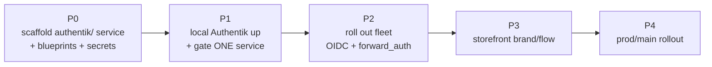
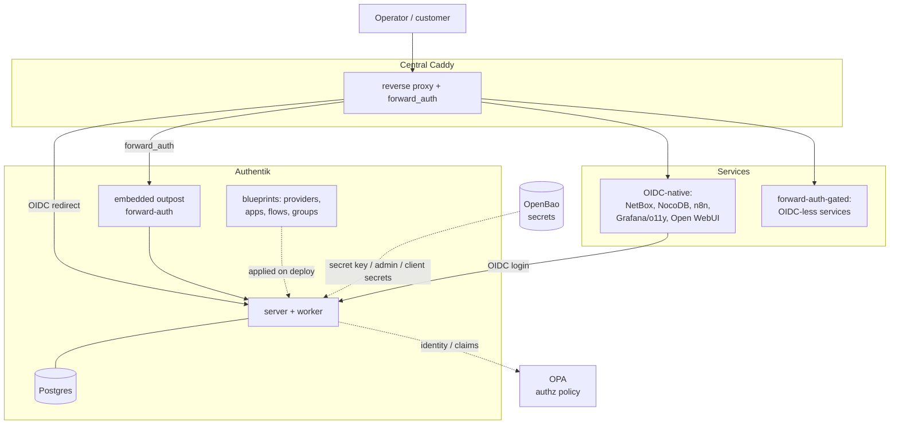

# 02 — SSO & Authentication (Authentik)
> **Consolidates:** AUTH-SSO-DEPLOYMENT.md, PROD-SSO-ROLLOUT-PLAN.md (originals archived in `plan/archive/`)
>
> **Depends on:** 00, 01
>
> Part of the dependency-ordered `plan/development/` set (00–10). The source
> plans are merged verbatim below under provenance dividers to preserve all
> detail; read in numbered order to execute.

<!-- ======================= source: AUTH-SSO-DEPLOYMENT.md ======================= -->

# Auth / SSO Deployment Plan — Authentik Central IdP

> **Location:** `plan/development/02-sso-auth.md`
> **Date:** 2026-06-13 · **Status:** PHASE 0 DONE (local) · **Owner:** uhstray-io
> **Context:** agent-cloud has machine auth (OpenBao secrets, OPA policy, AppRole) but **no human-identity layer**. This plan adds a central Identity Provider — **Authentik** — to give every Caddy-fronted service single sign-on, operator login, and (later) storefront-customer auth. Local-dev first (it deploys with the composable pattern already proven for DNS/Caddy/NetBox), then prod/main.
>
> **IMPLEMENTED (local-dev, Phase 0 + live) — 2026-06-14:** the composable service is built and **deployed + healthy via local Semaphore** (`platform/services/authentik/`, `deploy-authentik.yml`): server+worker+Postgres+Redis, `ak healthcheck` green, `/api/v3/root/config/` → 200, server on the `local-dev` network (Caddy reaches `authentik-server:9000`). Secrets (`secret_key`, `bootstrap_password`, `bootstrap_token`, `db_password`) generated once into `secret/services/authentik` and reused. Host debug port is `127.0.0.1:9300` (step-ca owns `:9000`). Wired: `authentik_svc` inventory group, bootstrap `_inv_ini`, "Deploy Authentik (Local)" template, seed blueprint (agent-cloud group), BATS (8). **Deferred to Phase 1/2:** the `auth.agent-cloud.test` Caddy route + `forward_auth` gating (the `caddy_routes` `forward_auth` shape below) — that's where SSO actually gates a service.
>
> **For agentic workers:** Execute phase-by-phase; every phase ends at a validation gate. Real domains/secrets stay in site-config; the public repo uses placeholders + `LOCAL_FAKE_` values.

**Goal:** One login for the whole platform — operators authenticate once at Authentik and reach every service (Semaphore, NetBox, NocoDB, n8n, o11y, Open WebUI, …) via OIDC or Caddy forward-auth; storefront customers get their own brand/flow on the same IdP.

**Architecture:** Authentik (server + worker + Postgres) runs as a composable platform service behind central Caddy. Services that speak OIDC integrate natively; those that don't are gated by Caddy `forward_auth` to an Authentik **embedded outpost**. All Authentik configuration (providers, applications, flows, groups) is declared as **blueprints** (YAML applied at startup) — config commits, not console clicks. Secrets flow from OpenBao exactly like every other service.

**Tech stack:** Authentik (Django + Go outpost), Postgres, Caddy `forward_auth`, OIDC/OAuth2, Authentik blueprints, OpenBao, composable Ansible tasks, Semaphore.

---

## Target outcome

When Phase 4's gate passes:

- **One identity, many services.** An operator logs in once at `auth.<zone>` and reaches Semaphore/NetBox/NocoDB/n8n/o11y/Open WebUI without re-authenticating — OIDC where supported, Caddy forward-auth elsewhere.
- **Human-identity fills the empty guardrail slot.** OpenBao (machine secrets) + OPA (authz policy) + **Authentik (human authn)** form the complete guardrail triad. Authentik says *who you are*; OPA says *what you may do*; OpenBao holds *machine credentials*.
- **Config is code.** Every realm/provider/application/flow is an Authentik blueprint in the repo, applied on deploy — adding a service to SSO is a config commit reviewed like any other.
- **Local mirrors prod.** Authentik deploys locally via the same composable service pattern (compose + `compose.local.yml` + `deploy-authentik.yml` + blueprints + `manage-secrets`) and is reached at `https://auth.agent-cloud.test`; prod is the same playbook with real OIDC clients + TLS.
- **Storefront on the same IdP.** UhhCraft customers authenticate through a dedicated Authentik brand/flow (separate from operator SSO), one system to run.

## 1. Problem

Every service currently has its own login (or none), each with separate credentials. There is no single sign-on, no central operator-identity, no consistent way to gate a new service, and no customer-identity story for the storefront. The guardrail layer protects *machines and actions* (OpenBao, OPA, Kyverno) but nothing answers *which human is this*. Adding SSO per-service ad-hoc would be 14× the work and inconsistent.

## 2. Decision criteria — why Authentik

The owner researched four products [1]. The decisive framing: **two are IdPs/SSO gateways (Authentik, Keycloak), two are embedded single-app libraries (Hanko, BetterAuth)** — and agent-cloud's ~14 Caddy-fronted services need a gateway, not a library.

| Option | Category | Verdict for agent-cloud |
|---|---|---|
| **Authentik** | Full IdP + **built-in forward-auth outpost** | **CHOSEN** — matches the Caddy-fronted fleet topology, ships forward-auth (no extra sidecar), MIT core, Python/Postgres footprint suits Proxmox, first-class blueprints/REST API = config-as-code, fully self-hosted |
| Keycloak | Full IdP (enterprise IAM) | Defensible alternative — most battle-tested, pure Apache-2.0, deep AD/LDAP. Rejected: heavier JVM footprint, dated admin UX, needs a separate `oauth2-proxy` for Caddy forward-auth |
| Hanko | Embedded auth (passkey-first) | Not a fleet gateway. **Reserved** as an optional future passkey-first login *embedded in UhhCraft* only — and its **AGPLv3 backend** is a flag for a commercial storefront |
| BetterAuth | Embedded TS library | Ruled out — TS library, can't gate a fleet, and UhhCraft is Go |

**Repo-grounded reasons Authentik wins here specifically:**
1. **Topology fit** — ~14 services behind central Caddy [2]; Authentik's embedded outpost + Caddy `forward_auth` gates them with no extra proxy. The local Caddy already routes `semaphore.agent-cloud.test`/`netbox.agent-cloud.test`/`openbao.agent-cloud.test` — those become the first gated apps.
2. **Config-as-code** — blueprints (declarative YAML) + REST API satisfy the "policy and configuration changes — code only" rule [3]; realms/clients become reviewed commits, not console state.
3. **Fills a real gap** — no human-identity layer exists; Authentik is additive, not a replacement.
4. **Ops + privacy fit** — Python/Ansible/pytest culture, self-hosted, MIT core, forkable.

**Two existing components it must NOT be confused with:**
- **Ory Hydra** already runs — but *only inside NetBox's Diode pipeline* for service-to-service OAuth2 ingestion [4]. It is not a human IdP. Authentik and Hydra stay **separate** (different jobs). Consolidating Diode onto Authentik is a far-future option, explicitly out of scope here.
- **OpenBao** is machine secrets, **OPA** is authz policy. Authentik is **authn (human identity)** — complementary. A clean future composition: Authentik authenticates → emits identity/claims → OPA authorizes the action.

## 3. Design principles

1. **Authentik is the human-identity layer; it does not replace OpenBao or OPA.** authn ≠ authz ≠ secrets.
2. **Config is blueprints, not clicks.** Every provider/application/flow/group is a versioned blueprint applied on deploy; the admin UI is read-only-by-convention.
3. **Prefer native OIDC; forward-auth only where a service can't.** OIDC gives real per-service identity + logout; forward-auth is the fallback gate for OIDC-less services.
4. **One codebase, two targets.** The same `deploy-authentik.yml` + blueprints run local and prod; differences are inventory vars + `LOCAL_FAKE_` secrets + TLS.
5. **Secrets through OpenBao only.** Authentik's secret key, bootstrap admin, DB password, and per-client secrets flow OpenBao → manage-secrets → `.env`/blueprint — never committed.
6. **SSO is additive and reversible.** Each service keeps a break-glass local admin; gating a service is one blueprint + one Caddy/OIDC change, revertable independently.

## 4. Architecture

Authentik sits in the guardrail layer as the human-identity component, in front of the service fleet via Caddy:

### Per-service integration matrix

| Service | Mechanism | Notes |
|---|---|---|
| NetBox | **forward_auth** (local, DONE) / OIDC (prod) | local: proxy provider + embedded outpost; NetBox trusts `X-authentik-*` via `REMOTE_AUTH_*`. NetBox runs as its own podman-compose project **off** the `local-dev` network, so OIDC's server-side token/userinfo calls can't resolve/trust the in-network IdP — forward_auth sidesteps that (NetBox makes no outbound IdP calls). Prod uses native OIDC `social_auth` on the composable deploy path (shared secret + reachability solved there). |
| NocoDB | **OIDC** (enterprise; else forward_auth) | OIDC SSO is a paid-tier feature like n8n — confirm edition at execution; community edition falls back to forward_auth |
| n8n | **forward_auth** (local, DONE) | community n8n has NO native OIDC (enterprise-only); `cweagans/n8n-oidc` evaluated + **rejected** (unverified ID-token = spec violation, unmaintained, hard-coupled to n8n internals). forward_auth gate (proxy provider + embedded outpost + platform-member binding) is final unless Enterprise is licensed |
| ERPNext | **OIDC** (local, DONE) | Frappe Social Login Key `authentik` (idempotent upsert in post-deploy.sh). Uses the **server-side OIDC reachability enabler**: Caddy `auth.<zone>` network alias + `:8443` internal listener (so the backend reaches the IdP at the browser host:port) + step-ca trust bundle (`distribute-ca-root.yml` → `REQUESTS_CA_BUNDLE`). Headless-validated (discovery TLS-verified, key enabled); browser login is the human check |
| o11y (Grafana) | **OIDC** (DONE) | generic OAuth; `GF_AUTH_GENERIC_OAUTH_ALLOWED_GROUPS` self-filters the tier (defense-in-depth alongside the IdP policy binding) |
| Open WebUI / WisAI | **OIDC** | OAUTH env config |
| Semaphore | **OIDC — DONE (local-dev, 2026-06-15)** | native OIDC via `SEMAPHORE_OIDC_PROVIDERS` (inner-map keyed `authentik`: `provider_url` = the Authentik issuer at `:8443`, `client_id=semaphore`, native `/api/auth/oidc/authentik/redirect` callback). Wired by the **bootstrap reorder** (LOCAL-DEV-DEPLOYMENT §12A): `bootstrap-local-dev.yml` reads `semaphore_oidc_client_secret` from OpenBao, builds + `jq`-validates the JSON (malformed → startup panic, so validate before inject), mounts the step-ca **trust bundle** (system roots + step-ca root) via `SSL_CERT_FILE` so Go TLS-verifies the IdP, and sets `SEMAPHORE_WEB_ROOT`. Semaphore boots OIDC-secured after step-ca/authentik; deps absent → boots **without** OIDC (fail-safe). Validated: login → HTTP 307 to Authentik, TLS-verified discovery from the container. Local admin is the fallback (no group→role mapping; promote OIDC admins manually) |
| OPA | **none — intentional** | Guardrail-layer machine API on `opa:8181` (no UI, not browser-facing); authorized by per-agent bearer tokens (Phase 2), not an IdP login. Documented in opa context |
| Nextcloud / WikiJS | **OIDC** | native |
| OpenBao UI | **forward_auth** (local, DONE) | network gate on the UI via the embedded outpost; OpenBao token auth unchanged; break-glass root token always retained. Internal control-plane access uses `local-openbao:8200` directly (ungated). True group→policy = later OIDC/JWT step |
| UhhCraft (storefront) | **OIDC** (separate brand/flow/tenant) | customer identity, not operator |
| services with no OIDC | **Caddy forward_auth** → outpost | uniform gate |

The matrix is a blueprint-per-service: each row is an Authentik `application` + `provider` blueprint + the service's OIDC/forward-auth config (templated from OpenBao client secrets).

### Platform groups (RBAC)

Authentik **groups** (not Authentik "Roles", which only delegate Authentik-admin) are the single source of truth for access tiers; each service maps a group to its own native role. Defined config-as-code in `blueprints/platform-groups.yaml`. Three tiers with a uniform access model:

| Group | Access intent | Grafana | NetBox | OpenBao UI |
|---|---|---|---|---|
| `platform-admins` | **full** access everywhere | Admin | superuser | reach UI (then OpenBao token) |
| `platform-developers` | **read-only** everywhere | Viewer | view-only (object perm) | reach UI (then OpenBao token) |
| `platform-user` | **no** access | denied (not in allowed groups) | denied at gate | denied at gate |

Enforcement happens in **two tiers**: (1) *can you reach the service* and (2) *what role you get*.

- **Tier 1 — reach** is the `platform-member` expression policy (`zz-sso-bindings.yaml`), bound to **every** application — forward_auth **and** OIDC (netbox, openbao, n8n, grafana, erpnext, semaphore). Authentik evaluates an application's policy bindings during the authorization flow **before issuing the OIDC token**, so the same gate that protects the forward_auth apps also **denies `platform-user`** for the OIDC apps (binding added 2026-06-15 — previously OIDC apps were ungated, letting the deny tier complete login). It passes `platform-admins`/`platform-developers` (and Authentik superusers, so break-glass `akadmin` is never locked out). Grafana's `GF_AUTH_GENERIC_OAUTH_ALLOWED_GROUPS` is now defense-in-depth on top of the IdP binding.
- **Tier 2 — role** maps the surviving groups to a native role. The group **names are the contract**; renaming breaks every consumer. The same list rides both the OIDC `groups` claim (Authentik's default `profile` scope emits it) and the forward_auth `X-authentik-groups` header:
  - **Grafana** — `ROLE_ATTRIBUTE_PATH`: `platform-admins`→Admin, else→Viewer (read-only). `ALLOWED_GROUPS` excludes business.
  - **NetBox** — `REMOTE_AUTH_GROUP_SYNC_ENABLED` syncs the header into Django groups; `REMOTE_AUTH_SUPERUSER_GROUPS=platform-admins` → superuser; a `platform-developers` group pre-seeded with a view-all `ObjectPermission` (in `local-netbox-up.sh`) → read-only. business never arrives (Tier-1 denied).
  - **OpenBao** — forward_auth is a *network gate* on the UI (Tier 1); OpenBao's own token auth governs read/write (Tier 2). Native **OIDC login is now live** (`openbao-oidc` app + OpenBao `auth/oidc`): its role maps every OIDC user to the `platform-admin` policy (`path "*"`), so that app is gated **admins-only** (`policy-platform-admin`, not `platform-member`) — a developer would otherwise inherit root. **Prod follow-up:** swap the OpenBao role to external-group→per-policy mapping (admins→admin, developers→read-only) and relax the `openbao-oidc` app gate back to `platform-member`.

Membership is assigned in the Authentik UI (or a future user-seed blueprint).

## 5. Implementation phases

> **Prerequisite:** trusted local TLS (`LOCAL-DEV-TLS-TRUST.md`) + clean URLs
> (`make local-https`) should be in place **before Phase 1** — OIDC cookies and
> discovery break on an untrusted cert / port-mismatched issuer (see §6 + the
> TLS plan's sequencing note). The canonical local issuer is the **port-free**
> `https://auth.agent-cloud.test` (requires `make local-https`); register all OIDC
> `redirect_uri`s against it (exact-match, port-sensitive).

### Phase 0 — Scaffold the service (composable, local-first)
- [ ] `platform/services/authentik/deployment/`: `compose.yml` (**server + worker + Postgres + Redis/valkey** — Authentik requires a Redis broker for the worker, matching NetBox's valkey choice; pinned image), `compose.local.yml` (caps, `label=disable`, `local-dev` network), `deploy.sh` (container lifecycle only), `templates/env.j2` (`AUTHENTIK_SECRET_KEY`, bootstrap admin, DB, Redis — from OpenBao; set `AUTHENTIK_LISTEN__HTTP` so Authentik serves plain HTTP on `:9000` behind Caddy, which terminates TLS), `blueprints/` (seed: default flow, an `agent-cloud` group), `context/architecture.md`
- [ ] **Caddy forward-auth shape**: extend `Caddyfile.local.j2` (and prod `Caddyfile`) with an optional `forward_auth` route form (a `caddy_routes` entry flag like `forward_auth: true` emitting the `forward_auth auth.agent-cloud.test { uri /outpost.goauthentik.io/auth/caddy … copy_headers X-authentik-* }` block + the `/outpost.goauthentik.io/*` passthrough). This is the real composable touch point Phase 2 needs — `caddy_routes` only renders flat `reverse_proxy` today.
- [ ] `deploy-authentik.yml` — composable: `place-monorepo` → `manage-secrets` → render env + blueprints → deploy.sh → wait healthy → verify `/api/v3/root/config/`
- [ ] OpenBao layout: `secret/services/authentik` (secret_key, bootstrap_password, bootstrap_token, db_password, per-client secrets)
- [ ] Wire local: `templates-local.yml` "Deploy Authentik (Local)", `authentik_svc` inventory group, `auth.agent-cloud.test` Caddy route (`caddy_routes`), bootstrap `_inv_ini`; port `127.0.0.1:9000`
- [ ] BATS: compose pinned/healthcheck, deploy.sh container-only, blueprint validity

**Gate 0:** CI green; templates registered; `ansible-playbook --syntax-check` clean.

### Phase 1 — Local Authentik up + gate ONE service
- [ ] `make local-deploy-authentik` → Authentik healthy at `https://auth.agent-cloud.test` (via Caddy), admin login works (`LOCAL_FAKE_` bootstrap)
- [ ] Gate **one** service end-to-end (recommend **Semaphore**, native OIDC, or **NetBox**): blueprint creates the OIDC provider+app; service configured to use it; login redirects to Authentik and back
- [ ] Prove blueprint-as-code: change a blueprint → redeploy → change reflected (no console edit)

**Gate 1:** one service's login flows through Authentik via local Semaphore deploy; identity claims visible; blueprint round-trip proven.

### Phase 2 — Roll out the fleet
- [x] **Grafana (OIDC)** — generic_oauth; browser AUTH_URL via Caddy, server-side token/userinfo via internal `authentik-server:9000` (o11y is on `local-dev`); client secret shared via `manage-secrets` `_shared_reads`.
- [x] **NetBox (forward_auth)** — proxy provider + embedded-outpost binding; `docker-compose.local-auth.yml` overlay sets `REMOTE_AUTH_*`; Caddy `forward_auth` route. Validated: unauth → Authentik 302; identity header → auto-created superuser + synced `platform-admins` group.
- [x] Group→role mapping in blueprints (`platform-groups.yaml`; each service maps the group list).
- [x] **OpenBao (forward_auth)** — proxy provider; UI gated via the shared embedded outpost; control-plane path (`local-openbao:8200`) unaffected.
- [x] Shared `zz-sso-bindings.yaml` owns the embedded-outpost provider list + the `platform-member` access gate for ALL forward_auth apps (applies last via `zz-`, so adding a service can't silently unbind the others).
- [x] Tiered RBAC (admin=full / developer=read-only / business=denied) across the three services.
- [x] Smoke: `make local-smoke` §7 — Authentik live + NetBox & OpenBao forward_auth 302→IdP + Grafana OIDC button.
- [ ] Remaining matrix services (Semaphore, Open WebUI, NocoDB/n8n edition-gated, …).

**Status (2026-06-14):** Grafana + NetBox + OpenBao gated through Authentik with the 3-tier model. Validated headlessly: the `platform-member` policy denies `platform-user` and passes admins/developers (PolicyEngine eval per user); NetBox header consumption gives admin superuser (view/add/delete) vs developer read-only (view only, no add/delete); Grafana `ALLOWED_GROUPS` + role path deployed; smoke §7 green. Break-glass retained (NetBox `ObjectPermissionBackend` extends `ModelBackend`; Grafana `GF_SECURITY_ADMIN_PASSWORD`; OpenBao root token). The credentialed browser click-through is the operator's final confirmation. **Gate 2 (partial):** covered services reach SSO with tiered access; break-glass retained.

### Phase 3 — Storefront brand/flow
> **This OVERRIDES a signed-spec decision.** UhhCraft's `context/spec/SPEC.md`
> specifies **self-built** customer auth (`scs` sessions, bcrypt cost 12, Redis
> login rate-limit, guest/account/admin roles). "Authentik for everything"
> replaces that subsystem — so this is a **migration**, not greenfield. Before
> building: record the override in the SPEC's `## Alignment with agent-cloud
> conventions` section (the spec's own override mechanism), and design the
> guest-checkout / session-cart / rate-limit-tier behaviors that are currently
> auth-coupled. Reference this decision from `WEBSMITH-INTEGRATION-PLAN.md`.
> *(Conservative fallback if the migration is too costly: scope Phase 3 to
> operator/admin SSO into UhhCraft's ADMIN surface only, leave customer auth as
> the SPEC defines it — the §8 "Hanko reserve" row already hints this is the
> softer decision.)*
- [ ] Reconcile with the UhhCraft SPEC (override recorded in its alignment section) + guest/cart/rate-limit migration design
- [ ] Separate Authentik **brand** + enrollment/login **flow** for UhhCraft customers (distinct from operator SSO); UhhCraft uses OIDC against it
- [ ] Customer self-enrollment + (optional) passkey stage

**Gate 3:** a customer signs up + logs into UhhCraft via the storefront flow; guest checkout + cart semantics preserved; SPEC override recorded; operators unaffected.

### Phase 4 — Prod/main rollout
- [ ] Provision the prod Authentik (own VM/secrets); real OIDC clients per service; real TLS (depends on `DNS-SERVER-DEPLOYMENT.md` + `LOCAL-DEV-TLS-TRUST.md` prod path)
- [ ] Promote per the risk-classed pipeline (secret-flow/multi-service = high → branch-deploy + rollback)
- [ ] Migrate each prod service to OIDC behind a maintenance gate; verify break-glass before disabling local auth (Critical Rule #5: verify before hardening)

**Gate 4:** prod operators SSO into the fleet; rollback path proven; no service left without break-glass.

## 6. Security considerations
- Local: all Authentik secrets are `LOCAL_FAKE_`; bootstrap admin is fake; bound to the local-dev network + Caddy.
- Prod: secret key + admin + client secrets in OpenBao; rotation via `CREDENTIAL-LIFECYCLE-PLAN.md`; cookies `Secure`/`HttpOnly`/`SameSite`; forward-auth only over TLS.
- **Break-glass**: every service keeps a local admin until SSO is proven (rule #5) — an IdP outage must not lock operators out of everything.
- **TLS dependency (prerequisite, not follow-on):** OIDC cookies (`Secure`/`SameSite`) and server-to-server discovery break on Caddy's untrusted internal CA. Trusted local TLS (`LOCAL-DEV-TLS-TRUST.md`) + clean port-free URLs (`make local-https`) should land **before Phase 1**. The owner's stated order was auth-first; the review recommends the TLS fix first (it's small) — owner to confirm (see §8).
- Authentik EE features (RAC, AI risk) stay off (MIT core only) to avoid the paid-license surface.
- **forward_auth header spoofing:** Caddy strips inbound `X-authentik-*` from the client *before* the auth subrequest (the `forward_auth` route in `Caddyfile.local.j2`), so only the outpost can set identity headers. Without this a caller could forge `X-authentik-username` and bypass auth — `copy_headers` only overwrites headers the outpost actually returns. The gated app must also be reachable **only** via Caddy (NetBox's `127.0.0.1:8000` is loopback-only on the dev host).
- **Embedded-outpost browser URL:** the embedded outpost reaches core in-process, so its `authentik_host` (set in the outpost blueprint to `https://auth.<zone>:8443/`) only drives the **browser** login redirect. Left empty, it falls back to the internal listen socket (`http://0.0.0.0:9000`), which the browser can't reach. (`authentik_host_browser` is not consulted for this redirect in 2024.12.)

## 7. Validation (master)

| Phase | Check | Pass |
|---|---|---|
| 0 | Scaffold | CI green; templates registered; blueprints validate |
| 1 | One service via SSO | local deploy → Authentik gates one service; blueprint round-trip |
| 2 | Fleet | all matrix services through SSO; break-glass retained |
| 3 | Storefront | customer signup/login via storefront flow |
| 4 | Prod | prod SSO + rollback proven; no service without break-glass |

## 8. Open decisions & risks

| Item | Status | Resolution |
|---|---|---|
| OIDC vs forward_auth per service | Matrix drafted (§4) | Confirm each service's OIDC support at execution; default forward_auth |
| Existing Ory Hydra consolidation | Out of scope | Keep separate; revisit only if Diode is reworked |
| Authentik image pin + upgrade backups | P0 | Pin a release; Authentik upgrades ship breaking changes + no downgrade — back up Postgres before each upgrade [1] |
| Authentik authn → OPA authz wiring | Future | Compose after SSO lands; not required for Phase 1–4 |
| Storefront passkey UX (Hanko reserve) | Deferred | Owner chose Authentik-for-everything; revisit Hanko-embedded only if a distinct passkey storefront is wanted (AGPLv3 flag) |
| Local port for Authentik (9000) vs Caddy | P0 | `127.0.0.1:9000` direct (HTTP, `AUTHENTIK_LISTEN__HTTP`); `auth.agent-cloud.test` via Caddy (add to `caddy_routes` → `local-authentik-server:9000`; registry of record: `docs/LOCAL-DEV.md`) |
| **Sequencing: TLS-trust before or after auth?** | **Owner to confirm** | Review recommends TLS-trust + `make local-https` **first** (OIDC needs trusted TLS + port-free issuer). Owner originally said auth-first; if kept, Phase 1 needs per-service TLS-verify-skip as a throwaway. |

## 9. References
1. *(owner research)* Four-product auth comparison (Authentik / Keycloak / Hanko / BetterAuth), 2026-06-13 — category framing (IdP vs embedded), licensing (Authentik MIT core + EE folder; Hanko AGPLv3 backend; Keycloak Apache-2.0; BetterAuth MIT), footprint, upgrade caveats.
2. *(repo)* `platform/services/caddy/deployment/` + `CLAUDE.md` — central Caddy fronts the service fleet; `forward_auth` available; the local Caddy already routes the control plane.
3. *(repo)* `CLAUDE.md` — "Policy and Configuration Changes — Code Only"; the composable secret flow Authentik reuses.
4. *(repo)* `platform/services/netbox/deployment/CLAUDE.md` — Ory Hydra is Diode-internal service-to-service OAuth2, not a human IdP.
5. *(repo)* `plan/development/00-foundation-local-dev.md` — the composable local pattern Authentik deploys with; Caddy/DNS already proven.
6. *(repo)* `plan/development/03-guardrails-governance.md` — the authz layer Authentik's identity later feeds.
7. *(repo)* `plan/development/00-foundation-local-dev.md` — the TLS-trust fix SSO depends on (executed right after this plan).

## 10. Revision history
| Date | Change |
|---|---|
| 2026-06-13 | Initial plan: Authentik chosen as central IdP (decision criteria + rejected alternatives from owner research, repo-grounded); composable local-first → prod architecture; per-service OIDC/forward_auth matrix; phases + gates; Authentik-for-everything incl storefront; kept separate from Ory Hydra; TLS-trust + OPA cross-refs |
| 2026-06-14 | Added OpenBao (forward_auth, UI gate) + the 3-tier access model (admin=full / developer=read-only / business=denied). Extracted the shared `zz-sso-bindings.yaml` (embedded-outpost provider list + `platform-member` access gate — fixes the silent-unbind risk when a 2nd forward_auth service is added). Grafana `ALLOWED_GROUPS`+role path; NetBox `platform-developers` view-all ObjectPermission for read-only. Security fix: loopback-bind the local NetBox publish (closed a LAN header-spoof bypass of forward_auth). |
| 2026-06-14 | Implemented Phase 2 for Grafana (OIDC) + NetBox (forward_auth). NetBox moved OIDC→forward_auth locally (runs off `local-dev`, can't reach the in-network IdP server-side); added `platform-groups.yaml` RBAC (platform-admins/developers/business) with per-service mapping; embedded-outpost `authentik_host` config (browser-redirect fix); Caddy `forward_auth` route + inbound-header strip; `local-smoke` §7. Mechanism fix: `place-monorepo` local copy switched tar→`rsync --delete` (honors `.gitignore`) so removed deploy inputs (e.g. retired blueprints) propagate. |
| 2026-06-13 | Adversarial-review fixes: added Redis to the Phase-0 compose (Authentik requires a broker); flagged TLS-trust as a prerequisite (OIDC cookies/discovery) and surfaced the auth-vs-TLS sequencing as an owner decision; added the `forward_auth` Caddyfile-template task (the real Phase-2 touch point); NocoDB OIDC marked enterprise-gated like n8n; Phase 3 reconciled with UhhCraft's signed self-built-auth SPEC (override-or-descope); Authentik HTTP `:9000` behind Caddy + port-free issuer |
| 2026-06-26 | OIDC blueprint redirect/launch URLs now **rendered from inventory** (blueprint `context:`) instead of `!Env`-with-local-default: Authentik only re-applies a blueprint on file-content change, so the byte-identical `!Env` file froze the local-dev URL in prod (broke `semaphore`'s redirect_uri — hotfixed live, then made durable). Added the **safe-promotion mechanism** — catalog `prod_required`/`verify_redirect`, a pre-apply GUARD (prod URLs set + not `agent-cloud.test`) and a post-apply VERIFY (`verify-oidc.py` vs the live API). |

<!-- ======================= source: PROD-SSO-ROLLOUT-PLAN.md ======================= -->

# Production SSO Rollout Plan — Authentik for Semaphore, Proxmox, NetBox (+ Grafana)

Status: IN PROGRESS (2026-06-25). Owner: platform. Supersedes nothing; extends
`plan/development/02-sso-auth.md` with the prod promotion + composability.

## Goal

Authenticate into and access the key production services via Authentik SSO at
`https://auth.uhstray.io`: **Semaphore, Proxmox (pve), NetBox** now; **Grafana
(o11y.uhstray.io)** next. Production Authentik must show **only services that are
actually in production**, and promoting a service from local-dev → prod must be a
one-line, composable change.

## Hard constraints (NON-NEGOTIABLE)

- **No destructive actions on production machines.** Additive, reversible only.
- **No changes to existing user credentials.**
- **Proxmox per-user TOTP must keep working.** OIDC is added as a *separate
  realm*; the existing PAM/PVE realms + their TOTP are never touched.
- Production deploys go through Semaphore from a repo branch (branch-deploy to
  test, then `feat → dev → main`). Gate each prod step explicitly.
- **Snapshot before every prod upgrade.** Standard practice: take a Proxmox
  snapshot of the target VM, **wait for it to finish, and validate it exists**
  *before* the upgrade — the catastrophic-failure rollback point. Reusable
  mechanism: `platform/playbooks/snapshot-vm.yml` (create → wait → validate; via
  Semaphore with OpenBao creds, or operator-side with env creds). The upgrade
  aborts if the snapshot can't be validated.

## Decisions (confirmed 2026-06-25)

1. **Composable prod-tag = manifest list.** `authentik_apps` (per-environment
   list of enabled app slugs). Local-dev = all; prod (site-config) = the prod
   subset. Promote = add a slug. (Chosen over per-blueprint labels / split dirs.)
2. **Rollout order:** composable mechanism → **Semaphore** (already OIDC-proven
   locally, lowest risk) → NetBox → Proxmox (riskiest last) → Grafana/o11y later.
3. **Split-horizon DNS: DEFERRED, with one scoped exception (found in testing).**
   Browsers reach `*.uhstray.io` fine via Cloudflare. But **server-side** calls
   from a service to `auth.uhstray.io` (OIDC discovery + token exchange) get
   Cloudflare's bot-challenge (verified: `cf-mitigated: challenge`). So each
   OIDC *client* must resolve `auth.uhstray.io` to the internal Caddy — done
   per-container via compose `extra_hosts` (Authentik derives the issuer from the
   Host header, so tokens stay `https://auth.uhstray.io/...` and still validate).
   The broader pfSense Unbound split-horizon (`*.uhstray.io → Caddy host`) remains
   deferred — `extra_hosts` covers the server-side need without it.

## The composable mechanism (manifest-driven blueprint selection)

Problem today: all 14 committed Authentik blueprints apply unconditionally in
BOTH local and prod, so prod shows apps for services not in prod (erpnext, n8n,
grafana, openbao…) + local test users. No environment gating exists.

Design:

- **App catalog** (`deployment/app-catalog.yml`, committed): every possible app
  → `{ file, type: oidc|forward_auth, tier: member|admin }`.
- **`authentik_apps`** (inventory list): which catalog slugs are enabled in this
  environment. Local-dev inventory = all; site-config (prod) = the prod subset.
  Unset ⇒ defaults to all (local-dev unchanged).
- **`deploy-authentik` assembles `blueprints-active/`** (gitignored) per deploy:
  the always-shared blueprints (`agent-cloud`, `platform-groups`,
  `agent-cloud-admin`, `stray-admin`, `service-account`) + each enabled app's
  blueprint file from the `blueprints/` library, and renders
  `zz-sso-bindings.yaml` from the enabled set (outpost provider list = enabled
  forward_auth apps; one PolicyBinding per enabled app at its tier). compose
  mounts `blueprints-active/` (not the full `blueprints/` library).
- **Promote** = add the slug to prod `authentik_apps` **and set its `prod_required`
  URL vars in site-config** (the GUARD below enforces this); next deploy includes it.
  The rendered bindings never reference a non-existent provider/app (fixes the
  `!Find` failure that listing-all would cause in prod).

Per-OIDC-app **redirect URIs + launch URLs are rendered from inventory at deploy**
(in the blueprint `context:` block, e.g. `{{ <svc>_redirect_uri | default('<local>') }}`),
so the file CONTENT is environment-specific. This matters: **Authentik re-applies a
blueprint only when its file content hash changes.** The earlier `!Env [VAR, default]`
form produced byte-identical files across environments, so once a provider was first
applied with the local default it NEVER re-applied — freezing the local-dev URL in prod
(exactly what broke `semaphore`'s `redirect_uri`). Rendering the value into the file
makes the content differ per env, so the worker re-applies and self-corrects. Local-dev
keeps the `*.agent-cloud.test` defaults; prod sets `*.uhstray.io` in site-config.

**Safe promotion — the standard way to promote an OIDC app to prod without the
silent-local-URL mistake** (`app-catalog.yml` carries the per-app runbook):

- The catalog declares `provider` / `prod_required` / `verify_redirect` per OIDC app.
- **GUARD (pre-apply, prod only):** `deploy-authentik` asserts every enabled OIDC app's
  `prod_required` inventory vars are set AND not still pointing at `agent-cloud.test` —
  a missing or local URL fails the deploy loudly instead of provisioning it.
- **VERIFY (post-apply, prod only):** `verify-oidc.py` runs inside `authentik-server`,
  queries the live API, and fails the deploy if any provider's `redirect_uris` lacks
  its intended URL — catching an object that didn't actually update. Gated by
  `authentik_verify_oidc` (default: on in prod, off local).

## Per-service auth — target: native OIDC over forward_auth (keeps APIs/CLIs working)

The intended direction is native OIDC per service, not forward_auth, because OIDC
leaves each service's API/CLI/token auth intact. Some services start on forward_auth
and migrate (e.g. NetBox below); the goal state is native OIDC where the service
supports it.

- **Semaphore** (`semaphore.uhstray.io`): native OIDC via the
  `SEMAPHORE_OIDC_PROVIDERS` env var. Redirect
  `https://semaphore.uhstray.io/api/auth/oidc/authentik/redirect` (no trailing
  slash — byte-matches the parameterized `semaphore-oidc.yaml` blueprint). Local
  admin fallback retained (OIDC only ADDS a provider; OIDC-only is never forced).
  **Applied from the operator/genesis layer, NEVER via a Semaphore job** —
  Semaphore is the control plane; a job that restarts its own container is
  circular (same reason `make local-bootstrap` brings it up last from outside).
  Mechanism (site-config `scripts/semaphore-upgrade.sh` — a REUSABLE safe-upgrade
  tool, `CHANGE=oidc|image|restart`): an additive `compose.override.yml` injects
  only the env (+ `extra_hosts` for internal issuer resolution) — `compose.yml`/
  `entrypoint.sh`/`config.json` are untouched, so `access_key_encryption`
  (decrypts Semaphore's stored SSH keys) is never at risk. The envelope is the
  reusable part: pre-flight gates (valid OIDC JSON; the container's internal path
  to the issuer resolves; Semaphore healthy) → **pre-upgrade Proxmox snapshot
  (create/wait/validate)** → stage → recreate → post-flight verify (`/api/ping` +
  provider login route redirects) with **auto-rollback** on failure;
  rollback = restore the previous override + recreate.
  The OIDC map mirrors the local-genesis shape in `bootstrap-local-dev.yml`.
- **NetBox** (`netbox.uhstray.io`): move forward_auth → **native OIDC**
  (community NetBox bundles `python-social-auth` generic OIDC). `configuration.py`:
  `REMOTE_AUTH_BACKEND = social_core.backends.open_id_connect.OpenIdConnectAuth`,
  `SOCIAL_AUTH_OIDC_OIDC_ENDPOINT = https://auth.uhstray.io/application/o/netbox`,
  key/secret, `SOCIAL_AUTH_REDIRECT_IS_HTTPS=True`. Redirect
  `https://netbox.uhstray.io/oauth/complete/oidc/`. Preserves REST API/token auth
  (Diode/orb-agent). New `netbox-oidc.yaml` blueprint (OIDC provider, not proxy).
- **Proxmox** (`pve.uhstray.io`): **add an OIDC realm** —
  `pveum realm add authentik --type openid --issuer-url
  https://auth.uhstray.io/application/o/proxmox/ --client-id … --client-key …
  --username-claim username --autocreate 1`. Additive + reversible
  (`pveum realm delete authentik`). **PAM/PVE realms + TOTP untouched** (OIDC is a
  separate realm; 2FA on the OIDC path is delegated to Authentik). Caddy =
  **TLS reverse-proxy only** (`tls_insecure_skip_verify` to the self-signed :8006,
  forward WS for noVNC); **NO forward_auth** (would break the API + console).
  New `proxmox-oidc.yaml` blueprint. Group→PVE-role ACLs mapped from a
  `proxmox-admins` Authentik group.
- **Grafana** (`o11y.uhstray.io`, later): generic OAuth (`GF_AUTH_GENERIC_OAUTH_*`),
  `role_attribute_path` mapping `platform-admins→Admin / platform-developers→Viewer`,
  `allow_assign_grafana_admin`. Blueprint `grafana-oidc.yaml` exists.

## o11y / monitoring (future phase)

Keep the existing composable `platform/services/o11y` (Grafana+Prometheus+Loki+
Alloy; OIDC-ready, OpenBao, Caddy) as the chassis. **Harvest** components/configs
from `github.com/uhstray-io/o11y` (do NOT adopt its deploy model — hardcoded
creds, `:latest`, a committed Discord webhook). Phases:
- 2a infra metrics: node-exporter + cAdvisor + Caddy metrics scrape + alert rules.
- 2b homelab breadth: `prometheus-pve-exporter` (Proxmox; token already in
  OpenBao `secret/services/proxmox`), `snmp_exporter` (pfSense/switches),
  `blackbox_exporter` (HTTP/ICMP/cert probes of service URLs from inventory),
  per-VM node-exporter/Alloy agents via Ansible.
- 2c tracing/profiling (Tempo/Pyroscope/MinIO) only when an app needs it.
Then Grafana OIDC at `o11y.uhstray.io` via the mechanism above.

## Rollout sequence + gates

1. **Mechanism** (this branch): catalog + `authentik_apps` + `blueprints-active/`
   assembly + templated `zz-sso-bindings`. Validate locally (render local-vs-prod;
   lint). PR `feat → dev`.
2. **Prod Authentik prune + Semaphore SSO**: set prod `authentik_apps` to the prod
   set; parameterize semaphore redirect; branch-deploy Authentik to the Authentik
   VM (verify it shows ONLY prod apps + `ak healthcheck` + outpost — DONE).
   Then wire Semaphore prod OIDC with `semaphore-upgrade.sh apply` (operator-side;
   snapshot+validate → env-override → restart → verify → auto-rollback);
   verify SSO login (local admin fallback intact). Gate.
3. **NetBox OIDC** (forward_auth → OIDC), verify API/token auth + SSO. Gate.
4. **Proxmox OIDC realm** (additive), verify: existing PAM/PVE login + **TOTP**
   still work, API tokens work, noVNC console works, OIDC login works. Gate.
5. **Grafana/o11y** monitoring expansion + OIDC. Later.

Each prod step: branch-deploy → verify → `feat → dev → main` PR → revert Semaphore
repo to `main`. No credential changes. Nothing destructive.

## GitHub Actions path (future, for bootstrapping/upgrading Semaphore)

Semaphore can't safely upgrade itself (a self-restarting job is circular), so today
the operator runs `semaphore-upgrade.sh` from a workstation. A more consistent
future home for that **same envelope** is a GitHub Actions workflow on a
**self-hosted runner** inside the network (the runner reaches the Semaphore
host/Proxmox/OpenBao; secrets via GitHub Environments or OpenBao):
- The job runs `semaphore-upgrade.sh` (or the `snapshot-vm.yml` + override logic
  directly) — identical gates: pre-flight → **snapshot+validate** → apply →
  verify → auto-rollback. No logic forks; the runner just replaces the laptop.
- Gains: consistent environment, audited/approved runs (GH Environments + required
  reviewers), one button, runs even when no operator is at a workstation.
- Constraints unchanged: never via Semaphore itself; additive + reversible;
  snapshot first. Keep the bash tool as the source of truth the workflow calls,
  so local and CI paths stay identical.
