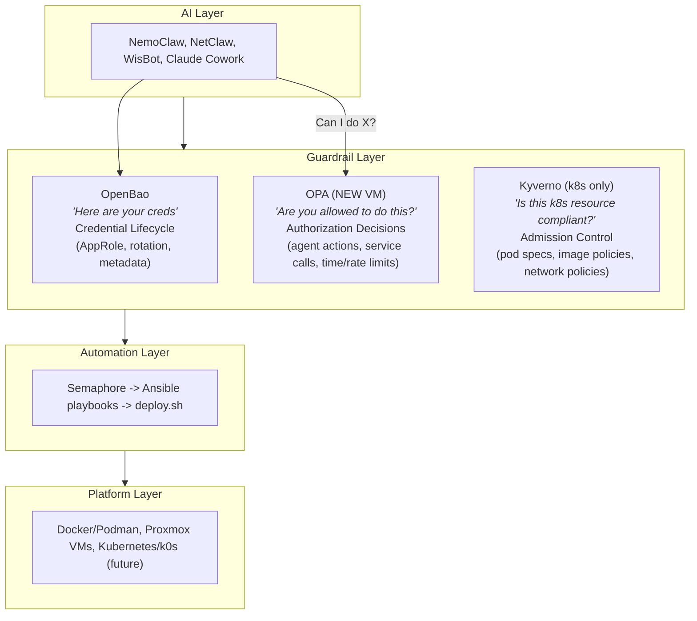
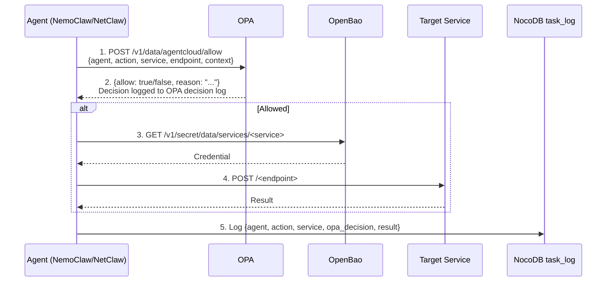
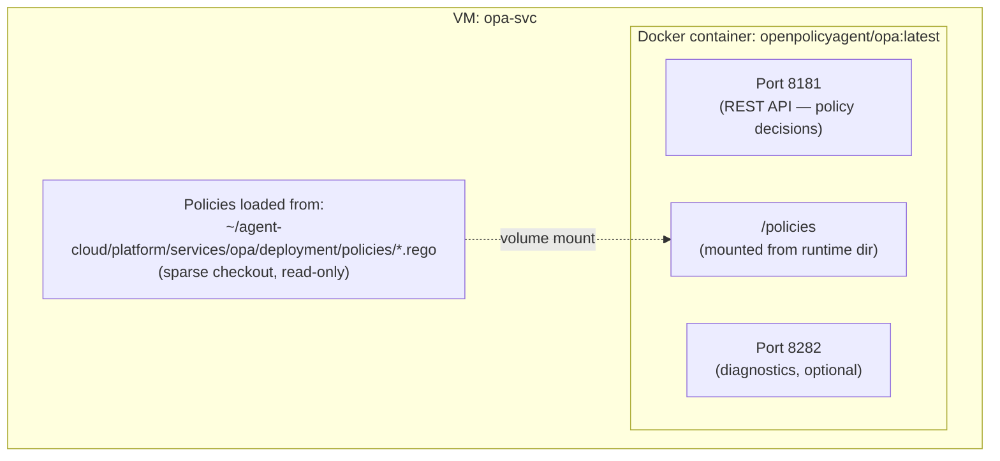
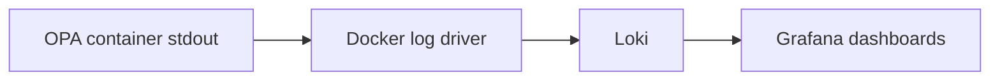
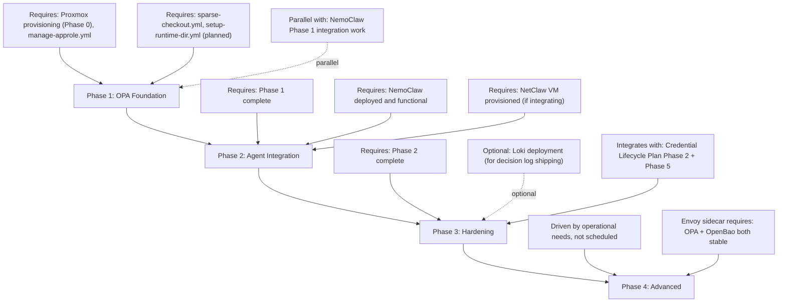
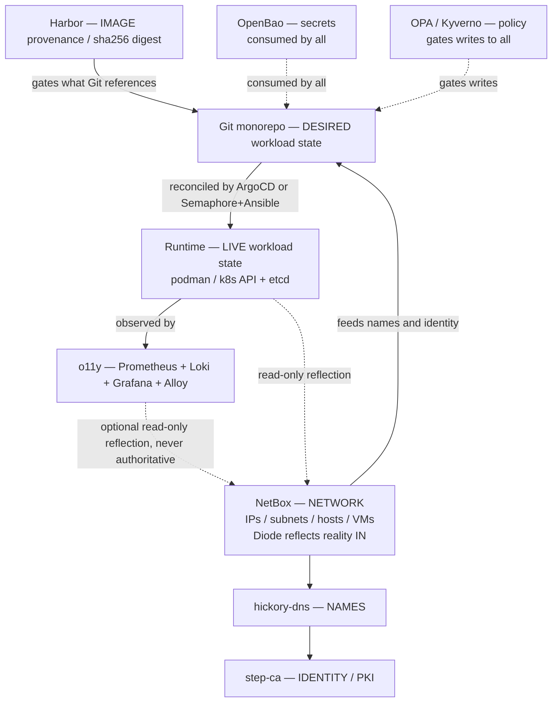

# 03 — Guardrails & Governance (OPA, branch protection, source-of-truth)
> **Consolidates:** OPA-INTEGRATION-PLAN.md, MAIN-BRANCH-PROTECTION-PLAN.md, SOURCE-OF-TRUTH.md (originals archived in `plan/archive/`)
>
> **Depends on:** 00, 01
>
> Part of the dependency-ordered `plan/development/` set (00–10). The source
> plans are merged verbatim below under provenance dividers to preserve all
> detail; read in numbered order to execute.


<!-- ═══════════════════════ source: OPA-INTEGRATION-PLAN.md ═══════════════════════ -->

# OPA Integration Plan: Policy-as-Code for Agent-Cloud

**Date:** 2026-04-07
**Status:** Phase 1 DEPLOYED (local-dev, 2026-06-14) — OPA running via the composable
local pattern (`platform/services/opa/deployment/`, `deploy-opa.yml`, `opa_svc`
inventory group, "Deploy OPA (Local)" Semaphore template). Unauthenticated
internal decision API on `opa:8181` (local-dev), host diagnostics `127.0.0.1:8281`.
`agent_actions.rego` + `data.json` (under the recursion-safe `data.agentcloud.catalog`
namespace) + tests pass 7/7; deploy verifies allow+deny + `opa test`; smoke §8 green.
**Adaptations from this prod-first plan:** local follows the place-monorepo →
deploy.sh → verify pattern (not sparse-checkout); image pinned to the multi-arch
`-static` tag (plain tag is amd64-only, crashes under arm64 emulation); Phase 1
has no secrets so no manage-secrets/AppRole yet (added in Phase 2/3). Agent
integration (Phase 2), token auth + Loki decision logs (Phase 3) remain.
**Context:** The Four-Layer Guardrails Model (CLAUDE.md, Unification Plan) already positions OPA in the Guardrail Layer alongside OpenBao and Kyverno. This plan operationalizes that architecture — defining how OPA deploys, what policies it enforces, how it integrates with the composable automation patterns, and where it fits in the implementation roadmap.

---

## Problem

The current agent-cloud stack has a **policy gap between credential access and action authorization**:

1. **OpenBao governs secrets, not actions** — Once NemoClaw retrieves an API key from `secret/services/nocodb`, nothing constrains which NocoDB endpoints it calls, how often, or under what conditions. OpenBao's HCL policies are path-based and internally scoped — they answer "can this token read this secret path?" not "can this agent perform this action on this service."

2. **Per-service API keys are binary** — A valid API key either works or doesn't. There's no conditional layer: no time-of-day restrictions, no rate limiting by agent identity, no action-level filtering. NemoClaw with a Semaphore API token can trigger any template, including destructive ones.

3. **No unified audit of agent decisions** — OpenBao's audit log captures secret access. n8n logs workflow executions. NocoDB logs task entries. But there's no single decision log that records "NemoClaw attempted action X on service Y and was {allowed|denied} because of policy Z."

4. **Cross-agent coordination has no policy layer** — The NocoDB task queue mediating NemoClaw↔NetClaw coordination relies on application-level checks. There's no infrastructure-level policy preventing one agent from exceeding its scope when writing tasks for another.

5. **The Guardrails Model is incomplete without OPA** — The CLAUDE.md Four-Layer architecture lists OPA explicitly. Kyverno handles Kubernetes admission control (Phase 3+ in the Unification Plan). OPA handles everything else: Docker/Podman environments, agent API authorization, cross-service policy decisions. Without OPA, the Guardrail Layer is only enforcing secrets (OpenBao) and future k8s policies (Kyverno).

---

## Design Principles

These align with the existing platform design principles and composable automation patterns:

1. **OPA is the cross-service policy decision point** — OpenBao owns credentials, Kyverno owns Kubernetes admission, OPA owns everything else. No overlap, no duplication.
2. **Policies are code** — Rego files live in the monorepo under `platform/services/opa/deployment/policies/`, version-controlled, testable with `opa test`.
3. **OPA follows the composable deployment pattern** — Same 4-phase playbook structure as every other service: sparse checkout → manage secrets → deploy containers → verify health.
4. **Credential lifecycle compliance** — OPA's own credentials (if any) follow the Create→Verify→Retire pattern. OPA can also enforce policy on credential access as an Envoy sidecar (Phase 3).
5. **OpenBao remains the single source of truth for secrets** — OPA never stores or manages credentials. It makes authorization decisions. OpenBao issues credentials. They are complementary layers.
6. **Selective integration over completeness** — Deploy the policies the uhstray.io datacenter actually needs. Don't write 50 Rego rules for theoretical scenarios. Start with agent action governance and expand based on real incidents or requirements.

---

## Architecture

### Where OPA Sits in the Four-Layer Model



### Agent Authorization Flow

The runtime flow for an agent making a service call:



This is additive to the current flow — agents currently go straight from step 3 to step 4. OPA inserts steps 1-2 as a policy checkpoint without modifying the credential lifecycle.

### Deployment Architecture: Centralized Container

One OPA instance, deployed as a Docker container on a dedicated lightweight VM. All agents and services query it over HTTP.



Resource requirements are minimal — OPA holds all policies and data in-memory, typically consuming ~50–100MB RAM with sub-millisecond evaluation times. A 1-core / 1GB RAM / 20GB disk VM is sufficient.

---

## Repository Structure

Following the established `deployment/ + context/` pattern:

```
platform/services/opa/
  deployment/
    compose.yml                     # OPA container definition
    deploy.sh                       # Container lifecycle (pull, start, wait)
    post-deploy.sh                  # Load initial policies, verify API
    templates/
      opa-env.env.j2               # Environment config (log level, etc.)
    policies/                       # Rego policy files (source of truth)
      agentcloud/
        agent_actions.rego          # Core agent authorization rules
        agent_actions_test.rego     # Unit tests for agent rules
        semaphore_governance.rego   # Semaphore template execution policies
        semaphore_governance_test.rego
        network_operations.rego     # NetClaw-specific network action policies
        network_operations_test.rego
        data.json                   # Static data (agent definitions, service catalog)
      common/
        helpers.rego                # Shared utility functions (time checks, etc.)
  context/
    architecture.md                 # How AI agents interact with OPA
    skills/                         # Agent skill definitions for OPA queries
      check-authorization.md        # NemoClaw/NetClaw skill: query OPA before acting
```

---

## Composable Deployment (Following Automation-Composability Pattern)

### VM Specification

Added to `proxmox/vm-specs.yml`:

```yaml
opa:
  vmid: 270
  hostname: opa-svc
  cores: 1
  memory: 1024         # 1GB — OPA is extremely lightweight
  disk: 20
  ip: "{{ opa_service_ip }}"  # Set in site-config inventory
  container_engine: docker
  service_name: opa
  monorepo_deploy_path: "platform/services/opa/deployment"
```

### Composable Playbook: `deploy-opa.yml`

Follows the standard 4-phase pattern from AUTOMATION-COMPOSABILITY.md:

```yaml
---
# deploy-opa.yml — Deploy OPA policy engine
# Pattern: Sparse checkout → Secrets → Containers → Verify

- name: "Phase 1: Sparse Checkout"
  hosts: opa_svc
  tasks:
    - include_tasks: tasks/sparse-checkout.yml
      vars:
        _sparse_paths:
          - "platform/services/opa/deployment"
          - "platform/lib"

- name: "Phase 2: Secrets + Runtime Directory"
  hosts: opa_svc
  tasks:
    - include_tasks: tasks/manage-secrets.yml
      vars:
        _secret_definitions:
          - path: "{{ vault_secret_prefix }}/opa"
            fields:
              decision_log_endpoint: "{{ _decision_log_endpoint | default('') }}"
        _env_templates:
          - src: "templates/opa-env.env.j2"
            dest: "env/opa.env"
    - include_tasks: tasks/setup-runtime-dir.yml

- name: "Phase 3: Container Operations"
  hosts: opa_svc
  tasks:
    - include_tasks: tasks/run-deploy.yml

- name: "Phase 4: Verify"
  hosts: opa_svc
  tasks:
    - include_tasks: tasks/verify-health.yml
      vars:
        _health_url: "http://{{ ansible_host }}:8181/health"
        _health_retries: 5
        _health_delay: 3
```

### compose.yml

```yaml
services:
  opa:
    image: openpolicyagent/opa:${OPA_VERSION:-latest-static}
    container_name: opa
    command:
      - "run"
      - "--server"
      - "--addr=0.0.0.0:8181"
      - "--diagnostic-addr=0.0.0.0:8282"
      - "--set=decision_logs.console=true"
      - "--set=status.console=true"
      - "/policies"
    ports:
      - "8181:8181"
      - "8282:8282"
    volumes:
      - "${CLONE_DIR}/platform/services/opa/deployment/policies:/policies:ro"
    env_file:
      - env/opa.env
    restart: unless-stopped
    healthcheck:
      test: ["CMD", "wget", "-q", "--spider", "http://localhost:8181/health"]
      interval: 15s
      timeout: 5s
      retries: 3
```

### deploy.sh

Following the pure container operations pattern — no secret generation, no OpenBao interaction:

```bash
#!/usr/bin/env bash
set -euo pipefail

SCRIPT_DIR="$(cd "$(dirname "$0")" && pwd)"
CLONE_DIR="${CLONE_DIR:-$(cd "$SCRIPT_DIR/../../../.." && pwd)}"

source "${CLONE_DIR}/platform/lib/common.sh"

# Step 1: Verify env files (fail if Ansible didn't run)
require_file "env/opa.env" "Run manage-secrets.yml first"

# Step 2: Pull latest OPA image
compose_cmd pull

# Step 3: Start OPA
compose_cmd up -d

# Step 4: Wait for health
wait_for_health "http://localhost:8181/health" 30
log_success "OPA is healthy"
```

### post-deploy.sh

```bash
#!/usr/bin/env bash
set -euo pipefail

SCRIPT_DIR="$(cd "$(dirname "$0")" && pwd)"
CLONE_DIR="${CLONE_DIR:-$(cd "$SCRIPT_DIR/../../../.." && pwd)}"

source "${CLONE_DIR}/platform/lib/common.sh"

# Verify policies loaded
POLICY_COUNT=$(curl -s http://localhost:8181/v1/policies | jq '.result | length')
if [[ "$POLICY_COUNT" -lt 1 ]]; then
  log_error "No policies loaded in OPA"
  exit 1
fi
log_success "OPA loaded ${POLICY_COUNT} policy module(s)"

# Smoke test: query a policy
RESULT=$(curl -s -X POST http://localhost:8181/v1/data/agentcloud/allow \
  -H "Content-Type: application/json" \
  -d '{"input":{"agent":"smoke-test","action":"test","service":"opa"}}')

if echo "$RESULT" | jq -e '.result' > /dev/null 2>&1; then
  log_success "OPA policy evaluation working"
else
  log_error "OPA policy evaluation failed: $RESULT"
  exit 1
fi
```

---

## Credential Lifecycle Integration

OPA itself has a minimal credential footprint compared to services like NetBox or NocoDB. However, it must be fully integrated with the credential lifecycle patterns from CREDENTIAL-LIFECYCLE-PLAN.md.

### OPA's Credential Surface

| Credential | Purpose | Storage | TTL |
|---|---|---|---|
| OPA API access token (optional) | Authenticate callers to OPA's REST API | OpenBao `secret/{{ vault_secret_prefix }}/opa:api_token` | 90 days |
| Decision log shipping token | Authenticate to Loki/observability endpoint | OpenBao `secret/{{ vault_secret_prefix }}/opa:log_token` | 90 days |
| Bundle server credentials (Phase 3) | Pull policy bundles from authenticated endpoint | OpenBao `secret/{{ vault_secret_prefix }}/opa:bundle_token` | 90 days |

**Phase 1 (initial deployment):** OPA runs with `--authentication=off` — all agents can query it without tokens. This is acceptable because OPA is on an internal-only network and returns decisions, not secrets. The policy evaluation itself is the security mechanism — an attacker who can query OPA only learns what's allowed, and OPA doesn't execute actions.

**Phase 2 (hardened):** Enable `--authentication=token` and issue per-agent bearer tokens stored in OpenBao. Agents fetch their OPA token from OpenBao alongside their service credentials. Token rotation follows the Create→Verify→Retire pattern via `rotate-credential.yml`.

### AppRole for OPA

OPA's own AppRole follows the `manage-approle.yml` composable task:

```hcl
# opa policy — minimal, OPA only needs its own config secrets
path "secret/data/{{ vault_secret_prefix }}/opa" {
  capabilities = ["read"]
}

path "secret/metadata/{{ vault_secret_prefix }}/opa" {
  capabilities = ["read"]
}

path "auth/token/renew-self" {
  capabilities = ["update"]
}
```

Provisioned via:
```yaml
- include_tasks: tasks/manage-approle.yml
  vars:
    _approle_name: "opa"
    _approle_policy: "{{ lookup('file', _deploy_dir + '/config/policies/opa.hcl') }}"
    _approle_token_ttl: "30m"
```

### Metadata on OPA Secrets

Following the credential metadata standard from Credential-Lifecycle-Plan.md, every secret stored for OPA includes KV v2 custom metadata:

```json
{
  "created_at": "2026-04-07T12:00:00Z",
  "creator": "deploy-opa.yml",
  "site": "{{ site_name }}",
  "purpose": "OPA policy engine configuration",
  "rotation_schedule": "90d"
}
```

Written by `write-secret-metadata.yml` as part of the deploy playbook.

### Updating Agent AppRole Policies

Existing agent AppRoles (NemoClaw, NetClaw) do **not** need modification to work with OPA. OPA is queried via unauthenticated HTTP (Phase 1) or with a separate OPA-specific bearer token (Phase 2). The OpenBao AppRole policies control secret access; OPA controls action authorization. They are orthogonal.

However, when per-agent OPA tokens are introduced (Phase 2), agent policies need a single additional path:

```hcl
# Addendum to nemoclaw-read policy
path "secret/data/{{ vault_secret_prefix }}/opa/agents/nemoclaw" {
  capabilities = ["read"]
}
```

This stores NemoClaw's OPA bearer token at a per-agent path, maintaining the least-privilege principle.

---

## Policy Design

> **Namespace note (implemented form):** the prod-first sketches below reference
> permissions directly under `data.agentcloud.<agent>`. The **deployed** Phase-1
> policy moved the static catalog into the recursion-safe
> **`data.agentcloud.catalog`** sub-namespace (a SEPARATE namespace from the
> `agentcloud` *package*, so `data.agentcloud.catalog[input.agent]` can't recurse
> through the package's own rules) — i.e. `data.agentcloud.catalog[<agent>].allowed_actions`.
> See `policies/agentcloud/agent_actions.rego` for the authoritative form; the status
> block at the top of this plan reflects it.

### Core Policy: Agent Action Authorization

`platform/services/opa/deployment/policies/agentcloud/agent_actions.rego`:

```rego
package agentcloud

import rego.v1

default allow := false

# --------------------------------------------------
# Static data: loaded from data.json
# Defines agent identities, service catalog,
# and permission mappings
# --------------------------------------------------

# NemoClaw: API-only workflow automation
allow if {
    input.agent == "nemoclaw"
    input.service in data.agentcloud.nemoclaw.allowed_services
    input.action in data.agentcloud.nemoclaw.allowed_actions[input.service]
}

# NetClaw: network infrastructure operations
allow if {
    input.agent == "netclaw"
    input.service in data.agentcloud.netclaw.allowed_services
    input.action in data.agentcloud.netclaw.allowed_actions[input.service]
}

# Block all agents from destructive Semaphore templates
deny if {
    input.service == "semaphore"
    input.action == "run_task"
    input.template_name in data.agentcloud.semaphore.destructive_templates
    not input.human_approved
}

# Override: deny always takes precedence
allow if {
    not deny
    # ... (existing allow rules above)
}

# Rate limiting signal (not enforced by OPA, but reported)
rate_warning if {
    input.action_count_last_minute > data.agentcloud.rate_limits[input.agent][input.service]
}

# Decision metadata (returned alongside allow/deny)
decision := {
    "allowed": allow,
    "agent": input.agent,
    "service": input.service,
    "action": input.action,
    "reason": reason,
    "rate_warning": rate_warning,
}

reason := "allowed by agent policy" if { allow; not deny }
reason := "blocked by destructive template policy" if { deny }
reason := "no matching allow rule" if { not allow; not deny }
```

### Static Data File

`platform/services/opa/deployment/policies/agentcloud/data.json`:

```json
{
  "agentcloud": {
    "nemoclaw": {
      "allowed_services": ["nocodb", "github", "discord", "n8n", "semaphore", "netbox"],
      "allowed_actions": {
        "nocodb": ["read", "create", "update"],
        "github": ["list_issues", "create_issue", "update_issue", "add_comment"],
        "discord": ["send_message", "read_messages"],
        "n8n": ["list_workflows", "trigger_workflow", "list_executions"],
        "semaphore": ["list_projects", "list_templates", "run_task", "check_task"],
        "netbox": ["read"]
      }
    },
    "netclaw": {
      "allowed_services": ["netbox", "nocodb", "pfsense", "snmp", "nmap"],
      "allowed_actions": {
        "netbox": ["read", "create", "update"],
        "nocodb": ["read", "create", "update"],
        "pfsense": ["read_config", "read_status"],
        "snmp": ["poll"],
        "nmap": ["scan_subnet"]
      }
    },
    "semaphore": {
      "destructive_templates": [
        "Clean Deploy NetBox",
        "Clean Deploy NocoDB",
        "Clean Deploy n8n",
        "Wipe and Rebuild"
      ]
    },
    "rate_limits": {
      "nemoclaw": { "discord": 5, "semaphore": 2, "github": 10 },
      "netclaw": { "nmap": 1, "pfsense": 5 }
    }
  }
}
```

### Policy Tests

`platform/services/opa/deployment/policies/agentcloud/agent_actions_test.rego`:

```rego
package agentcloud_test

import rego.v1
import data.agentcloud

# NemoClaw can read NocoDB
test_nemoclaw_read_nocodb_allowed if {
    agentcloud.allow with input as {
        "agent": "nemoclaw",
        "action": "read",
        "service": "nocodb"
    }
}

# NemoClaw cannot scan subnets
test_nemoclaw_nmap_denied if {
    not agentcloud.allow with input as {
        "agent": "nemoclaw",
        "action": "scan_subnet",
        "service": "nmap"
    }
}

# NetClaw can poll SNMP
test_netclaw_snmp_allowed if {
    agentcloud.allow with input as {
        "agent": "netclaw",
        "action": "poll",
        "service": "snmp"
    }
}

# No agent can trigger destructive templates without approval
test_destructive_template_blocked if {
    not agentcloud.allow with input as {
        "agent": "nemoclaw",
        "action": "run_task",
        "service": "semaphore",
        "template_name": "Clean Deploy NetBox",
        "human_approved": false
    }
}

# Unknown agent denied by default
test_unknown_agent_denied if {
    not agentcloud.allow with input as {
        "agent": "rogue-agent",
        "action": "read",
        "service": "nocodb"
    }
}
```

Run tests with: `opa test platform/services/opa/deployment/policies/ -v`

### Semaphore Governance Policy

Separate policy file for Semaphore-specific rules, referenced by the Implementation Plan's Phase 1 "Semaphore Playbook Execution" step:

```rego
package agentcloud.semaphore

import rego.v1

default can_trigger := false

# Only non-destructive templates can be triggered by agents
can_trigger if {
    input.agent in data.agentcloud.semaphore.allowed_triggerers
    not input.template_name in data.agentcloud.semaphore.destructive_templates
}

# Destructive templates require human approval
can_trigger if {
    input.template_name in data.agentcloud.semaphore.destructive_templates
    input.human_approved == true
    input.approver != ""
}
```

### Network Operations Policy (NetClaw-Specific)

Enforces the CIDR scoping from the Unification Plan's "AI CAN / AI CANNOT" matrix:

```rego
package agentcloud.network

import rego.v1

default scan_allowed := false

# Only NetClaw can perform network scans
scan_allowed if {
    input.agent == "netclaw"
    input.action == "scan_subnet"
    cidr_in_scope(input.target_cidr)
}

# Scans restricted to defined uhstray.io datacenter CIDRs
cidr_in_scope(cidr) if {
    cidr in data.agentcloud.network.allowed_cidrs
}

# Config push requires ITSM gate
default config_push_allowed := false

config_push_allowed if {
    input.agent == "netclaw"
    input.action == "push_config"
    input.itsm_ticket != ""
    input.itsm_status == "approved"
}
```

---

## Semaphore Templates

Added to `platform/semaphore/templates.yml`:

```yaml
- name: "Deploy OPA"
  playbook: "platform/playbooks/deploy-opa.yml"
  description: "Deploy OPA policy engine — sparse checkout, secrets, containers, verify"
  environment: "production"

- name: "Clean Deploy OPA"
  playbook: "platform/playbooks/clean-deploy-opa.yml"
  description: "Wipe and rebuild OPA — destructive"
  environment: "production"

- name: "Test OPA Policies"
  playbook: "platform/playbooks/test-opa-policies.yml"
  description: "Run opa test against all policy files (read-only, no deploy)"
  environment: "production"

- name: "Reload OPA Policies"
  playbook: "platform/playbooks/reload-opa-policies.yml"
  description: "Git pull + restart OPA container to pick up policy changes"
  environment: "production"
```

---

## Integration with Existing Services

### Agent Integration (NemoClaw / NetClaw)

Agents gain a new OPA query step before executing any service call. This is implemented as a shared library function in the agent's tool executor:

```python
# agents/nemoclaw/context/skills/opa_check.py (pseudocode)
import httplib2

OPA_URL = "http://opa-svc:8181/v1/data/agentcloud/decision"

def check_authorization(agent: str, action: str, service: str, **context) -> dict:
    """Query OPA before executing any service action."""
    input_data = {
        "input": {
            "agent": agent,
            "action": action,
            "service": service,
            **context
        }
    }
    response = httplib2.Http().request(OPA_URL, "POST", json.dumps(input_data))
    decision = json.loads(response[1])["result"]

    if not decision["allowed"]:
        raise AuthorizationDenied(
            f"OPA denied: agent={agent} action={action} "
            f"service={service} reason={decision['reason']}"
        )

    return decision
```

### n8n Integration

n8n workflows that trigger agent actions can include an OPA check node (HTTP Request) before the action node. This adds policy enforcement to scheduled workflows without modifying the agent code.

### Observability Integration

OPA's decision log streams to stdout by default (configured with `--set=decision_logs.console=true`). In the compose environment, Docker collects these logs. When the observability stack (Loki) is deployed, logs route through the standard pipeline:



This provides the missing "unified audit of agent decisions" identified in the Problem section. A Grafana dashboard can show: decisions per agent, deny rate, policy evaluation latency, and rate warning triggers.

---

## Implementation Phases

This plan slots into the existing implementation roadmap. OPA is a **Guardrail Layer** service and does not block any current Phase 0.75/1 work. It can be deployed in parallel.

### Phase 1: Foundation (Week 1-2)

**Goal:** OPA running, core agent policies loaded, smoke tests passing.

**Tasks:**
1. Provision OPA VM via `provision-vm.yml` (1 core / 1GB / 20GB)
2. Create `platform/services/opa/deployment/` directory structure
3. Write `compose.yml`, `deploy.sh`, `post-deploy.sh`
4. Write `agent_actions.rego` + `data.json` with NemoClaw and NetClaw rules
5. Write `agent_actions_test.rego` — all tests passing via `opa test`
6. Create `deploy-opa.yml` composable playbook (4-phase pattern)
7. Add OPA to `platform/semaphore/templates.yml` + run `setup-templates.yml`
8. Create OPA AppRole via `manage-approle.yml` (minimal — read own config)
9. Deploy via Semaphore "Deploy OPA" template
10. Verify: `curl http://opa-svc:8181/v1/data/agentcloud/allow` returns decisions

**Acceptance criteria:**
- OPA container healthy on port 8181
- All Rego unit tests pass
- Smoke test queries return correct allow/deny decisions
- OPA appears in OpenBao as AppRole with metadata
- Semaphore templates registered

**Does NOT require:** Agent code changes, n8n workflow modifications, or Loki deployment.

### Phase 2: Agent Integration (Week 3-4)

**Goal:** NemoClaw and NetClaw query OPA before executing actions.

**Tasks:**
1. Add `check_authorization()` function to NemoClaw's tool executor
2. Add OPA query to NetClaw's network action pipeline
3. Update NemoClaw sandbox network policy to allow HTTP to OPA (port 8181)
4. Update NetClaw sandbox network policy to allow HTTP to OPA (port 8181)
5. Write `semaphore_governance.rego` — enforce template execution policies
6. Write `network_operations.rego` — CIDR scoping and ITSM gating for NetClaw
7. Add OPA decision results to NocoDB `task_log` entries (new column: `opa_decision`)
8. Update `data.json` with Semaphore destructive template list from actual templates.yml

**Acceptance criteria:**
- NemoClaw queries OPA before every service API call
- NetClaw queries OPA before network operations
- Denied actions appear in NocoDB `task_log` with reason
- Destructive Semaphore templates blocked without human approval
- NetClaw subnet scans restricted to allowed CIDRs

**Depends on:** Phase 1 complete, NemoClaw Phase 1 integration (Implementation Plan Step 6) in progress or complete.

### Phase 3: Hardening + Observability (Week 5-6)

**Goal:** OPA authenticated, decision logs flowing to observability stack, credential rotation integrated.

**Tasks:**
1. Enable `--authentication=token` on OPA
2. Generate per-agent OPA bearer tokens, store in OpenBao at `secret/{{ vault_secret_prefix }}/opa/agents/<agent>`
3. Update agent OpenBao policies with OPA token read path
4. Add OPA token to agent `manage-secrets.yml` env templates
5. Write `rotate-opa-tokens.yml` following Create→Verify→Retire pattern
6. Add OPA rotation to credential lifecycle schedule (90-day rotation)
7. Configure OPA decision log shipping to Loki (when available)
8. Create Grafana dashboard: decisions/minute, deny rate, per-agent activity
9. Add OPA to `audit-credentials.yml` scope (weekly credential inventory)

**Acceptance criteria:**
- Unauthenticated OPA queries rejected
- Each agent authenticates to OPA with its own bearer token
- OPA tokens rotate on 90-day schedule via Semaphore
- Decision logs visible in Grafana (if Loki deployed)
- OPA credentials appear in weekly audit report

**Depends on:** Phase 2 complete. Loki deployment is optional — decision logs fall back to Docker stdout.

### Phase 4: Advanced Policies (Ongoing)

**Goal:** Expand policy coverage based on operational needs.

**Potential additions (implement as needed, not speculatively):**
- Time-based restrictions (maintenance windows for NetClaw config changes)
- Cross-agent delegation policies (NemoClaw requesting NetClaw actions via NocoDB queue)
- Rate limiting enforcement (currently advisory — make it blocking)
- Envoy sidecar in front of OpenBao for enriched vault access policies (replaces missing Sentinel)
- Policy bundle server (nginx serving bundles, replacing volume mount) for multi-site

---

## Dependency Map



---

## Open Questions

1. **VM IP allocation** — `.170` is proposed for OPA. Confirm against NetBox that this is available and does not conflict with existing reservations.
2. **OPA authentication in Phase 1** — Running unauthenticated is pragmatic for internal-only uhstray.io datacenter. Should we skip straight to token auth if deployment is quick? The complexity delta is low.
3. **Policy change workflow** — Currently policies are volume-mounted from the sparse checkout. A `git pull + container restart` reloads policies. Is this sufficient, or should we implement the OPA bundle API for hot-reload without restart?
4. **n8n OPA integration depth** — Should n8n workflows query OPA directly (HTTP Request node), or should this be handled at the agent level only? Adding OPA checks in n8n provides defense-in-depth but adds latency to every workflow execution.
5. **Rate limiting enforcement** — OPA can report rate warnings, but actual rate limiting requires a stateful component (OPA is stateless). Should rate limiting be delegated to an API gateway (Kong/Traefik, Phase 3 of Unification Plan) with OPA providing the policy?

---

## Anti-Patterns to Avoid

- **Don't duplicate OpenBao's job** — OPA does not store secrets, manage credentials, or handle authentication. If you're writing a Rego rule about "can this agent read this vault path," reconsider — that's OpenBao's HCL policy domain.
- **Don't write speculative policies** — Start with the agent action rules that match real NemoClaw/NetClaw integrations from the Implementation Plan. Expand based on incidents or new agent capabilities, not theoretical attack vectors.
- **Don't make OPA a hard dependency on day one** — Agents should gracefully handle OPA being unreachable (log a warning, continue with caution). Make OPA a hard gate only after Phase 2 stability is proven.
- **Don't bypass OPA with direct API calls** — If an agent has a valid API key, nothing technically prevents skipping the OPA check. The enforcement mechanism is the agent code itself (and eventually, an Envoy proxy that mandates OPA checks). Agent code reviews must verify OPA integration.
- **Don't put mutable state in OPA** — OPA's `data.json` should be static configuration, not a live database. Dynamic context (current time, action counts) comes from the `input` document, supplied by the caller.

---

## Cross-Reference

| Document | How OPA Integrates |
|---|---|
| **CLAUDE.md** | OPA fills the "OPA (policy)" slot in the Four-Layer Guardrails Model |
| **AUTOMATION-COMPOSABILITY.md** | OPA follows the 4-phase composable playbook pattern; `deploy-opa.yml` uses the standard task library |
| **CREDENTIAL-LIFECYCLE-PLAN.md** | OPA credentials (bearer tokens) follow Create→Verify→Retire rotation; OPA included in `audit-credentials.yml` scope; metadata written via `write-secret-metadata.yml` |
| **IMPLEMENTATION_PLAN.md** | OPA enables policy enforcement for Phase 1 integrations (Semaphore template governance, NocoDB CRUD scoping); does not block existing phases |
| **NETCLAW-INTEGRATION-PLAN.md** | OPA enforces CIDR scoping and ITSM gating for NetClaw network operations; NetClaw queries OPA before any scan or config push |
| **UNIFICATION-PLAN.md** | OPA is listed as P0 priority alongside Kyverno in the "Recommended Additions" section; Governance Agent (P1) wraps OPA + NeMo Guardrails |

<!-- ═══════════════════════ source: MAIN-BRANCH-PROTECTION-PLAN.md ═══════════════════════ -->

# Branch Protection & Rulesets Plan — `uhstray-io/agent-cloud`

**Date:** 2026-06-12 · **Updated:** 2026-06-16
**Status:** IN PROGRESS — config-as-code built on branch `ci/main-branch-protection`; live apply pending (see Status Update).
**Scope:** Protect `main` in the public agent-cloud monorepo using GitHub repository rulesets, with a phased path from baseline protection to full CI-gated merges.

---

## Status Update (2026-06-16)

Two original assumptions were corrected against the live repo, and the open questions were decided:

- **Org tier is GitHub Enterprise, not Free.** The "Plan-tier constraints" section below no longer binds: `evaluate` (dry-run) enforcement, org-level rulesets, metadata restrictions, and private-repo (`site-config`) protection are all available. The repo-level ruleset here still stands; org-level is a future option.
- **CI already exists** (`.github/workflows/lint-and-test.yml`). The Phase 2 prerequisite is met, so Phases 1 and 2 are **collapsed**: the initial ruleset includes required status checks.
- **Decisions locked:** rollout is **evaluate → active**; **squash-only + linear history**; required checks **included now**; `strict_required_status_checks_policy` kept `false`.
- **Real check contexts** are the job `name:` values — `Static Analysis`, `Security Scan`, `Unit Tests` (not the `lint`/`security`/`test` job-ids guessed in the original JSON below). Pinned to the GitHub Actions app (`integration_id: 15368`). The path-gated `Go *` jobs are intentionally **not** required (they don't report on non-Go PRs → would deadlock the merge).
- **Artifacts built:** `.github/rulesets/protect-main.json` (canonical), `.github/rulesets/apply.sh` (idempotent create-or-update), `.github/rulesets/README.md`, `.coderabbit.yaml` (`request_changes_workflow`). The ruleset is **applied live in `evaluate`** (id `17752539`); the remaining step is the `evaluate → active` flip after Insights verification.
- **Bonus finding:** CodeQL **default-setup** code scanning is already active (`Analyze (...)` checks from app 15368). Candidate additional required check once confirmed it reports unconditionally on every PR — see Open Questions.

---

## Problem

The branch workflow in `CLAUDE.md` ("never push directly to main, never merge before checks pass") is currently **convention, not enforcement**. Nothing on the GitHub side prevents:

- A direct push to `main` (human, NemoClaw, Claude Code, or a misconfigured playbook)
- A force push that rewrites `main` history that production VMs pull from
- Deleting `main` or merging a PR before CodeRabbit/CI complete
- Merging with unresolved CodeRabbit findings

This matters more than usual here because **production deploys clone `main` directly** (`service_branch | default('main')` in every deploy playbook). Anything that lands on `main` is one Semaphore task away from running on production VMs. The branch-testing workflow's rollback story ("re-deploy from main") also assumes `main` is always a known-good, non-rewritten ref.

## Goal

Make the documented workflow mechanically enforced: `main` only changes via PRs that have passed all checks, history is never rewritten, and AI agents have no path around the gate — while keeping solo-maintainer friction near zero.

---

## Decision: Rulesets over Legacy Branch Protection

Use **repository rulesets** as the enforcement mechanism, not classic branch protection rules. Both are available on public repos under GitHub Free for organizations, but rulesets win for this repo:

| Factor | Rulesets | Legacy branch protection |
|---|---|---|
| Multiple rules layered, most-restrictive wins | Yes | One rule per pattern |
| Visible to anyone with read access (auditable on a public repo) | Yes | Admin-only |
| Enable/disable without deleting (enforcement status) | Yes | No |
| JSON export/import → config-as-code in the repo | Yes | API only, clunkier schema |
| Bypass actors scoped per-ruleset | Yes | Coarse admin toggle |

> **Superseded (2026-06-16):** uhstray-io is on **GitHub Enterprise**, so none of the four constraints below bind — `evaluate` mode, org-level rulesets, metadata restrictions, and private-repo protection are all available. Retained for historical context and in case the tier ever changes.

Plan-tier constraints originally assumed (uhstray-io was assumed to be on **GitHub Free for organizations**):

1. **Org-level rulesets** (one ruleset targeting many repos) require Team/Enterprise. This plan uses a repo-level ruleset; if the org ever upgrades, the same JSON migrates up.
2. **"Evaluate" enforcement status** (dry-run mode) is Enterprise-only. We compensate with a short manual test matrix (see Verification).
3. **Metadata restrictions** (commit message / author email rules) are Enterprise-only — branch-name conventions like `feat/*` stay convention-only in `CLAUDE.md`.
4. **Important side-effect for site-config:** rulesets and branch protection on **private** repos require Pro/Team. If the org is on Free, the private `site-config` repo **cannot be protected the same way**. Mitigation: site-config has a tiny collaborator set (you + agents with read-only deploy keys), which is the real control there. Flag for re-evaluation if the org upgrades.

---

## Design Constraints Specific to agent-cloud

**Solo maintainer + AI agents.** GitHub does not allow a PR author to approve their own PR, so `required approvals ≥ 1` would deadlock every PR you open. The gate therefore cannot be human review count — it must be **automation**: required status checks and CodeRabbit conversation resolution. Required approvals is set to **0** now, raised to 1 only if a second human maintainer joins.

**CI now exists (corrected 2026-06-16).** `.github/workflows/lint-and-test.yml` is deployed and runs on every `pull_request` to `main`/`dev`. Required status checks can only reference contexts that actually report, and these now do — so they are included in the **initial** ruleset rather than deferred. The three unconditional jobs are required (`Static Analysis`, `Security Scan`, `Unit Tests`); the path-gated `Go *` jobs are not. (Original text assumed CI was unbuilt and deferred checks to a separate Phase 2.)

**CodeRabbit is a reviewer, not a status check, by default.** GitHub App reviews don't count toward required-approval counts, so CodeRabbit can't satisfy an approval rule. The enforceable hook is different: enable CodeRabbit's *request-changes workflow* (`reviews.request_changes_workflow: true` in `.coderabbit.yaml`) so it opens review threads that must be resolved, and turn on the ruleset's **required conversation resolution** rule. Result: unresolved CodeRabbit findings mechanically block the merge button. (Verify in CodeRabbit's current docs whether it also offers a commit-status/check-run mode — if so, that check can additionally be added to required status checks in Phase 2.)

**Agents must have no bypass path.** NemoClaw / Claude Code / any GitHub App or PAT used by automation stays **off** the bypass list. The only bypass actor is the Repository admin role (you), reserved for break-glass. Even then, prefer flipping the ruleset to `disabled` over routinely using bypass, so bypass events stay rare and meaningful in the audit log.

**Deploy keys are unaffected.** The OpenBao-stored deploy key (`secret/services/github:deploy_key`) is read-only clone access; rulesets only constrain writes, so no playbook changes are needed.

---

## Ruleset Design

### Ruleset 1: `protect-main` (Phase 1, immediately)

Target: default branch (`~DEFAULT_BRANCH`), enforcement `active`.

| Rule | Setting | Rationale |
|---|---|---|
| Restrict deletions | On | `main` is the production deploy source; deletion = outage of every deploy/rollback path |
| Block force pushes | On | VMs `git pull` from main; rewritten history breaks sparse checkouts and rollback guarantees |
| Require a pull request | On | Mechanizes the CLAUDE.md branch workflow |
| → Required approvals | 0 | Solo maintainer; self-approval impossible (see constraints) |
| → Dismiss stale approvals on push | On | Future-proofing for when approvals > 0 |
| → Require conversation resolution | On | The CodeRabbit enforcement hook |
| → Allowed merge methods | Squash only | Decided 2026-06-16: squash-only for clean linear monorepo history |
| Require status checks | Included (initial ruleset) | CI exists; `Static Analysis` / `Security Scan` / `Unit Tests`, pinned to the GitHub Actions app |
| Require linear history | On | Decided 2026-06-16: squash-only adopted, so linear history is enforced |
| Require signed commits | Off | Agents would each need signing keys provisioned; revisit in Phase 4 |

Bypass actors: `Repository admin` role, mode `always` — break-glass only, never for routine work.

### Ruleset 2: `protect-release-tags` (Phase 4, optional)

Target: tags matching `v*`. Rules: restrict creation/update/deletion to admins. Becomes relevant once the Harbor image-promotion pipeline from `IMPLEMENTATION_PLAN.md` pins prod deploys to version tags — at that point a moved tag is equivalent to a force-pushed main.

---

## Configuration as Code

Store the ruleset JSON in the repo and apply via `gh api`, consistent with the documentation-first / auditable-infrastructure pattern. CodeRabbit can then review changes to the protection rules themselves.

`.github/rulesets/protect-main.json` (canonical — this block mirrors the committed file; keep them in sync):

```json
{
  "name": "protect-main",
  "target": "branch",
  "enforcement": "evaluate",
  "conditions": {
    "ref_name": {
      "include": ["~DEFAULT_BRANCH"],
      "exclude": []
    }
  },
  "rules": [
    { "type": "deletion" },
    { "type": "non_fast_forward" },
    { "type": "required_linear_history" },
    {
      "type": "pull_request",
      "parameters": {
        "required_approving_review_count": 0,
        "dismiss_stale_reviews_on_push": true,
        "require_code_owner_review": false,
        "require_last_push_approval": false,
        "required_review_thread_resolution": true,
        "allowed_merge_methods": ["squash"]
      }
    },
    {
      "type": "required_status_checks",
      "parameters": {
        "strict_required_status_checks_policy": false,
        "do_not_enforce_on_create": false,
        "required_status_checks": [
          { "context": "Static Analysis", "integration_id": 15368 },
          { "context": "Security Scan", "integration_id": 15368 },
          { "context": "Unit Tests", "integration_id": 15368 }
        ]
      }
    }
  ],
  "bypass_actors": [
    {
      "actor_id": 5,
      "actor_type": "RepositoryRole",
      "bypass_mode": "always"
    }
  ]
}
```

(`enforcement: evaluate` is the dry-run rollout — flip to `active` after verification. `actor_id: 5` = the built-in Repository admin role. `integration_id: 15368` = the GitHub Actions app, pinning each required context to it.)

The `required_status_checks` rule is **already included in the initial ruleset above** (corrected 2026-06-16 — CI exists). The contexts are the job `name:` values, **not** the job-ids — pinned to the GitHub Actions app:

```json
{
  "type": "required_status_checks",
  "parameters": {
    "strict_required_status_checks_policy": false,
    "do_not_enforce_on_create": false,
    "required_status_checks": [
      { "context": "Static Analysis", "integration_id": 15368 },
      { "context": "Security Scan", "integration_id": 15368 },
      { "context": "Unit Tests", "integration_id": 15368 }
    ]
  }
}
```

`strict_required_status_checks_policy: false` (branch need not be up to date with main before merge) keeps solo-dev friction low; flip to `true` if concurrent agent-authored PRs start landing semantically-conflicting changes.

### Commands

```bash
# Inventory current state (expect 404 / empty on first run)
gh api repos/uhstray-io/agent-cloud/branches/main/protection
gh api repos/uhstray-io/agent-cloud/rulesets

# Create the ruleset
gh api -X POST repos/uhstray-io/agent-cloud/rulesets \
  --input .github/rulesets/protect-main.json

# Update later (get {id} from the list call)
gh api -X PUT repos/uhstray-io/agent-cloud/rulesets/{id} \
  --input .github/rulesets/protect-main.json

# Show the effective, aggregated rules on main (what actually applies)
gh api repos/uhstray-io/agent-cloud/rules/branches/main
```

---

## Required-Check Pitfall: Path-Filtered Workflows

If the CI workflow uses `paths:` filters, a docs-only PR would never trigger the `lint`/`security`/`test` jobs, the required contexts would sit in "expected" forever, and the PR could never merge. Two safe patterns:

1. Run the workflow on every `pull_request` with no path filter (jobs are cheap at this repo's size), or
2. Add a single always-running `gate` job that `needs:` all real jobs and is the **only** required context; conditionally-skipped jobs report `skipped`, which `gate` treats as success via `if: always()` + result inspection.

Option 1 is recommended initially for simplicity; the gitleaks/IP-audit job should run on every PR regardless.

---

## Rollout Phases

**Phase 0 — Prerequisites — DONE (2026-06-16).** Org tier confirmed (**Enterprise**). Inventory run: no pre-existing rulesets, no legacy branch protection on `main` (clean slate — nothing to remove). Merge-method decided (squash-only).

**Phase 1 + 2 — Baseline ruleset *with* CI gating (this branch).** `.github/rulesets/protect-main.json` is committed via this feature-branch PR. Apply it with `.github/rulesets/apply.sh` (run by a repository admin) in `enforcement: evaluate`; watch repo → Settings → Rules → Insights for false positives; then flip the one field to `active` and re-run `apply.sh`. From active: no direct/force pushes, no deletion, PR required, conversations resolved, and `Static Analysis` / `Security Scan` / `Unit Tests` must pass. This is the point where "never merge before checks pass" stops being discipline and becomes physics.

**Phase 3 — CodeRabbit enforcement — DONE (this branch).** `.coderabbit.yaml` now sets `reviews.request_changes_workflow: true`, so unresolved CodeRabbit findings hold the merge via the conversation-resolution rule (demonstrated on the promotion PR, which CodeRabbit reviewed `CHANGES_REQUESTED`). Still open: whether current CodeRabbit also exposes a check-run that can be added as a required status check (see Open Question 2).

**Phase 4 — Hardening (later, optional).** Add the `protect-release-tags` ruleset when version-pinned deploys arrive. Add the CodeQL `Analyze (...)` checks as required once confirmed they report on every PR. Protect the private `site-config` repo (now possible on Enterprise). Revisit signed commits (provisioning signing keys to every agent identity — meaningful effort, real provenance benefit on a public repo). Linear history is already enabled (squash-only adopted).

---

## Verification Matrix (run after Phase 1, repeat after Phase 2)

| Test | Expected result |
|---|---|
| `git push origin main` with a trivial commit | Rejected: ref update blocked by ruleset |
| `git push --force origin main` | Rejected |
| Delete `main` via UI/API | Rejected |
| Open PR, attempt merge with an unresolved CodeRabbit thread | Merge button blocked |
| Open PR, attempt merge before `Static Analysis` / `Security Scan` / `Unit Tests` report | Merge button blocked |
| Open PR, resolve threads, checks green, merge | Succeeds |
| Semaphore deploy from `main` post-merge | Unaffected (read-only clone) |

Also confirm the agents' happy path end-to-end once: NemoClaw/Claude Code pushes a feature branch, opens a PR, and can do everything *except* merge early.

---

## Open Questions

1. **Merge method:** ~~squash-only vs. keeping merge commits~~ — **DECIDED 2026-06-16: squash-only + linear history.** `"merge"` removed from `allowed_merge_methods`; `required_linear_history` enabled.
2. **CodeRabbit status check:** does the current CodeRabbit offer a commit status / check-run that can be a required check, or is conversation-resolution the only enforceable hook? Verify against current CodeRabbit docs during Phase 3. *(Still open.)*
3. **Strict up-to-date checks:** ~~leave `strict: false`?~~ — **DECIDED: keep `false`** until concurrent PR volume (multiple agents) makes stale-branch merges a real risk; revisit then.
4. **site-config protection:** ~~accept "unprotectable on Free plan"~~ — **RESOLVED 2026-06-16: the org is Enterprise, so the private `site-config` repo *can* be protected the same way.** Tracked as a Phase 4 follow-up (separate repo, out of this branch's scope).

---

## Documentation Updates on Completion

- `CLAUDE.md` — Branch Workflow section: **DONE** — notes the workflow is enforced by the `protect-main` ruleset; bypass is break-glass only.
- `plan/architecture/03-testing-ci-quality.md` — PR Merge Rules section: **DONE** — checks are now mechanically required, not just procedural.
- `.github/rulesets/README.md` — **DONE** — config-as-code reference (rules, idempotent apply, evaluate→active, verification matrix).
- ~~`plan/NEXT-STEPS.md`~~ — file does not exist; the Phase 2 hook is moot because required status checks ship in the initial ruleset.

<!-- ═══════════════════════ source: SOURCE-OF-TRUTH.md ═══════════════════════ -->

# Source of Truth — Architecture Decision Record & Development Plan

**Status:** Architecture ENDORSED (maintainer-approved direction); development plan PROPOSED.
**Owner:** Platform architecture.
**Scope:** Defines the single authoritative source for every cross-cutting concern in agent-cloud, the invariants that keep those authorities from drifting, and the phased work to realize the model as the platform moves from single-site Compose/Podman toward multi-site Kubernetes/k0s.

---

## Goal

Establish **exactly one authoritative source per concern** across the platform, with a named, CI-enforceable set of invariants so that:

- humans and AI agents always know *where* a fact lives and *which* direction it flows;
- no second writer or "convenience" reflection can silently invert authority;
- the model degrades honestly during the long Compose→k8s transition instead of pretending the future state already exists.

This document is **both** an architecture decision record (PART I) and a development plan (PART II). It is the canonical reference cited from `CLAUDE.md` and `plan/architecture/00-foundation-standards.md`.

## Architecture summary

agent-cloud splits source-of-truth **by concern**, never by store. Network/IP/host facts live in **NetBox** (fed by the Diode pipeline). Desired workload state lives in **Git** (compose today, Kustomize under `platform/k8s/` tomorrow, reconciled by ArgoCD). Live workload state lives in the **runtime itself** (`podman` today, the Kubernetes API/etcd in the k8s era). Image provenance lives in **Harbor**. Telemetry lives in the **o11y** stack. Secrets live in **OpenBao**. Policy lives in **OPA** (agent actions) and **Kyverno** (k8s admission). Any unified inventory pane is a strictly **read-only reflection** that may flow *into* NetBox but never out — the same shape the live Diode `proxmox_discovery`/`pfsense_sync` workers already implement.

This maps directly onto the four-layer guardrails model and the AI-loop invariant in `plan/architecture/01-automation-model.md` §8: **AI proposes → guardrails validate → automation executes.** Agents *read* every SoT but *write* to none directly; they emit proposals (Git PRs, NetBox journal entries via the discovery path, OpenBao via `tasks/manage-secrets.yml`) that pass the Guardrail layer.

## Status grounding (verified against the repo, 2026-06-16)

| Component | Verified state |
|-----------|----------------|
| NetBox + Diode | **LIVE.** `proxmox_discovery` worker is the 873-line v3.0.0 package at `platform/services/netbox/deployment/workers/proxmox_discovery/proxmox_discovery/__init__.py` (the outer `workers/proxmox_discovery/__init__.py` is the empty package shim). Scheduled **every 15 min** (`*/15 * * * *`, `agent.yaml.j2` line 149), not 6h. `pfsense_sync` also 15 min. |
| `roles.yaml` | Reserves `kubernetes-cluster` and `container` device roles (lines 9–10) — **unused today**, awaiting the k8s reflection. |
| `scripts/local-netbox-discover.sh` | **SHIPPED and non-compliant.** Writes containers as `VirtualMachine` objects into NetBox via the Django ORM (`manage.py shell`) inside the container — no token, no Diode, no `source` tag, no prune (`update_or_create` only). This is the current live-inventory reflection and it violates the read-only-reflection invariant this document codifies. |
| OpenBao | **LIVE.** Prod is single-node Raft with `tls_disable = 1` (`platform/services/openbao/deployment/config/openbao.hcl` lines 5, 8). **No `backup-openbao.yml` exists** in `platform/playbooks/` — zero backup playbooks present. |
| OPA | LIVE (Rego under `platform/services/opa/.../policies/`). |
| Kyverno, k0s, ArgoCD, Harbor, MetalLB/Cilium-LB, ESO | **PLANNED.** `platform/k8s/{base,bootstrap,overlays/{dev,staging,prod}}` are `.gitkeep`-only. Zero `metallb`/`ipaddresspool`/ESO references anywhere in `platform/`. |
| `compose.prod.yml` | **Does not exist.** `platform/lib/common.sh:compose()` has two branches only: `LOCAL_MODE=true` → `-f compose.yml -f compose.local.yml`, else `-f compose.yml`. |
| hickory-dns / step-ca / Caddy | LIVE in local-dev; the §12A genesis order is OpenBao→dns→step-ca→caddy→authentik→Semaphore-LAST. |

---

# PART I — Architecture (Decision Record)

## 1. The layered SoT model

There are **six concern layers**, each with exactly one authority. They form a directed dependency chain, not a set of peers:



The chain is **directed**: Harbor gates what Git references; Git gates what the reconciler applies; the reconciler gates what the runtime holds; the runtime is observed by o11y; o11y/runtime may be *reflected* read-only into NetBox. NetBox supplies network/name/identity facts *upward* to everything. Reflections only ever close the loop **into** NetBox, never back out.

## 2. Per-concern authority table

| Concern | Source of truth | Status | Fed by / reconciled by |
|---------|-----------------|--------|------------------------|
| Network: IPs, subnets, prefixes, physical + virtual hosts (Proxmox VMs, VLANs, pfSense, k8s **nodes** as VMs) | **NetBox** (IPAM/DCIM + Virtualization model) | LIVE | Diode pipeline: `network_discovery` (nmap/SNMP), `pfsense_sync`, `proxmox_discovery` (Cluster/VM/VMInterface, 15-min cadence). Reality flows IN. |
| Management/node subnet, **LB/MetalLB pool prefix**, ingress VIP allocation, aggregate CNI pod/service CIDRs | **NetBox** (IPAM `Prefix` objects with explicit role/status) | LIVE (pools = PLANNED) | Authored in site-config inventory as Prefixes; the cluster allocates *within* the ranges. |
| DESIRED workload state — compose tier (single-site prod, all local-dev) | **Git**: per-service `compose.yml` base (env-parameterized) + `compose.local.yml`/`compose.prod.yml` overlays + inventory vars | LIVE | Semaphore → Ansible (`tasks/manage-secrets` → `deploy.sh`) → `compose()` in `platform/lib/common.sh`. |
| DESIRED workload state — k8s tier (multi-site prod) | **Git**: `platform/k8s/base/<svc>` + `platform/k8s/overlays/{dev,staging,prod,site-<name>}` | PLANNED | ArgoCD reconciles human-merged Git. Base is **derived** from compose (see §3, Decision D1). |
| LIVE workload state — what IS running (containers/pods, replicas, placement, running digest) | **The runtime itself**: `podman`/compose on the compose tier; **Kubernetes API (etcd)** on the k8s tier | LIVE (k8s = PLANNED) | Emergent; never authored. Read via the tier-bound LIVE-state contract (§7). |
| Proxmox VMs / virtual hosts (substrate) | DESIRED: `proxmox/vm-specs.yml` (Git/site-config; schema `platform/hypervisor/proxmox/vm-specs.example.yml`). OBSERVED: **NetBox** via `proxmox_discovery`. | LIVE | `provision-vm.yml` consumes the spec; discovery reflects what exists. |
| Container images / tags / versions / provenance / scan results | **Harbor** — identity is the **`@sha256` digest**; tag is a mutable label | PLANNED (interim: Git-pinned tags) | `build-and-push-image.yml` (Trivy + Cosign), `promote-image.yml` (retag + **resolve to digest**). |
| Runtime telemetry: metrics, logs, traces, alerts, health | **o11y** (Prometheus + Loki + Grafana + Alloy) | LIVE | Alloy scrapes/ships; never authoritative for desired or network state. |
| Secrets & credentials | **OpenBao** (KV v2) | LIVE | `tasks/manage-secrets.yml`; `.env`/templated configs are gitignored reflections, NOT SoT. |
| Policy / authorization | **OPA** (agent-action authz, Rego) + **Kyverno** (k8s admission) | OPA LIVE; Kyverno PLANNED | Policy-as-code under `platform/services/opa/` and `platform/k8s/`; PR-gated. |
| Internal DNS names / zones (`*.agent-cloud.test`) | **hickory-dns** (zones-as-code) | LIVE (local-dev) | Rendered from inventory `dns_records`; consumes NetBox-allocated IPs. Direction: IPAM → DNS only. |
| Internal identity / PKI (root, intermediate, leaf certs) | **step-ca** (root in `step-ca-data` volume; key password in OpenBao) | LIVE (local-dev) | SANs derived from DNS/IPAM. Direction: IPAM → DNS → PKI. |
| L7 ingress / reverse-proxy routing (compose tier) | **Caddy config** (config-as-code) | LIVE (local-dev) | DNS-01 against step-ca; routes `*.agent-cloud.test`. See §4 Decision D7. |
| Unified inventory / cross-concern pane (optional) | **NONE — a read-only PROJECTION** into NetBox, never an authority | OPTIONAL | A Diode-style read-only reflection; deletable with zero authoritative loss. |

## 3. Core invariants

These are the load-bearing rules. Each is **machine-enforceable** (CI guard targets named in PART II, Phase 1).

- **INV-1 — Single authority per concern.** Every concern in the table has exactly one authoritative store. If a fact can be edited authoritatively in two places, there are two sources of truth — which is a defect, full stop.
- **INV-2 — Reflections are read-only and flow only INTO a SoT.** A reflection records observed reality into a SoT (the Diode `proxmox_discovery`/`pfsense_sync` flow is the canonical reference). It must never write back out. Reference counter-example *currently in the repo*: `scripts/local-netbox-discover.sh` (a token-less ORM writer) — scheduled for retirement (Phase 1).
- **INV-3 — Authority is never inverted.** Network reality flows into NetBox; NetBox never drives the runtime (NetBox → pfSense is forbidden; `pfsense-sync.py` is one-way). NetBox is never the workload/container SoT. The cluster never becomes the IP allocator for ranges NetBox owns.
- **INV-4 — Ephemeral state never pollutes IPAM.** Pod `/32`s, Service ClusterIPs, and other churn are **never** ingested into NetBox. NetBox records the **aggregate CIDR block** (status=reserved) for collision protection; the members live in etcd/o11y only.
- **INV-5 — Derived artifacts are not SoTs and are never hand-edited.** A `kompose`-generated `platform/k8s/base/<svc>` is a build artifact regenerated in CI; the only hand-authored k8s deltas live in overlays. A service has **at most one hand-authored desired-state surface per runtime tier.** (See Decision D1.)
- **INV-6 — Image identity is the `@sha256` digest, end-to-end.** Harbor digest == Git reference == running image == Kyverno verify target. Mutable tags (including any fixed tag, not just `:latest`) are human labels only and are insufficient to identify the running bytes.
- **INV-7 — No SoT has a direct LLM writer.** Agents read all SoTs and mutate them only by emitting proposals through the Guardrail layer. No agent holds push-to-main, ArgoCD sync, etcd-write, or a NetBox/OpenBao raw-write credential.
- **INV-8 — Reflections carry freshness; stale = unknown.** Every reflected object carries a `source=<runtime>-reflect` tag and a `last-seen` timestamp. Agents treat any reflection past its TTL as *unknown*, never as authoritative. The orb-agent 15-min cadence is the precedent for the timestamp/TTL convention.

## 4. Resolved cross-domain decisions

These resolve the conflicts surfaced in the cross-challenge round. Each is a **decision**, not an average.

### D1 — k8s base manifests are DERIVED from compose, never hand-authored peers

**Conflict:** Platform proposed keeping *both* a hand-authored `compose.yml` and a hand-authored `platform/k8s/base` per service ("keep both"); Cloud proposed generating `base` from `compose.yml` via `kompose convert` in CI.

**Decision: Cloud wins. `compose.yml` is the single hand-authored desired-state artifact; `platform/k8s/base/<svc>` is a CI-generated, committed-but-never-hand-edited build artifact.** Overlays carry the only hand-authored k8s-specific deltas (replicas/HPA/PDB/Ingress/NetworkPolicy/digest pins).

**Rationale:** Two hand-authored desired-state files for one service is a fork by construction (INV-1, INV-5) and directly violates CLAUDE.md's one-codebase principle — they drift the moment someone edits an env var in one. A CI check fails any PR that edits `platform/k8s/base/<svc>` without regenerating it from `compose.yml`. Tier selection (compose vs k8s) is bound by inventory var (`cluster_mode`), not a runtime fork. A service is **fully migrated** to k8s only when its site is multi-site; until then its compose base is retained and remains the authored surface.

### D2 — ArgoCD prod sync is MANUAL (two gates); dev/staging may auto-sync

**Conflict:** Cloud wanted auto-sync+self-heal ON as default, relying on the human Git merge as the sole gate; Architecture argued that with AI agents authoring PRs, a single merge is insufficient mediation for prod.

**Decision: prod overlays default to ArgoCD auto-sync DISABLED (manual sync), with self-heal scoped to drift-correction only (revert out-of-band `kubectl` edits back to Git) — NOT auto-apply of newly merged desired state. Dev/staging overlays may auto-sync freely.** Promotion to prod requires an explicit human sync action — a two-gate path (PR merge + sync). Encoded as a per-overlay ArgoCD `syncPolicy` field, env-parameterized (no fork).

**Rationale:** Kyverno only catches the narrow class it has policies for (unsigned image, `:latest`, privileged); it cannot catch a policy-clean-but-semantically-bad change (wrong replica count, deleted NetworkPolicy, misrouted Ingress). Auto-sync collapses all safety onto PR review quality. Per INV-7, when AI agents are PR authors, prod RECONCILED-state mutation needs a second explicit human checkpoint where blast radius is highest. This preserves GitOps velocity for dev while keeping the AI-loop invariant intact for prod.

### D3 — The LB/MetalLB pool CIDR is OWNED by NetBox, consumed read-only by N enforcers, written to Git only via a CI-opened PR

**Conflict:** Network said NetBox owns the LB pool and Git "reads" the CIDR; Cloud/Infra noted that a live agent auto-writing the overlay CIDR would author a RECONCILED ArgoCD target (forbidden by INV-7), while a manual copy makes NetBox mere documentation that drifts.

**Decision: NetBox owns the LB pool as an IPAM `Prefix` (role=loadbalancer). On a prefix change, a Semaphore/CI job opens a PR bumping the overlay's pool CIDR (human-merged) — NetBox stays the range authority, Git stays the only thing ArgoCD reconciles, and no automation authors the reconciled target directly.** A Kyverno admission policy asserts any cluster-assigned VIP falls inside the NetBox-declared prefix — *that admission check, not the doc, is what makes NetBox authoritative at runtime.* The pool CIDR is the canonical example of "a boundary value owned by one SoT and consumed read-only by N enforcers" — the same shape as an OpenBao secret consumed by many services.

**LB controller is parameterized, not hard-coded.** k0s ships no MetalLB; the workload-LB choice (MetalLB IPAddressPool vs Cilium `CiliumLoadBalancerIPPool` vs kube-vip) differs in CRD kind and failure mode. The pool is expressed as a single CIDR value behind `lb_controller: metallb|cilium|kube-vip`; the CNI/LB stack is decided in Phase 3 **before** writing the pool manifest.

**Partition the management subnet explicitly.** NetBox carves three non-overlapping prefixes: a **Caddy/compose-tier ingress** range (role=ingress, status=active — added now, since Caddy is live), a **cluster LB pool** range, and a **Proxmox-VM** range. MetalLB is not the only VIP consumer; modeling it as such would collide with live Caddy allocations.

### D4 — k8s nodes link to NetBox VMs by an immutable VMID, never by `primary_ip4`

**Conflict:** Infra proposed merging the k8s node onto the existing `proxmox_discovery` `VirtualMachine` keyed on `primary_ip4 + name`; Network/Platform showed `primary_ip4` is a mutable, *derived* field (`_pick_primary_ipv4()` heuristic) that diverges from the kubelet `--node-ip` under multi-NIC clusters, causing mis-merge or silent duplication.

**Decision: correlate on a stable, network-independent identity — the Proxmox VMID — carried as a NetBox custom field and stamped onto the k8s node as a label by cloud-init/`provision-vm.yml` (`node-labels=proxmox-vmid=<vmid>`).** The reflection merges on `proxmox-vmid` (authored, immutable, single-valued), annotates the existing `VirtualMachine` (custom field `k8s-node: <cluster>/<nodename>`), and records the kubelet node-IP as an *additional* `VMInterface`/`IPAddress` — never a second `VirtualMachine`. Reuse the `kubernetes-cluster` role in `roles.yaml`.

**Two distinct reflection scopes, two write surfaces (resolves the Infra↔Cloud "merge vs scoped-token" conflict):** (a) the **node** reflection annotates the existing proxmox VM via the VMID join; (b) the **workload** reflection (LoadBalancer VIPs, ingress hostnames) writes into a dedicated `source=k8s-reflect` namespace/tag with a NetBox token scoped to only those objects, physically unable to mutate proxmox-authored VMs. Each domain described only half; both halves are required.

### D5 — Containers reflect as `container`-role Devices, NEVER as VirtualMachines; pruning happens only via tagged reconciliation

**Conflict:** `local-netbox-discover.sh` writes containers as `VirtualMachine` objects under a "Podman" ClusterType — colliding the container concern into the *same* model `proxmox_discovery` uses for real VMs (split authority, double-count). Platform proposed adding a prune step to that ORM script; Network/Infra showed a destructive ORM delete against the shared `VirtualMachine` table is itself the inversion risk (one bad query deletes real VM inventory).

**Decision: retire the ORM-shell write path.** Containers reflect as Devices with `role=container` (the role already reserved in `roles.yaml`, currently unused) under a dedicated `source=podman-reflect` tag — **never** as `VirtualMachine`. The VM model stays exclusively for hypervisor-backed VMs and k8s nodes. Route the reflection through the **same Diode pipeline** `proxmox_discovery` uses (a small podman-ps Diode worker), giving exactly one writer to NetBox and prune-on-absence for free. If Diode is genuinely unavailable in local-dev, the correct behavior is to **not write to NetBox at all** and expose the podman view through the LIVE-state read contract (§7) — a local-dev convenience must not ship a parallel un-reconciled writer. Prune is permitted *only* after writes are tagged, scoped strictly by `source=*-reflect` cluster/tag, with a refuse-to-touch-untagged guard asserted by test.

### D6 — Pod/Service CIDRs are per-site overlay variables allocated from a NetBox-owned supernet

**Conflict:** Cloud treated reserving pod/service CIDRs as a nice-to-have; Network showed default CNI behavior reuses identical CIDRs (e.g. `10.244.0.0/16`, `10.96.0.0/12`) on every cluster, making future site-to-site routing unroutable with no remedy short of re-IPing a live cluster.

**Decision: NetBox owns one aggregate supernet for all cluster pod CIDRs and another for all service CIDRs; each site is carved a non-overlapping block (status=reserved, role=container — aggregate only, never members per INV-4).** The per-site Kustomize overlay reads its pod-CIDR/service-CIDR as a variable sourced from that allocation (same single-CIDR-from-NetBox contract as D3). This makes future inter-site routing possible by construction and turns CIDR overlap from a latent unrecoverable bug into a collision NetBox already prevents.

### D7 — Caddy is the L7 routing SoT on the compose tier; its VIPs are NetBox allocations

**Gap closed:** No domain assigned an authority to L7 routing on the compose tier. Caddy is the actual authority for which `*.agent-cloud.test` name routes to which backend, and it does DNS-01 against step-ca.

**Decision: Caddy config (config-as-code) is the routing SoT on the compose tier; its bound VIPs/host-ports are authored NetBox IPAM allocations (role=ingress).** When k8s Ingress/Gateway arrives, the route-table authority is the k8s Ingress object (Git→etcd) for k8s-tier services and Caddy for compose-tier services — tier-bound, never both for one service. The reachable-name→backend mapping is part of the network read path (§7).

### D8 — IPAM → DNS → PKI is strictly one-directional; the cluster never self-allocates names from authored ranges

**Decision: the chain is NetBox (IP allocation) → hickory-dns (names) → step-ca (cert SANs), one direction only.** Authoritative A records for stable VIPs/hosts originate from the NetBox allocation. Reflected k8s LB VIPs may generate hickory records via the planned RFC-2136 dynamic sub-zone, **but** that sub-zone is delegated and scoped: the cluster may self-register names only for VIPs it bound *within the NetBox-owned LB pool* (enforced by D3's Kyverno in-range check). No hand-edit of hickory records or step-ca SANs to cluster IPs may bypass NetBox allocation. step-ca's issued-cert DB (which SANs are valid, expiry, revocation) is itself a queryable operational inventory and is backed up (Phase 1; cert expiry is a classic silent outage).

### D9 — SoT-store backup tiers, bootstrap order, and ownership

**Backup tiers (resolves the etcd Cloud↔Infra conflict):**

- **Tier-A — irrecoverable, MUST be backed up off-site:** Git remotes (GitHub + private site-config mirror); **OpenBao Raft data + unseal/recovery keys**; NetBox Postgres (human-curated IPAM/DCIM); Harbor Postgres + **blob store for any image with no reachable upstream** (relevant at network-isolated multi-sites — a privacy-platform selling point); **etcd/kine control-plane state**; and **PersistentVolume data** for any StatefulSet on k8s.
- **Tier-B — reconstructible from Tier-A:** every service VM (re-provisioned from `vm-specs.yml`); every `.env` (re-rendered by `tasks/manage-secrets.yml`); OpenBao policies/AppRoles (re-derived from `.hcl` via `apply-openbao-policies.yml` + `tasks/manage-approle.yml`); the NetBox host/network *reflection* (re-discovered); Harbor images whose source is Git+Dockerfile **iff** the build is reproducible (base images + pinned deps still available — an unverified link, see Risks).

**etcd is Tier-A, not "cheap to lose."** ArgoCD re-reconciles *desired* workload state, but etcd also holds runtime-authored state with no Git source: ESO-materialized Secrets, step-ca/cert-manager-issued leaf certs+keys, PV/PVC bindings, in-flight Jobs, ArgoCD's own app sync history and cluster registrations, and CNI/ClusterIP allocations (which Network assigns to etcd as authoritative). Recovery is a **multi-source replay in order**: restore etcd/kine snapshot → live control plane + ArgoCD + its OpenBao-sourced repo creds → ArgoCD re-reconciles from Git → Harbor restored from its own backup → PV data restored separately (Velero/restic). Detect the datastore type first: **k0s defaults to kine/SQLite for a single controller and uses etcd only for multi-controller HA** — back up whichever is actually present. **Recommendation: keep stateful services (Postgres, OpenBao, NetBox-DB) on Compose/Proxmox VMs even in the multi-site era**, so etcd genuinely stays stateless-and-reconstructible and the existing VM-volume backup story stays authoritative for the data that matters most.

**Bootstrap order (the §12A-derived acyclic chain — corrects the flattened "Proxmox→OpenBao→Semaphore"):**

```
Git (config + escrowed unseal keys in site-config)
  → Proxmox
  → OpenBao (genesis: file/no-TLS baseline, already shipped)
  → hickory-dns         (zone rendered from STATIC Git inventory, NOT NetBox — genesis only)
  → step-ca             (issues OpenBao's cluster TLS cert)
  → [re-key OpenBao onto step-ca TLS for the Raft-HA target]
  → Caddy
  → (Authentik)
  → Semaphore           (LAST, already OIDC-secured)
  → NetBox              (steady-state IPAM→DNS enrichment engages only after this)
  → everything else
  → [k8s era] k0s control plane → ArgoCD + ESO (AppRole seeded imperatively by Semaphore) → ArgoCD reconciles apps
```

Two chicken-and-eggs are named, not hidden: (1) **OpenBao↔step-ca TLS** — OpenBao genesis starts on the no-TLS baseline, step-ca then issues OpenBao's cert, OpenBao is re-keyed onto TLS (genesis is imperative, the rest reconciles). (2) **ESO↔OpenBao** — ESO runs in the cluster ArgoCD bootstraps from Git (which holds no secrets), yet ESO needs an OpenBao credential to start; the cycle is broken imperatively by Semaphore seeding the ESO SecretStore AppRole during control-plane bring-up (via `tasks/manage-approle.yml`), exactly as §12A seeds the secure foundation before the declarative layer takes over.

**Ownership (resolves the unowned `backup-openbao.yml` gap):** the OpenBao HA plan (`plan/development/01-secrets-credentials.md`) is the determining artifact and already specifies `backup-openbao.yml`. **The Secrets/OpenBao track AUTHORS `backup-openbao.yml`** (it requires raft-snapshot-token scoping, unseal/recovery-key escrow, Transit-seal interplay — all secrets-domain concerns). **The Infrastructure track OWNS the Semaphore schedule, the off-VM encrypted destination, retention, and the Tier-A/Tier-B DR classification.** Neither re-authors the other's part. The "who owns it" question is closed.

## 5. AI-agent read path (tied to the four-layer guardrails model)

| Layer | Agent action | SoT touched | Direction |
|-------|--------------|-------------|-----------|
| AI | NemoClaw/NetClaw/WisBot/Cowork form an intent | (reads only) | — |
| AI → Guardrail | Read DESIRED from **Git**; LIVE from **k8s API + o11y** (k8s tier) or **podman + o11y** (compose tier, §7); NETWORK/names/identity from **NetBox / hickory / step-ca**; images from **Harbor**; policy from **OPA** | all SoTs | READ |
| Guardrail | OPA authorizes the agent ACTION (e.g. `run_task`); Kyverno gates k8s admission | OPA / Kyverno | VALIDATE |
| Automation | The proposal becomes a Git PR (DESIRED), a NetBox journal/discovery entry (NETWORK enrichment), or an OpenBao write via `tasks/manage-secrets.yml` (secrets) — executed by Semaphore/Ansible/ArgoCD | the owning SoT | PROPOSE → human/gate → WRITE |
| Platform | The runtime converges; o11y observes; reflection (optional) records into NetBox | runtime → o11y → NetBox | OBSERVE / REFLECT |

**Per INV-7, no agent writes a SoT directly.** Each agent's `context/` docs must declare, as machine-readable metadata, which SoTs it READS and which it PROPOSES-TO, so CI can audit the invariant rather than trusting prose. `a2a-registry` is confirmed an agent-discovery (A2A) registry, **not** a workload SoT, and does not compete in this model — but it *is* a stateful service (FastAPI + SQLite/JSON) holding agent cards/registrations, so its store is assigned a backup tier (Tier-A if registrations are not re-derivable).

## 6. Alternatives considered and rejected

| Alternative | Why rejected |
|-------------|--------------|
| **NetBox as the CMDB of everything** (containers, pods, workloads, desired state) | Inverts authority (INV-3): NetBox would become a stale shadow of etcd the instant a pod restarts, and a second writer to desired state alongside Git. Pod-IP churn would flood IPAM (INV-4). The platform already proves the *correct* shape (Diode reflects reality IN, NetBox never drives the runtime); CMDB-of-everything throws that away. The shipped `local-netbox-discover.sh` is exactly this anti-pattern in miniature and is being retired (D5). |
| **Single graph DB / unified data model** (one store joins network + workloads + secrets + images) | Collapses six concerns with different consistency, churn, and blast-radius profiles (network changes slowly; pods churn by the second; secrets must never co-locate with workload metadata) into one SPOF with one access-control surface. Loses the directed-chain property and the per-concern backup tiering of D9. No single store is authoritative-by-construction for liveness the way etcd is, for IP collision the way NetBox is, or for secrets the way OpenBao is. |
| **Backstage (or similar developer-portal as SoT)** | A portal is a *read aggregator*, not an authority — exactly the role this model reserves for the optional read-only NetBox pane. Treating it as SoT recreates the CMDB inversion. It would also add a heavyweight Node/plugin service whose own state needs backing up, for a "single pane" the existing NetBox + o11y + ArgoCD UIs already provide read-only. agent-cloud's privacy posture favors fewer, self-hosted authorities over a broad portal surface. |
| **k8s base manifests as hand-authored peers of compose** | A fork by construction (D1/INV-5). |
| **etcd as the only LIVE-state SoT, flat across tiers** | False on the compose tier where no k8s API exists; would have agents read an API that isn't there (§7). |

## 7. The tier-bound LIVE-state read contract

**Problem (a permanent gap, not transitional):** the model says "agents read LIVE state from the k8s API," but (a) the compose tier has no k8s API, (b) multi-site means N per-cluster etcds, and (c) compose-tier single-site prod persists indefinitely alongside k8s. "LIVE = k8s API" fractures into a *set* of heterogeneous endpoints partitioned by site and runtime.

**Decision:** define a versioned **LIVE-state RESOLVER** — a thin read-only projection (NOT a new SoT) that answers "for service X, the live-read endpoint is …". It is *derived*: the `(service → site)` map comes from Git desired-state joined with NetBox (which site = which cluster/VMs); the `(site → runtime → endpoint)` map comes from inventory vars (`cluster_mode: compose|k8s` per site). This keeps NetBox out of the workload-SoT business while giving agents one logical interface.

**Per-tier binding (one logical interface, switched by `cluster_mode`, never a fork):**

- **Compose tier:** LIVE = `podman inspect` (running container + **digest read from inspect, not free-text comments**) + **Caddy config** (L7 routing/reachability) + **hickory-dns** (name resolution) + **o11y** (health). *Not* `podman ps` + o11y alone — that gives liveness but not the network-reachability fact an agent needs before acting, and would push agents to read Git-desired-as-live (the silent drift hole).
- **k8s tier:** LIVE = the cluster's k8s API (Service/Endpoint/Ingress + pod status + running digest) + o11y.

**Staleness has teeth (INV-8):** every resolver result and reflected object carries a `last-seen`/TTL; an agent treats stale/missing as **unknown**, never as "not running." The DNS-resolver cache adds a *third* invisible staleness layer (zone TTL ~60s) stacked on reflection cadence and record-render — agents resolving a name must treat the A record as a hint, re-validating against the runtime for action.

**Until the resolver exists, the contract is: agents MUST NOT treat Git desired-state as live-state.** This is the cross-domain gap both Architecture and Cloud named but neither closed for the compose tier; it is closed here.

---

# PART II — Development Plan

Phased, grounded in the verified repo state: NetBox + Diode + OpenBao + OPA + hickory + step-ca + Caddy are LIVE; `platform/k8s/*` is `.gitkeep`-only; k0s/ArgoCD/Harbor/Kyverno/ESO/MetalLB are PLANNED. Most value is in **Phase 1**, which is entirely doable *today* on the compose tier and is gated by nothing.

## Phase 1 — Compose-era hardening & the SoT contract (do now; no k8s dependency)

**1.1 Author this document's companion CI guards** — encode INV-1…INV-8 as grep/AST rules extending `.github/workflows/lint-and-test.yml`:
- fail if any code writes to NetBox outside the Diode/orb-agent path (this **starts in WARN mode** — it will flag `local-netbox-discover.sh` as expected — and flips to FAIL after that script is retired in 1.3, giving the invariant teeth + a deadline);
- fail on any committed `.env`/secret-bearing file (extend trufflehog) or a secret literal in a compose base;
- fail if `platform/k8s/base/<svc>` is edited without regeneration from `compose.yml` (INV-5, activates when bases exist);
- placeholder (documented) for the future Harbor digest-pin check (INV-6).
- *Touchpoints:* `.github/workflows/lint-and-test.yml`, `pyproject.toml`, `scripts/` rules.

**1.2 Pin all floating image tags** — eliminate `:latest` defaults (verified live on `openbao`, `nocodb`, `semaphore`, `postiz`, and `ghcr.io/uhstray-io/*` for `uhhcraft`/`inference-*`) to explicit tags in the compose bases, keeping `${SVC_IMAGE:-pinned}` so a future Harbor digest repoint is a one-line default change. *(Interim: Git-pinned tag is the version SoT until Harbor lands; authority transfers to Harbor at Phase 3.)* — *Touchpoints:* `platform/services/{openbao,nocodb,semaphore,postiz,uhhcraft,inference-comfyui,inference-hunyuan3d}/deployment/compose.yml`.

**1.3 Retire `local-netbox-discover.sh` → tagged read-only reflection (D5)** — replace the ORM-shell writer with either (a) a small podman-ps **Diode worker** writing `container`-role Devices under `source=podman-reflect` with `last-seen`, or (b) nothing-to-NetBox + the §7 podman read path for local-dev. Add a prune-on-absence sweep scoped strictly by tag with a refuse-to-touch-untagged guard + test. Document it as a reflection sink in the netbox CLAUDE.md. *Then flip the 1.1 NetBox-writer guard to FAIL.* — *Touchpoints:* `scripts/local-netbox-discover.sh` (retire), `platform/services/netbox/deployment/workers/` (new worker or removal), `platform/services/netbox/deployment/CLAUDE.md`.

**1.4 Add a stale-sweep to `proxmox_discovery`** — Diode is **additive-only** (verified: the 873-line worker has no `delete`/prune). Destroyed VMs linger in IPAM forever today. Add a NetBox-side reconciliation sweep that deactivates `source=*-reflect`/discovery objects whose `last-seen` is older than 2× the 15-min cadence. — *Touchpoints:* `platform/services/netbox/deployment/workers/`, a new prune task.

**1.5 `backup-openbao.yml` (Secrets track authors)** — Raft snapshot (`bao operator raft snapshot save`) as a composable task on a Semaphore cron, encrypted off-VM, unseal/recovery-key escrow in site-config. This is the platform's **#1 backup gap** (verified: zero backup playbooks exist). Land before any k8s work. — *Touchpoints:* `platform/playbooks/backup-openbao.yml` (new), `platform/playbooks/tasks/`, `platform/semaphore/templates.yml`, `plan/development/01-secrets-credentials.md`.

**1.6 `backup-netbox-db.yml`** — scheduled `pg_dump` of `netbox-postgres` (netbox+diode+hydra DBs) off-VM, same composable shape as 1.5. Discovery output is Tier-B (re-discoverable); human-curated IPAM/DCIM is Tier-A. — *Touchpoints:* `platform/playbooks/backup-netbox-db.yml` (new), `platform/semaphore/templates.yml`.

**1.7 Promote the DR plan from stub to runbook** — fill Scenarios 3/5/7; add the Tier-A/Tier-B table (D9), the §12A bootstrap chain, and the OpenBao↔step-ca TLS two-phase note. Add anti-affinity placement for OpenBao + Semaphore (the two recovery-critical VMs must not co-pin to one Proxmox node). — *Touchpoints:* `plan/development/10-infra-resilience.md`, cross-ref `plan/architecture/04-credentials-access.md`.

**1.8 NetBox IPAM partition (pre-cluster) (D3/D6)** — define site-config Prefixes: management/node subnet, **Caddy/compose-tier ingress range** (role=ingress, status=active — *add Caddy's live VIPs now*), a reserved LB-pool range, a Proxmox-VM range, and per-cluster aggregate pod/service CIDR supernets (role=container, status=reserved). Scope the `kubernetes-cluster`/`container` roles in `roles.yaml` to reflection-only via comment; document that pod/ClusterIP `/32`s are NEVER ingested and no authoritative `container`-role device may be authored. — *Touchpoints:* `platform/services/netbox/deployment/discovery/seed-data.yaml`, `discovery/roles.yaml`, `platform/services/netbox/deployment/CLAUDE.md`, site-config inventory.

**1.9 Per-agent SoT-access metadata** — add a machine-readable "SoT access" section to each agent's `context/` (READS vs PROPOSES-TO) so 1.1 CI can audit INV-7. — *Touchpoints:* `agents/*/context/`, `platform/services/a2a-registry/context/`.

**1.10 `validate-vm-inventory.yml` (read-only drift)** — diff `vm-specs.yml` (desired) against NetBox `VirtualMachine` (observed via `proxmox_discovery`); report-only, no auto-sync; treat NetBox data older than 2× the 15-min cadence as stale; join `validate-all.yml`. — *Touchpoints:* `platform/playbooks/validate-vm-inventory.yml` (new), `validate-all.yml`, `platform/semaphore/templates.yml`.

## Phase 1.5 — Single-site prod formalization (depends on Phase 1)

**1.5.1 Introduce `compose.prod.yml` overlays** mirroring the `compose.local.yml` shape (resource caps, prod networks, secure-cookie/HTTPS-behind-Caddy), driven by inventory vars — proving the no-fork base+overlay pattern for prod before any k8s work. Extend `compose()` in `platform/lib/common.sh` to layer the prod overlay by mode (it currently has only local/default branches). — *Touchpoints:* `platform/services/*/deployment/compose.prod.yml`, `platform/lib/common.sh`, `platform/inventory/production.yml`.

## Phase 2 — Image SoT (Harbor) (depends on 1.2; runs on Docker per its installer)

**2.1 `deploy-harbor.yml` + compose** under `platform/services/harbor/deployment/` with projects `upstream/`, `dev/`, `qa/`, `prod/`; `container_engine: docker` for the Harbor host. — *Touchpoints:* `platform/services/harbor/deployment/`, `platform/playbooks/deploy-harbor.yml`.

**2.2 `build-and-push-image.yml` + `promote-image.yml`** — build → Trivy gate → **Cosign sign** → push `qa/`; promote retags `qa/`→`prod/` **and resolves to `@sha256` digest** committed into the overlay/compose default (INV-6, amends `IMPLEMENTATION_PLAN.md` §3B which currently pins by mutable tag). First artifact: `netbox:plugins` from `build_netbox_image()`. Cosign signing key in OpenBao `secret/services/harbor`; the **public** verify key cached as a long-lived k8s ConfigMap so Kyverno has no runtime OpenBao dependency. — *Touchpoints:* `platform/playbooks/build-and-push-image.yml`, `promote-image.yml`, `platform/services/netbox/deployment/deploy.sh`, OpenBao `secret/services/harbor`.

**2.3 Repoint compose `${SVC_IMAGE}` defaults to Harbor digests** once Harbor is live; **authority for image version transfers from Git-pinned-tag to Harbor here** (state the transition explicitly so the same image is never pinned in two places during overlap). — *Touchpoints:* `platform/services/*/deployment/compose.yml`.

## Phase 3 — k8s/GitOps foundation (depends on Phase 2; decide CNI/LB stack first)

**3.0 Decide the k0s CNI + LB stack** (`lb_controller: metallb|cilium|kube-vip`) and the datastore topology (single-controller kine/SQLite vs multi-controller etcd) **before** writing any pool or backup manifest (D3/D9). — *Touchpoint:* this document's revision log + `IMPLEMENTATION_PLAN.md`.

**3.1 First Kustomize base from kompose (D1)** — `kompose convert compose.yml → platform/k8s/base/<svc>` as a **CI step** for a stateless pilot (`opa` or an o11y component); CI fails if a committed base diverges from regeneration. Overlays carry only k8s deltas + digest pins. Document the compose↔kustomize field mapping. — *Touchpoints:* `platform/k8s/base/<svc>`, `platform/k8s/overlays/{dev,staging,prod}/<svc>`, `.github/workflows/`.

**3.2 Cluster + GitOps bootstrap** — populate `platform/k8s/bootstrap/` with k0s install + ArgoCD + an **app-of-apps** root pointing at overlays; deploy via a Semaphore bootstrap playbook (Semaphore deploys the control plane, ArgoCD deploys apps — never both writing etcd). **prod overlays default to manual sync (D2).** Branch protection on `platform/k8s/` (human review, no bot bypass); agents get PR-open creds only, no sync/etcd RBAC (INV-7). — *Touchpoints:* `platform/k8s/bootstrap/`, `platform/playbooks/deploy-k8s-bootstrap.yml`.

**3.3 ESO secret projection (break the cycle imperatively)** — Semaphore seeds the ESO SecretStore AppRole (`tasks/manage-approle.yml`) during 3.2; ArgoCD **sync-waves** order ESO → ExternalSecrets → workloads (gated by a hook that waits for the target Secret). Kyverno policy rejects inline-data Secrets and SealedSecret CRDs (no secret material in Git). — *Touchpoints:* `platform/k8s/bootstrap/` (ESO install), `platform/k8s/base/<svc>/externalsecret.yaml`.

**3.4 Kyverno admission guardrails** — install Kyverno; author `verifyImages` (Cosign pubkey via ConfigMap, **fail-closed only after OpenBao HA + auto-unseal lands**; until then **Audit/warn** so a sealed OpenBao degrades to unverified-but-running, not cluster-wide-outage), `block-mutable-tags` (stronger than block-`:latest` — require `@sha256`), `require-limits`, `restrict-privileged` (except sandboxes), **`verify-VIP-in-NetBox-LB-pool`** (D3), **`reject-NetBox-workload-writer`** (INV-3). PR-gate these like OPA Rego. — *Touchpoints:* `platform/k8s/` (Kyverno policies), `platform/services/opa/` (shared intent reference).

**3.5 LB pool wiring (D3)** — the chosen LB controller's pool CRD reads its CIDR from a single env-parameterized overlay value; a CI job opens a PR on NetBox-prefix change (no direct automation write). — *Touchpoints:* `platform/k8s/base` + `overlays/*`, a Semaphore/CI prefix-diff job.

**3.6 Backups for the k8s SoT stores (D9)** — `backup-etcd.yml`/`backup-kine.yml` (datastore-type aware, per 3.0), `backup-harbor.yml` (Postgres + blob store), and PV-data backup (Velero/restic) — same composable Semaphore-cron shape as Phase 1. Classify each in the DR table. — *Touchpoints:* `platform/playbooks/backup-{etcd,harbor}.yml`, `plan/development/10-infra-resilience.md`.

## Phase 4 — k8s reflection & unified pane (OPTIONAL; non-blocking)

**4.1 Read-only k8s reflection** — a Diode-style `workers/k8s_discovery/` (mirroring the **nested** `proxmox_discovery/proxmox_discovery/` package layout, or a no-op ships) that: annotates the existing `VirtualMachine` via the `proxmox-vmid` join (D4); reflects type=LoadBalancer Service VIPs + ingress hostnames under `source=k8s-reflect` with a scoped token; **drops pod IPs and pod/service CIDR members** (INV-4); uses a **6h cadence for stable VIPs** (NOT the 15-min proxmox cadence). — *Touchpoints:* `platform/services/netbox/deployment/workers/k8s_discovery/` (new), `discovery/roles.yaml`.

**4.2 `deploy-k8s-reflection.yml`** — composable (manage-secrets for k8s API + Diode creds → start worker → verify tagged objects), Semaphore template, reconcile-only/idempotent. **Validation split into two gates:** (a) merge-key/object-shape correctness — testable on macOS local-dev k0s with any LB stub; (b) **LB-VIP-on-LAN correctness — REQUIRES a representative bridged-LAN staging site, explicitly marked NOT-COVERED by macOS local-dev** (no L2 LB path there). — *Touchpoints:* `platform/playbooks/deploy-k8s-reflection.yml` (new), `platform/semaphore/templates.yml`.

## Non-goals / out of scope

- **NetBox as a workload/container SoT** (INV-3) — explicitly never.
- **Ingesting pod/ClusterIP `/32`s into IPAM** (INV-4) — never; aggregate blocks only.
- **Hand-authoring `platform/k8s/base`** (INV-5/D1) — generated only.
- **Auto-sync to prod / agent write-access to ArgoCD or etcd** (D2/INV-7) — manual prod gate; PRs only.
- **Bidirectional NetBox↔k8s sync** — read-only reflection only; any write-back is forbidden.
- **Migrating live NocoDB/n8n to the composable pattern** — separately HELD (`nocodb-n8n-composable-migration.md`); not gated by this document.
- **Multi-site DNS zone-delegation / split-horizon design** — flagged below as an open question, not designed here.

---

## Open questions / unresolved conflicts (carried from the cross-challenge round)

1. **Multi-cluster ArgoCD topology** — one central ArgoCD reconciling N clusters (single blast-radius control plane, itself Tier-A, juicy RBAC target) vs per-cluster ArgoCD? Affects backup tiering and compromise blast radius. **Decide in Phase 3.0.**
2. **Multi-site DNS authority** — one global hickory authoritative for all sites' zones, or per-site hickory with zone delegation/split-horizon? Cross-site name resolution (service@A resolving name@B) is undefined. The zones-as-code model assumes one zone file.
3. **Multi-site Git blast radius** — a bad merge to a *shared base* (not an overlay) reconciles to every site's ArgoCD at once. D2 (manual prod sync) mitigates but does not fully solve progressive/staged rollout across sites. Need a per-site canary/progressive-sync gate.
4. **ApplicationSet generation hole** — if an ApplicationSet git-directory generator auto-creates Applications from agent-influenceable paths under `platform/k8s/overlays/`, an agent adding a directory could spawn an Application with no review of the Application object itself. The "human merges the manifest" gate (INV-7) needs an explicit ApplicationSet-scope rule.
5. **o11y self-recovery during DR** — o11y is the compose-tier LIVE read path, but in the k8s era o11y becomes a workload whose live-state is in the very etcd it observes. The DR order must place o11y's own recovery; currently unsequenced.
6. **netbox-kubernetes plugin read-only feasibility** — confirm a strictly one-way (k8s→NetBox) mode that CI can assert has no write-back; if only bidirectional exists, the Diode-worker fallback (4.1) is mandatory.
7. **Reflection vs authority conflict semantics** — when `proxmox_discovery` (observed) and `vm-specs.yml` (desired) disagree, the model *detects* (1.10 drift report) but does not define a *precedence/resolution* rule. Multi-writer-to-one-object precedence is still undefined.
8. **Secret-staleness window** — a rotated OpenBao secret does not reach a running container until redeploy (OpenBao→Ansible→`.env`→container-at-START). Nobody owns detecting this live-vs-declared drift on *secrets* (ties to `CREDENTIAL-LIFECYCLE-PLAN.md`).

## Risks

- **R1 — OpenBao SPOF + plaintext transport (PRESENT).** Prod OpenBao is single-node Raft with `tls_disable = 1` (verified) and no snapshots; every credential the SoT model depends on transits cleartext to a sealed-after-reboot SPOF. Every other store's recovery depends on OpenBao. *Mitigation:* Phase 1.5 backup + OPENBAO-HA-DEPLOYMENT.md (auto-unseal/Transit + step-ca TLS + 3-node Raft) must precede fail-closed Kyverno (3.4) and in-cluster ESO (3.3).
- **R2 — The rogue writer already ships.** `local-netbox-discover.sh` violates INV-2/INV-3 today (token-less ORM, no prune, no tag, containers-as-VMs). *Mitigation:* D5 retirement is Phase 1.3, gated by the WARN→FAIL CI flip (1.1).
- **R3 — Diode never prunes.** Both the live `proxmox_discovery` worker and the discover script are additive-only (verified); the "unified pane" lies by accumulation. *Mitigation:* 1.4 stale-sweep, retrofitted to proxmox first.
- **R4 — Tag drift breaks four-way SoT agreement.** Any mutable tag (not just `:latest`) lets Harbor/Git/etcd name different bytes and makes Kyverno signature checks bypassable. *Mitigation:* INV-6 digest pinning end-to-end + CI guard.
- **R5 — Fail-closed Kyverno on a sealed OpenBao = cluster-wide admission outage.** *Mitigation:* Audit mode until OpenBao HA; cache the Cosign *public* key as a ConfigMap so verification has no runtime OpenBao dependency (3.4).
- **R6 — Fork-by-drift if k8s base is hand-authored.** *Mitigation:* D1 + INV-5 CI guard.
- **R7 — Build non-reproducibility.** A "reconstructible" `ghcr.io/uhstray-io/*` image whose upstream base image has vanished is not actually reconstructible. The reproducibility of the build itself is unverified; until verified, treat such images as Tier-A at isolated sites.
- **R8 — Proxmox node-loss strands recovery tooling.** OpenBao + Semaphore are themselves VMs; a single node loss can strand both. *Mitigation:* anti-affinity placement (1.7).
- **R9 — Temporal inconsistency across SoTs.** proxmox reflection (15 min), o11y (seconds), Git (commit-time), k8s reflection (6h) — an agent correlating across them joins data of wildly different ages. *Mitigation:* INV-8 per-read freshness stamps + treat-as-unknown contract (§7).

## Revision log

| Date | Change |
|------|--------|
| 2026-06-16 | Initial ADR + development plan. Integrated 5-domain perspectives + cross-challenge round. Resolved D1 (k8s base derived, not hand-authored), D2 (manual prod ArgoCD sync), D3 (NetBox-owned LB pool via CI-PR + Kyverno in-range check; LB controller parameterized; management-subnet partitioned incl. live Caddy), D4 (VMID join, not primary_ip4; node-annotate vs workload-scoped-token split), D5 (containers as `container`-role Devices via Diode, retire `local-netbox-discover.sh`), D6 (per-site pod/service CIDRs from NetBox supernet), D7 (Caddy as compose-tier L7 routing SoT), D8 (one-directional IPAM→DNS→PKI; step-ca cert DB inventory), D9 (backup tiers, §12A bootstrap order incl. OpenBao↔step-ca TLS and ESO cycle, `backup-openbao.yml` ownership). Verified all load-bearing claims against the repo: 15-min discovery cadence (not 6h), nested `proxmox_discovery/proxmox_discovery/` package, OpenBao `tls_disable=1` single-node Raft, zero backup playbooks, `.gitkeep`-only `platform/k8s/`, shipped non-compliant `local-netbox-discover.sh`. |
