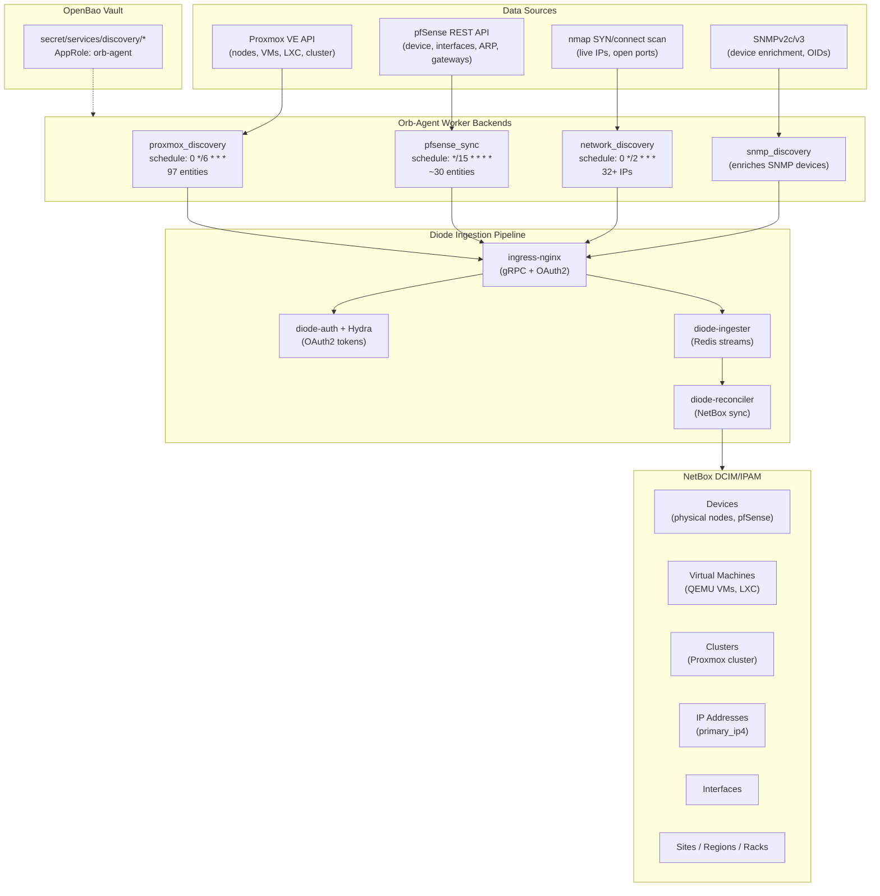
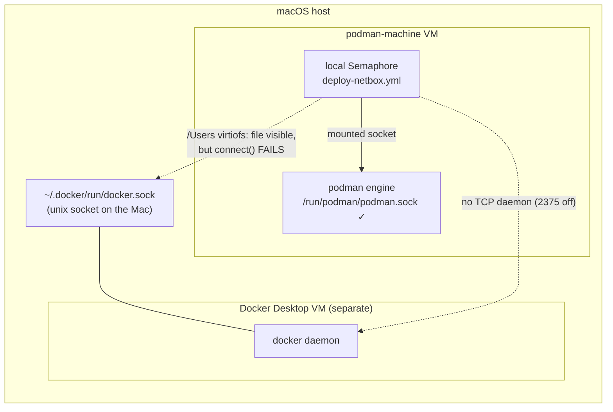

# 04 — NetBox & Discovery
> **Consolidates:** NETBOX-DISCOVERY-EXPANSION.md, NETBOX-LOCAL-ENGINE.md, SNMPV3-UPGRADE-PLAN.md (originals archived in `plan/archive/`)
>
> **Depends on:** 00, 01
>
> Part of the dependency-ordered `plan/development/` set (00–10). The source
> plans are merged verbatim below under provenance dividers to preserve all
> detail; read in numbered order to execute.


<!-- ======================= source: NETBOX-DISCOVERY-EXPANSION.md ======================= -->

# NetBox Discovery Pipeline Architecture

**Date:** 2026-04-04 (original) / **2026-05-06** (converted to architecture reference)
**Status:** IMPLEMENTED — Core pipeline (Phases 1-2c) complete and operational. Phase D (SNMPv3) and E (LLDP) are deferred extensions.

---

## Overview

The NetBox discovery pipeline automatically populates NetBox DCIM/IPAM with infrastructure data from multiple sources. Four orb-agent worker backends collect data via APIs, network scans, and SNMP, then push entities through the Diode ingestion pipeline into NetBox. The pipeline runs on a schedule via Semaphore and requires no manual data entry for supported device types.

---

## Pipeline Architecture



---

## Discovery Tiers

| Tier | Source | Worker | Schedule | Entities | What It Discovers |
|------|--------|--------|----------|----------|-------------------|
| **T1 -- Network Scan** | nmap | network_discovery | Every 2h | IPs, ports | Live hosts on {{ discovery_target_subnet }} |
| **T2 -- SNMP Enrichment** | SNMPv2c | snmp_discovery | With T1 | Device details | Hostname, manufacturer, model, interfaces, MACs |
| **T3 -- API Workers** | Proxmox REST | proxmox_discovery | Every 6h | 97 entities | Nodes, VMs, LXC, interfaces, guest IPs |
| **T3 -- API Workers** | pfSense REST | pfsense_sync | Every 15m | ~30 entities | Firewall device, interfaces, ARP, gateways |
| **T4 -- Topology** | LLDP/CDP | *(deferred)* | -- | Cables | Physical network connections |

---

## Worker Specifications

### proxmox_discovery (v3.0.0)

Custom orb-agent worker (`workers/proxmox_discovery/`). Queries Proxmox VE API for the complete cluster inventory.

**Entity mapping:**
```
Node      -> Device (role: hypervisor)     + Interface + IPAddress (primary_ip4)
VM (QEMU) -> VirtualMachine               + VMInterface + IPAddress (primary_ip4)
LXC       -> VirtualMachine               + VMInterface + IPAddress (primary_ip4)
Cluster   -> Cluster (type: "Proxmox VE", scope_site from inventory)
```

**Key behaviors:**
- `_build_node()` uses first IPv4 from management bridge interfaces for `primary_ip4`
- `_build_vm()` uses first guest agent IPv4 (falls back gracefully without agent)
- `_build_lxc()` uses first container IPv4
- `_pick_primary_ipv4()` skips loopback, link-local, and IPv6 addresses
- `_sanitize_description()` strips lines containing credential keywords before ingestion
- VMs and LXC use `VMInterface` (not `Interface`) and `assigned_object_vm_interface` for IP linking
- Resource fields (`vcpus`, `memory`, `disk`) are set directly on VirtualMachine
- Cluster name is queried from the Proxmox API (`prox.cluster.status.get()`)
- Credentials from OpenBao at `secret/services/discovery/proxmox_api/`

### pfsense_sync (v1.3.0)

Orb-agent worker (`workers/pfsense_sync/`). Queries pfSense REST API every 15 minutes.

**Entity mapping:**
```
pfSense   -> Device (role: gateway-router) + Interface + IPAddress (primary_ip4)
```

**Key behaviors:**
- Device name uses FQDN from pfSense
- Queries interfaces before device creation to find LAN interface by `descr == "LAN"` for primary IP
- Pushes interfaces, IPs, gateways, and ARP entries
- Site entity always emitted with lat/lon coordinates regardless of region
- Credentials from OpenBao at `secret/services/discovery/pfsense/`

### network_discovery

Orb-agent worker using nmap SYN/connect scans.

**Key behaviors:**
- Scans {{ discovery_target_subnet }} every 2 hours
- Discovers 32+ live IPs and open ports
- Creates bare IPAddress entities (no device association)

### snmp_discovery

Orb-agent worker for SNMPv2c device enrichment.

**Key behaviors:**
- Runs alongside network_discovery
- Enriches SNMP-responsive devices with hostname, manufacturer, model, interfaces, MACs
- Currently SNMPv2c; SNMPv3 upgrade deferred (see `plan/development/04-netbox-discovery.md`)

---

## Organizational Hierarchy

All organizational data is templated from site-config inventory into `agent.yaml.j2`:

| Inventory Variable | NetBox Entity |
|-------------------|---------------|
| `discovery_region` | Region |
| `discovery_site_name` | Site |
| `discovery_site_latitude`, `discovery_site_longitude` | Site GPS coordinates |
| `discovery_location_name` | Location |
| `discovery_tenant_name` | Tenant |
| `discovery_rack_assignments` | Per-node rack mapping |
| `discovery_pfsense_device_role` | DeviceRole for pfSense |
| `discovery_pfsense_rack` | Rack for pfSense |

**Current state:**
- 1 region (US East), 1 site (Uhstray.io Datacenter), 1 location (Server Room)
- 2 racks (Server Rack, GPU Server Rack)
- 11 devices with rack assignment, 31 with tenant

---

## Deduplication Strategy

Each discovery source uses a unique `agent_name` / `app_name` to prevent cross-source conflicts:

| Source | Agent Name | Entity Types |
|--------|-----------|--------------|
| network_discovery | `netbox-discovery-agent` | IPAddress (bare) |
| snmp_discovery | `netbox-discovery-agent` | Device, Interface, IPAddress |
| proxmox_discovery | `proxmox-discovery-agent` | Device, VirtualMachine, Cluster, Interface, IPAddress |
| pfsense_sync | `pfsense-sync-agent` | Device, Interface, IPAddress |

**Merge rules:** Proxmox API is authoritative for nodes and VMs. pfSense REST API is authoritative for firewall devices. Network/SNMP discovery fills gaps for non-API-accessible devices.

---

## Cleanup Tooling

Diode is strictly additive -- it creates and updates but never deletes. Config renames, version bumps, or template variable changes create orphaned objects. The `cleanup-netbox.yml` playbook (Semaphore Template 57) provides safe, parameterized cleanup.

**Operations (all default off, dry_run=true for safety):**

| Operation | Extra Var | Description |
|-----------|-----------|-------------|
| Cleanup duplicates | `cleanup_duplicates=true` | Remove duplicate devices by strategy (tenant/lowest_id/highest_id) |
| Replace device | `replace_device_old=X replace_device_new=Y` | Delete old device when replacement exists |
| Migrate region | `migrate_region_old=X migrate_region_new=Y` | Move sites between regions, delete empty source |
| Migrate rack | `migrate_rack_old=X migrate_rack_new=Y` | Move devices between racks, delete empty source |
| Delete orphans | `delete_orphans=true` | Remove regions/racks/locations with zero references |
| Cleanup VMs as Devices | `cleanup_vm_orphans=true` | Remove Device entries that now exist as VirtualMachine (post-v3.0.0 migration) |

The cleanup playbook is a permanent operational tool, not a one-time fix.

---

## OpenBao Credential Organization

| Path | Contents | Used By |
|------|----------|---------|
| `secret/services/discovery/proxmox_api` | url, token_id, api_token | Proxmox worker |
| `secret/services/discovery/pfsense` | api_key, host | pfSense sync |
| `secret/services/discovery/snmp_v3` | username, auth_password, priv_password | SNMP (Phase D) |
| `secret/services/netbox` | All NetBox secrets | orb-agent, deploy |
| `secret/services/approles/orb-agent` | role_id, secret_id | orb-agent vault auth |

---

## Diode SDK Entity Coverage

**Currently used (17 types):** Cluster, ClusterType, Device, DeviceRole, DeviceType, Entity, Interface, IPAddress, Location, Manufacturer, Platform, Rack, Region, Site, Tenant, VirtualMachine, VMInterface

**Available in SDK v1.10.0 but not yet needed:** Cable, CircuitTermination, ConsolePort, FrontPort, PowerFeed, Prefix, RearPort, VLAN, VLANGroup, VRF, and 70+ more

---

## Deferred Extensions

### Phase D: SNMPv3 Upgrade

Moved to a dedicated plan: [SNMPV3-UPGRADE-PLAN.md](SNMPV3-UPGRADE-PLAN.md)

**Status:** DEFERRED
**Rationale:** SNMPv2c is sufficient for current device set. SNMPv3 adds authentication and encryption but requires per-device credential management.

### Phase E: LLDP Topology Discovery

**Status:** DEFERRED (awaiting test Proxmox cluster)
**Priority:** MEDIUM -- completes the physical topology picture
**Blocked by:** Requires installing lldpd on Proxmox hypervisors. Playbooks are on branch `feat/lldp-hypervisor-setup` -- to be tested on a dedicated Proxmox test cluster before production deployment.

LLDP maps physical cable connections -- which port on device A connects to which port on device B. This creates NetBox Cable entities linking interfaces across devices.

**Current state:**
- pfSense: lldpd installed and running, seeing switch neighbors
- Proxmox nodes: lldpd NOT installed

**Data collection approach:** SSH-based `lldpctl -f json0` (pfrest v2 does not expose LLDP via REST). Collected by Ansible playbook on schedule (every 6h), parsed and pushed to Diode as Cable entities.

**Implementation steps (when unblocked):**
1. Install lldpd on Proxmox nodes (`install-lldpd.yml`)
2. Collect LLDP topology and push to Diode (`collect-lldp-topology.yml`)
3. Validate Cable entities in NetBox (`check-discovery.yml` extension)

**Diode SDK Cable entity pattern:**

```python
from netboxlabs.diode.sdk.ingester import Cable, Entity, GenericObject, Interface, Device, DeviceType, Manufacturer, Site

a_term = GenericObject(
    object_interface=Interface(
        name="eth0",
        device=Device(name="hypervisor-01", device_type=DeviceType(model="...", manufacturer=Manufacturer(name="...")), site=Site(name="...")),
    )
)

b_term = GenericObject(
    object_interface=Interface(
        name="port24",
        device=Device(name="switch-01", device_type=DeviceType(model="...", manufacturer=Manufacturer(name="...")), site=Site(name="...")),
    )
)

cable = Cable(
    a_terminations=[a_term],
    b_terminations=[b_term],
    status="connected",
    label="LLDP-discovered",
)
entities.append(Entity(cable=cable))
```

**Device name resolution:**

| LLDP Field | NetBox Match |
|------------|-------------|
| Chassis sysName | Device.name (exact match or FQDN to hostname) |
| Port ID (ifname) | Interface.name on the matched device |
| Port description | Fallback for interface name if Port ID is a MAC |
| Management IP | Fallback device lookup via IPAddress.address |

Unresolved neighbors (devices not in NetBox) are logged but do not create cables.

---

## Dropped Approaches

| Approach | Why Dropped | Alternative |
|----------|-------------|-------------|
| NAPALM device_discovery | No FreeBSD driver for pfSense, Linux driver useless for Proxmox | pfSense REST + Proxmox API workers |

---

## Implementation History

The following phases were completed during initial development and are documented here for context on design decisions made.

| Phase | Date | What Was Done |
|-------|------|---------------|
| 1. pfSense REST API sync | 2026-04-05 | Worker package, 15m schedule, FQDN naming, gateway-router role |
| 2a. Proxmox cluster metadata | 2026-04-16 | Worker for nodes/VMs/LXC, resource annotations, Proxmox API auth |
| 2b. Proxmox guest network | 2026-04-16 | Guest agent IP queries, graceful fallback |
| 2.5. Seed data templating | 2026-04-17 | Organizational hierarchy from inventory vars into agent.yaml.j2 |
| 2.6. Cleanup tooling | 2026-04-18 | Generic parameterized cleanup playbook (Semaphore Template 57) |
| 2c-i. Primary IPv4 | 2026-04-21 | All devices/VMs get primary_ip4 via restructured builders |
| 2c-ii. Cluster modeling | 2026-04-21 | VMs/LXC as VirtualMachine entities, Cluster from API |
| 2c-iii. GPS coordinates | 2026-04-21 | Site entity always emitted with lat/lon |
| 2c-iv. Description sanitization | 2026-04-21 | Credential keyword stripping before Diode ingestion |

---

## Operational Lessons

1. **Semaphore inventory is an inline copy** -- it does NOT read from `site-config/inventory/production.yml`. Must be synced manually via API PUT when inventory vars change. This caused a duplication incident (34 to 63 devices).

2. **YAML `>-` breaks Python in Ansible** -- folded scalar collapses multi-line Python into one line, destroying indentation. Use `ansible.builtin.shell` with literal `|` scalar and bash heredoc (`<< 'PYSCRIPT'`).

3. **Diode is additive-only** -- never deletes. Any config rename, version bump, or template variable change creates orphans. The cleanup playbook is a permanent operational tool, not a one-time fix.

4. **NetBox v2 API tokens** with pepper-based hashing may return "Invalid v1 token" -- workaround: use Django management shell via Semaphore for admin operations.

<!-- ======================= source: NETBOX-LOCAL-ENGINE.md ======================= -->

# NetBox Local Engine — Fix Plan

> **Location:** `plan/development/04-netbox-discovery.md`
> **Date:** 2026-06-12 · **Status:** ACTIVE — app tier proven locally under podman (2026-06-13); Semaphore-wiring + .example-template gap remain · **Owner:** uhstray-io
> **Context:** Local-dev (`LOCAL-DEV-DEPLOYMENT.md`) wants NetBox runnable on a developer laptop. NetBox is the platform's one Docker-required service. This plan resolves a hard blocker: the local Semaphore control plane (which runs in the **podman-machine VM**) cannot drive **Docker Desktop's** daemon, and lays out the robust fix.

**Goal:** Run a NetBox **app-tier** profile locally through the same local Semaphore control plane as every other service — without depending on Docker Desktop, and without forking NetBox's deployment.

**TL;DR recommendation:** Run NetBox's app tier under **podman** via the existing mounted-socket model (Option A). NetBox's deploy library already honors `CONTAINER_ENGINE`; the real work is podman-compatible startup ordering, a podman image build, and excluding the discovery/orb-agent tier. This keeps **one local engine** and sidesteps the cross-VM problem entirely.

---

## 1. The blocker (debugged)

`make local-deploy-netbox` would run `deploy-netbox.yml` **inside the local Semaphore container**, which lives in the podman-machine VM and drives that VM's podman engine over a mounted socket (`CONTAINER_HOST=unix:///run/podman/podman.sock`). NetBox, today, is a Docker service. Docker Desktop runs in its **own, separate** VM. The Semaphore container cannot reach it:



**Evidence (2026-06-12):**
- Docker daemon socket: `unix:///Users/stray/.docker/run/docker.sock`.
- That path **is** visible in the podman VM (under the `/Users` virtiofs share) — but virtiofs shares the *file node*, not the live socket endpoint. The listening daemon is in a different VM/kernel, so `connect()` from the podman VM fails. A unix socket is not usable across a file share.
- Docker Desktop exposes **no TCP daemon** (`tcp://localhost:2375` is off by default, and enabling it is insecure + manual).
- Net: the podman-VM Semaphore has exactly one engine it can drive — podman.

## 2. Why NetBox was "Docker-required" — and what actually applies locally

From the root conventions [1] and `PODMAN-VS-DOCKER-COMPOSE.md` [2], NetBox uses Docker for four reasons. Only some matter for a **local app-tier** profile:

| Reason | Applies to local app-tier? |
|---|---|
| Privileged orb-agent (`--privileged`, `CAP_NET_RAW`, host net) for discovery | **No** — discovery/orb-agent are excluded locally (no real network to scan) [3] |
| Bind-mounted secrets (Diode client secret at `/run/secrets/...`) | **No** for app-tier; podman bind-mounts work regardless |
| `depends_on: condition: service_healthy` staged startup (podman-compose 1.0.6 ignored these) | **Partially** — needs handling under podman (§4) |
| `lib/common.sh` "hardcoded to Docker" | **No** — it already reads `CONTAINER_ENGINE` (`platform/services/netbox/deployment/lib/common.sh:40-43`); set it to `podman` |

So the only genuine app-tier obstacle is **startup ordering** when `depends_on` health conditions are ignored — and NetBox's own `deploy.sh`/`lib` already stage startup with explicit `wait_for_healthy`/`wait_for_started` helpers, so the compose conditions may not be load-bearing. This must be verified, not assumed.

## 3. Decision criteria (alternatives considered)

| Option | Verdict | Why |
|---|---|---|
| **A. Run app-tier under podman** via the existing socket model | **Chosen** | One local engine, zero cross-VM problem, reuses the whole local-dev mechanism (shared deploy dir, label=disable, manage-secrets). NetBox lib already honors `CONTAINER_ENGINE`. Cost: verify podman startup ordering + a podman image build. |
| B. Bridge Semaphore → Docker Desktop over TCP (`host.containers.internal:2375`) | Rejected | Requires enabling Docker Desktop's **insecure, unauthenticated** TCP daemon (manual, security-hostile), and splits the engine across two VMs — fragile and un-prod-like. |
| C. Run `deploy-netbox.yml` on the Mac host (outside Semaphore) against Docker Desktop | Rejected | Breaks "make bootstraps, Semaphore operates" (the local-dev paradigm and Critical Rule #1-as-code). A full service deploy is not a host-bootstrap exception. |
| D. Socket proxy (socat TCP↔unix into the Docker VM) | Rejected | The Docker socket lives in Docker Desktop's VM; nothing in the podman VM can reach the daemon to proxy it. Same wall as B without the (bad) TCP option. |
| E. Mount the Docker socket into Semaphore | Rejected | Confirmed non-functional — unix socket is dead across the virtiofs share (§1). |

## 4. Implementation plan (Option A)

Mirrors the DNS/Caddy local conversions — composable, one codebase, podman via the mounted socket.

- [ ] **Engine var**: `netbox_svc` inventory group sets `container_engine=podman` (NetBox `lib/common.sh` already branches on `CONTAINER_ENGINE`). Confirm `compose()` resolves to `podman compose`/`podman-compose` and the project flags (`--project-name netbox -f docker-compose.yml`) work under podman.
- [ ] **App-tier-only selection**: bring up only `netbox`, `netbox-worker`, `postgres`, `redis`, `redis-cache` — exclude `ingress-nginx`, `diode-*`, `hydra*`, `diode-redis`. Prefer **compose `profiles:`** (tag the discovery services `profiles: [discovery]` so they're opt-in) over passing explicit service lists — declarative, and keeps prod (which runs everything) unchanged when the profile is enabled. Gate via a `netbox_discovery` inventory var (default off locally, on in prod).
- [ ] **Startup ordering under podman**: verify NetBox's `deploy.sh` staged startup + `wait_for_*` helpers make the `depends_on: condition: service_healthy` conditions non-load-bearing. If podman-compose still races, stage explicitly in deploy.sh (DB+redis first → wait healthy → app), not by forking compose.
- [ ] **Image build under podman**: `netbox:latest-plugins` builds from `Dockerfile-Plugins`. Build it with `podman build` in the deploy (or pre-build step). Pin the base NetBox tag. Confirm the plugins layer builds on arm64 (assumption — verify at execution).
- [ ] **Local plumbing**: reuse `tasks/place-monorepo.yml`; `compose.local.yml` overlay (resource caps; `label=disable` if any host bind-mounts); same-path shared deploy dir; `LOCAL_FAKE_` secrets via `manage-secrets` for the app-tier subset (DB/Redis/superuser only — no Diode/Hydra secrets when discovery is off).
- [ ] **Wire-in**: `netbox_svc` group in `local-dev.yml.example` + bootstrap `_inv_ini`; reuse the existing `deploy-netbox.yml` (it's already composable) — add the discovery-profile gate; port `127.0.0.1:8000`; Caddy route (`netbox.agent-cloud.test → netbox:8080` once on a shared network).
- [ ] **Docs/tests**: `docs/LOCAL-DEV.md` registry + the engine note; BATS for the profile gate; plan checkbox.

**Gate:** `make local-deploy-netbox` runs through local Semaphore under podman; the app tier comes up healthy (NetBox UI on `127.0.0.1:8000`); discovery/orb-agent absent; idempotent re-run; the build is arm64-native.

## 4a. Validation results (2026-06-13)

Option A executed and proven locally:

- **Image builds under podman** — `netbox:latest-plugins` (801 MB) built rootful in the VM, no issue.
- **App tier boots healthy under podman** — `postgres + redis + redis-cache + netbox + netbox-worker` via `podman compose ... up -d --no-deps netbox netbox-worker` (driven from the Mac, so the deploy-dir bind-mounts resolve via the `/Users` virtiofs share). UI 200 on `127.0.0.1:8000`. The **diode plugin loads without the discovery pipeline running** (it only contacts Diode on ingest), so app-tier-only is viable with a fake `netbox_to_diode` secret.
- **Container discovery works without Docker, orb-agent, or Diode** — `scripts/local-netbox-discover.sh` (`make local-netbox-discover`) feeds `podman ps` into NetBox via the Django ORM, creating 9 agent-cloud containers (local-openbao, local-semaphore, dns, caddy, the 5 netbox-* containers) as `VirtualMachine`s in a `agent-cloud-local` Podman cluster. Idempotent (`update_or_create`).
- Captured repeatably: `scripts/local-netbox-up.sh` (`make local-netbox`) — clone context → fake env → build-if-absent → app-tier up → wait healthy.

Gotchas found + fixed: `API_TOKEN_PEPPER_1`/`SECRET_KEY` must be ≥50 chars; this NetBox build uses **v2 (HMAC-hashed) API tokens** with a `version`-dependent check constraint — hand-creating a token via the ORM is fiddly, so the discovery feed uses the ORM directly (no token).

## 4b. Does NetBox actually need Docker? (finding)

The local result reframes the long-standing "NetBox = Docker" rule. Separating capabilities:

| Capability | Engine reality |
|---|---|
| NetBox app (web/worker/db/redis) | **Podman is fine** — proven healthy locally. No Docker need. |
| **Container** inventory (what we discovered: `podman ps` → NetBox) | **Podman** — this is podman's own data; Docker irrelevant. |
| Full Diode pipeline (hydra + diode-* + ingress) | **Untested** under podman — more services with `depends_on: condition: service_healthy` (podman-compose historically ignored these), but `deploy.sh` stages startup explicitly, so likely OK. Needs validation. |
| **Network/IPAM** discovery (orb-agent nmap/SNMP subnet scans — the real prod DCIM value) | Needs `CAP_NET_RAW`/privileged. Already runs as a standalone **`sudo $CONTAINER_ENGINE run --privileged --net=host`** — engine-agnostic; **`sudo podman` works on Linux**, not Docker-specific. (macOS can't scan at all — VM NAT — Docker or podman.) |

**So the Docker requirement was never a hard technical need** — it was the path of least resistance around (a) podman-compose's `depends_on`-health gap (which `deploy.sh`'s explicit staging already mitigates) and (b) a known-good setup. The orb-agent's privilege need is met by `sudo podman` on Linux.

**Important distinction:** what we discovered locally is the **container fleet** (`podman ps`), NOT the prod **network** discovery (real subnets/devices/IPs via nmap+SNMP). Those are different NetBox use cases.

**Recommendation:** NetBox can very likely **standardize on podman** (dropping the Docker special-case, simplifying the engine split to "podman everywhere; `sudo podman` for the privileged agent"). Before changing prod, validate two things on the prod Linux host under podman: (1) the **full** stack (incl. Diode/Hydra) comes up healthy via `deploy.sh`'s staged startup; (2) the **orb-agent** network scan works under `sudo podman run --privileged --net=host`. Local already proves the app tier + container discovery. This finding should feed back into `PODMAN-VS-DOCKER-COMPOSE.md` and the root `CLAUDE.md` Container Runtime section.

## 5. Risks & open questions

| Item | Risk | Mitigation |
|---|---|---|
| podman-compose `depends_on: condition` support | Startup races if both compose conditions are ignored **and** deploy.sh doesn't fully stage | Verify deploy.sh staging first; if needed, stage in deploy.sh (don't fork compose) |
| `netbox:latest-plugins` arm64 build | Plugins layer may pull amd64-only wheels/deps | Build + test on arm64 at execution; fall back to documented emulation for the build only |
| compose `profiles` under podman-compose | Older podman-compose may not honor `profiles:` | Confirm the installed podman-compose version supports profiles; else gate via explicit service list in deploy.sh (still one codebase) |
| Footprint | ~5 app-tier containers + Postgres/Valkey | Cap via `compose.local.yml`; measure against the §10 tier budget in the local-dev plan |

## 6. Convention compliance

One codebase (profile-gated, no fork), Semaphore-operated, manage-secrets for the subset, podman default — all consistent with `LOCAL-DEV-DEPLOYMENT.md` and the Critical Deployment Rules. The prod NetBox deploy is unchanged (discovery profile on; engine `docker`).

## 7. References

1. *(repo)* `CLAUDE.md` — Container Runtime section ("Docker required for NetBox").
2. *(repo)* `plan/architecture/05-platform-infra.md` — engine constraints, podman-compose gaps.
3. *(repo)* `platform/services/netbox/deployment/CLAUDE.md` — orb-agent privileged/discovery requirements; macOS raw-socket limits.
4. *(repo)* `platform/services/netbox/deployment/lib/common.sh:40-71` — `CONTAINER_ENGINE`-aware compose wrapper (already not Docker-hardcoded).
5. *(repo)* `plan/development/00-foundation-local-dev.md` — the local-dev paradigm + the NetBox app-tier item this plan unblocks.
6. *(local)* Reachability debug, 2026-06-12 — docker socket path, virtiofs share visibility, no TCP daemon (§1).

## 8. Revision history

| Date | Change |
|---|---|
| 2026-06-12 | Initial plan: debugged the podman-VM↔Docker-Desktop blocker (unix socket dead over virtiofs; no TCP daemon); chose Option A (NetBox app-tier under podman) with rejected alternatives; implementation phases + risks |
| 2026-06-13 | Executed Option A: image builds + app tier healthy under podman; container discovery via ORM (`make local-netbox` / `local-netbox-discover`) — 9 containers as VMs, idempotent (§4a). Added the "does NetBox need Docker?" finding (§4b): no hard need — podman fits the app + container discovery; orb-agent privilege is met by `sudo podman` on Linux; recommend validating the full stack + agent under podman then dropping the Docker special-case. Open gaps: `env/*.env.example` templates missing from the repo (live values only in site-config — fresh `deploy.sh` can't `copy_example`); full Semaphore-wired composable local path; Diode pipeline under podman unproven |

<!-- ======================= source: SNMPV3-UPGRADE-PLAN.md ======================= -->

# SNMPv3 Upgrade Plan

**Date:** 2026-04-21
**Status:** DEFERRED — security hardening only, not blocking functionality
**Priority:** LOW
**Effort:** Medium (credential setup + snmpd config on pfSense)
**Impact:** Medium (encrypted SNMP on the wire)

---

## Overview

Upgrade the existing SNMP discovery from SNMPv2c (plaintext community string) to SNMPv3 (SHA auth + AES encryption). Currently the `snmp_discovery` orb-agent backend does a subnet-wide scan of 192.168.1.0/24 on port 161 using an SNMPv2c community string. Any device responding to SNMP gets enriched with hostname, manufacturer, model, interfaces, and MACs.

## Current State

- **SNMPv2c** community string stored in OpenBao at `secret/services/netbox/snmp_community`
- **snmp_discovery** backend runs every 6 hours via orb-agent
- **Devices responding to SNMP:** primarily pfSense (Netgate 4200) and any managed network gear
- Proxmox nodes do NOT run snmpd by default — enriched via Proxmox API worker instead
- pfSense REST API provides richer data than SNMP — the SNMP scan is supplementary

## Why Deferred

1. Proxmox API (Phase 2) already provides most device data
2. pfSense REST API provides richer data than SNMP
3. The community string is already stored in OpenBao (not hardcoded)
4. The SNMP scan runs on an isolated management LAN

## Implementation (when prioritized)

### 1. Generate SNMPv3 credentials
- Create username, auth password (SHA), privacy password (AES)
- Store in OpenBao at `secret/services/discovery/snmp_v3`

### 2. Configure snmpd on pfSense
- Add SNMPv3 user via pfSense web UI or CLI
- Optionally disable SNMPv2c to enforce encryption

### 3. Update agent.yaml.j2
- Change SNMP policy from SNMPv2c to SNMPv3
- Reference vault paths for SNMPv3 credentials
- Update protocol_version, add auth/priv settings

### 4. Update Semaphore inventory
- Add SNMPv3-related template variables if needed

### 5. Test and validate
- Verify snmp_discovery still enriches devices
- Confirm SNMPv2c is disabled (if desired)
- Packet capture to verify encryption on the wire

## OpenBao Credential Layout

| Path | Contents |
|------|----------|
| `secret/services/discovery/snmp_v3` | username, auth_password, priv_password |
| `secret/services/netbox/snmp_community` | Legacy SNMPv2c community string (keep until migration complete) |
