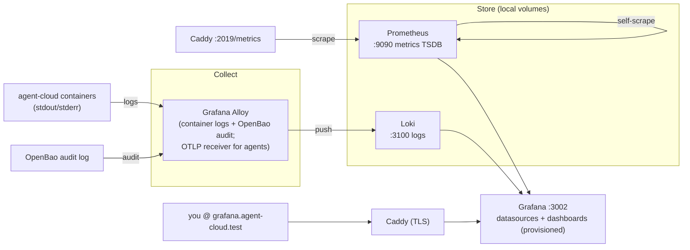

# 05 — Observability (o11y)
> **Consolidates:** O11Y-DEPLOYMENT.md (originals archived in `plan/archive/`)
>
> **Depends on:** 00, 01
>
> Part of the dependency-ordered `plan/development/` set (00–10). The source
> plans are merged verbatim below under provenance dividers to preserve all
> detail; read in numbered order to execute.

<!-- ======================= source: O11Y-DEPLOYMENT.md ======================= -->

# Observability (o11y) Stack Deployment Plan

> **Location:** `plan/development/05-observability.md`
> **Date:** 2026-06-14 · **Status:** PROPOSED · **Owner:** uhstray-io
>
> **Context:** `platform/services/o11y/` is an empty stub. LOCAL-DEV-DEPLOYMENT.md reserved ports `3002` (Grafana) / `9090` (Prometheus) / `3100` (Loki) and gated the service on "define the stack in its own plan/PR first" — this is that plan. It defines a **minimal-but-real** local observability stack that follows the composable pattern (DNS/Caddy/step-ca/Authentik), then names the prod extension. The platform already depends on it: AUTOMATION-COMPOSABILITY.md §"Audit logging" requires OpenBao's file audit backend piped to **Loki** with alerting; IMPLEMENTATION_PLAN.md routes orb-agent OpenTelemetry metrics here and lists Grafana/Prometheus for the Reliability + NetClaw agents.
>
> **For agentic workers:** Execute phase-by-phase; every phase ends at a validation gate. Configs are committed config-as-code (non-secret); only the Grafana admin password is a secret (OpenBao). Real domains/secrets stay in site-config; the public repo uses placeholders + `LOCAL_FAKE_`.

**Goal:** A self-hosted observability stack — **metrics + logs + dashboards** — deployed locally through the same `make bootstraps, Semaphore operates` pipeline, so every agent-cloud service's health is visible in Grafana at `https://grafana.agent-cloud.test`, with a clean prod extension path.

**Architecture:** Four composable containers — **Grafana** (viz), **Prometheus** (metrics scrape + TSDB), **Loki** (log store), **Grafana Alloy** (unified collector: ships container + OpenBao-audit logs to Loki, exposes an OTLP receiver for future agent telemetry). Config-as-code (Prometheus scrape, Loki, Alloy, Grafana datasource/dashboard provisioning) is committed and mounted read-only; the Grafana admin password flows from OpenBao via `manage-secrets`. Long-term storage (Mimir), traces (Tempo), object-store backends (MinIO), and Alertmanager are **prod additions**, explicitly out of local scope.

**Tech stack:** Grafana, Prometheus, Loki, Grafana Alloy (all OSS, container images), the composable Ansible tasks (`place-monorepo`, `manage-secrets`), Caddy (front door), step-ca TLS.

---

## Decision criteria (alternatives considered)

| Decision | Chosen | Rejected / deferred | Why |
|---|---|---|---|
| **Stack family** | **Grafana LGTM-lite** (Loki + Grafana + Prometheus + Alloy) | Elastic/ELK; Datadog/SaaS | IMPLEMENTATION_PLAN already names Grafana/Prometheus/Loki/Mimir/Tempo/OTel [IMPL:208,265-267]; OSS, self-hostable (privacy-first), composes cleanly. |
| **Local component subset** | Grafana + Prometheus + Loki + Alloy | + Mimir (long-term metrics), + Tempo (traces), + MinIO backends, + Alertmanager | Local-dev needs *visibility*, not retention/HA. Mimir/Tempo/MinIO/Alertmanager are prod concerns (retention 1yr/3mo per IMPL:265-267); adding them locally is RAM + config cost with no local payoff. |
| **Collector** | **Grafana Alloy** (one agent: logs→Loki + OTLP receiver) | Promtail (logs only) + OTel Collector (metrics/traces) as two services | Alloy is the supported successor to both; one container does container-log shipping AND an OTLP endpoint for the orb-agent telemetry IMPL:828 wants — fewer moving parts, and it IS the OpenTelemetry path IMPL:208 calls for. |
| **Local metrics targets** | Prometheus self + **Caddy** (`/metrics` on the admin API) | cAdvisor (per-container) + node-exporter (host) | Caddy already exposes Prometheus metrics on its admin port; cAdvisor/node-exporter on the podman-machine VM are flaky and low-value locally. Per-container/host metrics are a **follow-on** (Phase 2), noted not skipped. |
| **Local log sources** | container stdout/stderr (podman) + **OpenBao audit log** | full journald, app-specific parsers | The audit→Loki pipe is a *documented platform requirement* (AUTOMATION-COMPOSABILITY §audit logging); container logs are the cheap universal signal. |
| **Traces (Tempo)** | **Deferred** (prod) | local Tempo | No local service emits traces yet; Alloy's OTLP receiver is wired so traces drop in later without re-architecting. |
| **TLS / access** | Behind **Caddy** (`grafana.agent-cloud.test`), Grafana serves HTTP on its container port | Grafana terminates TLS itself | Same front-door pattern as every other service (step-ca wildcard); SSO via Authentik `forward_auth` is a later phase. |

---

## Source context

- `platform/services/o11y/` — empty stub (`deployment/.gitkeep`, `context/.gitkeep`); no compose, no plan. This plan fills it.
- `plan/development/00-foundation-local-dev.md:227,294` — o11y "stub-blocked; own plan/PR defines grafana/prometheus/loki shape; local profile follows"; ports `3002/9090/3100` reserved.
- `plan/architecture/01-automation-model.md:577` — "OpenBao's file audit backend must be enabled and piped to the observability stack (Loki). Alerting rules fire on: same secret read >10x/min, unknown AppRoles, failed auth." — a hard consumer of this stack.
- `plan/archive/development/IMPLEMENTATION_PLAN.md:208,265-267,828,1545` — telemetry = OpenTelemetry → Grafana; o11y backends Mimir/Tempo/Loki (prod retention); orb-agent OTel export; Reliability Agent uses Prometheus/Alertmanager.
- Composable exemplars this mirrors: `platform/services/step-ca/deployment/` + `platform/playbooks/deploy-step-ca.yml` (service shape), `tasks/manage-secrets.yml` (Grafana admin pw), `tasks/mint-internal-cert.yml`/Caddy (TLS front door).

The stack and its flows:

---

## Phase 0 — Scaffold the composable service (no deploy yet)

**Files (create):**
- `platform/services/o11y/deployment/compose.yml` — 4 services, env-parameterized images + ports:
  - `grafana` (`${O11Y_GRAFANA_IMAGE:-docker.io/grafana/grafana:11.4.0}`), publishes `${O11Y_GRAFANA_BIND:-127.0.0.1}:${O11Y_GRAFANA_PORT:-3002}:3000`, mounts `./config/grafana/provisioning:/etc/grafana/provisioning:ro` + `./config/grafana/dashboards:/var/lib/grafana/dashboards:ro`, env `GF_SECURITY_ADMIN_PASSWORD`/`GF_SERVER_ROOT_URL`; healthcheck `wget -q -O- http://127.0.0.1:3000/api/health`.
  - `prometheus` (`${O11Y_PROM_IMAGE:-docker.io/prom/prometheus:v3.1.0}`), `:9090`, mounts `./config/prometheus.yml:/etc/prometheus/prometheus.yml:ro` + a `prometheus-data` volume; healthcheck `/-/ready`.
  - `loki` (`${O11Y_LOKI_IMAGE:-docker.io/grafana/loki:3.3.2}`), `:3100`, mounts `./config/loki-config.yml` + `loki-data` volume; healthcheck `/ready`.
  - `alloy` (`${O11Y_ALLOY_IMAGE:-docker.io/grafana/alloy:v1.5.1}`), mounts `./config/config.alloy:ro` + the podman socket (ro, for container-log discovery) + the OpenBao audit log path; OTLP receiver on `:4317/:4318`. No published port locally (it pushes to Loki by name).
- `platform/services/o11y/deployment/compose.local.yml` — slim overlay (mem caps: grafana 256m, prometheus 384m, loki 256m, alloy 192m; `label=disable`; join `local-dev` so Prometheus scrapes `caddy:2019` and Caddy reaches `grafana:3000` by name).
- `platform/services/o11y/deployment/config/` (committed config-as-code):
  - `prometheus.yml` — scrape self + `caddy:2019/metrics`; `# TODO Phase 2: cadvisor/node-exporter`.
  - `loki-config.yml` — single-binary, filesystem store under the volume.
  - `config.alloy` — `loki.source.podman` (or `discovery.docker` over the socket) → `loki.write` to `http://loki:3100`; a `local.file_match` for the OpenBao audit log → Loki; `otelcol.receiver.otlp` stub (no exporter consumer yet).
  - `grafana/provisioning/datasources/datasources.yml` — Prometheus (`http://prometheus:9090`, default) + Loki (`http://loki:3100`).
  - `grafana/provisioning/dashboards/dashboards.yml` + `grafana/dashboards/agent-cloud-overview.json` — a starter dashboard (up targets, Caddy req rate, container log volume).
- `platform/services/o11y/deployment/deploy.sh` — container-lifecycle-only (verify .env, pull, up, `wait_for_healthy grafana 180`).
- `platform/services/o11y/deployment/templates/env.j2` — `O11Y_*` image/bind/port vars + `GF_SECURITY_ADMIN_PASSWORD={{ secrets.grafana_admin_password }}` + `GF_SERVER_ROOT_URL=https://grafana.{{ o11y_zone | default('agent-cloud.test') }}`.
- `platform/services/o11y/deployment/.gitignore` — `.env`.
- `platform/services/o11y/deployment/context/architecture.md` — the agent-facing doc.
- `platform/playbooks/deploy-o11y.yml` — `place-monorepo` → `manage-secrets` (`grafana_admin_password` random 32) → deploy.sh → verify (Grafana `/api/health`, Prometheus `/-/ready`, Loki `/ready`).
- `platform/playbooks/clean-deploy-o11y.yml` — destroy+redeploy (local-aware `clean-service.yml`).
- `platform/tests/test_service_o11y.bats` — compose env-param + pinned images + healthchecks; deploy.sh container-only/no-secrets; overlay caps/label/local-dev/no-ports; datasource + dashboard provisioning valid YAML/JSON; prometheus scrape config present.

**Wire:** `o11y_svc` inventory group (`local-dev.yml.example` + bootstrap `_inv_ini`); "Deploy o11y (Local)" + "Clean Deploy o11y (Local)" in `templates-local.yml`; the `grafana.agent-cloud.test` route added to `caddy_routes` (Phase 1, when Grafana is up).

**Gate 0:** `ansible-playbook --syntax-check` clean; `yamllint`/`shellcheck` clean; BATS green; CI green. No containers started yet.

## Phase 1 — Deploy locally + validate

- `make local-bootstrap` (register templates + `o11y_svc`), then `make local-deploy-o11y`.
- Add `grafana.agent-cloud.test` to `caddy_routes` (upstream `grafana:3000`) + `make local-deploy-caddy`.
- **Validation gate:** Grafana `/api/health` 200; both datasources provisioned; Prometheus `/-/ready` + self-scrape UP; Loki `/ready` + a `{container=~".+"}` query returns lines (Alloy shipping container logs); the starter dashboard renders; `https://grafana.agent-cloud.test:8443` loads behind Caddy (step-ca cert, chain-verified). Extend `local-smoke.sh` with an o11y section (Grafana/Prometheus/Loki health + Loki has logs) — skip-not-fail when absent.
  - *Per-target metrics (Caddy, containers) are **Phase 2**, not this gate:* Caddy's admin API (`:2019/metrics`) is loopback-only, so cross-container scraping needs a dedicated routable metrics listener (below). The `metrics` global option is pre-enabled in `Caddyfile.local.j2`.

## Phase 2 — Platform integrations (local)

- **OpenBao audit → Loki:** enable OpenBao's file audit device into a path Alloy tails; add the alerting rules from AUTOMATION-COMPOSABILITY §audit (same-secret-read spike, unknown AppRole, failed auth).
- **Caddy metrics:** add a dedicated routable metrics listener to `Caddyfile.local.j2` (e.g. `:2021 { metrics }`) — the admin API stays loopback-only — and add the `caddy:2021` Prometheus scrape target. Wire a Prometheus reload (`--web.enable-lifecycle` / POST `/-/reload`) into `deploy-o11y.yml` so scrape-config changes apply without a full recreate.
- **Container/host metrics:** add cAdvisor + node-exporter scrape targets (validated against the podman-machine VM).
- **orb-agent OTel:** point its OpenTelemetry exporter at Alloy's OTLP receiver (IMPL:828).
- **SSO:** gate Grafana via Authentik OIDC / Caddy `forward_auth` (AUTH-SSO Phase 1+).

## Phase 3 — Prod extension (separate PR)

Mimir (long-term metrics, MinIO-backed), Tempo (traces, MinIO-backed), Alertmanager + notification routes, retention per IMPL (metrics 1yr / traces 3mo / logs 1yr), and the k8s/Helm path (IMPL:379). Same compose base; prod overlay + `manage-secrets` for MinIO/datasource creds.

---

## Target outcome

When Phase 1's gate passes:

- **One pane of glass, deployed like everything else.** `https://grafana.agent-cloud.test` shows live metrics (Prometheus) and logs (Loki) for the local stack, brought up by `make local-deploy-o11y` through Semaphore — no hand-wired monitoring.
- **Config is code.** Datasources, dashboards, scrape rules, and log pipelines are committed and provisioned on boot; the only secret is the Grafana admin password (OpenBao). A wipe + redeploy reproduces the exact same observability.
- **The audit-logging requirement has a home.** AUTOMATION-COMPOSABILITY's OpenBao-audit→Loki pipe and orb-agent OTel export now have a concrete target (Phase 2), instead of an unbuilt dependency.
- **Local mirrors prod.** The same compose base extends to Mimir/Tempo/MinIO/Alertmanager in prod via overlay + `manage-secrets` — one codebase, no fork; local proves the shape before prod.
