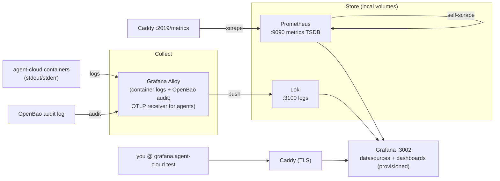

# 05 — Observability (o11y)
> **Consolidates:** O11Y-DEPLOYMENT.md (originals archived in `plan/archive/`)
>
> **Depends on:** 00, 01
>
> Part of the dependency-ordered `plan/development/` set (00–10). The source
> plans are merged verbatim below under provenance dividers to preserve all
> detail; read in numbered order to execute.

> **As-built check, 2026-09-22 (branch `feat/observability-estate`):** The
> committed local o11y compose defines Grafana, Prometheus, Loki and Alloy;
> `config/prometheus.yml` scrapes only Prometheus, and `config/config.alloy`
> ships local container logs but has no OTLP receiver or OpenBao-audit tail.
> A later read-only check on 2026-09-22 found all four local containers healthy.
> Grafana `/api/health`, Prometheus `/-/ready`, and Loki `/ready` each returned
> HTTP 200; the chain-verified Caddy URL returned Grafana health and its OIDC
> login route redirected to Authentik with PKCE. The browser completed that
> login and returned to the provisioned overview dashboard, where the live
> log panel listed local containers and the scrape panel showed only the
> Prometheus self-target. Local Semaphore candidate task 1065 later checked out
> commit `653758c6a89cec76b0b8e703b3ca7f3b68e759a6` and deployed o11y;
> Grafana, Prometheus, and Loki passed their service checks. A browser reload
> returned to the signed-in dashboard. Loki then exposed local `service` label
> values, while Prometheus still had only its self-target. New service metric
> collection, alert delivery, and production receipt remain unverified.
> Local Semaphore verifier task 1079 checked out
> `be5bbe8b3a0eafa3829a74baaccb72c0a8ae97e2` and found a fresh
> `o11y-grafana` log in Loki. Metrics-required task 1080 on the same revision
> failed with `targets found=0` for that service, as expected from the
> self-only Prometheus target list. The metrics pilot is still pending.
> The committed production inference telemetry groundwork is merged into this
> branch; its scrape declarations do not prove a reachable receiver.

> **Local metrics pilot, 2026-09-23:** Branch-bound Semaphore task 1100
> deployed Caddy at `9c87ed6ccd56ea0c8f6c502248d9b66d7ed7ff35` and
> verified its private `/metrics` listener. An initial o11y candidate task
> 1101 reported healthy Grafana/Prometheus/Loki while Alloy rejected a
> network-selection setting absent in pinned v1.5.1; receipt 1102 correctly
> failed with no `caddy` scrape. The shared deploy now checks Alloy health.
> Corrected candidate task 1105 and named receipt 1106 both succeeded at
> `3f9a9b97bf9e8362c0fdbe4924c89bc07dc63207`: Loki had a `caddy` log
> within 15 minutes and Prometheus had one healthy `caddy:2021` scrape.
> The local TSDB read back `up{service="caddy"}=1`, 361 active Caddy series,
> and 1,049 total active series, versus a prior self-only baseline of 616.
> These are point-in-time local measurements, not production or alert proof.
> At `5bc22b8d54b2e7b0e2ca4985c3f7b34ddf1cc2b1`, local Semaphore task
> 1112 redeployed the stack with a 1 GB Prometheus retention-size cap and a
> 2,000-sample Alloy scrape ceiling; task 1113 again verified Caddy metrics
> and logs. Container read-back confirmed both limits, and the local TSDB
> reported 1,100 active series. The production size cap stays disabled until
> the existing receiver disk and retention are audited.
> At `725397df613d8e989990dcc0abc3fe482229c89b`, local Semaphore task
> 1118 ran the reversible unreachable-endpoint drill. Alloy discovered an
> opted-in disposable container at `o11y-fault-probe:65535`, Prometheus wrote
> `up=0`, and the shared onboarding verifier refused it with that service and
> endpoint named. The playbook removed its probe in `always`; a subsequent
> container-existence check confirmed absence.
> At `21102b19bbafc294b3e46ef8cb7dcd93fc881a97`, local Semaphore task
> 1126 redeployed the branch after provisioned alert rules were added. Grafana's
> API reported `o11y_service_down` and `o11y_missing_caddy`, both paused while
> the OpenBao-backed notification destination remains undecided. Its startup
> log completed alert provisioning without a file-suffix warning. Task 1127
> then found a Caddy log from the preceding 15 minutes and one healthy
> Prometheus scrape. Grafana's API returned the Service Overview with three
> panels spanning Loki and Prometheus. Together with task 1118's named
> unreachable-endpoint refusal, this closes the local collection gate;
> notification delivery, trace ingestion, and production receipt remain open.
> The optional Discord contact point path now reads
> `secret/services/o11y:alert_discord_webhook_url` only when
> `o11y_alerts_enabled` is true; a missing value is refused before any
> OpenBao write, and the URL is carried in the mode-0600 environment file.
> An initial local candidate task 1128 at
> `ad97088421ea93ca4b0ad67b4205c24c187bcbf5` failed before Grafana
> became healthy: Ansible's Jinja whitespace trimming joined two alert-rule
> YAML lines. Task 1131 deployed the corrected template at
> `fe925f0b1ddbdf4d2324000ca792e22be9b1184d`; Grafana health returned
> OK, both rules remained paused, and no o11y contact point was active.
> Task 1132 reverified the Caddy metrics/logs receipt. The render test now
> uses Ansible's whitespace behavior. Alert notification receipt is not yet
> proven, and the enabled branch still requires an approved webhook.
> At `ebff111f40105ae0c7437f732fcb768fa0162c8e`, separate branch-bound
> local Semaphore templates were registered for alert enablement and the
> alert drill without launching either during registration. Alert-drill task
> 1137 then refused before probe creation because the provisioned service-down
> rule was paused; a container-existence check confirmed no probe was made.
> Ordinary unreachable-endpoint task 1138 still passed and removed its probe.
> The enabled alert-firing and external notification paths remain untested.
> A read-only local OpenBao check on 2026-09-23 found the o11y record but no
> `alert_discord_webhook_url` key. The branch now includes a repeatable
> `Seed o11y Alert Webhook` Semaphore playbook: it accepts the approved value
> only as an encrypted environment secret, merges that one key into OpenBao,
> and skips an unchanged value. It has not been run with a webhook; no alert
> recipient has been approved or delivery observed.
> On 2026-09-23 the operator selected the existing Discord operations channel
> and supplied a bot credential. The revised Dev-bound seed workflow uses that
> credential from OpenBao to reconcile one named webhook in a declared text
> channel, then stores its URL under the o11y secret. The actual channel ID
> belongs in private inventory. The webhook, alert drill, and delivery receipt
> are still unverified; the earlier manual-webhook seed description above is
> historical.
> A read-only Discord API check with the supplied bot credential and a named
> client header returned HTTP 200 for message history in the selected channel
> on 2026-09-23. The Dev-bound fault drill now contains a message-receipt gate;
> that gate has not yet run with enabled alerts, so delivery remains unverified.
> A read-only production Semaphore API check on 2026-09-23 found the reviewed
> `dev` audit declaration absent from the live template catalog. A full-catalog
> publication would have touched unrelated settings on 129 existing templates
> and surveys on 65, so PR #199 added a guarded one-template create path and
> merged to `dev`. Semaphore task 1132 checked out that merge and created only
> `Audit o11y Containers (Dev)` as template 218 with the verified Dev repository,
> production inventory, and existing environment bindings.
> Read-only audit task 1133 exposed an Ansible double-rendering error in the
> Grafana-host container report. PR #200 fixed it, passed CodeRabbit review and
> final-head checks, and merged to `dev`. Rerun task 1134 checked out merge
> `b34acfd51bd65af36b21821c203c10085f093ae6` and reached every report
> task without that error. Its reachable Agent Cloud hosts reported no
> `o11y-*` containers. The task still ended in error because four inventory
> hosts were unreachable, including the existing `grafanapodman` host; its
> containers and data remain unexamined. The private inventory has no
> `o11y_svc` receiver and no managed VM specification for `grafanapodman`.
> Receiver placement and production retention sizing remain gated on a
> declared, reachable host and its storage audit.
> The private production inventory also omits Grafana from Authentik's enabled
> app list and has no managed Grafana Caddy route. The public o11y env template
> now derives production browser and OIDC token URLs from a required production
> DNS zone over HTTPS, preserving the local shared-container path only in
> local-dev. A localhost-only refusal probe stopped before placement when the
> zone was absent, and the local/production render test passed. The production
> IdP app, Caddy route, DNS, and network path are not yet deployed or verified.
> The receiver now has an inventory-gated agentgateway `/metrics` scrape
> template with `service=agentgateway`; an absent declaration removes the
> target. The private production inventory still binds the gateway stats port
> to loopback until the audited o11y receiver source and firewall path are
> approved. This is code preparation, not a live agentgateway scrape receipt.
> Production Semaphore deployments may use the reviewed `dev` branch under
> the operator's 2026-09-23 direction. The `Deploy o11y (Dev)` template binds
> to the declared Dev repository, defaults the target clone to `dev`, and
> requires an exact commit SHA; the playbook checks both the controller and
> receiver revisions before rendering secrets or starting containers.
> Local candidate task 1147 refused a mistyped expected SHA before placing
> files. Task 1148 then deployed the exact pushed commit
> `22cc811782a8cfe511d01d595ca91d6ae4075998`; task 1149 verified a
> recent Caddy log and healthy metrics. Prometheus read-back returned
> `up{service="caddy"}=1` and no loaded `agentgateway` scrape job, as required
> while the local inventory omits that remote endpoint. These receipts do not
> prove agentgateway telemetry or any production receiver state.
> Local candidate deployment task 1166 and named verification task 1167 both
> succeeded at `df8e8c58fc1083c9e8f6ef16318159e2e449bb4a`: Grafana,
> Prometheus, Loki, and Alloy passed deployment checks, and the verifier found
> a recent `caddy` log plus a healthy Caddy metrics scrape. A fresh browser
> reload on 2026-09-23 returned to the signed-in Grafana Service Overview over
> the local TLS front door and displayed the `caddy:2021` target. The six-hour
> dashboard range also included the earlier disposable fault-probe series;
> this historical series is not evidence of a currently running probe. These
> checks validate the current local revision but do not prove alert delivery.
> On 2026-09-23, the operator required subsequent Semaphore automation to run
> code pushed to `dev`, without temporary recovery patches. A local candidate
> task at `69aad0454daefa32b00217fa3cb2856f51254b37` first refused an
> abbreviated SHA before placement. A full-SHA rerun then reached the local
> placement check, which failed because the shared local copy deliberately
> excludes `.git`. Commit `4572a20` makes the candidate controller checkout
> clean-state check explicit, uses the successful local copy as its placement
> evidence, and retains the receiver Git SHA check for production cloning.
> The baseline now needs a reviewed PR into `dev`; the next local and
> production Semaphore runs must use that exact merged revision. Alert rules
> stay paused until an approved destination and a notification drill pass.
> Production Semaphore task 1137 ran the NetBox free-address workflow in its
> read-only mode and stopped before querying IPAM: OpenBao held the NetBox
> service record but no `automation_api_token`. It reserved no address.
> Separate read-only Proxmox validation task 1138 passed all nine checks on
> `alphacentauri`, reported 511 GB available on its VM storage, and found VMID
> 219 absent from both its live VM listing and the private allocation ledger.
> That VMID is a candidate, not a reservation or a provisioned receiver.
> PR #201 passed its final-head CodeRabbit review and checks and merged to
> `dev` as `47be7da0d6f0ba4633c348af82d964c5839968ab`. The scoped
> `Provision NetBox Automation Token (Dev)` template was published as task
> 1140 with the verified project, inventory, environment, and Dev repository
> bindings. Bootstrap task 1141 stopped before minting a token because Docker
> reported the `netbox-netbox-1` application container exists but is not
> running. Its empty shell output also exposed a `changed_when` expression
> that masked the Docker error. Neither the token nor an IP address was
> provisioned. All-host validation tasks 1142 and 1143 stopped on an
> unrelated unreachable NocoDB host before reaching NetBox; the accepted
> Semaphore `params.limit` setting did not constrain the actual play.
> PR #202 passed a completed CodeRabbit review and final-head checks, then
> merged to `dev` as `3af6bf58d06cd9e8b44cd3e469cceca5d9200f3c`. A
> scoped Semaphore publication created only `Audit NetBox Runtime (Dev)` as
> template 223. Its read-only production task 1148 succeeded at that exact
> revision: the NetBox app, Postgres, and both Redis containers were exited
> with code 255; Hydra was unhealthy, the reconciler was restarting, and
> `/login/` was unreachable. It changed no host state. PR #204 extended the
> audit with dependency OOM, restart, finish-time, policy, and host-boot
> evidence; CodeRabbit approved its exact head with green checks, and it
> merged to `dev` as `440cfbd53696914ce222b89b23e3b53e93265e99`.
> Dev-bound production task 1152 ran that merge and changed no host state.
> The NetBox app, Postgres, and both Redis containers remained exited with
> code 255, `oom=false`, zero restarts, and `policy=no`. Their finish times
> clustered just after the host's 2026-09-19 boot. The committed compose
> declares `restart: always` for these services, so runtime policy has not
> converged. `/login/` remained unreachable. Recovery must use reviewed,
> repeatable code from `dev` and verify the resulting policy and health.
> Do not run the regular NetBox deploy as an unexamined recovery step: it
> pulls images, stops the stack, and rebuilds containers.
> A later read-only source audit found the host's tracked Compose file clean
> at an older April commit, while the reviewed `dev` Compose declares the
> required restart policies. The recovery preflight correctly refused that
> mismatch before touching containers. Reconcile the host monorepo through
> the Dev-bound recovery playbook as a separate, default-off source action:
> require the audited starting commit and no tracked source changes, place the
> exact reviewed Dev commit with a no-overwrite Git switch that preserves
> unrelated untracked and ignored host files, then verify its
> revision and Compose checksum. Run the container dry-run with runtime
> apply still disabled;
> only then choose the scoped backing-service and NetBox start/recreate actions.
> The host commit is on the unmerged April discovery debug branch (PR #186),
> not an ancestor of `dev`. Its static-IP fallback was curated and merged to
> `dev` in PR #223 with validation and without that branch's hardcoded site
> coordinates or diagnostic logging. Source placement changes the worker
> directory bind-mounted by orb-agent; verify discovery after NetBox recovers
> and audit old synthetic `eth0` records before any cleanup.
> The DGX Spark owner rechecked its telemetry state on 2026-09-23: both node
> exporters are boot-enabled on port 9100, vLLM exposes metrics on port 8000,
> and the Loki shipper remains disabled with no receiver URL. The exporter
> firewall has no approved scrape source yet. DGX PR #18 merged as
> `efa8bc7013555ad40014a28cb20e070685c7a20b`; its declared rule now
> opens only node exporter port 9100 and removes recorded legacy GPU ingress.
> No live firewall rule was applied. GPU scraping remains disabled until
> compatibility and an unloaded-window test are proven. The receiver
> must publish its actual Loki push URL and admit both DGX source hosts before
> log shipping can be enabled. No DGX telemetry receipt exists yet.
> PR #206 passed CodeRabbit review and final-head checks and merged the local
> baseline to `dev` as `3de6fe71cd60efe2e2986922c08ab4c55bce0929`.
> Local Dev-bound Semaphore task 1225 deployed that merge; task 1231 found a
> Caddy log within 15 minutes and a healthy Caddy metrics scrape. A browser
> sign-out followed by Grafana's Authentik sign-in returned to the signed-in
> Grafana home over the local TLS front door using the existing Authentik
> session. This proves the merged revision's SSO redirect and return path,
> not a new password challenge or production SSO. Production Dev-bound task
> 1156 published `Deploy o11y (Dev)` as template 224, but no production
> receiver host is declared, so no production deployment has been launched.
> The production Caddy inventory sets `caddy_composable: false`; its route
> must be declared in private `site-config` as `caddy_managed_sites` and
> applied through `manage-caddy-sites.yml`, rather than through a service
> fragment. Private site-config PR #17 merged the Grafana Authentik app
> declaration; PR #18 aligned its production browser URLs. Neither change
> has been applied to live Authentik.
> The production telemetry contract names `o11y.uhstray.io`, which already has
> an OpenTofu-managed DNS record. The local front door remains
> `grafana.agent-cloud.test`. Before production SSO, apply the private Grafana
> Authentik redirect/launch URLs and Caddy route for `o11y.uhstray.io`
> through the Dev-bound Semaphore workflows. Read-only Dev-bound
> task 1160 planned one unrelated DNS addition and one rate-limit update at
> `3de6fe71cd60efe2e2986922c08ab4c55bce0929`; reconcile those separately.
> On 2026-09-23, PRs #208 and #210 merged the receiver guard and
> OpenBao-sourced Discord webhook/drill mechanism to `dev`. Private site-config
> PR #18 merged the alert destination and Grafana browser URLs, but its
> production `o11y_svc` group remains empty. PR #209 merged a guarded NetBox
> runtime recovery workflow; it has not been run on production. PR #214 merged
> one-template Dev publication. Local Semaphore tasks 1292, 1293, and 1294
> updated the publisher and created its webhook and fault-drill Dev templates
> with verified local bindings. Task 1295 found the failed scrape only after its
> one-minute wait expired and cleaned up its probe. Reviewed PR #215 extended
> that bounded wait and the probe lifetime; local Dev-bound task 1300 ran its
> merged revision `0b64a0c447e476a1ad02a39de4368f0bab5053d8`, saw the
> unreachable target, proved the onboarding verifier refused it, and removed
> the probe. Task 1300 ran with alert delivery disabled. Discord notification receipt,
> production NetBox recovery, receiver placement, and production telemetry
> remain unverified. As of 2026-09-23, this workstation's production Semaphore
> sign-in meets a Cloudflare challenge before the Authentik session opens.

<!-- ======================= source: O11Y-DEPLOYMENT.md ======================= -->

# Observability (o11y) Stack Deployment Plan

> **Location:** `plan/development/05-observability.md`
> **Date:** 2026-06-14 · **Status:** PROPOSED · **Owner:** uhstray-io
>
> **Context:** `platform/services/o11y/` is an empty stub. LOCAL-DEV-DEPLOYMENT.md reserved ports `3002` (Grafana) / `9090` (Prometheus) / `3100` (Loki) and gated the service on "define the stack in its own plan/PR first" — this is that plan. It defines a **minimal-but-real** local observability stack that follows the composable pattern (DNS/Caddy/step-ca/Authentik), then names the prod extension. The platform already depends on it: AUTOMATION-COMPOSABILITY.md §"Audit logging" requires OpenBao's file audit backend piped to **Loki** with alerting; IMPLEMENTATION_PLAN.md routes orb-agent OpenTelemetry metrics here and lists Grafana/Prometheus for the Reliability + NetClaw agents.
>
> **For agentic workers:** Execute phase-by-phase; every phase ends at a validation gate. Configs are committed config-as-code (non-secret); only the Grafana admin password is a secret (OpenBao). Real domains/secrets stay in site-config; the public repo uses placeholders + `LOCAL_FAKE_`.

**Goal:** A self-hosted observability stack — **metrics + logs + dashboards** — deployed locally through the same `make bootstraps, Semaphore operates` pipeline, so every agent-cloud service's health is visible in Grafana at `https://grafana.agent-cloud.test`, with a clean prod extension path.

**Architecture:** Four composable containers — **Grafana** (viz), **Prometheus** (metrics scrape + TSDB), **Loki** (log store), **Grafana Alloy** (unified collector: ships container + OpenBao-audit logs to Loki, exposes an OTLP receiver for future agent telemetry). Config-as-code (Prometheus scrape, Loki, Alloy, Grafana datasource/dashboard provisioning) is committed and mounted read-only; the Grafana admin password flows from OpenBao via `manage-secrets`. Long-term storage (Mimir), traces (Tempo), object-store backends (MinIO), and Alertmanager are **prod additions**, explicitly out of local scope.

**Tech stack:** Grafana, Prometheus, Loki, Grafana Alloy (all OSS, container images), the composable Ansible tasks (`place-monorepo`, `manage-secrets`), Caddy (front door), step-ca TLS.

---

## Decision criteria (alternatives considered)

| Decision | Chosen | Rejected / deferred | Why |
|---|---|---|---|
| **Stack family** | **Grafana LGTM-lite** (Loki + Grafana + Prometheus + Alloy) | Elastic/ELK; Datadog/SaaS | IMPLEMENTATION_PLAN already names Grafana/Prometheus/Loki/Mimir/Tempo/OTel [IMPL:208,265-267]; OSS, self-hostable (privacy-first), composes cleanly. |
| **Local component subset** | Grafana + Prometheus + Loki + Alloy | + Mimir (long-term metrics), + Tempo (traces), + MinIO backends, + Alertmanager | Local-dev needs *visibility*, not retention/HA. Mimir/Tempo/MinIO/Alertmanager are prod concerns (retention 1yr/3mo per IMPL:265-267); adding them locally is RAM + config cost with no local payoff. |
| **Collector** | **Grafana Alloy** (one agent: logs→Loki + OTLP receiver) | Promtail (logs only) + OTel Collector (metrics/traces) as two services | Alloy is the supported successor to both; one container does container-log shipping AND an OTLP endpoint for the orb-agent telemetry IMPL:828 wants — fewer moving parts, and it IS the OpenTelemetry path IMPL:208 calls for. |
| **Local metrics targets** | Prometheus self + **Caddy** (`/metrics` on the admin API) | cAdvisor (per-container) + node-exporter (host) | Caddy already exposes Prometheus metrics on its admin port; cAdvisor/node-exporter on the podman-machine VM are flaky and low-value locally. Per-container/host metrics are a **follow-on** (Phase 2), noted not skipped. |
| **Local log sources** | container stdout/stderr (podman) + **OpenBao audit log** | full journald, app-specific parsers | The audit→Loki pipe is a *documented platform requirement* (AUTOMATION-COMPOSABILITY §audit logging); container logs are the cheap universal signal. |
| **Traces (Tempo)** | **Deferred** (prod) | local Tempo | No local service emits traces yet; Alloy's OTLP receiver is wired so traces drop in later without re-architecting. |
| **TLS / access** | Behind **Caddy** (`grafana.agent-cloud.test`), Grafana serves HTTP on its container port | Grafana terminates TLS itself | Same front-door pattern as every other service (step-ca wildcard); SSO via Authentik `forward_auth` is a later phase. |

---

## Source context

- `platform/services/o11y/` — empty stub (`deployment/.gitkeep`, `context/.gitkeep`); no compose, no plan. This plan fills it.
- `plan/development/00-foundation-local-dev.md:227,294` — o11y "stub-blocked; own plan/PR defines grafana/prometheus/loki shape; local profile follows"; ports `3002/9090/3100` reserved.
- `plan/architecture/01-automation-model.md:577` — "OpenBao's file audit backend must be enabled and piped to the observability stack (Loki). Alerting rules fire on: same secret read >10x/min, unknown AppRoles, failed auth." — a hard consumer of this stack.
- `plan/archive/development/IMPLEMENTATION_PLAN.md:208,265-267,828,1545` — telemetry = OpenTelemetry → Grafana; o11y backends Mimir/Tempo/Loki (prod retention); orb-agent OTel export; Reliability Agent uses Prometheus/Alertmanager.
- Composable exemplars this mirrors: `platform/services/step-ca/deployment/` + `platform/playbooks/deploy-step-ca.yml` (service shape), `tasks/manage-secrets.yml` (Grafana admin pw), `tasks/mint-internal-cert.yml`/Caddy (TLS front door).

The stack and its flows:

```mermaid
flowchart LR
  subgraph collect["Collect"]
    AL["Grafana Alloy<br/>(container logs + OpenBao audit;<br/>OTLP receiver for agents)"]
  end
  subgraph store["Store (local volumes)"]
    PR["Prometheus<br/>:9090 metrics TSDB"]
    LO["Loki<br/>:3100 logs"]
  end
  GR["Grafana :3002<br/>datasources + dashboards (provisioned)"]
  CAD["Caddy :2019/metrics"]
  SVC["agent-cloud containers<br/>(stdout/stderr)"]
  BAO["OpenBao audit log"]

  CAD -- scrape --> PR
  PR -- self-scrape --> PR
  SVC -- logs --> AL
  BAO -- audit --> AL
  AL -- push --> LO
  PR --> GR
  LO --> GR
  USER["you @ grafana.agent-cloud.test"] --> CAD2["Caddy (TLS)"] --> GR
```

---

## Phase 0 — Scaffold the composable service (no deploy yet)

**Files (create):**
- `platform/services/o11y/deployment/compose.yml` — 4 services, env-parameterized images + ports:
  - `grafana` (`${O11Y_GRAFANA_IMAGE:-docker.io/grafana/grafana:11.4.0}`), publishes `${O11Y_GRAFANA_BIND:-127.0.0.1}:${O11Y_GRAFANA_PORT:-3002}:3000`, mounts `./config/grafana/provisioning:/etc/grafana/provisioning:ro` + `./config/grafana/dashboards:/var/lib/grafana/dashboards:ro`, env `GF_SECURITY_ADMIN_PASSWORD`/`GF_SERVER_ROOT_URL`; healthcheck `wget -q -O- http://127.0.0.1:3000/api/health`.
  - `prometheus` (`${O11Y_PROM_IMAGE:-docker.io/prom/prometheus:v3.1.0}`), `:9090`, mounts `./config/prometheus.yml:/etc/prometheus/prometheus.yml:ro` + a `prometheus-data` volume; healthcheck `/-/ready`.
  - `loki` (`${O11Y_LOKI_IMAGE:-docker.io/grafana/loki:3.3.2}`), `:3100`, mounts `./config/loki-config.yml` + `loki-data` volume; healthcheck `/ready`.
  - `alloy` (`${O11Y_ALLOY_IMAGE:-docker.io/grafana/alloy:v1.5.1}`), mounts `./config/config.alloy:ro` + the podman socket (ro, for container-log discovery) + the OpenBao audit log path; OTLP receiver on `:4317/:4318`. No published port locally (it pushes to Loki by name).
- `platform/services/o11y/deployment/compose.local.yml` — slim overlay (mem caps: grafana 256m, prometheus 384m, loki 256m, alloy 192m; `label=disable`; join `local-dev` so Prometheus scrapes `caddy:2019` and Caddy reaches `grafana:3000` by name).
- `platform/services/o11y/deployment/config/` (committed config-as-code):
  - `prometheus.yml` — scrape self + `caddy:2019/metrics`; `# TODO Phase 2: cadvisor/node-exporter`.
  - `loki-config.yml` — single-binary, filesystem store under the volume.
  - `config.alloy` — `loki.source.podman` (or `discovery.docker` over the socket) → `loki.write` to `http://loki:3100`; a `local.file_match` for the OpenBao audit log → Loki; `otelcol.receiver.otlp` stub (no exporter consumer yet).
  - `grafana/provisioning/datasources/datasources.yml` — Prometheus (`http://prometheus:9090`, default) + Loki (`http://loki:3100`).
  - `grafana/provisioning/dashboards/dashboards.yml` + `grafana/dashboards/agent-cloud-overview.json` — a starter dashboard (up targets, Caddy req rate, container log volume).
- `platform/services/o11y/deployment/deploy.sh` — container-lifecycle-only (verify .env, pull, up, `wait_for_healthy grafana 180`).
- `platform/services/o11y/deployment/templates/env.j2` — `O11Y_*` image/bind/port vars + `GF_SECURITY_ADMIN_PASSWORD={{ secrets.grafana_admin_password }}` + `GF_SERVER_ROOT_URL=https://grafana.{{ o11y_zone | default('agent-cloud.test') }}`.
- `platform/services/o11y/deployment/.gitignore` — `.env`.
- `platform/services/o11y/deployment/context/architecture.md` — the agent-facing doc.
- `platform/playbooks/deploy-o11y.yml` — `place-monorepo` → `manage-secrets` (`grafana_admin_password` random 32) → deploy.sh → verify (Grafana `/api/health`, Prometheus `/-/ready`, Loki `/ready`).
- `platform/playbooks/clean-deploy-o11y.yml` — destroy+redeploy (local-aware `clean-service.yml`).
- `platform/tests/test_service_o11y.bats` — compose env-param + pinned images + healthchecks; deploy.sh container-only/no-secrets; overlay caps/label/local-dev/no-ports; datasource + dashboard provisioning valid YAML/JSON; prometheus scrape config present.

**Wire:** `o11y_svc` inventory group (`local-dev.yml.example` + bootstrap `_inv_ini`); "Deploy o11y (Local)" + "Clean Deploy o11y (Local)" in `templates-local.yml`; the `grafana.agent-cloud.test` route added to `caddy_routes` (Phase 1, when Grafana is up).

**Gate 0:** `ansible-playbook --syntax-check` clean; `yamllint`/`shellcheck` clean; BATS green; CI green. No containers started yet.

## Phase 1 — Deploy locally + validate

- `make local-bootstrap` (register templates + `o11y_svc`), then `make local-deploy-o11y`.
- Add `grafana.agent-cloud.test` to `caddy_routes` (upstream `grafana:3000`) + `make local-deploy-caddy`.
- **Validation gate:** Grafana `/api/health` 200; both datasources provisioned; Prometheus `/-/ready` + self-scrape UP; Loki `/ready` + a `{container=~".+"}` query returns lines (Alloy shipping container logs); the starter dashboard renders; `https://grafana.agent-cloud.test:8443` loads behind Caddy (step-ca cert, chain-verified). Extend `local-smoke.sh` with an o11y section (Grafana/Prometheus/Loki health + Loki has logs) — skip-not-fail when absent.
  - *Per-target metrics (Caddy, containers) are **Phase 2**, not this gate:* Caddy's admin API (`:2019/metrics`) is loopback-only, so cross-container scraping needs a dedicated routable metrics listener (below). The `metrics` global option is pre-enabled in `Caddyfile.local.j2`.

## Phase 2 — Platform integrations (local)

- **OpenBao audit → Loki:** enable OpenBao's file audit device into a path Alloy tails; add the alerting rules from AUTOMATION-COMPOSABILITY §audit (same-secret-read spike, unknown AppRole, failed auth).
- **Caddy metrics:** add a dedicated routable metrics listener to `Caddyfile.local.j2` (e.g. `:2021 { metrics }`) — the admin API stays loopback-only — and add the `caddy:2021` Prometheus scrape target. Wire a Prometheus reload (`--web.enable-lifecycle` / POST `/-/reload`) into `deploy-o11y.yml` so scrape-config changes apply without a full recreate.
- **Container/host metrics:** add cAdvisor + node-exporter scrape targets (validated against the podman-machine VM).
- **orb-agent OTel:** point its OpenTelemetry exporter at Alloy's OTLP receiver (IMPL:828).
- **SSO:** gate Grafana via Authentik OIDC / Caddy `forward_auth` (AUTH-SSO Phase 1+).

## Phase 3 — Prod extension (separate PR)

Mimir (long-term metrics, MinIO-backed), Tempo (traces, MinIO-backed), Alertmanager + notification routes, retention per IMPL (metrics 1yr / traces 3mo / logs 1yr), and the k8s/Helm path (IMPL:379). Same compose base; prod overlay + `manage-secrets` for MinIO/datasource creds.

---

## Target outcome

When Phase 1's gate passes:

- **One pane of glass, deployed like everything else.** `https://grafana.agent-cloud.test` shows live metrics (Prometheus) and logs (Loki) for the local stack, brought up by `make local-deploy-o11y` through Semaphore — no hand-wired monitoring.
- **Config is code.** Datasources, dashboards, scrape rules, and log pipelines are committed and provisioned on boot; the only secret is the Grafana admin password (OpenBao). A wipe + redeploy reproduces the exact same observability.
- **The audit-logging requirement has a home.** AUTOMATION-COMPOSABILITY's OpenBao-audit→Loki pipe and orb-agent OTel export now have a concrete target (Phase 2), instead of an unbuilt dependency.
- **Local mirrors prod.** The same compose base extends to Mimir/Tempo/MinIO/Alertmanager in prod via overlay + `manage-secrets` — one codebase, no fork; local proves the shape before prod.
