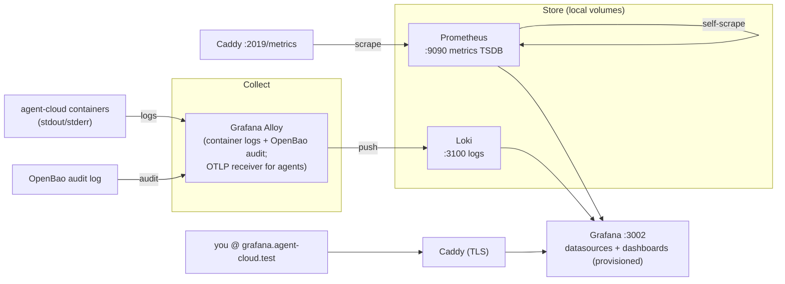

# 05 — Observability (o11y)
> **Consolidates:** O11Y-DEPLOYMENT.md (originals archived in `plan/archive/`)
>
> **Depends on:** 00, 01
>
> Part of the dependency-ordered `plan/development/` set (00–10). The source
> plans are merged verbatim below under provenance dividers to preserve all
> detail; read in numbered order to execute.

## Signal identity, service visibility, and profiling contract

Use one bounded service identity across signals: Prometheus and Loki use
`service`, OTLP resources use `service.name`, and profiles use `service_name`.
Prometheus and Loki also carry inventory-bounded `cluster` and `environment`.
Alerts add the finite `severity` and `owner` labels and group on service,
environment, cluster, and alert name. Keep `container` and `instance` for
drill-down only. Request IDs, user IDs, trace IDs, raw paths, addresses, prompt
content, and secrets must stay out of Prometheus labels and Loki stream labels;
keep investigation detail in log bodies or structured metadata.

All Prometheus scrape paths and Alloy container metrics apply the shared
forbidden-label-name policy for known sensitive and request-specific names.
This is a deny list, not an allowlist: it cannot identify arbitrary
vendor-specific identifiers. Before enabling a producer, inspect a
representative metrics exposition, record its retained bounded dimensions
(including any model, GPU, device, or node labels), and verify that its schema
does not expose sensitive or unbounded identifiers. Extend the shared policy
when that review finds additional label names to drop.

For each deployed target, declare its stable service identity, owner, cluster
and environment values, signal methods, profile applicability, finite label
values, and proof. Local Compose discovery uses `<project>/<service>` so
repeated names such as `redis` stay distinct; the container name remains detail.
Remote metrics use the same declared
`service` value. A missing scrape stays missing or unhealthy; dashboard queries
must not turn absent telemetry into a healthy zero. The Service Overview
selector is sourced from Prometheus service labels, so it covers metric-enabled
local and remote services; use Logs Drilldown and the coverage declaration for
log-only targets.

Pyroscope is private on the o11y network with a persistent named volume and a
seven-day initial retention policy. Its Alloy self-profile pilot is disabled
unless private inventory explicitly enables it after the pinned Alloy config,
target reachability, privacy, and VM headroom are verified. The initial pilot
uses only Alloy's own pprof endpoint at `alloy:12345` under `service_name=o11y/alloy`
and a 60-second scrape interval. Record the before/after CPU, memory, profile
ingestion, and retained-disk measurements before adding another producer. A
normal deploy preserves this volume and every existing telemetry volume.

Use the existing Discord contact point. Group notifications by the bounded
service and environment context, wait 30 seconds before the first grouped
notification, then use a five-minute group interval and a four-hour repeat
interval. Verify the provisioned rule settings by read-back; a Discord delivery
drill is a separate runtime receipt.

> **As-built check, 2026-09-22 (branch `feat/observability-estate`):** The
> committed local o11y compose defines Grafana, Prometheus, Loki and Alloy;
> `config/prometheus.yml` scrapes only Prometheus, and `config/config.alloy`
> ships local container logs but has no OTLP receiver or OpenBao-audit tail.
> A later read-only check on 2026-09-22 found all four local containers healthy.
> Grafana `/api/health`, Prometheus `/-/ready`, and Loki `/ready` each returned
> HTTP 200; the chain-verified Caddy URL returned Grafana health and its OIDC
> login route redirected to Authentik with PKCE. The browser completed that
> login and returned to the provisioned overview dashboard, where the live
> log panel listed local containers and the scrape panel showed only the
> Prometheus self-target. Local Semaphore candidate task 1065 later checked out
> commit `653758c6a89cec76b0b8e703b3ca7f3b68e759a6` and deployed o11y;
> Grafana, Prometheus, and Loki passed their service checks. A browser reload
> returned to the signed-in dashboard. Loki then exposed local `service` label
> values, while Prometheus still had only its self-target. New service metric
> collection, alert delivery, and production receipt remain unverified.
> Local Semaphore verifier task 1079 checked out
> `be5bbe8b3a0eafa3829a74baaccb72c0a8ae97e2` and found a fresh
> `o11y-grafana` log in Loki. Metrics-required task 1080 on the same revision
> failed with `targets found=0` for that service, as expected from the
> self-only Prometheus target list. The metrics pilot is still pending.
> The committed production inference telemetry groundwork is merged into this
> branch; its scrape declarations do not prove a reachable receiver.

> **Local metrics pilot, 2026-09-23:** Branch-bound Semaphore task 1100
> deployed Caddy at `9c87ed6ccd56ea0c8f6c502248d9b66d7ed7ff35` and
> verified its private `/metrics` listener. An initial o11y candidate task
> 1101 reported healthy Grafana/Prometheus/Loki while Alloy rejected a
> network-selection setting absent in pinned v1.5.1; receipt 1102 correctly
> failed with no `caddy` scrape. The shared deploy now checks Alloy health.
> Corrected candidate task 1105 and named receipt 1106 both succeeded at
> `3f9a9b97bf9e8362c0fdbe4924c89bc07dc63207`: Loki had a `caddy` log
> within 15 minutes and Prometheus had one healthy `caddy:2021` scrape.
> The local TSDB read back `up{service="caddy"}=1`, 361 active Caddy series,
> and 1,049 total active series, versus a prior self-only baseline of 616.
> These are point-in-time local measurements, not production or alert proof.
> At `5bc22b8d54b2e7b0e2ca4985c3f7b34ddf1cc2b1`, local Semaphore task
> 1112 redeployed the stack with a 1 GB Prometheus retention-size cap and a
> 2,000-sample Alloy scrape ceiling; task 1113 again verified Caddy metrics
> and logs. Container read-back confirmed both limits, and the local TSDB
> reported 1,100 active series. The production size cap stays disabled until
> the existing receiver disk and retention are audited.
> At `725397df613d8e989990dcc0abc3fe482229c89b`, local Semaphore task
> 1118 ran the reversible unreachable-endpoint drill. Alloy discovered an
> opted-in disposable container at `o11y-fault-probe:65535`, Prometheus wrote
> `up=0`, and the shared onboarding verifier refused it with that service and
> endpoint named. The playbook removed its probe in `always`; a subsequent
> container-existence check confirmed absence.
> At `21102b19bbafc294b3e46ef8cb7dcd93fc881a97`, local Semaphore task
> 1126 redeployed the branch after provisioned alert rules were added. Grafana's
> API reported `o11y_service_down` and `o11y_missing_caddy`, both paused while
> the OpenBao-backed notification destination remains undecided. Its startup
> log completed alert provisioning without a file-suffix warning. Task 1127
> then found a Caddy log from the preceding 15 minutes and one healthy
> Prometheus scrape. Grafana's API returned the Service Overview with three
> panels spanning Loki and Prometheus. Together with task 1118's named
> unreachable-endpoint refusal, this closes the local collection gate;
> notification delivery, trace ingestion, and production receipt remain open.
> The optional Discord contact point path now reads
> `secret/services/o11y:alert_discord_webhook_url` only when
> `o11y_alerts_enabled` is true; a missing value is refused before any
> OpenBao write, and the URL is carried in the mode-0600 environment file.
> An initial local candidate task 1128 at
> `ad97088421ea93ca4b0ad67b4205c24c187bcbf5` failed before Grafana
> became healthy: Ansible's Jinja whitespace trimming joined two alert-rule
> YAML lines. Task 1131 deployed the corrected template at
> `fe925f0b1ddbdf4d2324000ca792e22be9b1184d`; Grafana health returned
> OK, both rules remained paused, and no o11y contact point was active.
> Task 1132 reverified the Caddy metrics/logs receipt. The render test now
> uses Ansible's whitespace behavior. Alert notification receipt is not yet
> proven, and the enabled branch still requires an approved webhook.
> At `ebff111f40105ae0c7437f732fcb768fa0162c8e`, separate branch-bound
> local Semaphore templates were registered for alert enablement and the
> alert drill without launching either during registration. Alert-drill task
> 1137 then refused before probe creation because the provisioned service-down
> rule was paused; a container-existence check confirmed no probe was made.
> Ordinary unreachable-endpoint task 1138 still passed and removed its probe.
> The enabled alert-firing and external notification paths remain untested.
> A read-only local OpenBao check on 2026-09-23 found the o11y record but no
> `alert_discord_webhook_url` key. The branch now includes a repeatable
> `Seed o11y Alert Webhook` Semaphore playbook: it accepts the approved value
> only as an encrypted environment secret, merges that one key into OpenBao,
> and skips an unchanged value. It has not been run with a webhook; no alert
> recipient has been approved or delivery observed.
> On 2026-09-23 the operator selected the existing Discord operations channel
> and supplied a bot credential. The revised Dev-bound seed workflow uses that
> credential from OpenBao to reconcile one named webhook in a declared text
> channel, then stores its URL under the o11y secret. The actual channel ID
> belongs in private inventory. The webhook, alert drill, and delivery receipt
> are still unverified; the earlier manual-webhook seed description above is
> historical.
> A read-only Discord API check with the supplied bot credential and a named
> client header returned HTTP 200 for message history in the selected channel
> on 2026-09-23. The Dev-bound fault drill now contains a message-receipt gate;
> that gate has not yet run with enabled alerts, so delivery remains unverified.
> **Local alert credential receipt, 2026-09-25:** Reviewed PRs #238, #239,
> and #240 corrected the shared Semaphore publisher, seed-environment
> provisioner, and the running v2.18.12 API's omitted empty-secret projection.
> Local task 1720 provisioned the isolated OpenBao seed environment from exact
> `dev` merge `ffc1c797e770869ee95148645be378060f9498ef`. Read-only task
> 1721 proved the AppRole access, then task 1722 seeded the operator-supplied
> Discord bot token into local OpenBao from the same revision. Readback found
> the key present without displaying it, and the temporary Semaphore input
> was removed; the isolated environment retained only the AppRole pair. The
> approved guild and channel IDs are already in private site-config. They
> still need scoped publication into local Semaphore's stored inventory before
> webhook creation or the alert-delivery drill. No webhook or delivery receipt
> is claimed by these credential tasks.
> **Local destination convergence:** The scoped publisher reads the two IDs
> from a pinned, clean private inventory and writes only their local Semaphore
> entries. On verified readback it keeps a mode-0600 projection in the local
> bootstrap state directory. Bootstrap validates and consumes that projection
> when rebuilding the static inventory, and refuses to erase a previously
> published destination if the projection is missing. Public tests use
> synthetic IDs. PR #241 later merged; its publication and webhook result
> are recorded below. This step alone did not prove alert delivery.
> A read-only check of the running local Semaphore v2.18.12 inventory list
> on 2026-09-25 found the `local` record's inventory text present. The
> bootstrap guard still refuses if a later API projection omits that text.
> **Webhook receipt, 2026-09-25:** PR #241 merged to `dev` as
> `a65f6a97d8d097d5c488a15be2727fc2d4ce830e` after final-head CI and
> independent review. The scoped sync from that commit copied only the two
> approved private destination IDs into local Semaphore inventory and wrote
> a mode-0600 bootstrap projection; readback matched private site-config.
> Dev-bound Semaphore task 1737 checked out the same merge, reconciled its
> named Discord webhook, and verified the URL in OpenBao without printing it.
> Alert rules remain paused and no message-delivery receipt is claimed.
> The existing delivery drill requires an active rule, so the next change
> stages alerting temporarily within a reversible Semaphore canary, proves
> the Discord receipt, and restores the paused baseline before any persistent
> alert-enable rollout.
> **Canary review correction, 2026-09-25:** The PR #242 review found that
> restoring paused files through `manage-secrets.yml` would fail if OpenBao
> became unavailable after activation. The restore now renders the declarative
> paused rules and contact-point deletion from the reviewed checkout, removes
> the webhook line from the existing local `.env`, and verifies Grafana after
> restart without a second OpenBao dependency. The same review moved bot,
> webhook, and Discord history checks before temporary activation and bound
> both new Semaphore templates only to the Dev repository. These are code
> corrections, not a live delivery receipt.
> **Restore rehearsal, 2026-09-25:** PR #242 merged to `dev` as
> `1fe44fd88fe827733f15f8ae2c147487b4ae5e6e`; scoped local Semaphore
> tasks 1756 and 1757 published the canary and restore templates with the
> Dev repository, local inventory, and existing credential group. Restore
> task 1758 verified that revision and the local paused gate, then failed
> before restart because local repository placement removed the generated
> Grafana `alerting/` directory. The normal deploy creates that directory,
> but the OpenBao-free restore initially did not. No canary was started and
> no alert delivery was claimed. The restore task now creates the directory
> idempotently before templating. The deployment `.gitignore` keeps the two
> rendered alert files out of Git; the shared `place-monorepo.yml` explicitly
> preserves those exact files during `rsync --delete`, including when another
> local service deploy places the repository. Future committed alert rules in
> the same directory still copy normally. A local synthetic rsync check
> confirmed that behavior before the live restore rerun.
> **Canary live rehearsal, 2026-09-25:** PR #244 merged the restore fix to
> `dev` as `1371ca32f5cb449f02e555541c73836b6b54e019`. Local Semaphore
> restore task 1765 succeeded on that exact revision: it recreated the
> generated directory and read back every o11y rule paused with no canary
> contact point. Canary task 1768 passed the exact-revision gate, Discord
> history preflight, failed-scrape detection, and expected onboarding
> refusal. It then failed while checking Grafana alerts because the API
> response included an alert without `labels.service`; the Ansible filter
> dereferenced that absent label before considering the probe. Its `always`
> cleanup removed the probe and verified paused rules and absent canary
> contact point. No Discord delivery was proven. Filter out alerts without
> the service label before matching the unique probe, then rerun the canary
> from reviewed `dev`.
>
> **Local alert receipt, 2026-09-25:** PR #245 merged the label-filter fix
> and a strict Jinja regression check to `dev` as
> `98dd895c3fc7d71e1f5516edcd95b333ecfb1394`. Semaphore task 1779
> checked out that exact clean revision, detected the disposable probe's
> failed scrape, observed Grafana's service-down rule firing for it, and
> confirmed a matching message from the owned Discord webhook. Its `always`
> cleanup removed the probe, restarted the paused baseline, and read back
> every o11y rule paused with the canary contact point absent. The task
> finished successfully and reported the receipt after restoration. This
> proves local alert delivery for one bounded canary run; production alert
> delivery and the production receiver are still unverified. Keep the
> baseline paused until a separately reviewed rollout enables alerts.
> When testing alert-list filters, include unrelated alerts without the
> expected labels and use strict undefined handling so local Jinja checks
> reproduce Ansible's missing-attribute behavior.
>
> A read-only production Semaphore API check on 2026-09-23 found the reviewed
> `dev` audit declaration absent from the live template catalog. A full-catalog
> publication would have touched unrelated settings on 129 existing templates
> and surveys on 65, so PR #199 added a guarded one-template create path and
> merged to `dev`. Semaphore task 1132 checked out that merge and created only
> `Audit o11y Containers (Dev)` as template 218 with the verified Dev repository,
> production inventory, and existing environment bindings.
> Read-only audit task 1133 exposed an Ansible double-rendering error in the
> Grafana-host container report. PR #200 fixed it, passed CodeRabbit review and
> final-head checks, and merged to `dev`. Rerun task 1134 checked out merge
> `b34acfd51bd65af36b21821c203c10085f093ae6` and reached every report
> task without that error. Its reachable Agent Cloud hosts reported no
> `o11y-*` containers. The task still ended in error because four inventory
> hosts were unreachable, including the existing `grafanapodman` host; its
> containers and data remain unexamined. The private inventory has no
> `o11y_svc` receiver and no managed VM specification for `grafanapodman`.
> Receiver placement and production retention sizing remain gated on a
> declared, reachable host and its storage audit.
> At the task 1134 audit, the private production inventory omitted Grafana from
> Authentik's enabled app list and had no managed Grafana Caddy route. The public o11y env template
> now derives production browser and OIDC token URLs from a required production
> DNS zone over HTTPS, preserving the local shared-container path only in
> local-dev. A localhost-only refusal probe stopped before placement when the
> zone was absent, and the local/production render test passed. The production
> IdP app, Caddy route, DNS, and network path are not yet deployed or verified.
> The receiver now has an inventory-gated agentgateway `/metrics` scrape
> template with `service=agentgateway`; an absent declaration removes the
> target. The private production inventory still binds the gateway stats port
> to loopback until the audited o11y receiver source and firewall path are
> approved. This is code preparation, not a live agentgateway scrape receipt.
> Production Semaphore deployments may use the reviewed `dev` branch under
> the operator's 2026-09-23 direction. The `Deploy o11y (Dev)` template binds
> to the declared Dev repository, defaults the target clone to `dev`, and
> requires an exact commit SHA; the playbook checks both the controller and
> receiver revisions before rendering secrets or starting containers.
> Local candidate task 1147 refused a mistyped expected SHA before placing
> files. Task 1148 then deployed the exact pushed commit
> `22cc811782a8cfe511d01d595ca91d6ae4075998`; task 1149 verified a
> recent Caddy log and healthy metrics. Prometheus read-back returned
> `up{service="caddy"}=1` and no loaded `agentgateway` scrape job, as required
> while the local inventory omits that remote endpoint. These receipts do not
> prove agentgateway telemetry or any production receiver state.
> Local candidate deployment task 1166 and named verification task 1167 both
> succeeded at `df8e8c58fc1083c9e8f6ef16318159e2e449bb4a`: Grafana,
> Prometheus, Loki, and Alloy passed deployment checks, and the verifier found
> a recent `caddy` log plus a healthy Caddy metrics scrape. A fresh browser
> reload on 2026-09-23 returned to the signed-in Grafana Service Overview over
> the local TLS front door and displayed the `caddy:2021` target. The six-hour
> dashboard range also included the earlier disposable fault-probe series;
> this historical series is not evidence of a currently running probe. These
> checks validate the current local revision but do not prove alert delivery.
> On 2026-09-23, the operator required subsequent Semaphore automation to run
> code pushed to `dev`, without temporary recovery patches. A local candidate
> task at `69aad0454daefa32b00217fa3cb2856f51254b37` first refused an
> abbreviated SHA before placement. A full-SHA rerun then reached the local
> placement check, which failed because the shared local copy deliberately
> excludes `.git`. Commit `4572a20` makes the candidate controller checkout
> clean-state check explicit, uses the successful local copy as its placement
> evidence, and retains the receiver Git SHA check for production cloning.
> The baseline now needs a reviewed PR into `dev`; the next local and
> production Semaphore runs must use that exact merged revision. Alert rules
> stay paused until an approved destination and a notification drill pass.
> Production Semaphore task 1137 ran the NetBox free-address workflow in its
> read-only mode and stopped before querying IPAM: OpenBao held the NetBox
> service record but no `automation_api_token`. It reserved no address.
> Separate read-only Proxmox validation task 1138 passed all nine checks on
> `alphacentauri`, reported 511 GB available on its VM storage, and found VMID
> 219 absent from both its live VM listing and the private allocation ledger.
> That VMID is a candidate, not a reservation or a provisioned receiver.
> PR #201 passed its final-head CodeRabbit review and checks and merged to
> `dev` as `47be7da0d6f0ba4633c348af82d964c5839968ab`. The scoped
> `Provision NetBox Automation Token (Dev)` template was published as task
> 1140 with the verified project, inventory, environment, and Dev repository
> bindings. Bootstrap task 1141 stopped before minting a token because Docker
> reported the `netbox-netbox-1` application container exists but is not
> running. Its empty shell output also exposed a `changed_when` expression
> that masked the Docker error. Neither the token nor an IP address was
> provisioned. All-host validation tasks 1142 and 1143 stopped on an
> unrelated unreachable NocoDB host before reaching NetBox; the accepted
> Semaphore `params.limit` setting did not constrain the actual play.
> PR #202 passed a completed CodeRabbit review and final-head checks, then
> merged to `dev` as `3af6bf58d06cd9e8b44cd3e469cceca5d9200f3c`. A
> scoped Semaphore publication created only `Audit NetBox Runtime (Dev)` as
> template 223. Its read-only production task 1148 succeeded at that exact
> revision: the NetBox app, Postgres, and both Redis containers were exited
> with code 255; Hydra was unhealthy, the reconciler was restarting, and
> `/login/` was unreachable. It changed no host state. PR #204 extended the
> audit with dependency OOM, restart, finish-time, policy, and host-boot
> evidence; CodeRabbit approved its exact head with green checks, and it
> merged to `dev` as `440cfbd53696914ce222b89b23e3b53e93265e99`.
> Dev-bound production task 1152 ran that merge and changed no host state.
> The NetBox app, Postgres, and both Redis containers remained exited with
> code 255, `oom=false`, zero restarts, and `policy=no`. Their finish times
> clustered just after the host's 2026-09-19 boot. The committed compose
> declares `restart: always` for these services, so runtime policy has not
> converged. `/login/` remained unreachable. Recovery must use reviewed,
> repeatable code from `dev` and verify the resulting policy and health.
> Do not run the regular NetBox deploy as an unexamined recovery step: it
> pulls images, stops the stack, and rebuilds containers.
> A later read-only source audit found the host's tracked Compose file clean
> at an older April commit, while the reviewed `dev` Compose declares the
> required restart policies. The recovery preflight correctly refused that
> mismatch before touching containers. Reconcile the host monorepo through
> the Dev-bound recovery playbook as a separate, default-off source action:
> require the audited starting commit and no tracked source changes, place the
> exact reviewed Dev commit with a no-overwrite Git switch that preserves
> unrelated untracked and ignored host files, then verify its
> revision and Compose checksum. Run the container dry-run with runtime
> apply still disabled;
> only then choose the scoped backing-service and NetBox start/recreate actions.
> The host commit is on the unmerged April discovery debug branch (PR #186),
> not an ancestor of `dev`. Its static-IP fallback was curated and merged to
> `dev` in PR #223 with validation and without that branch's hardcoded site
> coordinates or diagnostic logging. Source placement changes the worker
> directory bind-mounted by orb-agent; verify discovery after NetBox recovers
> and audit old synthetic `eth0` records before any cleanup.
> Dev PR #224 replaced a forced SHA checkout with a no-overwrite Git switch.
> Production Semaphore task 1188 placed its merged Dev revision and passed the
> Compose and runtime dry-run gates; task 1189 then recovered the four NetBox
> core containers. All were healthy with `restart: always`, and `/login/`
> returned HTTP 200. Task 1190 reached the token bootstrap but stopped before
> token creation: NetBox removed `User.is_staff` and changed its default token
> format to v2. The bootstrap must mint and store the complete one-time v2
> bearer value before IPAM allocation can resume. If the store fails after a
> token is minted, its plaintext cannot be recovered; the bootstrap refuses by
> default and offers a separately gated replacement of exactly one named orphan.
> Dev-bound Semaphore task 1193 then minted the scoped v2 token into OpenBao.
> The address report task 1195 reached NetBox but found no exact management
> prefix, so it reserved nothing. Before selecting the o11y receiver address,
> audit that site-config-declared network in NetBox; explicitly create only the
> missing active global prefix through the reusable Semaphore prefix workflow,
> verify its read-back, then rerun the address report and reserve one exact
> address before declaring the receiver VM in private site-config.
> A prefix created through the NetBox Django shell has no NetBox request
> changelog entry; the versioned playbook and Semaphore task ID/output are its
> audit record. Preserve that task record with the production rollout evidence.
> The DGX Spark owner rechecked its telemetry state on 2026-09-23: both node
> exporters are boot-enabled on port 9100, vLLM exposes metrics on port 8000,
> and the Loki shipper remains disabled with no receiver URL. The exporter
> firewall has no approved scrape source yet. DGX PR #18 merged as
> `efa8bc7013555ad40014a28cb20e070685c7a20b`; its declared rule now
> opens only node exporter port 9100 and removes recorded legacy GPU ingress.
> No live firewall rule was applied. GPU scraping remains disabled until
> compatibility and an unloaded-window test are proven. The receiver
> must publish its actual Loki push URL and admit both DGX source hosts before
> log shipping can be enabled. No DGX telemetry receipt exists yet.
> **DGX receiver-source proof gate, 2026-09-26:** Declare the two authoritative
> DGX node names and addresses in private receiver inventory while keeping
> persistent DGX scraping explicitly disabled. A reviewed, Dev-bound
> Semaphore probe selects one declared node at a time, reports the receiver's
> route and chosen source, and makes one bounded direct `/metrics` request.
> The DGX owner observes the arriving source in each node's firewall log
> before applying a reviewed source-scoped port 9100 rule. After both nodes
> answer, enable persistent scraping in a separate private inventory change,
> redeploy from reviewed `dev`, and require named healthy Prometheus series
> before accepting DGX telemetry. Keep GPU scraping and Loki shipping disabled
> until their separate endpoint and receipt gates pass.
> **Receiver probe receipts, 2026-09-26:** Semaphore tasks 1411 and 1412
> returned the expected timeout from the receiver before the DGX firewall
> change. The DGX owner independently observed both blocked packets from the
> receiver's chosen source. After its reviewed PR #25 and firewall-only apply,
> tasks 1413 and 1414 returned HTTP 200 from both node exporters. These are
> host-origin checks; Prometheus has not yet loaded or scraped those targets.
> The existing DGX scrape file also includes the head vLLM endpoint, so its
> `/metrics` reachability must be probed before the persistent flag is enabled.
> Separately, private gateway listener PR #30 merged and Semaphore tasks 1416
> and 1418 applied a receiver-only stats firewall rule and redeployed the
> gateway successfully. The gateway scrape declaration remains absent until a
> receiver-origin metrics probe proves that listener reachable. A declared but
> unreachable target would trigger the production service-down rule.
> PR #206 passed CodeRabbit review and final-head checks and merged the local
> baseline to `dev` as `3de6fe71cd60efe2e2986922c08ab4c55bce0929`.
> Local Dev-bound Semaphore task 1225 deployed that merge; task 1231 found a
> Caddy log within 15 minutes and a healthy Caddy metrics scrape. A browser
> sign-out followed by Grafana's Authentik sign-in returned to the signed-in
> Grafana home over the local TLS front door using the existing Authentik
> session. This proves the merged revision's SSO redirect and return path,
> not a new password challenge or production SSO. Production Dev-bound task
> 1156 published `Deploy o11y (Dev)` as template 224, but no production
> receiver host is declared, so no production deployment has been launched.
> The production Caddy inventory sets `caddy_composable: false`; its route
> must be declared in private `site-config` as `caddy_managed_sites` and
> applied through `manage-caddy-sites.yml`, rather than through a service
> fragment. Private site-config PR #17 merged the Grafana Authentik app
> declaration; PR #18 aligned its production browser URLs. Neither change
> has been applied to live Authentik.
> The production telemetry contract names `o11y.uhstray.io`, which already has
> an OpenTofu-managed DNS record. The local front door remains
> `grafana.agent-cloud.test`. Before production SSO, apply the private Grafana
> Authentik redirect/launch URLs and Caddy route for `o11y.uhstray.io`
> through the Dev-bound Semaphore workflows. Read-only Dev-bound
> task 1160 planned one unrelated DNS addition and one rate-limit update at
> `3de6fe71cd60efe2e2986922c08ab4c55bce0929`; reconcile those separately.
> **Production SSO branch gate, 2026-09-25:** The live `Deploy Authentik (Dev)`
> Semaphore template (179) is bound to the `dev` repository, but its
> `service_branch` survey defaults to `main`. `deploy-authentik.yml` passes that
> value to the shared target clone, so a launch accepting the default would run
> reviewed Dev orchestration against Main service files. Before applying the
> private Grafana app declaration, change the shared template publisher so
> generated Dev variants default `service_branch` to `dev` while the base
> templates retain `main`. Test both rendered variants, publish only the
> Authentik Dev survey through Semaphore, verify its live default and bindings,
> then launch with an explicit `service_branch=dev` API setting, verify the
> target revision, and read back the Grafana app and OIDC path. Do not assume
> an API launch fills omitted settings from survey defaults.
> Semaphore task 1302 published only the `Deploy Authentik (Dev)` survey from
> reviewed `dev` commit `edab33beea54ea06b468ce0ee986dbddb94c7f42` on
> 2026-09-25. Live template 179 now defaults `service_branch` to `dev` and
> retains its repository, inventory and environment bindings, and the Authentik playbook.
> Before deploying Authentik, run the read-only retirement audit through its
> Dev-bound Semaphore template. The current Dev blueprint declares a legacy
> account absent; the audit must establish whether that account is still live
> before the deploy applies the private Grafana OIDC declaration.
> Semaphore task 1305 published the read-only audit template from merged Dev
> commit `bcaf82f173af5853045b75876ba1e8dea92a3007`; template 229 retains
> the Dev repository, production inventory, and environment bindings. Task
> 1306 reached the authenticated container query but returned rc 255 without
> an account count. No Authentik deployment followed. The audit now checks
> the same audit script with static, noncredentialed probe input first. Its
> fixed readiness response proves container execution, script loading, and token
> availability without querying accounts or revealing names or tokens. The
> script reports only code-owned audit error labels; unexpected exception
> details remain hidden. A successful account count remains the deployment
> gate.
> Read-only Dev-bound Semaphore task 1309 ran merged commit
> `2e0a19bd558b0c6e3e73aaeda2e9240c5a6a2a95` and stopped at the
> noncredentialed probe: Podman returned rc 255 because `authentik-server` was
> not running. It sent no retirement usernames, and no Authentik deploy was
> launched. Inspect the service's existing container states through the
> Dev-bound, read-only `Inspect Service Runtime (Dev)` workflow before selecting a
> versioned recovery action. The retirement account count remains required
> before applying the pending production Grafana SSO declaration.
> On 2026-09-25, Semaphore task 1312 published that inspector as Dev-bound
> template 230 from merged `dev` commit
> `380b1d44a42d7bfe0b0f3f90f06a9c1f03660428`.
> Read-only task 1313 checked out the same commit and found all four
> Authentik containers (`postgresql`, `redis`, `server`, and `worker`) in
> `created` state. For each, it reported exit code 0 and restart count 0;
> neither proves a successful run. The inspector succeeded; Authentik did not
> become healthy, and the retirement account query still did not run. Recover
> `postgresql`, `redis`, and `server` through a reviewed Semaphore workflow
> that preserves the database and keeps the blueprint `worker` stopped until
> the audit establishes the account count. Do not treat this diagnostic
> success as SSO rollout proof.
> Read-only task 1326 repeated the production inspection on 2026-09-25 and
> again found all four containers `created`. The proposed
> `Recover Authentik Audit Runtime (Dev)` workflow defaults to a read-only
> preflight. Its apply mode starts only the existing database, cache, and
> server containers, checks their identities, declared Authentik image, and named
> data volumes are preserved, and refuses a running worker. PR #268 merged this
> workflow to `dev`; task 1350 published only its Dev template as record 235.
> A successful recovery preflight and separate authenticated retirement account
> count remain required before deploying the Grafana OIDC blueprint.
> Read-only production task 1351 checked out reviewed `dev` merge
> `56188830e57d29d34977a9eaca0df797cff16852` and refused before any
> container start: all four existing containers use Podman's `unless-stopped`
> restart policy, while the first recovery guard accepted only `always`.
> Accept that existing policy only for this audit bridge and verify it is
> unchanged after start. It differs from the declared `restart: always`:
> recovered containers may stay down after a host reboot. Run the retirement
> audit promptly, then use the normal reviewed deploy to restore the declared
> policy. Rerun the Dev-bound preflight before applying recovery.
> Read-only production Dev-bound Semaphore task 1297 checked out reviewed `dev` merge
> `c31773d8ad42b055fadbbb63befe9d558043a6de` on 2026-09-25. OpenTofu
> refreshed the existing `o11y` DNS record without proposing a change to it,
> but the full plan still proposed one unrelated `admin.inference` DNS addition
> and one rate-limit ruleset update (1 add, 1 change, 0 destroy). The task
> succeeded with no Cloudflare write. This supports the declared `o11y` record's
> current state, not a zero-diff plan or a working production Caddy route;
> reconcile the unrelated drift separately before using a zero-diff plan as a
> production acceptance gate.
> On 2026-09-23, PRs #208 and #210 merged the receiver guard and
> OpenBao-sourced Discord webhook/drill mechanism to `dev`. Private site-config
> PR #18 merged the alert destination and Grafana browser URLs, but its
> production `o11y_svc` group remains empty. PR #209 merged a guarded NetBox
> runtime recovery workflow; production tasks 1188 and 1189 later ran the
> reviewed Dev successors from PRs #222 and #224 and restored the four core containers to healthy
> with `restart: always`. PR #214 merged
> one-template Dev publication. Local Semaphore tasks 1292, 1293, and 1294
> updated the publisher and created its webhook and fault-drill Dev templates
> with verified local bindings. Task 1295 found the failed scrape only after its
> one-minute wait expired and cleaned up its probe. Reviewed PR #215 extended
> that bounded wait and the probe lifetime; local Dev-bound task 1300 ran its
> merged revision `0b64a0c447e476a1ad02a39de4368f0bab5053d8`, saw the
> unreachable target, proved the onboarding verifier refused it, and removed
> the probe. Task 1300 ran with alert delivery disabled. Discord notification receipt,
> receiver placement, and production telemetry remain unverified. As of
> 2026-09-23, this workstation's production Semaphore
> sign-in meets a Cloudflare challenge before the Authentik session opens.
>
> **Production receiver preflight, 2026-09-23:** PR #226 merged the exact-prefix
> NetBox workflow to `dev` as `3390d40b6089dc4ed257871f1b8197e7ba240fa4`.
> Semaphore task 1197 published only its Dev template; task 1198 reported
> `would-create` without writing; task 1199 created and read back the single
> site-config-declared active prefix. Tasks 1200 and 1201 then ran the IPAM
> workflow in read-only mode. The proposed receiver address was absent from
> NetBox and the private VM ledger, but no address was reserved. Confirm the
> production DHCP allocation boundary before reserving an exact address;
> NetBox's available-address report alone does not prove that DHCP cannot
> assign it. PR #228 adds a fail-closed live pfSense DHCP check to the reservation
> workflow. Private site-config must select the router API and the interface for
> this prefix; OpenBao supplies the API key from the same discovery-owned
> credential path used by the NetBox worker. Reconcile the private backup through
> the Dev-bound Semaphore workflow before the DHCP test. That workflow checks
> the private backup path before reading it and uses OpenBao version checks so
> a different or concurrently rotated live key is never silently replaced.
> The unused legacy NetBox key declaration is retired; the discovery-owned path
> is authoritative. Run the reviewed Dev-bound workflow
> first with a DHCP-assignable test candidate to capture its visible refusal in
> Semaphore. Confirm the API response covers the interface's primary range,
> additional pools, and static mappings. Until that live refusal gate passes,
> do not reserve the receiver candidate. Keep the
> private CIDR, host address, and DHCP details out of this public plan.
> PR #227 merged the scoped Dev-bound Proxmox validation template and
> credential-safe API logging as `a6825f9da8a79daebf41e11905763f4c1506ef0c`.
> Task 1202 published that template; read-only task 1203 succeeded with nine
> checks passing, 511 GB available on the target VM storage, and VMID 219
> absent from the live cluster and private ledger. VMID 219 remains a candidate;
> no VM was provisioned. The live Semaphore inventory matches the merged
> private production inventory and still declares no `o11y_svc` host. The
> Grafana Authentik URLs from private site-config PRs #17 and #18 have not
> been applied to the live IdP.
>
> **Rollout practice:** publish a single reviewed Dev template with its
> intended bindings, run a read-only preflight, and keep the task ID and
> read-back with each state-changing step. Reserve the exact address through
> IPAM only after the versioned live pfSense DHCP gate and ledger reconciliation, then declare the receiver in
> private site-config and provision it through Semaphore. Verify the receiver
> and alert delivery with the declared fault drill before enabling production
> notifications. These gates preserve the config-as-code and authority rules
> in `PRINCIPLES.md` and `plan/architecture/02-service-onboarding.md`.
>
> **Production receiver receipt, 2026-09-26:** The reviewed pfSense LAN DHCP
> refusal (Semaphore task 1342) and reserved-address task 1347 established the
> static receiver address before provisioning. Dev-bound task 1353 provisioned
> the declared VM, task 1359 deployed the healthy four-service o11y stack, and
> task 1373 converged its declared ingress firewall. Private site-config PR #25
> declared the Caddy route; task 1372 applied it. The Grafana health endpoint
> returned 200 through the LAN Caddy HTTPS origin with certificate validation.
> The public Cloudflare path returned a browser challenge, so this is LAN route
> evidence, not completed public browser or SSO acceptance. The provisioner
> reported SSH/runner success too early while cloud-init was still active;
> those summary fields are not a runner-install receipt.
>
> **Production alert and SSO gate, 2026-09-26:** Scoped task 1367 seeded the
> existing Discord bot token into OpenBao; task 1368 proved channel access in
> check mode, and task 1371 stored the managed alert webhook in OpenBao.
> Production alerts remained disabled until production canary task 1395
> proved delivery and restored the paused baseline.
> Authentik's existing core containers and persistent volumes passed recovery
> check task 1374 under reviewed PR #273. Task 1375 started the existing
> database, cache, and server; their health and unchanged identities passed,
> while the blueprint worker stayed stopped. Read-only retirement audit 1376
> found one declared retirement already absent and zero accounts present.
> The public Authentik token endpoint was also challenged by Cloudflare. The
> Grafana server needs a production-only route to the declared LAN Caddy
> origin while retaining the public Authentik hostname for TLS validation;
> the browser still uses the public authorization URL. Authentik deploy check
> task 1377 passed the retirement-collision and OIDC URL guards, but its live
> health verification failed after the server had stopped; check mode skips the
> container deploy step. A separate full Dev-bound Authentik deploy is still
> required before Grafana's production login can be accepted.
> PR #275's independent review found that the shared clean task included every
> Compose overlay in local mode. A production overlay requiring production-only
> values made `down -v` fail, while the task masked that failure. The reviewed
> correction excludes the production overlay from local teardown and reports
> any Compose teardown failure. The clean workflow was not run; local data was
> preserved as requested. The existing production receiver still has an env
> rendered before this overlay was introduced, so a clean deploy must wait
> until a normal reviewed deploy renders the new route values; a premature
> clean now fails visibly instead of claiming it removed volumes.
>
> **Reviewed route deployment and alert-drill design, 2026-09-26:** PR #275
> merged into `dev` at `3ba8d8d6d76dd1d981bb2554e69467bec903e67e`
> after a final-head Claude review and green CI. Semaphore check task 1381
> and real task 1382 both passed at that exact revision. The normal deploy
> rendered the production-only Grafana Authentik LAN route and verified the
> four o11y services without wiping volumes. This proves service health, not
> a completed Authentik sign-in: its full Dev deploy remains pending.
> The next alert change extends the local reversible canary to production.
> It adds one temporary static failed Prometheus scrape, enables only its
> filtered Grafana rule with the OpenBao-backed Discord webhook, requires a
> matching new Discord bot-history receipt, then removes the scrape and
> restores paused rules and the original runtime environment. The receiver
> must already run the exact reviewed `dev` revision with no tracked changes,
> and its Authentik route values must match inventory before the drill starts.
> A marker blocks normal deploys until the paused rule and absent contact
> point are verified after restoration. An interrupted run uses the separate
> restore play, which refuses while persistent alerts are enabled. Production
> alerts remained disabled until the live canary and restoration succeeded;
> this paragraph records the original design and deployment gates.
>
> **Production Discord alert receipt and permanent rollout, 2026-09-26:**
> PR #277 merged the reversible production canary into `dev` at
> `8c050ac2aa45184624cd4255b8a50a7c5a35be21` after a final-head Claude
> review and green CI. Scoped Semaphore tasks 1390 and 1392 published the
> canary and restore templates. A normal receiver deploy at that exact SHA
> passed task 1394 without wiping volumes. Canary task 1395 then observed one
> named `up=0` scrape, Grafana firing, and a newer matching Discord message
> from the owned webhook. Its automatic restore verified all o11y rules
> paused, the contact point and runtime webhook line absent, and the canary
> scrape and recovery marker removed. Private site-config PR #28 enabled
> persistent alerts in production inventory; the declared Semaphore API
> inventory sync read back the merged file, check task 1397 passed, and real
> deploy task 1398 reported healthy services with the OpenBao-backed webhook.
> Task 1398 did not read Grafana's live rule and contact point back, so PR
> #278 added that verification to every real alert-enabled deploy. The
> local wipe/redeploy validation remains deferred to preserve local data;
> production Authentik sign-in and DGX/agentgateway telemetry remain separate
> acceptance gates.
>
> **Permanent production alert state verified, 2026-09-26:** PR #278 merged
> the live Grafana readback into `dev` at
> `55cb87cd1924759d4aa3f4c233423f9b890f57fc` after a final-head Claude
> review and green CI. Semaphore check task 1402 and real deploy task 1403
> both used that exact clean revision. The real run confirmed the service-down
> rule was present and every provisioned o11y rule was unpaused. Exactly one
> Discord ops contact point was provisioned, and Grafana, Prometheus, Alloy,
> and Loki answered health checks. The contact-point response remained hidden
> because it contains webhook settings. This is a live provisioning and
> service-health receipt;
> delivery was independently proven by canary task 1395. Authentik sign-in,
> DGX/agentgateway telemetry, and the deferred local clean redeploy retain
> their separate acceptance gates.

2026-09-26: the operator confirmed `grafanapodman` retired. It is removed from the
private inventory (site-config#33), and the audit no longer inspects it. The production receiver is
the `o11y` VM (`o11y_svc`).

> **Production telemetry activation, 2026-09-27:** Scoped publication task
> 1611 registered the reviewed `Probe o11y Metrics Endpoint (Dev)` template.
> From receiver `o11y`, tasks 1613 and 1615 returned HTTP 200 for the
> inventory-declared DGX vLLM and agentgateway `/metrics` endpoints. Private
> site-config PR #34 then enabled DGX scraping and declared the gateway stats
> listener; its inventory CI passed and a Claude review found no issues. The
> existing `platform/semaphore/sync-inventory.yml` playbook read back the exact
> merged private file in Semaphore production inventory record 2. At public
> `dev` revision `c9f99ca7fcd3725f624e8c08cf6232c3fa620c4d`, check task
> 1619 and real deploy task 1621 succeeded. Task 1621 rendered both remote
> scrape files, reloaded Prometheus, and verified Grafana, Prometheus, Loki,
> Alloy, and the persistent alert configuration. Exporter reachability and
> service health are proved; named Prometheus series and DGX log receipt still
> need separate live queries. The local wipe/redeploy remains deferred to
> preserve its data.

> **Named production metric receipts, 2026-09-27:** Public PR #288 merged as
> `9e9c41622774925747fc31ba0eaa98d9a9802ea3` after final-head Claude review
> and green CI. Scoped publisher check task 1632 and real task 1633 created
> `Verify o11y Metrics Target (Dev)` without changing other templates. Each
> verifier run checked that exact clean Dev revision, one healthy named
> Prometheus target, and a non-synthetic exporter metric from that target.
> Tasks 1634 and 1635 found `node_memory_MemAvailable_bytes` from the two DGX
> node exporters; task 1636 found `vllm:num_requests_running` from the head
> vLLM endpoint. After agentgateway's reviewed redeploy, receiver-origin probe
> 1637 returned `/metrics` HTTP 200 and task 1638 found
> `agentgateway_config_synchronized` from its healthy scrape. These prove
> metrics collection at that point in time. They do not prove DGX Loki log
> delivery, sustained scrape health, or trace ingestion. Receiver firewall
> check task 1639 read back default-deny inbound, SSH management allows, and
> Grafana's Caddy-only port; Loki ingress was not yet published.

> **Self-monitoring integration plan (see the receipt below):** Grafana already provisions
> Prometheus and Loki by stable UID over the private o11y network. The next
> reviewed Dev deploy adds internal Prometheus scrapes for Grafana, Loki, and
> Alloy alongside Prometheus's existing self scrape. It explicitly declares
> Grafana's already-enabled `/metrics`, checks both data-source health
> endpoints, and requires the committed `o11y-self-monitoring` dashboard to
> appear in Grafana. The dashboard reports all four scrape states, active
> series, samples per scrape,
> Loki received bytes and lines, Alloy component health, and process memory.
> These are source-level implementation claims until the Dev-bound Semaphore
> deploy and live dashboard readback succeed. The check does not imply that
> each panel has data; verify representative series and Loki ingestion after
> rollout. Existing service-down alerts select `service` labels, so the new
> self-scrape status is dashboard-visible but does not yet notify Discord.
> Keep the local named volumes intact.

> **Production dashboard receipt, 2026-09-27 EDT:** PR #291 merged to `dev` as
> `92b95369892677b65e9fc251c62a556fca04e91e` after Claude Opus final-head
> review and green CI. Semaphore check task 1647 and real deploy task 1648
> both matched that exact clean revision. The real task passed Grafana's
> Prometheus and Loki data-source health checks, read back the provisioned
> `o11y-self-monitoring` dashboard, and verified the existing alert rules and
> Discord contact point. In the signed-in Grafana UI, the new dashboard showed
> four of four o11y scrapes up, 8.11K active Prometheus series, Loki receiving
> 446 B/s, samples from all four jobs, and healthy Alloy components. These
> values are point-in-time, not retention or long-term capacity evidence.
> The first live view also showed red default styling on the two volume stats;
> the follow-up config change requests neutral styling so color remains reserved
> for actual status thresholds. Live confirmation of that display fix is pending.

> **Agentgateway and legacy o11y expansion, 2026-09-27 EDT — plan:** The
> reviewed `dev` receiver already scraped `agentgateway_config_synchronized`
> in task 1638; that proves one named metric, not request traffic or tracing.
> Agentgateway's standalone Grafana guide says its Kubernetes dashboard does
> not apply to Docker and gives PromQL for request rate, errors, token usage,
> time to first token, and MCP calls. Build a provisioned dashboard from those
> queries and verify the series against the running gateway before claiming
> populated panels. Its tracing guide distinguishes reloadable
> `frontendPolicies.tracing` from startup-only `config.tracing`; use the
> declared gateway OTLP endpoint and a stable `service.name`, keep sampling
> bounded, and capture neither prompts nor completions.
>
> The original `uhstray-io/o11y` repository has one Docker/Prometheus
> dashboard with host, container, alert, and version panels. Its node-exporter
> and cAdvisor queries need named producer receipts before an adapted dashboard
> is provisioned here. Seven Mimir dashboards use legacy `rows` layout and
> require a Mimir data source; the deployed estate has Prometheus instead, so
> defer them until Mimir is deployed and the queries/schema are modernized.
> Reuse the original trace/log/metric correlation intent, not its unpinned
> multi-process Tempo deployment or hard-coded object-store credentials.
> Tempo, Alloy OTLP ingress, private network rules, a Grafana Tempo data
> source, and a real trace readback are the new production acceptance path.
> Preserve existing Prometheus, Loki, and Grafana volumes throughout.
> The first Tempo tier uses a separate persistent local volume with seven-day
> default retention, as the 2026-09-27 architecture decision records. MinIO's
> upstream is archived; introducing it solely for these traces would increase
> maintenance risk. Object storage and trace backup are later migration gates,
> not claims about this first tier.
>
> Sources: [agentgateway observability](https://agentgateway.dev/docs/standalone/latest/documentation/observability/),
> [LLM traffic](https://agentgateway.dev/docs/standalone/latest/documentation/llm/observability/),
> [Grafana panels](https://agentgateway.dev/docs/standalone/latest/documentation/observability/metrics/grafana/),
> [tracing configuration](https://agentgateway.dev/docs/standalone/latest/documentation/observability/traces/setup/),
> [OTLP access-log export](https://agentgateway.dev/docs/standalone/latest/documentation/observability/access-logs/export/),
> [Alloy OTLP receiver](https://grafana.com/docs/alloy/latest/reference/components/otelcol/otelcol.receiver.otlp/),
> [Alloy Loki exporter](https://grafana.com/docs/alloy/latest/reference/components/otelcol/otelcol.exporter.loki/),
> and [original o11y](https://github.com/uhstray-io/o11y).

> **Original dashboard disposition, 2026-09-27 EDT:** The repository contains
> one Docker/Prometheus dashboard and seven Mimir dashboards. Its targets-online,
> alerts, uptime, and process-memory ideas map to the current Prometheus self
> scrapes; targets-online and uptime are adapted into the estate dashboard,
> while process memory was already present. The original Prometheus `ALERTS`
> query does not represent this estate's Grafana-managed alerts, so alert counts
> await a verified Grafana metric. Its node-exporter and cAdvisor panels
> remain deferred until those exporters are deployed with named live receipts.
> The seven Mimir dashboards are deferred because this estate has no Mimir data
> source and their legacy row schema needs migration. No original data source
> URLs, hard-coded object-store values, or unpinned images are imported.
>
> **Production trace receipt:** after the reviewed `dev` receiver and firewall
> are applied, run `Deploy o11y (Dev)` to prove Tempo readiness and data-source
> health, then `Deploy agentgateway (Dev)` to activate its 5% frontend tracing.
> The gateway deploy refuses unless alerts are enabled, Tempo answers, and the
> gateway VM can open Alloy's declared port. After the gateway starts, the
> deploy waits for a receiver scrape of the named gateway configuration metric
> timestamped after readiness; requiring it before startup would prevent
> recovery from a stopped gateway. Run
> `Verify o11y Service` with
> `expected_service=agentgateway`, `expect_metrics=true`,
> `expect_logs=true`, `expect_traces=true`, and
> `emit_agentgateway_canary=true`; the opt-in canary sends 100 anonymous 401
> requests directly to the gateway listener, then checks for a labeled gateway
> log in Loki from the last 15 minutes and requires a trace in Tempo from the
> receiver-clock start mark, with a
> one-minute allowance for source clock skew. Five-percent
> sampling makes a trace likely without a credential or an LLM call; a rare
> zero-sample run must be retried rather than counted as proof. Agentgateway
> sends both over the declared OTLP listener; Alloy labels access records with
> `service=agentgateway` before forwarding them to Loki. Any missing signal
> fails its named check.
>
> Agentgateway v1.5 rejects `config.logging` alongside
> `frontendPolicies.accessLog`. Put bounded identity enrichment in both
> `frontendPolicies.accessLog.add` and `accessLog.otlp.fields.add`: the OTLP
> field map replaces inherited custom fields for export.

> **First production Tempo rollout, 2026-09-27 EDT:** PRs #293 and private
> site-config #37 merged after CodeRabbit approval and green checks. The
> scoped publisher created `Verify o11y Service (Dev)` in Semaphore task 1657.
> The existing production inventory was byte-for-byte equal to the private
> pre-merge revision; the reviewed merge added eight lines, and the declared
> inventory sync updated the stored Semaphore record with readback equality.
> Receiver check-mode task 1658 passed at `dev` merge
> `3279758457392fefa0a189a542fdd927ec5e063b`. Real task 1659 placed that
> revision, preserved the existing volumes, and reached Tempo's `/ready`, but
> failed while checking Grafana's Tempo data source: its generic plugin health
> response had no `status` field. Grafana documents plugin health checks as
> optional. The correction probes Tempo's `/ready` through Grafana's provisioned
> data-source proxy; it still requires `status=OK` for Prometheus and Loki.
> Task 1659 is not a completed receiver or gateway trace receipt. Review and
> merge this correction before rerunning the Dev-bound receiver deployment.
> Firewall check-mode task 1660 and real task 1661 passed from the reviewed
> Dev template; the real task re-established SSH after applying the restricted
> OTLP rule. Gateway check-mode task 1663 then proved Tempo readiness, gateway-
> to-Alloy TCP reachability, and the named healthy gateway metric before any
> gateway redeploy. Check mode did not produce a trace or access-log receipt.

> **Production telemetry receipts, 2026-09-28 EDT:** the production receiver
> deployment from a reviewed `dev` revision (Semaphore task 1665) preserved
> the existing volumes,
> proved Prometheus, Loki, Tempo, and Alloy healthy, verified Grafana could
> query or proxy all three data sources, and read back both the observability
> estate and agentgateway traffic dashboards. The gateway deploy (1673) proved
> readiness, API-key refusal, a fresh receiver scrape, and a keyed model
> completion. PR #297 added an opt-in credential-free trace canary; both
> CodeRabbit review threads were resolved. The Dev-bound verifier
> (1682) sent 100 direct anonymous 401 requests and found a Tempo trace in the
> bounded canary window, a recent gateway log in Loki, and a healthy Prometheus
> scrape. The Loki check accepts any labeled gateway log from the preceding
> 15 minutes; it does not identify a canary request. The normal verifier keeps
> the canary disabled.
>
> Named target checks found live gateway request, request-latency, and LLM
> token-usage series (1683–1685). The time-to-first-token histogram had no
> series (1686); its dashboard panel must remain visibly empty until a real
> producer receipt proves that metric. Do not substitute a zero or another
> latency metric. Both DGX node exporters and the vLLM head had named
> Prometheus series (1687–1689). The DGX team's merged PRs #28 and #29 recorded
> code-managed Loki shipping and labeled journal receipt from both nodes.
> Its remaining acceptance checks are the second node's one-minute delivery
> bound, GPU counter compatibility, receiver-outage buffering, and persistence
> after reboot. The Grafana trace-to-log and trace-to-metric pivots are
> provisioned but still need an operator click-through receipt. The trace
> receiver was active before the fail-closed enablement gate and
> production alert-delivery proof. The gate refused the receipt-less check-mode
> deploy in task 1700, and task 1701 proved delivery and restoration. The local
> wipe/redeploy gate remains deferred to preserve local data.

> **Implemented and exercised in task 1701:** the Dev-bound Semaphore drill for the
> production receiver's already-active alert rules. It checks the reviewed
> controller revision and the separately declared current receiver revision,
> active rule, declared Discord contact, and message-history access
> before introducing one uniquely labeled failed scrape. It reuses the existing
> fault and Discord receipt checks, removes only that scrape declaration in an
> `always` path, reloads Prometheus, and verifies the active rule/contact remain.
> A marker blocks normal deploys after interruption until a separate reviewed
> recovery template restores and verifies the active baseline. The paused
> canary and its recovery semantics remain intact.
>
> Once the remaining production metric/retention/cardinality receipts are
> recorded in private inventory, redeploy from reviewed `dev` through Semaphore
> and recheck the real trace path. The shared assertion already refuses both
> receiver and gateway trace deploys when any receipt is absent. Private receipt
> values remain in `site-config`.

2026-09-28: a read-only Grafana UI click-through opened a recent agentgateway
`/v1/models` trace and followed its provisioned Logs link. Loki returned the
matching OTLP log at the same time with matching span and trace IDs; the
request had an HTTP 401 API-key-authentication result. This is a scoped
trace-to-log receipt only. The live span view did not expose a Metrics link, so
trace-to-metrics remains unverified even though the datasource declares its
mapping. Receiver deployment now reads back the live dashboard's five
component count and Tempo ingestion panels plus the live datasource mappings,
so stale Grafana provisioning fails verification.

The implementation's private inventory contract uses four numeric Semaphore
task IDs: `o11y_metrics_receipt_id`, `o11y_alert_delivery_receipt_id`,
`o11y_retention_receipt_id`, and `o11y_cardinality_receipt_id`. Trace rollout
also requires `o11y_trace_rollout_enabled`, enabled alerting, declared
Prometheus/Loki/Tempo retention, and an Alloy scrape sample limit. The
Dev-bound budget verifier reports actual retention settings, current active
Prometheus series and the sample limit without printing inventory addresses
or contact settings. Record its numeric ID from the successful Semaphore task
record. The production drill uses a
separate active-state marker and recovery path; the local paused canary remains
unchanged. The drill and budget verifier accept the exact current deployed
receiver SHA separately from the reviewed Dev controller SHA, allowing receipts
to be earned before the stricter receiver trace gate is applied. Both revisions
are explicit Semaphore survey inputs and read back before work begins.

The requested production retention target is Prometheus 90d, Loki 45d, and
Tempo 1080h (45d). Keep the approved 15d / 7d / 168h values effective until a
capacity receipt is complete. The budget verifier reports current guest root
filesystem and memory observations, but root may not hold the observability
volumes and these values are not a forecast. The production deploy now refuses
any retention tuple change without a nonzero Prometheus size cap and a numeric
successful `o11y_capacity_receipt_id`. That receipt is not earnable until a
private receiver-host collector has seven days of CPU/memory and per-backend
stored-byte growth, the measured forecast leaves at least 30% free disk and
25% memory headroom with CPU p95 below 70%, and any required guest growth path
has backup-before-resize and idempotent filesystem expansion. Do not update
private retention values or VM size until those checks pass.

On 2026-09-28, Dev-bound production verifier task 1789 passed its declared
retention, sample-limit, and active-series checks while retaining the approved
15d / 7d / 168h values and zero Prometheus size cap. Its guest-root observation
was below the required 30% free-space margin. It did not resolve any named
volume, so it is not a capacity receipt and cannot authorize the new host
collector or a retention/VM change. The code-managed verifier now resolves the
Prometheus, Loki, Tempo, Grafana, and Pyroscope volumes from the exact running
containers and compares each source mount with `podman volume inspect`; stored
bytes are measured via `podman unshare du` for rootless access. Only a production
retention expansion requires every backing filesystem to have at least 30% free
space before config or image changes. A clean first deployment under that gate
requires all five backend containers and corresponding Compose volumes to be
absent, then validates Podman's `store.volumePath` from `podman info --format
json` as an absolute existing directory and applies the same threshold to its
backing filesystem. This measures where Podman will create named volumes
without assuming its storage shares guest `/`. The read-only verifier fails
closed on missing, partial, or ambiguous volume state, while normal deployment
and recovery remain available. The destructive clean-deploy playbook refuses a
nonbaseline retention tuple before wiping anything. No resize is performed by
either path.

2026-09-28: production budget task 1793 resolved all five observability volumes
to guest root and measured 777 MB free (7.43%). Check-mode deploy task 1794
passed. Non-destructive deploy task 1796 started the stack but failed the
node-exporter host-PID assertion; post-run budget task 1797 confirmed volumes
were preserved, retention remained 15d / 7d / 168h, and guest-root free space
was about 736 MB. These observations do not explain the PID readback or approve
storage growth. The Dev-bound read-only `Diagnose o11y Host Storage` task now
requires exact controller and receiver SHAs, then reports sanitized exporter
PID/mount/network/port state, guest-root block ancestry, and Podman's volume and
graph filesystem capacity. It joins findmnt and lsblk by kernel major/minor so
device-mapper aliases are not guessed; unresolved topology fails closed. The
diagnostic readback itself did not change deployment behavior or retention.

2026-09-28: read-only production Semaphore task 1801 reported node-exporter
with private PID isolation, its `/` host mount read-only, one private network,
and no published port. Its diagnostic normalized raw PID readbacks of `None`,
empty, or `private` to `private`. Task 1796 failed at the host-PID assertion
while the source declared host PID; the cause of that declaration/runtime
mismatch remains unresolved. Task 1801 also found guest root is ext4 on an LVM-backed virtual disk and
Podman's volume/graph paths share that filesystem; only 6.88% was free, so the
30% retention-expansion gate remains closed. Exact device identifiers and
capacities remain in the private Semaphore receipt. The `snapshot-vm.yml`
workflow only creates and checks snapshot presence. No restore-test workflow or
verified backup/restore receipt exists, and no guest growth was performed.

2026-09-28: Dev-bound read-only Semaphore task 1802 at controller revision
`5a9d17c7e26778049e1747ee48089985ae16121e` verified the exact
`o11y/receiver-host` target at `node-exporter:9100` and returned
`node_filesystem_avail_bytes`. Tasks 1802–1804 prove presence of the named
metric families at the exact target; they do not verify the host `/`
mountpoint or metric values. Semaphore task 1803 returned
`node_cpu_seconds_total` and task 1804 returned `node_memory_MemAvailable_bytes`
for the same exact target. The host-versus-guest root filesystem check remains
pending a successful full deploy. Log delivery, the seven-day capacity
forecast, and backup/restore receipt remain unproven.

2026-09-28: production Semaphore task 1701 proved Grafana firing, Discord
delivery, and active-baseline restoration. Its task record has the receipt ID,
but this Semaphore runner did not inject `SEMAPHORE_TASK_ID` into Ansible; the
play's earlier final message therefore printed a blank ID. The budget verifier
must not depend on that variable. Record receipt IDs from successful Semaphore
task records after reviewing each run's output.

2026-09-28: production o11y deploy task 1783 succeeded non-destructively at
reviewed revision `1226d8b37521064273f250eee85c2ca518830b26`. Dev-bound,
read-only budget verifier tasks 1784 and 1785 both reached the final aggregate
assertion after retention comparison succeeded. Their output did not identify
whether the live sample limit, head-series result count, or positive-series
check failed, so no runtime cause is inferred. The verifier now reports each
check separately with only normalized integers, result count, booleans, and
fixed invalid markers; it discards Prometheus labels and never prints raw
readback JSON, URLs, or credentials. Rerun the verifier through Semaphore to
collect the specific live result before changing configuration.

The production active-alert delivery drill, Semaphore task 1786, also succeeded
at the same merged revision: the rule fired, a matching Discord receipt was
observed, the temporary target was removed, all o11y rules and the contact
remained present, and the recovery marker cleared. This confirms the alert drill
path only; it does not resolve the separate budget readback failure.

2026-09-28: non-destructive production o11y deploy task 1822 succeeded on
reviewed `dev` SHA `c0f65d9b4dca84a3c5b2e33f7e876e72ccac8b25` and passed the
receiver-host-versus-guest root metric check. Read-only budget task 1823
resolved all five named volumes to the shared guest-root backing filesystem
and measured 7.06% free. The deploy preserved the existing volumes and they
remained mounted/observed; this does not prove historical data continuity
inside each volume. Retention remains Prometheus 15d, Loki 7d, Tempo 168h, and
the Prometheus size cap remains 0B. Task 1823 observed 13,088 head series,
87.55% guest memory headroom, and sample limit 2,000. These are point-in-time
readings, not a seven-day forecast or Loki/Tempo growth history. The log source
and seven-day baseline remain outstanding.

The receiver-root warning rule evaluates the verified
`job="receiver-host",service="o11y/receiver-host",mountpoint="/"` series and
routes through the existing ops contact. It is configured below 10% free for
15m. The 2026-09-29 post-merge deploy and drill below later verified firing and
ops delivery for this low-space event only. The Dev-bound read-only backup
readiness survey reports bounded aggregate counts for active backup-capable
storage by PBS versus non-PBS backend and matching backup-content candidates.
Missing or malformed backend types fail closed; identifiers, paths, and
free-form storage values are not emitted. Immutability, isolated restore target,
and restore success remain unknown; no backup, restore, retention change, or
guest growth occurred.

The next backup step is to reconcile o11y's membership in the existing
Proxmox schedule through a Dev-bound Semaphore playbook. A read-only inspect
mode identifies the candidate job in private task output; its exact ID belongs
in `site-config` inventory. The apply mode uses the OpenBao Proxmox token,
requires one declared o11y VM and an enabled job with an explicit VMID list,
adds only that VM, and reads membership back. Proxmox's update API changes
selection mode when given `vmid`, so `all`, `pool`, and `exclude` jobs must be
refused rather than silently converted. The run must preserve every other
job setting and member and be idempotent. After a scheduled backup, repeat
the artifact survey. An artifact and a successful isolated restore are still
separate gates before disk growth or 90-day/45-day retention.

2026-09-29: the first production survey attempt, Semaphore task 1828, failed
before contacting Proxmox. The Authorization header lived in play-level URI
module defaults and was interpolated before the OpenBao credential tasks set
the token facts. The fix moves the header onto the three URI tasks, after
credential derivation, while retaining scoped `no_log` and redirect refusal.
This was a controller-side ordering failure, not a Proxmox API or storage
readback result; no Proxmox state was changed. The same dynamic-default pattern
was removed from `snapshot-vm.yml`: its four authenticated requests now attach
the header after the connection facts are frozen and retain scoped `no_log`.

The read-only backup readiness survey, Semaphore task 1835, succeeded on exact
reviewed `dev` SHA `fb7e5315f4f8d85a6b5b26a4f24d93f4692dbc7a`; exact-checkout
and clean-checkout assertions passed. It observed three active
backup-capable storage entries and zero matching backup artifacts for the o11y
VM. This run predates the PBS/non-PBS count addition, so no backend split is
claimed from this receipt. No storage was selected or Proxmox state changed.
The result does not establish artifact immutability or isolated-restore
readiness; estate tasks 4.2 and 4.6 and retention expansion remain gated.

The corrected non-destructive production o11y deploy, Semaphore task 1830,
succeeded on merged `dev` SHA `3390557516d05101c60132e0c20e2cc5031a1bcd`.
Read-only budget task 1831 observed all five named volumes mounted on guest
root with 6.75% free, 13,503 active Prometheus series, and 87.73% guest memory
headroom. Retention remains Prometheus 15d with a 0B size cap, Loki 7d, and
Tempo 168h. These mounted-volume observations do not prove historical data
continuity inside each volume. The readings are point-in-time evidence, not a
seven-day growth forecast; at the time of task 1831, disk-alert firing and
Discord delivery were still unverified.

At approximately 2026-09-29 04:56 UTC, Grafana showed
`o11y_receiver_root_disk_low` firing with healthy evaluation while the
service-down rule remained normal. Grafana listed one notification routed to
the existing ops contact, and matching Discord delivery was independently
verified. This verifies delivery for the low-space event, not for other alert
classes, and is not a seven-day capacity forecast.

<!-- ======================= source: O11Y-DEPLOYMENT.md ======================= -->

# Observability (o11y) Stack Deployment Plan

> **Location:** `plan/development/05-observability.md`
> **Date:** 2026-06-14 · **Status:** PROPOSED · **Owner:** uhstray-io
>
> **Context:** `platform/services/o11y/` is an empty stub. LOCAL-DEV-DEPLOYMENT.md reserved ports `3002` (Grafana) / `9090` (Prometheus) / `3100` (Loki) and gated the service on "define the stack in its own plan/PR first" — this is that plan. It defines a **minimal-but-real** local observability stack that follows the composable pattern (DNS/Caddy/step-ca/Authentik), then names the prod extension. The platform already depends on it: AUTOMATION-COMPOSABILITY.md §"Audit logging" requires OpenBao's file audit backend piped to **Loki** with alerting; IMPLEMENTATION_PLAN.md routes orb-agent OpenTelemetry metrics here and lists Grafana/Prometheus for the Reliability + NetClaw agents.
>
> **For agentic workers:** Execute phase-by-phase; every phase ends at a validation gate. Configs are committed config-as-code (non-secret); only the Grafana admin password is a secret (OpenBao). Real domains/secrets stay in site-config; the public repo uses placeholders + `LOCAL_FAKE_`.

**Goal:** A self-hosted observability stack — **metrics + logs + dashboards** — deployed locally through the same `make bootstraps, Semaphore operates` pipeline, so every agent-cloud service's health is visible in Grafana at `https://grafana.agent-cloud.test`, with a clean prod extension path.

**Architecture:** Four composable containers — **Grafana** (viz), **Prometheus** (metrics scrape + TSDB), **Loki** (log store), **Grafana Alloy** (unified collector: ships container + OpenBao-audit logs to Loki, exposes an OTLP receiver for future agent telemetry). Config-as-code (Prometheus scrape, Loki, Alloy, Grafana datasource/dashboard provisioning) is committed and mounted read-only; the Grafana admin password flows from OpenBao via `manage-secrets`. Long-term storage (Mimir), traces (Tempo), object-store backends (MinIO), and Alertmanager are **prod additions**, explicitly out of local scope.

**Tech stack:** Grafana, Prometheus, Loki, Grafana Alloy (all OSS, container images), the composable Ansible tasks (`place-monorepo`, `manage-secrets`), Caddy (front door), step-ca TLS.

---

## Decision criteria (alternatives considered)

| Decision | Chosen | Rejected / deferred | Why |
|---|---|---|---|
| **Stack family** | **Grafana LGTM-lite** (Loki + Grafana + Prometheus + Alloy) | Elastic/ELK; Datadog/SaaS | IMPLEMENTATION_PLAN already names Grafana/Prometheus/Loki/Mimir/Tempo/OTel [IMPL:208,265-267]; OSS, self-hostable (privacy-first), composes cleanly. |
| **Local component subset** | Grafana + Prometheus + Loki + Alloy | + Mimir (long-term metrics), + Tempo (traces), + MinIO backends, + Alertmanager | Local-dev needs *visibility*, not retention/HA. Mimir/Tempo/MinIO/Alertmanager are prod concerns (retention 1yr/3mo per IMPL:265-267); adding them locally is RAM + config cost with no local payoff. |
| **Collector** | **Grafana Alloy** (one agent: logs→Loki + OTLP receiver) | Promtail (logs only) + OTel Collector (metrics/traces) as two services | Alloy is the supported successor to both; one container does container-log shipping AND an OTLP endpoint for the orb-agent telemetry IMPL:828 wants — fewer moving parts, and it IS the OpenTelemetry path IMPL:208 calls for. |
| **Local metrics targets** | Prometheus self + **Caddy** (`/metrics` on the admin API) | cAdvisor (per-container) + node-exporter (host) | Caddy already exposes Prometheus metrics on its admin port; cAdvisor/node-exporter on the podman-machine VM are flaky and low-value locally. Per-container/host metrics are a **follow-on** (Phase 2), noted not skipped. |
| **Local log sources** | container stdout/stderr (podman) + **OpenBao audit log** | full journald, app-specific parsers | The audit→Loki pipe is a *documented platform requirement* (AUTOMATION-COMPOSABILITY §audit logging); container logs are the cheap universal signal. |
| **Traces (Tempo)** | **Deferred** (prod) | local Tempo | No local service emits traces yet; Alloy's OTLP receiver is wired so traces drop in later without re-architecting. |
| **TLS / access** | Behind **Caddy** (`grafana.agent-cloud.test`), Grafana serves HTTP on its container port | Grafana terminates TLS itself | Same front-door pattern as every other service (step-ca wildcard); SSO via Authentik `forward_auth` is a later phase. |

---

## Source context

- `platform/services/o11y/` — empty stub (`deployment/.gitkeep`, `context/.gitkeep`); no compose, no plan. This plan fills it.
- `plan/development/00-foundation-local-dev.md:227,294` — o11y "stub-blocked; own plan/PR defines grafana/prometheus/loki shape; local profile follows"; ports `3002/9090/3100` reserved.
- `plan/architecture/01-automation-model.md:577` — "OpenBao's file audit backend must be enabled and piped to the observability stack (Loki). Alerting rules fire on: same secret read >10x/min, unknown AppRoles, failed auth." — a hard consumer of this stack.
- `plan/archive/development/IMPLEMENTATION_PLAN.md:208,265-267,828,1545` — telemetry = OpenTelemetry → Grafana; o11y backends Mimir/Tempo/Loki (prod retention); orb-agent OTel export; Reliability Agent uses Prometheus/Alertmanager.
- Composable exemplars this mirrors: `platform/services/step-ca/deployment/` + `platform/playbooks/deploy-step-ca.yml` (service shape), `tasks/manage-secrets.yml` (Grafana admin pw), `tasks/mint-internal-cert.yml`/Caddy (TLS front door).

The stack and its flows:

```mermaid
flowchart LR
  subgraph collect["Collect"]
    AL["Grafana Alloy<br/>(container logs + OpenBao audit;<br/>OTLP receiver for agents)"]
  end
  subgraph store["Store (local volumes)"]
    PR["Prometheus<br/>:9090 metrics TSDB"]
    LO["Loki<br/>:3100 logs"]
  end
  GR["Grafana :3002<br/>datasources + dashboards (provisioned)"]
  CAD["Caddy :2019/metrics"]
  SVC["agent-cloud containers<br/>(stdout/stderr)"]
  BAO["OpenBao audit log"]

  CAD -- scrape --> PR
  PR -- self-scrape --> PR
  SVC -- logs --> AL
  BAO -- audit --> AL
  AL -- push --> LO
  PR --> GR
  LO --> GR
  USER["you @ grafana.agent-cloud.test"] --> CAD2["Caddy (TLS)"] --> GR
```

---

## Phase 0 — Scaffold the composable service (no deploy yet)

**Files (create):**
- `platform/services/o11y/deployment/compose.yml` — 4 services, env-parameterized images + ports:
  - `grafana` (`${O11Y_GRAFANA_IMAGE:-docker.io/grafana/grafana:11.4.0}`), publishes `${O11Y_GRAFANA_BIND:-127.0.0.1}:${O11Y_GRAFANA_PORT:-3002}:3000`, mounts `./config/grafana/provisioning:/etc/grafana/provisioning:ro` + `./config/grafana/dashboards:/var/lib/grafana/dashboards:ro`, env `GF_SECURITY_ADMIN_PASSWORD`/`GF_SERVER_ROOT_URL`; healthcheck `wget -q -O- http://127.0.0.1:3000/api/health`.
  - `prometheus` (`${O11Y_PROM_IMAGE:-docker.io/prom/prometheus:v3.1.0}`), `:9090`, mounts `./config/prometheus.yml:/etc/prometheus/prometheus.yml:ro` + a `prometheus-data` volume; healthcheck `/-/ready`.
  - `loki` (`${O11Y_LOKI_IMAGE:-docker.io/grafana/loki:3.3.2}`), `:3100`, mounts `./config/loki-config.yml` + `loki-data` volume; healthcheck `/ready`.
  - `alloy` (`${O11Y_ALLOY_IMAGE:-docker.io/grafana/alloy:v1.5.1}`), mounts `./config/config.alloy:ro` + the podman socket (ro, for container-log discovery) + the OpenBao audit log path; OTLP receiver on `:4317/:4318`. No published port locally (it pushes to Loki by name).
- `platform/services/o11y/deployment/compose.local.yml` — slim overlay (mem caps: grafana 256m, prometheus 384m, loki 256m, alloy 192m; `label=disable`; join `local-dev` so Prometheus scrapes `caddy:2019` and Caddy reaches `grafana:3000` by name).
- `platform/services/o11y/deployment/config/` (committed config-as-code):
  - `prometheus.yml` — scrape self + `caddy:2019/metrics`; `# TODO Phase 2: cadvisor/node-exporter`.
  - `loki-config.yml` — single-binary, filesystem store under the volume.
  - `config.alloy` — `loki.source.podman` (or `discovery.docker` over the socket) → `loki.write` to `http://loki:3100`; a `local.file_match` for the OpenBao audit log → Loki; `otelcol.receiver.otlp` stub (no exporter consumer yet).
  - `grafana/provisioning/datasources/datasources.yml` — Prometheus (`http://prometheus:9090`, default) + Loki (`http://loki:3100`).
  - `grafana/provisioning/dashboards/dashboards.yml` + `grafana/dashboards/agent-cloud-overview.json` — a starter dashboard (up targets, Caddy req rate, container log volume).
- `platform/services/o11y/deployment/deploy.sh` — container-lifecycle-only (verify .env, pull, up, `wait_for_healthy grafana 180`).
- `platform/services/o11y/deployment/templates/env.j2` — `O11Y_*` image/bind/port vars + `GF_SECURITY_ADMIN_PASSWORD={{ secrets.grafana_admin_password }}` + `GF_SERVER_ROOT_URL=https://grafana.{{ o11y_zone | default('agent-cloud.test') }}`.
- `platform/services/o11y/deployment/.gitignore` — `.env`.
- `platform/services/o11y/deployment/context/architecture.md` — the agent-facing doc.
- `platform/playbooks/deploy-o11y.yml` — `place-monorepo` → `manage-secrets` (`grafana_admin_password` random 32) → deploy.sh → verify (Grafana `/api/health`, Prometheus `/-/ready`, Loki `/ready`).
- `platform/playbooks/clean-deploy-o11y.yml` — destroy+redeploy (local-aware `clean-service.yml`).
- `platform/tests/test_service_o11y.bats` — compose env-param + pinned images + healthchecks; deploy.sh container-only/no-secrets; overlay caps/label/local-dev/no-ports; datasource + dashboard provisioning valid YAML/JSON; prometheus scrape config present.

**Wire:** `o11y_svc` inventory group (`local-dev.yml.example` + bootstrap `_inv_ini`); "Deploy o11y (Local)" + "Clean Deploy o11y (Local)" in `templates-local.yml`; the `grafana.agent-cloud.test` route added to `caddy_routes` (Phase 1, when Grafana is up).

**Gate 0:** `ansible-playbook --syntax-check` clean; `yamllint`/`shellcheck` clean; BATS green; CI green. No containers started yet.

## Phase 1 — Deploy locally + validate

- `make local-bootstrap` (register templates + `o11y_svc`), then `make local-deploy-o11y`.
- Add `grafana.agent-cloud.test` to `caddy_routes` (upstream `grafana:3000`) + `make local-deploy-caddy`.
- **Validation gate:** Grafana `/api/health` 200; both datasources provisioned; Prometheus `/-/ready` + self-scrape UP; Loki `/ready` + a `{container=~".+"}` query returns lines (Alloy shipping container logs); the starter dashboard renders; `https://grafana.agent-cloud.test:8443` loads behind Caddy (step-ca cert, chain-verified). Extend `local-smoke.sh` with an o11y section (Grafana/Prometheus/Loki health + Loki has logs) — skip-not-fail when absent.
  - *Per-target metrics (Caddy, containers) are **Phase 2**, not this gate:* Caddy's admin API (`:2019/metrics`) is loopback-only, so cross-container scraping needs a dedicated routable metrics listener (below). The `metrics` global option is pre-enabled in `Caddyfile.local.j2`.

## Phase 2 — Platform integrations (local)

- **OpenBao audit → Loki:** enable OpenBao's file audit device into a path Alloy tails; add the alerting rules from AUTOMATION-COMPOSABILITY §audit (same-secret-read spike, unknown AppRole, failed auth).
- **Caddy metrics:** add a dedicated routable metrics listener to `Caddyfile.local.j2` (e.g. `:2021 { metrics }`) — the admin API stays loopback-only — and add the `caddy:2021` Prometheus scrape target. Wire a Prometheus reload (`--web.enable-lifecycle` / POST `/-/reload`) into `deploy-o11y.yml` so scrape-config changes apply without a full recreate.
- **Container/host metrics:** add cAdvisor + node-exporter scrape targets (validated against the podman-machine VM).
- **orb-agent OTel:** point its OpenTelemetry exporter at Alloy's OTLP receiver (IMPL:828).
- **SSO:** gate Grafana via Authentik OIDC / Caddy `forward_auth` (AUTH-SSO Phase 1+).

## Phase 3 — Prod extension (separate PR)

Mimir (long-term metrics, MinIO-backed), Tempo (traces, MinIO-backed), Alertmanager + notification routes, retention per IMPL (metrics 1yr / traces 3mo / logs 1yr), and the k8s/Helm path (IMPL:379). Same compose base; prod overlay + `manage-secrets` for MinIO/datasource creds.

---

## Target outcome

When Phase 1's gate passes:

- **One pane of glass, deployed like everything else.** `https://grafana.agent-cloud.test` shows live metrics (Prometheus) and logs (Loki) for the local stack, brought up by `make local-deploy-o11y` through Semaphore — no hand-wired monitoring.
- **Config is code.** Datasources, dashboards, scrape rules, and log pipelines are committed and provisioned on boot; the only secret is the Grafana admin password (OpenBao). A wipe + redeploy reproduces the exact same observability.
- **The audit-logging requirement has a home.** AUTOMATION-COMPOSABILITY's OpenBao-audit→Loki pipe and orb-agent OTel export now have a concrete target (Phase 2), instead of an unbuilt dependency.
- **Local mirrors prod.** The same compose base extends to Mimir/Tempo/MinIO/Alertmanager in prod via overlay + `manage-secrets` — one codebase, no fork; local proves the shape before prod.

## 2026-09-29 production conformance receipts

PR #331 merged to `dev` as `566a5e3d`; PR #332 merged as `5314ec65`. Semaphore
inventory sync matched the private source. At exact reviewed `dev` revision
`5314ec65`, deploy check/apply tasks 1850/1851 succeeded with a healthy stack;
firewall check/apply tasks 1852/1853 succeeded; and collector check/apply tasks
1854/1855 succeeded with `otlp: delivered`. The live Grafana conformance
dashboard reports 18 tracked services and five recent failed-step reports with
their assessment context. Scoped schedule readback confirmed `*/15 * * * *`.

Generic `Verify o11y Service` task 1857 failed because it queried
`service.name` as a Loki `service` label. This was a verifier query mismatch,
not a collector delivery failure: conformance records use
`job=agent-cloud-conformance` and `service=<assessed service>`.
