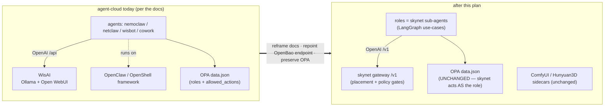
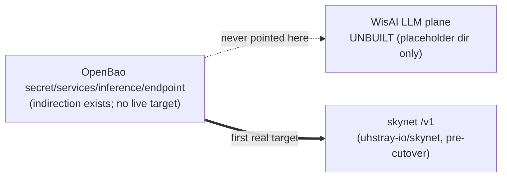
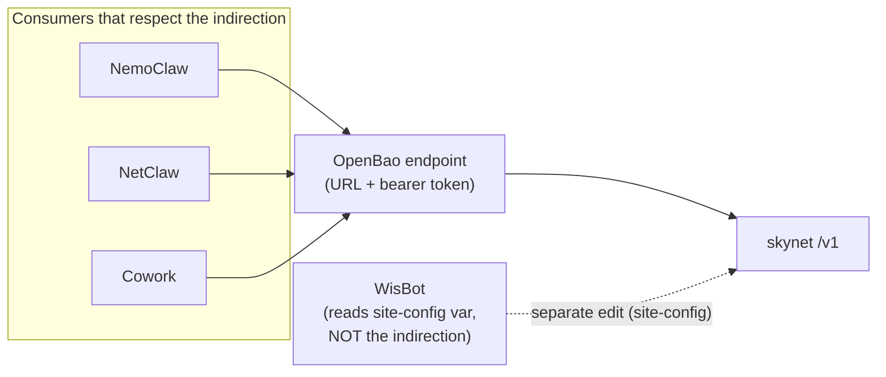
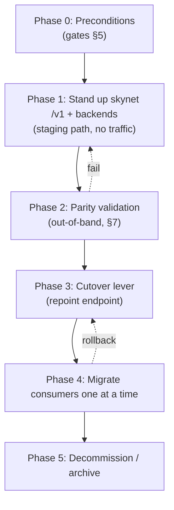
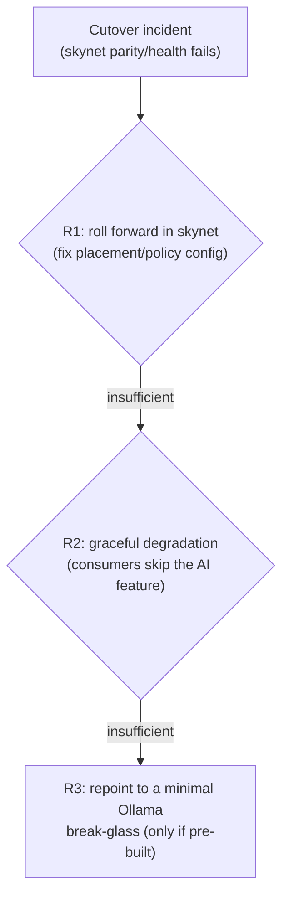
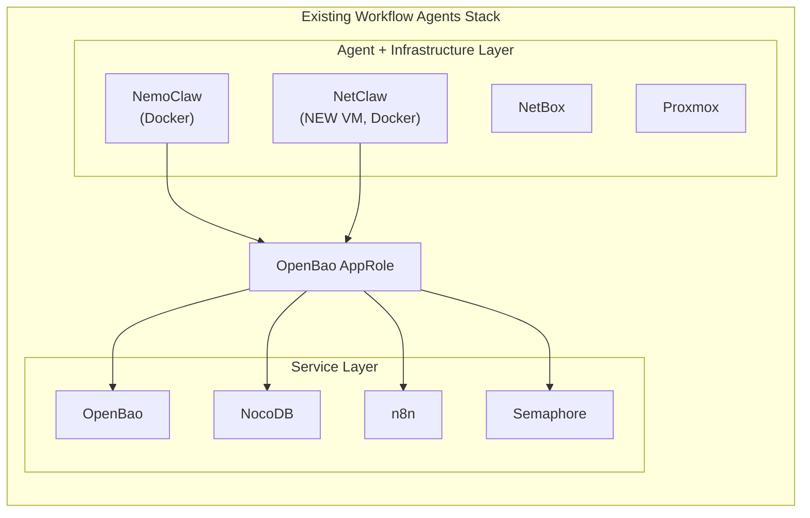
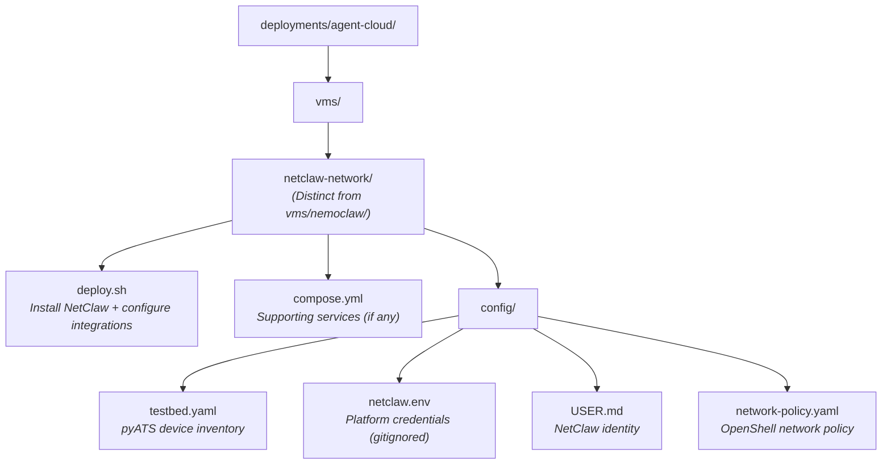
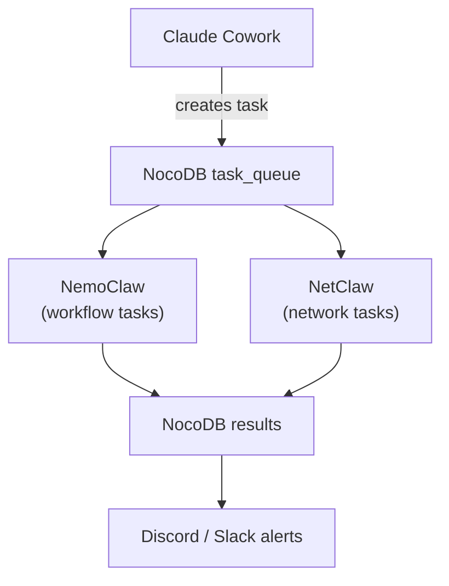

# 06 — Inference Plane & Agents (skynet supersedes WisAI + NemoClaw)
> **Consolidates:** SKYNET-REPLACEMENT-PLAN.md, WISAI-TO-SKYNET-MIGRATION-PLAN.md, NETCLAW-INTEGRATION-PLAN.md (originals archived in `plan/archive/`)
>
> **Depends on:** 00, 01, 03
>
> Part of the dependency-ordered `plan/development/` set (00–10). The source
> plans are merged verbatim below under provenance dividers to preserve all
> detail; read in numbered order to execute.

> **skynet reframe (read first):** skynet (the local-first, OPA-gated `/v1` inference
> plane + LangGraph agent platform) **supersedes** WisAI's LLM plane (Ollama + Open
> WebUI — which was documented but never built) **and** the NemoClaw/OpenClaw agent
> framework. PRESERVED: the OPA role catalog (`nemoclaw`/`netclaw` identities), the
> ComfyUI/Hunyuan3D non-LLM sidecars, and the OpenBao `secret/services/inference/endpoint`
> cutover lever. **Not yet shipped:** the agent *runtime* reframe (gated on the netclaw↔
> Semaphore 'N3' decision) — only the doc/catalog pointers are updated. The sections
> below are the source plans verbatim; where they describe NemoClaw/OpenClaw as the live
> runtime, read that as the pre-skynet state being migrated away from.


<!-- ======================= source: SKYNET-REPLACEMENT-PLAN.md ======================= -->

# Plan — align agent-cloud docs with the skynet replacement + harvest its use-cases

> **Origin / provenance.** Authored in the **skynet** repo
> (`github.com/uhstray-io/skynet`, `docs/agent-cloud-doc-migration-plan.md`) and raised here
> per CONTRIBUTING (plans live in `plan/development/`). This is skynet's *recommendation* for
> realigning agent-cloud's docs; cross-references below to skynet docs — `DESIGN-DECISIONS.md`
> (Qn/§n), `use-case-catalog.yaml`, `agent-cloud-requirements.md` — live in the skynet repo.
> The `[n]` references point to **agent-cloud's own** files.

**Premises (given):** skynet replaces agent-cloud's **AI inferencing/backend** (WisAI's
LLM plane) and replaces the **NemoClaw/OpenClaw** agent framework.

**Boundary discipline.** skynet authored this as a *recommendation*; the edits land as
agent-cloud PRs (skynet doesn't edit agent-cloud unilaterally). It is the doc-alignment
counterpart to the skynet repo's `agent-cloud-requirements.md` (which tracks *capabilities*
skynet needs). Decisions referenced: skynet `DESIGN-DECISIONS.md` Q5 (WisAI replacement), Q3
(sub-agent OPA identity), §14/§15.

The two things that must NOT get lost in the reframe:
- **What persists:** the OPA role catalog (`data.json` nemoclaw/netclaw) + `agent_actions.rego`
  — the *authorization contract*. skynet acts **as** these roles (least-privilege, Q3).
- **What stays separate:** the non-LLM inference sidecars (ComfyUI image-gen, Hunyuan3D
  3D-gen, vLLM-reserved) — out of skynet's LLM-gateway scope; skynet may route to them as
  modality backends later, but they are NOT replaced.

---

## The shift this plan documents

Today agent-cloud's docs describe WisAI as the inference plane and OpenClaw as the
agent framework, with each agent a client of WisAI. After this plan, skynet's `/v1`
is the inference backbone and the agents are skynet sub-agent *roles*; the OPA
authorization contract is untouched.



## Decision criteria

Three choices drive the plan; the rejected options are recorded so the path isn't read
later as an assumption.

- **WisAI's LLM plane — replace, keep, or dual-run?** *Chosen: replace.* skynet's `/v1`
  adds placement scheduling + policy gates that Open WebUI structurally lacks, and keeps
  data on-box; one inference plane is simpler to operate; there's no cutover pressure
  because WisAI's *platform integration* is unbuilt [1][2]. This **reverses** agent-cloud's
  explicit "no separate inference gateway" decision [1:32]. *Rejected:* keeping WisAI
  (loses policy + placement); dual-run behind a selector (two planes to maintain, no
  durable benefit).
- **NemoClaw/OpenClaw — one super-identity, per-role identities, or keep OpenClaw?**
  *Chosen: skynet replaces the framework, keeps the per-role OPA identities* (skynet acts
  *as* `netclaw`/`nemoclaw`). It reuses agent-cloud's existing `data.json` catalog [4] and
  preserves least-privilege. *Rejected:* one `skynet` super-identity (needs the union of
  all roles' permissions — a least-privilege regression, Q3); keeping OpenClaw/OpenShell
  (fails the "replace NemoClaw/OpenClaw" premise).
- **Use-case harvest — wait for agent-cloud's docs, or infer now?** *Chosen: infer now*
  from OPA `allowed_actions` + the agent READMEs, define in skynet's catalog, and have
  agent-cloud's (empty) `context/use-cases/` dirs reference back. The per-agent use-case
  dirs are empty `.gitkeep` stubs [5], so waiting blocks indefinitely; defining-first makes
  skynet's catalog the single source of truth.

## Source context

This plan rests on a repo inventory of agent-cloud (read 2026-06-23). Load-bearing facts:

- The inference backbone is documented as WisAI (Ollama workers + Open WebUI coordinator,
  OpenAI-compatible), with the explicit assumption *"No separate inference gateway is
  planned… agents consume Open WebUI directly"* [1][2], surfaced to agents via README [3]
  and kickstart [6]. The endpoint indirection is `secret/services/inference/endpoint` [2].
- NemoClaw is deployed as an OpenShell + OpenClaw container (Docker, not Podman) [7]; the
  durable authorization contract is the OPA `data.json` role catalog (`nemoclaw`/`netclaw`
  with per-service `allowed_actions`) [4] — the part that persists.
- The per-agent `context/use-cases/` dirs (nemoclaw, netclaw, cowork) are empty stubs;
  WebSmith's context is the one richly-populated set [5].
- Non-LLM inference is separate: ComfyUI image-gen and Hunyuan3D 3D-gen sidecars [3] — out
  of skynet's LLM-gateway scope.

### References (agent-cloud files)

- [1] `plan/development/WISAI-DEPLOYMENT-PLAN.md` (esp. :32 "no separate inference gateway")
- [2] `plan/archive/development/IMPLEMENTATION_PLAN.md:230-246` (WisAI backbone, endpoint secret)
- [3] `README.md:109,129-133` (services table, sidecars)
- [4] `platform/services/opa/deployment/policies/agentcloud/data.json` (role catalog)
- [5] `agents/{nemoclaw,netclaw,cowork}/context/use-cases/` (empty `.gitkeep`); `agents/websmith/context/` (populated)
- [6] `kickstart.md:13,26,414` ("clients of WisAI")
- [7] `agents/nemoclaw/deployment/{README,CLAUDE}.md` (OpenShell + OpenClaw, Docker)

## Part 1 — Reframe WisAI → skynet (the inference backbone)

**The flip:** WisAI's *LLM plane* (Ollama workers + Open WebUI coordinator, the
OpenAI-compatible endpoint behind `secret/services/inference/endpoint`) is replaced by
**skynet's gateway `/v1`**. Agents repoint to skynet's `/v1` — same OpenAI-compatible
protocol, so it's a drop-in *plus* placement scheduling + policy gates that Open WebUI
lacks. **Load-bearing assumption to reverse:** `WISAI-DEPLOYMENT-PLAN.md` line 32 +
`IMPLEMENTATION_PLAN.md` line 238 say *"No separate inference gateway is planned… agents
consume Open WebUI directly."* skynet **is** that gateway now, by design.

| agent-cloud doc | current assumption | recommended change |
|---|---|---|
| `README.md` (109, 129-133) | "WisAI — Local LLM inference backbone (Ollama + Open WebUI)" | "skynet — local-first, policy-gated inference backbone (OpenAI-compatible `/v1`, placement scheduler, policy gates)". Mark `inference-ollama`/`inference-webui` **legacy → superseded by skynet**; keep `inference-comfyui`/`inference-hunyuan3d` (sidecars); note `inference-vllm` may become a skynet backend. |
| `CLAUDE.md` (19, 72-73) | "Backed by: WisAI — Ollama + Open WebUI" | "Backed by: skynet — OpenAI-compatible `/v1`, multi-backend placement, policy-gated." |
| `kickstart.md` (13, 26, 414) | "All four agents are clients of WisAI" | "clients of **skynet's `/v1`**." |
| `plan/development/WISAI-DEPLOYMENT-PLAN.md` | the whole WisAI deploy plan | **Archive** to `plan/archive/` with a superseded banner pointing at skynet. Preserve the Ollama-vs-vLLM hardware reasoning as provenance (still useful) — skynet now owns that placement decision. |
| `plan/archive/development/IMPLEMENTATION_PLAN.md` (82, 151, 230-246) | WisAI backbone + "No separate inference gateway" + per-agent WisAI bindings | Repoint the inference-backbone section + the NemoClaw/NetClaw/WisBot/Cowork bindings to skynet `/v1`. **Reverse** the "no separate gateway" decision (skynet is the gateway *because* it adds placement + policy). |
| OpenBao `secret/services/inference/endpoint` | WisAI URL + token | Repoint value to skynet's `/v1` URL + bearer token. **Keep the OpenBao indirection** (one swap, all consumers follow). This is the actual cutover lever. |

**Stays untouched:** `inference-comfyui/CLAUDE.md`, `inference-hunyuan3d/CLAUDE.md` (non-LLM).

## Part 2 — Reframe NemoClaw/OpenClaw → skynet sub-agent roles

**The flip:** skynet replaces the **OpenClaw/OpenShell framework** (the harness + sandbox +
Docker deployment). The **roles** (`nemoclaw`, `netclaw`) persist as **OPA identities +
LangGraph use-case sets** that skynet runs. The `data.json` catalog is the durable contract,
unchanged; skynet queries OPA *as* the role (Q3).

| agent-cloud doc | current assumption | recommended change |
|---|---|---|
| `agents/nemoclaw/deployment/{README,CLAUDE}.md` | "OpenShell + OpenClaw; Docker not Podman; fork is source" | Reframe: nemoclaw is a **skynet sub-agent role** (an OPA identity + its catalog use-cases), not an OpenShell/OpenClaw container. **Archive** the OpenShell/OpenClaw/Docker deployment specifics (provenance). |
| `plan/development/06-inference-skynet.md` | "NetClaw built on OpenClaw, sibling of NemoClaw; deploy as standalone OpenClaw VM (Option A)" | Reframe: netclaw is a skynet sub-agent role; the OpenClaw harness is replaced by skynet's orchestrator. Supersede "Option A (separate OpenClaw VM)." |
| `README.md` (12, 88-89) + `CLAUDE.md` (18, 68) | agent list "NemoClaw (headless), NetClaw (network), WisBot, Cowork" | NemoClaw/NetClaw → **skynet sub-agent roles** (skynet is the runtime; roles are policy identities + use-case sets). Clarify **WisBot** (Discord, external image) and **Cowork** (on user's device) are **consumers of skynet `/v1`**, not OpenClaw agents. |
| `platform/services/opa/.../data.json` + `agent_actions.rego` | role catalog + policy | **PRESERVE.** Add one line that skynet is now the runtime acting as these roles. This is the persistence point. |

## Part 3 — Harvest agent-cloud use-cases → skynet's catalog (define-first)

Most `agents/*/context/use-cases/` dirs are **empty `.gitkeep` stubs** — the real workload
definitions live in the agent READMEs + the OPA `allowed_actions`. So the harvest is
*infer-from-(OPA + README)*, then define as skynet catalog entries. Bidirectional close-out:
agent-cloud's empty `context/use-cases/` dirs then **reference skynet's catalog** as the one
source of truth.

Per harvested use-case, extract: `id · consumer · caller(role) · capability · io_contract ·
output_consumer · privacy · OPA {agent,service,action} · category(A/B/C/D)`.

| source (agent-cloud) | workload → candidate skynet use-case | category | OPA {agent,service,action} | catalog status |
|---|---|---|---|---|
| `agents/netclaw` (OPA + README) | netbox device add | A | netclaw/netbox/create | **done** (build #1) |
| `agents/netclaw` | config backup, topology discovery, SNMP/nmap health, pfSense read | A/B | netclaw/{netbox,snmp,nmap,pfsense}/… | seed `netclaw-network-reasoning` exists; expand |
| `agents/nemoclaw` (OPA + README) | deploy approved service | A | (semaphore run_task) | **done** (build #2 in catalog) |
| `agents/nemoclaw` | GitHub issue triage/CI-CD, n8n workflow trigger, NocoDB task queue | A/B | nemoclaw/{github,n8n,nocodb}/… | **harvest** → new catalog entries |
| `agents/websmith/context` (rich: 5-phase + catalogs) | website spec authoring | C | (none — human_chat) | seed `websmith-spec` exists; enrich with phases |
| `agents/cowork` (stub + README) | research / architecture / doc-gen | C | (none) | seed `cowork-architecture` exists |
| `agents/wisbot` | Discord LLM chat | C | (consumer of /v1) | consumer, not a role — note only |
| `inference-comfyui`, `inference-hunyuan3d` | image / 3D gen | — | — | **NOT harvested** (non-LLM; future modality backends) |

## Part 4 — Execution & sequencing

1. **skynet-side (now):** finalize this harvest table → draft the new catalog entries
   (define-first). Pure skynet work; no agent-cloud dependency.
2. **agent-cloud PRs (framing first):** `README.md` / `CLAUDE.md` / `kickstart.md` headline
   reframe (WisAI→skynet, NemoClaw/OpenClaw→roles) → then the plan docs (archive
   `WISAI-DEPLOYMENT-PLAN.md`, reframe `IMPLEMENTATION_PLAN.md` inference section +
   `NETCLAW-INTEGRATION-PLAN.md`). **Preserve** the OPA files.
3. **Cutover (coordinated):** repoint `secret/services/inference/endpoint` to skynet `/v1`;
   migrate consumers one at a time (Q5, no parallel-run fallback). Gated on skynet's model
   ladders being filled (skynet Phase 5) and on the netclaw↔Semaphore decision (skynet
   `agent-cloud-requirements.md` N3).

## Target outcome

When this plan has landed (across agent-cloud PRs + skynet catalog entries):

- agent-cloud's docs name **skynet** as the inference backbone; `secret/services/inference/endpoint`
  resolves to skynet's `/v1`, so every agent reaches inference through one policy-gated,
  placement-scheduled surface. The "no separate inference gateway" assumption is gone.
- `nemoclaw`/`netclaw` are documented as **skynet sub-agent roles** — skynet is the runtime,
  the OPA `data.json` catalog is unchanged, and skynet queries OPA *as* the role
  (least-privilege). The OpenClaw/OpenShell deployment docs are archived as provenance.
- skynet's `use-case-catalog.yaml` is the **single source of truth** for AI workloads;
  agent-cloud's previously-empty per-agent `context/use-cases/` dirs reference it.
- The non-LLM sidecars (ComfyUI, Hunyuan3D) and the OpenBao endpoint-indirection pattern are
  untouched; WisBot and Cowork are documented as *consumers* of `/v1`, not sub-agents.

The net: a reader landing in agent-cloud sees one inference plane (skynet), a stable OPA
authorization contract, and a clear pointer to skynet's catalog for "what the agents do" —
with no lingering WisAI/OpenClaw assumptions to mislead them.

## Risks / open questions

- Role-as-identity persistence depends on the **netclaw↔Semaphore** decision (skynet
  `agent-cloud-requirements.md` N3, A vs B) — resolve before the nemoclaw/netclaw reframe ships.
- Empty `context/use-cases/` dirs mean the harvest is **inferred** — validate each with
  agent-cloud owners before treating it as canonical.
- **Don't over-reframe:** WisBot + Cowork are *consumers*, not sub-agent roles; the inference
  sidecars are *not* replaced.
- Prod telemetry: skynet's GenAI telemetry has no agent-cloud ingest yet (agent-cloud's Alloy
  has no OTLP receiver enabled + no Tempo) — unrelated to this doc work, but don't let the
  reframe imply skynet telemetry lands in agent-cloud today.

<!-- ======================= source: WISAI-TO-SKYNET-MIGRATION-PLAN.md ======================= -->

# WisAI → skynet Feature Migration Plan

**Date:** 2026-06-23 · **Status:** PLANNING
**Scope:** Replace WisAI's **LLM plane** with **skynet's** OpenAI-compatible `/v1` gateway across agent-cloud — the *operational* counterpart to the doc reframe.

> **Companion docs.** `plan/development/06-inference-skynet.md` renames things and harvests use-cases (the *what*); this plan owns the *operational swap* (prove parity → flip one OpenBao value → migrate consumers → decommission). `plan/development/WISAI-DEPLOYMENT-PLAN.md` is **SUPERSEDED** — provenance for the model-ladder/hardware reasoning skynet's scheduler now owns. Source of capability gates: skynet `docs/agent-cloud-requirements.md` (X1/X2/N1–N3/D1).

---

## The reality that reshapes this migration

A repo inventory (2026-06-23) establishes the load-bearing fact: **the WisAI plane was documented but never built.** `platform/services/inference-ollama/`, `inference-webui/`, and `inference-vllm/` **do not exist on disk** — only the bare `platform/services/inference/` placeholder, plus the two non-LLM sidecars (`inference-comfyui/`, `inference-hunyuan3d/`). No WisAI Semaphore templates, no `secret/services/inference-webui`, and `secret/services/inference/endpoint` has never resolved to a live WisAI URL.



**Consequences:**
- This is a **green-field stand-up** of skynet as the first real inference plane — not a hot-swap of a running one. "Decommission legacy" is mostly *reference cleanup*, not service teardown.
- "Rollback to WisAI" is largely a **roll-forward** story: there is no incumbent to fall back to (see §6).
- The point of no return is unusually early because there is no incumbent consuming resources.

## Goal + scope

**Goal.** Replace WisAI's LLM plane (Ollama workers + Open WebUI coordinator, the OpenAI-compatible endpoint behind `secret/services/inference/endpoint`) with **skynet's `/v1` gateway** — which sits *in front of* local model backends and adds multi-backend **placement scheduling** + pre-inference **policy gates** that Open WebUI structurally lacks. skynet is not itself Ollama/Open WebUI; it lives in the private `uhstray-io/skynet` repo.

**In scope:** every consumer of `secret/services/inference/endpoint` — NemoClaw, NetClaw, WisBot, Cowork (`IMPLEMENTATION_PLAN.md:165-168`), plus ERPNext Plane-A AI features.

**Explicitly preserved (not touched by this migration):**
- **Non-LLM sidecars** `inference-comfyui` / `inference-hunyuan3d` (separate OpenBao paths; skynet may route to them later — separate plan).
- **The OPA authorization contract** — `policies/agentcloud/data.json` + `agent_actions.rego`. skynet acts *as* the `nemoclaw`/`netclaw` roles (least-privilege, Q3). The cutover changes **zero** bytes of `data.json`. The only OPA change is additive and tracked as skynet **X1** (register `catalog.skynet`) — not part of this migration.
- **The OpenBao endpoint-indirection pattern** — `secret/services/inference/endpoint` stays; only its *value* changes (§4).

## 2. Feature-parity matrix

WisAI capability (FROM, per `WISAI-DEPLOYMENT-PLAN.md`) → skynet equivalent (TO) → verdict. **ADD** = new skynet capability; **DROP/RE-HOME** = WisAI capability with no skynet equivalent.

| # | WisAI capability | skynet equivalent | Verdict |
|---|---|---|---|
| 1 | OpenAI-compatible endpoint (`/api/chat/completions`) | skynet `/v1` (chat, completions, embeddings, `/v1/models`) | **PARITY** — drop-in at the wire |
| 2 | Model serving (Ollama GGUF on GPU VMs) | skynet routes to local model backends (engine can stay Ollama) | **PARITY (re-homed)** — backends are skynet-internal, not agent-visible |
| 3 | Multi-node GPU scaling (`OLLAMA_BASE_URLS` from inventory) | skynet backend registry / placement | **PARITY + ADD** — scheduling, not just fan-out |
| 4 | Coordinator / fan-out (Open WebUI) | skynet gateway *is* the coordinator | **PARITY + ADD** — fan-out subsumed by placement |
| 5 | Model profiles / ladders (`profiles.yml` small/med/large) | skynet model ladders (**gated**: skynet Phase 5) | **PARITY (owner moves)** — unprovable until ladders filled |
| 6 | — (no placement) | skynet placement scheduler | **ADD** — why "no separate gateway" is reversed |
| 7 | — (no policy layer) | skynet pre-inference policy gates (OPA *as* role) | **ADD** — depends on X1; does not modify `data.json` |
| 8 | **Human chat WebUI** (Open WebUI browser UI + admin + history) | **NONE** (skynet is headless) | **DROP / RE-HOME** — the one true feature loss (§2.1) |
| 9 | WebUI credential set (session key, admin creds, Postgres pw) | gone (no WebUI) + shared endpoint URL+token | **CHANGES** — WebUI-specific secrets disappear |
| 10 | Endpoint indirection (`secret/services/inference/endpoint`) | identical pattern, repointed value | **PARITY (preserved)** — the cutover lever (§4) |
| 11 | 4-phase Semaphore deploy, idempotent | skynet via Semaphore templates (skynet repo); needs **D1** backend templates | **PARITY (constraint held)** — Semaphore-only |
| 12 | GPU plumbing (`install-nvidia-toolkit.yml`, `verify-gpu.yml`) | reused by skynet's backends | **PARITY (reused)** |
| 13 | Embeddings (`nomic-embed-text`) | skynet `/v1/embeddings` | **PARITY** — easy to miss; explicit test (§7-E) |
| 14 | DCGM GPU observability | skynet GenAI telemetry (tokens/TTFT/cost) | **PARITY + ADD, blocked ingest** — see **X2** (§7) |
| 15 | Conversation-history PII (WebUI Postgres, DR target) | NONE in agent-cloud | **DROP** — removes a PII/DR liability |

### 2.1 The one real feature loss — the human chat UI (#8)

skynet is a headless `/v1` gateway with no browser chat UI or conversation store. **Decision: drop it.** WisBot (Discord) is the standing human LLM surface and is a *consumer* of `/v1`, not a sub-agent; Cowork (on-device) is the other human-in-the-loop surface. *Rejected:* reinstating Open WebUI pointed at skynet (re-introduces the DMZ VM + PII Postgres + admin-credential lifecycle — reverses the simplification; parked as a documented fallback only). **Validation implication:** parity testing must *not* treat "human can open a browser chat" as a required criterion — track its retirement so a future reviewer doesn't read its absence as a regression.

## 3. The cutover lever

**One OpenBao value: `secret/services/inference/endpoint` (URL + bearer token).**



- **Stays:** the indirection pattern — consumers resolve the endpoint from OpenBao at render time, never hardcode it.
- **Changes:** only the value (Open WebUI `:3000/api/...` → skynet `/v1`; new bearer token).
- **Atomicity:** one Semaphore-driven write (Phase 3) changes the source of truth for all indirection-respecting consumers; it *materializes* per consumer at next env-render (Phase 4), which is why migration is staged and isolatable. Rollback is one reverse write.
- **⚠️ The exception that breaks the abstraction:** **WisBot** reads `OLLAMA_ENDPOINT` from site-config inventory (`wisbot_ollama_endpoint`), *not* OpenBao (`agents/wisbot/deployment/.env.example:12`, `templates/wisbot.env.j2:6`, README/CLAUDE). The lever does **not** move WisBot — it needs an explicit site-config + template edit. Without this, an operator flips the lever, sees three consumers move, and silently leaves WisBot on a dead URL.

## 4. Phased migration

Five phases; each foundational, idempotent, Semaphore-driven. Nothing flips until Phase 3, so Phases 1–2 are reversible at zero consumer cost.



- **Phase 0 — Preconditions.** All §5 gates green (or explicitly waived with owner sign-off).
- **Phase 1 — Stand up skynet `/v1` + backends (no prod traffic).** Deploy skynet + backends via skynet's Semaphore templates; store skynet's URL+token at a **staging** OpenBao path (`endpoint-skynet`), leaving the live `endpoint` un-pulled. Exit: `/v1` answers on staging; `GET /v1/models` lists the ladder; backends healthy.
- **Phase 2 — Parity validation (out-of-band).** Run the §7 suite against staging. Exit: every check passes + sign-off (human-chat-UI criterion excluded). Fail → loop to Phase 1; consumers untouched.
- **Phase 3 — Cutover lever (atomic repoint).** Via a Semaphore set-secret template (never manual SSH), write skynet's validated value into the live `secret/services/inference/endpoint` with KV-v2 metadata. **Rehearse the reverse write first** (§6). No consumer redeployed yet.
- **Phase 4 — Migrate consumers one at a time (Q5: no parallel-run).** Order, lowest blast radius first: **WisBot → Cowork → NemoClaw → NetClaw** (NetClaw gated on N3). Per consumer: re-render env from OpenBao via its Semaphore template; **WisBot is the exception** — edit site-config + `wisbot.env.j2`; then run a real `/v1` round-trip. Verify each before the next.
- **Phase 5 — Decommission / archive.** Physically archive `WISAI-DEPLOYMENT-PLAN.md` → `plan/archive/` (provenance preserved). "Legacy dirs" = ensure docs don't imply live dirs (they were never built). Sweep residual refs (`wisbot` env/docs say "WisAI/Ollama"; reword to skynet). Decommission any WisAI-era OpenBao secrets *if seeded* (verified absent → likely no-op).

## 5. Dependency / decision gates

Each gate must be all-true before the phase it guards. Evaluated at PR/cutover review; machine-checkable items named.

- **Gate 0 — Doc reframe merged** (guards all): README/CLAUDE/kickstart/IMPLEMENTATION_PLAN name skynet; "no separate gateway" reversed; OPA preserved (`git diff data.json` empty).
- **Gate N3 — netclaw↔Semaphore decided** (guards NetClaw migration + build #1): record **A** (thin agent-cloud capability fronts Semaphore; skynet's gate stays on the logical `(netclaw, netbox, create)`; **recommended**, skynet is built against A) vs **B** (delegate `run_task` to the `nemoclaw` role; second OPA query, no catalog widening). Reject the netclaw-catalog-widening variant. Satisfy **X1** (skynet roles in `data.json`) or traffic is default-denied.
- **Gate LADDER — skynet model ladders filled** (guards Phase 2): every model a consumer requests resolves to a skynet placement target; **embeddings explicit** (`nomic-embed-text`); WisBot's `OLLAMA_DEFAULT_MODEL=llama3` resolves or is updated.
- **Gate X2 — prod telemetry ingest** (guards Phase 2; see §7): agent-cloud Alloy enables `otelcol.receiver.otlp` + a trace store (Tempo), and o11y is deployed in **prod** — or an explicit interim measurement plan is accepted.
- **Gate CUTOVER** (guards Phase 3): Gates 0/N3/LADDER/X2 green; **D1** backend Semaphore templates exist; rollback rehearsed; privacy posture re-verified (§6).
- **Gate PNR — point of no return** (guards Phase 5 teardown): full parity-soak window with no P1 incident; per-consumer health confirmed (not inferred); no consumer references a WisAI/Ollama URL directly.

## 6. Rollback — stress-tested

**There is no deployed WisAI to roll back to**, so the OpenBao indirection is a genuine roll-*forward* lever and only a *theoretical* roll-*back* one. Recovery, in preference order:



- **R1 (primary):** most failures (backend down, policy gate over-blocking) are fixed *in skynet config* — because skynet *is* a gateway. This is the real standing recovery mode.
- **R2:** inference is non-load-bearing for the system of record — per ERPNext's principle "LLMs narrate, ERPNext computes," an inference outage degrades narration/drafting, it does not corrupt data. Confirm every consumer treats a `/v1` 5xx as "skip the AI feature," not "crash."
- **R3 (escape hatch — exists only if deliberately built):** keep the legacy compose/profile material *archived but resurrectable* for one parity-soak window (proposal: skynet served all consumers in prod 2 weeks, no P1, X2 healthy). **Decision required:** build R3 break-glass, or commit to R1+R2 only? Q5's "no parallel-run" defaults to **no R3** — but then R1/R2 sufficiency must be demonstrated at Gate CUTOVER.

## 7. Blast radius, validation & the X2 gap

**Consumers and failure modes at incomplete parity:**

| Consumer | Consumes via | Failure mode if parity incomplete |
|---|---|---|
| NemoClaw (role) | `/v1` reasoning | proposal loop errors; no state mutation (also gated on N3/D1) |
| NetClaw (role) | `/v1` reasoning | build #1 blocked until N1/N2/N3 |
| WisBot (*consumer*) | `OLLAMA_ENDPOINT` → must move to `/v1` | `/wisllm` fails if `llama3` unresolved |
| Cowork (*consumer*) | `/v1` | degrades to no-AI; local, low blast radius |
| ERPNext Plane A | OpenAI-compat over LAN | Plane-A backlog *waits* (it "floats"); ERPNext core unaffected |

**Privacy invariant (hard):** skynet **IS** ERPNext Plane A. A placement misconfig routing PII/GL/bank data off-box would breach the platform's hardest guarantee. **Gate CUTOVER must assert skynet's Plane-A placement is on-box-only.** WisBot + Cowork are *consumers*, not roles — a cutover script must not mis-gate them as OPA roles; the non-LLM sidecars are out of scope (distinct OpenBao paths).

**The X2 measurement gap:** `platform/services/o11y/.../config.alloy` ships only Loki log shipping — `otelcol.receiver.otlp` is deliberately omitted, Tempo is deferred, and o11y itself is PROPOSED/local-only. So at a naive cutover there is **no way to measure parity/health in prod**. Resolution, ordered: (1) enable OTLP receiver + deploy o11y to prod + Tempo (what X2 asks); (2) **accepted interim** if (1) can't land: skynet's gateway HTTP `/metrics` + skynet's *local* o11y stack + a Semaphore-scheduled **synthetic probe** (`validate-skynet.yml`: canned `/v1` prompt per consumer model → assert 200 + non-empty + latency budget → Discord alert). Do not let the reframe imply skynet telemetry lands in agent-cloud today.

**Parity suite (run against staging before the lever, re-run per consumer after):** chat (stream + non-stream), `/v1/completions` if used, `/v1/models` lists the ladder, **`/v1/embeddings`**, OpenAI error-shape parity, bearer-token auth (accept valid / reject invalid), placement across backends, policy-gate default-deny when X1 absent, backend-down degrades-not-fails, endpoint KV metadata present, per-consumer round-trip (incl. WisBot via its site-config path), **`git diff` proves `data.json` + sidecars untouched**, and a grep proving no live WisAI refs remain.

## 8. Risks / open questions

1. **No real WisAI to roll back to** — backward rollback (R3) exists only if a break-glass Ollama node is built + kept warm. Decide R3 vs R1+R2-only before Gate CUTOVER.
2. **X2 telemetry gap vs no-parallel-run** — cutting over blind is the central risk; if o11y-prod can't land first, the synthetic-probe interim must be accepted *in writing*.
3. **N3 is a single blocker for build #1** — netclaw can't `run_task`; N1/N2/N3 ship together; the nemoclaw/netclaw reframe (and NetClaw migration) must wait on A-vs-B.
4. **Embeddings & model-name parity** — a chat-only gateway is not parity; validate against real consumer configs (`llama3`, `nomic-embed-text`), not assumptions.
5. **Plane-A privacy invariant** — assert on-box-only placement for Plane-A traffic at cutover.
6. **D1 templates don't exist** — Semaphore "Deploy `<backend>`" templates for skynet's backends are unbuilt; Semaphore-only execution can't deploy backends without them.
7. **Inferred consumer list** — empty `context/use-cases/` stubs mean §7's consumer inventory is partly inferred; validate with owners before treating as canonical.
8. **Don't over-reframe consumers** — WisBot + Cowork are consumers, not sub-agent roles; sidecars are not replaced.

<!-- ======================= source: NETCLAW-INTEGRATION-PLAN.md ======================= -->

# NetClaw Integration Plan — Network Management & Automation

**Date:** 2026-03-29
**Status:** Proposed
**Context:** Workflow Agents project — Phase 1 enhancement

---

## 1. What Is NetClaw

NetClaw is an open-source, CCIE-level AI network engineering agent built on OpenClaw (the same agent harness that NemoClaw wraps). It provides 101+ skills and 46 MCP server backends for autonomous network monitoring, troubleshooting, configuration, and security auditing — all driven by natural language through Slack, WebEx, or web chat.

**Key capabilities relevant to this uhstray.io datacenter:**

- **Device health monitoring** — CPU, memory, interfaces, NTP, logs — fleet-wide in parallel via pyATS
- **NetBox integration** — DCIM/IPAM source-of-truth reconciliation (read-write), topology discovery, IP drift detection
- **GitHub config-as-code** — commit config backups, create issues from findings, open PRs for changes
- **Packet capture analysis** — deep tshark analysis of pcap files uploaded via Slack
- **Network scanning** — nmap host discovery, port scanning, OS fingerprinting (scope-enforced)
- **Topology discovery** — CDP/LLDP, ARP, routing peers with reconciliation against NetBox
- **UML/diagram generation** — 27+ diagram types via Kroki (network topology, rack layouts, packet headers)
- **Grafana/Prometheus observability** — dashboards, PromQL, Loki logs, alerting, incidents
- **Live BGP/OSPF participation** — control-plane peering, route injection/withdrawal, RIB/LSDB queries
- **ContainerLab** — deploy containerized network labs (SR Linux, cEOS, FRR, etc.)
- **ITSM-gated change management** — ServiceNow CR gating for write operations
- **Immutable audit trail (GAIT)** — every agent action logged with reasoning and outcomes

**Critical relationship:** NetClaw runs on OpenClaw, and NemoClaw is NVIDIA's security wrapper around OpenClaw. They are sibling projects sharing the same agent harness. This means NetClaw's skills and MCP servers can potentially be loaded into the existing NemoClaw sandbox, or NetClaw can run as a separate OpenClaw instance alongside NemoClaw.

---

## 2. Why NetClaw for This Project

The uhstray.io datacenter has specific network management gaps that NetClaw addresses directly:

| Current Gap | NetClaw Solution |
|---|---|
| No network device monitoring (pfSense, switches) | pyATS + health monitoring skills for fleet-wide parallel checks |
| NetBox deployed but not populated with live state | NetBox MCP reconciles live device state against DCIM/IPAM |
| Proxmox monitoring is API-only (no L2/L3 visibility) | Network scanning, topology discovery, ARP/CDP/LLDP mapping |
| No pcap analysis capability | Packet Buddy MCP for deep tshark analysis |
| No network topology visualization | Kroki UML diagrams (nwdiag, rackdiag) + draw.io topology maps |
| Config backup is manual | GitHub MCP for automated config-as-code backups |
| No network change management | ITSM gating + GAIT audit trail |
| No BGP/OSPF visibility (if applicable) | Protocol MCP for live control-plane participation |

---

## 3. Integration Architecture — Two Options

### Option A: Separate VM (Recommended)

Deploy NetClaw on its own VM as a standalone OpenClaw agent, communicating with the existing service layer through the same APIs NemoClaw uses.



**Pros:** Independent failure domain, dedicated resources for MCP servers (some are memory-hungry), can run different OpenClaw versions, separate network policy (NetClaw needs broader network access than NemoClaw for device polling).

**Cons:** Additional VM to manage, duplicated OpenClaw runtime.

### Option B: Skills Injection into NemoClaw

Load NetClaw's skills and selected MCP servers into the existing NemoClaw sandbox by adding them to the agent-cloud network policy and copying skill files.

**Pros:** No additional VM, single agent manages both workflow automation and network engineering.

**Cons:** NemoClaw's sandbox policy would need significantly broader network access (every managed device), mixing concerns (workflow automation + network engineering), harder to troubleshoot, skill conflicts possible.

### Recommendation: Option A

NetClaw needs direct network access to managed devices (pfSense at .1/.2, physical servers, switches). This is fundamentally different from NemoClaw's API-only access pattern. A separate VM with its own network policy keeps the security model clean. NemoClaw stays scoped to service APIs; NetClaw gets scoped to network infrastructure.

---

## 4. VM Provisioning

### New VM Specification

| Attribute | Value | Rationale |
|---|---|---|
| VM Name | `netclaw` | Matches naming convention |
| VMID | 265 | In the 200-299 provisioning range |
| IP | {{ netclaw_host }} | Next available after openbao (.164) |
| Cores | 4 | MCP servers run in parallel; pyATS is CPU-intensive |
| Memory | 8192 MB | Multiple MCP servers + Python environments + tshark |
| Disk | 60 GB | pcap storage, config backups, ContainerLab images |
| Runtime | Docker | OpenClaw/OpenShell requires Docker (same as NemoClaw) |
| Proxmox Node | {{ proxmox_node }} | Primary VM host |

### Provisioning via Existing Playbooks

```bash
# Clone template → configure → start (uses existing provision-vm.yml)
ansible-playbook -i semaphore/inventory/local.yml \
  semaphore/playbooks/provision-vm.yml \
  -e target_service=netclaw

# Or via Semaphore task template: "Provision NetClaw VM"
```

Add to `proxmox/vm-specs.yml`:

```yaml
netclaw:
  vmid: 265
  name: netclaw
  cores: 4
  memory: 8192
  disk: 60G
  ip: {{ netclaw_host }}
  node: {{ proxmox_node }}
  runtime: docker
```

---

## 5. Deployment Architecture

### Directory Structure



### deploy.sh Pattern (5-Step)

Following the established pattern from other deploy scripts:

1. **Generate secrets** — Create `netclaw.env` with credentials pulled from OpenBao (NetBox token, GitHub PAT, Discord bot token, Proxmox token)
2. **Install NetClaw** — Clone repo, run `install.sh`, configure OpenClaw with Anthropic API key
3. **Configure integrations** — Generate `testbed.yaml` from NetBox device inventory, set up Slack/Discord channels, configure NetBox MCP connection
4. **Store credentials in OpenBao** — Create `netclaw` AppRole (read-only for all service secrets + NetBox write access)
5. **Validate** — Health check OpenClaw gateway, verify MCP server connectivity, test device reachability

### OpenBao Integration

New AppRole for NetClaw:

```hcl
# netclaw-readwrite.hcl
# NetClaw needs read access to all service secrets (like NemoClaw)
# Plus write access to NetBox for source-of-truth reconciliation

path "secret/data/services/*" {
  capabilities = ["read"]
}

path "secret/metadata/services/*" {
  capabilities = ["list", "read"]
}

path "secret/data/services/netbox" {
  capabilities = ["create", "update", "read", "patch"]
}

path "auth/token/renew-self" {
  capabilities = ["update"]
}
```

New secret path for NetClaw-specific credentials:

| Path | Purpose |
|---|---|
| `secret/services/netclaw/anthropic_api_key` | Claude API key for OpenClaw |
| `secret/services/netclaw/gateway_token` | OpenClaw gateway auth token |
| `secret/services/netclaw/slack_bot_token` | Dedicated Slack bot (separate from NemoClaw's Discord bot) |

---

## 6. Network Policy

NetClaw requires significantly broader network access than NemoClaw because it needs to reach managed infrastructure directly.

### OpenShell Network Policy

```yaml
preset:
  name: netclaw-network
  description: "NetClaw — network device access + agent-cloud service layer"

network_policies:
  netclaw-network:
    name: netclaw-network
    endpoints:
      # -- Managed Infrastructure ----------------------------
      # pfSense firewalls (SSH + web UI for config backup)
      - host: {{ pfsense_host }}
        port: 443
        access: full
      - host: {{ pfsense2_host }}
        port: 443
        access: full

      # Physical servers (SSH for pyATS, SNMP for monitoring)
      # Expand this list based on testbed.yaml
      - host: {{ lan_subnet }}
        port: 22
        access: full
      - host: {{ lan_subnet }}
        port: 161
        access: full    # SNMP

      # -- Workflow Agents Service Layer -----------------------
      # NetBox (DCIM/IPAM source of truth — read-write)
      - host: {{ netbox_host }}
        port: 8000
        access: full

      # NocoDB (shared data layer — task_log, monitored_resources)
      - host: {{ nocodb_host }}
        port: 8181
        access: full

      # n8n (workflow triggering — alert webhooks)
      - host: {{ n8n_host }}
        port: 5678
        access: full

      # OpenBao (credential retrieval)
      - host: {{ openbao_host }}
        port: 8200
        access: full

      # -- External APIs --------------------------------------
      # Anthropic API (Claude inference)
      - host: api.anthropic.com
        port: 443
        access: full

      # GitHub (config-as-code, issues)
      - host: api.github.com
        port: 443
        access: full
      - host: github.com
        port: 443
        access: full

      # Discord (alerting)
      - host: discord.com
        port: 443
        access: full
      - host: gateway.discord.gg
        port: 443
        access: full

      # Slack (primary NetClaw interface)
      - host: slack.com
        port: 443
        access: full
      - host: wss-primary.slack.com
        port: 443
        access: full
      - host: files.slack.com
        port: 443
        access: full

    binaries:
      - { path: /usr/local/bin/node }
      - { path: /usr/local/bin/openclaw }
      - { path: /usr/bin/curl }
      - { path: /usr/bin/python3 }
      - { path: /usr/bin/jq }
      - { path: /usr/bin/tshark }
      - { path: /usr/bin/nmap }
```

---

## 7. Integration Points with Existing Services

### 7.1 NetBox (Bidirectional)

NetClaw's NetBox MCP server provides read-write access to NetBox's DCIM/IPAM. This is the highest-value integration.

**Workflow:**
1. NetClaw discovers topology via CDP/LLDP/ARP on uhstray.io datacenter devices
2. Reconciles against NetBox: flags undocumented devices, missing cables, IP drift
3. Updates NetBox with current live state (interfaces, IPs, connections)
4. Generates topology diagrams from NetBox data via Kroki

**Configuration:** NetClaw reads the NetBox URL and token from OpenBao at `secret/services/netbox`. The existing NetBox deployment at {{ netbox_host }} requires no changes — NetClaw uses the standard NetBox REST API.

### 7.2 NocoDB (Write — Task Logging)

NetClaw writes to the same `task_log` and `monitored_resources` tables NemoClaw uses, creating a unified audit trail.

**New table: `network_health`**

| Column | Type | Purpose |
|---|---|---|
| id | Auto | Primary key |
| timestamp | DateTime | Check time |
| device | Text | Device hostname |
| device_ip | Text | Management IP |
| check_type | Text | cpu/memory/interface/bgp/ospf |
| status | Text | ok/warning/critical |
| value | Number | Metric value (CPU %, memory %, etc.) |
| threshold | Number | Alert threshold |
| details | JSON | Full check output |
| source | Text | "netclaw" (distinguishes from NemoClaw entries) |

### 7.3 n8n (Webhook Triggers)

NetClaw findings trigger n8n workflows for alerting and remediation:

- **Network health alert** → n8n webhook → Discord `#network-alerts` channel
- **Config drift detected** → n8n workflow → GitHub issue + Discord notification
- **NetBox reconciliation diff** → n8n workflow → NocoDB entry + daily digest
- **Device unreachable** → n8n webhook → Discord `#agent-alerts` (existing channel)

### 7.4 Discord / Slack

NetClaw's primary interface is Slack (built-in OpenClaw channel), while NemoClaw uses Discord. This natural separation avoids confusion:

| Agent | Primary Channel | Alert Channel |
|---|---|---|
| NemoClaw | Discord `#agent-activity` | Discord `#agent-alerts` |
| NetClaw | Slack `#netclaw-general` | Slack `#netclaw-alerts` / Discord `#network-alerts` |

NetClaw can also post to Discord via its API access for cross-agent visibility.

### 7.5 Semaphore (Playbook Trigger)

NetClaw can trigger Semaphore playbooks for network-related infrastructure tasks:

- **Device config backup** → Semaphore runs Ansible playbook against device inventory
- **Firmware upgrade** → Semaphore orchestrates rolling upgrade across nodes
- **Network troubleshooting** → Semaphore runs diagnostic playbooks

### 7.6 Proxmox (VM Network Monitoring)

NetClaw extends NemoClaw's Proxmox monitoring with L2/L3 network visibility:

- VM network interface health (packet errors, drops)
- VLAN/bridge configuration audit
- Network path tracing between VMs
- Bandwidth utilization monitoring

---

## 8. Device Inventory (testbed.yaml)

The pyATS testbed defines which devices NetClaw can manage. Initial inventory based on the existing lab:

```yaml
# config/testbed.yaml — NetClaw device inventory
# Populated from config/inventory.yml + NetBox

testbed:
  name: {{ ansible_user }}-uhstray.io datacenter

devices:
  pfsense01:
    os: linux            # pfSense is FreeBSD but pyATS treats it as generic
    type: firewall
    connections:
      defaults:
        class: unicon.Unicon
      ssh:
        protocol: ssh
        ip: {{ pfsense_host }}
        port: 22

  pfsense02:
    os: linux
    type: firewall
    connections:
      defaults:
        class: unicon.Unicon
      ssh:
        protocol: ssh
        ip: {{ pfsense2_host }}
        port: 22

  # Physical servers — SSH access for system monitoring
  {{ proxmox_node }}:
    os: linux
    type: server
    connections:
      ssh:
        protocol: ssh
        ip: {{ proxmox_node_ip }}
        port: 22

  # Add more servers as needed from inventory.yml
  # NetClaw can also auto-discover via nmap + ARP
```

**Auto-discovery:** NetClaw's nmap MCP server can scan the {{ lan_subnet }} subnet to discover hosts, then reconcile against NetBox and generate/update the testbed.

---

## 9. Selective MCP Server Deployment

NetClaw ships with 46 MCP integrations. Most target enterprise Cisco/Juniper/Arista gear. For this uhstray.io datacenter, deploy only the relevant subset:

### Deploy (Relevant to uhstray.io datacenter)

| MCP Server | Purpose | Why |
|---|---|---|
| **NetBox** | DCIM/IPAM source of truth | Already deployed at .116 |
| **GitHub** | Config-as-code, issues | Already integrated in agent-cloud |
| **Packet Buddy** | pcap analysis via tshark | Useful for troubleshooting |
| **nmap** | Network scanning + discovery | uhstray.io datacenter device discovery |
| **UML/Kroki** | Diagram generation | Network topology visualization |
| **Protocol MCP** | BGP/OSPF (if lab routers exist) | FRR testbed for learning |
| **ContainerLab** | Containerized network labs | Lab simulation on NemoClaw VM |
| **Prometheus** | Direct PromQL queries | If Prometheus is deployed |
| **Grafana** | Dashboard/alerting | If Grafana is deployed |

### Skip (Not Relevant)

Cisco ACI, Cisco ISE, Cisco NSO, Cisco CML, Cisco Meraki, Cisco SD-WAN, Cisco FMC, Cisco ThousandEyes, Cisco RADKit, Arista CVP, F5 BIG-IP, Catalyst Center, Juniper JunOS, ServiceNow, Microsoft Graph, Nautobot, Infrahub, Itential, Kubeshark, AWS, GCP, Batfish, Palo Alto, FortiManager, Infoblox, SuzieQ.

### Configuration in install.sh

NetClaw's `install.sh` clones all MCP servers. After install, disable unused ones by not providing their credentials in `setup.sh`. NetClaw gracefully skips MCP servers without configured credentials.

---

## 10. Implementation Phases

### Phase A: Foundation (Week 1)

1. **Provision VM** — Clone template → netclaw VM at {{ netclaw_host }}
2. **Install NetClaw** — Clone repo, run `install.sh`, configure Anthropic API key
3. **Create OpenBao AppRole** — `netclaw` role with `netclaw-readwrite` policy
4. **Store Anthropic API key** — In OpenBao at `secret/services/netclaw`
5. **Configure basic integrations** — GitHub (reuse existing PAT), Discord
6. **Verify basic operation** — `openclaw gateway` + `openclaw chat` works

**Acceptance:** NetClaw responds to chat queries, can access GitHub, posts to Discord.

**Validation:** `openclaw chat "show version"` returns response. `bao kv get secret/services/netclaw` returns Anthropic key. SSH to VM works with netclaw service key.
**Smoke test:** Chat query asking for cluster summary. Verify Discord post in #network-alerts channel.
**Security:** Anthropic API key in OpenBao only, not in env files. Docker (not Podman) required for OpenShell sandbox. Network policy restricts to {{ lan_subnet }} — no external device access.

### Phase B: NetBox Integration (Week 2)

1. **Configure NetBox MCP** — Point to existing NetBox at .116, token from OpenBao
2. **Initial device inventory** — Run nmap discovery against {{ lan_subnet }}
3. **Populate NetBox** — Import discovered devices, interfaces, IPs
4. **Set up reconciliation** — Schedule periodic NetBox ↔ live state comparison
5. **Generate topology diagrams** — From NetBox data via Kroki

**Acceptance:** NetBox has accurate representation of uhstray.io datacenter devices. Topology diagram generated.

**Validation:** NetBox UI shows discovered devices with correct IPs/interfaces. Topology diagram renders without errors. Reconciliation diff reports zero unexpected discrepancies.
**Smoke test:** Run nmap scan → verify devices appear in NetBox. Compare NetBox device count to expected count. Generate topology SVG.
**Security:** NetBox API token from OpenBao, scoped to read/write DCIM/IPAM. nmap restricted to {{ lan_subnet }} CIDR. No scanning outside defined ranges.

### Phase C: Monitoring & Alerting (Week 3)

1. **Build testbed.yaml** — From NetBox device inventory
2. **Configure health monitoring** — pyATS health checks for reachable devices
3. **Wire alerting** — NetClaw findings → n8n webhook → Discord `#network-alerts`
4. **NocoDB integration** — Write health data to `network_health` table
5. **n8n scheduled workflow** — Trigger health checks every 15 minutes

**Acceptance:** Health checks run on schedule, alerts fire on failures, data in NocoDB.

**Validation:** `network_health` table in NocoDB has rows with timestamps < 15 minutes old. Discord #network-alerts has at least one test alert. pyATS testbed.yaml matches NetBox device count.
**Smoke test:** Disable a test device's SSH → verify health check fails → verify Discord alert fires within 15 minutes.
**Security:** Device SSH credentials in OpenBao at `secret/services/netclaw`. SNMP community strings in OpenBao. pyATS connects read-only (show commands only). No config modification without ITSM gate.

### Phase D: Advanced Features (Week 4+)

1. **Config backup automation** — Git-backed config backups via GitHub MCP
2. **ContainerLab** — Deploy FRR testbed for BGP/OSPF experimentation
3. **Packet capture** — Upload pcaps via Slack for tshark analysis
4. **Slack integration** — Set up Slack workspace for primary NetClaw interaction
5. **Cross-agent coordination** — NemoClaw creates tasks, NetClaw executes network operations

**Acceptance:** Config backups in GitHub, ContainerLab runs, pcap analysis works.

**Validation:** Config backup commit appears in GitHub repo. ContainerLab topology starts successfully. Pcap upload + tshark analysis returns parsed output.
**Smoke test:** Trigger manual config backup → verify Git commit. Deploy FRR lab → verify BGP session establishes. Upload test pcap → verify analysis output.
**Security:** Config backups in a PRIVATE GitHub repo (contain device configs with potential credentials). Git-backed audit trail (GAIT) is append-only. ContainerLab runs in isolated network namespace. Cross-agent tasks validated: NocoDB task queue checks `source` field to prevent injection.

---

## 11. Cross-Agent Coordination (Phase 3 Enhancement)

NetClaw and NemoClaw can coordinate via NocoDB as the shared task queue:



**Task routing:** A `task_type` field in the NocoDB task queue determines routing:
- `workflow:*` → NemoClaw (GitHub, n8n, Semaphore operations)
- `network:*` → NetClaw (device health, config, topology, pcap)
- `infra:*` → Either (Proxmox monitoring goes to NemoClaw, network path tracing to NetClaw)

---

## 12. Security Considerations

| Concern | Mitigation |
|---|---|
| NetClaw has broad network access | OpenShell policy restricts to {{ lan_subnet }} only; no internet device access |
| Device credentials (SSH keys, SNMP strings) | Stored in OpenBao, injected via AppRole; never in config files |
| Config changes to production devices | Read-only by default; writes require ITSM gate or explicit `LAB_MODE=true` |
| Anthropic API key exposure | Stored in OpenBao at `secret/services/netclaw`, not in env files |
| nmap scanning scope | CIDR scope enforcement built into NetClaw's nmap MCP |
| GAIT audit trail integrity | Append-only log in Git; tamper-evident by design |
| Cross-agent task injection | NocoDB task queue validates `source` field; only registered agents can create tasks |

---

## 13. Resource Estimates

| Resource | Estimate | Notes |
|---|---|---|
| VM cost | 4 cores, 8GB RAM, 60GB disk | Comparable to NemoClaw VM |
| Anthropic API | ~$5-20/month | Depends on monitoring frequency and chat volume |
| Network bandwidth | Minimal | SSH/SNMP polling is lightweight |
| Storage | ~5-10 GB for pcaps + config backups | Prune old pcaps on schedule |

---

## 14. Updated Service Inventory

| VM Name | IP | Services | Port | Runtime |
|---|---|---|---|---|
| `openbao` | `{{ openbao_host }}` | OpenBao | 8200 | Podman |
| `nocodb` | `{{ nocodb_host }}` | NocoDB + Postgres | 8181 | Podman |
| `n8n` | `{{ n8n_host }}` | n8n + Worker + Postgres + Redis | 5678 | Podman |
| `semaphore` | `{{ semaphore_host }}` | Semaphore + Postgres | 3000 | Podman |
| `nemoclaw` | `{{ nemoclaw_host }}` | NemoClaw + OpenShell | — | Docker |
| `netclaw` | `{{ netclaw_host }}` | **NetClaw + OpenClaw + MCP servers** | **18789** | **Docker** |
| `netbox` | `{{ netbox_host }}` | NetBox + Diode Pipeline | 8000 | Podman |

---

## 15. Files to Create/Modify

### New Files

| File | Purpose |
|---|---|
| `vms/netclaw-network/deploy.sh` | 5-step deploy script following established pattern |
| `vms/netclaw-network/config/testbed.yaml` | pyATS device inventory |
| `vms/netclaw-network/config/network-policy.yaml` | OpenShell network policy |
| `vms/netclaw-network/config/USER.md` | NetClaw operator identity |
| `vms/openbao/config/policies/netclaw-readwrite.hcl` | OpenBao policy |
| `proxmox/vm-specs.yml` | Add netclaw entry |
| `semaphore/inventory/production.yml` | Add netclaw host |

### Modified Files

| File | Change |
|---|---|
| `vms/openbao/deploy.sh` | Add `netclaw` AppRole in Step 6 |
| `orchestrate.sh` | Add `netclaw-network` to SERVICES array (after nemoclaw) |
| `nemoclaw/agent-cloud.yaml` | No change — NemoClaw doesn't need to reach NetClaw directly |
| `IMPLEMENTATION_PLAN.md` | Add NetClaw to Phase 1 / Phase 3 sections |
| `CLAUDE.md` | Add NetClaw to Production IPs, container names |
| `README.md` | Add NetClaw to topology table |

---

## 16. Open Questions

1. **Anthropic API key:** Does the project have an existing Anthropic API key for OpenClaw, or does one need to be created? NetClaw uses Claude as its inference provider.

2. **Slack workspace:** Is there an existing Slack workspace for the uhstray.io datacenter? NetClaw's primary interface is Slack (WebSocket-based, first-party OpenClaw channel). Discord works but requires a community plugin.

3. **pfSense SSH access:** Do the pfSense firewalls have SSH enabled? NetClaw needs SSH for device interaction. If not, the REST API (port 443) is an alternative but requires a custom MCP server.

4. **Switch inventory:** Are there managed switches in the uhstray.io datacenter? The inventory shows only servers and VMs. Managed switches would be the highest-value pyATS targets.

5. **Prometheus/Grafana:** Are Prometheus and Grafana deployed in the uhstray.io datacenter? If yes, NetClaw's Grafana MCP (75+ tools) and Prometheus MCP (6 tools) add significant observability value.

6. **Budget for Anthropic API:** NetClaw makes Claude API calls for every interaction and scheduled task. Estimated $5-20/month depending on polling frequency. Is this acceptable?

7. **ContainerLab interest:** The FRR testbed + BGP daemon is a powerful learning tool but requires Docker-in-Docker or privileged containers. Should this be scoped for Phase D or deferred?
