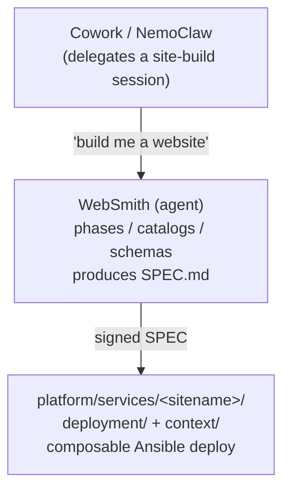

# 07 — WebSmith & UhhCraft
> **Consolidates:** WEBSMITH-INTEGRATION-PLAN.md, UHHCRAFT-GO-LIVE-PLAN.md, UHHCRAFT-GO-LIVE-WALKTHROUGH.md, UHHCRAFT-GPU-PASSTHROUGH.md (originals archived in `plan/archive/`)
>
> **Depends on:** 00, 01, 02
>
> Part of the dependency-ordered `plan/development/` set (00–10). The source
> plans are merged verbatim below under provenance dividers to preserve all
> detail; read in numbered order to execute.


<!-- ======================= source: WEBSMITH-INTEGRATION-PLAN.md ======================= -->

# WebSmith + UhhCraft Integration Plan

**Date:** 2026-05-25
**Status:** ACTIVE (Phases 1–11 committed; Phase 10 smoke pending hardware)
**Context:** Integrate the external `website_framework` repository into agent-cloud as the **WebSmith** agent, and integrate its concrete output (UhhCraft) as a first-class platform service with GPU-backed inference sidecars.

This plan integrates two distinct things from the upstream `website_framework` repository:

1. **The meta-framework** (markdown phase docs, catalogs, schemas, examples) → becomes the **WebSmith** agent at `agents/websmith/`. WebSmith is the agent that any future site builds are run through.
2. **The example output (UhhCraft)** → a Go + templ + HTMX storefront with Python AI sidecars. Becomes `platform/services/uhhcraft/` plus two new inference services. UhhCraft is the **first concrete site** built with WebSmith; future sites will follow the same pattern.

Both pieces have to be lifted *and rewired* to obey agent-cloud's conventions: OpenBao secrets, composable Ansible deploys, Semaphore orchestration, central Caddy, Podman containers, unified CI, and the four-layer guardrail model.

---

## 0. Locked decisions (from kickoff Q&A)

| # | Decision | Choice |
|---|----------|--------|
| 1 | Framework location | New agent: `agents/websmith/` |
| 2 | AI sidecar packaging | Separate `inference-comfyui/` + `inference-hunyuan3d/` services |
| 3 | UhhCraft reverse proxy | Central Caddy route fragment (no per-service Caddy) |
| 4 | UhhCraft container runtime | Podman (matches repo convention; CLAUDE.md exception for NetBox stays the only Docker carve-out) |
| 5 | MinIO scope | Bundled under UhhCraft (not promoted to a shared service yet) |
| 6 | Hosting | New dedicated Proxmox VMs for `uhhcraft_svc`, `inference_comfyui_svc`, `inference_hunyuan3d_svc` |
| 7 | CI integration | Add Go / templ / sqlc / Python jobs to the unified `lint-and-test.yml` |

These constraints propagate into every phase below.

---

## 1. Mental model



UhhCraft is the first `<sitename>`. The framework is reusable; each output is its own service.

WebSmith is **decision-only** during phases 1-5 (per its own rules). It hands a `SPEC.md` to whoever (or whatever) implements the site. The implementation lands in `platform/services/<sitename>/` and follows agent-cloud's composable deploy pattern from there.

---

## 2. Phase-by-phase plan

Each phase has: **goal**, **deliverables (files in / files out)**, **work items**, **acceptance criteria**. Phases 1, 2, 3 are mostly mechanical moves. Phases 4-10 are integration work. Phase 11 is the "second site" recipe.

Phases that touch shared infra (CI, Caddy, Semaphore, OpenBao) ship as their own PR so blast radius is contained.

---

### Phase 1 — Stand up the WebSmith agent

**Goal:** Lift the framework markdown into `agents/websmith/` with no integration changes yet. The framework is fully usable in its new home before we wire UhhCraft up.

**Deliverables:**

```
agents/websmith/
|-- README.md                       New — short index, links to context/
|-- CLAUDE.md                       New — how this agent fits agent-cloud
|-- deployment/                     Empty/stub — websmith has no runtime service today
|   +-- README.md                   "WebSmith is a prompt agent, not a runtime service"
+-- context/
    |-- AGENTS.md                   Moved from website_framework/AGENTS.md
    |-- KICKSTART.md                Moved from website_framework/KICKSTART.md
    |-- README.md                   Moved from website_framework/README.md (framework's)
    |-- og_prompt.md                Moved
    |-- questionnaire.md            Moved
    |-- verification.md             Moved
    |-- phases/                     Moved verbatim
    |   |-- 0-intake.md
    |   |-- 1-purpose.md
    |   |-- 2-template.md
    |   |-- 3-tooling.md
    |   |-- 4-style.md
    |   +-- 5-considerations.md
    |-- catalogs/                   Moved verbatim
    |-- schemas/                    Moved verbatim
    |-- examples/                   Moved verbatim
    |-- architecture/               New
    |   +-- integration-with-agent-cloud.md   How a signed SPEC.md becomes a platform service
    |-- prompts/                    New
    |   |-- kickoff.md              "Read AGENTS.md and walk me through..."
    |   +-- handoff-to-implementer.md
    |-- skills/                     New
    |   |-- run-phase.md
    |   +-- assemble-spec.md
    +-- use-cases/                  New
        +-- uhhcraft-walkthrough.md  How the example output was produced
```

**Work items:**

1. `git mv` framework markdown into `agents/websmith/context/`. No content changes yet.
2. Patch relative paths inside the moved files: every `./phases/...`, `./catalogs/...`, etc., resolves under `agents/websmith/context/`.
3. Write `agents/websmith/CLAUDE.md` describing:
   - This is a **prompt-only agent** — no deploy target.
   - WebSmith produces a signed `SPEC.md` that lives **with the site's service**, not in this directory.
   - Cross-link to `plan/architecture/07-website-building-agent.md` (added in Phase 9).
4. Write `agents/websmith/README.md` — short, points at `context/KICKSTART.md` for humans and `context/AGENTS.md` for agents.
5. **Resolve naming collisions:**
   - Root `kickstart.md` (lowercase) vs framework `KICKSTART.md` (uppercase): keep both, they're in different directories. Note the distinction in root `kickstart.md`.
   - `AGENTS.md` only exists at `agents/websmith/context/AGENTS.md` — no root collision today.
6. **Do not move `output/`** in this phase — that becomes Phase 2.
7. Update root `README.md`, root `CLAUDE.md`, and root `kickstart.md`:
   - README: add WebSmith to the "AI Agents" table.
   - CLAUDE.md: add `agents/websmith/CLAUDE.md` to the sub-directory documentation list.
   - kickstart.md: add a WebSmith row to the "Where to look next" table.

**Acceptance:**

- An agent given the prompt *"read `agents/websmith/context/AGENTS.md` and run through Phase 1 with me"* completes the phase end-to-end without dangling links.
- `find agents/websmith -name '*.md' -exec grep -l 'phases/\|catalogs/\|schemas/' {} +` returns no broken relative paths.
- `yamllint` and `ansible-lint` are unaffected (no new YAML in this phase).

**Risks:**

- WebSmith's framework writes site output to a *separate* working directory (per its own rules). Adapting it to write into `platform/services/<sitename>/` is a Phase 11 concern. For now WebSmith stays unchanged in its behavior.

---

### Phase 2 — Carve UhhCraft into agent-cloud services

**Goal:** Move the concrete UhhCraft codebase into the platform tree, **split** along agent-cloud's deployment/context boundary, with the AI sidecars hoisted into their own services.

**Deliverables (new tree):**

```
platform/services/uhhcraft/
|-- deployment/
|   |-- README.md                   Adapted from output/README.md (paths fixed, secrets ref OpenBao)
|   |-- deploy.sh                   New — lifecycle only (podman compose up -d + wait)
|   |-- post-deploy.sh              New — DB migrations, sqlc verify, templ generate, healthcheck
|   |-- compose.yml                 Adapted from output/docker-compose.yml (Podman-compatible)
|   |-- Dockerfile                  New — multi-stage Go build → distroless
|   |-- Makefile                    Moved from output/Makefile (paths fixed)
|   |-- go.mod                      Moved
|   |-- go.sum                      Moved
|   |-- sqlc.yaml                   Moved
|   |-- cmd/                        Moved from output/cmd/
|   |-- internal/                   Moved from output/internal/   (minus ai/ if any)
|   |-- web/                        Moved from output/web/
|   |-- db/                         Moved from output/db/ (migrations + queries)
|   |-- config/                     Moved from output/config/ (non-secret TOML)
|   +-- templates/                  New — Jinja2 .env / config templates
|       |-- env.j2                  All compose env (DB URL, Redis URL, MinIO creds, Stripe, …)
|       |-- uhhcraft-app.env.j2     Subset injected into the Go app
|       +-- caddy-site.j2           Caddy route fragment (rendered into central Caddy)
+-- context/
    |-- README.md
    |-- CLAUDE.md                   Service-specific Claude guidance
    |-- spec/                       Moved from output/spec/
    |   |-- SPEC.md
    |   |-- intake.md
    |   |-- purpose.md
    |   |-- template.md
    |   |-- tooling.md
    |   |-- style.md
    |   +-- considerations.md
    |-- architecture/
    |   |-- overview.md             How UhhCraft components fit together
    |   +-- ai-sidecar-contract.md  HTTP contract with inference-comfyui + inference-hunyuan3d
    |-- prompts/                    Reusable prompts for ops + content updates
    |-- skills/                     "Add a material", "Pause sales for hiatus", etc.
    +-- use-cases/                  Worked examples
```

```
platform/services/inference-comfyui/
|-- deployment/
|   |-- README.md
|   |-- deploy.sh                   Podman lifecycle for ComfyUI + Flux.1 wrapper
|   |-- post-deploy.sh              Model weight checks, smoke generation
|   |-- compose.yml                 NVIDIA-enabled Podman compose
|   |-- Dockerfile                  Python FastAPI wrapper around ComfyUI
|   |-- main.py                     Moved from output/ai/image/main.py
|   |-- requirements.txt            Moved
|   +-- templates/
|       +-- env.j2                  COMFY_HOST, COMFY_PORT, model paths
+-- context/
    |-- README.md
    |-- architecture/
    |   +-- contract.md             POST /generate request/response schema (mirrors uhhcraft side)
    +-- skills/
        +-- add-flux-lora.md
```

```
platform/services/inference-hunyuan3d/
|-- deployment/
|   |-- README.md
|   |-- deploy.sh
|   |-- post-deploy.sh              Verify model weights present
|   |-- compose.yml                 NVIDIA-enabled
|   |-- Dockerfile
|   |-- main.py                     Moved from output/ai/model3d/main.py
|   |-- requirements.txt            Moved
|   +-- templates/env.j2
+-- context/
    +-- (same shape)
```

**Work items:**

1. Move `output/cmd`, `output/internal`, `output/web`, `output/db`, `output/config`, `output/go.{mod,sum}`, `output/sqlc.yaml`, `output/Makefile` into `platform/services/uhhcraft/deployment/`.
2. Move `output/spec/` into `platform/services/uhhcraft/context/spec/` — keep the signed SPEC.md as the contract for this service.
3. Move `output/ai/image/` → `platform/services/inference-comfyui/deployment/` (rename `main.py` and `requirements.txt` to live at deployment root or under an `app/` subfolder).
4. Move `output/ai/model3d/` → `platform/services/inference-hunyuan3d/deployment/`.
5. **Rewrite `output/docker-compose.yml` → `platform/services/uhhcraft/deployment/compose.yml`:**
   - Same Postgres + Redis + MinIO containers, but pinned image tags.
   - Replace the dev-only literal placeholder values (e.g., the dev Postgres credential, which upstream simply set to the literal string "password") with `${VAR}` references read from a templated `.env`.
   - Remove the dev-only port exposes that aren't safe in prod (Postgres `5432`, Redis `6379`); keep MinIO `9000` internal only.
   - Add the Go app as a service entry built from `Dockerfile` (currently the README says "production runs natively" — see deviation note below).
   - Healthchecks on every service. Compose `depends_on` with `condition: service_healthy`.
6. **Write the Go app `Dockerfile`** — multi-stage: `golang:1.23-alpine` builder → distroless runtime. Inject build args for templ/sqlc generation. (This is the deviation from UhhCraft's "native binary" assumption — see Phase 2.5 note.)
7. **Rewrite `output/Caddyfile` → `platform/services/uhhcraft/deployment/templates/caddy-site.j2`** — Jinja2 templated for domain + upstream host:port. Rendered into the central Caddy in Phase 5.
8. **Trim `deploy.sh` to lifecycle only:**
   - Source `platform/lib/common.sh`.
   - `podman compose pull`, `podman compose up -d`, wait for healthy.
   - **No** secret generation, **no** `goose migrate`, **no** templ generate at runtime. Those go in `post-deploy.sh` (called by Ansible).
9. **Write `post-deploy.sh`:** run `goose -dir db/migrations postgres "$DATABASE_URL" up`, `river migrate-up`, application bootstrap (idempotent seed inserts for materials if needed), final HTTP healthcheck.
10. **Update `platform/services/uhhcraft/deployment/README.md`** so all paths reference the new monorepo locations, the spec link points at `../context/spec/SPEC.md`, and the "production runs natively" line is replaced with the actual Podman-managed reality.
11. **Delete** `website_framework/output/` from the WebSmith agent copy (it's now redundant; the canonical UhhCraft lives in platform/services).

**Phase 2.5 — Deviation notice for UhhCraft's SPEC:**

UhhCraft's SPEC.md currently says "production runs these natively on the server — Docker is dev-only." Our decision is **Podman-managed containers in prod** for consistency with the rest of agent-cloud. This is a real deviation from the signed spec. We must:

- Add a `## Deviations from Spec` section to `platform/services/uhhcraft/context/spec/SPEC.md` documenting the change.
- Get explicit user signoff on the deviation (dated entry, same format the SPEC uses).
- Cross-reference from `plan/architecture/05-platform-infra.md`.

**Acceptance:**

- `find website_framework/output -type f | wc -l` returns 0 (or the directory is gone).
- `tree platform/services/uhhcraft` matches the layout above.
- `tree platform/services/inference-{comfyui,hunyuan3d}` likewise.
- No real credentials in any committed file; all secrets are `{{ }}` references.
- `cd platform/services/uhhcraft/deployment && go build ./...` succeeds (compiles, even before secrets are wired).

**Risks:**

- The Go app's session store (`alexedwards/scs/postgresstore`) needs a Postgres connection at startup. Cold-start ordering matters; Podman `depends_on: service_healthy` handles it.
- `templ` and `sqlc` generated files — decide: **commit generated `_templ.go` and `db/sqlc/` artefacts** to simplify CI, OR generate in CI and `.gitignore` them. Recommended: **generate in CI**, commit nothing generated. CI gates on `make generate` being clean.

---

### Phase 3 — OpenBao secrets layout

**Goal:** Move every UhhCraft secret out of compose env literals into OpenBao, with policies and AppRoles in place.

**Deliverables:**

```
secret/services/uhhcraft                Master KV: db_password, redis_password,
                                        minio_root_user, minio_root_password,
                                        session_secret, stripe_secret_key,
                                        stripe_webhook_secret, resend_api_key,
                                        discord_webhook_url
secret/services/uhhcraft/database       Connection strings (built from above)
secret/services/inference-comfyui       comfy_internal_url, model_paths
secret/services/inference-hunyuan3d     Same shape
secret/services/ssh/uhhcraft            Per-service SSH keypair (private + public)
secret/services/ssh/inference-comfyui   Same
secret/services/ssh/inference-hunyuan3d Same
secret/services/approles/uhhcraft       role_id + secret_id (for the Go app to read its own secrets if needed at runtime — TBD)
```

**Work items:**

1. Create `platform/services/openbao/deployment/config/policies/uhhcraft-policy.hcl` — read access to its own secret paths only.
2. Create `inference-comfyui-policy.hcl` and `inference-hunyuan3d-policy.hcl`.
3. Create `platform/playbooks/apply-policy-uhhcraft.yml` (and the two inference equivalents) following the `apply-policy-orb-agent.yml` shape.
4. Decide AppRole vs. one-shot Ansible-only access:
   - **Recommended:** Ansible-only for now. The Go app reads its config from the templated `.env`; it does not call OpenBao at runtime. Future need (token rotation) can add an AppRole later via `tasks/manage-approle.yml`.
5. List `_secret_definitions` per service in the deploy playbooks (Phase 4) so `tasks/manage-secrets.yml` can generate any missing secrets on first deploy.

**Acceptance:**

- `vault policy list` shows the three new policies.
- A dry-run of `deploy-uhhcraft.yml` against a fresh OpenBao writes all secrets at the right paths with the right shapes.
- No secret value appears in any committed file.

---

### Phase 4 — Composable Ansible playbooks

**Goal:** Three new top-level playbooks plus update variants, all built from the composable task library.

**Deliverables:**

```
platform/playbooks/
|-- deploy-uhhcraft.yml              5-phase composable (mirror deploy-netbox.yml)
|-- update-uhhcraft.yml              Pull + restart + verify
|-- clean-deploy-uhhcraft.yml        Destructive (uses tasks/clean-service.yml)
|-- deploy-inference-comfyui.yml     5-phase
|-- update-inference-comfyui.yml
|-- deploy-inference-hunyuan3d.yml
|-- update-inference-hunyuan3d.yml
|-- apply-policy-uhhcraft.yml        (from Phase 3)
|-- apply-policy-inference-comfyui.yml
+-- apply-policy-inference-hunyuan3d.yml
```

**Tasks (new, in `platform/playbooks/tasks/`):**

- `tasks/run-migrations.yml` — generic `goose` runner that takes `migrations_dir`, `dsn_secret_path`, idempotent. Reusable by other Go services.
- `tasks/install-nvidia-toolkit.yml` — installs NVIDIA Container Toolkit for Podman on GPU hosts.
- `tasks/install-go-toolchain.yml` — installs `templ`, `sqlc`, `air`, `goose` binaries on a host. (Used only if we choose to build on the target VM; if we build in CI and ship images, this isn't needed.)
- `tasks/install-podman-compose.yml` — confirms `podman-compose` (or `podman compose` plugin) is present.

**Recommended structure of `deploy-uhhcraft.yml`:**

```yaml
# Phase 1: Manage secrets — fetch existing or generate new in OpenBao,
#          template env.j2 → /var/lib/uhhcraft/.env, caddy-site.j2 → /tmp/.
# Phase 2: Pull the Go app image from registry (or build on target; see CI section).
# Phase 3: Run deploy.sh — podman compose up -d, wait healthy.
# Phase 4: Run post-deploy.sh — goose migrate, river migrate, healthcheck.
# Phase 5: Distribute rendered caddy-site.j2 to the Caddy host
#          and reload Caddy (delegated task — see Phase 5).
```

**Work items:**

1. Write each playbook by adapting `deploy-netbox.yml` (the composable reference).
2. Add `_secret_definitions` and `_env_templates` blocks per service.
3. Verify the inference playbooks correctly install the NVIDIA toolkit before starting containers (`tasks/install-nvidia-toolkit.yml` as a prereq).
4. Health checks:
   - UhhCraft: `GET /healthz` → 200.
   - ComfyUI sidecar: `GET /health` → 200, model loaded.
   - Hunyuan3D sidecar: `GET /health` → 200, weights present.

**Acceptance:**

- `ansible-lint platform/playbooks/` clean.
- Dry-run (`--check`) succeeds against a staging inventory.
- All three deploy playbooks idempotent (re-run produces no changes).

---

### Phase 5 — Caddy integration

**Goal:** Add UhhCraft to the central Caddy reverse proxy as a routed site; no per-service Caddy.

**Deliverables:**

```
platform/services/caddy/deployment/
|-- sites/                              (new directory if not present)
|   +-- uhhcraft.caddy                  Rendered from caddy-site.j2 by deploy-uhhcraft.yml
+-- deploy.sh                           Picks up sites/*.caddy via Caddyfile `import sites/*.caddy`
```

**Work items:**

1. Update `platform/services/caddy/deployment/Caddyfile` (or equivalent) to `import sites/*.caddy`.
2. Confirm Caddy's existing CloudFlare DNS-01 plugin handles `uhhcraft.uhstray.io` (per `plan/architecture/05-platform-infra.md`).
3. Add a delegated task to `deploy-uhhcraft.yml` that:
   - Renders `caddy-site.j2` locally.
   - Copies it to the Caddy host's `sites/` directory.
   - Reloads Caddy via `caddy reload --config /etc/caddy/Caddyfile`.
4. Update `plan/architecture/05-platform-infra.md` to document the per-site fragment pattern (this becomes the convention for all future sites).

**Acceptance:**

- `curl -I https://uhhcraft.uhstray.io` returns 200 and a valid Let's Encrypt cert.
- Security headers from the original Caddyfile are preserved (CSP, HSTS, frame options).
- Caddy reload is zero-downtime.

---

### Phase 6 — Hypervisor + inventory

**Goal:** Provision the three new VMs and add them to inventory.

**Deliverables in this repo:**

```
platform/inventory/local.yml             Placeholders for uhhcraft_svc, inference_comfyui_svc,
                                         inference_hunyuan3d_svc
platform/inventory/production.yml        Same (placeholders)
platform/hypervisor/proxmox/             VM provisioning configs:
                                         - uhhcraft-svc-01      (CPU VM)
                                         - inference-comfyui-01 (GPU VM, PCIe passthrough)
                                         - inference-hunyuan3d-01 (GPU VM, PCIe passthrough)
```

**Deliverables in site-config (private repo):**

- Host group entries with real IPs, `service_name`, `monorepo_deploy_path`, `service_url`.
- Per-host vars including `container_engine: podman`, GPU UUIDs for the inference hosts.

**Work items:**

1. **GPU sub-plan:** create `plan/development/07-websmith-uhhcraft.md` covering:
   - Proxmox PCIe passthrough configuration (IOMMU groups, VFIO).
   - NVIDIA driver pinning on the host vs. inside the VM.
   - Capacity: which physical hosts hold the RTX 5070s (per UhhCraft spec)? Confirm with site-config.
   - Recovery: VM template + cloud-init for fast rebuild.
2. Add Proxmox cloud-init templates for each VM under `platform/hypervisor/proxmox/`.
3. Generate three SSH keypairs (one per service), store in OpenBao at `secret/services/ssh/<name>`.
4. Run `distribute-ssh-keys.yml` against each VM after provisioning.
5. Run `harden-ssh.yml` once key auth is verified (rule 5 from CLAUDE.md: verify before hardening).
6. Run `platform/playbooks/install-podman.yml` to install Podman + podman-compose. (Authored alongside `tasks/install-podman-compose.yml` in Phase 6; mirrors `install-docker.yml` for the Podman runtime.)

**Acceptance:**

- All three VMs reachable via per-service SSH key only (password auth disabled).
- `validate-all.yml` returns green for the three new hosts.
- GPU services see the NVIDIA device (`nvidia-smi` inside the container succeeds).

---

### Phase 7 — Semaphore templates

**Goal:** Wire the new playbooks into Semaphore so deploys are triggerable through the UI.

**Deliverables:**

```
platform/semaphore/templates.yml         + Deploy UhhCraft
                                         + Update UhhCraft
                                         + Clean Deploy UhhCraft
                                         + Deploy ComfyUI
                                         + Update ComfyUI
                                         + Deploy Hunyuan3D
                                         + Update Hunyuan3D
                                         + Apply UhhCraft Policy
                                         + Apply ComfyUI Policy
                                         + Apply Hunyuan3D Policy
```

**Work items:**

1. Add template definitions to `templates.yml` mirroring NetBox entries.
2. Run `setup-templates.yml` to push the new templates into Semaphore.
3. Confirm Semaphore's AppRole policy covers the new secret paths (`secret/services/uhhcraft/*` etc.); if not, extend `platform/services/openbao/deployment/config/policies/semaphore-policy.hcl` and re-apply.

**Acceptance:**

- Semaphore UI shows the new templates.
- Triggering "Deploy UhhCraft" runs the full playbook end-to-end against the new VM.

---

### Phase 8 — CI / linting / testing

**Goal:** The unified `lint-and-test.yml` workflow gates Go, templ, sqlc, and the Python sidecars alongside the existing Ansible/Bash/Python jobs.

**Deliverables:**

`.github/workflows/lint-and-test.yml` extended with:

| Job | Tools | What it gates |
|-----|-------|---------------|
| `go-lint` | `golangci-lint` (default linters + `gosec`), `templ fmt --diff`, `sqlc verify` | UhhCraft Go style, security, generated-code drift |
| `go-test` | `go test ./...` with Postgres + Redis service containers (mirrors output/ci.yml) | UhhCraft unit + integration tests |
| `go-build` | `go build ./...`, image build via Buildah/Podman | Compile + container image health |
| Existing `python-lint` | Add path `platform/services/inference-*` to ruff + bandit scope | Python sidecars |
| Existing `python-test` | Add a `pytest platform/services/inference-*/tests` job if tests exist | Sidecar tests |

**Work items:**

1. Add a `go.mod` workspace at `platform/services/uhhcraft/deployment/go.mod` (already there post-Phase 2). Confirm GHA can `setup-go@v5` against it.
2. Pin Go to 1.23 (matches `go.mod`).
3. Install `templ` and `sqlc` in the workflow before linting.
4. Path filters so Go jobs only fire when `platform/services/uhhcraft/deployment/**` changes (avoid blocking unrelated PRs).
5. Update `pyproject.toml` (ruff config) so it doesn't try to parse Go source.
6. Update `.ansible-lint` excludes if `platform/services/uhhcraft/deployment/db/migrations/**` looks like Ansible to the linter (it shouldn't, but verify).
7. Update root `.gitignore`:
   ```
   platform/services/uhhcraft/deployment/web/templates/*_templ.go
   platform/services/uhhcraft/deployment/internal/db/sqlc/*.go    # if generated
   platform/services/uhhcraft/deployment/tmp/
   platform/services/uhhcraft/deployment/dist/
   ```
8. Update `CONTRIBUTING.md` pre-PR checklist with the Go-side commands.

**Acceptance:**

- A trivial Go change in `platform/services/uhhcraft/deployment/` triggers only the Go jobs.
- A pure Ansible change does not trigger the Go jobs.
- All jobs green on `main` after merge.

---

### Phase 9 — Architecture docs + cross-links

**Goal:** Make WebSmith and UhhCraft first-class in the docs landscape so future contributors can navigate to them.

**Deliverables:**

```
plan/architecture/07-website-building-agent.md   New — how WebSmith fits the four-layer model;
                                              the SPEC → service handoff; the "second site" recipe.
plan/architecture/00-foundation-standards.md   + entry for WEBSITE-BUILDING-AGENT.md
plan/architecture/02-service-onboarding.md  + subsection: "Sites built via WebSmith"
plan/architecture/05-platform-infra.md      + per-site fragment pattern (from Phase 5)
plan/architecture/05-platform-infra.md + UhhCraft as an example of Podman for a Go web app
README.md                                     + WebSmith in AI Agents table; UhhCraft in services
CLAUDE.md                                     + websmith / uhhcraft sub-directory CLAUDE.md links
kickstart.md                                  + WebSmith + UhhCraft in "Where to look next"
```

**Acceptance:**

- A new contributor reading top-level docs only can locate WebSmith and UhhCraft without grep.
- `grep -r 'WebSmith\|UhhCraft' README.md CLAUDE.md kickstart.md plan/` returns coherent, current references.

---

### Phase 10 — Validation + branch testing + rollback

> **Execution runbook:** [`UHHCRAFT-GO-LIVE-PLAN.md`](UHHCRAFT-GO-LIVE-PLAN.md) — the comprehensive, hand-off-ready checklist for this phase (open decisions, full provisioning chain, deploy sequence, smoke + rollback, Definition of Done, and open gaps). Phase 10 is hardware-gated; the runbook is what an operator/agent follows against the live cluster. The summary below is retained for context.

**Goal:** End-to-end smoke before merging anything to main.

**Work items:**

1. Use `plan/architecture/03-testing-ci-quality.md` to deploy the integration branch to the new VMs.
2. Walk the user-facing happy path:
   - Browse catalog → /healthz green.
   - Generate from prompt → ComfyUI 200 → image stored in MinIO.
   - 3D canvas view → Hunyuan3D 200 → GLB stored in MinIO.
   - Add to cart → Stripe test mode → order created in Postgres.
   - Webhook → River job → fulfillment dispatch (Printful test).
3. Run `validate-all.yml` and confirm green on all four affected hosts (uhhcraft, comfyui, hunyuan3d, caddy).
4. Document rollback in `platform/services/uhhcraft/deployment/README.md`:
   - `clean-deploy-uhhcraft.yml` is the destructive reset.
   - `update-uhhcraft.yml --extra-vars "image_tag=<previous-sha>"` is the no-data-loss rollback.
5. Run `/security-review` on the full diff.

**Acceptance:**

- All branch-test smoke flows succeed.
- CodeRabbit + the three CI jobs green.
- Rollback procedure validated by intentionally deploying a known-bad image tag and rolling back.

---

### Phase 11 — The "second site" recipe

**Goal:** Codify how to build the *next* site so it lands in `platform/services/<sitename>/` without rediscovering the integration shape.

**Deliverables:**

```
agents/websmith/context/architecture/integration-with-agent-cloud.md
```

Contents:

1. **Where output goes.** Future WebSmith sessions write `spec/` and code into `platform/services/<sitename>/` (not a separate working directory as the framework currently assumes). Document the deviation from `KICKSTART.md`.
2. **The standard service shape.** Mirror UhhCraft: `deployment/{cmd,internal,web,db,config,templates,compose.yml,deploy.sh,post-deploy.sh}` + `context/{spec,architecture,prompts,skills,use-cases}`.
3. **The standard playbook shape.** Mirror `deploy-uhhcraft.yml`.
4. **The standard Caddy fragment shape.** Mirror `caddy-site.j2`.
5. **Stack picker → agent-cloud constraints.** When WebSmith Phase 3 (Tooling) is run, the agent must surface the agent-cloud defaults:
   - Database: Postgres (per CLAUDE.md).
   - Container runtime: Podman (NetBox is the only Docker exception).
   - Reverse proxy: central Caddy with DNS-01.
   - Secrets: OpenBao + Ansible templating.
   - CI: unified `lint-and-test.yml` with path filters.
   - Hosting: dedicated Proxmox VM(s).
   These belong in WebSmith's `catalogs/stacks.md` as an "agent-cloud preset."
6. **SPEC deviations register.** Every concrete service must keep a `## Deviations from Spec` section in its `context/spec/SPEC.md`.

**Acceptance:**

- Running WebSmith on a brand-new site idea produces a `SPEC.md` and a service skeleton that drops into agent-cloud with no Phase-2-style rewriting needed.

---

## 3. PR sequencing

Each phase is its own PR. Order matters:

| PR | Phase(s) | Title | Depends on |
|----|----------|-------|-----------|
| 1 | 1 | `feat(websmith): integrate website framework as new agent` | — |
| 2 | 2, 2.5 | `feat(uhhcraft): carve framework output into platform services` | PR 1 |
| 3 | 3 | `feat(uhhcraft): OpenBao policies and secret layout` | PR 2 |
| 4 | 4 | `feat(uhhcraft): composable Ansible playbooks for UhhCraft + inference` | PR 3 |
| 5 | 5 | `feat(caddy): per-site fragment pattern; UhhCraft route` | PR 4 |
| 6 | 6 | `feat(hypervisor): provision uhhcraft + inference VMs` | PR 5 |
| 7 | 7 | `feat(semaphore): UhhCraft + inference templates` | PR 6 |
| 8 | 8 | `ci: extend lint-and-test.yml with Go/templ/sqlc/Python` | PR 2 (can ship in parallel with 3-7) |
| 9 | 9 | `docs(architecture): WebSmith + UhhCraft cross-links` | PR 7 |
| 10 | 10 | `validation: branch deploy + smoke + rollback docs` | PR 9 |
| 11 | 11 | `feat(websmith): agent-cloud integration recipe` | PR 9 |

PRs 1 and 8 can land independently and early; PRs 2-7 are a linear chain because each depends on the previous's secret/playbook/template artefacts.

---

## 4. Open questions to resolve before execution

These are real questions whose answers change later phases. Flagging now rather than discovering mid-execution:

1. **Build location.** Does the UhhCraft container image build in CI (push to a registry, deploy pulls) or build on the target VM at deploy time? CI build is cleaner; target-VM build is what UhhCraft's current Makefile assumes. **Recommendation: CI build → registry.**
2. **Registry.** If we build in CI, do we use GHCR (`ghcr.io/uhstray-io/...`) or stand up a private registry (Harbor is mentioned in the K8s roadmap)? **Recommendation: GHCR now, Harbor later.**
3. **`templ` and `sqlc` generated files.** Commit or generate-in-CI? **Recommendation: generate-in-CI; nothing generated in git.**
4. **UhhCraft SPEC deviation signoff.** The SPEC says "Docker is dev-only, production runs natively." We're using Podman in prod. This needs explicit re-signoff before Phase 2 PR merges.
5. **GPU host capacity.** UhhCraft's spec implies RTX 5070 hosts already exist on the local network. Are these Proxmox-managed and ready for PCIe passthrough, or do they need to be added to the cluster? Confirm in `plan/development/07-websmith-uhhcraft.md`.
6. **River migrations.** River has its own migration tool (`river migrate-up`). Confirm it plays nicely with `goose` running on the same database, or sequence them correctly in `post-deploy.sh`.
7. **AppRole at runtime for the Go app.** Does UhhCraft need to read secrets from OpenBao at runtime (e.g., for Stripe key rotation), or is `.env`-at-boot enough? **Recommendation: `.env`-at-boot for v1; add AppRole in a Phase 11 follow-up if rotation needs emerge.**
8. **Public Docker images.** Postgres, Redis, MinIO — pull from Docker Hub or mirror? Existing services pull from upstream; UhhCraft follows the same pattern.
9. **Discord webhook + Stripe — sandbox vs. prod.** During Phase 10 smoke tests, do we hit Stripe live mode or test mode? **Recommendation: test mode; promote to live only after a separate human-signed checklist.**
10. **CSP policy.** UhhCraft's Caddyfile has a tight CSP. When we move to Three.js + WASM workers for the 3D canvas, does the existing CSP allow `worker-src 'self' blob:`? Verify before Phase 10.

---

## 5. Risks + mitigations

| Risk | Likelihood | Impact | Mitigation |
|------|------------|--------|-----------|
| Podman + River + Compose healthcheck integration is fragile | Medium | Blocks Phase 4 | Smoke-test `podman compose` with the full stack locally in Phase 2 before writing playbooks |
| GPU passthrough fails on Proxmox | Medium | Blocks inference services | Phase 6 GPU sub-plan; have a fallback of running inference on the host (bare-metal) if passthrough is brittle |
| UhhCraft tests assume Docker in CI | Low | CI red | Translate `services:` blocks in output/ci.yml directly to the unified workflow |
| Caddy reload races with cert renewal | Low | Brief outage | Use `caddy reload`, not restart; ensure `import sites/*.caddy` is glob-stable |
| WebSmith authors a future site that doesn't fit the agent-cloud preset | Medium | Manual rework per site | Phase 11 hardens the agent-cloud preset in WebSmith's catalogs |
| `output/spec/SPEC.md` and reality drift | High over time | Future deviations not tracked | Mandate a `## Deviations from Spec` section in every service's `context/spec/SPEC.md`; PR template asks |
| Multiple `KICKSTART.md` / `README.md` files cause confusion | Low | Onboarding friction | Capitalisation + directory context disambiguates; root `kickstart.md` already references the WebSmith one |

---

## 6. Definition of done

The integration is complete when **all** of the following hold:

- [ ] `agents/websmith/` is a complete, self-contained agent following the `deployment/ + context/` convention.
- [ ] `platform/services/uhhcraft/`, `platform/services/inference-comfyui/`, `platform/services/inference-hunyuan3d/` exist and deploy via Semaphore.
- [ ] `https://uhhcraft.uhstray.io` serves the Go app behind the central Caddy with a valid Let's Encrypt cert.
- [ ] OpenBao holds every UhhCraft + inference secret; no secrets are in the repo.
- [ ] CI gates Go + templ + sqlc + Python alongside the existing Ansible/Bash/Python jobs.
- [ ] `validate-all.yml` returns green for the four affected hosts.
- [ ] `plan/architecture/07-website-building-agent.md` describes the SPEC → service handoff.
- [ ] WebSmith's `catalogs/stacks.md` includes the "agent-cloud preset."
- [ ] Rollback procedure documented and exercised at least once.
- [ ] Root `README.md`, `CLAUDE.md`, and `kickstart.md` reference the new agent and services.

---

## 7. Next action

User reviews this plan and either:
- **Approves** → I create Phase 1 as a feature branch and PR (`feat/websmith-phase-1-agent-move`), and we proceed in PR sequence.
- **Requests changes** → I revise and re-circulate.
- **Defers a phase** → We update §3 to mark it out-of-scope and adjust dependencies.

Open questions in §4 can be answered now or at the start of the relevant phase, but **#4 (SPEC deviation signoff)** and **#5 (GPU host capacity)** should be resolved before Phase 2 starts.

<!-- ======================= source: UHHCRAFT-GO-LIVE-PLAN.md ======================= -->

---
title: UhhCraft Go-Live — Phase 10 Production Validation Plan
date: 2026-06-02
status: ACTIVE
audience: operator running Semaphore against the live cluster, and any agent preparing/triaging the rollout
tags: [uhhcraft, inference-comfyui, inference-hunyuan3d, caddy, phase-10, go-live, validation, proxmox, openbao]
---

# UhhCraft Go-Live — Phase 10 Production Validation Plan

This is the **single, comprehensive checklist** for taking the UhhCraft platform (the `uhhcraft` storefront + the `inference-comfyui` and `inference-hunyuan3d` GPU sidecars, fronted by central Caddy) from "all code merged" to "live, validated, and signed off." It is **Phase 10** of [`WEBSMITH-INTEGRATION-PLAN.md`](WEBSMITH-INTEGRATION-PLAN.md) — the only remaining substantive phase.

> **Why this doc exists:** every prior phase (1–9, 11) was code/docs that merged through CI. Phase 10 is different — it can only be completed against **real hardware**, and it depends on a few **human decisions** and a **provisioning chain** that must happen in order. This document makes all of that explicit so nothing is missed and so the work can be handed to another agent or operator succinctly.

> **Running it as a live session?** Use the step-by-step **[`UHHCRAFT-GO-LIVE-WALKTHROUGH.md`](UHHCRAFT-GO-LIVE-WALKTHROUGH.md)** — the sequential `[YOU]`/`[CLAUDE]` operator script with hand-off cues. This doc is the reference (the *what*); the walkthrough is the *how-we-execute-together*.

---

## 0. How to use this document

- **Sections A–B are prerequisites** — decisions and provisioning that must be done *before* the first deploy. Skipping any of them makes the deploy fail or produce an unvalidated result.
- **Sections C–F are the execution** — deploy, smoke-test, rollback drill, and the formal acceptance checklist.
- **Sections G–I are the safety net** — known gotchas, the responsibility split, and the open gaps to close.
- Boxes use `- [ ]` so progress is trackable. Work top-to-bottom; later steps assume earlier ones are green.

### The operator ↔ agent boundary (read first)

Per the root [`CLAUDE.md`](../../CLAUDE.md) critical rules, **all deploys go through Semaphore — never SSH into a VM and run `deploy.sh` directly.** That means:

- **Only a human operator (or a Semaphore-authorized automation) can execute the deploy/smoke/rollback steps** in Sections C–E. They run against the live cluster, which an assisting agent does not (and should not) have credentials for.
- **An assisting agent CAN:** prepare this plan, lay out decisions, audit that playbooks/templates/inventory line up, draft the smoke checklist, and **triage failures** the operator pastes back. It cannot push to the server.
- **Dashboard/registrar steps** (Stripe webhook config, CloudFlare DNS, Proxmox VM creation, GPU host BIOS/IOMMU) are operator actions outside Semaphore entirely.

---

## 1. Scope & definition of done

**In scope:** `uhhcraft` (CPU VM), `inference-comfyui` (GPU VM), `inference-hunyuan3d` (GPU VM), and the central `caddy` host that fronts them.

**Out of scope (explicitly):** the NocoDB / n8n composable migration (separate, **HELD** — see [`nocodb-n8n-composable-migration.md`](nocodb-n8n-composable-migration.md)); the Planned agent items (NemoClaw automation, Cowork, cross-agent, Kubernetes).

**Done when all of these hold** (from `WEBSMITH-INTEGRATION-PLAN.md` §6, the unchecked items):

- [ ] `https://uhhcraft.uhstray.io` serves the Go app behind central Caddy with a valid Let's Encrypt (DNS-01) certificate.
- [ ] OpenBao holds every UhhCraft + inference secret; no secrets in the repo or on VMs outside the templated `.env`.
- [ ] `validate-all.yml` returns green for all four hosts.
- [ ] The full happy-path smoke flow passes (Section D).
- [ ] The rollback procedure is documented **and exercised at least once** (Section E).

---

## 2. Current state (what is already done)

- **Merged:** WebSmith integration Phases 1–9 + 11; the UhhCraft dependency upgrade series (Go 1.26, golangci-lint v2, templ 0.3, river 0.38, stripe-go v82); orb-agent dedicated AppRole provisioning (#46); doc/hygiene cleanup (#48).
- **Code artifacts in place (verified):** `deploy-uhhcraft.yml`, `update-uhhcraft.yml`, `clean-deploy-uhhcraft.yml`, `deploy-inference-comfyui.yml`, `deploy-inference-hunyuan3d.yml`, `update-inference-*.yml`, `apply-policy-{uhhcraft,inference-comfyui,inference-hunyuan3d}.yml`, `provision-orb-agent-approle.yml`, `distribute-ssh-keys.yml`, `harden-ssh.yml`, `install-podman.yml`, `provision-vm.yml`, `validate-all.yml`; the matching Semaphore templates; the per-site Caddy fragment `templates/caddy-site.j2` + `tasks/distribute-caddy-site.yml`; the `healthcheck` and `river migrate-up` subcommands in `cmd/server/main.go`.
- **Not done:** everything in this document below — the live provisioning, deploy, and validation.

---

## A. Decisions to make first (gates execution)

These four are unresolved and block or shape the rollout. Each lists the options and a recommendation.

### A1. Stripe — test mode vs live mode for the first deploy

- **Context:** `stripe-go` is on v82 (API version `2025-08-27.basil`). The webhook handler uses `ConstructEventWithOptions{IgnoreAPIVersionMismatch: true}` so it tolerates a dashboard endpoint on any API version.
- **Recommendation:** **Test mode** for the first go-live + smoke. Promote to live only after a separate human-signed checkout checklist. Seed the **test** `stripe_secret_key` / `stripe_publishable_key` / `stripe_webhook_secret`.
- **Decision:** `[ ]` test  `[ ]` live
- **Also required regardless:** in the Stripe **dashboard**, create a webhook endpoint pointing at `https://uhhcraft.uhstray.io/<webhook path>` and copy its signing secret into OpenBao as `stripe_webhook_secret`. Without this, `payment_intent.succeeded` never reaches the app and orders never get created.

### A2. CSP for the Three.js / WASM 3D canvas

- **Context:** UhhCraft's Caddy fragment ships a tight Content-Security-Policy. The 3D preview uses Three.js with WASM workers, which need `worker-src 'self' blob:` (and possibly `script-src 'wasm-unsafe-eval'`).
- **Recommendation:** before the 3D smoke step, confirm the rendered `caddy-site.j2` CSP allows WASM workers; add `worker-src 'self' blob:` if missing. Verify with the browser console on the canvas page (no CSP violations).
- **Decision / action:** `[ ]` CSP verified to allow Three.js WASM workers (or amended).

### A3. Container image registry — GHCR vs Harbor

- **Context:** `update-uhhcraft.yml` rolls back via `uhhcraft_image=ghcr.io/uhstray-io/uhhcraft:<sha>`, implying CI-built images pushed to a registry. The K8s roadmap mentions Harbor.
- **Recommendation:** **GHCR now** (`ghcr.io/uhstray-io/…`), Harbor later. Confirm CI actually builds + pushes the image (the `go-build` job builds it; verify it also *pushes* on merge to main, and that the VMs can `podman pull` from GHCR — i.e., a pull secret/login is configured if the package is private).
- **Decision:** `[ ]` GHCR  `[ ]` Harbor  — and `[ ]` confirmed VMs can pull the image.

### A4. GPU passthrough §1 host decision

- **Context:** the two inference VMs need PCIe GPU passthrough. [`UHHCRAFT-GPU-PASSTHROUGH.md`](UHHCRAFT-GPU-PASSTHROUGH.md) §1 records a host-selection decision that is **still pending** — the passthrough setup path differs depending on whether the GPU host is already in the Proxmox cluster.
- **Decision:** resolve §1 in that doc before provisioning the GPU VMs.

---

## B. Provisioning prerequisites (before any deploy)

This is the chain that must exist before Section C. Most steps are **operator actions** (Proxmox, dashboards) or **Semaphore template runs**.

### B1. Proxmox VMs

- [ ] Create the four VMs per [`../../platform/hypervisor/proxmox/vm-specs.example.yml`](../../platform/hypervisor/proxmox/vm-specs.example.yml) (real sizing/IPs live in **site-config**, never this repo):
  - `uhhcraft_svc` — CPU VM (Go app + Postgres + Redis + MinIO containers).
  - `inference_comfyui_svc` — GPU VM.
  - `inference_hunyuan3d_svc` — GPU VM.
  - `caddy_svc` — central reverse-proxy host (see **B5 / Section I** — confirm this host's own deploy path).
- [ ] Base image: Ubuntu 24.04 cloud-init template; provision via `provision-vm.yml` (Semaphore: **Provision VM**).
- [ ] `install-podman.yml` (Semaphore: **Install Podman**) on each service host.

### B2. GPU passthrough (the two inference VMs)

- [ ] Resolve decision **A4** first.
- [ ] Follow [`UHHCRAFT-GPU-PASSTHROUGH.md`](UHHCRAFT-GPU-PASSTHROUGH.md): host IOMMU/VFIO, VM `hostpci` entry, then in-VM NVIDIA driver + Container Toolkit + CDI (`tasks/install-nvidia-toolkit.yml`).
- [ ] Verify inside each GPU VM: `nvidia-smi` sees the card, and a CDI device (`nvidia.com/gpu=all`) is resolvable by Podman.

### B3. OpenBao secrets (source of truth)

The `random`-type secrets auto-generate on first deploy. The **`user`-type secrets MUST be seeded into OpenBao before deploy** or the app boots with blank/invalid credentials. For `uhhcraft` (`secret/services/uhhcraft`):

| Secret (key) | Type | Who provides |
|---|---|---|
| `postgres_password`, `redis_password`, `minio_root_user`, `minio_root_password`, `session_secret` | random | auto-generated by `manage-secrets.yml` |
| `stripe_secret_key`, `stripe_publishable_key`, `stripe_webhook_secret` | user | Stripe dashboard (test mode per A1) |
| `resend_api_key` | user | Resend |
| `discord_orders_webhook_url`, `discord_ops_webhook_url` | user | Discord server webhooks |
| `usps_client_id`, `usps_client_secret` | user | USPS v3 OAuth2 app |
| `printify_api_key`, `printify_shop_id`, `hubs_api_key` | user | fulfillment vendors (optional — leave empty if unused) |

For the inference sidecars (`secret/services/inference-comfyui`, `secret/services/inference-hunyuan3d`): each owns its own MinIO root creds (random) plus its service URL / model path.

- [ ] Seed all `user`-type secrets into OpenBao (operator; use the **Sync Secrets to OpenBao** / `manage-secrets` path — never commit them).
- [ ] `Check Secrets` (read-only inventory) shows every required key present/non-empty.
- [ ] Apply OpenBao policies: **Apply Policy - UhhCraft / ComfyUI Sidecar / Hunyuan3D Sidecar**, and **Provision AppRole - Orb Agent** (already code-managed; run once against live OpenBao to replace any hand-made creds).

### B4. SSH + hardening

- [ ] `distribute-ssh-keys.yml` (**Distribute SSH Keys**) — per-service ed25519 keys from OpenBao to each host.
- [ ] Verify key auth works, then `harden-ssh.yml` (**Harden SSH**) — NOPASSWD sudo + sshd lockdown. (Hardening only **after** key auth is confirmed, per the critical rules.)

### B5. DNS + central Caddy

- [ ] CloudFlare: `uhhcraft.uhstray.io` A record → the `caddy_svc` public IP (and any `/generated/*` routing is via Caddy, same host).
- [ ] CloudFlare API token for **DNS-01** ACME present in OpenBao / Caddy env (central Caddy issues the Let's Encrypt cert via DNS-01).
- [ ] **Central Caddy host must be running** before the per-site fragment is distributed. ⚠️ See **Section I** — there is currently no `deploy-caddy.yml` / Caddy Semaphore template; confirm how the Caddy host itself is stood up.
- [ ] The `uhhcraft` deploy renders `templates/caddy-site.j2` → `sites/uhhcraft.caddy` and `tasks/distribute-caddy-site.yml` pushes it to the Caddy host + validates + reloads.

### B6. Inventory + Semaphore

- [ ] **site-config** `production.yml` has real host entries for all four groups with `service_name`, `monorepo_deploy_path`, `service_url`, `health_path: /healthz`, `container_engine: podman`, and the cross-service vars (`uhhcraft_ai_image_url`, `uhhcraft_ai_3d_url`, `inference_*_minio_upstream`).
- [ ] Semaphore templates pushed (`setup-templates.yml`) — the Deploy/Update/Clean/Apply-Policy/Provision templates listed in `platform/semaphore/templates.yml` exist in the Semaphore UI.

---

## C. Deploy sequence (Semaphore, in order)

Run each as its Semaphore template. Order matters (sidecars before the app, so the app's AI URLs resolve; Caddy fragment after the app is healthy).

1. [ ] **Apply Policy - ComfyUI Sidecar**, **Apply Policy - Hunyuan3D Sidecar**, **Apply Policy - UhhCraft** (idempotent; ensures OpenBao policies).
2. [ ] **Deploy ComfyUI Sidecar** → wait healthy; note its Caddy-routed public URL.
3. [ ] **Deploy Hunyuan3D Sidecar** → wait healthy.
4. [ ] **Deploy UhhCraft** — Phase 1 secrets/template → Phase 2 `deploy.sh` (podman compose up + wait healthy) → Phase 3 `post-deploy.sh` (`goose` migrate + `uhhcraft river migrate-up` + smoke) → Phase 4 render + distribute Caddy fragment → Phase 5 verify `/healthz`.
5. [ ] Confirm the `sites/uhhcraft.caddy` fragment landed on the Caddy host and Caddy reloaded cleanly (the distribute task validates-before-persist and rolls back on a bad fragment).
6. [ ] **(Optional) Deploy Orb Agent** if discovery of these hosts is wanted in NetBox.

---

## D. Smoke test — happy path (operator, in a browser + Semaphore)

- [ ] `/healthz` returns 200 on `uhhcraft`, `inference-comfyui`, `inference-hunyuan3d` (and Caddy serves them).
- [ ] `https://uhhcraft.uhstray.io` loads behind Caddy with a **valid cert** (no TLS warning).
- [ ] **Browse catalog** — pages render, static assets (Tailwind `app.css`, fonts) load, no CSP console errors.
- [ ] **Generate from a prompt** → ComfyUI returns 200 → image is stored in the ComfyUI MinIO and served via the Caddy `/generated/img/*` path (store-the-URL, not bytes).
- [ ] **3D canvas view** → Hunyuan3D returns 200 → GLB stored + served via `/generated/3d/*`; the Three.js canvas renders it with **no CSP violations** (decision A2).
- [ ] **Add to cart → checkout** → Stripe **test** PaymentIntent succeeds → order row created in Postgres.
- [ ] **Stripe webhook** → `payment_intent.succeeded` received & signature-verified → River job enqueued → fulfillment dispatch (Printify test / Hubs) fires; ops Discord webhook posts.
- [ ] **AI-offline behavior:** stop a sidecar, confirm the app renders the "AI is offline; try later" state and does **not** 500.
- [ ] Rate-limiting (Redis-backed) behaves on repeated generate attempts.
- [ ] **Validate All Services** (`validate-all.yml`) → green on all four hosts.

---

## E. Rollback drill (must be exercised once)

- [ ] **No-data-loss rollback:** intentionally deploy a known-bad `uhhcraft_image=ghcr.io/uhstray-io/uhhcraft:<bad-sha>`, observe failure, then **Update UhhCraft** with `uhhcraft_image=<previous-good-sha>` and confirm recovery with data intact.
- [ ] Document the result (date, SHAs, outcome) in `platform/services/uhhcraft/deployment/README.md` "Production rollback".
- [ ] Note: **Clean Deploy UhhCraft** is the *destructive* reset (wipes Postgres/Redis/MinIO volumes) — only on a known-broken stack with a fresh backup. Do **not** use it as routine rollback.

---

## F. Acceptance checklist (Definition of Done)

- [ ] `uhhcraft.uhstray.io` live behind Caddy, valid cert.
- [ ] All secrets in OpenBao; none on disk outside the templated `.env`; `Validate Secrets` passes.
- [ ] `validate-all.yml` green on all four hosts.
- [ ] Happy-path smoke (Section D) fully passed.
- [ ] Rollback drill (Section E) exercised + documented.
- [ ] `/simplify` and `/security-review` run on the full live diff before merge (per the repo branch workflow in root `CLAUDE.md`).
- [ ] `WEBSMITH-INTEGRATION-PLAN.md` §6 boxes checked; mark Phase 10 complete and update root `CLAUDE.md` deployment status.

---

## G. Known risks & gotchas (hard-won this cycle)

- **podman-compose `depends_on: service_healthy` is parsed-not-enforced on 1.0.6** (see [`../architecture/PODMAN-VS-DOCKER-COMPOSE.md`](../architecture/PODMAN-VS-DOCKER-COMPOSE.md) §4). Readiness is gated by explicit health-waits in `deploy.sh`/`post-deploy.sh`, not by compose ordering. If the app starts before Postgres is ready, that's the cause — check the host's podman-compose version.
- **Stripe webhook version skew is already tolerated** in code (`IgnoreAPIVersionMismatch: true`), but the dashboard endpoint + `stripe_webhook_secret` must still be configured (A1) or events silently never arrive.
- **Fully-qualified image names + no `version:` key** in compose (Podman requirement) — already handled in UhhCraft's compose; keep it if editing.
- **Caddy fragment safety:** `distribute-caddy-site.yml` validates the full config before persisting and rolls back on a parse error, but distinguishes engine faults from config errors — if it refuses to roll back, the container may simply be down (check Caddy reachability first).
- **Cross-service URLs come from inventory, not fact-fallbacks** — a missing `inference_*_minio_upstream` / `uhhcraft_ai_*_url` renders a valid-but-wrong fragment routing to loopback. Assert they're set (B6).
- **Generated code is CI-only** — VMs run the CI-built image; never expect `_templ.go`/`sqlcdb` in the repo.
- **CI Security Scan flakes** when trufflehog ships an assetless release upstream — not a leak and not ours; diagnose (release asset count + run timeline) before "fixing." See repo memory.

---

## H. Responsibility split

| Step | Operator (Semaphore / dashboards / Proxmox) | Assisting agent |
|---|---|---|
| Decisions A1–A4 | **Decides** | Lays out tradeoffs |
| Proxmox VMs, GPU host IOMMU (B1–B2) | **Does** | Verifies specs/docs |
| Seed `user` secrets, DNS, Stripe webhook | **Does** | Lists exactly what/where |
| Semaphore deploy/smoke/rollback (C–E) | **Runs** | Drafts checklists; **triages failures** |
| Definition of Done sign-off (F) | **Signs** | Updates plan/status docs |

---

## I. Open gaps to close before/while executing

1. **Central Caddy host deploy path is unclear.** There are deploy playbooks/templates for `uhhcraft` and both sidecars, and a per-site fragment distributor — but **no `deploy-caddy.yml` / "Deploy Caddy" Semaphore template** was found. Confirm how `caddy_svc` itself is stood up (manual? an existing service? a missing playbook). The per-site fragment distribution assumes a *running* Caddy. **This must be resolved before B5 / Section C step 5.**
2. **No `clean-deploy` for the inference sidecars** (only `uhhcraft` has one) — fine for go-live, but note it for destructive resets.
3. **Confirm CI pushes the image to GHCR on merge** (A3) and that VMs can `podman pull` it (login/pull-secret if private).
4. **Stripe webhook path** — confirm the exact route the handler listens on so the dashboard endpoint URL is correct.

---

## Cross-references

- [`WEBSMITH-INTEGRATION-PLAN.md`](WEBSMITH-INTEGRATION-PLAN.md) — Phase 10 is §Phase 10 + the §6 Definition of Done this plan operationalizes.
- [`UHHCRAFT-GPU-PASSTHROUGH.md`](UHHCRAFT-GPU-PASSTHROUGH.md) — GPU host prep + the pending §1 decision (A4).
- [`nocodb-n8n-composable-migration.md`](nocodb-n8n-composable-migration.md) — explicitly **out of scope** here (held).
- [`../architecture/BRANCH-TESTING-WORKFLOW.md`](../architecture/BRANCH-TESTING-WORKFLOW.md) — deploying a feature branch to the VMs for pre-merge validation.
- [`../architecture/CADDY-REVERSE-PROXY.md`](../architecture/CADDY-REVERSE-PROXY.md) — per-site fragment pattern + DNS-01.
- [`../architecture/PODMAN-VS-DOCKER-COMPOSE.md`](../architecture/PODMAN-VS-DOCKER-COMPOSE.md) — runtime gotchas (§4 readiness).
- [`../../platform/services/uhhcraft/deployment/README.md`](../../platform/services/uhhcraft/deployment/README.md) — service deploy story + rollback commands.
- [`../../platform/services/uhhcraft/context/spec/SPEC.md`](../../platform/services/uhhcraft/context/spec/SPEC.md) — signed spec + alignment.

---

## Revision history

| Date | Change |
| --- | --- |
| 2026-06-02 | Initial comprehensive go-live plan. Consolidates the Phase 10 work items, the four open decisions, the full provisioning chain, deploy sequence, smoke + rollback, Definition of Done, and the open gaps (notably the unclear central-Caddy deploy path). |

<!-- ======================= source: UHHCRAFT-GO-LIVE-WALKTHROUGH.md ======================= -->

---
title: UhhCraft Go-Live — Session Walkthrough (You + Claude)
date: 2026-06-04
status: ACTIVE
audience: the operator (you) running this go-live in a live session with Claude
companion_to: UHHCRAFT-GO-LIVE-PLAN.md
tags: [uhhcraft, go-live, phase-10, walkthrough, runbook, operator]
---

# UhhCraft Go-Live — Session Walkthrough (You + Claude)

This is the **step-by-step script for doing the go-live together**, in a live chat session. It's the *how-we-execute* companion to [`UHHCRAFT-GO-LIVE-PLAN.md`](UHHCRAFT-GO-LIVE-PLAN.md) (the *what-needs-to-be-true* reference). Follow this top to bottom; at each step it's clear **who does what** and **how we hand off**.

## Legend

- **[YOU]** — you do it (Proxmox console, a dashboard, a physical/host action, or a decision). Things I can't reach or shouldn't do.
- **[CLAUDE]** — I do it, in our chat (run a command, trigger a Semaphore job, read logs, write a fix). Assumes Step 1 confirmed I can reach the relevant service.
- **[BOTH]** — we do it together in the chat (talk through a decision, walk a checklist).
- **Hand-off cue** — the sentence in *italics* tells you exactly what to say/paste to move to the next step.

> **Ground rule (unchanged):** real deploys run through **Semaphore**, never a manual SSH `deploy.sh`. Where I "deploy," I mean **triggering a Semaphore template via its API** (with your OK) and polling the task — not SSHing into a VM.

---

## Step 0 — Make the four decisions  ·  [BOTH], in chat

Before any infrastructure, settle the four gating decisions (full tradeoffs in the plan, §A). We do this conversationally — I lay out each, you decide, I record your answers.

1. **Stripe** — test mode vs live for first go-live. (Rec: test.)
2. **CSP** — confirm/allow Three.js WASM workers (`worker-src 'self' blob:`).
3. **Registry** — GHCR vs Harbor. (Rec: GHCR now.)
4. **GPU §1** — which Proxmox host the GPUs live on (resolve in `UHHCRAFT-GPU-PASSTHROUGH.md` §1).

*Hand-off: say "let's do the decisions" and we'll work through them; I'll write your answers into the plan.*

---

## Step 1 — Establish what I can reach (gates the rest)  ·  [CLAUDE], with your OK

This determines whether later steps are **Claude-driven** (I trigger Semaphore jobs + poll) or **You-driven, Claude-triages** (you click in Semaphore, paste me output). `site-config/secrets/` is present in this environment, so the question is purely network reachability.

- **[YOU]** confirm: "yes, you may use the site-config credentials for this session."
- **[CLAUDE]** I then test, read-only: can I reach the Semaphore API (token in `site-config/secrets/semaphore/`)? OpenBao? Proxmox API? I report exactly which are reachable.
- **Outcome:** we mark each later "deploy/secret/provision" step as **[CLAUDE]** (reachable) or **[YOU]** (not reachable → you run it in the UI, I guide + triage).

*Hand-off: say "you can use the site-config creds — check what you can reach," and I'll report the reachability matrix.*

---

## Step 2 — Provision the four VMs  ·  [YOU] on Proxmox, [CLAUDE] verifies

- **[YOU]** create the VMs per `../../platform/hypervisor/proxmox/vm-specs.example.yml` (real sizing/IPs in site-config): `uhhcraft_svc` (CPU), `inference_comfyui_svc` (GPU), `inference_hunyuan3d_svc` (GPU), `caddy_svc`. Base: Ubuntu 24.04. (If I can reach Proxmox, I can help drive `provision-vm.yml`; otherwise you create them in the Proxmox UI / `qm`.)
- **[YOU]** add the real hosts to `site-config` `production.yml` (the four `*_svc` groups, with `service_url`, `health_path: /healthz`, `container_engine: podman`, and the cross-service URL vars).
- **[CLAUDE]** I verify the inventory groups/vars line up with what the playbooks read, and flag anything missing — before we deploy onto them.

*Hand-off: "VMs are up and in production.yml" → I run the inventory pre-flight check.*

---

## Step 3 — GPU passthrough on the two inference VMs  ·  [YOU] on the host, [CLAUDE] guides

- **[CLAUDE]** I read you the exact steps from `UHHCRAFT-GPU-PASSTHROUGH.md` (BIOS/IOMMU → VFIO bind → q35/OVMF → driver), one at a time.
- **[YOU]** run each on the Proxmox host / in the VM; paste me the output of the verification commands (`lspci -nnk`, `nvidia-smi`).
- **[CLAUDE]** I confirm each checkpoint (GPU bound to `vfio-pci`; `nvidia-smi` works in the VM; CDI `nvidia.com/gpu=all` resolvable) before moving on.

*Hand-off: paste the `nvidia-smi` output from each GPU VM and I'll confirm or debug.*

---

## Step 4 — DNS + Stripe webhook  ·  [YOU] in dashboards, [CLAUDE] tells you exactly what

- **[CLAUDE]** I give you the precise CloudFlare record (`uhhcraft.uhstray.io` A → `caddy_svc` IP) and the exact Stripe webhook endpoint URL + which events to enable.
- **[YOU]** create the CloudFlare DNS record + the DNS-01 API token; create the Stripe **test-mode** webhook endpoint and copy its signing secret.
- **[YOU]** hand me (or seed yourself in Step 5) the `stripe_webhook_secret`.

*Hand-off: "DNS + Stripe webhook created" → on to secrets.*

---

## Step 5 — Seed the secrets  ·  [YOU] provides values, [CLAUDE] checks/seeds

The `random` secrets auto-generate; the **`user`** secrets must exist in OpenBao first (full table in plan §B3): Stripe (test) keys + webhook secret, Resend key, two Discord webhook URLs, USPS client id/secret, (optional) Printify/Hubs.

- **[YOU]** provide the values (or seed them yourself if I can't reach OpenBao).
- **[CLAUDE]** if OpenBao is reachable: I run the `Check Secrets` / seed path and confirm every required key is present + non-empty. If not reachable: I give you the exact `bao kv put` / Semaphore "Sync Secrets" steps and you confirm.

*Hand-off: "secrets are seeded" → I run/confirm the secret inventory.*

---

## Step 6 — Policies, AppRoles, SSH, Podman  ·  [CLAUDE] triggers (or [YOU] clicks)

Run these Semaphore templates (I trigger + poll if reachable; otherwise you click and paste results):

1. `Distribute SSH Keys` → verify key auth → `Harden SSH`.
2. `Install Podman` on each host.
3. `Apply Policy - UhhCraft / ComfyUI Sidecar / Hunyuan3D Sidecar`; `Provision AppRole - Orb Agent`.

*Hand-off: "go" and I'll trigger them in order (or hand you the click-list).*

---

## Step 7 — Deploy, in order  ·  [CLAUDE] triggers + polls, triage on failure

Per the plan §C ordering. For each: I trigger the Semaphore template, poll the task, and report green/failure. **On any failure → triage loop:** I read the task log, diagnose, and push a fix PR; we re-run.

1. `Deploy ComfyUI Sidecar` → healthy.
2. `Deploy Hunyuan3D Sidecar` → healthy.
3. `Deploy UhhCraft` (5-phase: secrets → containers → migrations → Caddy fragment → verify).
4. Confirm `sites/uhhcraft.caddy` distributed + Caddy reloaded clean.

> ⚠️ **Open gap (plan §I):** there is no `deploy-caddy` playbook/template — confirm how `caddy_svc` itself is running **before** step 3's fragment distribution. We resolve this when we hit it.

*Hand-off: "start the deploy" → I run them one at a time and report after each.*

---

## Step 8 — Smoke test (happy path)  ·  [YOU] in browser, [CLAUDE] checks endpoints

Walk the plan §D checklist together: catalog → generate (ComfyUI) → 3D (Hunyuan3D) → cart → Stripe test → order → webhook → fulfillment, plus the AI-offline graceful state and `validate-all`.

- **[YOU]** click through the storefront; tell me what you see at each step (esp. any error or CSP console warning).
- **[CLAUDE]** I hit `/healthz` on each host, run `Validate All Services`, and check stored-asset URLs / order rows where reachable.

*Hand-off: go step by step in the UI; paste me anything that errors and I'll diagnose.*

---

## Step 9 — Rollback drill (required once)  ·  [CLAUDE] triggers, [YOU] observes

- **[CLAUDE]** deploy a known-bad image tag via `Update UhhCraft`, observe the failure, then roll back to the previous good SHA; confirm data intact.
- **[BOTH]** record the result (date/SHAs/outcome) in the deployment README.

*Hand-off: "do the rollback drill" → I run it and we record the result.*

---

## Step 10 — Sign-off  ·  [BOTH]

- **[CLAUDE]** run `/simplify` + `/security-review` on the live diff; tick the Definition-of-Done boxes (plan §F); mark Phase 10 complete in `WEBSMITH-INTEGRATION-PLAN.md` §6 and update root `CLAUDE.md` deployment status.
- **[YOU]** give the final sign-off that the happy path + rollback are genuinely good.

*Hand-off: "sign off" → I update the plan/status docs and we're done.*

---

## Quick reference — who owns what

| Step | [YOU] | [CLAUDE] |
|---|---|---|
| 0 Decisions | decide | lay out tradeoffs, record |
| 1 Reachability | authorize creds | test + report what I can reach |
| 2 VMs | create on Proxmox + inventory | verify inventory wiring |
| 3 GPU passthrough | run on host | guide + verify output |
| 4 DNS/Stripe | dashboards | exact records/URLs |
| 5 Secrets | provide values | check/seed + confirm inventory |
| 6 Policies/SSH/Podman | (or click) | trigger templates + poll |
| 7 Deploy | (or click) | trigger + poll + **triage** |
| 8 Smoke | browser walk | endpoint checks + diagnose |
| 9 Rollback | observe | trigger + record |
| 10 Sign-off | final approval | update plan/status docs |

## Cross-references

- [`UHHCRAFT-GO-LIVE-PLAN.md`](UHHCRAFT-GO-LIVE-PLAN.md) — the comprehensive reference (decisions, secret table, deploy sequence, smoke checklist, DoD, gaps).
- [`UHHCRAFT-GPU-PASSTHROUGH.md`](UHHCRAFT-GPU-PASSTHROUGH.md) — GPU step detail (Step 3).
- Root [`CLAUDE.md`](../../CLAUDE.md) — Operational Access (using site-config creds) + Semaphore-only deploy rule.

## Revision history

| Date | Change |
| --- | --- |
| 2026-06-04 | Initial session walkthrough — sequential [YOU]/[CLAUDE] steps with hand-off cues, companion to UHHCRAFT-GO-LIVE-PLAN.md. |

<!-- ======================= source: UHHCRAFT-GPU-PASSTHROUGH.md ======================= -->

# UhhCraft GPU Passthrough — sub-plan

> **Status:** Draft, awaiting user input on §1.
> **Parent plan:** [`WEBSMITH-INTEGRATION-PLAN.md`](./WEBSMITH-INTEGRATION-PLAN.md) Phase 6.
> **Scope:** Provision the two GPU VMs (`inference-comfyui-svc-01` and `inference-hunyuan3d-svc-01`) on the agent-cloud Proxmox cluster with NVIDIA PCIe passthrough.

This document is the single procedure for getting from "the GPU host(s) physically exist in the rack" to "the inference-* deploy playbooks complete successfully and the FastAPI wrappers can `import torch` + `torch.cuda.is_available()`."

It is hardware-coupled. Do not start until §1 is resolved.

---

## 1. Decision: where do the GPUs live? (Resolve before anything else)

UhhCraft's signed SPEC says: *"RTX 5070 AI machines on the same network."* That implies the GPUs are already present, but it doesn't say whether they are:

- **Option A — Already in the Proxmox cluster.** A Proxmox node with the GPU(s) installed, IOMMU enabled in BIOS, and at least one passthrough VM working today.
- **Option B — Physical host exists, not yet in cluster.** Hardware racked, but the box runs bare metal Ubuntu / Windows / nothing-yet and is not joined to the Proxmox cluster.
- **Option C — Greenfield.** No GPU host exists. Hardware needs to be procured / racked / cabled / installed first.

**Until this is answered, the rest of the document branches:** §3 (host config) is a verification pass under A, a full setup under B, and out-of-scope-until-hardware under C.

Capture the answer here, dated and signed:

```text
Decision: (A | B | C)
Host(s): <hostname>, <hostname>
GPUs:    <count> × <model>           e.g., 2 × RTX 5070 (one each in node-X and node-Y)
                                     or 2 × RTX 5070 in a single node
Decided by: <name>, <date>
```

---

## 2. Capacity decision: one GPU host or two?

Each inference service needs ~12GB of dedicated VRAM:
- **ComfyUI + Flux.1 Schnell (fp8):** ~10GB during generation.
- **Hunyuan3D-2-mini:** ~8GB resident + ~2-4GB transient during generation.

An RTX 5070 has 12GB VRAM. **Two services on one GPU is not viable** — they will OOM under concurrent load.

Three topologies are workable; pick one:

| Topology | GPUs needed | VMs | Notes |
|----------|-------------|-----|-------|
| **A. Two hosts, one GPU each** | 1 + 1 (different nodes) | `inference-comfyui-svc-01` on node-X, `inference-hunyuan3d-svc-01` on node-Y | Cleanest blast radius; each service can be rebooted independently |
| **B. One host, two GPUs** | 2 (same node) | Both VMs on the same node, each gets its own PCIe device | Lower hardware cost; node maintenance takes both services down |
| **C. One GPU, time-shared** | 1 | Only one inference service deployed; the other is disabled in inventory | Stopgap only — UhhCraft's flows expect both. Acceptable for dev. |

Record the choice in `vm-specs.example.yml` (and the real `vm-specs.yml` in site-config). For topology B, the two VMs use different `hostpci` entries pointing at different PCIe slots.

---

## 3. Host preparation (Proxmox)

Skip §3 entirely under Option A — assume already configured, jump to §6 (verification) and only return here if something fails.

### 3.1 BIOS / UEFI

In the host firmware:
- **Intel CPU:** Enable `VT-d`.
- **AMD CPU:** Enable `AMD-Vi` / `IOMMU`.
- Disable CSM / enable UEFI boot.
- Disable Secure Boot (it interferes with the in-VM NVIDIA driver signing).

Reboot after BIOS changes.

### 3.2 Proxmox kernel command line

Edit `/etc/default/grub` (or `/etc/kernel/cmdline` if using systemd-boot) to add IOMMU + early VFIO binding. The defaults to merge into `GRUB_CMDLINE_LINUX_DEFAULT`:

```text
intel_iommu=on iommu=pt pcie_acs_override=downstream,multifunction nofb nomodeset video=vesafb:off video=efifb:off
```

(For AMD substitute `amd_iommu=on`.)

```bash
update-grub
reboot
```

Verify after reboot:

```bash
dmesg | grep -e DMAR -e IOMMU
# Should show "DMAR: IOMMU enabled" or equivalent.
```

### 3.3 Identify the GPU

```bash
lspci -nn | grep -i nvidia
# 01:00.0 VGA compatible controller [0300]: NVIDIA Corporation ... [10de:xxxx] (rev a1)
# 01:00.1 Audio device [0403]: NVIDIA Corporation ... [10de:yyyy] (rev a1)
```

Note both PCIe IDs (`01:00.0` and `01:00.1`). The GPU and its onboard audio device are usually in the same IOMMU group and must be passed through together.

Verify the IOMMU group:

```bash
for d in /sys/kernel/iommu_groups/*/devices/*; do
  n=${d#*/iommu_groups/*}; n=${n%%/*}
  printf 'IOMMU Group %s ' "$n"
  lspci -nns "${d##*/}"
done | grep -i nvidia
```

All NVIDIA devices for one GPU should be in the same group. If they're spread across groups, `pcie_acs_override` (from §3.2) usually fixes it for consumer hardware; on server-grade platforms it's usually fine without.

### 3.4 Bind GPU to VFIO at boot

```bash
# /etc/modprobe.d/vfio.conf
options vfio-pci ids=10de:xxxx,10de:yyyy
softdep nvidia pre: vfio-pci
softdep nouveau pre: vfio-pci
```

Replace `10de:xxxx,10de:yyyy` with the `[10de:xxxx]` IDs from `lspci -nn` above (GPU + audio).

Blacklist the host nvidia / nouveau drivers so the host never claims the GPU:

```bash
# /etc/modprobe.d/blacklist-nvidia.conf
blacklist nouveau
blacklist nvidia
blacklist nvidiafb
blacklist nvidia_drm
```

Regenerate initramfs and reboot:

```bash
update-initramfs -u
reboot
```

Verify after reboot:

```bash
lspci -nnk -s 01:00
# Kernel driver in use: vfio-pci   ← this is what we want
```

If it says `nvidia` or `nouveau`, the bind failed — recheck the modprobe + blacklist files.

---

## 4. VM provisioning

Use `platform/playbooks/provision-vm.yml` driven from the `vm-specs.yml` entries for `inference-comfyui` and `inference-hunyuan3d` (see [`platform/hypervisor/proxmox/vm-specs.example.yml`](../../platform/hypervisor/proxmox/vm-specs.example.yml)).

Two additions vs CPU-only VMs:

### 4.1 Machine type must be q35

PCIe passthrough requires the q35 machine type. The provisioning playbook sets this when `hostpci` is present in `vm-specs.yml`. Verify after creation:

```bash
qm config <VMID> | grep machine
# machine: q35
```

### 4.2 OVMF / UEFI

GPU passthrough is significantly easier with UEFI boot than SeaBIOS. Set `bios: ovmf` on the VM and provision an EFI disk. The Proxmox API call in `provision-vm.yml` includes this when the `hostpci` field is set; verify after creation.

---

## 5. NVIDIA driver placement

**Drivers run inside the VM, not on the host.** The host's job is purely to hand the PCIe device through; the VM's job is to install and own the driver.

Inside each inference VM (post-cloud-init):

```bash
# Ubuntu 24.04
sudo apt update
sudo ubuntu-drivers install nvidia:570
# or whichever version matches the CUDA 12.4 base image used by
# platform/services/inference-comfyui/deployment/Dockerfile

sudo reboot
nvidia-smi    # should list the GPU
```

Then run [`platform/playbooks/tasks/install-nvidia-toolkit.yml`](../../platform/playbooks/tasks/install-nvidia-toolkit.yml) to install the NVIDIA Container Toolkit + CDI so Podman can pass the GPU through to containers.

After both steps, the GPU probe in `install-nvidia-toolkit.yml` should print the GPU name.

---

## 6. Verification

End-to-end success looks like:

```bash
# 1. On the Proxmox host: GPU bound to VFIO.
lspci -nnk -s 01:00 | grep -i 'kernel driver'
# Kernel driver in use: vfio-pci

# 2. Inside the inference VM: nvidia-smi works.
ssh inference-comfyui-svc-01 nvidia-smi --query-gpu=name --format=csv,noheader
# NVIDIA GeForce RTX 5070

# 3. Inside a probe container: nvidia-smi works.
ssh inference-comfyui-svc-01 \
  podman run --rm --device nvidia.com/gpu=all \
    docker.io/nvidia/cuda:12.4.1-base-ubuntu22.04 nvidia-smi --query-gpu=name --format=csv,noheader
# NVIDIA GeForce RTX 5070

# 4. Run the actual deploy playbook.
ansible-playbook -i inventory/local.yml platform/playbooks/deploy-inference-comfyui.yml
# Should complete cleanly through Phase 3 verification.

# 5. Hit the wrapper.
curl http://<inference-comfyui-vm-ip>:8189/health
# {"status":"ok","version":"...","uptime_seconds":...}
```

If step 4's `tasks/install-nvidia-toolkit.yml` fails with "GPU probe FAILED", recheck §3 + §5 — the host is not handing the GPU through to the VM.

---

## 7. Recovery / rebuild

Both GPU VMs are stateless except for:

- **Hunyuan3D weights** on the host at `/srv/hunyuan3d/weights` (mounted into the VM via the compose `volumes:` block). Downloading once and keeping on host disk means a VM rebuild does not re-download ~5GB.
- **MinIO data volumes** inside each VM (`hunyuan3d-minio`, `comfyui-minio` — Podman volumes). These store generated assets and can be repopulated if needed by re-running generation jobs.

Rebuild procedure:

```bash
# 1. Backup the MinIO volume if you care about generated history.
ssh <vm> 'podman run --rm -v <vm>-minio:/data -v /tmp:/backup alpine \
  tar czf /backup/<vm>-minio-$(date +%F).tar.gz -C /data .'

# 2. Destroy the VM (Proxmox UI or qm destroy <VMID>).
# 3. Re-provision via provision-vm.yml.
# 4. Re-run install-nvidia-toolkit + deploy-inference-<svc>.yml.
# 5. (Optional) restore MinIO from backup.
```

For Hunyuan3D weights, the host directory `/srv/hunyuan3d/weights` is independent of the VM and survives rebuilds.

---

## 8. Open questions

These all surfaced during plan drafting. None block §1 from being answered:

1. **GPU-only-on-demand** — should the inference VMs auto-shut-down when idle to save power? Not in v1 (River jobs need a warm sidecar). Revisit at the 3-month mark.
2. **Cross-VM GPU sharing** — Proxmox supports `mediated devices` (vGPU) on some hardware, allowing a single GPU to be split. The RTX 5070 does not support vGPU. Skipping.
3. **Hot-add / hot-remove** — PCIe hot-add of the GPU is possible on Proxmox but flaky for consumer NVIDIA cards. Treat each VM as needing a reboot to gain or lose the GPU.
4. **Backup of model weights** — Hunyuan3D weights are 5GB and live on host disk. If the host disk fails, re-download from HuggingFace (~30 min). Documented; not automated.
5. **Driver version pinning** — `ubuntu-drivers install nvidia:570` may pull a different version over time. Pin once verified working, then bump deliberately with smoke tests.

---

## 9. Definition of done

The sub-plan is complete when **all** of the following hold:

- [ ] §1 decision recorded (A/B/C, host names, GPU count + model, date, signoff).
- [ ] §2 topology recorded in `vm-specs.example.yml` (and the real `vm-specs.yml`).
- [ ] §3 host preparation done on each GPU host (or verified pre-existing under Option A).
- [ ] §4 VMs provisioned and report `machine: q35` + `bios: ovmf`.
- [ ] §5 NVIDIA driver installed inside each VM; `nvidia-smi` works.
- [ ] §6 end-to-end verification: probe container sees the GPU; deploy playbook completes; `/health` returns 200.
- [ ] §7 recovery procedure exercised at least once (test rebuild of one VM).

When all boxes are checked, Phase 6 of [`WEBSMITH-INTEGRATION-PLAN.md`](./WEBSMITH-INTEGRATION-PLAN.md) can be marked complete and Phase 7 (Semaphore templates) can proceed.
