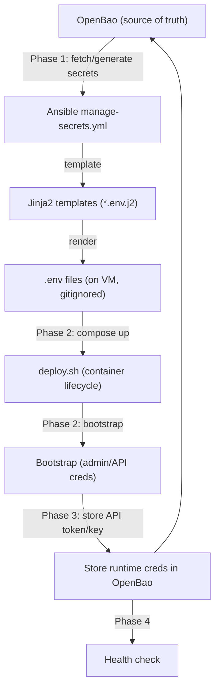
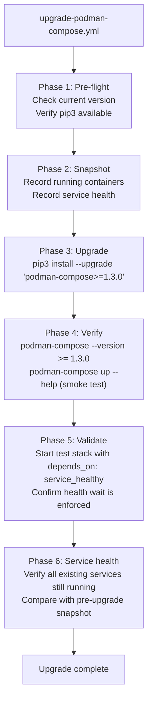
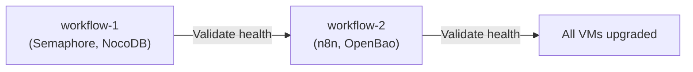
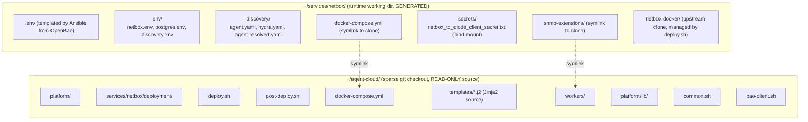

# 09 — Service Migrations & Tooling
> **Consolidates:** nocodb-n8n-composable-migration.md, PODMAN-UPGRADE-PLAN.md, SPARSE-CHECKOUT-MIGRATION.md (originals archived in `plan/archive/`)
>
> **Depends on:** 00, 01
>
> Part of the dependency-ordered `plan/development/` set (00–10). The source
> plans are merged verbatim below under provenance dividers to preserve all
> detail; read in numbered order to execute.


<!-- ======================= source: nocodb-n8n-composable-migration.md ======================= -->

---
title: NocoDB & n8n Composable Deployment Migration
authors: ["@jestyr27"]
date: 2026-05-10
status: Draft — EXECUTION HELD (see "Migration Safety" below)
tags: [nocodb, n8n, composable-deployment, ansible, openbao]
---

# NocoDB & n8n Composable Deployment Migration

> **For agentic workers:** REQUIRED SUB-SKILL: Use superpowers:subagent-driven-development (recommended) or superpowers:executing-plans to implement this plan task-by-task. Steps use checkbox (`- [ ]`) syntax for tracking.

## Problem

NocoDB and n8n currently use legacy deploy scripts that generate secrets in bash and store them in `secrets/` directories on disk. This violates the composable deployment pattern where OpenBao is the single source of truth for credentials.

## Migration Safety — preserving existing stateful secrets (READ FIRST)

> **Status: execution HELD as of 2026-06-02.** These services are **already deployed and in use**, so this is an *in-place migration of live state*, not a greenfield deploy. Several secrets are **stateful** — regenerating them on cutover causes data loss or breakage, not just a rotation:
>
> | Secret | If regenerated on a live service |
> |--------|----------------------------------|
> | **n8n `N8N_ENCRYPTION_KEY`** | **All stored workflow credentials become permanently undecryptable.** Unrecoverable. |
> | NocoDB `NC_AUTH_JWT_SECRET` | All existing sessions/JWTs invalidated (users logged out; any JWT-derived state broken). |
> | Postgres passwords (nocodb pg; n8n admin + non-root) | The running Postgres was *initialised* with the current password — a new one fails auth against the existing data volume. |
>
> The task plan below uses `_secret_definitions: type: random`, which `manage-secrets.yml` only generates **when the key is absent** at its OpenBao path. That is correct for a clean deploy, but on an in-place migration it will regenerate every secret that isn't already present *at the exact path/key-name `manage-secrets.yml` reads* (`secret/services/<svc>`, keyed by the `_secret_definitions` `name`). The legacy `deploy.sh` stored these under a VM-local `secrets/` dir and under different OpenBao keys — so a naive first run **would** regenerate them.
>
> **Therefore execution is held until we can read the live OpenBao + VM secret state** and complete the prerequisite below. Do NOT run Task 1+ against a live nocodb/n8n host before that.

### Task 0 (prerequisite, on the live cluster): capture and pre-seed existing secrets

Before the first composable deploy of an existing service:

1. On the live VM, read the current values from `config/<svc>.env` (and/or the legacy `secrets/` dir): for n8n — `N8N_ENCRYPTION_KEY`, `POSTGRES_PASSWORD`, `POSTGRES_NON_ROOT_PASSWORD`; for nocodb — the `NC_DB`/`POSTGRES_PASSWORD` and `NC_AUTH_JWT_SECRET`.
2. Write each into OpenBao at the **exact** path + key the new `_secret_definitions` expect (`secret/data/services/<svc>` with keys `postgres_password`, `jwt_secret`, `encryption_key`, `user_password`, …). `tasks/seed-discovery-credentials.yml` is the existing pattern for idempotent copy-into-OpenBao.
3. Verify with `check-secrets.yml` that every `type: random` definition resolves to a **pre-existing** value, so the first `manage-secrets.yml` run *fetches* rather than *generates*.
4. Only then run `deploy-<svc>.yml`. Diff the rendered `.env` against the current one before `compose up` to confirm no stateful value changed.

(For a genuinely fresh host with no data, Task 0 is a no-op and `type: random` correctly generates.)

## Design Principles

1. **OpenBao as source of truth** -- All credentials generated, stored, and fetched via OpenBao
2. **Jinja2 templating** -- Ansible templates `.env` files from OpenBao data; no secrets in code
3. **Container-only deploy.sh** -- Deploy scripts handle compose lifecycle only, no secret generation
4. **Independent workflows** -- Each playbook is self-contained, retryable, and idempotent
5. **Test-first** -- BATS tests validate templates before implementation

## Architecture

**Goal:** Migrate NocoDB and n8n from legacy deploy scripts to the composable pattern (OpenBao -> Ansible `manage-secrets.yml` -> Jinja2 templates -> deploy.sh container-only).

Both services follow the same 4-phase playbook pattern proven by NetBox: Phase 1 clones the repo, authenticates to OpenBao, generates/fetches secrets, and templates `.env` files via Jinja2. Phase 2 runs `deploy.sh` which only manages container lifecycle (compose up, health check). Phase 3 runs application bootstrap (admin/owner creation, API token/key generation) and stores runtime credentials back to OpenBao. Phase 4 verifies health. The `deploy.sh` scripts are refactored to remove secret generation and read pre-templated `.env` files instead.



**Tech Stack:** Ansible, Jinja2, OpenBao (HashiCorp Vault compatible API), Bash, Docker Compose, BATS (testing)

## Security Considerations

No real IPs, credentials, or sensitive data in any committed files. All secrets use `{{ secrets.* }}` Jinja2 placeholders. Real values live in site-config (private) and OpenBao.

---

## File Structure

### NocoDB Files

| Action | Path | Purpose |
|--------|------|---------|
| Create | `platform/services/nocodb/deployment/templates/nocodb.env.j2` | Jinja2 template for NocoDB + Postgres env vars |
| Modify | `platform/services/nocodb/deployment/deploy.sh` | Remove secret generation, read `.env` from config/ |
| Modify | `platform/services/nocodb/deployment/compose.yml` | No changes needed (already reads `./config/nocodb.env`) |
| Create | `platform/playbooks/deploy-nocodb.yml` | Full 4-phase composable playbook (replaces thin wrapper) |
| Create | `platform/playbooks/clean-deploy-nocodb.yml` | Destructive clean + redeploy |
| Create | `platform/tests/test_nocodb_templates.bats` | BATS tests for Jinja2 template rendering |

### n8n Files

| Action | Path | Purpose |
|--------|------|---------|
| Create | `platform/services/n8n/deployment/templates/n8n.env.j2` | Jinja2 template for n8n + Postgres + Redis env vars |
| Modify | `platform/services/n8n/deployment/deploy.sh` | Remove secret generation, read `.env` from config/ |
| Modify | `platform/services/n8n/deployment/compose.yml` | No changes needed (already reads `./config/n8n.env`) |
| Create | `platform/playbooks/deploy-n8n.yml` | Full 4-phase composable playbook (replaces thin wrapper) |
| Create | `platform/playbooks/clean-deploy-n8n.yml` | Destructive clean + redeploy |
| Create | `platform/tests/test_n8n_templates.bats` | BATS tests for Jinja2 template rendering |

### Shared Files

| Action | Path | Purpose |
|--------|------|---------|
| Modify | `platform/semaphore/templates.yml` | Add Clean Deploy NocoDB + Clean Deploy n8n templates |
| Modify | `platform/lib/common.sh` | No removal yet — keep `generate_nocodb_env` and `generate_n8n_env` for backward compatibility until deploy is validated |

---

## Task 1: NocoDB Jinja2 Template

**Files:**
- Create: `platform/services/nocodb/deployment/templates/nocodb.env.j2`
- Create: `platform/tests/test_nocodb_templates.bats`

This template replaces the hardcoded `generate_nocodb_env()` function in `common.sh`. The compose.yml already reads `./config/nocodb.env` so the template destination matches.

**Secrets required by NocoDB** (derived from `generate_nocodb_env()` in `common.sh:147-169`):
- `postgres_password` — Postgres auth + NocoDB `NC_DB` connection string
- `jwt_secret` — NocoDB `NC_AUTH_JWT_SECRET` for session tokens

- [ ] **Step 1: Write the BATS test for NocoDB template rendering**

Create `platform/tests/test_nocodb_templates.bats`:

```bash
#!/usr/bin/env bats
# test_nocodb_templates.bats — Verify NocoDB Jinja2 template renders correctly

TEMPLATE_DIR="$(cd "$(dirname "$BATS_TEST_FILENAME")/../services/nocodb/deployment/templates" && pwd)"

@test "nocodb.env.j2 exists" {
  [ -f "$TEMPLATE_DIR/nocodb.env.j2" ]
}

@test "nocodb.env.j2 contains POSTGRES_PASSWORD placeholder" {
  grep -q '{{ secrets.postgres_password }}' "$TEMPLATE_DIR/nocodb.env.j2"
}

@test "nocodb.env.j2 contains NC_AUTH_JWT_SECRET placeholder" {
  grep -q '{{ secrets.jwt_secret }}' "$TEMPLATE_DIR/nocodb.env.j2"
}

@test "nocodb.env.j2 contains NC_DB connection string with placeholder" {
  grep -q '{{ secrets.postgres_password }}' "$TEMPLATE_DIR/nocodb.env.j2"
  grep -q 'NC_DB=' "$TEMPLATE_DIR/nocodb.env.j2"
}

@test "nocodb.env.j2 does not contain hardcoded secrets" {
  ! grep -qiE '(password|secret)\s*=\s*[A-Za-z0-9+/]{8,}' "$TEMPLATE_DIR/nocodb.env.j2"
}

@test "nocodb.env.j2 renders with ansible-compatible Jinja2 syntax" {
  # Verify all placeholders use {{ secrets.* }} pattern
  local placeholders
  placeholders=$(grep -oE '\{\{[^}]+\}\}' "$TEMPLATE_DIR/nocodb.env.j2" | sort -u)
  for p in $placeholders; do
    echo "Checking placeholder: $p"
    echo "$p" | grep -qE '\{\{ *secrets\.' || echo "$p" | grep -qE '\{\{ *[a-z_]+ *\}\}'
  done
}
```

- [ ] **Step 2: Run test to verify it fails**

Run from repo root: `bats platform/tests/test_nocodb_templates.bats`
Expected: FAIL — `nocodb.env.j2` does not exist yet

- [ ] **Step 3: Create the NocoDB Jinja2 template**

Create `platform/services/nocodb/deployment/templates/nocodb.env.j2`:

```jinja2
# NocoDB environment — generated by Ansible manage-secrets.yml
# Do not edit manually — rerun deploy-nocodb.yml to regenerate
POSTGRES_USER=nocodb
POSTGRES_PASSWORD={{ secrets.postgres_password }}
POSTGRES_DB=nocodb
NC_DB=pg://workflow-nocodb-postgres:5432?u=nocodb&p={{ secrets.postgres_password }}&d=nocodb
NC_AUTH_JWT_SECRET={{ secrets.jwt_secret }}
```

- [ ] **Step 4: Run tests to verify they pass**

Run from repo root: `bats platform/tests/test_nocodb_templates.bats`
Expected: All 6 tests PASS

- [ ] **Step 5: Commit**

```bash
git add platform/services/nocodb/deployment/templates/nocodb.env.j2 platform/tests/test_nocodb_templates.bats
git commit -m "feat(nocodb): add Jinja2 env template for composable deployment"
```

---

## Task 2: n8n Jinja2 Template

**Files:**
- Create: `platform/services/n8n/deployment/templates/n8n.env.j2`
- Create: `platform/tests/test_n8n_templates.bats`

n8n is more complex than NocoDB — it has a Postgres admin user, a non-root application user (for the init script), and an encryption key. The compose.yml reads `./config/n8n.env` for all services.

**Secrets required by n8n** (derived from `generate_n8n_env()` in `common.sh:173-200`):
- `admin_password` — Postgres admin (POSTGRES_PASSWORD)
- `user_password` — Postgres non-root user (n8n_user) + n8n DB connection
- `encryption_key` — n8n internal encryption (N8N_ENCRYPTION_KEY)

- [ ] **Step 1: Write the BATS test for n8n template rendering**

Create `platform/tests/test_n8n_templates.bats`:

```bash
#!/usr/bin/env bats
# test_n8n_templates.bats — Verify n8n Jinja2 template renders correctly

TEMPLATE_DIR="$(cd "$(dirname "$BATS_TEST_FILENAME")/../services/n8n/deployment/templates" && pwd)"

@test "n8n.env.j2 exists" {
  [ -f "$TEMPLATE_DIR/n8n.env.j2" ]
}

@test "n8n.env.j2 contains POSTGRES_PASSWORD placeholder" {
  grep -q '{{ secrets.admin_password }}' "$TEMPLATE_DIR/n8n.env.j2"
}

@test "n8n.env.j2 contains non-root user password placeholder" {
  grep -q '{{ secrets.user_password }}' "$TEMPLATE_DIR/n8n.env.j2"
}

@test "n8n.env.j2 contains N8N_ENCRYPTION_KEY placeholder" {
  grep -q '{{ secrets.encryption_key }}' "$TEMPLATE_DIR/n8n.env.j2"
}

@test "n8n.env.j2 contains DB_POSTGRESDB_PASSWORD for n8n app connection" {
  grep -q 'DB_POSTGRESDB_PASSWORD=' "$TEMPLATE_DIR/n8n.env.j2"
  grep -q '{{ secrets.user_password }}' "$TEMPLATE_DIR/n8n.env.j2"
}

@test "n8n.env.j2 does not contain hardcoded secrets" {
  ! grep -qiE '(password|secret|key)\s*=\s*[A-Za-z0-9+/]{8,}' "$TEMPLATE_DIR/n8n.env.j2"
}

@test "n8n.env.j2 has POSTGRES_NON_ROOT_USER for init script" {
  grep -q 'POSTGRES_NON_ROOT_USER=' "$TEMPLATE_DIR/n8n.env.j2"
  grep -q 'POSTGRES_NON_ROOT_PASSWORD=' "$TEMPLATE_DIR/n8n.env.j2"
}
```

- [ ] **Step 2: Run test to verify it fails**

Run from repo root: `bats platform/tests/test_n8n_templates.bats`
Expected: FAIL — `n8n.env.j2` does not exist yet

- [ ] **Step 3: Create the n8n Jinja2 template**

Create `platform/services/n8n/deployment/templates/n8n.env.j2`:

```jinja2
# n8n environment — generated by Ansible manage-secrets.yml
# Do not edit manually — rerun deploy-n8n.yml to regenerate
POSTGRES_USER=n8n_admin
POSTGRES_PASSWORD={{ secrets.admin_password }}
POSTGRES_DB=n8n
POSTGRES_NON_ROOT_USER=n8n_user
POSTGRES_NON_ROOT_PASSWORD={{ secrets.user_password }}
DB_POSTGRESDB_PASSWORD={{ secrets.user_password }}
N8N_ENCRYPTION_KEY={{ secrets.encryption_key }}
```

- [ ] **Step 4: Run tests to verify they pass**

Run from repo root: `bats platform/tests/test_n8n_templates.bats`
Expected: All 7 tests PASS

- [ ] **Step 5: Commit**

```bash
git add platform/services/n8n/deployment/templates/n8n.env.j2 platform/tests/test_n8n_templates.bats
git commit -m "feat(n8n): add Jinja2 env template for composable deployment"
```

---

## Task 3: Refactor NocoDB deploy.sh

**Files:**
- Modify: `platform/services/nocodb/deployment/deploy.sh`

Refactor to container-lifecycle-only. Remove `step_generate_secrets` (Ansible handles this). Remove `step_store_in_openbao` (Ansible stores secrets). Keep `step_start_services`, `step_bootstrap_credentials` (runtime API token creation), and `step_validate`. The bootstrap step still needs to read the admin password — it now reads from `config/nocodb.env` instead of `secrets/`.

- [ ] **Step 1: Write the updated deploy.sh**

Replace `platform/services/nocodb/deployment/deploy.sh` with:

```bash
#!/usr/bin/env bash
# deploy.sh — Deploy NocoDB (container lifecycle only)
#
# Secrets and env files are managed by Ansible (deploy-nocodb.yml).
# This script starts containers, bootstraps the admin user + API token,
# and validates the deployment.
#
# Idempotent: safe to re-run on an existing deployment.
set -euo pipefail

SCRIPT_DIR="$(cd "$(dirname "${BASH_SOURCE[0]}")" && pwd)"
LIB_DIR="$(dirname "$(dirname "$(dirname "$SCRIPT_DIR")")")/lib"
source "${LIB_DIR}/common.sh"

CONFIG_DIR="${SCRIPT_DIR}/config"
NOCODB_URL="${NOCODB_URL:-http://localhost:8181}"
ADMIN_EMAIL="${NOCODB_ADMIN_EMAIL:-admin@uhstray.io}"

# Step 1: Start services

step_start_services() {
  info "Step 1: Starting NocoDB services..."
  cd "$SCRIPT_DIR"
  compose up -d
  wait_for_http "${NOCODB_URL}/api/v1/health" "NocoDB" 120
}

# Step 2: Bootstrap admin user + API token

step_bootstrap_credentials() {
  info "Step 2: Bootstrapping NocoDB credentials..."

  # Read admin password from env file (templated by Ansible)
  local admin_pass
  admin_pass=$(grep '^POSTGRES_PASSWORD=' "${CONFIG_DIR}/nocodb.env" 2>/dev/null | cut -d= -f2-)
  if [ -z "$admin_pass" ]; then
    warn "  No admin password found in config/nocodb.env — skipping bootstrap."
    return 0
  fi

  # Try signup (first boot — no users exist yet)
  local signup_response jwt_token auth_payload
  auth_payload=$(jq -n --arg email "$ADMIN_EMAIL" --arg pass "$admin_pass" \
    '{"email":$email,"password":$pass}')

  signup_response=$(curl -sf -X POST "${NOCODB_URL}/api/v1/auth/user/signup" \
    -H "Content-Type: application/json" \
    --data-raw "$auth_payload" 2>/dev/null) || true

  if [ -n "$signup_response" ]; then
    jwt_token=$(echo "$signup_response" | jq -r '.token // empty')
    if [ -n "$jwt_token" ]; then
      info "  Admin user created via signup."
    fi
  fi

  # If signup failed (user exists), try signin
  if [ -z "${jwt_token:-}" ]; then
    local signin_response
    signin_response=$(curl -sf -X POST "${NOCODB_URL}/api/v1/auth/user/signin" \
      -H "Content-Type: application/json" \
      --data-raw "$auth_payload" 2>/dev/null) || true

    jwt_token=$(echo "${signin_response:-}" | jq -r '.token // empty' 2>/dev/null) || jwt_token=""
    if [ -n "$jwt_token" ]; then
      info "  Signed in as existing admin."
    else
      warn "  Could not authenticate to NocoDB. Token creation deferred."
      return 0
    fi
  fi

  # Create persistent API token
  local token_response api_token
  token_response=$(curl -sf -X POST "${NOCODB_URL}/api/v1/tokens" \
    -H "xc-auth: ${jwt_token}" \
    -H "Content-Type: application/json" \
    -d '{"description":"nemoclaw-agent"}' 2>/dev/null) || true

  if [ -z "$token_response" ]; then
    token_response=$(curl -sf -X POST "${NOCODB_URL}/api/v1/meta/api-tokens" \
      -H "xc-auth: ${jwt_token}" \
      -H "Content-Type: application/json" \
      -d '{"description":"nemoclaw-agent"}' 2>/dev/null) || true
  fi

  api_token=$(echo "${token_response:-}" | jq -r '.token // empty' 2>/dev/null) || api_token=""

  if [ -n "$api_token" ]; then
    info "  API token created."
    # Write to stdout for Ansible to capture and store in OpenBao
    echo "NOCODB_API_TOKEN=${api_token}"
  else
    warn "  API token creation failed — may need manual creation."
  fi
}

# Step 3: Validate

step_validate() {
  info "Step 3: Validating NocoDB deployment..."
  check_http "${NOCODB_URL}/api/v1/health" "Health"
}

# Main

main() {
  info "=== NocoDB Deployment ==="
  detect_runtime

  step_start_services
  step_bootstrap_credentials
  step_validate

  info "=== NocoDB deployment complete ==="
}

main "$@"
```

- [ ] **Step 2: Verify shellcheck passes**

Run: `shellcheck -S warning platform/services/nocodb/deployment/deploy.sh`
Expected: No warnings

- [ ] **Step 3: Commit**

```bash
git add platform/services/nocodb/deployment/deploy.sh
git commit -m "refactor(nocodb): deploy.sh to container-lifecycle-only"
```

---

## Task 4: Refactor n8n deploy.sh

**Files:**
- Modify: `platform/services/n8n/deployment/deploy.sh`

Same pattern as NocoDB. Remove secret generation and OpenBao storage. Keep container start, owner bootstrap, API key creation, and validation. The owner password is read from `config/n8n.env`.

- [ ] **Step 1: Write the updated deploy.sh**

Replace `platform/services/n8n/deployment/deploy.sh` with:

```bash
#!/usr/bin/env bash
# deploy.sh — Deploy n8n (container lifecycle only)
#
# Secrets and env files are managed by Ansible (deploy-n8n.yml).
# This script starts containers, bootstraps the owner + API key,
# and validates the deployment.
#
# Idempotent: safe to re-run on an existing deployment.
set -euo pipefail

SCRIPT_DIR="$(cd "$(dirname "${BASH_SOURCE[0]}")" && pwd)"
LIB_DIR="$(dirname "$(dirname "$(dirname "$SCRIPT_DIR")")")/lib"
source "${LIB_DIR}/common.sh"

CONFIG_DIR="${SCRIPT_DIR}/config"
N8N_URL="${N8N_URL:-http://localhost:5678}"
ADMIN_EMAIL="${N8N_ADMIN_EMAIL:-admin@uhstray.io}"

# Step 1: Start services

step_start_services() {
  info "Step 1: Starting n8n services..."
  cd "$SCRIPT_DIR"
  compose up -d
  wait_for_http "${N8N_URL}/healthz" "n8n" 120
}

# Step 2: Bootstrap owner + API key

step_bootstrap_credentials() {
  info "Step 2: Bootstrapping n8n credentials..."

  # Read owner password from env file (templated by Ansible)
  local owner_pass
  owner_pass=$(grep '^POSTGRES_NON_ROOT_PASSWORD=' "${CONFIG_DIR}/n8n.env" 2>/dev/null | cut -d= -f2-)
  if [ -z "$owner_pass" ]; then
    warn "  No owner password found in config/n8n.env — skipping bootstrap."
    return 0
  fi

  # Try owner setup (first boot only — fails if owner already exists)
  local setup_response setup_payload
  setup_payload=$(jq -n \
    --arg email "$ADMIN_EMAIL" \
    --arg pass "$owner_pass" \
    '{"email":$email,"firstName":"Admin","lastName":"User","password":$pass}')

  setup_response=$(curl -sf -X POST "${N8N_URL}/rest/owner/setup" \
    -H "Content-Type: application/json" \
    --data-raw "$setup_payload" 2>/dev/null) || true

  if [ -n "$setup_response" ]; then
    info "  Owner account created."
  else
    info "  Owner already exists — proceeding to login."
  fi

  # Login to get session cookie
  local cookie_jar login_payload
  cookie_jar=$(mktemp)
  trap 'rm -f "$cookie_jar"' EXIT INT TERM

  login_payload=$(jq -n \
    --arg email "$ADMIN_EMAIL" \
    --arg pass "$owner_pass" \
    '{"emailOrLdapLoginId":$email,"password":$pass}')

  curl -sf -c "$cookie_jar" -X POST "${N8N_URL}/rest/login" \
    -H "Content-Type: application/json" \
    --data-raw "$login_payload" >/dev/null 2>&1 || {
    warn "  Login failed — API key creation deferred."
    return 0
  }
  info "  Logged in."

  # Create API key
  local key_response api_key
  key_response=$(curl -sf -b "$cookie_jar" -X POST "${N8N_URL}/rest/api-keys" \
    -H "Content-Type: application/json" \
    -d '{"label":"nemoclaw-agent","scopes":["workflow:read","workflow:execute","workflow:list"],"expiresAt":0}' \
    2>/dev/null) || true

  api_key=$(echo "${key_response:-}" | jq -r '.data.rawApiKey // empty' 2>/dev/null) || api_key=""

  if [ -n "$api_key" ]; then
    info "  API key created."
    echo "N8N_API_KEY=${api_key}"
    return 0
  fi

  # Fallback: direct DB insert
  info "  API endpoint unavailable — trying direct DB insert..."
  detect_runtime
  api_key=$(openssl rand -hex 20)
  if ! [[ "$api_key" =~ ^[0-9a-f]+$ ]]; then
    warn "  Generated key failed hex validation — aborting DB insert."
    return 0
  fi
  local insert_result
  insert_result=$($CONTAINER_ENGINE exec workflow-n8n-postgres \
    psql -U n8n_user -d n8n -t -A -c \
    "INSERT INTO api_key (user_id, label, api_key, created_at, updated_at)
     SELECT '1', 'nemoclaw-agent', '${api_key}', NOW(), NOW()
     WHERE NOT EXISTS (SELECT 1 FROM api_key WHERE label = 'nemoclaw-agent')
     RETURNING api_key;" 2>/dev/null) || insert_result=""

  if [ -n "$insert_result" ]; then
    info "  API key created via DB insert."
    echo "N8N_API_KEY=${api_key}"
  else
    warn "  API key creation failed — may need manual creation."
  fi
}

# Step 3: Validate

step_validate() {
  info "Step 3: Validating n8n deployment..."
  check_http "${N8N_URL}/healthz" "Health"
}

# Main

main() {
  info "=== n8n Deployment ==="
  detect_runtime

  step_start_services
  step_bootstrap_credentials
  step_validate

  info "=== n8n deployment complete ==="
}

main "$@"
```

- [ ] **Step 2: Verify shellcheck passes**

Run: `shellcheck -S warning platform/services/n8n/deployment/deploy.sh`
Expected: No warnings

- [ ] **Step 3: Commit**

```bash
git add platform/services/n8n/deployment/deploy.sh
git commit -m "refactor(n8n): deploy.sh to container-lifecycle-only"
```

---

## Task 5: NocoDB Composable Playbook

**Files:**
- Modify: `platform/playbooks/deploy-nocodb.yml` (replace thin wrapper with full 4-phase playbook)

The playbook follows the NetBox pattern exactly: Phase 1 (clone + secrets + template), Phase 2 (deploy.sh), Phase 3 (capture API token → store in OpenBao), Phase 4 (verify).

- [ ] **Step 1: Write the composable playbook**

Replace `platform/playbooks/deploy-nocodb.yml` with:

```yaml
---
# deploy-nocodb.yml — Full NocoDB deployment per composable pattern
#
# Phase 1: Clone repo, manage secrets via OpenBao, template env files
# Phase 2: Run deploy.sh (container lifecycle + bootstrap)
# Phase 3: Store runtime credentials in OpenBao
# Phase 4: Verify deployment health
#
# OpenBao is the source of truth. Ansible templates compose-ready
# env files from OpenBao data. deploy.sh only manages containers.

# Phase 1: Clone + Secrets + Env Files
- name: "Phase 1 - Clone repo and configure secrets"
  hosts: nocodb_svc
  gather_facts: false
  become: false
  vars:
    _monorepo_dir: "/home/{{ ansible_user }}/agent-cloud"
    _deploy_dir: "{{ _monorepo_dir }}/{{ monorepo_deploy_path }}"
    _branch: "{{ service_branch | default('main') }}"
    _bao_url: "{{ openbao_addr | default('') }}"
    _bao_role_id: "{{ bao_role_id | default(lookup('env', 'BAO_ROLE_ID')) }}"
    _bao_secret_id: "{{ bao_secret_id | default(lookup('env', 'BAO_SECRET_ID')) }}"
    _service_url: "{{ service_url | default('http://localhost:8181') }}"
    _secret_definitions:
      - {name: postgres_password, type: random, length: 32}
      - {name: jwt_secret, type: random, length: 32}
      - {name: admin_password, type: random, length: 24}
      # Runtime credentials (generated by deploy.sh, stored back by Phase 3)
      - {name: api_token, type: user}
    _env_templates:
      - {src: nocodb.env.j2, dest: config/nocodb.env}

  tasks:
    - name: "Install git if needed"
      ansible.builtin.apt:
        name: git
        state: present
      become: true

    - name: "Clone or update agent-cloud monorepo"
      ansible.builtin.git:
        repo: "{{ monorepo_repo }}"
        dest: "{{ _monorepo_dir }}"
        version: "{{ _branch }}"
        force: true

    - name: "Create convenience symlink"
      ansible.builtin.file:
        src: "{{ _deploy_dir }}"
        dest: "/home/{{ ansible_user }}/{{ service_name }}"
        state: link
        force: true
      register: _symlink_result
      failed_when:
        - _symlink_result is failed
        - _symlink_result.msg is defined
        - "'permission denied' in (_symlink_result.msg | lower)"

    - name: "Manage secrets and template env files"
      ansible.builtin.include_tasks: tasks/manage-secrets.yml

# Phase 2: Container lifecycle + bootstrap
- name: "Phase 2 - Start NocoDB containers and bootstrap"
  hosts: nocodb_svc
  gather_facts: false
  become: false
  vars:
    _monorepo_dir: "/home/{{ ansible_user }}/agent-cloud"
    _deploy_dir: "{{ _monorepo_dir }}/{{ monorepo_deploy_path }}"

  tasks:
    - name: "Run deploy.sh"
      ansible.builtin.shell: |
        cd "{{ _deploy_dir }}"
        bash deploy.sh
      environment:
        CONTAINER_ENGINE: "{{ container_engine | default('') }}"
        NOCODB_URL: "{{ service_url | default('http://localhost:8181') }}"
      register: _deploy
      changed_when: true

    - name: "Deploy output"
      ansible.builtin.debug:
        var: _deploy.stdout_lines

    - name: "Extract API token from deploy output"
      ansible.builtin.set_fact:
        _nocodb_api_token: "{{ _deploy.stdout | regex_search('NOCODB_API_TOKEN=(.+)', '\\1') | first | default('') }}"
      when: "'NOCODB_API_TOKEN=' in _deploy.stdout"

# Phase 3: Store runtime credentials in OpenBao
- name: "Phase 3 - Store runtime credentials"
  hosts: nocodb_svc
  gather_facts: false
  become: false
  vars:
    _bao_url: "{{ openbao_addr | default('') }}"
    _bao_role_id: "{{ bao_role_id | default(lookup('env', 'BAO_ROLE_ID')) }}"
    _bao_secret_id: "{{ bao_secret_id | default(lookup('env', 'BAO_SECRET_ID')) }}"

  tasks:
    - name: "Authenticate to OpenBao"
      ansible.builtin.uri:
        url: "{{ _bao_url }}/v1/auth/approle/login"
        method: POST
        body_format: json
        body:
          role_id: "{{ _bao_role_id }}"
          secret_id: "{{ _bao_secret_id }}"
        status_code: [200]
      register: _bao_auth
      delegate_to: localhost
      run_once: true
      when: _nocodb_api_token | default('') | length > 0

    - name: "Store API token in OpenBao"
      ansible.builtin.uri:
        url: "{{ _bao_url }}/v1/secret/data/services/nocodb"
        method: POST
        headers:
          X-Vault-Token: "{{ _bao_auth.json.auth.client_token }}"
        body_format: json
        body:
          data:
            api_token: "{{ _nocodb_api_token }}"
            url: "{{ service_url | default('http://localhost:8181') }}"
        status_code: [200]
      delegate_to: localhost
      run_once: true
      when: _nocodb_api_token | default('') | length > 0

    - name: "API token stored"
      ansible.builtin.debug:
        msg: "NocoDB API token stored in OpenBao at secret/services/nocodb"
      when: _nocodb_api_token | default('') | length > 0

# Phase 4: Verify
- name: "Phase 4 - Verify deployment"
  hosts: nocodb_svc
  gather_facts: false
  become: false
  tasks:
    - name: "Health check"
      ansible.builtin.uri:
        url: "{{ service_url | default('http://localhost:8181') }}/api/v1/health"
        status_code: [200]
        validate_certs: false
        timeout: 30
      retries: 5
      delay: 10
      when: service_url is defined

    - name: "NocoDB deployed"
      ansible.builtin.debug:
        msg: "NocoDB is healthy at {{ service_url | default('N/A') }}"
```

- [ ] **Step 2: Run ansible-lint**

Run from repo root: `ansible-lint platform/playbooks/deploy-nocodb.yml`
Expected: Clean (may show info-level warnings which are acceptable)

- [ ] **Step 3: Commit**

```bash
git add platform/playbooks/deploy-nocodb.yml
git commit -m "feat(nocodb): composable 4-phase deployment playbook"
```

---

## Task 6: n8n Composable Playbook

**Files:**
- Modify: `platform/playbooks/deploy-n8n.yml` (replace thin wrapper with full 4-phase playbook)

Same structure as NocoDB but with n8n-specific secrets and n8n's owner password convention.

- [ ] **Step 1: Write the composable playbook**

Replace `platform/playbooks/deploy-n8n.yml` with:

```yaml
---
# deploy-n8n.yml — Full n8n deployment per composable pattern
#
# Phase 1: Clone repo, manage secrets via OpenBao, template env files
# Phase 2: Run deploy.sh (container lifecycle + bootstrap)
# Phase 3: Store runtime credentials in OpenBao
# Phase 4: Verify deployment health
#
# OpenBao is the source of truth. Ansible templates compose-ready
# env files from OpenBao data. deploy.sh only manages containers.

# Phase 1: Clone + Secrets + Env Files
- name: "Phase 1 - Clone repo and configure secrets"
  hosts: n8n_svc
  gather_facts: false
  become: false
  vars:
    _monorepo_dir: "/home/{{ ansible_user }}/agent-cloud"
    _deploy_dir: "{{ _monorepo_dir }}/{{ monorepo_deploy_path }}"
    _branch: "{{ service_branch | default('main') }}"
    _bao_url: "{{ openbao_addr | default('') }}"
    _bao_role_id: "{{ bao_role_id | default(lookup('env', 'BAO_ROLE_ID')) }}"
    _bao_secret_id: "{{ bao_secret_id | default(lookup('env', 'BAO_SECRET_ID')) }}"
    _service_url: "{{ service_url | default('http://localhost:5678') }}"
    _secret_definitions:
      - {name: admin_password, type: random, length: 48}
      - {name: user_password, type: random, length: 48}
      - {name: encryption_key, type: random, length: 64}
      - {name: owner_password, type: random, length: 24}
      # Runtime credentials (generated by deploy.sh, stored back by Phase 3)
      - {name: api_key, type: user}
    _env_templates:
      - {src: n8n.env.j2, dest: config/n8n.env}

  tasks:
    - name: "Install git if needed"
      ansible.builtin.apt:
        name: git
        state: present
      become: true

    - name: "Clone or update agent-cloud monorepo"
      ansible.builtin.git:
        repo: "{{ monorepo_repo }}"
        dest: "{{ _monorepo_dir }}"
        version: "{{ _branch }}"
        force: true

    - name: "Create convenience symlink"
      ansible.builtin.file:
        src: "{{ _deploy_dir }}"
        dest: "/home/{{ ansible_user }}/{{ service_name }}"
        state: link
        force: true
      register: _symlink_result
      failed_when:
        - _symlink_result is failed
        - _symlink_result.msg is defined
        - "'permission denied' in (_symlink_result.msg | lower)"

    - name: "Manage secrets and template env files"
      ansible.builtin.include_tasks: tasks/manage-secrets.yml

# Phase 2: Container lifecycle + bootstrap
- name: "Phase 2 - Start n8n containers and bootstrap"
  hosts: n8n_svc
  gather_facts: false
  become: false
  vars:
    _monorepo_dir: "/home/{{ ansible_user }}/agent-cloud"
    _deploy_dir: "{{ _monorepo_dir }}/{{ monorepo_deploy_path }}"

  tasks:
    - name: "Run deploy.sh"
      ansible.builtin.shell: |
        cd "{{ _deploy_dir }}"
        bash deploy.sh
      environment:
        CONTAINER_ENGINE: "{{ container_engine | default('') }}"
        N8N_URL: "{{ service_url | default('http://localhost:5678') }}"
      register: _deploy
      changed_when: true

    - name: "Deploy output"
      ansible.builtin.debug:
        var: _deploy.stdout_lines

    - name: "Extract API key from deploy output"
      ansible.builtin.set_fact:
        _n8n_api_key: "{{ _deploy.stdout | regex_search('N8N_API_KEY=(.+)', '\\1') | first | default('') }}"
      when: "'N8N_API_KEY=' in _deploy.stdout"

# Phase 3: Store runtime credentials in OpenBao
- name: "Phase 3 - Store runtime credentials"
  hosts: n8n_svc
  gather_facts: false
  become: false
  vars:
    _bao_url: "{{ openbao_addr | default('') }}"
    _bao_role_id: "{{ bao_role_id | default(lookup('env', 'BAO_ROLE_ID')) }}"
    _bao_secret_id: "{{ bao_secret_id | default(lookup('env', 'BAO_SECRET_ID')) }}"

  tasks:
    - name: "Authenticate to OpenBao"
      ansible.builtin.uri:
        url: "{{ _bao_url }}/v1/auth/approle/login"
        method: POST
        body_format: json
        body:
          role_id: "{{ _bao_role_id }}"
          secret_id: "{{ _bao_secret_id }}"
        status_code: [200]
      register: _bao_auth
      delegate_to: localhost
      run_once: true
      when: _n8n_api_key | default('') | length > 0

    - name: "Store API key in OpenBao"
      ansible.builtin.uri:
        url: "{{ _bao_url }}/v1/secret/data/services/n8n"
        method: POST
        headers:
          X-Vault-Token: "{{ _bao_auth.json.auth.client_token }}"
        body_format: json
        body:
          data:
            api_key: "{{ _n8n_api_key }}"
            url: "{{ service_url | default('http://localhost:5678') }}"
        status_code: [200]
      delegate_to: localhost
      run_once: true
      when: _n8n_api_key | default('') | length > 0

    - name: "API key stored"
      ansible.builtin.debug:
        msg: "n8n API key stored in OpenBao at secret/services/n8n"
      when: _n8n_api_key | default('') | length > 0

# Phase 4: Verify
- name: "Phase 4 - Verify deployment"
  hosts: n8n_svc
  gather_facts: false
  become: false
  tasks:
    - name: "Health check"
      ansible.builtin.uri:
        url: "{{ service_url | default('http://localhost:5678') }}/healthz"
        status_code: [200]
        validate_certs: false
        timeout: 30
      retries: 5
      delay: 10
      when: service_url is defined

    - name: "n8n deployed"
      ansible.builtin.debug:
        msg: "n8n is healthy at {{ service_url | default('N/A') }}"
```

- [ ] **Step 2: Run ansible-lint**

Run from repo root: `ansible-lint platform/playbooks/deploy-n8n.yml`
Expected: Clean

- [ ] **Step 3: Commit**

```bash
git add platform/playbooks/deploy-n8n.yml
git commit -m "feat(n8n): composable 4-phase deployment playbook"
```

---

## Task 7: Clean Deploy Playbooks + Semaphore Templates

**Files:**
- Create: `platform/playbooks/clean-deploy-nocodb.yml`
- Create: `platform/playbooks/clean-deploy-n8n.yml`
- Modify: `platform/semaphore/templates.yml`

- [ ] **Step 1: Create clean-deploy-nocodb.yml**

Create `platform/playbooks/clean-deploy-nocodb.yml`:

```yaml
---
# clean-deploy-nocodb.yml — Destroy and redeploy NocoDB from scratch
#
# WARNING: Destroys ALL NocoDB data (database, volumes, containers).
# Uses composable tasks/clean-service.yml then runs deploy-nocodb.yml.

- name: "Clean NocoDB deployment"
  hosts: nocodb_svc
  gather_facts: false
  become: false
  vars:
    _monorepo_dir: "/home/{{ ansible_user }}/agent-cloud"
  tasks:
    - name: "Destroy existing deployment"
      ansible.builtin.include_tasks: tasks/clean-service.yml

- name: "Fresh deploy"
  import_playbook: deploy-nocodb.yml
```

- [ ] **Step 2: Create clean-deploy-n8n.yml**

Create `platform/playbooks/clean-deploy-n8n.yml`:

```yaml
---
# clean-deploy-n8n.yml — Destroy and redeploy n8n from scratch
#
# WARNING: Destroys ALL n8n data (database, volumes, workflows, containers).
# Uses composable tasks/clean-service.yml then runs deploy-n8n.yml.

- name: "Clean n8n deployment"
  hosts: n8n_svc
  gather_facts: false
  become: false
  vars:
    _monorepo_dir: "/home/{{ ansible_user }}/agent-cloud"
  tasks:
    - name: "Destroy existing deployment"
      ansible.builtin.include_tasks: tasks/clean-service.yml

- name: "Fresh deploy"
  import_playbook: deploy-n8n.yml
```

- [ ] **Step 3: Add Semaphore templates for clean deploys**

In `platform/semaphore/templates.yml`, add after the "Clean Deploy NetBox" entry (after line 88):

```yaml
  - name: Clean Deploy NocoDB
    playbook: platform/playbooks/clean-deploy-nocodb.yml
    survey_vars:
      - name: service_branch
        title: "Branch"
        description: "Git branch to deploy (leave as 'main' for production)"
        type: string
        required: false
        default_value: "main"

  - name: Clean Deploy n8n
    playbook: platform/playbooks/clean-deploy-n8n.yml
    survey_vars:
      - name: service_branch
        title: "Branch"
        description: "Git branch to deploy (leave as 'main' for production)"
        type: string
        required: false
        default_value: "main"
```

- [ ] **Step 4: Run yamllint and ansible-lint**

Run from repo root:
```bash
yamllint platform/playbooks/clean-deploy-nocodb.yml platform/playbooks/clean-deploy-n8n.yml platform/semaphore/templates.yml
ansible-lint platform/playbooks/clean-deploy-nocodb.yml platform/playbooks/clean-deploy-n8n.yml
```
Expected: Clean

- [ ] **Step 5: Commit**

```bash
git add platform/playbooks/clean-deploy-nocodb.yml platform/playbooks/clean-deploy-n8n.yml platform/semaphore/templates.yml
git commit -m "feat(playbooks): add clean-deploy playbooks and Semaphore templates for NocoDB and n8n"
```

---

## Task 8: Run Full Test Suite + Security Scan

**Files:** No changes — validation only.

- [ ] **Step 1: Run all existing tests to verify no regressions**

Run from repo root:

```bash
pytest platform/services/netbox/deployment/tests/ -v
bats platform/tests/
```
Expected: All existing tests PASS plus new NocoDB and n8n template tests PASS

- [ ] **Step 2: Run all linters**

Run from repo root:

```bash
ruff check .
shellcheck -S warning platform/services/nocodb/deployment/deploy.sh platform/services/n8n/deployment/deploy.sh
ansible-lint platform/playbooks/deploy-nocodb.yml platform/playbooks/deploy-n8n.yml
yamllint platform/playbooks/deploy-nocodb.yml platform/playbooks/deploy-n8n.yml
```
Expected: All clean

- [ ] **Step 3: Security scan — no leaked secrets**

Run:
```bash
git diff main --staged | grep -iE '^\+.*192\.168\.' | grep -v 'target\|host:\|subnet\|scope\|example' || echo "No IP leaks"
git diff main --staged | grep -iE '^\+.*password\s*[:=]\s*[A-Za-z0-9]{8}|^\+.*secret_id[:=]\s*[a-f0-9-]{30}' || echo "No secret leaks"
```
Expected: "No IP leaks" and "No secret leaks"

---

## Task 9: Documentation Updates

**Files:**
- Modify: `CLAUDE.md` (update OpenBao secrets layout and deployment status)

- [ ] **Step 1: Update CLAUDE.md OpenBao Secrets Layout**

In the `CLAUDE.md` OpenBao Secrets Layout table, update the nocodb and n8n entries to reflect the full secret set:

Change:

```markdown
| `secret/services/nocodb` | NocoDB API token, URL |
| `secret/services/n8n` | n8n API key, URL |
```

To:

```markdown
| `secret/services/nocodb` | postgres_password, jwt_secret, admin_password, api_token, URL |
| `secret/services/n8n` | admin_password, user_password, encryption_key, owner_password, api_key, URL |
```

- [ ] **Step 2: Update Deployment Status**

Move NocoDB and n8n from "In Progress" to "Completed" in the deployment status section, adding:

```markdown
- **NocoDB composable deployment** — 4-phase playbook, Jinja2 templates, OpenBao integration
- **n8n composable deployment** — 4-phase playbook, Jinja2 templates, OpenBao integration
```

- [ ] **Step 3: Commit**

```bash
git add CLAUDE.md
git commit -m "docs: update CLAUDE.md for NocoDB and n8n composable deployment"
```

---

## Summary

| Task | Description | Files Changed |
|------|-------------|---------------|
| 1 | NocoDB Jinja2 template + tests | 2 created |
| 2 | n8n Jinja2 template + tests | 2 created |
| 3 | NocoDB deploy.sh refactor | 1 modified |
| 4 | n8n deploy.sh refactor | 1 modified |
| 5 | NocoDB composable playbook | 1 modified |
| 6 | n8n composable playbook | 1 modified |
| 7 | Clean deploy playbooks + Semaphore | 2 created, 1 modified |
| 8 | Full test suite + security scan | validation only |
| 9 | Documentation updates | 1 modified |

Total: 7 files created, 5 files modified, 9 commits.

---

## Cross-references

- [AUTOMATION-COMPOSABILITY.md](../architecture/AUTOMATION-COMPOSABILITY.md) -- Composable deployment pattern and task library
- [CREDENTIAL-LIFECYCLE-PLAN.md](../architecture/CREDENTIAL-LIFECYCLE-PLAN.md) -- Secret generation, storage, rotation, and retirement
- [architecture-reference.md](../architecture/architecture-reference.md) -- Document standards and master index
- [IMPLEMENTATION_PLAN.md](IMPLEMENTATION_PLAN.md) -- Full implementation plan (phases, architecture, decisions)
- [SERVICE-INTEGRATION-PLAN.md](../architecture/SERVICE-INTEGRATION-PLAN.md) -- Service onboarding checklist

---

## Revision History

| Date | Change |
| --- | --- |
| 2026-05-10 | Initial creation. 9-task migration plan for NocoDB and n8n composable deployments. |
| 2026-06-02 | Added "Migration Safety" + Task 0 (pre-seed existing stateful secrets) after an audit found the `type: random` definitions would regenerate the live n8n encryption key / NocoDB JWT / Postgres passwords on cutover. Status set to EXECUTION HELD pending live OpenBao access to complete Task 0. |

<!-- ======================= source: PODMAN-UPGRADE-PLAN.md ======================= -->

# Podman-Compose Upgrade Plan

**Date:** 2026-05-06
**Status:** PLANNING
**Priority:** HIGH
**Effort:** Low (pip upgrade + validation)
**Impact:** High (unblocks compose spec compliance for all Podman services)
**Depends on:** None (can execute immediately)
**Blocks:** Simplifying deploy scripts to rely on `depends_on: service_healthy`

---

## Problem

All Podman VMs in the platform run podman-compose 1.0.6 (installed via pip). This version has critical limitations:

1. **`depends_on: condition: service_healthy` is ignored** -- containers start in dependency order but do NOT wait for healthchecks. Application containers start before their database is ready, causing connection errors. Every deploy script must implement manual health-wait loops to compensate.

2. **Volume `name:` property is silently ignored** -- volumes always get auto-generated names (`{project}_{volume}`). Explicit naming requires `--project-name` workarounds.

3. **YAML merge key (`<<: *anchor`) may not work** -- shared environment blocks via anchors are unreliable.

4. **Compose spec extensions (`x-` prefix) may be mishandled** -- custom extension fields used for shared config blocks may cause parse errors.

These limitations force deploy scripts to work around compose features that should be handled by the compose engine itself. The workarounds add complexity, increase deploy time (sequential health polling), and create a divergence between how compose files are written (with `depends_on` conditions) and how they actually behave.

See `plan/architecture/05-platform-infra.md` for the full compatibility matrix.

---

## Current State

| VM | Role | Podman | podman-compose | Services |
|----|------|--------|---------------|----------|
| workflow-1 | Semaphore, NocoDB | 4.9.3 | 1.0.6 | Semaphore, NocoDB |
| workflow-2 | n8n, OpenBao | 4.9.3 | 1.0.6 | n8n, OpenBao |

NetBox runs on Docker and is not affected by this upgrade.

---

## Target

| Component | Current | Target | Rationale |
|-----------|---------|--------|-----------|
| podman-compose | 1.0.6 | >= 1.3.0 | Enforces `depends_on: service_healthy`, supports volume `name:` |
| Podman | 4.9.3 | >= 4.0 (no change needed) | Already meets minimum |

**Target tool:** `podman-compose` (Python CLI wrapper, installed via pip). NOT `podman compose` (Go-based native plugin). The platform standardizes on the Python CLI exclusively.

---

## Approach

### Ansible Playbook: `upgrade-podman-compose.yml`

A new playbook that upgrades podman-compose on all Podman VMs via pip, verifies the upgrade, and validates that `depends_on: service_healthy` works correctly afterward.



### Playbook Structure

```yaml
# platform/playbooks/upgrade-podman-compose.yml
- name: "Upgrade podman-compose on {{ target_service | default('podman_hosts') }}"
  hosts: "{{ target_service | default('podman_hosts') }}"
  gather_facts: true
  become: false
  vars:
    _min_version: "1.3.0"
    _target_version: ">=1.3.0"

  tasks:
    # Phase 1: Pre-flight
    - name: "Check current podman-compose version"
      command: podman-compose --version
      register: _pc_version_before
      changed_when: false

    - name: "Display current version"
      debug:
        msg: "Current: {{ _pc_version_before.stdout }}"

    - name: "Verify pip3 is available"
      command: pip3 --version
      register: _pip_check
      changed_when: false
      failed_when: _pip_check.rc != 0

    # Phase 2: Snapshot existing state
    - name: "Record running containers"
      command: podman ps --format '{{ "{{" }}.Names{{ "}}" }}'
      register: _containers_before
      changed_when: false

    # Phase 3: Upgrade
    - name: "Upgrade podman-compose via pip"
      pip:
        name: "podman-compose{{ _target_version }}"
        executable: pip3
        state: latest

    # Phase 4: Verify upgrade
    - name: "Check new podman-compose version"
      command: podman-compose --version
      register: _pc_version_after
      changed_when: false

    - name: "Display upgraded version"
      debug:
        msg: "Upgraded: {{ _pc_version_after.stdout }}"

    # Phase 5: Validate depends_on enforcement
    # (Uses a minimal test compose file with healthcheck dependency)

    # Phase 6: Verify existing services still running
    - name: "Record running containers after upgrade"
      command: podman ps --format '{{ "{{" }}.Names{{ "}}" }}'
      register: _containers_after
      changed_when: false

    - name: "Compare container lists"
      assert:
        that: _containers_before.stdout_lines | sort == _containers_after.stdout_lines | sort
        fail_msg: >-
          Container list changed after upgrade.
          Before: {{ _containers_before.stdout_lines | sort }}
          After: {{ _containers_after.stdout_lines | sort }}
```

---

## Rollout Strategy

### One VM at a time

Upgrade VMs sequentially, not in parallel. Validate service health after each VM before proceeding.



### Rollout order

1. **workflow-2 first** (n8n, OpenBao) -- lower risk; OpenBao is a single container with no `depends_on` conditions. n8n has health dependencies but is less critical than Semaphore.
2. **workflow-1 second** (Semaphore, NocoDB) -- Semaphore is the orchestration platform; upgrade it last to ensure the upgrade playbook can still run if workflow-2 has issues.

### Rollback

If the upgrade causes issues:

```bash
# Rollback to exact previous version
pip3 install podman-compose==1.0.6

# Verify rollback
podman-compose --version

# Restart affected services
podman-compose -f compose.yml up -d
```

The upgrade only modifies a Python package (no system packages, no Podman binary changes). Rollback is a single pip install command.

---

## Validation Checklist

### Per-VM validation (automated by playbook)

- [ ] `podman-compose --version` reports >= 1.3.0
- [ ] All containers that were running before the upgrade are still running
- [ ] `podman-compose up -d` succeeds on each service's compose file
- [ ] Container health statuses are unchanged

### depends_on enforcement test (manual or automated)

Create a temporary test compose file with a deliberately slow healthcheck:

```yaml
# /tmp/test-healthcheck-compose.yml
services:
  slow-db:
    image: docker.io/postgres:16-alpine
    environment:
      POSTGRES_PASSWORD: testonly
    healthcheck:
      test: ["CMD-SHELL", "pg_isready -U postgres"]
      interval: 2s
      timeout: 2s
      retries: 5
      start_period: 10s

  app:
    image: docker.io/alpine:latest
    command: echo "app started"
    depends_on:
      slow-db:
        condition: service_healthy
```

**Expected behavior after upgrade:**
- `slow-db` starts first
- `app` does NOT start until `slow-db` healthcheck passes
- Before upgrade (1.0.6): `app` starts immediately (bug)
- After upgrade (>= 1.3.0): `app` waits for `slow-db` to be healthy

### Post-upgrade service validation

Run the existing service health checks:

```bash
# Via Semaphore
ansible-playbook validate-all.yml
```

---

## Post-Upgrade Cleanup

Once all VMs are confirmed on >= 1.3.0, the following simplifications become possible (but are NOT required immediately):

1. **Deploy scripts can simplify staged startup** -- Services with simple dependency chains (NocoDB, Semaphore) can use `compose up -d` and let compose enforce health ordering. Complex stacks (NetBox on Docker) should keep staged startup for first-boot migration timing.

2. **Volume `name:` property becomes usable** -- Though the current `--project-name` approach is still preferred for consistency.

3. **YAML merge keys become reliable** -- The n8n compose file's `<<: *n8n-env` pattern can be used confidently.

4. **Documentation updates** -- Remove "CRITICAL: ignored in podman-compose < 1.3.0" warnings from `PODMAN-VS-DOCKER-COMPOSE.md` once all VMs are upgraded.

These simplifications should be tracked as separate tasks, not bundled into the upgrade itself.

---

## Semaphore Integration

### New template

Add to `platform/semaphore/templates.yml`:

```yaml
- name: "Upgrade podman-compose"
  playbook: "platform/playbooks/upgrade-podman-compose.yml"
  description: "Upgrade podman-compose to >= 1.3.0 on Podman VMs"
  extra_vars:
    target_service: "podman_hosts"
```

### Inventory group

Add a `podman_hosts` group to site-config inventory that includes all VMs using Podman as their container runtime:

```yaml
podman_hosts:
  children:
    nocodb_svc: {}
    n8n_svc: {}
    semaphore_svc: {}
    openbao_svc: {}
```

---

## Timeline

| Step | Action | Duration | Risk |
|------|--------|----------|------|
| 1 | Write `upgrade-podman-compose.yml` playbook | 1 hour | None |
| 2 | Add Semaphore template and inventory group | 15 min | None |
| 3 | Upgrade workflow-2 (n8n, OpenBao) | 15 min | Low |
| 4 | Validate workflow-2 services | 15 min | None |
| 5 | Upgrade workflow-1 (Semaphore, NocoDB) | 15 min | Medium (Semaphore is orchestrator) |
| 6 | Validate workflow-1 services | 15 min | None |
| 7 | Run `validate-all.yml` across all services | 10 min | None |
| **Total** | | **~2 hours** | |

---

## Dependencies and Related Plans

| Document | Relationship |
|----------|-------------|
| `plan/architecture/05-platform-infra.md` | Parent reference; documents all compatibility issues this upgrade resolves |
| `plan/architecture/01-automation-model.md` | Composable playbook patterns; the upgrade playbook follows the same conventions |
| `platform/playbooks/install-docker.yml` | Pattern reference for idempotent infrastructure playbooks |

<!-- ======================= source: SPARSE-CHECKOUT-MIGRATION.md ======================= -->

# Sparse Checkout & Runtime Directory Migration Plan

**Date:** 2026-04-05
**Status:** PROPOSED
**Context:** The current deployment pattern clones the entire monorepo onto each VM, then templates generated files (`.env`, `agent.yaml`, `hydra.yaml`) directly into the clone. This causes git conflicts on subsequent pulls, root ownership issues, and unnecessary disk usage. This plan migrates to sparse checkout (clone only what's needed) with a separate runtime directory for generated files.

---

## Problem

1. **Git conflicts on pull** — Ansible templates `.env`, `agent.yaml`, `env/*.env` into the clone. These are tracked or untracked files that conflict with `git pull`.
2. **Root ownership** — Some deploys run with `become: true`, creating root-owned files inside the clone. Subsequent user-level git operations fail.
3. **Unnecessary clone size** — Each VM clones the entire monorepo (~50MB) but only needs its own service dir + shared libs.
4. **Clone = mutable** — The clone is treated as both source code AND runtime config directory. This violates separation of concerns.

## Solution: Sparse Checkout + Runtime Directory

### Architecture



### Key Principles

1. **Clone is read-only.** Never write generated files into the clone. Ansible templates into the runtime dir.
2. **Runtime dir is per-service.** Each service gets `~/services/<name>/` for its generated config, volumes, data.
3. **Symlinks bridge the gap.** `docker-compose.yml`, `lib/`, `workers/`, `snmp-extensions/` symlink from the runtime dir to the clone. deploy.sh runs from the runtime dir.
4. **Sparse checkout per service.** Each VM only clones the directories it needs.
5. **Git pull is always safe.** Since the clone has no local modifications, `git pull` never conflicts.

### Sparse Checkout Configuration

Each service defines what it needs from the monorepo:

**NetBox VM:**
```bash
git clone --filter=blob:none --sparse https://github.com/uhstray-io/agent-cloud.git ~/agent-cloud
cd ~/agent-cloud
git sparse-checkout set \
  platform/services/netbox/deployment \
  platform/lib \
  platform/playbooks \
  collections
```

**NocoDB VM:**
```bash
git sparse-checkout set \
  platform/services/nocodb/deployment \
  platform/lib
```

**OpenBao VM:**
```bash
git sparse-checkout set \
  platform/services/openbao/deployment \
  platform/lib
```

**NemoClaw VM:**
```bash
git sparse-checkout set \
  agents/nemoclaw/deployment \
  platform/lib
```

### Runtime Directory Setup

Ansible creates the runtime directory structure and populates it:

```yaml
# tasks/setup-runtime-dir.yml
- name: "Create runtime directory"
  file:
    path: "~/services/{{ service_name }}"
    state: directory

- name: "Template env files into runtime dir"
  template:
    src: "{{ clone_dir }}/platform/services/{{ service_name }}/deployment/templates/{{ item.src }}"
    dest: "~/services/{{ service_name }}/{{ item.dest }}"
  loop: "{{ _env_templates }}"

- name: "Symlink compose file"
  file:
    src: "{{ clone_dir }}/platform/services/{{ service_name }}/deployment/docker-compose.yml"
    dest: "~/services/{{ service_name }}/docker-compose.yml"
    state: link

- name: "Symlink shared libs"
  file:
    src: "{{ clone_dir }}/platform/lib"
    dest: "~/services/{{ service_name }}/lib"
    state: link
```

### deploy.sh Changes

deploy.sh runs from the runtime directory (`~/services/netbox/`), not the clone:

```bash
SCRIPT_DIR="$(cd "$(dirname "${BASH_SOURCE[0]}")" && pwd)"   # ~/services/netbox/
CLONE_DIR="${CLONE_DIR:-/home/${USER}/agent-cloud}"            # read-only source
LIB_DIR="${CLONE_DIR}/platform/lib"                           # shared libs from clone
```

The `LIB_DIR` path changes from relative (`../../../lib`) to explicit (`$CLONE_DIR/platform/lib`). This is the main code change in deploy scripts.

---

## Migration Steps

### Phase 1: Create composable tasks

**New tasks:**
- `tasks/sparse-checkout.yml` — Clone repo with sparse checkout for a specific service
- `tasks/setup-runtime-dir.yml` — Create runtime dir, template env files, create symlinks

**Changes to existing tasks:**
- `tasks/manage-secrets.yml` — Template into runtime dir instead of clone dir
- `tasks/deploy-orb-agent.yml` — Mount agent.yaml from runtime dir, workers from clone
- `tasks/clean-service.yml` — Clean runtime dir + clone separately

### Phase 2: Migrate NetBox (first service)

1. Update `deploy-netbox.yml`:
   - Phase 1: sparse checkout → manage secrets → setup runtime dir
   - Phase 2: deploy.sh runs from runtime dir
   - Phase 3: post-deploy.sh from runtime dir
2. Update NetBox `deploy.sh` and `post-deploy.sh`:
   - Source `lib/common.sh` from `$CLONE_DIR/platform/lib/`
   - `cd` to runtime dir for compose operations
3. Update `deploy-orb-agent.yml`:
   - Mount `agent.yaml` from runtime dir
   - Mount `workers/` from clone (read-only)
   - Mount `snmp-extensions/` from clone (read-only)
4. Test: clean deploy via Semaphore, verify git pull works after deploy

### Phase 3: Migrate remaining services

Apply the same pattern to NocoDB, n8n, OpenBao, Semaphore, NemoClaw:
- Each gets its own sparse checkout config
- Each gets a runtime dir
- deploy.sh updated to use `$CLONE_DIR`

### Phase 4: Update shared infrastructure

- `clone-and-deploy.yml` (legacy) — Update to use sparse checkout + runtime dir
- `distribute-ssh-keys.yml` — Doesn't need the monorepo at all (operates via SSH)
- `validate-all.yml` — Doesn't need the monorepo (HTTP health checks)
- Remove the convenience symlink pattern (`~/<service>` → clone)

---

## Sparse Checkout Definitions (per service)

| VM | Sparse Paths | Runtime Dir |
|----|-------------|-------------|
| NetBox | `platform/services/netbox/deployment`, `platform/lib` | `~/services/netbox/` |
| NocoDB | `platform/services/nocodb/deployment`, `platform/lib` | `~/services/nocodb/` |
| n8n | `platform/services/n8n/deployment`, `platform/lib` | `~/services/n8n/` |
| OpenBao | `platform/services/openbao/deployment`, `platform/lib` | `~/services/openbao/` |
| Semaphore | `platform/services/semaphore/deployment`, `platform/lib` | `~/services/semaphore/` |
| NemoClaw | `agents/nemoclaw/deployment`, `platform/lib` | `~/services/nemoclaw/` |

---

## deploy.sh LIB_DIR Migration

**Current (relative path from clone):**
```bash
SCRIPT_DIR="$(cd "$(dirname "${BASH_SOURCE[0]}")" && pwd)"
LIB_DIR="$(dirname "$(dirname "$(dirname "$SCRIPT_DIR")")")/lib"
```

**New (explicit from CLONE_DIR):**
```bash
SCRIPT_DIR="$(cd "$(dirname "${BASH_SOURCE[0]}")" && pwd)"
CLONE_DIR="${CLONE_DIR:-$(dirname "$(dirname "$(dirname "$(dirname "$SCRIPT_DIR")")")")}"
LIB_DIR="${CLONE_DIR}/platform/lib"
```

The `CLONE_DIR` env var is set by Ansible and passed to deploy.sh. Fallback resolves from the script path for backward compatibility.

---

## Validation Criteria

| Check | Pass Condition |
|-------|---------------|
| Git pull never conflicts | `git -C ~/agent-cloud pull` succeeds after deploy |
| No generated files in clone | `git -C ~/agent-cloud status` shows clean working tree |
| Runtime dir has all env files | `ls ~/services/netbox/.env env/*.env` succeeds |
| deploy.sh works from runtime dir | Compose starts, health check passes |
| Sparse checkout minimal | `du -sh ~/agent-cloud` < 5MB per service |
| Symlinks resolve correctly | `readlink ~/services/netbox/docker-compose.yml` points to clone |
| Workers mount from clone | orb-agent finds `/opt/orb/workers/workers.txt` |

## Security Considerations

- **Clone is read-only** — No Ansible-generated secrets in the git directory
- **Runtime dir permissions** — `chmod 700` on runtime dir, `chmod 600` on env files
- **Symlinks don't expose secrets** — Symlinks point to code (compose, libs), not to env files
- **Root ownership eliminated** — deploy.sh never runs with become; only specific sudo commands (orb-agent start)

## Backward Compatibility

- Phase 1-2 implement for NetBox only. Other services continue with full clone.
- `CLONE_DIR` env var has a fallback that resolves from script path — old deploys still work.
- The convenience symlink `~/<service>` is replaced by `~/services/<service>/` (runtime dir).
- The `~/agent-cloud/` clone path is unchanged — just smaller via sparse checkout.
