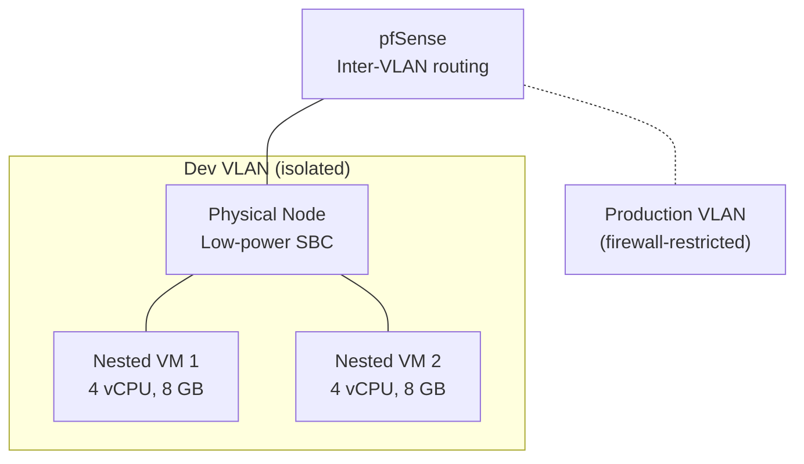

# 10 — Infrastructure & Resilience
> **Consolidates:** DEV-PROXMOX-CLUSTER-PLAN.md, DISASTER-RECOVERY-PLAN.md (originals archived in `plan/archive/`)
>
> **Depends on:** 00, 01
>
> Part of the dependency-ordered `plan/development/` set (00–10). The source
> plans are merged verbatim below under provenance dividers to preserve all
> detail; read in numbered order to execute.

<!-- ======================= source: DEV-PROXMOX-CLUSTER-PLAN.md ======================= -->

# Dev Proxmox Cluster Plan

**Date:** 2026-04-25
**Status:** PLANNING
**Context:** Build a separate "dev" Proxmox cluster for testing breaking changes, automation development, and upgrade rehearsals before applying them to the production cluster.

> **Full plan with network topology, IP allocations, and node configurations lives in the private `site-config` repository at `plan/DEV-PROXMOX-CLUSTER-PLAN.md`.** This stub exists in the public repo for cross-referencing only.

---

## Problem

All Proxmox automation (playbooks, Semaphore templates, cloud-init, proxmox_discovery worker, VM provisioning) is developed and tested directly against the production cluster. There is no safe environment to:

- Test Proxmox version upgrades before applying them to production nodes
- Validate breaking changes to `provision-vm.yml`, `proxmox-validate.yml`, or cloud-init templates
- Experiment with cluster operations (join/leave, quorum, HA) without risking production workloads
- Rehearse `proxmox_discovery` worker changes against a different cluster topology
- Test MAAS-based bare-metal provisioning workflows

## Architecture Overview

The dev cluster is a hybrid: one physical bare-metal node and two nested-virtualization VMs on the existing production Proxmox cluster, connected via a dedicated VLAN isolated from production traffic.

## Key Design Decisions

- **Nested virtualization** via `cpu: host` on KVM VMs — enables running VMs inside VMs for realistic testing
- **VLAN isolation** — dev cluster on a separate VLAN with firewall rules blocking production access
- **Shared Proxmox API** — dev nodes join a separate cluster but credentials are managed through OpenBao
- **ZimaBoard constraints** — 2 GB RAM limits the physical node to LXC containers and quorum participation only

## Cross-References

- `plan/architecture/01-automation-model.md` — composable tasks used for dev cluster provisioning
- `plan/architecture/05-platform-infra.md` — container runtime considerations for dev VMs
- `plan/architecture/04-credentials-access.md` — Semaphore vs direct access for dev cluster
- `site-config/plan/DEV-PROXMOX-CLUSTER-PLAN.md` — full implementation details (private)

<!-- ======================= source: DISASTER-RECOVERY-PLAN.md ======================= -->

# Disaster Recovery Plan

**Date:** 2026-05-06
**Status:** PLANNING -- Stub document. Full procedures to be developed.
**Context:** The agent-cloud platform currently has no documented disaster recovery procedures. When critical infrastructure fails (Semaphore down, OpenBao sealed, VM lost), operators rely on tribal knowledge and ad-hoc SSH access. This plan will codify recovery procedures for each failure scenario.

**References:**
- [ACCESS-BOUNDARIES.md](../architecture/ACCESS-BOUNDARIES.md) -- Access paths and escalation flow
- [CREDENTIAL-LIFECYCLE-PLAN.md](../architecture/CREDENTIAL-LIFECYCLE-PLAN.md) -- Credential storage, rotation, and audit
- [AUTOMATION-COMPOSABILITY.md](../architecture/AUTOMATION-COMPOSABILITY.md) -- Composable task library

---

## Problem Statement

The agent-cloud platform has a single-site deployment with no documented disaster recovery procedures. Key risks:

1. **Semaphore is a single point of failure** for all automated deployments. If the Semaphore VM is lost, no playbooks can be executed through the standard path.
2. **OpenBao sealed or lost** renders all secret-dependent deployments impossible. Services cannot start without their `.env` files, which are templated from OpenBao data.
3. **VM failure** for any service requires reprovisioning and redeployment, but the exact steps are scattered across playbooks and CLAUDE.md files.
4. **Data loss** (database volumes, configuration) has no backup or restore procedure.
5. **Credential compromise** has no documented incident response procedure.

---

## Scope

This plan will cover the following failure scenarios, roughly ordered by likelihood and impact:

### Scenario 1: Semaphore Unreachable

**Trigger:** Semaphore VM crashed, network partition, Semaphore service hung.

**Recovery outline:**
- [ ] Escalation path: UI -> API -> SSH diagnostics
- [ ] How to restart Semaphore service via SSH
- [ ] How to re-provision Semaphore VM from scratch
- [ ] How to restore Semaphore configuration (templates, environments, keys)
- [ ] Credential sources: `site-config/secrets/semaphore/`

### Scenario 2: OpenBao Sealed

**Trigger:** OpenBao VM rebooted, OpenBao process restarted, manual seal.

**Recovery outline:**
- [ ] Unseal procedure (key shard holders, threshold)
- [ ] Where unseal keys are stored
- [ ] How to verify OpenBao is healthy after unseal
- [ ] Impact assessment: which services are affected while sealed
- [ ] Auto-unseal considerations (future)

### Scenario 3: OpenBao Data Lost

**Trigger:** OpenBao VM disk failure, volume corruption.

**Recovery outline:**
- [ ] Restore from `site-config/secrets/` backup files
- [ ] Re-initialize OpenBao from scratch
- [ ] Re-create all policies from `.hcl` files via `apply-openbao-policies.yml`
- [ ] Re-create all AppRoles via `manage-approle.yml`
- [ ] Re-populate service secrets (which can be regenerated vs which are irrecoverable)
- [ ] Credential types that survive loss (regenerable) vs those that do not (external API keys)

### Scenario 4: Service VM Failure

**Trigger:** VM disk failure, hypervisor issue, accidental deletion.

**Recovery outline:**
- [ ] Provision new VM via `provision-vm.yml`
- [ ] Install runtime via `install-docker.yml`
- [ ] Distribute SSH keys via `distribute-ssh-keys.yml`
- [ ] Deploy service via `deploy-<service>.yml`
- [ ] Data recovery: which services have persistent state vs stateless
- [ ] Database restore procedures per service

### Scenario 5: Proxmox Hypervisor Failure

**Trigger:** Physical node failure, Proxmox cluster issue.

**Recovery outline:**
- [ ] Impact assessment: which VMs are on which node
- [ ] HA failover (if configured) vs manual migration
- [ ] Bare-metal recovery procedure
- [ ] Cluster quorum considerations (3-node minimum)

### Scenario 6: Credential Compromise

**Trigger:** Leaked AppRole secret_id, exposed SSH key, stolen API token.

**Recovery outline:**
- [ ] Immediate containment: revoke the compromised credential
- [ ] Blast radius assessment (see ACCESS-BOUNDARIES.md AppRole scope table)
- [ ] Rotation of all potentially affected credentials
- [ ] Audit log review (OpenBao audit backend, Semaphore task logs)
- [ ] Post-incident documentation

### Scenario 7: Complete Site Loss

**Trigger:** Catastrophic failure affecting all VMs.

**Recovery outline:**
- [ ] What survives: site-config repo (private, off-site), agent-cloud repo (GitHub)
- [ ] Bootstrap order: Proxmox -> OpenBao -> Semaphore -> all services
- [ ] Minimum viable recovery: OpenBao + Semaphore = can deploy everything else
- [ ] Time estimates per recovery phase

---

## Recovery Prerequisites

The following must be maintained for any DR scenario to succeed:

| Prerequisite | Location | Update Frequency |
|-------------|----------|-----------------|
| site-config repository | Operator workstation + private remote | On every credential change |
| OpenBao unseal key shards | Distributed to key holders | On OpenBao re-initialization |
| Semaphore API token | `site-config/secrets/semaphore/` | On Semaphore re-deploy |
| Proxmox API token | `site-config/secrets/` + OpenBao | On rotation |
| SSH backup keys | `site-config/secrets/` | On key rotation (annual) |
| VM specs and IP allocations | `site-config/proxmox/vm-specs.yml` | On VM provision/decommission |
| This DR plan | `plan/development/10-infra-resilience.md` | On infrastructure changes |

---

## Implementation Plan

| Phase | What | Effort | Priority |
|-------|------|--------|----------|
| 1. Document unseal procedure | OpenBao unseal key location, holders, threshold | Low | High |
| 2. Document Semaphore recovery | Re-provision VM, restore config, verify templates | Medium | High |
| 3. Per-service recovery runbooks | Step-by-step for each deployed service | Medium | Medium |
| 4. Backup automation | Scheduled database dumps, volume snapshots | High | Medium |
| 5. Recovery testing | Quarterly DR drill in isolated environment | High | Low (after 1-4) |
| 6. Complete site rebuild runbook | End-to-end from bare metal | High | Low |

---

## Cross-References

- **Access escalation flow:** See ACCESS-BOUNDARIES.md section 5 for the step-by-step escalation path
- **Credential backup locations:** See CREDENTIAL-LIFECYCLE-PLAN.md for what is stored where
- **Service dependency order:** See `deploy-all.yml` for the 4-phase deployment ordering
- **VM provisioning:** See `provision-vm.yml` and `platform/hypervisor/proxmox/` for cloud-init templates
