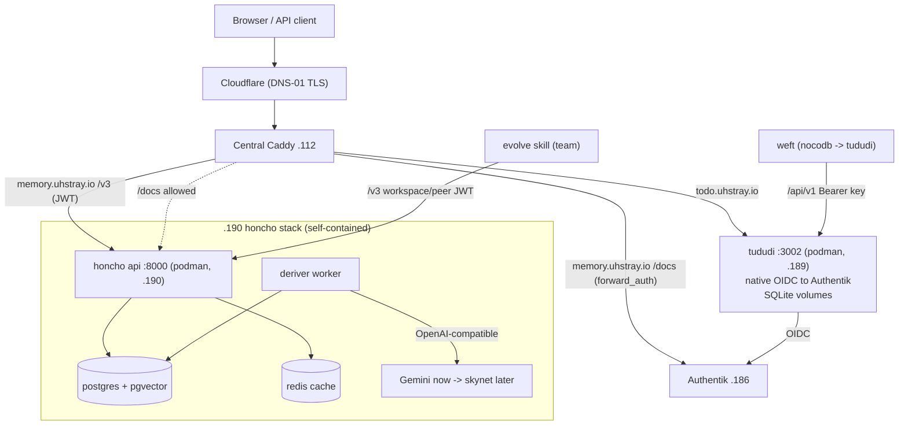

# 11 — tududi & honcho Deployment (todo.uhstray.io, memory.uhstray.io)

> **Depends on:** 00 (local-dev), 01 (secrets), 02 (sso-auth), 06 (skynet — honcho's eventual LLM)
>
> Part of the dependency-ordered `plan/development/` set (00–11). Read 00/01/02 first; this plan applies those conventions to two new services.

**Date:** 2026-07-07
**Status:** ACTIVE

**Context:** Onboard two new rootless-podman services through the composable pattern — **tududi** (self-hosted to-do app, `todo.uhstray.io`, VM `192.168.1.189`) and **honcho** (ambient memory / identity backend for AI agents, `memory.uhstray.io`, VM `192.168.1.190`). Local-dev first (`make local-deploy-*`), then promotion to the two prod VMs with Authentik SSO, Caddy public subdomains, per-service SSH keys and the UFW firewall. tududi becomes the migration sink for NocoDB work data (driven by **weft**); honcho becomes the self-hosted memory backend for the **evolve** skill and team collaboration.

## Decisions (settled 2026-07-07)

| # | Decision | Rationale |
|---|---|---|
| D1 | **tududi = native OIDC**, wired as an Authentik OIDC client via the app-manifest mechanism (not forward_auth) | tududi ships native multi-provider OIDC with an Authentik guide; cleaner than gating a whole app |
| D2 | **honcho = its own JWT auth** (`AUTH_USE_AUTH=true`) for the `/v3` API; **Authentik forward_auth only on the human `/docs`** | honcho's consumers (evolve, skills, agents) are non-interactive — a browser OIDC flow can't gate them; JWT + workspace/peer scoping is the native fit |
| D3 | **honcho LLM = interim external API (Gemini)** now, swap base-URL to skynet later | honcho's deriver/dialectic hard-require a tool-calling LLM; skynet isn't confirmed ready. Gemini key already exists at `secret/services/nemoclaw:gemini_api_key` and Gemini supports function-calling. The base-URL/transport is per-feature config, so the skynet swap is a config change, not a redeploy |
| D4 | **honcho image = CI → GHCR pinned tag**, `deploy.sh` only pulls | honcho has no prebuilt image; building in CI keeps `deploy.sh` container-lifecycle-only (Rule #2) and gives reproducible pins (mirrors wisbot) |
| D5 | **VMs .189/.190 already provisioned + SSH-password reachable** | go straight to key-hardening; no Proxmox clone step |
| D6 | **Both run rootless podman** (validated 2026-07-07) | Neither needs the root socket / privilege / ports <1024; matches the platform default (Authentik is rootless). Rootless keeps aardvark-dns in the user netns (container DNS never crosses host UFW — sidesteps the bridge-DNS issue entirely) and publishes ports on INPUT (plain `ufw allow`, no route rules). Validated: `podman-machine-default` rootless=true resolves a sibling container by name via an in-netns gateway |

## Architecture

Both services sit in the Platform layer and are reached through the central Caddy; tududi authenticates users against Authentik directly (OIDC), honcho authenticates API callers with its own JWTs and only defers `/docs` to Authentik.

## Shared approach (both services)

Per `02-service-onboarding.md` and `00-foundation-local-dev.md`, the two services share the entire mechanism; only inventory vars + SSO pattern + secrets differ ("one codebase, no forks"):

- **Service dir** `platform/services/<svc>/deployment/`: `deploy.sh` (lifecycle only — pull/up/wait-healthy, no secrets), `compose.yml`, `compose.local.yml` (SELinux `label=disable` + local port shifts), `templates/env.j2`, `CLAUDE.md`, `README.md`.
- **Playbook** `deploy-<svc>.yml` on the composable pattern: `manage-secrets` (define `_secret_definitions` + `_env_templates` + `_shared_reads`) → `deploy.sh` → health verify → (Caddy fragment only if `caddy_composable`; prod is flat, so Caddy is handled via `manage-caddy-sites.yml`). Plus `clean-deploy-<svc>.yml` via `tasks/clean-service.yml`.
- **Inventory in three files**: `platform/inventory/local-dev.yml.example` (local), `platform/inventory/production.yml` (public placeholders), `site-config/inventory/production.yml` (real IPs).
- **Semaphore templates**: add Deploy + Clean-Deploy to `platform/semaphore/templates.yml` (+ `templates-local.yml`), then run `setup-templates.yml`.
- **SSH + firewall order (verify-before-hardening — must not break access):**
  `store-ssh-password` → `generate-service-ssh-key` (ed25519 → OpenBao `secret/services/ssh/<svc>`, backed up to `site-config/secrets/ssh/<svc>/`) → `distribute-ssh-keys` (password still ON) → **verify key auth from Semaphore AND locally** → `harden-ssh` (disable password, NOPASSWD sudo, re-verify) → `apply-firewall` (**rootless**: leave `firewall_rootful` false; `firewall_detect_ports` + `firewall_upstream_source: 192.168.1.112` allow only the published port from the Caddy host on the INPUT chain). No route rules and no `firewall_allow_bridge_dns` — rootless podman runs aardvark-dns in the *user* netns, so container↔container name resolution (honcho api↔postgres↔redis) never crosses the host UFW, and rootless publishes ports via a host-side proxy on INPUT (a plain `ufw allow` reaches them).
- **Local-dev first**: `make local-deploy-<svc>` brings each up with wildcard DNS (`*.agent-cloud.test`) + the step-ca wildcard cert + a `caddy_routes` entry; validate before promoting.

## Service A — tududi

- **Classification:** Auxiliary (single container, SQLite, no runtime OpenBao) → 3-phase deploy variant. **Runtime:** podman. **VM .189:** modest (≈2 vCPU / 2–4 GB / 20 GB).
- **Container:** `chrisvel/tududi:latest` on **:3002**. **Persist named volumes:** `/app/backend/db` (SQLite + auto-backups) and `/app/backend/uploads`. **Health:** `GET /api/health` (unauthenticated).
- **`templates/env.j2` (non-secret + `{{ secrets.* }}` refs):**
  - `BASE_URL=https://todo.uhstray.io` (local: `https://todo.agent-cloud.test:8443`)
  - `TUDUDI_TRUST_PROXY=true` **(required behind Caddy or SSO sessions 401)**
  - `TUDUDI_ALLOWED_ORIGINS={{ base_url }}`
  - `PASSWORD_AUTH_ENABLED=false` (SSO-only) — keep a break-glass local admin created once via `TUDUDI_USER_EMAIL`/`TUDUDI_USER_PASSWORD`
  - `OIDC_ENABLED=true`, `OIDC_PROVIDER_NAME=Authentik`, `OIDC_PROVIDER_SLUG=tududi`, `OIDC_ISSUER_URL=https://auth.uhstray.io/application/o/tududi/`, `OIDC_CLIENT_ID=tududi`, `OIDC_CLIENT_SECRET={{ secrets.tududi_oidc_client_secret }}`, `OIDC_AUTO_PROVISION=true`, `OIDC_ADMIN_EMAIL_DOMAINS=uhstray.io`
  - `TUDUDI_SESSION_SECRET={{ secrets.tududi_session_secret }}`
  - **Slug consistency (per the tududi Authentik doc):** the Authentik application slug, `OIDC_PROVIDER_SLUG`, and the callback path must all be the same value — use `tududi`. Authentik signing key must be **RS256** (its default; tududi rejects ES256 and does not use PKCE).
  - **OIDC callback (register in Authentik as a Strict redirect URI):** `{BASE_URL}/api/oidc/callback/tududi`
- **Secrets (`_secret_definitions`):** `tududi_session_secret` (random, 64); initial admin password (`type: user` or random). **`_shared_reads`:** `tududi_oidc_client_secret` from `authentik` (Authentik owns it).
- **SSO (D1) — native OIDC via app-manifest:** add `blueprints/tududi-oidc.yaml` (`oauth2provider` `client_id: tududi`, `client_secret: !Env TUDUDI_OIDC_CLIENT_SECRET`, `redirect_uris` from `!Context tududi_redirect`) + a `core.application` slug `tududi`; add a `tududi` entry to `app-catalog.yml` (`type: oidc`, `tier: member`, `prod_required: [tududi_redirect_uri]`); add `tududi_oidc_client_secret` to `deploy-authentik.yml`'s `_secret_definitions`; enable in prod by adding `tududi` to `authentik_apps` in site-config inventory.
- **Caddy:** `todo.uhstray.io` → `tududi:3002`, Cloudflare DNS-01 (prod `caddy_managed_sites` via `manage-caddy-sites.yml`); local `caddy_routes: { host: todo.agent-cloud.test, upstream: local-tududi:3002 }`. Serve at subdomain root (no sub-path). No websockets.
- **weft migration hook (phase 3):** after first deploy, generate a tududi **personal API key** in the UI, store at `secret/services/tududi:api_token`; weft reads NocoDB and writes via `POST /api/v1/{tasks,projects,areas,tags,notes}` (Bearer). No NocoDB-native importer — weft owns the field mapping.

## Service B — honcho

- **Classification:** AI/heavy — 4 containers with its own datastore + a worker → full multi-phase deploy. **Runtime:** podman. **VM .190:** heavier (≈4 vCPU / 8 GB / 40 GB; Postgres+pgvector + deriver).
- **Containers (self-contained stack):** `api` :8000 (GHCR image), `deriver` (same image, worker, no port), `database` `docker.io/pgvector/pgvector:pg15` (internal :5432), `redis` `docker.io/redis:8.2` (internal :6379). honcho brings its **own** Postgres — not the platform Postgres. **Health:** `GET /health` (+ a `POST /v3/workspaces` smoke test for real readiness).
- **Image (D4):** a CI workflow builds honcho from source (`github.com/plastic-labs/honcho`) → `ghcr.io/uhstray-io/honcho:<pinned>`; `deploy.sh` pulls it for `api`+`deriver`. Pin the upstream commit/tag.
- **`templates/env.j2`:**
  - `DB_CONNECTION_URI=postgresql+psycopg://honcho:{{ secrets.honcho_db_password }}@database:5432/honcho`
  - `CACHE_ENABLED=true`, `CACHE_URL=redis://redis:6379/0?suppress=true`
  - `AUTH_USE_AUTH=true`, `AUTH_JWT_SECRET={{ secrets.honcho_jwt_secret }}`
  - **LLM (D3 — Gemini interim):** `LLM_GEMINI_API_KEY={{ secrets.gemini_api_key }}`; set each text-gen + embedding feature to `..._MODEL_CONFIG__TRANSPORT=gemini` + a `..._MODEL_CONFIG__MODEL=<gemini function-calling model>` (deriver, summary, dream, each `DIALECTIC_LEVELS__*`, embedding). **Skynet swap later:** flip transport to `openai` + `..._OVERRIDES__BASE_URL=<skynet /v1>` + `..._OVERRIDES__API_KEY_ENV=SKYNET_API_KEY` (config-only; models must support tool calling).
  - `EMBEDDING_VECTOR_DIMENSIONS=<match embed model>`.
- **Secrets (`_secret_definitions`):** `honcho_jwt_secret` (random), `honcho_db_password` (random, 32). **`_shared_reads`:** `gemini_api_key` from `nemoclaw`. **Team JWTs** (workspace/peer-scoped) are minted post-deploy (`generate_jwt.py --workspace` or `POST /v3/keys`) and stored under `secret/services/honcho/tokens/<member>` — this is the evolve/team-provisioning step (phase 4), not the deploy.
- **Auth (D2):** `AUTH_USE_AUTH=true`; team access = workspace/peer-scoped JWTs. **Tenancy for the team:** one workspace (e.g. `uhstray`), each teammate = a **peer** (stable id), a **session** per thread — gives shared-yet-isolated memory.
- **Caddy:** `memory.uhstray.io` → `honcho-api:8000`, Cloudflare DNS-01. **Path-scoped forward_auth:** a matcher for `/docs`, `/redoc`, `/openapi.json` (+ `/outpost.goauthentik.io/*`) runs Authentik forward_auth; `/v3/*` proxies straight through (JWT-authenticated). Requires an Authentik `proxyprovider` blueprint (`honcho-docs`, `mode: forward_single`, `external_host: memory.uhstray.io`) in `app-catalog.yml` as `type: forward_auth`, plus the path-matched block in `caddy_managed_sites`.
- **evolve hook (phase 4):** evolve points at `https://memory.uhstray.io/v3` with a workspace-scoped JWT; team members are peers in the shared workspace.

## Phase 1 — local-dev (both) ⬜

For each service (tududi first — simplest; then honcho):
1. Create `platform/services/<svc>/deployment/` (`deploy.sh`, `compose.yml`, `compose.local.yml`, `templates/env.j2`, `CLAUDE.md`, `README.md`).
2. Write `deploy-<svc>.yml` + `clean-deploy-<svc>.yml` (composable pattern).
3. Add the `<svc>_svc` group to the working local inventory + `local-dev.yml.example` (`ansible_host: 127.0.0.1`, `ansible_connection: local`, `service_name`, `monorepo_deploy_path`, `container_engine: podman`, `<svc>_port`).
4. Add the `caddy_routes` entry (tududi: plain; honcho: `/docs` forward_auth vs `/v3` direct) and re-run `make local-deploy-caddy`.
5. tududi: add `tududi` to the local `authentik_apps` (all catalog apps are enabled locally by default) + the `tududi-oidc.yaml` blueprint + catalog entry. honcho: add the `honcho-docs` forward_auth blueprint + catalog entry.
6. Add `Deploy <svc> (Local)` to `templates-local.yml`; `make local-bootstrap` (picks up templates), then `make local-deploy-<svc>` → `make local-validate`.
7. Acceptance: tududi — SSO login via Authentik, create+list a task, capture the API list envelope (weft needs it). honcho — `POST /v3/workspaces` returns an id (DB+migrations OK), a JWT-authenticated `/v3` call works, `/docs` prompts Authentik. **honcho note:** the deriver needs the real Gemini key even locally to actually derive; seed `secret/services/nemoclaw:gemini_api_key` into local OpenBao or accept "messages stored, not derived" for local acceptance.

**Gate:** both green in local-dev before any prod action.

## Phase 2 — prod promotion (both) ⬜

Per service, through Semaphore (Rule #1), on a feature branch → dev → main, branch-deploying to the VM:
1. **Inventory (site-config):** add the host under `virtualmachines` (`.189`/`.190` + `service_port`) and the `<svc>_svc` group with `service_name`, `service_url`, `health_path`, `monorepo_deploy_path`, `container_engine: podman`, plus Caddy + firewall vars (`firewall_ssh_cidrs`, `firewall_upstream_source: 192.168.1.112`; leave `firewall_rootful` false — rootless).
2. **SSH hardening (verify-before-hardening):** `store-ssh-password` → `generate-service-ssh-key` (→ OpenBao + back up to `site-config/secrets/ssh/<svc>/`) → `distribute-ssh-keys` → **verify key auth (Semaphore + local)** → only then `harden-ssh` → re-verify. Abort lockdown on any verify failure.
3. **Firewall:** `apply-firewall` with the vars above — rootless publishes the port on the host INPUT chain, so `firewall_detect_ports` + the Caddy-host allow is all that's needed (no route rules, no bridge-DNS rule). honcho publishes **only** the api :8000; its postgres/redis stay internal to the rootless network (no host port, no firewall rule).
4. **Authentik:** add `tududi` (OIDC) and `honcho-docs` (forward_auth) to `authentik_apps` in site-config inventory; set `tududi_redirect_uri` etc.; run Deploy Authentik (renders blueprints + bindings).
5. **Deploy:** run Deploy tududi / Deploy honcho templates (branch survey var). honcho also needs the GHCR image built+pushed by CI first.
6. **Caddy + public DNS:** create the Cloudflare A/records for `todo`/`memory.uhstray.io` (Cloudflare-side, outside the playbooks); append the site blocks to `caddy_managed_sites` (todo: plain reverse_proxy; memory: path-scoped forward_auth + `/v3` direct) and run `manage-caddy-sites.yml` (validates before load, restarts).
7. **Verify:** external SSO login (tududi), JWT `/v3` + gated `/docs` (honcho), health endpoints, and re-confirm SSH key-only + firewall via Validate All.

## Phase 3 — weft (NocoDB → tududi) — update `weft/weft-plan.md` ⬜

The weft-plan already scaffolds tududi but assumes `tududi.uhstray.io` + a manual Docker-Compose deploy. Re-point it at this deployment:
- Sink URL `https://todo.uhstray.io` (not `tududi.uhstray.io`); API base `/api/v1`; auth = Bearer **personal API key** stored at `secret/services/tududi:api_token`.
- Deploy is **agent-cloud composable/Semaphore/podman** (this doc), not weft's own compose — weft consumes the running tududi, it does not deploy it.
- Entity mapping targets: `areas`, `projects`, `tasks` (+subtasks/priority/due/recurrence), `tags`, `notes`. Migration writes via the REST API (or a synthesized backup-import JSON — capture the exact `version` from a live export first).
- Keep the NocoDB-work-tables inventory task; the destination field shapes come from a live tududi export.

## Phase 4 — evolve (honcho team memory) — update `huhhb/docs/evolve-plan.md` ⬜

- Point evolve at the **self-hosted** honcho: `base_url=https://memory.uhstray.io`, API `/v3`, auth = workspace/peer-scoped **JWT** (not OIDC).
- **Team collaboration model:** one shared workspace (`uhstray`); each team member is a **peer** (stable peer id); a **session** per conversation/thread. Mint a per-member workspace-scoped JWT (`generate_jwt.py --workspace uhstray` or `POST /v3/keys`), store under `secret/services/honcho/tokens/<member>`, and hand it to that member's evolve config. Cross-session peer representation gives each member durable, shared-yet-scoped memory.
- Note the interim Gemini LLM (D3) and the later skynet swap; note honcho's `/docs` is Authentik-gated while `/v3` is JWT.

## Sequencing, gates, risks

- **Order:** local-dev tududi → local-dev honcho → (gate) → prod tududi → prod honcho → weft-plan update → evolve-plan update. tududi leads (simpler, self-contained); honcho follows (LLM + build + 4 containers).
- **Gates:** local-dev green before prod; SSH key-auth verified before password lockdown (do **not** break access); CodeRabbit reviews the `dev → main` promotion; prod deploys run through Semaphore.
- **Risks:** (1) honcho deriver needs a **tool-calling** LLM — verify Gemini function-calling against honcho before relying on derivation. (2) honcho image must be CI-built to GHCR before the prod deploy. (3) VM reachability/size — confirm `.189/.190` respond on the default password and have headroom (honcho). (4) Rootless boot persistence: enable `loginctl enable-linger` for the service user so rootless containers auto-start on reboot (with `restart: always` in compose) — the rootless replacement for the rootful systemd concern. (5) Public `*.uhstray.io` DNS records are a Cloudflare-side step outside the playbooks.

## Open items

- [ ] Confirm skynet readiness + tool-calling; schedule the Gemini→skynet base-URL swap for honcho.
- [ ] Add a CI workflow to build+push `ghcr.io/uhstray-io/honcho`.
- [ ] Decide honcho VM sizing / whether Postgres backups need the o11y/backup path.
- [ ] Reconcile the site-config Semaphore compose drift (separate; from the prior task) so future compose syncs are safe.
