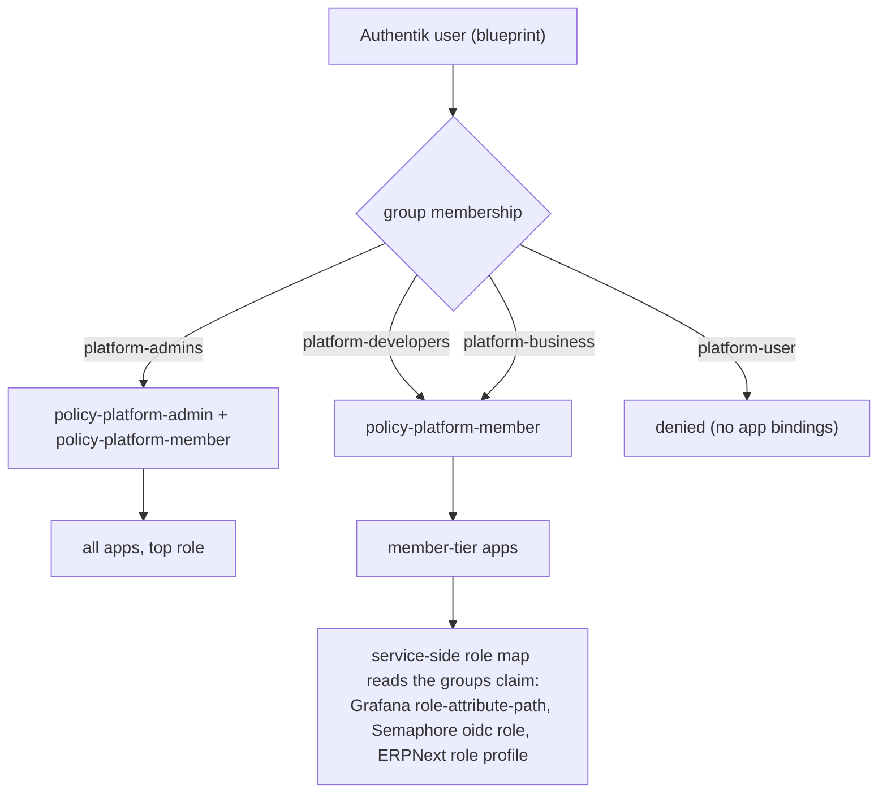

# 12 — RBAC user provisioning (idempotent Authentik users + per-service roles)

> **Depends on:** 02 (sso-auth / app-manifest mechanism), the `platform-groups.yaml` + `zz-sso-bindings.yaml.j2` RBAC layer, `deploy-authentik.yml`.

**Date:** 2026-07-08
**Status:** ACTIVE

**Context:** Add named human users to `auth.uhstray.io` as config-as-code, provisioned by an **idempotent** automation (re-running converges, never duplicates), and make the platform's access tiers translate to real per-service roles. First two users: a full **admin** (config prefix `wisward`, tier identical to `stray`) and a **developer + business** user (config prefix `andrew`). Their real usernames, display names, and emails live only in site-config (never this public repo). This is the foundational RBAC work that replaces hand-adding users in the Authentik UI.

## Decisions (settled 2026-07-08)

| # | Decision | Rationale |
|---|---|---|
| D1 | **Users are Authentik blueprints** (`authentik_core.user`), mirroring `stray-admin.yaml` | Blueprints are declarative — the worker reconciles them on every deploy, so "add a user" is idempotent by construction; no ad-hoc API calls (Critical Rule) |
| D2 | **Initial password = OpenBao-generated** per user (`!Env` from a `*_password` in `deploy-authentik.yml`), retrieved out-of-band, changed on first login | Matches the `stray` precedent; needs no email infra. **Future:** migrate to Authentik enrollment/recovery-link (self-set password) once prod SMTP is configured — see Open items |
| D3 | **Enforce per-service roles now**, not access-only | The access gate is binary (log-in-or-not); read-vs-write must be mapped service-side off the groups claim. The user asked for literal read/write, so we build those maps |
| D4 | **New `platform-business` group** for ERPNext read/write | The existing tiers are admins/developers/user; "business user" (ERP rw without dev access) is a distinct capability that ERPNext maps to a role |
| D5 | Emails live only in **site-config** (`!Env` `*_EMAIL`), never in this public repo | Repo rule: no real addresses/IPs in agent-cloud |

## The group model

Three tiers exist today (`platform-groups.yaml`): `platform-admins` (is_superuser), `platform-developers`, `platform-user`. This plan adds `platform-business`. Access is gated by two expression policies in `zz-sso-bindings.yaml.j2`; *roles within* an app are mapped service-side from the `groups` claim.

**Access-gate change:** `policy-platform-member` currently admits `{platform-admins, platform-developers}`. Add `platform-business` so a business user can reach their app(s). (Coarse-gate caveat in Open items.)

## Role matrix (what each group maps to per service)

| Service | Integration | platform-admins | platform-developers | platform-business | Enforcement point |
|---|---|---|---|---|---|
| Grafana | OIDC | Admin | **Editor** | Viewer | `GF_AUTH_GENERIC_OAUTH_ROLE_ATTRIBUTE_PATH` (groups claim) |
| Semaphore | OIDC | Admin (manual) | **read-only (default)** | — | Semaphore v2.18.12 has **no** group→role map (roadmap); OIDC users are non-admin by default, so developers land read-only automatically. Admins→admin must be promoted by hand Semaphore-side |
| ERPNext | OIDC | System Manager | (login only) | **read/write role profile** | Frappe social-login role assignment |
| tududi | OIDC | admin (email domain) | user (rw own tasks) | — | `OIDC_ADMIN_EMAIL_DOMAINS` (tududi side) |
| n8n | forward_auth | full use | full use | — | binary (community n8n has no SSO roles) |
| OpenHands | forward_auth | full use | full use | — | binary |
| NetBox | forward_auth | superuser/staff | access | — | `REMOTE_AUTH_*_GROUPS` (groups header) |
| OpenBao | forward_auth + oidc | admin (oidc, admin-tier) | access (forward_auth) | — | policy aliases (planned) |

- **andrew** = `platform-developers` + `platform-business` → Grafana Editor, Semaphore read-only, ERPNext rw, tududi/n8n/OpenHands full use.
- **wisward** = `platform-admins` → top role everywhere (identical to `stray`).
- **Groups claim:** VERIFIED — Authentik's default `profile` scope mapping emits `groups` (confirmed against the pinned 2024.12.3 blueprint; `[g.name for g in request.user.ak_groups.all()]`). The `openid email profile` scopes the providers already request are sufficient; no extra scope mapping needed.

## Build

1. **`blueprints/platform-groups.yaml`** — add the `platform-business` group (is_superuser false).
2. **`blueprints/platform-users.yaml`** (new, idempotent) — `authentik_core.user` for `wisward` (groups: platform-admins) and `andrew` (groups: platform-developers + platform-business), emails + passwords via `!Env`, mirroring `stray-admin.yaml`. (Or one blueprint file per user — match the repo's one-file-per-admin style.)
3. **`deploy-authentik.yml`** — add `wisward_password`, `andrew_password` to `_secret_definitions` (random, generated once); `env.j2` exposes `WISWARD_PASSWORD/EMAIL`, `ANDREW_PASSWORD/EMAIL` (emails defaulted to `agent-cloud.test`, prod values from site-config).
4. **`zz-sso-bindings.yaml.j2`** — add `platform-business` to the `platform-member` allowed set.
5. **Per-service role maps (D3):**
   - Grafana: ensure the provider emits `groups` + set `GF_AUTH_GENERIC_OAUTH_ROLE_ATTRIBUTE_PATH` so admins→Admin, developers→Editor, else Viewer.
   - Semaphore: map the groups claim so developers→read-only (not admin).
   - ERPNext: map `platform-business`→a read/write role profile via Frappe social login.
6. **site-config** (private) — the real usernames / display names / emails for both users in the Authentik host vars (`WISWARD_*`, `ANDREW_*`).

## Validate (local-dev first)

Local-dev runs the same blueprints. `make local-deploy-authentik` → confirm: both users exist, group memberships correct, `make local-creds`-style retrieval of the generated passwords, and a login as each resolves to the expected role (Grafana Editor for andrew, read-only Semaphore, ERPNext rw). Then promote through `dev` → `main` and run Deploy Authentik in prod.

## Sequencing, gates, risks

- **Order:** groups + users + gate (authentik-core) → per-service role maps → local validate → PR → prod.
- **Risks:** (1) if the `groups` claim isn't emitted, service role maps silently fall back to the default (viewer/none) — verify the claim first. (2) ERPNext role assignment via Frappe social login is fiddly — validate the exact role profile locally. (3) rotating a user's `*_password` in OpenBao would reset their login — generate once + reuse (like stray).

## Open items

- [ ] Migrate D2 to **Authentik enrollment/recovery-link** once prod Authentik SMTP is configured (users self-set passwords; nothing stored).
- [ ] **Coarse-gate caveat:** `policy-platform-member` admits a group to *all* member-tier apps. A business-**only** user (not a developer) would therefore also reach non-ERP apps. Restricting a group to specific apps needs per-app policy bindings (per-group), not the single member gate — build when a business-only user exists. andrew is unaffected (he's a developer too).
- [ ] Generalize to a data-driven `authentik_users` inventory var (list of {username, email, groups}) so future users are one inventory line, not a new blueprint file.
