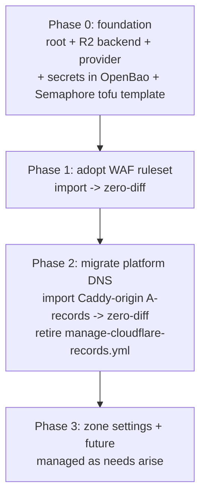

# 13 — Cloudflare as Code (OpenTofu via Semaphore)

> **Depends on:** 00 (foundation), 01 (secrets), 02 (SSO — the WAF rule that
> started this protects the honcho API behind Cloudflare).
>
> **Status:** **Phases 1-2 DONE** — the WAF ruleset (`waf.tf`) and the 14
> platform DNS records (`dns.tf`) are adopted into OpenTofu at zero-diff, state
> in Cloudflare R2. CF secrets seeded to OpenBao + `uhstray-tfstate` R2 bucket
> created. REMAINING: the Semaphore `tofu` template for steady-state plan/apply
> (bootstrap was run locally in a tofu container against the R2 backend), and
> Phase 3. **Owner:** uhstray-io.

**Goal:** manage Cloudflare **as code** — OpenTofu roots run through Semaphore —
as the platform standard for every future Cloudflare change (WAF rulesets, DNS,
zone settings). Manual API pokes and the legacy Ansible DNS playbook are
superseded. Changes flow through `plan` (drift-visible) and a gated `apply`,
in dependency order like the rest of the platform.

## 1. Why (decision criteria)

| Option | Verdict |
|--------|---------|
| **OpenTofu (chosen)** | Declarative; `plan` shows drift/diff before any change; the `cloudflare` provider models rulesets + DNS natively; tofu + terraform binaries are already in the Semaphore image (zero install friction); industry-standard, portable, a foundation for more IaC. |
| Ansible (`manage-cloudflare-records.yml`, current) | Fits the existing pattern and works for DNS, but idempotency is hand-written per-resource, there is no `plan`/drift view, and rulesets would be a bespoke `uri` reconcile. Kept for DNS only until Phase 2 migrates it. |
| Terraform (HashiCorp) | Same model as OpenTofu but BSL-licensed; OpenTofu (MPL, already in the image) is preferred. |

**State backend: Cloudflare R2 (S3-compatible).** Durable, self-hosted (matches
the platform ethos), and the R2 keys already exist in site-config. State holds
secrets, so it is never committed; the bucket/endpoint (account-id-bearing) are
supplied via partial `-backend-config` so nothing environment-specific reaches
the public repo.

## 2. Ownership boundary (critical)

OpenTofu manages ONLY declared resources; it never deletes what it does not
declare. The `uhstray.io` zone has ~50 records, **most external** — those stay
out of tofu deliberately:

- Email (ProtonMail MX/SPF/DKIM/DMARC), Microsoft enrollment, Shopify,
  Teams/Lync SRV, `_domainconnect`, Cloudflare Access (`cloud`).
- External hosts: `teleport`, `rustdesk`, `press` (WordPress.com), `redash`.
- **`_acme-challenge.*` TXT — created/deleted dynamically by Caddy's DNS-01.**
  tofu must never own these or it fights Caddy.

In scope: the `http_request_firewall_custom` ruleset, and the platform service
A-records that point at the Caddy origin (`*.uhstray.io` → the prod Caddy IP).

## 3. Dependency-ordered phases

- **Phase 0 — Foundation.** `platform/infra/cloudflare/` (versions/variables/
  README/imports). Store the CF API token (Zone Read + WAF/Rulesets Edit + DNS
  Edit) at OpenBao `secret/services/cloudflare:api_token` and the R2 state keys
  at `:r2_access_key_id` / `:r2_secret_access_key` (via `seed-openbao-key.yml`).
  Create the R2 state bucket. Add the Semaphore `tofu` template (repo=agent-cloud,
  subdir=`platform/infra/cloudflare`, environment = token + R2 keys + zone id).
- **Phase 1 — Adopt the WAF ruleset.** Import the existing
  `http_request_firewall_custom` entrypoint (3 geo/AI block rules + the honcho
  `/health`+`/v3` skip rule created via API) with `-generate-config-out`; move
  the generated HCL into `waf.tf`; `plan` MUST be zero-diff. No apply needed —
  pure adoption.
- **Phase 2 — Migrate platform DNS.** Import each Caddy-origin platform A-record
  (`auth/canvas/memory/n8n/netbox/nocodb/o11y/semaphore/todo/...`) the same way;
  `plan` zero-diff; then retire `manage-cloudflare-records.yml` (leave a pointer).
  External/email/ACME records stay unmanaged.
- **Phase 3 — Zone settings + future.** Bring settings (security level, SBFM
  config, etc.) under tofu as needs arise. New CF work starts here by default.

## 4. Guardrails

- **Adopt with zero-diff.** Every existing resource is imported; `plan` must show
  "No changes" before it is considered managed. This is why bringing prod DNS
  under tofu changes nothing live.
- **Gated apply.** `plan` on PR; `apply` only on merge to `main`, reviewed.
- **Never own external/ephemeral records** (§2) — especially `_acme-challenge`.
- **No secrets/ids in the public repo.** Token + R2 keys via env from OpenBao;
  bucket/endpoint/zone id via partial backend config + `TF_VAR_zone_id`.

## 5. Bootstrap runbook

See `platform/infra/cloudflare/README.md` (init with partial backend config →
`import` + `-generate-config-out` → move HCL in → `plan` zero-diff → gated apply).
The one-time bootstrap import can run from a local `tofu` or the Semaphore tofu
template; steady state is always Semaphore.
