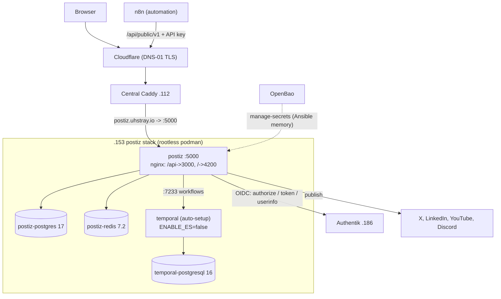

# 14 — Postiz Social Publishing (postiz.uhstray.io)

> **Depends on:** 00 (local-dev), 01 (secrets), 02 (sso-auth), 11 (tududi/honcho — the rootless-podman + native-OIDC pattern this reuses)
>
> Part of the dependency-ordered `plan/development/` set (00–14). Read 11 first: this plan applies the same mechanism to a heavier stack.

**Date:** 2026-08-21
**Status:** ACTIVE

**Context:** Onboard **Postiz** — self-hosted social-media scheduling and publishing — as a composable rootless-podman service at `postiz.uhstray.io`, on an existing prod VM reachable today only by bootstrap password. Postiz becomes the publishing plane for uhstray's social presence; **n8n** drives it over the Postiz public API to automate post creation, media upload, and scheduling. Local-dev first (`make local-deploy-postiz`), then promotion to the prod VM with Authentik SSO, a Caddy public subdomain, a per-service SSH key, and the UFW firewall.

The service directory exists today as a **compose-only stub with hardcoded credentials** (`platform/services/postiz/deployment/compose.yml`) and no automation — flagged in the archived lint plan as "must not be deployed anywhere". This plan replaces it.

## Decisions (settled 2026-08-21)

| # | Decision | Rationale |
|---|---|---|
| D1 | **Pin `v2.23.0` and run a TRIMMED Temporal** — `postiz` + `postiz-postgres` + `postiz-redis` + `temporal` + `temporal-postgresql` (5 containers) | Postiz ≥ v2.12.0 executes scheduled publishing through Temporal (`apps/orchestrator` is a Temporal worker), so Temporal is not optional for the actual goal. Upstream's reference compose adds Elasticsearch, `temporal-ui`, and `temporal-admin-tools` — none is needed: `temporalio/auto-setup` runs standard visibility on its Postgres with `ENABLE_ES=false`. Pinning beats `:latest` (SOURCE-OF-TRUTH §1.2) |
| D2 | **Config via Option B** — app config in `config/postiz.env` bind-mounted at `/config/postiz.env`; compose *substitution* vars in a separate `.env` | Option B is the only variant where the 60+ provider secrets are never subject to compose `$`-interpolation (a `$` inside a client secret silently corrupts Option A/C). It also maps 1:1 onto OpenBao → Jinja2 → env-file, so no secret enters git |
| D3 | **Native OIDC to Authentik** (`POSTIZ_GENERIC_OAUTH`), not Caddy forward_auth | Postiz ships a generic OIDC provider; Authentik is the platform IdP. Decisive factor: forward_auth would gate `/api/public/v1` too, breaking n8n's API-key calls unless every API path were exempted. In-app OIDC leaves the API path clean. Same shape as tududi (D1 in plan 11) |
| D4 | **n8n reaches Postiz over the public host** `https://postiz.uhstray.io/api/public/v1` | No extra firewall rule (Caddy is already the only permitted upstream), TLS end-to-end, and identical to how any external caller integrates. A direct LAN path would add a second access route to maintain in cleartext |
| D5 | **Greenfield** — no data migrated from the `dev-test` instance | Nothing of value there; a fresh DB lets `manage-secrets` own a strong generated password instead of inheriting the upstream default `postiz-user:postiz-password` |
| D6 | **Local media storage** (`STORAGE_PROVIDER=local`) on a named volume | Matches the prior deployment, zero extra config, no external dependency. R2 stays a config-only swap (`CLOUDFLARE_*`) if volume backup ever becomes the constraint |
| D7 | **VM `.153` already exists and is bootstrap-password reachable** (user `uhstray`, password backed up at `site-config/secrets/ssh_password.txt`) | Go straight to key-hardening; no Proxmox clone step. Mirrors D5 in plan 11 |
| D8 | **Local-dev validated before prod** | The Temporal trim (D1) is unverified by anyone upstream. The local stack is where "does a scheduled post actually fire" gets answered, before the prod VM is touched |
| D9 | **Registration lockdown is an inventory var, not a manual step** — `postiz_disable_registration` (`false` → first OIDC login → `true` → redeploy) | `DISABLE_REGISTRATION=true` permits one signup then closes. Encoding the flip as a var keeps it idempotent and re-runnable instead of a hand-edit on the VM (Engineering Principle #3) |

## Upstream facts that constrain the design

Read from source, because the docs do not state them:

1. **The OIDC redirect URI is hardcoded.** `apps/backend/src/services/auth/providers/oauth.provider.ts` builds `redirect_uri` as `` `${FRONTEND_URL}/settings` `` in *both* `generateLink()` and `getToken()`. There is no configurable callback path. Authentik's strict redirect URI must therefore be `<public-url>/settings`.
2. **The OIDC scope is hardcoded** to `openid profile email`. `POSTIZ_OAUTH_SCOPE` appears in upstream's compose and `.env.example` but is **never read** by the provider — do not template it.
3. **Postiz identifies the user from `userinfo`, not from an `id_token`** — it reads `email` and `sub` off the userinfo response using the access token. Consequences: the Authentik provider MUST have the `email` scope mapping attached (a missing claim fails login), and the signing key / PKCE are irrelevant to the flow.
4. **One port fronts everything.** `var/docker/nginx.conf` listens on `:5000` and splits internally: `/api/` → `:3000` (backend), `/uploads/` → static, `/` → `:4200` (frontend). Caddy needs exactly one `reverse_proxy` target, no path routing.
5. **The OIDC callback lands on `/settings`, then the Next.js proxy re-dispatches it.** `apps/frontend/src/proxy.ts` rewrites a code arriving at `/settings` to `/auth?...&provider=GENERIC`. So `/settings` must be publicly reachable and `FRONTEND_URL` must equal the browser-visible origin exactly.
6. **`NOT_SECURED` is documented dev-only** ("disables security checks"). The `dev-test/.env` sets it; it is **not** carried over.

## Architecture



Postiz sits in the Platform layer, reached through the central Caddy. Users authenticate against Authentik via Postiz's own OIDC client; n8n authenticates with a Postiz API key on the public API path, which is deliberately ungated at the edge (D3).

## Component design

### Service directory — `platform/services/postiz/deployment/`

| File | Role |
|------|------|
| `compose.yml` | **rewritten.** 5 services, env-parameterized (`${POSTIZ_IMAGE}`, `${POSTIZ_BIND}`, `${POSTIZ_PORT}`, `${POSTIZ_DB_PASSWORD}`, `${TEMPORAL_DB_PASSWORD}`). No literal credentials. Postiz gets `volumes: [./config/postiz.env:/config/postiz.env:ro, postiz-config:/config/, postiz-uploads:/uploads/]`. Healthchecks on all five; `depends_on: service_healthy` for postgres, redis, temporal |
| `compose.local.yml` | Slim overlay: `mem_limit` per container, `security_opt: label=disable` (podman-machine enforces SELinux on named-volume mounts), the `local-dev` external network on `postiz` **only**, and the step-ca root mount + `NODE_EXTRA_CA_CERTS` for server-side OIDC TLS. Port/bind stay env-driven in the base — compose *appends* `ports`, so an overlay can never remove a base publish |
| `deploy.sh` | Container lifecycle only (Rule #2): `detect_runtime` → verify both rendered env files present → `compose pull` → `compose up -d --force-recreate` → `wait_for_healthy postiz 300`. `--force-recreate` because an `env_file`/mounted-config content change is not a compose-spec change, so plain `up -d` would leave stale env loaded (the honcho lesson). 300s: first boot runs Prisma migrations *and* Temporal schema setup |
| `templates/env.j2` | Compose substitution only — image tags, bind/port, the two Postgres passwords |
| `templates/postiz.env.j2` | **Option B payload.** All app config: URLs, `JWT_SECRET`, `DATABASE_URL`, `REDIS_URL`, `TEMPORAL_ADDRESS`, `IS_GENERAL`, `RUN_CRON`, `DISABLE_REGISTRATION`, `API_LIMIT`, storage vars, the OIDC block, and every social provider slot (empty-rendered when unseeded, so adding a provider later is a seed + redeploy with no code change) |
| `README.md` / `CLAUDE.md` | Operator + agent docs |

Also `platform/services/postiz/context/use-cases.md` — the n8n integration contract (see Phase 4).

### Secrets — `secret/services/postiz`

| Key | Type | Source |
|---|---|---|
| `jwt_secret` | random 64 | generated once by `manage-secrets`, reused thereafter |
| `db_password` | random 32 | generated once, reused |
| `temporal_db_password` | random 32 | generated once, reused |
| `discord_client_id`, `discord_client_secret`, `discord_bot_token_id` | seeded | `seed-postiz-secrets.yml` |
| `linkedin_client_id`, `linkedin_client_secret` | seeded | `seed-postiz-secrets.yml` |
| `x_api_key`, `x_api_secret` | seeded | `seed-postiz-secrets.yml` |
| `youtube_client_id`, `youtube_client_secret` | seeded | `seed-postiz-secrets.yml` |
| `postiz_oidc_client_secret` | `_shared_read` | owned by `authentik`; never stored back here |

All three generated values are **stateful**: a new `jwt_secret` invalidates every session and API key; a new DB password locks the app out of its existing volume. `manage-secrets` generate-once-then-reuse is what protects them across redeploys.

Client *IDs* are not strictly secret but live in OpenBao alongside their secrets — one fetch, one source of truth, and no risk of an ID landing in a committed inventory file.

### Authentik OIDC client

New `platform/services/authentik/deployment/blueprints/postiz-oidc.yaml`, cloned from `tududi-oidc.yaml`:

- `client_id: postiz`, `client_type: confidential`, `client_secret: !Env POSTIZ_OIDC_CLIENT_SECRET`
- `redirect_uris`: `matching_mode: strict`, url `!Context postiz_redirect` — rendered from `postiz_redirect_uri`, which **must** be `<public-url>/settings` (upstream fact 1)
- `property_mappings`: `openid`, `profile`, `email` — `email` is load-bearing (upstream fact 3)
- `signing_key`: RS256 self-signed, as tududi. Unused by this flow but harmless and consistent
- `authentik_core.application` slug `postiz`, `meta_launch_url` = the public URL

`deploy-authentik.yml` templates the blueprint and injects `POSTIZ_OIDC_CLIENT_SECRET` into the worker env from OpenBao; Postiz reads the same value via `_shared_reads`. No secret in git.

**Local-dev TLS trust:** Postiz's Node backend makes server-side calls to Authentik's token and userinfo endpoints at `https://auth.agent-cloud.test:8443` (a step-ca-minted leaf). `deploy-postiz.yml` includes `tasks/distribute-ca-root.yml` gated on `local_mode`, and `compose.local.yml` mounts the bundle and sets `NODE_EXTRA_CA_CERTS` — the exact tududi pattern. Prod needs none of this (public chain).

### Edge

**Local** — one `caddy_routes` entry in `local-dev.yml`(+`.example`):
```yaml
- { host: postiz.agent-cloud.test, upstream: "postiz:5000" }
```
Wildcard DNS (`* IN A 127.0.0.1`) already resolves the name; no zone record needed. No `forward_auth` (D3).

**Prod** — a `postiz.uhstray.io` block appended to `caddy_managed_sites` in site-config (the central Caddy is a flat hand-managed Caddyfile, `caddy_composable: false`), with Cloudflare DNS-01 `tls` and `reverse_proxy <vm>:5000`. Applied by `manage-caddy-sites.yml`, which validates in-container and rolls back on failure. DNS record `postiz.uhstray.io` is created by the operator in Cloudflare.

### Firewall (prod)

`apply-firewall.yml` with dynamic detection. Rootless podman → publishes on INPUT, so plain `ufw allow` suffices: **no** `firewall_rootful`, **no** route rules, **no** `firewall_allow_bridge_dns` (aardvark-dns lives in the user netns, so container↔container name resolution never crosses host UFW).

Result: SSH (22) from `firewall_ssh_cidrs` only, and the detected `:5000` from `firewall_upstream_source` (the central Caddy) only. Temporal's `:7233` and both Postgres publish **no** host port — they are internal to the compose network — so no rule is emitted for them. This satisfies "only SSH and Postiz ports open" by construction rather than by enumeration.

Break-glass if ever locked out: the Proxmox web console reaches the VM out-of-band; `ufw disable` there.

## Phase 1 — VM access hardening (prod `.153`)

**This phase must never lose access to the machine.** Every step is a separate Semaphore run with an explicit verification gate; the irreversible step (`harden-ssh`, which disables password auth) runs **only** after key auth has been independently proven twice. Credentials are captured into OpenBao *before* anything is changed, so OpenBao — not a local file — is the source of truth from step 1.

| # | Step | Run | Verification gate — **must pass before the next step** |
|---|------|-----|--------------------------------------------------------|
| 1.1 | **Capture the bootstrap credential into OpenBao** | `Store SSH Password` (`store-ssh-password.yml`), `-e ssh_password=<from site-config/secrets/ssh_password.txt>` | `Check Secrets` shows `become_password` + `login_password` present at `secret/services/ssh`, and the management keypair fields (`public_key`/`private_key`) are **untouched** (the playbook merges additively). Confirms `harden-ssh` will be able to obtain sudo later |
| 1.2 | **Register the host in inventory** | edit `site-config/inventory/production.yml`: `postiz_svc` group, host `postiz` at `.153`, `ansible_user: uhstray`, `service_name: postiz`, `monorepo_deploy_path`, `container_engine: podman` | `ansible -m ping` (or a Semaphore no-op run) reaches the host **by password**. This is the baseline access we are protecting |
| 1.3 | **Mint the per-service key** | `Generate Service SSH Key` `-e service_name=postiz` | `secret/services/ssh/postiz` holds a `public_key`/`private_key` pair. Idempotent and non-rotating — a re-run never replaces a live key. Back the pair up to `site-config/secrets/ssh/postiz/` |
| 1.4 | **Distribute keys (password still enabled)** | `Distribute SSH Keys` `-e target_service=postiz_svc` | Playbook reports 2 keys in `authorized_keys` (management + per-service). **Purely additive** — it does not touch `sshd_config`, so password auth remains as the fallback |
| 1.5 | **Prove key auth — twice, from both directions** | manual | (a) A Semaphore run against `postiz_svc` succeeds with the **key** credential, not the password. (b) `ssh -i <key> -o PasswordAuthentication=no -o PubkeyAuthentication=yes uhstray@<postiz-vm> 'sudo -n true \|\| true; hostname'` succeeds from the operator workstation. **If either fails, STOP** — do not proceed to 1.6. Password auth is still the safety net at this point, and 1.6 removes it |
| 1.6 | **Install the container runtime** (before hardening — needs sudo, and a working `apt` proves become still functions) | `Install Podman` `-e target_service=postiz_svc` | `podman --version` and a compose entrypoint both resolve on the host |
| 1.7 | **Harden sshd** — the irreversible step | `Harden SSH` `-e target_service=postiz_svc` | The playbook self-verifies: NOPASSWD sudo drop-in written under `visudo -c` validation, password auth **rejected**, key auth **still working**. Independently re-confirm 1.5(b) afterward. Sources the sudo password from OpenBao (1.1) — which is why 1.1 comes first |
| 1.8 | **Firewall, pass 1 — SSH only** | `Apply Firewall` `-e target_service=postiz_svc` | No containers are running yet, so detection finds no ports and only the SSH allows are emitted. Anti-lockout is built in: SSH allows are added **before** `ufw enable`, then a fresh handshake is forced (`meta: reset_connection`) to prove the runner was not locked out. Re-verify SSH from the workstation. `ufw status` shows 22/tcp from the admin CIDRs and nothing else inbound |

Pass 2 of the firewall (picking up the detected `:5000`) runs in Phase 3, after containers exist — `apply-firewall.yml` is idempotent and designed to be re-run.

**Ordering rationale, explicitly:** credential into OpenBao (1.1) → keys added alongside the password (1.3–1.4) → key auth proven while the password fallback still exists (1.5) → only then the password removed (1.7) → only then the network path narrowed (1.8). Every step is additive or reversible except 1.7, and 1.7 is gated on a double verification. This is the platform's "verify before hardening" rule (Critical Deployment Rule #5) applied step by step.

## Phase 2 — Build and validate on local-dev

| # | Step | Verification |
|---|------|--------------|
| 2.1 | Write the service directory (`compose.yml` rewrite, `compose.local.yml`, `deploy.sh`, both templates, docs) | `yamllint`, `shellcheck`, `hadolint` clean |
| 2.2 | Write `deploy-postiz.yml` + `clean-deploy-postiz.yml` + `seed-postiz-secrets.yml` | `ansible-lint` clean |
| 2.3 | Add `postiz-oidc.yaml` blueprint; wire `POSTIZ_OIDC_CLIENT_SECRET` into `deploy-authentik.yml`'s worker env + `_secret_definitions` | `ansible-lint` clean |
| 2.4 | Register `postiz_svc` in all three inventory files (`local-dev.yml`, `local-dev.yml.example`, and the public-placeholder `platform/inventory/production.yml`); add the Caddy route; add `Deploy Postiz (Local)` + `Clean Deploy Postiz (Local)` to `templates-local.yml`, and `Deploy Postiz` + `Clean Deploy Postiz` + `Seed Postiz Secrets` to `templates.yml` | `make local-bootstrap` picks up the new templates; `setup-templates.yml` is what publishes the prod three |
| 2.5 | `seed-postiz-secrets.yml` against the local OpenBao | `Check Secrets` lists all 9 seeded provider keys |
| 2.6 | `make local-deploy-authentik` | Blueprint applied; the `postiz` application + provider exist in Authentik |
| 2.7 | `make local-deploy-postiz` | All 5 containers healthy. `postiz.env` rendered `0600` with no unsubstituted `{{` |
| 2.8 | Browse `https://postiz.agent-cloud.test:8443` | Page loads over the step-ca wildcard cert; the login screen shows the **Authentik** button |
| 2.9 | **OIDC round-trip** | Authentik login → redirect to `/settings` → session established, account created. Failure here is almost always a redirect-URI mismatch or a missing `email` claim (upstream facts 1 and 3) |
| 2.10 | Flip `postiz_disable_registration: true`, redeploy | A second, unknown identity can no longer register |
| 2.11 | **The Temporal gate (D1/D8).** Connect one account, schedule a post a few minutes out | The post actually publishes. Confirms `ENABLE_ES=false` standard visibility is sufficient for `apps/orchestrator`. **If it fails**, add Elasticsearch back as an inventory-gated compose block and re-run — the fallback is designed in, not improvised |
| 2.12 | Generate a Postiz API key; call `GET /api/public/v1/posts` | 200 with the key, 401 without. Proves the API path is ungated at the edge (D3/D4) |
| 2.13 | BATS coverage for `deploy.sh`; `make local-smoke --full` | Green, and the new tests fail if `deploy.sh` regresses |

## Phase 3 — Promote to prod

1. Feature branch → PR into `dev`; `/simplify` + `/security-review`; all CI checks green (this repo's CI gates on ruff/shellcheck/ansible-lint/yamllint/hadolint, trufflehog/bandit, pytest + BATS). Merge with a **merge commit**.
2. Add the prod `postiz_svc` vars to **site-config** (real IPs; the public `platform/inventory/production.yml` carries only placeholders, added in 2.4): `postiz_public_url: https://postiz.uhstray.io`, `postiz_redirect_uri: https://postiz.uhstray.io/settings`, `postiz_bind`, `postiz_port: 5000`, `firewall_upstream_source` (inherited from group vars), image tag pin.
3. Operator: create the `postiz.uhstray.io` DNS record in Cloudflare.
4. **Operator: update the OAuth redirect/callback URIs at Discord, LinkedIn, X, and YouTube** to the new host. Automation cannot reach those consoles; connecting an account fails until this is done.
5. `dev` → `main` promotion PR (merge commit), so prod Semaphore deploys from `main`.
6. Prod Semaphore, in order: `Seed Postiz Secrets` → `Check Secrets` → `Deploy Authentik` (applies the blueprint with prod URLs) → `Deploy Postiz` → verify 5 containers healthy → `Manage Caddy Sites` → verify `https://postiz.uhstray.io` serves → **`Apply Firewall` pass 2** (now detects `:5000` and allows it from the Caddy host only) → re-verify the public URL still serves and SSH still works.
7. First OIDC login on prod, then flip `postiz_disable_registration: true` and redeploy.

## Phase 4 — n8n integration contract

No n8n deployment or configuration work — only the documented contract, so the automation can be built against a stable surface. `platform/services/postiz/context/use-cases.md` records:

- **Base URL** `https://postiz.uhstray.io/api/public/v1`, API key from the Postiz UI (Settings), stored in OpenBao at `secret/services/n8n` when n8n workflows are built.
- **Flow**: upload media → create post with channel selection + scheduled time → poll/verify. Postiz's Temporal orchestrator owns execution; n8n's job ends at scheduling.
- **Rate ceiling**: `API_LIMIT` (upstream default 90/hr on the create-post endpoint) is the budget n8n workflows must respect. Templated as `postiz_api_limit` so it is tunable from inventory.
- **Why the public host and not the LAN** (D4), so a future contributor does not "optimize" it into a direct call and quietly add a second unencrypted access path.

## Risks and open items

| Risk | Mitigation |
|---|---|
| **The trimmed Temporal (D1) is unverified upstream** — nobody publishes a Postiz + `ENABLE_ES=false` configuration | Phase 2.11 is a hard gate before prod is touched. Fallback (add Elasticsearch back as an inventory-gated compose block) is designed in |
| The dev-test social credentials have sat in a plaintext `.env` | Seeded as-is now (operator decision), but treat rotation as a follow-up; OpenBao becomes the source of truth so rotation is a `seed-postiz-secrets` re-run |
| OAuth redirect URIs at four providers need manual updates | Called out as Phase 3 step 4; account connection is the visible failure if skipped |
| `FRONTEND_URL` must match the browser origin **exactly**, and locally that includes `:8443` unless `make local-https` is running | Parameterized as `postiz_public_url` per environment, never a constant |
| Uploads live on a VM volume (D6) | Accepted. R2 is a config-only swap (`STORAGE_PROVIDER=cloudflare` + `CLOUDFLARE_*` from OpenBao) if VM loss becomes the concern |
| `postiz-config` named volume and the `:ro` bind at `/config/postiz.env` overlap on `/config` | Bind the single file, not the directory, so the named volume still serves the rest of `/config`. Verified in Phase 2.7 |
