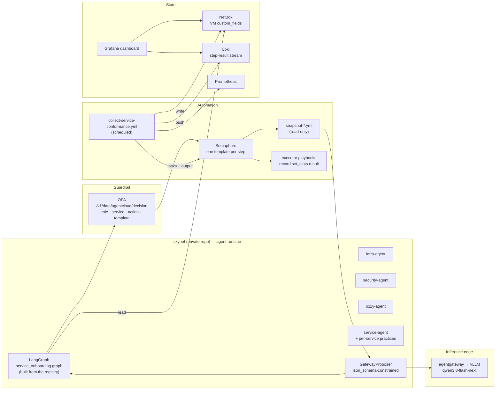

# 15 — Service Deployment Workflow & Agents

**Date:** 2026-09-22
**Status:** PROPOSED
**Author:** Joseph A. Wisneski IV
**Context:** `docs/agent-cloud-service-deploy.svg` (source: `docs/agent-cloud-service-deploy.excalidraw`)
draws the target shape of every service deployment on the platform: a fixed sequence of
steps, each owned by one of four agent roles, orchestrated through Semaphore, with three
steps where a model reasons over the live state and proposes what happens next. None of
those agents exist, roughly half of the steps have no executor or an executor with no
defined pass criteria, most deployed services never went through the flow, and nothing
records which steps a service has passed or failed. This document is the approved design
for closing that gap. It was produced in a design session on 2026-09-22; the decisions
below are the operator's, the rejected alternatives are recorded for the record, and the
deliberation behind them is retained in the Hindsight bank.

> **Depends on:** 01 (secrets), 02 (SSO), 03 (guardrails), 04 (NetBox), 05 (observability),
> 06 (skynet), 10 (infra resilience). **Companion repo:** the four agent roles live in the
> private `uhstray-io/skynet` repository; this document is the single design for both
> repositories and the contract lives here.

---

## Problem

1. **The workflow exists as a picture, not as code.** Eighteen steps are drawn; the repo has
   executor playbooks for eleven of them (two need an amendment) and nothing for seven.
   No file lists the steps, their order, their owner, or what "passed" means for each.
2. **The three reasoning steps have no precedent in this repo.** The only model-in-the-loop
   flow that exists is Build #1 (`create-netbox-device.yml`): skynet proposes a JSON
   document, its OPA call gates the logical action, Semaphore executes an idempotent
   playbook that takes the proposal unchanged. That shape works and is the one to
   generalise; nothing else does.
3. **Existing services drifted.** Twenty-one services have a deploy playbook. Verified gaps
   against the drawn flow: no provisioned VM has `onboot` set (zero hits in
   `provision-vm.yml`), no service sets OTEL exporter variables, Alloy has no OTLP receiver
   (a comment at `config.alloy:7`), Prometheus scrapes only itself, systemd enablement is
   `enable-linger` alone, and firewall rules come from inventory with no assessment step.
4. **No tracking.** Status lives in prose (`AGENTS.md` "Completed / In Progress") and in
   Semaphore task history that is not queryable across services. A service that failed a
   step has no record of which step, or why.
5. **The picture is incomplete.** The platform requires steps the drawing omits: the edge
   route (Caddy, Cloudflare DNS), secret seeding and AppRole provisioning, backup of keys
   and credentials to site-config, and a rollback path.

## Decisions recorded 2026-09-22

| # | Decision | Rejected | Why the rejected option lost |
|---|---|---|---|
| D1 | The four agents are **skynet LangGraph roles**; skynet owns the per-service workflow graph and calls Semaphore for every step | Semaphore-native LLM steps (a playbook calling `/v1`); Claude Code sessions driving Semaphore | skynet is already the runtime for OPA identities and holds `semaphore: run_task`; a playbook-embedded LLM call has no place for graph state, and a workstation-driven loop is a defect under the platform rules |
| D2 | **One model** at the inference edge, currently the live vLLM profile `qwen3.8-flash-next-nvfp4`, with a **replayable eval harness** per reasoning step | No harness; comparing two models first | Schema and OPA validation prove shape, not judgement; a harness is what lets the gate loosen later with evidence |
| D3 | **OPA is the only gate** on proposals. The rego rule that requires `human_approved` for destructive templates stays | Human approval on all three reasoning steps; on security steps only | Operator's call; the propose-validate-execute invariant is intact because OPA validates and Semaphore executes, and the human gate remains where the blast radius is a wipe |
| D4 | **Tracking:** a scheduled collector writes per-step status to **NetBox custom fields** and to **Loki**; a provisioned **Grafana dashboard** is the MVP view; a **standalone dashboard service** is the long-term outcome, onboarded through this workflow | Committed status YAML; Semaphore history alone; tududi tasks | Operator's call; the collector is the single NetBox writer so a NetBox outage never blocks a deploy, and Loki gives history without a Grafana plugin |
| D5 | **Order:** backfill **agentgateway** end to end, then a read-only **assessment sweep** of all services, then a **greenfield pilot** | Greenfield first; sweep first | agentgateway is already at step 8 on a live branch (VM provisioned, keyed, hardened), so it is the cheapest real run |
| D6 | **Omitted steps are added** to the workflow and to the Excalidraw source | Fold under existing boxes; out of scope | A step that is not drawn is not reviewed |
| D7 | **Four new OPA identities** matching the drawing: `infra-agent`, `security-agent`, `o11y-agent`, `service-agent`. `netclaw` and `nemoclaw` are **not used as agents going forward**; all agents are skynet roles | Map onto netclaw/nemoclaw; one `skynet` identity | Least privilege per role and per-role audit; the legacy roles' catalog entries are frozen, not widened |
| D8 | The **service agent is one central personality with per-service practices**. Personality in skynet; practices in the service's own `context/` directory in this repo | One prompt per service | The service owns its knowledge; skynet stays generic |
| D9 | **Existing configuration and automation are the default path.** For a service that exists in the estate the workflow converges with what is declared and validates it; **no PR is opened unless an assessment finds a fix or a configuration change**, or the service is new. Then the PR process applies | Proposals write declared state directly; a PR on every proposal | Direct writes break config-as-code; a PR on every run is noise that hides the real findings |
| D10 | **Every existing step is reviewed against explicit criteria** before it is trusted in the graph; the registry records the review date | Trust existing playbooks as-is | An executor that "works" with no stated pass condition cannot report a failure |
| D11 | **Agents read deployment state.** Every node receives the run's prior step results and the registry entries for its current and next steps; read tools are NetBox custom fields and Semaphore `check_task` | Stateless nodes | The reasoning steps must know what already happened to this service |

## Design Principles

1. **AI proposes, OPA validates, Semaphore executes** (`PRINCIPLES.md` §4;
   `plan/architecture/01-automation-model.md` §8). No agent runs a command on a host, edits
   a file, or calls a service API directly. Every action is a named Semaphore template
   launched after an OPA decision.
2. **Snapshot in, proposal out.** Each reasoning step is a pure function from one
   read-only JSON snapshot to one schema-validated proposal. That is what makes it
   testable, replayable, and auditable.
3. **Idempotent steps that say what they did.** Every executor is safe to re-run and ends
   with one machine-readable result line. Silence is a failure.
4. **One registry, three readers.** The step registry is read by skynet to build the graph,
   by the collector to score, and by the review checklist. It is the only definition of the
   workflow.
5. **Single writer per store.** Only the collector writes NetBox custom fields and Loki.
   Only Semaphore-run playbooks write hosts. Only PRs write declared state.
6. **Foundational over one-shot.** A gap found in one service's step is fixed in the
   executor every service uses (`AGENTS.md`, Engineering Principles).

## Architecture



### The reasoning-step rule (D3 + D9)

A validated proposal is one of two things:

- **A runtime action.** "Run template *T* with arguments *A*." Executes immediately when
  OPA allows `{agent, service, action: run_task, template_name: T}`.
- **A finding that declared state must change.** A VM spec, a firewall variable, an
  Authentik blueprint, a service env template. The workflow records the finding with the
  proposed diff, marks the step `fail: change-required`, and the change goes through the
  PR process. The executor that converges declared state (`resize-vm.yml`,
  `apply-firewall.yml`, `deploy-authentik.yml`) runs after the merge.

For a service already in the estate the expected outcome of every reasoning step is "the
declared state is right, run the converge template". A proposal of the second kind is a
finding, which is exactly what the sweep (Phase 6) is for.

## Workflow

Twenty-two steps: the eighteen drawn plus four added under D6 (marked **added**). Owner is
the OPA identity that may launch the step. "Executor" names the Semaphore-run playbook;
status is verified against the tree on 2026-09-22.

| # | Step | Owner | Executor | Status | Criteria (pass condition) |
|---|---|---|---|---|---|
| 1 | VM Template | infra-agent | `provision-template.yml` | exists | template vmid present on the declared node, cloud-init drive attached |
| 2 | Lookup Inventory | infra-agent | `lookup-service-inventory.yml` (read-only: declared spec from site-config `vm-specs.yml` + inventory host vars + NetBox IPAM record for the declared address) | **new** | declared address exists in NetBox with status reserved or active and no other VM claims it |
| 3 | Validate against ARP → Inventory Update | infra-agent | `validate-address-free.yml` (pfSense ARP via the existing `get_arp_table()` path + NetBox IP status; refuses a live address); VM record via a virtual-machine variant of `create-netbox-device.yml` | **new + amend** | address absent from ARP before provisioning; NetBox VM object exists after |
| 4 | Provision VM + Start on boot | infra-agent | `provision-vm.yml`; **amend** to set `onboot` in the config PUT | amend | VM running on the declared node with declared cores/memory/disk; `onboot` is 1 |
| 5 | Cloud-init OS | infra-agent | inside `provision-vm.yml`; `tasks/wait-for-apt.yml` | exists | cloud-init finished; SSH answers on the declared address with the bootstrap identity |
| 6 | SSH Key Creation & Distribution | infra-agent | `generate-service-ssh-key.yml`, `distribute-ssh-keys.yml` | exists | pair at `secret/services/ssh/<service>`; public half authorized; key login proven |
| 7 | **Back up SSH key** (added) | infra-agent | `backup-service-ssh-key.yml` | exists | pair present in site-config on a pushed branch; report names only |
| 8 | Access harden | security-agent | `verify-host-access.yml` → `harden-ssh.yml` | exists | key-only access proven before password auth is withdrawn; sshd rejects password; NOPASSWD sudo |
| **9** | **Service Assess** (reasoning) | service-agent | `snapshot-service-assess.yml` → proposal `service-assessment` | **new** | proposal valid against schema; names an existing deploy template for an existing service |
| 10 | VM Rightsize | infra-agent | `resize-vm.yml` (converges to declared); a spec change is a finding → site-config PR | exists | live cores/memory/disk equal declared |
| 11 | **Secrets seed + AppRole** (added) | service-agent | `seed-openbao-key.yml`, `tasks/manage-approle.yml`; verified by `check-secrets.yml` | exists | every `existing`-typed secret present and non-empty; AppRole present with the service policy |
| 12 | Instrument OS/Infra Observability | o11y-agent | `instrument-host-o11y.yml` (node-exporter + Alloy on the host → o11y); **requires the OTLP receiver in Alloy** | **new; blocked on o11y phase 2** | host series present in Prometheus within one scrape interval |
| 13 | Service Deployment | service-agent | `deploy-<service>.yml` | exists | deploy verify phase green; second run reports no change |
| 14 | Service Validate | service-agent | deploy verify phase + `validate-all.yml`; `preflight-target-group.yml` before | exists | health URI 200 through the declared path |
| 15 | **Edge route** (added) | service-agent | `manage-caddy-sites.yml`; prod DNS via `apply-cloudflare-tofu.yml` | exists | hostname resolves; route answers through Caddy; tofu plan is zero-diff |
| **16** | **FW Assess** (reasoning) | security-agent | `snapshot-firewall.yml` (listening sockets, ufw state, published container ports, inventory firewall vars, Caddy upstream) → proposal `firewall-policy` | **new** | proposal valid; every allow rule maps to a listening socket with a declared consumer |
| 17 | FW Harden | security-agent | `apply-firewall.yml` (from inventory); a rule change is a finding → site-config PR | exists | ufw active, default deny inbound, allows equal declared; SSH still answers |
| 18 | Instrument Service Observability | service-agent + o11y-agent | OTEL env vars in the service env template (`OTEL_EXPORTER_OTLP_ENDPOINT`, `OTEL_SERVICE_NAME`, per `06-observability-instrumentation.md`) + a `scrape.d` fragment; verify series present | **new per service** | at least one series labelled with the service present in Prometheus |
| 19 | Systemd enablement | infra-agent | `tasks/enable-linger.yml`; **amend** with a restart-policy check on every container | exists + amend | linger enabled; every container `restart: unless-stopped` or a systemd unit; optional reboot test |
| **20** | **Role & Access Assessment** (reasoning) | service-agent + security-agent | `snapshot-access.yml` (Authentik `app-catalog.yml` entry, blueprint present, OpenBao policy for the AppRole, OPA catalog entry, auth mode from practices) → proposal `access-policy` | **new** | proposal valid; auth mode matches practices; groups exist |
| 21 | OIDC Configuration → Authentik Update | security-agent | `deploy-authentik.yml` applies blueprints; a new or changed blueprint is a finding → agent-cloud PR | exists | blueprint record `successful`; provider redirect URI verified (existing verify script) |
| 22 | **Credential backup** (added) | security-agent | `backup-credentials-to-site-config.yml` | exists | named fields present in site-config on a pushed branch |

**Rollback lane (cross-cutting).** Each registry entry names its undo template where one
exists: `destroy-vm.yml` (steps 3-5), `snapshot-vm.yml` before 13, the service's
`clean-deploy-*.yml` (destructive: `human_approved` required), DB restores where a service
has one. Steps with no undo carry `undo: none` and the collector reports them so the gap is
visible rather than assumed.

## Contracts

All schemas live in this repo under
`platform/workflows/service-onboarding/schemas/`, next to the registry. skynet references them by path; there is one source.
(Revised 2026-09-22: the first draft put them in the OPA policy tree, where OPA loads every
JSON file as data; `opa test` failed with `merge error` on them.)

### Step result (`step-result.json`)

Every executor records one result through Ansible's run statistics, which also run under
check mode (`plan/architecture/08-ansible-automation-standards.md`). The shared task
`tasks/emit-step-result.yml` calls `ansible.builtin.set_stats`; with
`ANSIBLE_SHOW_CUSTOM_STATS=true` the task output ends with:

```text
CUSTOM STATS: ******************************************************************
	RUN: { "step_result": { "schema": "agentcloud/step-result/v1", "workflow_id": "…", "service": "agentgateway", "step": "fw-harden", "status": "pass", "evidence": { "ufw_active": true, "allows": […] }, "error": null, "undo": "none" }}
```

`status` is `pass`, `fail`, or `skip`. A Semaphore task that ends non-zero with no result is
recorded as `fail` with the last twenty output lines as context. (Revised 2026-09-22: the
first draft printed a `STEP-RESULT` marker with `debug`, whose default rendering escapes
the embedded JSON.)

### Proposal envelope (`proposal-envelope.json`)

The Build #1 shape, generalised:

```json
{
  "schema": "agentcloud/proposal/v1",
  "workflow_id": "…", "service": "…", "step": "service-assess",
  "proposed_by": "service-agent", "idempotency_key": "…", "reason": "…",
  "snapshot_sha256": "…",
  "proposal": { }
}
```

`proposed_by`, `workflow_id`, `idempotency_key` and `snapshot_sha256` are injected by the
orchestrator, never produced by the model (skynet's proposer already strips injected fields
from the grammar schema). Three bodies:

| Schema | Produced at | Body |
|---|---|---|
| `service-assessment.json` | step 9 | `vm_spec {cores, memory_mb, disk_gb}`, `deploy_template`, `runtime` (podman/docker), `expected_ports[]`, `depends_on[]`, `readiness_checks[]`, `risks[]`, `verdict` (`converge` or `change-required` with `diff`) |
| `firewall-policy.json` | step 16 | `allow[] {port, proto, source, consumer, justification}`, `deny_egress[]`, `verdict` |
| `access-policy.json` | step 20 | `auth_mode` (oidc, forward_auth, api_key, none), `authentik_app {slug, groups[]}`, `openbao_policy_paths[]`, `opa_actions {}`, `findings[]`, `verdict` |

### Snapshot templates

Read-only Semaphore templates that emit exactly one JSON document and nothing else on
their last line. They gather host facts over the existing SSH path and read the service's
`context/agent-practices.md`, the inventory host vars, the registry entries for the current
and next step, and the run's prior step results (from the graph state). Their output is the
only input to the model. Snapshots are recorded on every run; the eval harness replays
them.

### OPA

`data.json` gains four identities. Each has `allowed_actions` and a new
`allowed_templates` list; a new rego rule denies `run_task` when `template_name` is not in
the caller's list. The destructive-template `human_approved` rule is unchanged. `netclaw`
and `nemoclaw` entries are frozen with a comment that they are no longer agent runtimes
(D7).

| Identity | `allowed_actions` | `allowed_templates` (by step) |
|---|---|---|
| `infra-agent` | semaphore: run_task, check_task; netbox: read, create, update (step 3 VM record) | 1-7, 10, 19 |
| `security-agent` | semaphore: run_task, check_task; netbox: read | 8, 16-17, 20-22 |
| `o11y-agent` | semaphore: run_task, check_task; netbox: read | 12, 18 |
| `service-agent` | semaphore: run_task, check_task; netbox: read | 9, 11, 13-15, 18, 20 |

### Registry (`platform/workflows/service-onboarding/registry.yml`)

One entry per step:

```yaml
- id: fw-harden
  order: 17
  owner: security-agent
  executor: "Apply Firewall"          # Semaphore template name
  snapshot: null                       # or the snapshot template name (reasoning steps)
  undo: none
  policy: required                     # required | advisory
  criteria:
    - ufw active with default deny inbound
    - allow set equals the declared inventory set
    - SSH answers after apply
  evidence_keys: [ufw_active, allows]
  reviewed: null                       # date the D10 review passed
```

## Agents (skynet repository)

- **Role packs** at `roles/<role>/`: `ROLE.md` (personality, boundaries, what the role may
  never propose), `steps/<step-id>.md` per owned step (instructions, the criteria it checks,
  the snapshot fields it reads, the schema it emits), `evals/<step-id>/cases/*.json`.
- **Service agent** (D8): `roles/service-agent/ROLE.md` is the central personality. Each
  service in this repo carries `platform/services/<name>/context/agent-practices.md`: ports,
  auth mode, health signals, known quirks, undo path, what "healthy" means. The snapshot
  template ships that file into the node.
- **Graph** `service_onboarding`, built from the registry at start. Deterministic node: OPA
  decision → `run_task` → poll `check_task` → parse the step result from `CUSTOM STATS`. Reasoning node: snapshot
  `run_task` → `GatewayProposer` with the facts schema as `response_format json_schema`
  (vLLM enforces the grammar) → validate against the full schema → OPA → executor
  `run_task`, or record a `change-required` finding. Node context always carries prior
  results and the current and next registry entries (D11).
- **Step policy.** `required` halts the run on fail; `advisory` records and continues. The
  run record is one JSON document per service run, kept by skynet and mirrored into Loki by
  the collector via the step results.
- **Eval harness** at `bench/service_onboarding/`: replays recorded snapshots against the
  live edge under a dedicated identity `client_skynet-eval` and the pinned served model.
  Per reasoning step: schema validity rate, decision match against golden (`verdict` and
  the key fields), forbidden-action rate (a destructive template proposed without the
  flag, a port with no consumer). Thresholds gate skynet CI. The first cases are recorded
  from the agentgateway backfill (Phase 5).

## Tracking

- **Review** (D10). For each existing executor a checklist: criteria written into the
  registry, idempotent re-run proven, step result recorded, undo named or `none`, BATS
  guard for the emitter. `reviewed:` is stamped when all five hold.
- **Collector** `collect-service-conformance.yml`, a scheduled Semaphore template
  (`schedule:` in `templates.yml`, the same mechanism the tududi token refresh uses).
  Reads: Semaphore `GET /project/{id}/tasks` and `GET /project/{id}/tasks/{task_id}/output`
  for step results; Prometheus for the observability criteria; NetBox for the VM
  record. Writes: NetBox custom fields on the VM object (`ac_workflow_status` JSON of
  per-step status, `ac_failed_steps`, `ac_last_run`) and one Loki line per step result via
  `POST /loki/api/v1/push` with labels `service`, `step`, `status`. Nothing else writes
  either.
- **Dashboard (MVP)** `platform/services/o11y/deployment/config/grafana/dashboards/service-conformance.json`:
  service-by-step matrix from Loki, failure panel (error excerpt, criteria not met, undo
  available, Semaphore task link), "never assessed" list. Authentik already fronts Grafana.
- **Failure report** `report-service-conformance.yml`, read-only: per service, the failed
  steps with context. Same data as the dashboard, for a Semaphore run or a PR comment.
- **Long term** (D4): a standalone dashboard service reading the same three sources,
  onboarded through this workflow as its dogfood case. Separate change.

## Interfaces: MCP, API, CLI

| Path | Interface | Why |
|---|---|---|
| skynet → Semaphore | REST (`run_task`, `check_task`, task output) | Already the catalog actions; deterministic; auditable per task |
| skynet → OPA | REST `POST /v1/data/agentcloud/decision` | Existing client `policy/opa.py` |
| skynet → inference | OpenAI-compatible `/v1` through agentgateway with `response_format json_schema` | Server-enforced structure; per-identity key and budget |
| Reasoning step inputs | Fixed snapshot templates, not agent tool-calling | Pure function, replayable, cheaper; no open-ended tool access from a model |
| Agent state reads | NetBox REST (`custom_fields`), Semaphore `check_task` | Read-only, already in `allowed_actions` |
| Collector → sources | REST via `ansible.builtin.uri` (the repo idiom) | No new client library |
| Operator surface | MCP later: `grafana/mcp-grafana` (planned in `06-observability-instrumentation.md`), a Semaphore MCP for Claude Code sessions | Human-driven exploration, not the workflow path |
| Inside templates | CLI (`ansible-playbook`, `tofu`, `podman`) | Unchanged |

## Implementation Phases

### Phase 0: Prerequisites and verifications

**Goal:** remove the unknowns the design depends on.

**Tasks:**
1. Pin the Semaphore image (`platform/services/semaphore/deployment/compose.yml` is `:latest`); the collector depends on its API.
2. Verify NetBox virtual machines accept custom fields and record the create endpoint; create the three fields as code (a playbook, not the UI).
3. Verify agentgateway passes `response_format` through to vLLM unchanged (open task in the gateway change).
4. Provision the NetBox automation token in live OpenBao (`provision-netbox-automation-token.yml`; recorded absent in `04-netbox-discovery.md`).
5. Add `skynet-eval` to `agw_clients` and hand out the key via the credential backup.

**Acceptance criteria:** each item has a dated evidence line in this document's revision history.

### Phase 1: Registry, contracts, review, diagram

**Goal:** the workflow exists as code and every existing step has criteria.

**Tasks:**
1. `platform/workflows/service-onboarding/registry.yml` with all 22 entries.
2. The five schemas and `tasks/emit-step-result.yml`; BATS guard that every registry executor includes it.
3. D10 review of the 15 existing executors (13 as-is, 2 with amendments); `onboot` amendment in `provision-vm.yml`; restart-policy check beside `enable-linger`.
4. Four OPA identities, `allowed_templates`, the new rego rule, rego tests; freeze `netclaw`/`nemoclaw`.
5. Update `docs/agent-cloud-service-deploy.excalidraw` to the 22 steps and re-export the SVG.

**Acceptance criteria:** `openspec validate` green; rego tests green; every existing step `reviewed:`; diagram and registry list the same 22 ids.

### Phase 2: Tracking MVP

**Goal:** any operator can see which steps any service has passed.

**Tasks:** collector, NetBox custom fields as code, Loki push, Grafana dashboard JSON, failure report, Semaphore schedule, BATS guards.

**Acceptance criteria:** after one scheduled run the dashboard shows every service with a deploy playbook; a deliberately failed step appears with its excerpt within one schedule interval.

### Phase 3: New executors

**Goal:** every step has an executor.

**Tasks:** `lookup-service-inventory.yml`, `validate-address-free.yml`, NetBox VM record variant, three snapshot templates, `instrument-host-o11y.yml` with the Alloy OTLP receiver (coordinate with the `inference-telemetry-production` change and `05-observability.md` phase 2), per-service OTEL wiring pattern proven on one service.

**Acceptance criteria:** each new template is idempotent (second run no change), records a step result, has a BATS test, and a snapshot template's output validates against its snapshot schema.

### Phase 4: skynet roles, graph, eval harness

**Goal:** the four roles run the graph against local-dev.

**Tasks:** role packs, `agent-practices.md` for agentgateway, graph built from the registry, proposer wiring with the three facts schemas, eval harness with recorded snapshots, CI thresholds, `docs/agent-cloud-requirements.md` updated in skynet.

**Acceptance criteria:** a dry run of the graph against local-dev Semaphore completes steps 9-22 for agentgateway with every proposal schema-valid; eval thresholds pass on the recorded cases.

### Phase 5: Backfill agentgateway end to end

**Goal:** the first real run.

**Tasks:** local-dev run of the graph; record snapshots as eval cases; prod run when the operator is on the network; every finding becomes a PR or a registry correction.

**Acceptance criteria:** the dashboard shows agentgateway green on all `required` steps or a named finding per red step.

### Phase 6: Assessment sweep

**Goal:** the gap report for the estate.

**Tasks:** run steps 9, 16, 20 in snapshot-and-assess mode (no executors) across every service with a deploy playbook; collector records; report generated.

**Acceptance criteria:** one report listing, per service, every failed step with context; findings triaged into PRs or accepted exceptions recorded in the registry.

### Phase 7: Greenfield pilot

**Goal:** a new service through all 22 steps. Candidate chosen by the operator from the empty service directories (`nextcloud`, `wikijs`, `a2a-registry`).

**Acceptance criteria:** all 22 steps pass; the service's `agent-practices.md` and deploy playbook were produced through the PR process the workflow opened.

## Validation Criteria

| Check | Pass Condition |
|---|---|
| Registry completeness | 22 entries; every executor template name exists in `templates.yml`; every reasoning step names a snapshot template and a schema |
| Emitter coverage | BATS: every registry executor includes `tasks/emit-step-result.yml` |
| Idempotency | second run of every executor reports no change |
| OPA least privilege | rego tests: each identity can `run_task` only its `allowed_templates`; destructive templates still need `human_approved` |
| Proposal validity | every recorded proposal validates against its schema; eval schema-validity rate at threshold |
| Tracking freshness | a failed step is visible on the dashboard within one collector interval with task id and excerpt |
| Single writer | grep guard: no playbook other than the collector writes `custom_fields` or pushes to Loki |
| Diagram parity | the Excalidraw element labels and the registry ids match one-to-one |

## Security Considerations

- **No model touches a host.** Every action is a Semaphore template after an OPA decision; snapshot templates are read-only and their output carries no secret values (only names and presence, the `check-secrets.yml` convention).
- **Least privilege per role.** `allowed_templates` bounds each identity to its steps; the destructive gate is unchanged; `netclaw`/`nemoclaw` are frozen, not deleted, so existing catalog history stays auditable.
- **Blast radius of a wrong proposal** is bounded to what the named template can do, which is already reviewed code. A `change-required` finding never applies itself.
- **Collector credentials:** Semaphore API token, NetBox automation token and Loki push are read from OpenBao under the controller AppRole with `no_log` on the credential tasks only.
- **Eval identity** `client_skynet-eval` has its own token budget at the gateway, so a runaway harness cannot starve the platform.
- **Snapshots may contain topology** (ports, hostnames). They are stored in skynet's private repo as eval cases, never in this public repo; the registry and schemas here carry no addresses.
- **Prompt injection surface:** the only free text a model sees comes from the snapshot, which is built from files and command output the platform already controls. `agent-practices.md` is committed, reviewed content.

## Open items carried into the plan

| Item | Why it is open |
|---|---|
| NetBox VM custom fields | The docs say not all models support custom fields; VM support not verified this session |
| agentgateway `response_format` passthrough | Recorded as unverified in the gateway change |
| Alloy OTLP receiver | Steps 12 and 18 depend on o11y phase 2, tracked in `05-observability.md` and the `inference-telemetry-production` change |
| Semaphore API auth for the collector | Token source and scope to be decided when the image is pinned |
| Greenfield candidate | Operator picks in Phase 7 |

## Cross-references

| Document | Relationship |
|---|---|
| `docs/agent-cloud-service-deploy.svg` / `.excalidraw` | The drawn workflow this plan implements |
| `PRINCIPLES.md` §4; `plan/architecture/01-automation-model.md` §8 | The propose-validate-execute invariant this design keeps |
| `plan/development/06-inference-skynet.md` | skynet as agent runtime; roles as OPA identities |
| `plan/development/03-guardrails-governance.md` | OPA catalog, source-of-truth authorities |
| `plan/development/04-netbox-discovery.md` | Build #1 executor and the missing automation token |
| `plan/development/05-observability.md`; `plan/architecture/06-observability-instrumentation.md` | OTLP receiver, label contract, Grafana MCP |
| `plan/architecture/02-service-onboarding.md` | The checklist this workflow automates |
| `platform/playbooks/create-netbox-device.yml` | The proposal-executor precedent generalised here |
| `uhstray-io/skynet` `docs/use-case-catalog.yaml`, `docs/agent-cloud-requirements.md` | Catalog entries `deploy-approved-service`, `review-data-gaps`; N3 resolved as model A |
| root `AGENTS.md` | Critical deployment rules, credential handling, branch workflow |

## Revision History

| Date | Change |
|---|---|
| 2026-09-22 | Initial design, approved in session; decisions D1-D11 recorded |
| 2026-09-22 | Step results via `set_stats` instead of a `debug` marker line; OpenSpec change `service-deployment-workflow` carries implementation |
